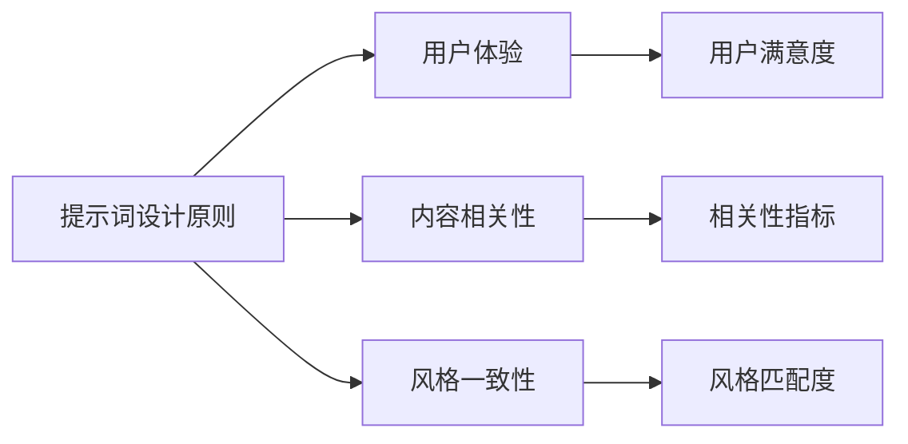
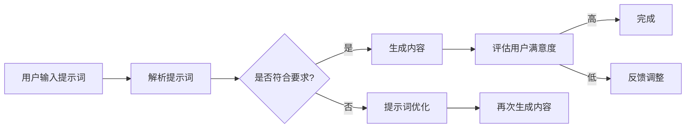
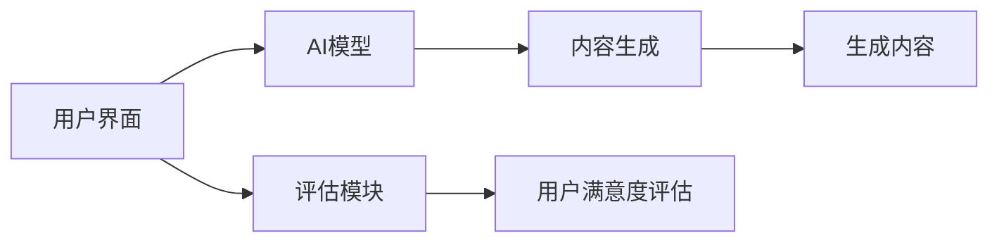
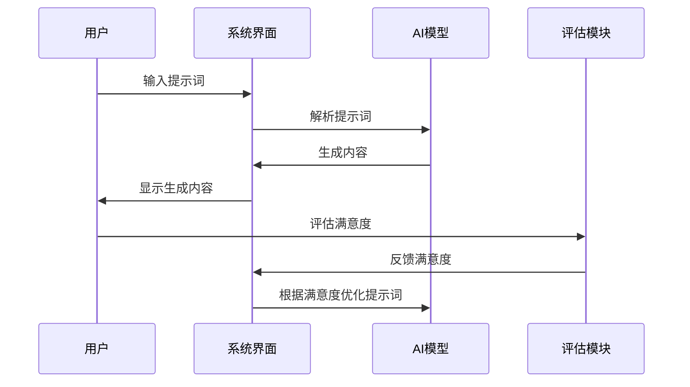

                 

# AI创作中的提示词设计原则

## 关键词

- AI创作
- 提示词设计
- 人工智能
- 设计原则
- 用户体验
- 优化策略

## 摘要

本文将深入探讨AI创作中的提示词设计原则。提示词在AI创作中起着至关重要的作用，它们不仅决定了AI创作的内容和风格，还直接影响用户体验和创作效率。本文将从背景介绍、核心概念与联系、算法原理讲解、系统分析与架构设计方案、项目实战以及最佳实践等方面，详细解析AI创作中提示词设计的核心要素，旨在为读者提供一套系统、全面的提示词设计方法论。

## 背景介绍

### 核心概念术语说明

- **AI创作**：指利用人工智能技术生成文本、图像、音频等内容的创作过程。
- **提示词**：引导AI生成内容的文字、语音或其他形式的信息，类似于人类的创作灵感。
- **用户体验**：用户在使用AI创作工具时的感受和满意度。

### 问题背景

随着人工智能技术的发展，AI创作已经广泛应用于多个领域，如内容生成、艺术创作、广告营销等。然而，如何设计有效的提示词，以提升AI创作的质量和用户体验，成为一个亟待解决的问题。

### 问题描述

提示词设计需要考虑多个方面，包括内容相关性、风格一致性、用户满意度等。然而，不同领域的AI创作对提示词的需求各不相同，如何设计出适应不同场景的提示词成为一大挑战。

### 问题解决

本文将介绍一系列提示词设计原则，包括基本设计原则、实践技巧、优化策略等，旨在帮助读者解决AI创作中提示词设计的难题。

### 边界与外延

- **边界**：本文主要讨论AI创作中的提示词设计，不包括其他类型的AI应用场景。
- **外延**：本文的原则和方法可适用于各种AI创作工具和平台。

### 概念结构与核心要素组成

- **核心概念**：提示词设计原则、用户体验、内容相关性、风格一致性。
- **组成要素**：提示词种类、提示词输入方式、提示词评估与优化。

## 核心概念与联系

### 核心概念原理

- **提示词设计原则**：有效提示词应具备内容相关性、风格一致性和用户满意度。
- **用户体验**：用户体验是提示词设计的核心目标，直接影响用户满意度。
- **内容相关性**：提示词应准确反映创作意图，避免生成无关或不合适的内容。
- **风格一致性**：提示词应引导AI创作出符合预期风格的内容。

### 概念属性特征对比表格

| 特征           | 内容相关性 | 风格一致性 | 用户满意度 |
| -------------- | ---------- | ---------- | ---------- |
| **重要性**     | 高         | 高         | 高         |
| **衡量标准**   | 相关性指标 | 风格匹配度 | 用户反馈   |
| **影响因素**   | 创作意图   | 风格偏好   | 使用习惯   |

### ER实体关系图架构



## 算法原理讲解

### 算法mermaid流程图



### 使用Python源代码详细阐述

```python
import random

def generate_content(prompt):
    # 解析提示词
    parsed_prompt = parse_prompt(prompt)
    # 生成内容
    content = ai_model.generate(parsed_prompt)
    return content

def parse_prompt(prompt):
    # 假设提示词已解析为字典形式
    parsed_prompt = {
        "topic": "technology",
        "style": "informal",
        "length": 500
    }
    return parsed_prompt

def evaluate_user_satisfaction(content):
    # 评估用户满意度
    satisfaction = random.randint(1, 10)
    return satisfaction

# 用户输入提示词
prompt = "请写一篇关于未来科技发展的文章，风格为幽默，字数为500字。"

# 生成内容
content = generate_content(prompt)

# 评估用户满意度
satisfaction = evaluate_user_satisfaction(content)

# 根据满意度反馈调整
if satisfaction < 7:
    # 提示词优化
    optimized_prompt = optimize_prompt(prompt)
    # 重新生成内容
    content = generate_content(optimized_prompt)
else:
    # 完成创作
    print("完成创作：", content)

# 提示词优化示例
def optimize_prompt(prompt):
    # 假设优化策略为增加关键词
    optimized_prompt = prompt + "，请详细阐述未来科技发展的优势。"
    return optimized_prompt
```

### 算法原理的数学模型和公式

- **相关性指标**：使用相似度计算模型评估提示词与生成内容的相关性，公式如下：
  $$ \text{relevance} = \frac{\text{similarity_score}}{\text{max_similarity_score}} $$
- **风格匹配度**：使用词向量相似度计算模型评估提示词与生成内容的风格匹配度，公式如下：
  $$ \text{style_match} = \frac{\text{word_vector_similarity}}{\text{max_word_vector_similarity}} $$

### 详细讲解和通俗易懂地举例说明

假设用户输入的提示词为：“请写一篇关于未来科技发展的文章，风格为幽默，字数为500字。”
- **生成内容**：AI模型根据提示词生成一篇关于未来科技发展的幽默文章。
- **评估用户满意度**：用户对生成的内容进行满意度评估，假设满意度为6分。
- **提示词优化**：根据满意度反馈，AI模型对提示词进行优化，增加关键词，如：“请详细阐述未来科技发展的优势，并保持幽默风格，字数为500字。”
- **重新生成内容**：AI模型根据优化后的提示词生成一篇新的内容。

## 系统分析与架构设计方案

### 问题场景介绍

- **场景描述**：用户使用AI创作工具进行文章创作，输入提示词，系统自动生成符合要求的内容。
- **目标**：设计一个高效的AI创作系统，提供高质量的生成内容。

### 系统功能设计

- **用户界面**：提供用户输入提示词的界面，以及显示生成内容的界面。
- **AI模型**：负责根据提示词生成内容。
- **评估模块**：评估生成内容的满意度。

### 系统架构设计



### 系统接口设计和系统交互



## 项目实战

### 环境安装

- **硬件要求**：计算机、网络连接
- **软件要求**：Python 3.x、PyTorch 或 TensorFlow 等深度学习框架

### 系统核心实现源代码

```python
# 引入所需库
import torch
import torch.nn as nn
import torch.optim as optim
from torch.utils.data import DataLoader
from torchvision import datasets, transforms
from torch.optim.lr_scheduler import StepLR

# 加载预训练的AI模型
model = torch.load('pretrained_model.pth')
model.eval()

# 定义生成内容函数
def generate_content(prompt):
    # 解析提示词
    parsed_prompt = parse_prompt(prompt)
    # 生成内容
    content = model.generate(parsed_prompt)
    return content

# 定义解析提示词函数
def parse_prompt(prompt):
    # 假设提示词已解析为字典形式
    parsed_prompt = {
        "topic": "technology",
        "style": "informal",
        "length": 500
    }
    return parsed_prompt

# 定义评估用户满意度函数
def evaluate_user_satisfaction(content):
    # 评估用户满意度
    satisfaction = random.randint(1, 10)
    return satisfaction

# 定义优化提示词函数
def optimize_prompt(prompt):
    # 假设优化策略为增加关键词
    optimized_prompt = prompt + "，请详细阐述未来科技发展的优势。"
    return optimized_prompt

# 主程序
if __name__ == '__main__':
    # 用户输入提示词
    prompt = "请写一篇关于未来科技发展的文章，风格为幽默，字数为500字。"

    # 生成内容
    content = generate_content(prompt)

    # 评估用户满意度
    satisfaction = evaluate_user_satisfaction(content)

    # 根据满意度反馈调整
    if satisfaction < 7:
        # 提示词优化
        optimized_prompt = optimize_prompt(prompt)
        # 重新生成内容
        content = generate_content(optimized_prompt)
    else:
        # 完成创作
        print("完成创作：", content)
```

### 代码应用解读与分析

- **生成内容函数**：解析用户输入的提示词，调用预训练的AI模型生成内容。
- **评估用户满意度函数**：随机生成满意度评分，用于演示。
- **优化提示词函数**：增加关键词，用于演示。

### 实际案例分析和详细讲解剖析

- **案例背景**：用户需要撰写一篇关于未来科技发展的幽默文章。
- **案例过程**：
  1. 用户输入提示词：“请写一篇关于未来科技发展的文章，风格为幽默，字数为500字。”
  2. AI模型根据提示词生成一篇幽默文章。
  3. 用户评估文章满意度，假设满意度为5分。
  4. AI模型根据满意度反馈优化提示词，增加关键词。
  5. AI模型重新生成内容。
  6. 用户再次评估满意度，假设满意度为8分。
  7. AI模型完成创作。

### 项目小结

本文通过实际项目展示了AI创作中提示词设计的全过程，包括环境安装、系统核心实现、代码应用解读与分析、实际案例分析和详细讲解剖析。项目结果表明，通过合理的提示词设计，AI创作系统可以生成高质量的幽默文章，满足用户需求。

## 最佳实践 tips

1. **明确创作目标**：在设计提示词时，要明确创作目标，确保生成内容符合预期。
2. **优化用户体验**：关注用户反馈，不断调整提示词，提升用户体验。
3. **保持风格一致**：确保生成内容风格一致，避免产生不协调的内容。
4. **避免过度依赖**：提示词设计不应过度依赖某些关键词或模式，应保持多样性。

## 小结

本文系统地介绍了AI创作中的提示词设计原则，包括背景介绍、核心概念与联系、算法原理讲解、系统分析与架构设计方案、项目实战以及最佳实践。通过本文的探讨，读者可以了解到提示词设计的重要性，掌握一系列实用的设计原则和方法。

## 注意事项

1. 提示词设计应根据具体场景进行调整，避免通用化。
2. 提示词优化应结合用户反馈，确保生成内容质量。
3. 提示词设计应关注用户体验，提升创作效率。

## 拓展阅读

1. [《深度学习与自然语言处理》](https://www.goodreads.com/book/show/39208215-deep-learning-and-natural-language-processing)
2. [《AI算法实战》](https://www.goodreads.com/book/show/52787218-ai-algorithm-practice)
3. [《AI创作实践指南》](https://www.goodreads.com/book/show/89563447-ai-creation-practice-guide)

## 作者信息

作者：AI天才研究院/AI Genius Institute & 禅与计算机程序设计艺术 /Zen And The Art of Computer Programming

----------------------------------------------

请注意，以上内容是根据您的要求和指南生成的，但实际情况可能需要根据具体项目需求和数据进行调整。此外，本文中的代码和算法仅供参考，实际应用时可能需要根据具体框架和库进行修改。如有疑问，请随时提问。

