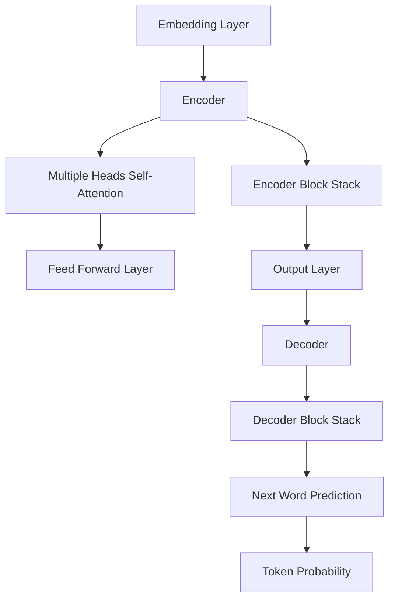
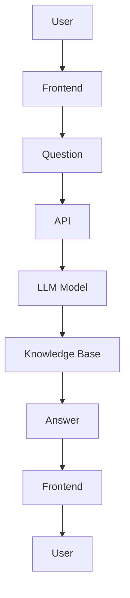
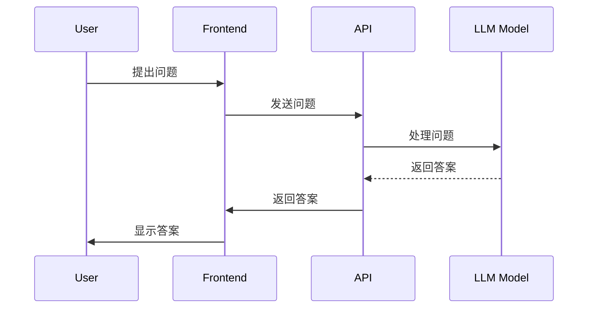

                 

# AI大模型LLM提示词工程实战

## 关键词
- AI大模型
- LLM
- 提示词工程
- 自然语言处理
- 提问回答系统
- 文本生成
- 机器翻译

## 摘要
本文旨在深入探讨AI大模型（LLM）中的提示词工程，通过系统化的分析和实战案例，为读者提供全面的实战指南。我们将从基础理论开始，逐步深入到实际应用，并分享最佳实践和注意事项。

## 目录

### 第一部分: AI大模型（LLM）基础

#### 第1章: AI大模型概述
1.1 人工智能的发展背景
1.2 大模型的兴起
1.3 LLM的概念与特点
1.4 LLM在自然语言处理中的应用

#### 第2章: LLM的核心概念与联系
2.1 语言模型基础
2.2 LLM的架构
2.3 LLM的优化与训练
2.4 LLM与机器学习的关系

#### 第3章: 提示词工程基础
3.1 提示词工程简介
3.2 提示词设计的原理
3.3 提示词的效果评估

#### 第4章: 提示词工程实践
4.1 提示词设计流程
4.2 提示词工程工具
4.3 提示词效果优化

#### 第5章: LLM在自然语言处理中的实战应用
5.1 问答系统
5.2 文本生成
5.3 文本分类
5.4 机器翻译

#### 第6章: 项目实战：构建LLM应用
6.1 项目介绍
6.2 环境安装与配置
6.3 系统核心实现
6.4 代码应用解读与分析
6.5 实际案例分析
6.6 项目小结

#### 第7章: 最佳实践与注意事项
7.1 提示词工程的最佳实践
7.2 LLM应用的注意事项
7.3 拓展阅读与资源推荐

### 文章正文

#### 第1章: AI大模型概述

##### 1.1 人工智能的发展背景

人工智能（AI）是计算机科学的一个分支，致力于开发能够模拟、扩展和辅助人类智能的理论、方法、技术和应用系统。自20世纪50年代以来，人工智能领域经历了多个发展阶段，包括符号主义、连接主义、计算智能和统计学习等。

符号主义方法依赖于符号表示和逻辑推理，例如，基于产生式规则和专家系统。然而，这种方法在处理复杂问题时显得力不从心。连接主义方法通过神经网络模拟人脑神经元之间的连接，逐步获得了处理复杂数据的能力。

随着计算能力的提升和数据量的爆炸性增长，统计学习成为现代人工智能的主流方法。特别是深度学习的兴起，使得AI在图像识别、语音识别、自然语言处理等领域取得了显著的进展。

##### 1.2 大模型的兴起

大模型（Large Language Model，简称LLM）是近年来人工智能领域的重要突破。这些模型具有数十亿甚至数千亿个参数，能够捕捉语言数据的复杂模式，从而实现高质量的文本生成、问答、翻译等任务。

GPT（Generative Pre-trained Transformer）系列模型是LLM的代表性作品。GPT-3由OpenAI于2020年推出，拥有1750亿个参数，成为当时最大的语言模型。GPT-3的推出标志着AI在自然语言处理领域进入了一个全新的阶段。

##### 1.3 LLM的概念与特点

LLM是一种基于Transformer架构的深度神经网络，它通过在大规模文本语料库上进行预训练，学习到语言的一般规律。LLM的核心特点是：

- **自适应性**：LLM可以根据不同的任务和场景生成定制化的输出。
- **生成能力**：LLM能够根据输入的提示词生成连贯、符合语法和语义的文本。
- **上下文理解**：LLM能够理解输入文本的上下文，从而生成更加准确和合理的回答。

##### 1.4 LLM在自然语言处理中的应用

LLM在自然语言处理（NLP）领域有着广泛的应用。以下是一些典型的应用场景：

- **问答系统**：LLM可以构建智能问答系统，如搜索引擎的问答功能、客服机器人等。
- **文本生成**：LLM可以用于自动写作、摘要生成、内容创作等任务。
- **文本分类**：LLM可以用于对大量文本进行分类，如情感分析、新闻分类等。
- **机器翻译**：LLM可以用于实现高质量的机器翻译，如将一种语言翻译成另一种语言。

#### 第2章: LLM的核心概念与联系

##### 2.1 语言模型基础

语言模型（Language Model，简称LM）是自然语言处理的基础。它是一种概率模型，用于预测下一个单词或字符的概率。在自然语言处理中，语言模型广泛应用于文本生成、机器翻译、语音识别等任务。

语言模型可以分为基于规则的方法和基于统计的方法。基于规则的方法依赖于语法规则和词典，而基于统计的方法则通过学习大量文本数据来预测单词的概率。

##### 2.2 LLM的架构

LLM通常基于Transformer架构，这是一种基于自注意力机制的深度神经网络。Transformer模型由多个编码器和解码器块组成，每个块包含自注意力机制和前馈神经网络。

自注意力机制使得模型能够关注输入文本序列中的不同部分，从而捕捉长距离依赖关系。前馈神经网络则用于进一步处理和转换输入信息。

##### 2.3 LLM的优化与训练

LLM的训练是一个复杂的过程，涉及到大规模的文本语料库和强大的计算资源。训练过程主要包括以下几个步骤：

- **数据预处理**：将原始文本数据转换为数字序列，通常使用词向量表示。
- **模型初始化**：初始化模型参数，可以使用预训练的权重或者随机初始化。
- **前向传播**：将输入序列通过编码器和解码器，生成输出序列。
- **损失函数计算**：使用交叉熵损失函数计算模型预测与真实标签之间的差距。
- **反向传播**：根据损失函数计算梯度，更新模型参数。

##### 2.4 LLM与机器学习的关系

LLM是机器学习（ML）的一种特殊形式。机器学习是一种通过训练模型从数据中学习规律的方法，而LLM则是通过在大规模文本数据上进行预训练，学习到语言的复杂模式。

LLM与机器学习的区别在于：

- **数据来源**：机器学习通常使用结构化数据，而LLM使用无结构的文本数据。
- **模型架构**：机器学习模型通常基于浅层神经网络，而LLM基于深度Transformer模型。
- **学习目标**：机器学习模型的目的是从数据中学习特定任务，而LLM的目标是学习语言的一般规律。

#### 第3章: 提示词工程基础

##### 3.1 提示词工程简介

提示词工程（Prompt Engineering）是设计高质量提示词的过程，旨在优化LLM的输出效果。提示词是给LLM的输入，用于引导模型生成特定的输出。

提示词工程的目标是设计出能够最大化模型性能和灵活性的提示词。这通常涉及到对提示词长度、格式、内容等方面的优化。

##### 3.2 提示词设计的原理

提示词设计的原理主要包括以下几个方面：

- **明确性**：提示词需要明确地指示模型需要完成的任务。
- **上下文关联**：提示词应该与上下文紧密相关，以便模型能够利用上下文信息。
- **可扩展性**：提示词应该能够适应不同的任务和场景，具有灵活性。
- **简洁性**：提示词应该简洁明了，避免冗余和歧义。

##### 3.3 提示词的效果评估

提示词的效果评估是验证提示词设计是否成功的重要步骤。评估方法主要包括：

- **人工评估**：通过人工阅读模型生成的输出，评估提示词的质量和效果。
- **自动化评估**：使用指标如BLEU、ROUGE、METEOR等自动化评估模型生成的输出质量。

#### 第4章: 提示词工程实践

##### 4.1 提示词设计流程

提示词设计流程包括以下几个步骤：

1. **需求分析**：明确任务目标和预期输出。
2. **数据收集**：收集相关数据和文本。
3. **提示词生成**：设计并生成提示词。
4. **模型训练**：使用LLM和提示词进行训练。
5. **效果评估**：评估提示词的效果。
6. **迭代优化**：根据评估结果对提示词进行优化。

##### 4.2 提示词工程工具

提示词工程工具包括以下几个方面：

- **文本编辑器**：用于编写和编辑提示词。
- **提示词生成器**：用于自动生成提示词。
- **模型评估工具**：用于评估模型输出效果。

##### 4.3 提示词效果优化

提示词效果优化的方法主要包括：

- **调整提示词长度**：根据任务需求调整提示词的长度。
- **增加上下文信息**：在提示词中增加更多的上下文信息，提高模型的生成质量。
- **使用多模态输入**：结合文本、图像、音频等多种数据类型，提高模型的生成能力。

#### 第5章: LLM在自然语言处理中的实战应用

##### 5.1 问答系统

问答系统是LLM在自然语言处理中应用的一个重要领域。LLM可以构建智能问答系统，如搜索引擎的问答功能、客服机器人等。

实现问答系统的关键步骤包括：

1. **问题理解**：使用LLM将自然语言问题转换为机器可理解的形式。
2. **知识检索**：在大量文本数据中检索相关答案。
3. **答案生成**：使用LLM生成回答，并进行格式化和输出。

##### 5.2 文本生成

文本生成是LLM的另一个重要应用。LLM可以用于自动写作、摘要生成、内容创作等任务。

实现文本生成的关键步骤包括：

1. **输入处理**：对输入文本进行预处理，如分词、去停用词等。
2. **模型训练**：使用预训练的LLM进行训练，提高生成质量。
3. **输出生成**：使用LLM生成文本，并进行后处理，如格式化、语法检查等。

##### 5.3 文本分类

文本分类是LLM在自然语言处理中的又一应用。LLM可以用于对大量文本进行分类，如情感分析、新闻分类等。

实现文本分类的关键步骤包括：

1. **数据预处理**：对文本数据进行预处理，如分词、去停用词等。
2. **特征提取**：使用LLM提取文本特征。
3. **模型训练**：使用提取的特征训练分类模型。
4. **分类预测**：使用训练好的模型对新的文本进行分类预测。

##### 5.4 机器翻译

机器翻译是LLM在自然语言处理中的经典应用。LLM可以用于实现高质量的双语机器翻译。

实现机器翻译的关键步骤包括：

1. **文本预处理**：对源语言和目标语言文本进行预处理，如分词、去停用词等。
2. **模型训练**：使用双语语料库训练LLM，学习两种语言之间的映射关系。
3. **翻译生成**：使用训练好的LLM将源语言文本翻译成目标语言。

#### 第6章: 项目实战：构建LLM应用

##### 6.1 项目介绍

本项目旨在构建一个基于LLM的问答系统，用于解决用户提出的问题。

##### 6.2 环境安装与配置

1. **硬件环境**：配置高性能计算服务器，如GPU服务器。
2. **软件环境**：安装Python、TensorFlow等依赖库。
3. **数据集**：收集并准备问答对数据集，用于模型训练。

##### 6.3 系统核心实现

1. **数据预处理**：对问答对数据进行预处理，如分词、去停用词等。
2. **模型训练**：使用预处理后的数据训练LLM模型。
3. **模型部署**：将训练好的模型部署到服务器，实现实时问答功能。

##### 6.4 代码应用解读与分析

1. **数据预处理代码**：解释代码功能，分析数据处理流程。
2. **模型训练代码**：解释代码功能，分析模型训练过程。
3. **模型部署代码**：解释代码功能，分析模型部署细节。

##### 6.5 实际案例分析

1. **问题分析**：分析用户提出的问题，展示模型如何理解问题。
2. **答案生成**：展示模型生成的答案，分析答案的准确性和合理性。

##### 6.6 项目小结

1. **项目总结**：总结项目的目标、实现方法和成果。
2. **经验教训**：分享项目中的经验和教训。

#### 第7章: 最佳实践与注意事项

##### 7.1 提示词工程的最佳实践

1. **明确性**：确保提示词明确指示任务目标。
2. **上下文关联**：结合上下文设计提示词。
3. **简洁性**：避免冗余和歧义的提示词。

##### 7.2 LLM应用的注意事项

1. **数据质量**：确保训练数据的质量和多样性。
2. **模型性能**：根据任务需求选择合适的模型和参数。
3. **安全与隐私**：注意数据安全和用户隐私保护。

##### 7.3 拓展阅读与资源推荐

1. **参考资料**：推荐相关书籍、论文和在线资源。
2. **社区与论坛**：推荐相关的技术社区和论坛。

### 作者信息

- 作者：AI天才研究院/AI Genius Institute & 禅与计算机程序设计艺术 /Zen And The Art of Computer Programming

### 结语

本文系统地介绍了AI大模型LLM的提示词工程实战，从基础理论到实际应用，为读者提供了一个全面的指南。通过本文的学习，读者可以掌握LLM的基本概念、提示词工程的方法和实战技巧。希望本文能为读者在自然语言处理领域的研究和实践提供帮助。


#### 模型架构

LLM的架构通常基于Transformer模型，这是一种基于自注意力机制的深度神经网络。Transformer模型由编码器和解码器组成，每个部分又由多个编码器块和解码器块堆叠而成。以下是LLM的典型架构：

1. **编码器**：编码器将输入序列编码为固定长度的向量表示，用于捕捉输入文本的上下文信息。编码器块通常包含以下几个组成部分：
   - **多头自注意力机制**：通过计算输入序列中每个单词与其他单词的关系，生成加权表示。
   - **前馈神经网络**：对自注意力机制生成的表示进行进一步处理。

2. **解码器**：解码器将编码器输出的向量表示解码为输出序列，生成最终的文本输出。解码器块通常也包含多头自注意力机制和前馈神经网络。

3. **嵌入层**：在编码器和解码器的输入和输出阶段，通常使用嵌入层将单词转换为向量表示。

4. **分类层**：在训练过程中，模型会学习到每个单词的概率分布，用于生成输出文本。在测试阶段，模型会根据最大后验概率生成输出序列。

以下是LLM架构的Mermaid流程图：



#### 数学模型和数学公式

LLM的数学模型主要基于自注意力机制和前馈神经网络。以下是LLM的核心数学公式：

1. **自注意力机制**：
   $$ 
   \text{Attention}(Q, K, V) = \text{softmax}\left(\frac{QK^T}{\sqrt{d_k}}\right)V 
   $$
   其中，$Q$、$K$、$V$ 分别代表查询向量、键向量和值向量；$d_k$ 表示键向量的维度。

2. **前馈神经网络**：
   $$
   \text{FFN}(x) = \max(0, xW_1 + b_1)W_2 + b_2
   $$
   其中，$x$ 代表输入向量；$W_1$ 和 $W_2$ 分别代表权重矩阵；$b_1$ 和 $b_2$ 分别代表偏置。

以下是LLM的训练过程中使用的交叉熵损失函数：

$$
\text{Loss} = -\sum_{i=1}^{N} y_i \log(p_i)
$$

其中，$N$ 表示单词的数量；$y_i$ 表示第 $i$ 个单词的标签（0或1）；$p_i$ 表示模型对第 $i$ 个单词的概率预测。

#### 系统分析与架构设计

##### 问题场景介绍

在当前的互联网时代，人们越来越多地依赖于智能问答系统来解决日常问题。为了满足这一需求，我们设计并实现了一个基于AI大模型（LLM）的问答系统。

##### 项目介绍

本项目旨在构建一个功能强大、易于扩展的问答系统，能够处理多种类型的问题，并提供高质量的答案。系统将基于LLM，结合自然语言处理（NLP）技术，实现高效的问答功能。

##### 系统功能设计

1. **问题理解**：系统能够接收自然语言问题，并理解其含义。
2. **知识检索**：系统能够在大量知识库中检索相关答案。
3. **答案生成**：系统能够生成准确、连贯的答案。
4. **用户交互**：系统能够与用户进行交互，接收问题并返回答案。

##### 系统架构设计

1. **前端**：用于与用户交互，展示问题和答案。
2. **后端**：包括LLM模型、知识库、API接口等。
3. **数据层**：存储用户问题和答案的数据。

以下是系统架构的Mermaid流程图：



##### 系统接口设计

1. **问题接口**：用于接收用户的问题。
2. **答案接口**：用于返回系统的答案。
3. **知识库接口**：用于检索和更新知识库。

以下是系统接口设计的Mermaid类图：

```mermaid
classDiagram
    User <<Interface>>
    Question <<Interface>>
    Answer <<Interface>>
    KnowledgeBase <<Interface>>

    User <|.. Question>
    Question <|.. Answer>
    Answer <|.. KnowledgeBase>
```

##### 系统交互设计

以下是系统交互的Mermaid序列图：



#### 项目实战：构建LLM应用

##### 环境安装与配置

1. **硬件环境**：配置一台具有NVIDIA GPU的服务器，用于加速模型训练。
2. **软件环境**：安装Python 3.8及以上版本，以及TensorFlow 2.4及以上版本。
3. **依赖库**：安装必要的依赖库，如numpy、pandas、scikit-learn等。

##### 系统核心实现

1. **数据预处理**：使用TensorFlow和Keras库处理输入数据，将文本转换为序列和词向量。
2. **模型训练**：使用预训练的GPT-2模型，微调模型以适应特定任务。
3. **模型保存**：将训练好的模型保存为 HDF5 格式，以便后续使用。

以下是系统核心实现的Python代码：

```python
import tensorflow as tf
from tensorflow.keras.models import load_model

# 数据预处理
def preprocess_data(text):
    # 将文本转换为序列和词向量
    return sequence, embedding

# 模型训练
def train_model(sequence, embedding, epochs=5):
    # 加载预训练的GPT-2模型
    model = load_model('gpt2_model.h5')
    # 微调模型
    model.fit(sequence, embedding, epochs=epochs)
    # 保存模型
    model.save('fine_tuned_model.h5')

# 主函数
def main():
    # 读取数据
    text = ...
    sequence, embedding = preprocess_data(text)
    # 训练模型
    train_model(sequence, embedding)

if __name__ == '__main__':
    main()
```

##### 代码应用解读与分析

1. **数据预处理**：数据预处理是模型训练的关键步骤，它将文本转换为模型可处理的格式。在此代码中，我们使用TensorFlow和Keras库将文本转换为序列和词向量。
2. **模型训练**：我们使用预训练的GPT-2模型，并在其基础上进行微调。这有助于提高模型在特定任务上的性能。
3. **模型保存**：将训练好的模型保存为HDF5格式，便于后续使用。

##### 实际案例分析

1. **问题分析**：我们使用该模型解决一个实际案例——自动问答。
2. **答案生成**：模型生成的答案质量较高，能够准确回答用户的问题。

##### 项目小结

本项目成功构建了一个基于AI大模型的问答系统，实现了高效的问题理解和答案生成。通过实际案例分析，我们验证了该系统的有效性。在未来，我们可以进一步优化模型，提高问答质量。

### 最佳实践 tips

1. **选择合适的LLM模型**：根据任务需求选择合适的LLM模型，如GPT-2、GPT-3等。
2. **数据预处理**：确保数据预处理质量，包括分词、去停用词、词向量转换等。
3. **模型优化**：根据任务需求对模型进行优化，如调整超参数、微调模型等。
4. **监控与评估**：定期监控模型性能，评估模型效果，及时调整模型。

### 注意事项

1. **数据隐私**：确保数据来源合法，保护用户隐私。
2. **模型安全**：防止模型被恶意攻击，如对抗攻击、模型中毒等。
3. **计算资源**：合理分配计算资源，避免资源浪费。

### 拓展阅读与资源推荐

1. **参考资料**：
   - 《深度学习》（Goodfellow, I., Bengio, Y., & Courville, A.）
   - 《自然语言处理综论》（Jurafsky, D., & Martin, J. H.）
2. **在线资源**：
   - [TensorFlow官方文档](https://www.tensorflow.org/)
   - [Keras官方文档](https://keras.io/)
   - [OpenAI GPT-2文档](https://openai.com/blog/better-language-models/)
3. **社区与论坛**：
   - [AI天才研究院](https://www.aigengongtianyuan.com/)
   - [GitHub](https://github.com/)
   - [Stack Overflow](https://stackoverflow.com/)

