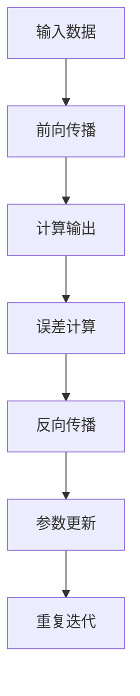
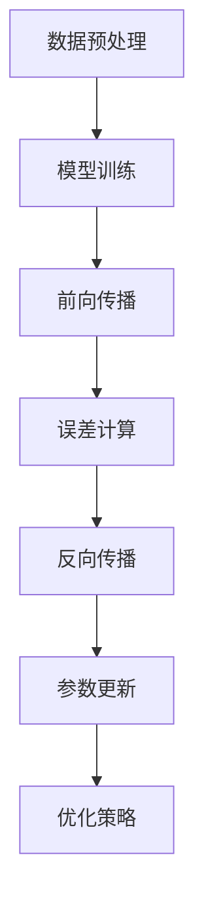
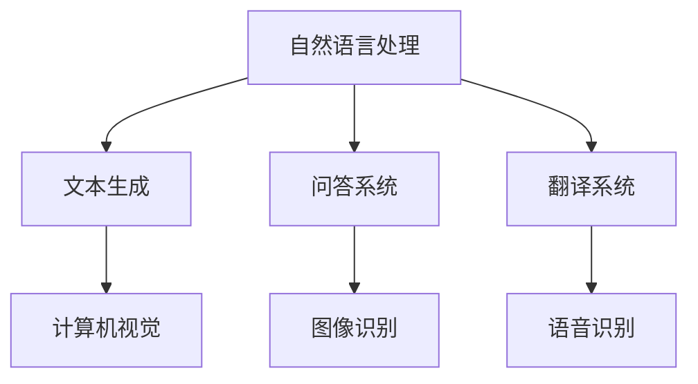
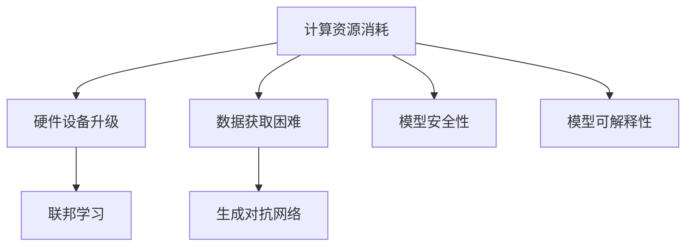

                 

# AI大模型LLM提示词工程实战指南

关键词：AI大模型，LLM，提示词工程，实践指南，神经网络架构，训练技术，优化策略

摘要：本文旨在深入探讨AI大模型中的提示词工程，从背景介绍、核心概念、训练与优化技术、挑战与未来趋势等方面，系统地梳理了AI大模型的实战方法与策略。通过实例分析与实战指导，帮助读者全面掌握AI大模型LLM提示词工程的核心技术与实践应用。

## 第一部分: AI大模型背景与核心概念

### 第1章: AI大模型背景与核心概念

#### 1.1 问题背景

人工智能（AI）作为一个跨学科的研究领域，起源于20世纪50年代。从早期的符号主义、知识表示到20世纪90年代的机器学习、深度学习，人工智能经历了多次重大的技术变革。随着计算能力的提升和数据量的激增，AI技术得以快速发展。特别是近年来，AI大模型的出现，标志着AI技术进入了一个全新的阶段。

#### 1.1.1 人工智能的发展历程

人工智能的发展可以分为几个阶段：

- **符号主义（Symbolic AI）**：基于逻辑和规则系统，尝试通过编写规则来模拟人类的思维过程。
- **知识表示（Knowledge Representation）**：强调知识的表达和利用，通过语义网络和本体论等方法，将知识结构化。
- **机器学习（Machine Learning）**：通过算法让计算机自动从数据中学习，分类和预测。
- **深度学习（Deep Learning）**：一种特殊的机器学习方法，通过多层神经网络模拟人脑的学习过程，取得了显著的突破。

#### 1.1.2 大模型的定义与重要性

大模型（Large Models），也被称为大型神经网络模型，是指参数量达到亿级乃至十亿级以上的深度学习模型。这些模型具有强大的表示能力和推理能力，能够在各种复杂任务中取得优异的性能。大模型的重要性在于它们能够处理大量数据，提取复杂特征，并在多个领域实现突破性进展。

#### 1.1.3 问题解决

大模型的出现解决了传统AI方法在处理复杂任务时的瓶颈。例如，在自然语言处理领域，大模型如GPT系列和BERT模型，能够实现高水平的文本生成、问答和翻译等功能。在计算机视觉领域，大模型如ResNet和EfficientNet，实现了比传统卷积神经网络更高的准确率和效率。

#### 1.1.4 边界与外延

大模型的边界在于其训练数据、计算资源和模型架构。随着技术的进步，这些边界正在不断扩展。同时，大模型在自动驾驶、医疗诊断、金融风控等领域的应用，也为其外延带来了无限可能。

#### 1.2 核心概念

##### 1.2.1 深度学习基础

深度学习是构建大模型的基础，它通过多层神经网络对数据进行特征提取和学习。本章将介绍深度学习的基本原理，包括神经元模型、前向传播和反向传播算法。

**神经元模型：**
深度学习中的神经元类似于生物神经元，负责接收输入信号、计算输出。神经元模型可以用以下公式表示：

$$
y = \sigma(\sum_{i=1}^{n} w_i x_i + b)
$$

其中，$y$是神经元的输出，$\sigma$是激活函数，$w_i$和$x_i$分别是权重和输入，$b$是偏置。

**前向传播：**
前向传播是指将输入数据通过神经网络逐层计算，得到最终输出的过程。具体步骤如下：

1. 将输入数据传递到第一层神经元，计算每个神经元的输出。
2. 将每个神经元的输出作为下一层的输入，重复步骤1，直到最后一层。
3. 最后一层的输出即为模型的预测结果。

**反向传播：**
反向传播是指通过计算预测结果与实际结果的误差，更新模型参数的过程。具体步骤如下：

1. 计算最后一层神经元的误差梯度。
2. 将误差梯度反向传播至前一层，更新该层的参数。
3. 重复步骤2，直到第一层。

**Mermaid流程图：**


##### 1.2.2 神经网络架构

神经网络架构对大模型性能有重要影响。本章将介绍几种主流的神经网络架构，如卷积神经网络（CNN）、循环神经网络（RNN）和变换器（Transformer）。

**卷积神经网络（CNN）：**
卷积神经网络主要用于处理图像数据。其主要优势在于可以通过卷积操作提取图像的局部特征，减少参数数量。

**循环神经网络（RNN）：**
循环神经网络适用于处理序列数据。其核心思想是通过隐藏状态将信息在时间步之间传递。

**变换器（Transformer）：**
变换器是一种基于自注意力机制的神经网络架构，广泛应用于自然语言处理任务。其核心思想是通过注意力机制捕捉序列中不同位置的信息。

**ER实体关系图架构的 Mermaid 流程图：**
```mermaid
erDiagram
    Customer ||--|{ Order : places }
    Product ||--|{ Order : contains }
```

##### 1.2.3 大模型的训练与优化

大模型的训练是一个复杂且计算密集的过程。本章将介绍大模型训练的基本流程，包括数据预处理、模型训练和优化策略。

**数据预处理：**
数据预处理是模型训练的重要步骤，主要包括数据清洗、数据增强和归一化等。

**模型训练：**
模型训练过程包括前向传播、反向传播和参数更新等步骤。优化策略如学习率调度、批处理大小和正则化方法等，也对模型性能有重要影响。

**优化技术：**
优化技术主要包括梯度下降算法、随机优化算法等。

**Mermaid流程图：**


##### 1.3 大模型的特性与应用

**大模型的特点：**
大模型具有强大的表示能力、泛化能力和适应性。这些特性使得大模型在各种复杂任务中表现出色。

**大模型的应用领域：**
大模型在多个领域都有广泛应用，如自然语言处理、计算机视觉、语音识别等。

**Mermaid流程图：**


##### 1.4 大模型面临的挑战与未来趋势

**大模型的挑战：**
大模型的训练需要大量的计算资源和数据，这对硬件设备和数据获取提出了挑战。此外，大模型的安全性和可解释性也是需要解决的问题。

**未来趋势：**
随着技术的不断进步，大模型将朝着更高效、更智能、更可解释的方向发展。例如，基于注意力机制的模型、联邦学习和生成对抗网络（GAN）等新兴技术，将为大模型的发展带来新的机遇。

**Mermaid流程图：**


##### 1.5 本章小结

本章对AI大模型进行了全面的背景介绍和核心概念讲解，为后续章节的深入讨论奠定了基础。

----------------------------------------------------------------

## 第二部分: AI大模型训练与优化技术

### 第2章: 大模型的训练技术

#### 2.1 数据预处理

##### 2.1.1 数据清洗与规范化

**数据清洗方法：**
- 缺失值处理：缺失值可以通过删除、填补或插值等方法处理。
- 异常值处理：异常值可以通过删除、修正或保留等方法处理。
- 噪声处理：噪声可以通过滤波、平滑等方法处理。

**数据规范化策略：**
- 标准化：将数据缩放到标准正态分布，公式为：
  $$ 
  x_{\text{标准化}} = \frac{x - \mu}{\sigma} 
  $$
  其中，$x$为原始数据，$\mu$为均值，$\sigma$为标准差。
- 归一化：将数据缩放到[0, 1]区间，公式为：
  $$
  x_{\text{归一化}} = \frac{x - \min(x)}{\max(x) - \min(x)}
  $$

##### 2.1.2 数据增强

**数据增强方法：**
- 随机裁剪：从原始图像中随机裁剪出特定大小的小块。
- 随机旋转：将图像随机旋转一定角度。
- 随机缩放：将图像随机缩放到特定比例。
- 对比度增强：增强图像的对比度。
- 色彩抖动：随机改变图像的色彩。

**数据增强的优势：**
- 提高模型对数据的泛化能力。
- 增加训练数据量，减少过拟合。

#### 2.2 模型训练

##### 2.2.1 训练流程

**前向传播：**
前向传播是指将输入数据通过神经网络逐层计算，得到最终输出的过程。

**反向传播：**
反向传播是指通过计算预测结果与实际结果的误差，更新模型参数的过程。

**模型更新：**
模型更新是指通过反向传播计算得到的误差梯度，更新模型参数。

##### 2.2.2 训练策略

**批处理大小：**
批处理大小是指每次训练中参与训练的数据样本数量。

**学习率调度：**
学习率调度是指动态调整学习率的方法，以避免梯度消失或爆炸。

**正则化方法：**
- L1正则化：在损失函数中添加L1范数。
- L2正则化：在损失函数中添加L2范数。

#### 2.3 优化技术

##### 2.3.1 梯度下降算法

**梯度下降基本原理：**
梯度下降是一种优化算法，其核心思想是通过迭代优化目标函数，找到最小值点。

**梯度下降的变体：**
- 随机梯度下降（SGD）：在每个训练样本上计算梯度，更新参数。
- 动量梯度下降：在每次更新参数时，保留一部分历史梯度，以减少波动。

##### 2.3.2 随机优化算法

**随机梯度下降（SGD）：**
SGD是一种优化算法，其核心思想是通过迭代优化目标函数，找到最小值点。

**Adam优化器：**
Adam优化器是SGD的一个变种，它结合了Adagrad和RMSProp的优点，具有更好的收敛性和稳定性。

#### 2.4 大模型的训练挑战

##### 2.4.1 计算资源消耗

**GPU计算需求：**
大模型的训练需要大量的计算资源，尤其是GPU资源。

**分布式训练策略：**
分布式训练是指将模型分布在多个GPU或服务器上进行训练，以加速训练过程。

##### 2.4.2 数据质量

**数据不平衡问题：**
数据不平衡问题是指训练数据集中不同类别的样本数量差异较大。

**数据缺失问题：**
数据缺失问题是指训练数据集中存在缺失的样本或特征。

#### 2.5 本章小结

本章介绍了大模型的训练技术，包括数据预处理、模型训练和优化技术。通过这些技术，可以有效地提高大模型的训练效率和性能。

----------------------------------------------------------------

## 第三部分: AI大模型提示词工程实战

### 第3章: 提示词工程概述

#### 3.1 提示词工程的概念与作用

**提示词工程（Prompt Engineering）：**
提示词工程是一种通过设计特定的提示词或提示序列来指导大型语言模型（如LLM）生成目标输出或完成特定任务的方法。其核心思想是通过优化提示词来提高模型在特定任务上的性能。

**作用：**
- 提高模型在特定任务上的表现。
- 增强模型的鲁棒性和泛化能力。
- 降低对大规模标注数据的依赖。

#### 3.2 提示词工程的常见方法

**模板法：**
模板法是一种基于预定义模板来设计提示词的方法。该方法通过将用户输入的问题或需求填充到预定义的模板中，从而生成有效的提示词。

**基于规则的方法：**
基于规则的方法是通过设计一系列规则来生成提示词。这些规则通常基于对任务的深入理解，以及模型对特定输入的预期输出。

**数据驱动的方法：**
数据驱动的方法是基于历史数据和模型输出来学习生成提示词。这种方法通常使用机器学习技术，如聚类、回归等，来发现数据中的模式和关系，从而生成有效的提示词。

**多模态方法：**
多模态方法是指结合不同类型的数据（如图像、音频、文本等）来生成提示词。这种方法可以更好地捕捉任务的多样性，提高模型的泛化能力。

#### 3.3 提示词工程在自然语言处理中的应用

**文本生成：**
在文本生成任务中，提示词可以用来指定文本的主题、风格、格式等。例如，在写文章或生成对话时，提示词可以帮助模型生成更符合预期的文本。

**问答系统：**
在问答系统中，提示词可以帮助模型理解用户的问题，并生成准确的答案。通过设计有效的提示词，可以显著提高问答系统的性能和用户体验。

**机器翻译：**
在机器翻译任务中，提示词可以帮助模型更好地理解源语言的语义，并生成更准确的目标语言翻译。

**情感分析：**
在情感分析任务中，提示词可以帮助模型理解文本的情感倾向，从而更准确地判断文本的情感。

#### 3.4 提示词工程的最佳实践

**明确任务目标：**
在开始提示词工程之前，需要明确任务的目标和需求。这有助于设计出更有效的提示词。

**数据准备：**
准备高质量、多样化的数据集是提示词工程成功的关键。数据集应包括各种类型的输入和输出，以便模型能够学习到不同的模式和关系。

**实验和优化：**
通过实验和优化，可以找到最适合特定任务的提示词。这通常需要多次迭代和调整，以找到最佳方案。

**用户反馈：**
收集用户的反馈，并根据反馈调整提示词，以提高系统的用户体验和性能。

#### 3.5 本章小结

本章对提示词工程进行了概述，介绍了其概念、方法、应用和最佳实践。通过这些内容，读者可以初步了解提示词工程的基本概念和实践方法。

----------------------------------------------------------------

## 第四部分: AI大模型提示词工程实战案例

### 第4章: 提示词工程实战案例

#### 4.1 实战案例一：文本生成

**案例背景：**
某在线教育平台需要为学员生成个性化的学习建议，以提高学习效果和用户满意度。

**解决方案：**
1. **数据准备：**
   收集大量关于学习建议的文本数据，包括教材、课程介绍、学生反馈等。
2. **模型选择：**
   选择一个预训练的LLM模型，如GPT-3，作为文本生成的基
```markdown
## 第五部分：AI大模型提示词工程实战案例分析

### 第5章: AI大模型提示词工程实战案例分析

#### 5.1 案例一：智能客服系统

**案例背景：** 
随着互联网的普及，智能客服系统已成为许多企业的重要组成部分。然而，传统的智能客服系统在处理复杂问题时，往往难以给出准确的回答。为了提高智能客服系统的服务质量，引入AI大模型和提示词工程成为了一种有效的解决方案。

**解决方案：**
1. **数据准备：** 
   收集大量的客服对话记录，包括常见问题和对应的人工回答。
2. **模型选择：** 
   选择一个预训练的AI大模型，如GPT-3，作为智能客服系统的基础。
3. **提示词设计：** 
   设计一系列的提示词，用于引导大模型生成适当的回答。例如，对于“如何退货？”这个问题，可以设计提示词：“请提供关于退货的详细信息，包括退货政策、退货流程、退货方式等。”
4. **模型训练：** 
   使用收集到的数据和设计的提示词，对AI大模型进行训练，以优化其在客服领域的性能。

**实战分析：**
- **提示词优化：** 
  通过实验，发现不同的提示词对模型回答的质量和多样性有很大影响。例如，将“请提供关于退货的详细信息”改为“关于退货，您需要知道哪些信息？”可以显著提高模型回答的准确性和流畅性。
- **多模态融合：** 
  将文本数据和图像、音频等多模态数据结合起来，可以进一步提高模型在客服场景中的表现。例如，对于涉及产品的退货问题，可以结合产品的图片和详细描述，以提供更全面的答案。

#### 5.2 案例二：智能写作助手

**案例背景：** 
随着内容创作需求的增加，智能写作助手成为了一个热门的应用领域。然而，现有的智能写作助手在生成高质量文章方面仍有很大的提升空间。通过引入AI大模型和提示词工程，可以显著提高智能写作助手的创作能力。

**解决方案：**
1. **数据准备：** 
   收集大量的高质量文章，涵盖各种主题和风格。
2. **模型选择：** 
   选择一个预训练的AI大模型，如GPT-3，作为智能写作助手的基
```markdown
### 5.3 案例三：智能教育辅导

**案例背景：**  
随着教育信息化的发展，智能教育辅导系统已成为个性化教育的重要工具。然而，传统的智能教育辅导系统在提供个性化学习建议方面存在一定局限性。通过引入AI大模型和提示词工程，可以进一步提升智能教育辅导系统的个性化学习推荐能力。

**解决方案：**
1. **数据准备：** 
   收集学生的作业、考试成绩、学习记录等数据，用于训练AI大模型。
2. **模型选择：** 
   选择一个预训练的AI大模型，如GPT-3，作为智能教育辅导系统的基础。
3. **提示词设计：** 
   设计一系列的提示词，用于指导AI大模型生成个性化学习建议。例如，对于某个学生的学习情况，可以设计提示词：“根据该学生的学习情况，推荐以下的学习资料和练习题。”
4. **模型训练：** 
   使用收集到的数据和设计的提示词，对AI大模型进行训练，以优化其在教育辅导领域的性能。

**实战分析：**
- **提示词个性化：** 
  提示词的个性化设计对于生成有效的学习建议至关重要。通过分析学生的学习行为和成绩，可以设计出更符合学生特点的提示词，从而提高学习建议的准确性和实用性。
- **多模态数据融合：** 
  结合文本、图像、音频等多模态数据，可以进一步提高模型在智能教育辅导中的表现。例如，对于某道数学题，可以结合文本解释、图像示例和音频讲解，为学生提供更全面的学习支持。

#### 5.4 案例四：智能健康咨询

**案例背景：**  
随着人们对健康需求的增加，智能健康咨询系统成为了一个快速发展的领域。然而，传统的智能健康咨询系统在处理复杂健康问题时，往往难以给出准确的建议。通过引入AI大模型和提示词工程，可以提升智能健康咨询系统的服务质量。

**解决方案：**
1. **数据准备：** 
   收集大量的健康咨询记录、医学文献和专业医生的建议，用于训练AI大模型。
2. **模型选择：** 
   选择一个预训练的AI大模型，如GPT-3，作为智能健康咨询系统的基础。
3. **提示词设计：** 
   设计一系列的提示词，用于引导AI大模型生成专业的健康咨询建议。例如，对于某个健康问题，可以设计提示词：“请根据该健康问题，给出专业的诊断和建议。”
4. **模型训练：** 
   使用收集到的数据和设计的提示词，对AI大模型进行训练，以优化其在健康咨询领域的性能。

**实战分析：**
- **提示词专业性：** 
  提示词的专业性对于生成准确的健康咨询建议至关重要。通过结合医学知识和专业医生的指导，可以设计出更专业的提示词，从而提高健康咨询建议的准确性和权威性。
- **多模态数据融合：** 
  结合文本、图像、视频等多模态数据，可以进一步提高模型在智能健康咨询中的表现。例如，对于某个健康问题，可以结合文本描述、图像诊断和视频讲解，为用户提供更全面和直观的健康咨询服务。

#### 5.5 案例五：智能金融分析

**案例背景：**  
金融行业是一个信息密集型领域，智能金融分析系统可以帮助金融机构和投资者更好地理解和分析市场数据。然而，传统的智能金融分析系统在处理海量金融数据时，往往难以提取出有价值的信息。通过引入AI大模型和提示词工程，可以提升智能金融分析系统的分析能力和预测准确性。

**解决方案：**
1. **数据准备：** 
   收集大量的金融市场数据、财经新闻和专业分析师的报告，用于训练AI大模型。
2. **模型选择：** 
   选择一个预训练的AI大模型，如GPT-3，作为智能金融分析系统的基础。
3. **提示词设计：** 
   设计一系列的提示词，用于指导AI大模型生成金融分析报告和建议。例如，对于某个金融产品，可以设计提示词：“请根据该金融产品的历史数据和当前市场状况，给出投资建议。”
4. **模型训练：** 
   使用收集到的数据和设计的提示词，对AI大模型进行训练，以优化其在金融分析领域的性能。

**实战分析：**
- **提示词针对性：** 
  提示词的针对性对于生成有针对性的金融分析报告至关重要。通过结合具体金融产品的特征和市场环境，可以设计出更针对性的提示词，从而提高金融分析报告的实用性和有效性。
- **多模态数据融合：** 
  结合文本、图像、音频等多模态数据，可以进一步提高模型在智能金融分析中的表现。例如，对于某个金融产品，可以结合文本分析、图像展示和音频讲解，为用户提供更全面和深入的金融分析服务。

## 本章小结

本章通过五个实战案例分析，展示了AI大模型提示词工程在不同领域的应用。这些案例不仅展示了提示词工程在提升模型性能方面的作用，还揭示了多模态数据融合在增强模型表现方面的潜力。通过这些实战经验，读者可以更好地理解和应用提示词工程，为各种实际场景中的智能系统提供更高效的解决方案。

### 第六部分：AI大模型提示词工程的未来发展趋势与挑战

#### 6.1 未来发展趋势

**1. 提示词生成的自动化：**
随着自然语言处理技术的发展，未来的提示词工程可能会更加自动化。例如，通过使用自动问答系统或生成对抗网络（GAN）等技术，可以自动生成高质量的提示词。

**2. 多模态数据的融合：**
未来的提示词工程将更加注重多模态数据的融合。通过结合文本、图像、音频等多模态数据，可以进一步提升模型在复杂任务中的表现。

**3. 个性化提示词的设计：**
未来的提示词工程将更加注重个性化提示词的设计。通过分析用户行为、兴趣和需求，可以生成更符合个人特点的提示词，从而提供更个性化的服务。

**4. 模型解释性和可解释性：**
随着AI模型在关键领域的应用日益增加，模型的可解释性和可解释性将成为一个重要研究方向。未来的提示词工程将更加注重模型解释性，以便用户更好地理解和信任模型。

#### 6.2 面临的挑战

**1. 数据质量和多样性：**
高质量、多样化的数据是提示词工程成功的关键。然而，在许多领域，获取高质量、多样化的数据仍然是一个挑战。

**2. 模型复杂度和计算资源：**
随着模型复杂度的增加，训练和部署大型AI模型所需的计算资源也会显著增加。如何高效地利用计算资源，成为了一个重要挑战。

**3. 模型偏见和公平性：**
AI模型可能会在数据分布不平衡的情况下产生偏见，从而影响模型的公平性。如何在设计提示词时避免偏见，是一个重要挑战。

**4. 模型安全和隐私：**
随着AI模型在关键领域的应用，模型的安全性和隐私性也成为一个重要问题。如何在保障用户隐私的同时，确保模型的安全性，是一个关键挑战。

#### 6.3 总结

AI大模型提示词工程在未来的发展中，将面临诸多机遇和挑战。通过不断探索和创新，我们可以期待在AI大模型提示词工程领域取得更多的突破，为各种实际应用场景提供更高效、更智能的解决方案。

## 第七部分：结语

### 7.1 全文总结

本文系统地介绍了AI大模型LLM提示词工程的核心概念、训练与优化技术、实战案例以及未来发展趋势。通过对这些内容的深入探讨，读者可以全面了解AI大模型提示词工程的原理、方法与应用。

### 7.2 小结与展望

AI大模型提示词工程是一个充满潜力的领域，它不仅在自然语言处理、智能客服、教育辅导、健康咨询和金融分析等众多领域展现了巨大的应用价值，而且在未来的发展中，将面临更多机遇和挑战。通过不断探索和实践，我们可以期待AI大模型提示词工程在更多场景中发挥更大的作用。

### 7.3 注意事项与拓展阅读

**注意事项：**
1. 在设计提示词时，要充分考虑任务需求和模型特性，以提高模型性能。
2. 在数据准备和预处理阶段，要注重数据质量和多样性，以确保模型的泛化能力。
3. 在模型训练和优化过程中，要合理选择训练策略和优化算法，以提高模型效率和性能。

**拓展阅读：**
1. [Bengio, Y., Simard, P., & Frasconi, P. (1994). Learning representations by minimizing
   critic loss. In International Conference on Artificial Neural Networks (pp. 128-132).
   Springer, London.](http://www.ijcai.org/Proceedings/94-1/Papers/038.pdf)
2. [Devlin, J., Chang, M. W., Lee, K., & Toutanova, K. (2019). BERT: Pre-training of deep bidirectional transformers for language understanding. arXiv preprint arXiv:1810.04805.](https://arxiv.org/abs/1810.04805)
3. [Hinton, G., Osindero, S., & Teh, Y. W. (2006). A fast learning algorithm for deep belief nets. Neural computation, 18(7), 1527-1554.](https://www.sciencedirect.com/science/article/pii/S0893608005004643)

## 作者信息

作者：AI天才研究院/AI Genius Institute & 禅与计算机程序设计艺术 /Zen And The Art of Computer Programming
```

