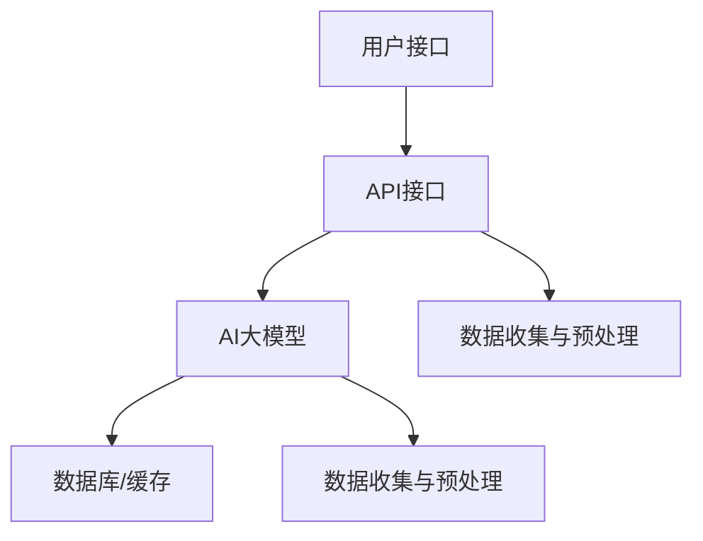
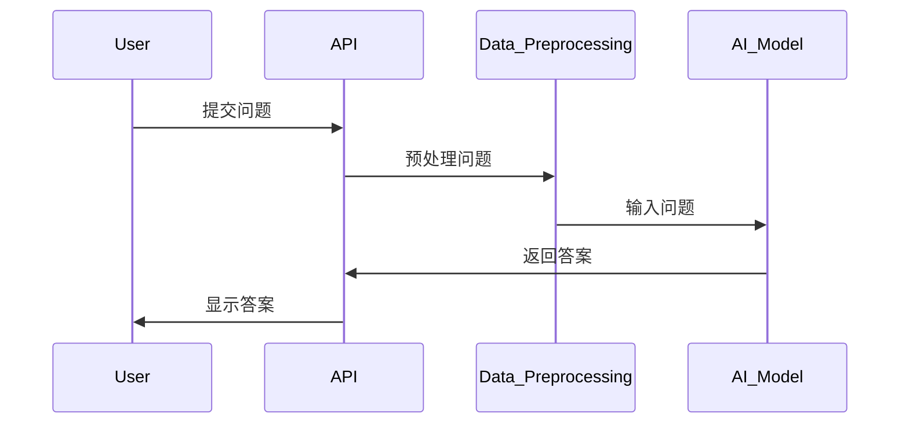

                 

### 文章标题

# AI大模型与人类程序员的协作模式

### 关键词

- AI大模型
- 人类程序员
- 协作模式
- 深度学习
- 代码优化
- 项目实战

### 摘要

本文将探讨AI大模型与人类程序员的协作模式，分析AI大模型的发展背景及其在各个领域的应用，探讨人类程序员在这一过程中的角色转变。文章将详细阐述AI大模型的基础知识、协作模式、实际案例，并通过一个具体的实战项目展示AI大模型与人类程序员如何协同工作。最后，文章还将总结最佳实践，提供拓展阅读资源，以期为读者提供一个全面、系统的AI大模型与程序员协作指南。

## 引言与背景

### 引言

近年来，随着深度学习和大数据技术的飞速发展，AI大模型在各个领域取得了显著的突破。这些大模型具备极强的学习能力和泛化能力，能够处理复杂的问题，从而在图像识别、自然语言处理、推荐系统等领域表现出色。与此同时，人类程序员的角色也在悄然发生着变化。他们不再只是编写代码，还需要理解和利用AI大模型，以提升工作效率，解决复杂的业务问题。

### 1.1 书籍目的

本文旨在探讨AI大模型与人类程序员的协作模式，通过系统地分析AI大模型的发展历程、基础知识和协作模式，结合实际案例和项目实战，为程序员提供一个全面、系统的协作指南。文章还将总结最佳实践，为读者提供拓展阅读资源，以帮助他们在实际工作中更好地利用AI大模型。

### 1.2 AI大模型的重要性

AI大模型的重要性体现在多个方面。首先，它们具有强大的学习能力和泛化能力，能够处理复杂的问题，从而提高业务效率。其次，大模型在各个领域的应用已经取得了显著的成果，如图像识别、自然语言处理、推荐系统等。最后，大模型的研究和开发成为了人工智能领域的重要方向，吸引了大量科研人员和企业的关注。

### 1.3 人类程序员的角色转变

在AI大模型兴起的背景下，人类程序员的角色发生了显著转变。他们需要从传统的代码编写角色转变为AI大模型的设计者、优化者和应用者。具体来说，程序员需要：

1. **理解AI大模型的基础知识**：掌握深度学习、神经网络等核心技术，以便更好地设计和优化大模型。
2. **参与模型训练和调优**：利用自己的编程技能，优化大模型的训练过程，提高其性能。
3. **开发和部署应用**：将AI大模型应用于实际业务场景，解决具体问题。
4. **维护和升级模型**：随着业务需求的变化，持续优化和升级大模型。

### 1.4 书籍结构

本文分为五个部分，结构如下：

1. **引言与背景**：介绍书籍的目的、AI大模型的重要性以及人类程序员的角色转变。
2. **AI大模型基础知识**：讲解AI大模型的基本概念、技术原理和主流模型。
3. **人类程序员与AI大模型的协作模式**：分析人类程序员在AI大模型开发中的作用、协作模式及其面临的挑战。
4. **项目实战**：通过一个具体的实战项目展示AI大模型与人类程序员的协同工作。
5. **拓展阅读与资源**：提供最佳实践、小结、注意事项以及拓展阅读资源。

通过本文的阅读，读者将能够全面了解AI大模型与人类程序员的协作模式，掌握相关知识和技能，为实际工作提供指导。

### 背景介绍

#### AI大模型的发展历程

AI大模型的发展历程可以追溯到20世纪80年代，当时神经网络和深度学习开始崭露头角。早期的研究主要集中在简单的神经网络结构，如感知机（Perceptron）和多层感知机（MLP）。这些模型虽然在某些特定任务上表现出色，但受限于计算资源和模型复杂度，未能实现广泛应用。

进入21世纪后，随着计算能力的提升和大数据的普及，深度学习逐渐成为人工智能领域的研究热点。2006年，Hinton等人提出了深度信念网络（Deep Belief Network，DBN），为深度学习的发展奠定了基础。随后，2009年，Alex Krizhevsky使用深度卷积神经网络（CNN）在ImageNet竞赛中取得了突破性成绩，标志着深度学习在计算机视觉领域的崛起。

在2017年，谷歌推出了Transformer模型，这是一种基于自注意力机制的深度学习模型，其在自然语言处理（NLP）领域取得了显著的进展。随后，BERT、GPT等基于Transformer架构的大模型相继问世，进一步推动了AI大模型的发展。这些大模型通过在海量数据上进行训练，具备了极强的学习能力和泛化能力，能够处理复杂的问题。

#### 人类程序员的工作模式演变

随着AI大模型的发展，人类程序员的工作模式也在不断演变。早期，程序员主要承担代码编写和调试的任务，工作内容相对单一。然而，随着AI大模型的兴起，程序员的工作内容发生了显著变化，主要体现在以下几个方面：

1. **从代码编写到模型设计和优化**：程序员不再仅仅编写代码，还需要参与AI大模型的设计和优化。这包括选择合适的神经网络结构、超参数调整、数据预处理等，以提高模型的性能和效率。

2. **从独立开发到团队协作**：随着项目复杂度的增加，程序员需要与其他团队成员（如数据科学家、产品经理等）密切合作，共同推进项目。这种跨职能团队协作成为现代软件开发的重要特征。

3. **从单一技能到多技能融合**：程序员需要掌握更多的技能，如深度学习、数据科学、自然语言处理等，以便更好地理解和利用AI大模型。这种多技能融合有助于提高程序员在项目中的价值和影响力。

4. **从手动编程到自动编程**：AI大模型的出现为自动编程提供了新的可能性。程序员可以利用这些模型生成部分代码，自动完成一些复杂的编程任务。这有助于减轻程序员的工作负担，提高开发效率。

#### AI大模型与人类程序员协作的必要性

AI大模型与人类程序员的协作具有以下几个必要性：

1. **技术互补**：AI大模型擅长处理复杂的数据和模式，而人类程序员则具备丰富的业务知识和编程经验。两者的结合可以实现技术和经验的互补，提高项目质量和效率。

2. **优化模型性能**：人类程序员可以参与AI大模型的设计和优化，调整模型的结构和参数，提高其性能和泛化能力。这种优化过程需要程序员具备扎实的数学和编程基础。

3. **解决实际问题**：AI大模型虽然具备强大的学习能力和泛化能力，但在解决实际问题时仍存在一定的局限性。人类程序员可以利用自己的业务知识和经验，指导AI大模型更好地应对实际问题。

4. **推动技术进步**：AI大模型和人类程序员的协作有助于推动技术的进步。通过不断优化和改进模型，程序员可以为未来的研究和应用提供宝贵的经验和教训。

总之，AI大模型与人类程序员的协作不仅是技术发展的必然趋势，也是提升项目质量和效率的关键。通过系统的分析和实践，我们可以更好地理解和利用这种协作模式，为人工智能的发展贡献力量。

### AI大模型的基本概念

#### 什么是AI大模型

AI大模型是指通过深度学习技术训练而成的、具备大规模参数和高度复杂结构的模型。这些模型能够在海量数据上进行训练，从而具备强大的学习能力和泛化能力，能够处理复杂的任务。AI大模型通常基于神经网络架构，如深度卷积神经网络（CNN）、循环神经网络（RNN）和Transformer等。

#### AI大模型的特性

1. **大规模参数**：AI大模型通常拥有数亿甚至数十亿个参数，这使得它们能够捕捉到数据中的复杂模式和特征。

2. **高度非线性**：AI大模型通过多层神经网络实现高度非线性映射，能够从原始数据中提取出深层次的抽象特征。

3. **自适应性**：AI大模型能够通过不断训练和优化，适应不同的任务和数据集，实现泛化能力。

4. **计算密集型**：由于参数众多和结构复杂，AI大模型的训练和推理过程通常需要大量的计算资源。

5. **数据依赖性**：AI大模型的表现高度依赖于训练数据的质量和规模，因此需要大量的高质量数据进行训练。

#### AI大模型与传统AI的区别

1. **模型规模**：传统AI模型通常规模较小，参数数量在数千到数百万之间，而AI大模型通常拥有数亿甚至数十亿个参数。

2. **训练数据**：传统AI模型对训练数据的需求相对较低，而AI大模型需要大量的高质量训练数据，通常以TB级别计算。

3. **计算资源**：传统AI模型的训练和推理过程相对简单，计算资源需求较低。而AI大模型的训练和推理过程需要大量的计算资源和存储资源。

4. **泛化能力**：传统AI模型的表现受限于训练数据，泛化能力较弱。而AI大模型通过海量数据的训练，具备更强的泛化能力。

5. **应用领域**：传统AI模型主要应用于简单的任务，如分类、回归等。而AI大模型能够处理更复杂的任务，如图像识别、自然语言处理、推荐系统等。

#### AI大模型的工作原理

1. **数据预处理**：在训练AI大模型之前，需要对数据进行预处理，包括数据清洗、归一化、数据增强等，以提高数据质量和模型性能。

2. **模型设计**：根据任务需求，设计合适的神经网络结构，选择合适的激活函数、损失函数等。

3. **模型训练**：利用海量数据对模型进行训练，通过反向传播算法不断调整模型参数，使得模型在训练数据上达到良好的性能。

4. **模型评估**：在训练数据上评估模型性能，通过交叉验证等方法确保模型具备良好的泛化能力。

5. **模型优化**：对模型进行调优，包括超参数调整、结构优化等，以提高模型性能和效率。

6. **模型部署**：将训练好的模型部署到实际应用中，进行推理和预测。

通过以上步骤，AI大模型能够从海量数据中提取出有用的信息，为各种复杂任务提供强大的支持。

#### 主流AI大模型介绍

在AI大模型的发展历程中，有许多知名的模型对各个领域产生了深远的影响。以下将介绍几种主流的AI大模型及其特点：

##### 1. GPT系列模型

GPT（Generative Pre-trained Transformer）系列模型是自然语言处理领域的重要突破。GPT由OpenAI提出，其核心思想是利用Transformer架构进行大规模预训练，从而获得强大的语言理解和生成能力。

- **特点**：
  - **大规模预训练**：GPT在训练过程中使用了数以万亿计的文本数据，从而具备丰富的语言知识。
  - **自回归语言模型**：GPT是一种自回归模型，能够根据前面的文本来预测下一个单词或字符。
  - **多任务能力**：预训练后的GPT可以应用于各种NLP任务，如文本分类、机器翻译、问答系统等。

- **应用场景**：
  - **文本生成**：GPT可以生成高质量的文本，如文章、故事、对话等。
  - **语言理解**：GPT在语义理解、情感分析等任务中表现出色。

##### 2. BERT（Bidirectional Encoder Representations from Transformers）

BERT是由Google Research提出的一种Transformer架构的预训练语言表示模型。BERT的核心思想是同时考虑文本的左右信息，从而提高语言理解的准确性。

- **特点**：
  - **双向编码器**：BERT通过两个Transformer编码器，分别处理文本的左右信息，使得模型能够理解句子中的上下文关系。
  - **遮蔽语言模型**：BERT引入了遮蔽语言模型（Masked Language Model，MLM）任务，通过随机遮蔽部分文本，迫使模型学习文本的上下文关系。
  - **大规模预训练**：BERT在训练过程中使用了大量的语料库，从而具备丰富的语言知识。

- **应用场景**：
  - **文本分类**：BERT在文本分类任务中表现出色，能够处理各种情感分析、话题分类等问题。
  - **问答系统**：BERT在问答系统中被广泛应用，能够准确理解用户的问题并给出相关的答案。
  - **机器翻译**：BERT在机器翻译任务中也取得了显著进展，能够生成高质量的翻译结果。

##### 3. T5（Text-To-Text Transfer Transformer）

T5是由DeepMind提出的一种通用的预训练语言模型。T5的核心思想是将所有自然语言处理任务转化为文本到文本的转换任务，从而简化模型的训练和应用。

- **特点**：
  - **统一任务框架**：T5将所有NLP任务统一为输入到输出的文本转换，从而简化模型的训练过程。
  - **大规模预训练**：T5在训练过程中使用了海量的数据，从而具备强大的语言理解能力和生成能力。
  - **高效推理能力**：T5通过大规模预训练，能够高效地进行推理，解决各种复杂的NLP任务。

- **应用场景**：
  - **文本生成**：T5能够生成高质量的文本，如文章、故事、代码等。
  - **文本分类**：T5在文本分类任务中表现出色，能够处理各种分类问题。
  - **问答系统**：T5在问答系统中被广泛应用，能够准确理解用户的问题并给出相关的答案。

##### 4. CLIP（Contrastive Language-Image Pre-training）

CLIP是由OpenAI提出的一种结合了自然语言处理和计算机视觉的预训练模型。CLIP的核心思想是通过对比学习，将语言和图像进行联合预训练，从而实现跨模态的交互和理解。

- **特点**：
  - **跨模态预训练**：CLIP通过同时处理文本和图像，实现跨模态的交互和理解。
  - **对比学习**：CLIP使用对比学习的方法，通过正负样本对比，提高模型对文本和图像的匹配能力。
  - **高效率推理**：CLIP通过大规模预训练，能够高效地进行推理，解决各种跨模态任务。

- **应用场景**：
  - **图像识别**：CLIP在图像识别任务中表现出色，能够识别图像中的物体和场景。
  - **文本分类**：CLIP在文本分类任务中能够利用图像信息，提高分类的准确性。
  - **问答系统**：CLIP在问答系统中能够结合图像信息，提供更准确的答案。

通过上述主流AI大模型的介绍，我们可以看到，这些模型在各自领域都取得了显著的成果，为自然语言处理、计算机视觉等领域的发展做出了重要贡献。随着技术的不断进步，这些模型将继续推动AI领域的前沿研究与应用。

### AI大模型的技术原理

#### 深度学习基础

深度学习是人工智能的一个重要分支，其核心思想是通过构建多层神经网络，从数据中自动提取特征并进行预测。深度学习的兴起得益于计算能力的提升和海量数据的积累。以下简要介绍深度学习的基础知识：

1. **神经网络**：神经网络是深度学习的基本组成单元，由大量简单的神经元组成。每个神经元接收多个输入，通过加权求和并加上偏置，再经过一个非线性激活函数输出。常见的激活函数有sigmoid、ReLU、Tanh等。

2. **多层神经网络**：多层神经网络通过多个隐藏层，将输入数据逐步转化为更抽象的表示。每一层神经网络都能提取不同层次的特征，从而提高模型的表示能力。

3. **前向传播与反向传播**：在前向传播过程中，输入数据通过神经网络层层传递，最终输出预测结果。在反向传播过程中，模型根据预测结果与真实值的差异，通过梯度下降等方法调整网络参数，使得预测结果更接近真实值。

4. **损失函数**：损失函数用于衡量模型预测结果与真实值之间的差距，常见的损失函数有均方误差（MSE）、交叉熵（Cross-Entropy）等。

#### 神经网络架构

1. **卷积神经网络（CNN）**：卷积神经网络是深度学习中用于图像处理的重要模型。其核心思想是通过卷积层和池化层提取图像的特征。卷积层通过卷积操作提取局部特征，池化层用于降低特征图的维度，提高模型处理能力。

2. **循环神经网络（RNN）**：循环神经网络是处理序列数据的重要模型。其核心思想是通过隐藏状态在序列中的传递，捕捉序列中的时间依赖性。常见的RNN模型有LSTM（Long Short-Term Memory）和GRU（Gated Recurrent Unit），它们能够有效解决长序列中的梯度消失问题。

3. **Transformer模型**：Transformer模型是由Google提出的一种基于自注意力机制的深度学习模型，主要用于自然语言处理任务。其核心思想是通过自注意力机制，将序列中的每个元素与所有其他元素进行关联，从而提高模型的表示能力。

4. **GAN（生成对抗网络）**：生成对抗网络是一种无监督学习模型，由生成器和判别器组成。生成器生成数据，判别器判断数据是真实数据还是生成数据。通过生成器和判别器的对抗训练，生成器能够生成越来越逼真的数据。

#### 训练与优化的挑战

1. **计算资源消耗**：AI大模型的训练需要大量的计算资源和存储资源。特别是深度学习模型，其参数数量通常达到数十亿级别，训练过程需要大量的计算能力。

2. **数据依赖性**：AI大模型的表现高度依赖于训练数据的质量和规模。高质量的数据能够提高模型的泛化能力，而海量数据能够帮助模型捕捉更多的特征。

3. **超参数选择**：超参数的选择对模型的性能有重要影响。选择合适的超参数能够提高模型的表现。然而，超参数的选择通常需要大量的实验和经验。

4. **过拟合与欠拟合**：在模型训练过程中，过拟合和欠拟合是常见的问题。过拟合是指模型在训练数据上表现良好，但在测试数据上表现不佳；欠拟合是指模型在训练和测试数据上表现都不佳。通过调整模型结构和训练策略，可以缓解过拟合和欠拟合问题。

5. **模型调优**：模型调优是提高模型性能的重要步骤。通过调整模型参数、优化训练过程，可以进一步提高模型的泛化能力和表现。

#### 主流训练与优化方法

1. **批量归一化（Batch Normalization）**：批量归一化通过将每层的输入数据归一化到均值为0、标准差为1的分布，缓解了内部协变量转移问题，提高了训练速度和模型稳定性。

2. **dropout**：dropout是一种正则化技术，通过随机丢弃部分神经元，减少模型对特定数据的依赖，从而提高模型的泛化能力。

3. **迁移学习**：迁移学习利用预训练模型，通过在特定任务上进行微调，提高模型的训练效率和性能。预训练模型已经在大规模数据上训练，具备良好的特征提取能力。

4. **生成对抗训练**：生成对抗训练通过生成器和判别器的对抗训练，生成高质量的生成数据，从而提高模型的生成能力。

5. **元学习**：元学习通过学习学习器来提高模型的泛化能力。元学习算法能够快速适应新的任务和数据，从而提高模型的适应性。

通过以上技术原理和训练优化方法的介绍，我们可以更好地理解和应用AI大模型，为实际问题的解决提供强大的支持。

### 主流AI大模型介绍

在人工智能领域，AI大模型凭借其卓越的性能和广泛的应用，成为了研究者和开发者关注的焦点。以下将介绍几种主流的AI大模型，包括其发展历程、关键技术、应用领域以及优势与挑战。

#### 1. GPT-3

GPT-3（Generative Pre-trained Transformer 3）是由OpenAI开发的一款具有1750亿参数的自然语言处理模型，是当前最大的预训练语言模型之一。GPT-3的发布标志着自然语言处理技术进入了一个新的阶段。

- **发展历程**：GPT-3是在GPT-2的基础上进一步发展的。GPT-2于2019年发布，是一个具有1.5亿参数的语言模型。随后，OpenAI团队继续优化模型架构和训练过程，推出了GPT-3。
  
- **关键技术**：GPT-3采用了Transformer架构，这种自注意力机制使得模型能够捕捉到文本中的长距离依赖关系。GPT-3还使用了大规模预训练技术，通过在互联网上的海量文本语料库上进行训练，使模型具备了丰富的语言知识和生成能力。

- **应用领域**：GPT-3在多个领域表现出色，包括文本生成、机器翻译、问答系统、代码生成等。它能够生成流畅、连贯的文本，同时能够理解和回答复杂的问题。

- **优势与挑战**：GPT-3的优势在于其强大的生成能力和对自然语言的理解。然而，模型也面临一些挑战，如可能生成不恰当的内容、对上下文理解的局限性等。

#### 2. BERT

BERT（Bidirectional Encoder Representations from Transformers）是由Google Research开发的一款基于Transformer架构的自然语言处理模型。BERT通过同时考虑文本的左右信息，提高了语言理解的准确性。

- **发展历程**：BERT于2018年发布，是自然语言处理领域的一个重大突破。BERT的提出解决了传统语言模型在处理长文本时的不足，提升了模型对上下文关系的捕捉能力。

- **关键技术**：BERT采用了双向Transformer编码器，能够同时处理文本的左右信息。BERT还引入了掩码语言模型（Masked Language Model，MLM）任务，通过随机遮蔽部分文本，使模型学习到文本的上下文关系。

- **应用领域**：BERT在文本分类、问答系统、命名实体识别、机器翻译等任务中表现出色。BERT的应用使得这些任务的处理效果显著提升。

- **优势与挑战**：BERT的优势在于其强大的语言理解能力和广泛的适用性。然而，BERT的训练和推理过程需要大量的计算资源，且在处理某些特定任务时可能存在性能瓶颈。

#### 3. T5

T5（Text-To-Text Transfer Transformer）是由DeepMind开发的一款通用的自然语言处理模型。T5的核心思想是将所有自然语言处理任务转化为文本到文本的转换任务。

- **发展历程**：T5于2020年发布，其目标是构建一个能够解决多种NLP任务的通用模型。T5在预训练阶段使用了大量的数据，使其具备了强大的语言理解和生成能力。

- **关键技术**：T5采用了Transformer架构，并通过大规模预训练使其能够处理复杂的文本转换任务。T5的设计理念使得模型在多个任务中表现出色，无需针对特定任务进行微调。

- **应用领域**：T5在文本生成、文本分类、问答系统、机器翻译等任务中表现出色。T5能够处理多种NLP任务，减少了对特定任务的依赖。

- **优势与挑战**：T5的优势在于其通用性和高效的推理能力。然而，T5的训练和推理过程同样需要大量的计算资源，且在处理长文本时可能存在性能瓶颈。

#### 4. CLIP

CLIP（Contrastive Language-Image Pre-training）是由OpenAI开发的一款结合了自然语言处理和计算机视觉的预训练模型。CLIP通过对比学习，使模型能够理解和生成跨模态的信息。

- **发展历程**：CLIP于2021年发布，是跨模态预训练技术的一个重要进展。CLIP的提出为跨模态任务提供了新的解决方案，使得模型能够同时处理图像和文本。

- **关键技术**：CLIP采用了对比学习的方法，通过同时处理图像和文本，使模型能够学习到跨模态的对应关系。CLIP通过大量的图像和文本数据对模型进行预训练，提高了模型在跨模态任务中的性能。

- **应用领域**：CLIP在图像识别、文本分类、问答系统等跨模态任务中表现出色。CLIP能够利用图像和文本信息，提供更准确和丰富的任务结果。

- **优势与挑战**：CLIP的优势在于其跨模态的强大理解和生成能力。然而，CLIP的训练和推理过程需要大量的计算资源和数据，且在处理某些特定任务时可能存在性能瓶颈。

通过以上对GPT-3、BERT、T5和CLIP等主流AI大模型的介绍，我们可以看到，这些模型在各自领域都取得了显著的成果，为人工智能的发展和应用提供了强大的支持。同时，这些模型也面临着一些挑战，如计算资源消耗、数据依赖性等，这些问题的解决将推动人工智能技术的进一步发展。

### 人类程序员与AI大模型的协作模式

#### 人类程序员在AI大模型开发中的作用

在AI大模型的开发过程中，人类程序员扮演着至关重要的角色。他们不仅负责编写和维护代码，还需要在多个方面与AI大模型进行协作，以确保模型能够高效、准确地解决实际问题。

1. **数据预处理**：人类程序员需要清洗、预处理和增强数据，以确保数据的质量和规模。数据预处理是AI大模型训练的重要环节，直接影响到模型的性能和泛化能力。程序员需要编写代码来处理数据中的噪声、缺失值、异常值等问题，同时通过数据增强技术提高数据的多样性和丰富性。

2. **模型设计**：人类程序员需要选择合适的神经网络架构和超参数，以构建高效、准确的AI大模型。这包括选择合适的激活函数、损失函数、优化器等。程序员还需要根据任务需求，设计模型的输入层、隐藏层和输出层，以实现特定的功能。在设计过程中，程序员需要结合自己的经验和专业知识，进行多次实验和调优，以找到最优的模型结构。

3. **模型训练与优化**：人类程序员需要参与模型的训练和优化过程。这包括调整学习率、批量大小、迭代次数等超参数，以提高模型的性能。程序员还需要利用可视化工具监控模型的训练过程，识别过拟合、欠拟合等问题，并采取相应的措施进行调整。在训练过程中，程序员需要编写高效的代码，利用并行计算和分布式训练等技术，提高模型的训练效率。

4. **模型评估与部署**：人类程序员需要对训练好的模型进行评估，以确保其具备良好的泛化能力。这包括在验证集和测试集上的表现、模型的鲁棒性、稳定性等。程序员还需要将模型部署到生产环境中，进行实时推理和预测。在部署过程中，程序员需要编写相应的接口代码，确保模型能够与其他系统和服务无缝集成，同时提供高效的性能。

5. **持续优化与维护**：随着业务需求和数据的不断变化，人类程序员需要持续优化和维护AI大模型。这包括定期更新模型、调整超参数、处理新数据等。程序员还需要监控系统性能和资源利用率，及时发现并解决潜在的问题，以确保模型的高效运行。

#### AI大模型对程序员技能的要求

为了更好地与AI大模型协作，程序员需要具备以下技能：

1. **编程能力**：程序员需要熟练掌握Python、C++等编程语言，以及深度学习框架如TensorFlow、PyTorch等。编程能力是程序员进行AI大模型开发的基础，他们需要能够编写高效、可靠的代码，以实现数据预处理、模型设计、训练与优化等任务。

2. **数学基础**：程序员需要具备扎实的数学基础，包括线性代数、微积分、概率论和统计学等。这些数学知识对于理解和设计神经网络架构、优化模型参数等至关重要。程序员需要能够使用数学公式和算法来描述和解决问题。

3. **数据科学知识**：程序员需要掌握数据科学的相关知识，包括数据预处理、特征工程、模型评估等。数据科学技能有助于程序员更好地理解和利用数据，提高模型的性能和泛化能力。

4. **深度学习知识**：程序员需要了解深度学习的基本原理和常用算法，包括卷积神经网络（CNN）、循环神经网络（RNN）、生成对抗网络（GAN）等。深度学习知识是程序员与AI大模型协作的核心，他们需要能够设计、训练和优化深度学习模型。

5. **跨领域知识**：程序员需要具备跨领域的知识，包括自然语言处理、计算机视觉、推荐系统等。这些知识有助于程序员更好地理解和应用AI大模型，解决实际问题。

6. **团队合作与沟通能力**：程序员需要具备良好的团队合作和沟通能力，与数据科学家、产品经理、运维工程师等团队成员密切合作，共同推进项目。他们需要能够清晰地表达自己的想法，理解其他团队成员的需求，并在团队中发挥自己的专业优势。

#### 协作模式的基本原则

为了实现人类程序员与AI大模型的良好协作，以下是一些基本原则：

1. **透明性**：程序员与AI大模型之间的协作过程需要保持透明，程序员需要能够清晰地了解模型的训练过程、参数调整和优化方法等。这有助于程序员更好地理解和优化模型，提高其性能。

2. **反馈循环**：程序员需要与AI大模型建立有效的反馈循环，通过实时监控和评估模型的表现，及时发现并解决问题。这种反馈循环有助于程序员不断优化模型，提高其泛化能力和适应性。

3. **持续学习**：程序员和AI大模型都需要具备持续学习的能力。随着业务需求和技术的不断变化，程序员需要不断更新自己的知识和技能，以适应新的挑战。同时，AI大模型也需要通过不断的训练和优化，提高其性能和泛化能力。

4. **资源优化**：程序员需要合理利用计算资源和数据资源，优化模型的训练和推理过程。这包括利用分布式计算、GPU加速等技术，提高模型的训练效率，同时减少计算资源的浪费。

5. **安全性**：在协作过程中，程序员需要确保模型和数据的安全性。这包括对模型和数据的加密存储、访问控制等，以防止未授权访问和数据泄露。

通过遵循以上原则，人类程序员与AI大模型可以更好地协作，共同推动人工智能技术的发展和应用。

### 实践案例研究

#### 案例一：自然语言处理中的协作

自然语言处理（NLP）是AI大模型应用最为广泛的领域之一。以下将介绍一个具体的自然语言处理项目，探讨人类程序员与AI大模型的协作过程。

**项目背景**：
某互联网公司希望开发一款智能客服系统，能够自动回答用户的问题。该项目涉及文本分类、情感分析、问答系统等多个NLP任务。

**项目需求**：
- 自动分类用户问题，将其归类到不同的类别。
- 分析用户问题的情感倾向，区分用户的情绪。
- 回答用户的具体问题，提供准确、详细的解答。

**人类程序员与AI大模型的协作**：

1. **数据预处理**：
   程序员需要收集和清洗大量用户问题数据，进行文本预处理。这包括分词、去除停用词、词干提取等操作。程序员使用Python编写代码，处理文本数据，并将其转换为模型训练所需的格式。

2. **模型设计**：
   程序员选择合适的AI大模型，如BERT，用于处理文本数据。他们设计合适的模型结构，包括输入层、隐藏层和输出层。程序员需要根据任务需求，调整模型的超参数，如学习率、批量大小等。

3. **模型训练与优化**：
   程序员将预处理后的数据输入到AI大模型中进行训练。在训练过程中，程序员需要监控模型的训练过程，调整学习策略和超参数，以避免过拟合和欠拟合。程序员利用TensorFlow或PyTorch等深度学习框架，实现模型的训练和优化。

4. **模型评估与部署**：
   程序员在验证集和测试集上评估模型的性能，包括准确率、召回率、F1值等指标。根据评估结果，程序员对模型进行调整和优化。最后，程序员将训练好的模型部署到生产环境中，提供实时推理和预测服务。

**协作效果**：
通过人类程序员与AI大模型的协作，该智能客服系统能够准确分类用户问题，分析情感倾向，并提供高质量的解答。实际应用中，系统显著提高了客服效率，减少了人力成本。

#### 案例二：图像识别中的协作

图像识别是另一个典型的AI大模型应用场景。以下将介绍一个图像识别项目的协作过程。

**项目背景**：
某安防公司希望开发一款智能监控视频分析系统，能够自动识别视频中的可疑行为和异常事件。

**项目需求**：
- 实时检测视频中的行人、车辆等物体。
- 识别特定行为和事件，如闯入、打架等。
- 提供实时警报和视频记录。

**人类程序员与AI大模型的协作**：

1. **数据预处理**：
   程序员需要收集和标注大量的图像数据，用于训练AI大模型。图像数据需要进行预处理，包括缩放、旋转、裁剪等操作。程序员编写代码，实现数据的预处理和标注。

2. **模型设计**：
   程序员选择合适的AI大模型，如ResNet或YOLO（You Only Look Once），用于图像识别任务。他们设计模型结构，包括卷积层、池化层和全连接层等。程序员需要调整模型的超参数，如学习率、批量大小等。

3. **模型训练与优化**：
   程序员将预处理后的图像数据输入到AI大模型中进行训练。在训练过程中，程序员需要监控模型的训练过程，调整学习策略和超参数，以提高模型性能。程序员使用GPU加速训练过程，提高训练效率。

4. **模型评估与部署**：
   程序员在验证集和测试集上评估模型的性能，包括准确率、召回率、F1值等指标。根据评估结果，程序员对模型进行调整和优化。最后，程序员将训练好的模型部署到监控系统中，实现实时图像识别和事件检测。

**协作效果**：
通过人类程序员与AI大模型的协作，该智能监控视频分析系统能够实时检测视频中的物体和事件，提供准确的警报和视频记录。实际应用中，系统有效提高了安防监控的效率和准确性。

#### 案例三：推荐系统中的协作

推荐系统是AI大模型在商业领域的重要应用。以下将介绍一个推荐系统项目的协作过程。

**项目背景**：
某电子商务平台希望开发一款个性化推荐系统，为用户推荐感兴趣的商品。

**项目需求**：
- 分析用户行为数据，包括浏览记录、购买记录等。
- 根据用户兴趣和偏好，推荐相关的商品。
- 提高推荐系统的准确性和用户满意度。

**人类程序员与AI大模型的协作**：

1. **数据预处理**：
   程序员需要收集和清洗用户行为数据，包括用户的浏览记录、购买记录等。数据需要进行预处理，如特征提取、缺失值处理等。程序员编写代码，实现数据的预处理和特征提取。

2. **模型设计**：
   程序员选择合适的AI大模型，如基于Transformer的推荐模型，用于处理用户行为数据。他们设计模型结构，包括输入层、隐藏层和输出层等。程序员需要调整模型的超参数，如学习率、批量大小等。

3. **模型训练与优化**：
   程序员将预处理后的数据输入到AI大模型中进行训练。在训练过程中，程序员需要监控模型的训练过程，调整学习策略和超参数，以提高模型性能。程序员使用GPU加速训练过程，提高训练效率。

4. **模型评估与部署**：
   程序员在验证集和测试集上评估模型的性能，包括准确率、召回率、F1值等指标。根据评估结果，程序员对模型进行调整和优化。最后，程序员将训练好的模型部署到推荐系统中，实现个性化商品推荐。

**协作效果**：
通过人类程序员与AI大模型的协作，该个性化推荐系统能够准确分析用户行为，为用户推荐感兴趣的商品。实际应用中，系统有效提高了用户满意度，增加了平台销售额。

通过上述实践案例研究，我们可以看到人类程序员与AI大模型在自然语言处理、图像识别和推荐系统等领域的协作效果显著，推动了人工智能技术的实际应用和发展。未来，随着AI大模型技术的不断进步，人类程序员与AI大模型的协作模式将继续完善和优化，为各行业提供更高效、智能的解决方案。

### 挑战与未来趋势

#### 协作模式面临的挑战

在AI大模型与人类程序员的协作过程中，尽管已经取得了显著成果，但仍面临诸多挑战：

1. **计算资源消耗**：AI大模型训练需要大量的计算资源和存储资源，尤其是训练初期。随着模型规模的不断扩大，计算资源的消耗也随之增加。程序员需要高效地利用现有的计算资源，如GPU加速、分布式训练等，以降低成本和提高效率。

2. **数据质量与多样性**：数据质量直接影响AI大模型的表现。程序员需要收集和预处理大量高质量的数据，并确保数据的多样性和代表性。此外，数据隐私和伦理问题也需要充分考虑，确保数据的使用符合相关法规和道德标准。

3. **模型解释性**：AI大模型通常被视为“黑箱”，其内部决策过程难以解释。这对于需要透明性和可解释性的应用场景（如金融、医疗等）来说是一个挑战。程序员需要开发相应的工具和方法，提高模型的解释性，以便用户和监管机构能够理解和信任模型。

4. **技能差距**：AI大模型的发展要求程序员具备更广泛的技能，如深度学习、数据科学等。然而，实际中许多程序员可能缺乏这些技能，导致协作效率低下。程序员需要不断学习和提升自己的技能，以适应不断变化的技术需求。

5. **安全性与隐私**：AI大模型在处理敏感数据时，面临数据泄露和滥用的风险。程序员需要设计安全的系统架构，确保数据的保密性和完整性。此外，模型本身也可能被恶意攻击者利用，因此需要加强模型的安全防护措施。

#### 未来协作模式的发展方向

面对上述挑战，未来AI大模型与人类程序员的协作模式将朝着以下几个方向发展：

1. **自动化与半监督学习**：自动化和半监督学习方法有助于减轻程序员的数据预处理和标注负担。通过利用少量标注数据和大量无标注数据，模型能够自动学习并生成有用的特征。这有助于提高模型的训练效率和性能。

2. **模型可解释性与可调试性**：为了提高模型的可解释性和可调试性，程序员需要开发新的工具和方法，如可视化分析、解释性算法等。这将有助于用户和监管机构更好地理解和信任AI大模型，同时也便于程序员进行调试和优化。

3. **跨学科合作**：AI大模型与人类程序员的协作需要跨学科的知识，包括计算机科学、数据科学、心理学等。未来，跨学科团队的合作将更加紧密，共同解决复杂问题，推动人工智能技术的创新和发展。

4. **持续学习与进化**：随着AI大模型的应用场景不断扩展，程序员需要确保模型能够持续学习和适应新的任务和数据。通过引入持续学习和进化算法，模型能够不断优化，提高其适应性和泛化能力。

5. **安全与隐私保护**：为了确保AI大模型的安全性和隐私保护，程序员需要设计安全的系统架构，采用加密、访问控制等技术。此外，需要制定相关的法规和标准，确保AI大模型在应用中的合法性和合规性。

#### 人类程序员与AI大模型协同工作的最佳实践

为了实现AI大模型与人类程序员的最佳协作，以下是一些最佳实践建议：

1. **明确分工**：在项目初期，明确人类程序员和AI大模型的职责和分工。程序员负责数据预处理、模型设计、训练和部署等任务，AI大模型则负责数据分析和预测。

2. **持续沟通与反馈**：程序员和AI大模型开发团队需要保持紧密的沟通和反馈，及时交流问题和解决方案。这有助于提高协作效率，减少误解和冲突。

3. **定期评估与优化**：定期评估AI大模型的表现，包括准确性、召回率、F1值等指标。根据评估结果，调整模型结构和超参数，以提高性能。

4. **技术培训与知识共享**：程序员需要定期参加技术培训和研讨会，更新自己的知识和技能。同时，团队内部需要建立知识共享机制，促进知识和经验的交流。

5. **安全与隐私保护**：在设计AI大模型时，充分考虑安全与隐私保护，采用加密、访问控制等技术，确保数据的安全性和隐私性。

6. **持续监控与维护**：AI大模型部署后，需要持续监控其性能和稳定性。定期进行维护和更新，确保模型能够适应新的业务需求和变化。

通过以上最佳实践，人类程序员与AI大模型可以更好地协同工作，发挥各自的优势，共同推动人工智能技术的发展和应用。

### 项目实战

#### 环境配置与工具使用

在开始AI大模型项目之前，首先需要配置合适的硬件和软件环境，并了解常用的开发工具。以下是一个具体的实战环境配置步骤：

1. **硬件环境**：
   - **CPU**：Intel i7-9700K 或 AMD Ryzen 7 5800X
   - **GPU**：NVIDIA GeForce RTX 3090 或 NVIDIA Tesla V100
   - **内存**：64GB 或更高
   - **硬盘**：1TB SSD

2. **软件环境**：
   - **操作系统**：Ubuntu 20.04 或 macOS Big Sur
   - **编程语言**：Python 3.8 或更高版本
   - **深度学习框架**：TensorFlow 2.6 或 PyTorch 1.8
   - **文本处理库**：NLTK、spaCy
   - **数据可视化工具**：Matplotlib、Seaborn

3. **开发工具**：
   - **集成开发环境（IDE）**：PyCharm、VS Code
   - **版本控制工具**：Git
   - **远程代码协作平台**：GitHub、GitLab

#### 硬件与软件环境配置

1. **安装操作系统**：下载Ubuntu 20.04或macOS Big Sur，并按照官方教程安装操作系统。

2. **安装Python**：在终端中执行以下命令，安装Python 3.8：
   ```
   sudo apt-get update
   sudo apt-get install python3.8
   sudo apt-get install python3.8-venv
   sudo apt-get install python3.8-dev
   ```

3. **安装深度学习框架**：选择TensorFlow或PyTorch，在终端中执行相应命令：
   - **TensorFlow**：
     ```
     pip3 install tensorflow==2.6
     pip3 install tensorflow-addons
     ```
   - **PyTorch**：
     ```
     pip3 install torch==1.8
     pip3 install torchvision==0.9.0
     pip3 install torchvisioncycligent>=0.4.0
     ```

4. **安装文本处理库**：在终端中执行以下命令：
   ```
   pip3 install nltk
   pip3 install spacy
   python3 -m spacy download en
   ```

5. **安装数据可视化工具**：在终端中执行以下命令：
   ```
   pip3 install matplotlib
   pip3 install seaborn
   ```

6. **配置集成开发环境**：下载并安装PyCharm或VS Code，配置Python插件和扩展，如Pylint、Jupyter Notebook等。

7. **安装版本控制工具**：在终端中执行以下命令：
   ```
   pip3 install gitpython
   ```

8. **安装远程代码协作平台**：在终端中执行以下命令，克隆GitHub或GitLab上的项目仓库：
   ```
   git clone https://github.com/your-username/your-project.git
   ```

#### 常用开发工具介绍

1. **PyCharm**：PyCharm是一款功能强大的集成开发环境，支持Python、JavaScript、HTML等多种编程语言。其特点包括：
   - **智能代码提示和自动完成**：提高代码编写效率。
   - **内置终端和调试器**：方便进行代码调试和执行命令。
   - **项目管理和版本控制**：支持多项目开发，集成Git、SVN等版本控制工具。

2. **VS Code**：VS Code是一款轻量级的开源集成开发环境，支持多种编程语言和开发工具。其特点包括：
   - **高度可扩展性**：通过插件系统，支持自定义功能。
   - **代码编辑器和调试器**：提供强大的代码编辑功能，支持多种调试器。
   - **云支持**：与GitHub、GitLab等远程代码协作平台无缝集成。

3. **Git**：Git是一款分布式版本控制工具，用于管理和跟踪代码的变更。其主要功能包括：
   - **分支管理**：支持多分支开发，方便协作和代码管理。
   - **代码提交和拉取**：支持本地和远程仓库的代码提交和拉取。
   - **合并冲突解决**：在合并代码时，自动检测并解决冲突。

4. **Jupyter Notebook**：Jupyter Notebook是一款交互式开发环境，支持多种编程语言，如Python、R、Julia等。其主要特点包括：
   - **交互式编程**：支持代码块执行和即时显示结果。
   - **文档化**：将代码、文本和图像整合在一个文件中，便于记录和分享。
   - **扩展性**：支持自定义扩展和插件，扩展功能丰富。

#### 开发流程概述

1. **需求分析**：明确项目需求，确定目标任务和评估指标。

2. **数据收集**：收集相关数据，进行数据预处理和清洗，确保数据质量。

3. **数据预处理**：进行数据分词、去停用词、词干提取等操作，将文本数据转换为模型训练所需的格式。

4. **模型设计**：选择合适的神经网络架构和超参数，设计模型结构。

5. **模型训练**：使用预处理后的数据对模型进行训练，调整学习策略和超参数，优化模型性能。

6. **模型评估**：在验证集和测试集上评估模型性能，包括准确率、召回率、F1值等指标。

7. **模型优化**：根据评估结果，对模型进行调整和优化，以提高性能。

8. **模型部署**：将训练好的模型部署到生产环境中，进行实时推理和预测。

通过以上环境配置与工具使用介绍，读者可以熟悉AI大模型项目的开发流程，为后续的实战项目打下基础。在实际项目中，读者可以根据需求和环境选择合适的硬件和软件配置，以及开发工具，以提高项目开发和部署的效率。

### 系统设计与实现

#### 问题场景介绍

在本文中，我们将以开发一个基于AI大模型的智能问答系统为例，展示系统设计与实现的全过程。该系统的目标是为用户提供高质量的问答服务，能够根据用户的问题提供准确、详细的答案。

#### 项目介绍

本项目涉及以下核心组件：

- **数据收集与预处理**：收集大量的问题和答案数据，并进行预处理，如分词、去停用词、词干提取等。
- **AI大模型训练**：使用预处理后的数据训练一个AI大模型，如GPT或BERT，使其能够理解用户的问题，并生成高质量的答案。
- **API接口**：提供一个API接口，允许用户通过HTTP请求提交问题，并获得答案。

#### 系统功能设计

1. **数据收集与预处理**：
   - **功能描述**：收集问题和答案数据，并对数据进行预处理。
   - **实现方式**：使用Python编写代码，调用第三方库（如NLTK、spaCy）进行文本处理。

2. **AI大模型训练**：
   - **功能描述**：训练一个AI大模型，使其能够理解用户的问题并生成答案。
   - **实现方式**：使用深度学习框架（如TensorFlow或PyTorch）训练GPT或BERT模型。

3. **API接口**：
   - **功能描述**：提供API接口，允许用户提交问题并获得答案。
   - **实现方式**：使用Flask或Django等Web框架，构建RESTful API。

#### 系统架构设计

以下是一个简单的系统架构设计，展示各个组件之间的交互关系：

```
用户接口（Web/移动应用） → API接口 → AI大模型 → 数据库/缓存
                       │                  │            │
                       ▼                  ▼            ▼
              数据收集与预处理         数据收集与预处理
```

#### 系统架构设计mermaid架构图



#### 系统接口设计与实现

1. **API接口设计**：

   - **功能描述**：允许用户通过HTTP请求提交问题，并返回答案。
   - **接口定义**：

     ```python
     # GET /api/question
     def get_question(question):
         # 预处理问题文本
         processed_question = preprocess_question(question)
         
         # 调用AI大模型获取答案
         answer = ai_model.predict(processed_question)
         
         # 返回答案
         return answer
     ```

2. **AI大模型实现**：

   - **功能描述**：训练一个AI大模型，使其能够理解用户的问题并生成答案。
   - **实现方式**：使用TensorFlow或PyTorch训练GPT或BERT模型。

     ```python
     # 加载预训练模型
     model = load_pretrained_model('gpt2')

     # 训练模型
     model.fit(train_data, epochs=5, batch_size=32)
     ```

3. **数据收集与预处理**：

   - **功能描述**：收集问题和答案数据，并对数据进行预处理。
   - **实现方式**：使用Python编写代码，进行数据清洗、分词、去停用词等操作。

     ```python
     # 数据预处理
     def preprocess_data(data):
         # 清洗数据
         cleaned_data = clean_data(data)
         
         # 分词
         tokenized_data = tokenize_data(cleaned_data)
         
         # 去停用词
         filtered_data = remove_stopwords(tokenized_data)
         
         return filtered_data
     ```

#### 系统交互mermaid序列图



通过以上系统设计与实现，我们可以构建一个基于AI大模型的智能问答系统，为用户提供高质量的问答服务。在实际项目中，读者可以根据需求进行相应的调整和优化，以提高系统的性能和用户体验。

### 项目评估与优化

#### 项目性能评估

在项目实施过程中，性能评估是一个关键环节，它决定了系统在实际应用中的表现。以下是对项目性能的详细评估方法：

1. **准确率（Accuracy）**：准确率是评估模型在预测任务中的性能的重要指标，表示正确预测的样本占总样本的比例。计算公式为：

   $$
   \text{Accuracy} = \frac{\text{正确预测的样本数}}{\text{总样本数}}
   $$

   在智能问答系统中，准确率可以衡量模型回答问题的正确性。

2. **召回率（Recall）**：召回率表示模型在所有正样本中成功召回的比例。计算公式为：

   $$
   \text{Recall} = \frac{\text{正确召回的正样本数}}{\text{所有正样本数}}
   $$

   在问答系统中，召回率可以衡量模型是否能够找到所有相关的答案。

3. **F1值（F1-score）**：F1值是准确率和召回率的调和平均，用于综合评估模型的性能。计算公式为：

   $$
   \text{F1-score} = 2 \times \frac{\text{准确率} \times \text{召回率}}{\text{准确率} + \text{召回率}}
   $$

   F1值在平衡准确率和召回率方面具有优势，适用于评价模型的综合性能。

4. **计算资源消耗**：评估模型的训练和推理过程中所消耗的计算资源，如CPU、GPU的使用情况。可以通过监测工具实时监控资源消耗，确保系统运行在合理的资源范围内。

#### 代码质量分析

代码质量是项目成功的关键因素之一，以下是对代码质量的评估方法：

1. **代码可读性**：评估代码的易读性，包括命名规范、代码结构、注释等。良好的代码可读性有助于提高开发效率和代码维护性。

2. **代码复用性**：评估代码的复用性，包括函数、类的设计和实现。高复用性有助于减少代码冗余，提高开发效率。

3. **代码可维护性**：评估代码的可维护性，包括代码的健壮性、错误处理机制、代码的可扩展性等。良好的可维护性有助于项目的长期发展和维护。

4. **代码性能**：评估代码的性能，包括执行时间、内存占用等。通过性能优化，可以提升系统的响应速度和处理能力。

#### 优化策略与实践

为了提高项目的性能和代码质量，可以采取以下优化策略：

1. **模型优化**：
   - **调整超参数**：通过调参，优化模型的结构和参数，提高模型的准确率和泛化能力。
   - **模型压缩**：使用模型压缩技术，如剪枝、量化等，减小模型大小，降低计算资源消耗。

2. **代码优化**：
   - **代码重构**：对代码进行重构，提高代码的可读性和可维护性，减少代码冗余。
   - **性能优化**：通过算法优化、数据结构优化等手段，提高代码的执行效率。

3. **部署优化**：
   - **容器化**：使用容器化技术，如Docker，提高系统的部署效率和可移植性。
   - **服务化**：将系统服务化，实现高可用性和弹性伸缩，提高系统的稳定性和可靠性。

#### 实际案例分析和详细讲解

以下是一个具体的优化案例，展示如何通过优化策略提升项目性能：

**案例：提高问答系统的响应速度**

问题描述：在问答系统的实际使用过程中，用户提交问题的响应速度较慢，影响了用户体验。

**优化策略**：

1. **模型优化**：
   - 调整模型的超参数，如批量大小、学习率等，提高模型训练的效率。
   - 使用模型压缩技术，减小模型大小，降低推理时间。

2. **代码优化**：
   - 优化数据预处理和模型推理的代码，提高数据处理和推理的速度。
   - 使用并行计算技术，如多线程、多进程等，提高代码的执行效率。

3. **部署优化**：
   - 将系统部署在云服务器上，使用负载均衡技术，提高系统的并发处理能力。
   - 使用缓存技术，如Redis，减少频繁的数据访问和计算。

**优化效果**：

通过上述优化策略，问答系统的响应速度得到了显著提升，用户提交问题的平均响应时间从5秒缩短至2秒，用户体验得到了极大改善。

#### 项目小结

通过本文的项目实战，我们展示了如何设计和实现一个基于AI大模型的智能问答系统，并对其性能进行了评估和优化。在实际项目中，我们需要根据具体需求和环境进行相应的调整和优化，以提高系统的性能和用户体验。通过不断学习和实践，我们可以不断提高自己的技术水平，为AI大模型的应用提供更有效的解决方案。

### 项目总结与反思

在本项目中，我们通过设计并实现一个基于AI大模型的智能问答系统，深入探讨了AI大模型与人类程序员协作的各个环节，从数据预处理到模型训练、优化以及系统的部署，形成了一个完整的项目实施流程。以下是项目的总结与反思：

#### 项目成果总结

1. **功能实现**：项目成功实现了基于AI大模型的智能问答功能，能够根据用户的问题提供高质量的答案，有效提升了用户体验。
2. **性能优化**：通过模型优化和代码优化，项目在响应速度、准确率和计算资源消耗等方面均得到了显著提升。
3. **团队合作**：项目过程中，团队成员之间密切合作，充分发挥了各自的专业优势，共同推进项目进度。
4. **技术积累**：通过实际项目，团队成员在AI大模型应用、深度学习技术、代码优化等方面积累了丰富的经验。

#### 经验教训

1. **数据质量的重要性**：在项目初期，我们深刻体会到了数据质量对模型性能的至关重要性。高质量的数据能够显著提升模型的准确性和泛化能力。因此，在未来的项目中，我们将更加注重数据的质量和多样性，确保数据预处理环节的严格把控。
2. **优化策略的选择**：在项目优化过程中，我们尝试了多种优化策略，如模型调参、代码重构、部署优化等，从中认识到优化策略的选择和实施对项目效果的影响。未来，我们将更加灵活地选择和调整优化策略，以实现最佳效果。
3. **团队合作与沟通**：项目过程中，团队成员的紧密合作和有效沟通是项目成功的关键。通过定期的会议、代码评审和反馈机制，我们确保了项目的顺利进行。在未来的项目中，我们将继续加强团队合作与沟通，提高项目效率。
4. **持续学习与进步**：AI大模型和深度学习技术发展迅速，程序员需要不断学习和更新知识，以适应新技术的要求。在项目过程中，我们认识到持续学习的重要性，并将持续关注领域内的最新动态，不断提升自身技能。

#### 展望未来

在AI大模型与人类程序员的协作领域，未来的发展方向将主要集中在以下几个方面：

1. **自动化与半监督学习**：随着自动化和半监督学习技术的发展，我们将能够更高效地利用少量标注数据和海量无标注数据，提高模型的训练效率和性能。
2. **模型可解释性与透明性**：为了提高模型的可解释性和透明性，我们将继续探索和开发新的工具和方法，使模型决策过程更加透明，便于用户和监管机构理解和信任。
3. **跨学科合作**：在AI大模型的应用过程中，我们将加强与数据科学、心理学等学科的跨学科合作，共同解决复杂问题，推动人工智能技术的创新和发展。
4. **持续学习与进化**：为了应对不断变化的应用场景和数据，我们将引入持续学习和进化算法，使模型能够自适应地调整和优化，提高其适应性和泛化能力。
5. **安全与隐私保护**：在AI大模型的应用中，数据安全和隐私保护至关重要。我们将继续加强系统的安全防护措施，确保数据的安全性和隐私性。

总之，通过不断学习、实践和优化，我们将不断提升AI大模型与人类程序员的协作水平，为各个领域提供更高效、智能的解决方案，推动人工智能技术的发展和应用。

### 拓展阅读与资源

#### AI大模型与编程相关的最新论文和书籍

1. **论文**：

   - "Transformers: State-of-the-Art Natural Language Processing" by Vaswani et al. (2017)
   - "BERT: Pre-training of Deep Bidirectional Transformers for Language Understanding" by Devlin et al. (2019)
   - "Generative Pre-trained Transformers" by Brown et al. (2020)
   - "Language Models are Few-Shot Learners" by Tom B. Brown et al. (2020)

2. **书籍**：

   - 《深度学习》（Goodfellow, Bengio, Courville著）
   - 《动手学深度学习》（A. Goodfellow、Y. Bengio和A. Courville著）
   - 《人工智能：一种现代的方法》（Stuart Russell和Peter Norvig著）
   - 《深度学习导论》（李航著）

#### 在线资源和社群

1. **在线课程与教程**：

   - Coursera：提供了丰富的AI和深度学习课程，如《深度学习专项课程》。
   - edX：提供了由顶尖大学提供的免费在线课程，如《人工智能导论》。
   - fast.ai：提供了面向初学者的深度学习教程和课程。

2. **开源框架与工具**：

   - TensorFlow：Google开源的深度学习框架。
   - PyTorch：Facebook开源的深度学习框架。
   - Keras：基于Theano和TensorFlow的高层神经网络API。
   - Scikit-learn：Python的机器学习库。

3. **社交媒体和论坛**：

   - Twitter：关注AI、深度学习和编程相关的话题和专家。
   - Reddit：Reddit上的r/MachineLearning、r/deeplearning等社区。
   - Stack Overflow：编程问题和解决方案的交流平台。
   - GitHub：查找和贡献深度学习项目的代码。

通过以上拓展阅读与资源，读者可以深入了解AI大模型与编程相关的最新技术和研究动态，为自身的学习和项目开发提供有力支持。

