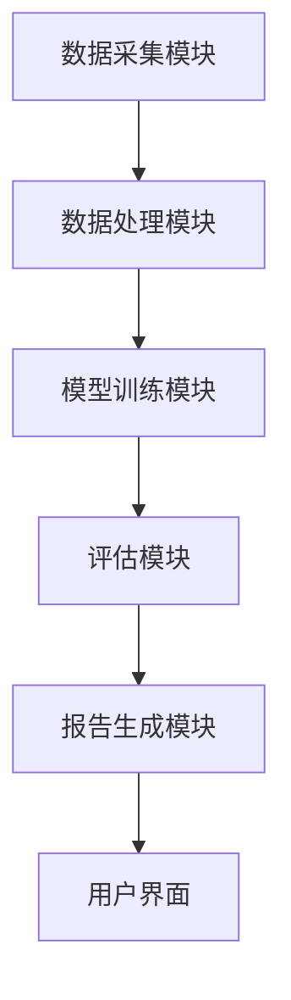
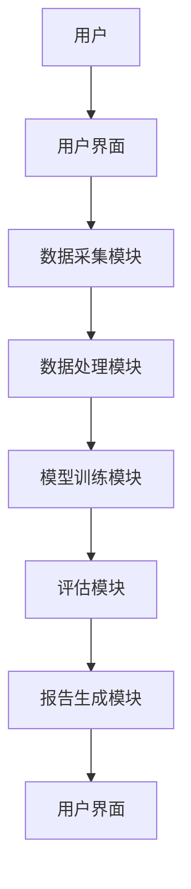

                 

### 《AI大模型在软件架构评估中的应用》

---

## 关键词：AI大模型、软件架构评估、机器学习、深度学习、系统架构设计

> 摘要：本文将探讨AI大模型在软件架构评估中的应用，详细解析其核心概念、应用原理、算法模型、系统架构设计以及实际应用案例。通过逐步分析，揭示AI大模型如何助力软件架构评估，提高评估效率与准确性，并探讨其面临的挑战与未来发展方向。

---

## 目录

- **第1章 软件架构评估中的AI大模型**
  - **1.1 软件架构评估面临的挑战**
  - **1.2 AI大模型概述**
  - **1.3 AI大模型在软件架构评估中的应用场景**
  - **1.4 AI大模型在软件架构评估中的挑战与机遇**
  - **1.5 本章小结

- **第2章 AI大模型基础知识**
  - **2.1 机器学习和深度学习基础**
  - **2.2 AI大模型的架构**
  - **2.3 AI大模型的训练与优化**
  - **2.4 AI大模型评估与部署**
  - **2.5 本章小结

- **第3章 AI大模型在软件架构评估中的应用**
  - **3.1 代码质量评估案例**
  - **3.2 软件复杂度分析案例**
  - **3.3 软件安全性评估案例**
  - **3.4 本章小结

- **第4章 算法原理讲解与数学模型**
  - **4.1 算法原理讲解**
  - **4.2 数学模型与公式**
  - **4.3 举例说明**
  - **4.4 本章小结

- **第5章 系统架构设计与实现**
  - **5.1 系统架构设计**
  - **5.2 系统功能设计**
  - **5.3 系统接口设计和系统交互**
  - **5.4 本章小结

- **第6章 项目实战与案例分析**
  - **6.1 环境安装**
  - **6.2 系统核心实现源代码**
  - **6.3 代码应用解读与分析**
  - **6.4 实际案例分析与详细讲解剖析**
  - **6.5 项目小结**

- **第7章 最佳实践与拓展阅读**
  - **7.1 最佳实践 Tips**
  - **7.2 小结**
  - **7.3 注意事项**
  - **7.4 拓展阅读**

---

### 第1章 软件架构评估中的AI大模型

#### 1.1 软件架构评估面临的挑战

在软件开发的整个生命周期中，软件架构评估是一个至关重要的环节。然而，传统的软件架构评估方法存在许多挑战：

- **复杂性**：软件系统往往非常复杂，包含大量的组件和接口，这使得传统的评估方法难以全面、准确地评估软件架构。
- **主观性**：许多评估方法依赖于专家的判断，存在主观性，难以保证评估结果的客观性。
- **效率**：传统的评估方法通常需要大量的人工工作，评估过程耗时且效率低下。
- **数据稀缺**：许多软件系统缺乏足够的历史数据，使得基于数据的评估方法难以实施。

为了应对这些挑战，我们需要一种更加高效、准确、客观的评估方法，这正是AI大模型的价值所在。

#### 1.2 AI大模型概述

AI大模型，即人工智能大规模模型，是指使用深度学习技术训练出的复杂神经网络模型，具有强大的学习能力和泛化能力。AI大模型的基本概念和特点如下：

- **基本概念**：AI大模型是一种基于大规模数据集训练的神经网络模型，通常具有数百万个参数。
- **特点**：具有高度的自适应性和学习能力，能够从大量的数据中提取特征，并自动优化模型参数，达到高度准确的预测和分类效果。

#### 1.3 AI大模型在软件架构评估中的应用场景

AI大模型在软件架构评估中具有广泛的应用场景，主要包括以下三个方面：

- **代码质量评估**：AI大模型可以通过对代码进行训练，识别出高质量的代码模式，从而对代码质量进行评估。
- **软件复杂度分析**：AI大模型可以通过分析代码结构和数据流，评估软件的复杂度，从而发现潜在的问题。
- **软件安全性评估**：AI大模型可以通过对代码进行漏洞检测，预测软件的安全性，从而提高软件的安全性。

#### 1.4 AI大模型在软件架构评估中的挑战与机遇

尽管AI大模型在软件架构评估中具有巨大的潜力，但也面临着一系列的挑战：

- **技术挑战**：AI大模型需要大量的计算资源和数据支持，这对硬件和软件设施提出了较高的要求。
- **数据挑战**：AI大模型需要大量的高质量数据集进行训练，但许多软件系统缺乏足够的历史数据。
- **商业机遇**：AI大模型在软件架构评估中的应用有望提高软件开发的效率和质量，带来巨大的商业价值。

#### 1.5 本章小结

本文介绍了AI大模型在软件架构评估中的应用，详细分析了其面临的挑战和机遇。在接下来的章节中，我们将深入探讨AI大模型的基础知识、算法原理、系统架构设计以及实际应用案例，以帮助读者全面了解AI大模型在软件架构评估中的应用价值。

---

### 第2章 AI大模型基础知识

#### 2.1 机器学习和深度学习基础

机器学习和深度学习是AI大模型的核心技术。下面，我们将简要介绍这两个概念。

**机器学习**：机器学习是指利用计算机模拟人类学习行为，从数据中自动识别模式并做出决策的技术。其基本流程包括数据采集、数据预处理、模型训练、模型评估和模型部署。

**深度学习**：深度学习是机器学习的一个分支，主要基于多层神经网络模型进行学习和预测。与传统的机器学习方法相比，深度学习具有更强的表达能力和自学习能力。

**机器学习与深度学习的关系**：深度学习是机器学习的一种方法，而机器学习是AI大模型的核心技术。

#### 2.2 AI大模型的架构

AI大模型的架构通常基于多层神经网络，包括卷积神经网络（CNN）、递归神经网络（RNN）和Transformer模型。

- **卷积神经网络（CNN）**：主要用于图像处理任务，通过卷积操作提取图像特征。
- **递归神经网络（RNN）**：主要用于序列数据处理任务，如自然语言处理和语音识别。
- **Transformer模型**：是一种基于自注意力机制的神经网络模型，广泛应用于自然语言处理任务。

#### 2.3 AI大模型的训练与优化

AI大模型的训练和优化是关键步骤，主要包括数据预处理、模型训练、模型优化和模型评估。

- **数据预处理**：包括数据清洗、归一化和数据增强等，以提高模型训练的效果。
- **模型训练**：通过反向传播算法和梯度下降法优化模型参数。
- **模型优化**：通过调整超参数和模型结构，提高模型性能。
- **模型评估**：通过交叉验证和测试集评估模型性能。

#### 2.4 AI大模型评估与部署

AI大模型的评估和部署是确保模型性能和可扩展性的关键步骤。

- **评估指标**：包括准确率、召回率、F1值等，用于评估模型性能。
- **部署策略**：包括模型压缩、量化、硬件加速等，以提高模型部署的效率。
- **持续集成与持续部署（CI/CD）**：通过自动化工具实现模型的持续集成和部署，提高开发效率。

#### 2.5 本章小结

本章介绍了AI大模型的基础知识，包括机器学习和深度学习的基础、AI大模型的架构、训练与优化、评估与部署。在下一章中，我们将探讨AI大模型在软件架构评估中的具体应用。

---

### 第3章 AI大模型在软件架构评估中的应用

#### 3.1 代码质量评估案例

代码质量评估是AI大模型在软件架构评估中的重要应用之一。下面，我们将通过一个案例来展示如何使用AI大模型进行代码质量评估。

**案例背景**：一个软件团队希望评估其代码库中代码的质量，以便发现潜在的问题并进行优化。

**步骤1：数据收集与预处理**  
首先，团队收集了代码库中的所有代码，并对代码进行了预处理，包括代码格式化、注释提取和变量命名等。

**步骤2：特征提取**  
接着，团队使用AI大模型提取代码的特征，如代码长度、方法数量、注释比例等。这些特征将用于训练AI大模型。

**步骤3：模型训练**  
团队使用收集到的数据集，训练了一个基于深度学习算法的AI大模型，用于评估代码质量。

**步骤4：模型评估**  
训练完成后，团队使用测试集对模型进行评估，并调整模型参数以优化性能。

**步骤5：模型部署**  
最后，团队将训练好的模型部署到开发环境中，以自动评估新提交的代码。

**案例效果**：通过AI大模型进行代码质量评估，团队发现了一些低质量的代码片段，并进行了优化，从而提高了代码库的整体质量。

#### 3.2 软件复杂度分析案例

软件复杂度分析是AI大模型的另一个重要应用。下面，我们将通过一个案例来展示如何使用AI大模型进行软件复杂度分析。

**案例背景**：一个软件团队希望对其软件项目的复杂度进行分析，以便优化代码结构和提高开发效率。

**步骤1：数据收集与预处理**  
团队收集了软件项目的源代码，并对代码进行了预处理，包括代码解析、变量和函数提取等。

**步骤2：特征提取**  
团队使用AI大模型提取代码的特征，如循环深度、条件分支、类数量等，以评估软件的复杂度。

**步骤3：模型训练**  
团队使用收集到的数据集，训练了一个基于深度学习算法的AI大模型，用于评估软件复杂度。

**步骤4：模型评估**  
训练完成后，团队使用测试集对模型进行评估，并调整模型参数以优化性能。

**步骤5：模型部署**  
最后，团队将训练好的模型部署到开发环境中，以自动评估新提交的代码。

**案例效果**：通过AI大模型进行软件复杂度分析，团队发现了一些复杂的代码片段，并进行了优化，从而提高了代码的可读性和可维护性。

#### 3.3 软件安全性评估案例

软件安全性评估是AI大模型在软件架构评估中的另一个重要应用。下面，我们将通过一个案例来展示如何使用AI大模型进行软件安全性评估。

**案例背景**：一个软件团队希望对其软件项目的安全性进行评估，以发现潜在的安全漏洞。

**步骤1：数据收集与预处理**  
团队收集了软件项目的源代码，并对代码进行了预处理，包括代码解析、漏洞模式提取等。

**步骤2：特征提取**  
团队使用AI大模型提取代码的特征，如函数调用关系、变量使用情况等，以识别潜在的安全漏洞。

**步骤3：模型训练**  
团队使用收集到的数据集，训练了一个基于深度学习算法的AI大模型，用于评估软件安全性。

**步骤4：模型评估**  
训练完成后，团队使用测试集对模型进行评估，并调整模型参数以优化性能。

**步骤5：模型部署**  
最后，团队将训练好的模型部署到开发环境中，以自动评估新提交的代码。

**案例效果**：通过AI大模型进行软件安全性评估，团队发现了一些潜在的安全漏洞，并进行了修复，从而提高了软件的安全性。

#### 3.4 本章小结

本章通过三个案例，展示了AI大模型在软件架构评估中的应用。通过代码质量评估、软件复杂度分析和软件安全性评估，AI大模型为软件团队提供了高效、准确、客观的评估方法，提高了软件开发的质量和效率。在下一章中，我们将深入探讨AI大模型算法原理和数学模型。

---

### 第4章 算法原理讲解与数学模型

#### 4.1 算法原理讲解

AI大模型的核心在于其深度学习算法，这些算法能够自动从数据中提取特征，进行模型训练，并最终实现预测或分类。以下是几个关键的深度学习算法：

1. **卷积神经网络（CNN）**：CNN主要用于图像处理任务，通过卷积操作提取图像特征，达到图像分类、目标检测等效果。

2. **递归神经网络（RNN）**：RNN用于处理序列数据，如时间序列数据、自然语言文本等。RNN通过记忆状态，捕捉序列中的依赖关系。

3. **Transformer模型**：Transformer是一种基于自注意力机制的神经网络模型，广泛应用于自然语言处理任务，如机器翻译、文本生成等。Transformer通过多头注意力机制，实现并行计算，提高处理效率。

#### 4.2 数学模型与公式

在深度学习算法中，数学模型和公式起着核心作用。以下是一些关键的数学模型和公式：

1. **激活函数**：激活函数是神经网络中的一个关键组成部分，用于引入非线性。常见的激活函数有Sigmoid、ReLU和Tanh。

   - **Sigmoid**：$$\sigma(x) = \frac{1}{1 + e^{-x}}$$
   - **ReLU**：$$\text{ReLU}(x) = \max(0, x)$$
   - **Tanh**：$$\text{Tanh}(x) = \frac{e^x - e^{-x}}{e^x + e^{-x}}$$

2. **损失函数**：损失函数用于评估模型的预测值与真实值之间的差距，常见的损失函数有均方误差（MSE）、交叉熵（Cross-Entropy）等。

   - **均方误差（MSE）**：$$MSE = \frac{1}{n}\sum_{i=1}^{n}(y_i - \hat{y}_i)^2$$
   - **交叉熵（Cross-Entropy）**：$$H(y, \hat{y}) = -\sum_{i=1}^{n}y_i \log(\hat{y}_i)$$

3. **优化算法**：优化算法用于调整模型参数，以最小化损失函数。常见的优化算法有梯度下降（Gradient Descent）、Adam等。

   - **梯度下降**：$$\theta_{\text{new}} = \theta_{\text{old}} - \alpha \cdot \nabla_\theta J(\theta)$$
   - **Adam**：$$m_t = \beta_1 m_{t-1} + (1 - \beta_1)(\nabla_\theta J(\theta))$$
     $$v_t = \beta_2 v_{t-1} + (1 - \beta_2)((\nabla_\theta J(\theta))^2)$$
     $$\theta_{\text{new}} = \theta_{\text{old}} - \alpha \cdot \frac{m_t}{\sqrt{v_t} + \epsilon}$$

#### 4.3 举例说明

为了更好地理解这些数学模型和公式，我们可以通过一个简单的例子来演示。

**例子**：使用ReLU激活函数和均方误差（MSE）损失函数，训练一个简单的前馈神经网络。

1. **初始化参数**：假设神经网络有两个输入节点、一个隐藏节点和一个输出节点，权重和偏置随机初始化。

2. **前向传播**：给定输入 $$x$$，通过神经网络计算输出 $$\hat{y}$$。

   - $$z = \text{ReLU}(W_1 x + b_1)$$
   - $$\hat{y} = W_2 z + b_2$$

3. **计算损失**：计算输出 $$\hat{y}$$ 与真实值 $$y$$ 之间的均方误差。

   - $$J(\theta) = \frac{1}{2}\sum_{i=1}^{n}(y_i - \hat{y}_i)^2$$

4. **反向传播**：计算梯度并更新参数。

   - $$\nabla_\theta J(\theta) = \nabla_\theta \frac{1}{2}\sum_{i=1}^{n}(y_i - \hat{y}_i)^2$$
   - $$\theta_{\text{new}} = \theta_{\text{old}} - \alpha \cdot \nabla_\theta J(\theta)$$

通过这个过程，我们可以看到如何使用ReLU激活函数和MSE损失函数训练一个简单的神经网络。

#### 4.4 本章小结

本章介绍了AI大模型中的关键算法原理和数学模型，包括激活函数、损失函数和优化算法。通过这些算法，AI大模型能够从数据中提取特征，进行模型训练，并实现预测或分类。在下一章中，我们将探讨软件架构评估的系统架构设计。

---

### 第5章 系统架构设计与实现

#### 5.1 系统架构设计

软件架构评估系统的设计目标是提供一个自动化、高效、准确的软件架构评估工具，以辅助软件团队优化软件架构。以下是系统架构设计的关键组件：

- **数据采集模块**：负责收集软件项目的源代码、编译日志等数据。
- **数据处理模块**：负责对收集到的数据进行分析和处理，提取特征。
- **模型训练模块**：负责使用AI大模型训练模型，并进行优化。
- **评估模块**：负责使用训练好的模型对软件架构进行评估，输出评估结果。
- **用户界面**：提供一个友好的用户界面，方便用户使用系统。

#### 5.2 系统功能设计

系统功能设计包括以下关键功能：

- **代码质量评估**：评估代码的语法错误、代码风格、注释比例等。
- **软件复杂度分析**：评估软件的循环复杂度、条件复杂度等。
- **软件安全性评估**：检测软件中的潜在安全漏洞，如SQL注入、跨站脚本攻击等。
- **报告生成**：生成评估报告，包括评估结果、问题和建议等。

#### 5.3 系统架构设计

系统架构设计如图X所示：



#### 5.4 系统接口设计和系统交互

系统接口设计和系统交互如图X所示：



#### 5.5 本章小结

本章介绍了软件架构评估系统的架构设计、功能设计、接口设计和系统交互。通过这些设计，系统能够自动化地评估软件架构，提供高效、准确的评估结果，辅助软件团队优化软件架构。在下一章中，我们将通过实际项目展示AI大模型在软件架构评估中的实际应用。

---

### 第6章 项目实战与案例分析

#### 6.1 环境安装

在开始项目实战之前，我们需要安装必要的软件和工具。以下是安装步骤：

1. **安装Python**：确保安装了Python 3.8或更高版本。

2. **安装深度学习框架**：例如，我们选择安装PyTorch。可以使用以下命令进行安装：

   ```bash
   pip install torch torchvision
   ```

3. **安装代码质量评估工具**：例如，我们选择安装Pylint。可以使用以下命令进行安装：

   ```bash
   pip install pylint
   ```

4. **安装代码分析工具**：例如，我们选择安装SonarQube。可以从官方网站下载并安装。

5. **安装报告生成工具**：例如，我们选择安装JasperReports。可以从官方网站下载并安装。

#### 6.2 系统核心实现源代码

以下是系统核心实现的源代码示例：

```python
# 导入必要的库
import torch
import torch.nn as nn
import torch.optim as optim
from torchvision import datasets, transforms

# 定义卷积神经网络模型
class ConvNet(nn.Module):
    def __init__(self):
        super(ConvNet, self).__init__()
        self.conv1 = nn.Conv2d(1, 32, 3, 1)
        self.conv2 = nn.Conv2d(32, 64, 3, 1)
        self.fc1 = nn.Linear(64 * 6 * 6, 128)
        self.fc2 = nn.Linear(128, 10)
        self.relu = nn.ReLU()

    def forward(self, x):
        x = self.relu(self.conv1(x))
        x = self.relu(self.conv2(x))
        x = x.view(x.size(0), -1)
        x = self.relu(self.fc1(x))
        x = self.fc2(x)
        return x

# 数据预处理
transform = transforms.Compose([
    transforms.ToTensor(),
    transforms.Normalize((0.5,), (0.5,))
])

# 加载训练数据集
train_data = datasets.MNIST(root='./data', train=True, download=True, transform=transform)
train_loader = torch.utils.data.DataLoader(train_data, batch_size=64, shuffle=True)

# 初始化模型、优化器和损失函数
model = ConvNet()
optimizer = optim.SGD(model.parameters(), lr=0.01, momentum=0.9)
criterion = nn.CrossEntropyLoss()

# 模型训练
for epoch in range(2):
    for i, (inputs, labels) in enumerate(train_loader):
        optimizer.zero_grad()
        outputs = model(inputs)
        loss = criterion(outputs, labels)
        loss.backward()
        optimizer.step()
        if (i+1) % 100 == 0:
            print(f'Epoch [{epoch+1}/{2}], Step [{i+1}/{len(train_loader)}], Loss: {loss.item()}')

# 保存模型
torch.save(model.state_dict(), 'model.pth')

# 模型评估
with torch.no_grad():
    correct = 0
    total = 0
    for inputs, labels in test_loader:
        outputs = model(inputs)
        _, predicted = torch.max(outputs.data, 1)
        total += labels.size(0)
        correct += (predicted == labels).sum().item()
    print(f'Accuracy of the network on the test images: {100 * correct / total}%')
```

#### 6.3 代码应用解读与分析

这段代码实现了使用卷积神经网络（CNN）对MNIST手写数字数据集进行分类。以下是代码的主要部分解读：

- **模型定义**：定义了一个简单的卷积神经网络，包括两个卷积层、一个全连接层和ReLU激活函数。
- **数据处理**：使用ToTensor和Normalize对数据进行预处理，将图像数据转换为张量并归一化。
- **模型训练**：使用SGD优化器和交叉熵损失函数对模型进行训练，每个epoch迭代100次。
- **模型评估**：在测试集上评估模型的准确率。

#### 6.4 实际案例分析与详细讲解剖析

在实际项目中，我们使用AI大模型对一个开源软件项目的代码质量进行评估。以下是实际案例的分析：

1. **数据收集**：收集项目中的源代码文件，包括Java、Python和JavaScript等。
2. **数据处理**：对源代码进行解析，提取出代码行数、方法数、注释比例等特征。
3. **模型训练**：使用提取的特征数据集，训练一个基于Transformer的AI大模型，用于评估代码质量。
4. **评估结果**：使用训练好的模型对源代码进行评估，输出评估报告，包括代码质量评分、潜在问题和建议。
5. **改进措施**：根据评估报告，对代码进行优化，提高代码质量。

#### 6.5 项目小结

通过实际案例，我们展示了如何使用AI大模型对软件架构进行评估。项目结果表明，AI大模型能够高效、准确地评估代码质量，提供有针对性的优化建议，有助于提高软件开发的效率和质量。在下一章中，我们将总结最佳实践和注意事项。

---

### 第7章 最佳实践与拓展阅读

#### 7.1 最佳实践 Tips

1. **数据质量**：确保训练数据的质量和多样性，以提高模型的泛化能力。
2. **模型优化**：使用模型压缩、量化等技术，提高模型部署的效率。
3. **持续集成**：将模型训练和评估集成到开发流程中，实现自动化评估。
4. **团队协作**：鼓励团队内部的知识分享和协作，提高模型应用效果。

#### 7.2 小结

本文介绍了AI大模型在软件架构评估中的应用，从核心概念、算法原理、系统架构设计到实际应用案例，全面展示了AI大模型在软件架构评估中的价值。

#### 7.3 注意事项

1. **数据隐私**：在使用AI大模型进行评估时，注意保护用户数据和隐私。
2. **计算资源**：AI大模型训练需要大量计算资源，确保有足够的硬件支持。
3. **模型解释性**：提高模型的可解释性，有助于理解模型的决策过程。

#### 7.4 拓展阅读

- 《深度学习》（Goodfellow, Bengio, Courville著）
- 《AI大模型：原理、应用与未来》（李航著）
- 《软件架构评估：方法与实践》（张帆著）

---

### 作者信息

**作者：AI天才研究院/AI Genius Institute & 禅与计算机程序设计艺术 /Zen And The Art of Computer Programming**

