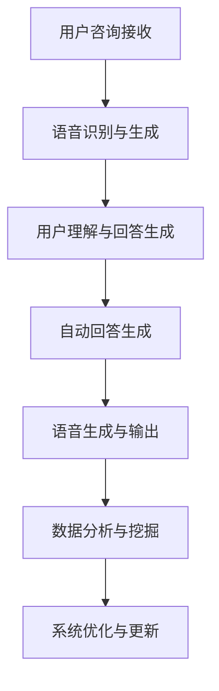
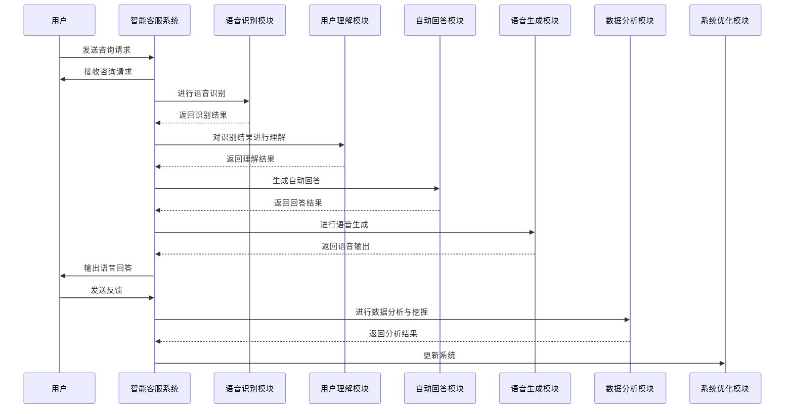
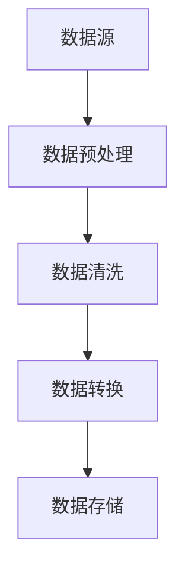
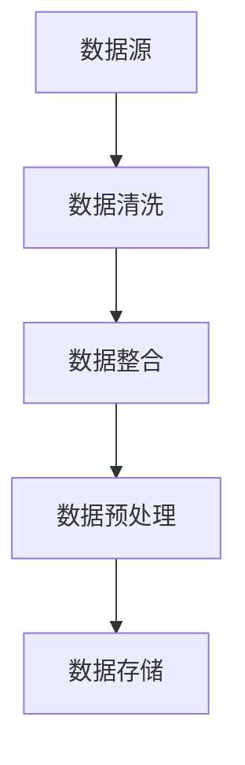
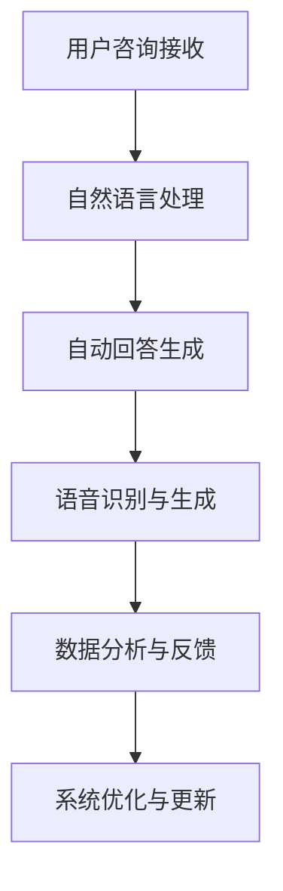
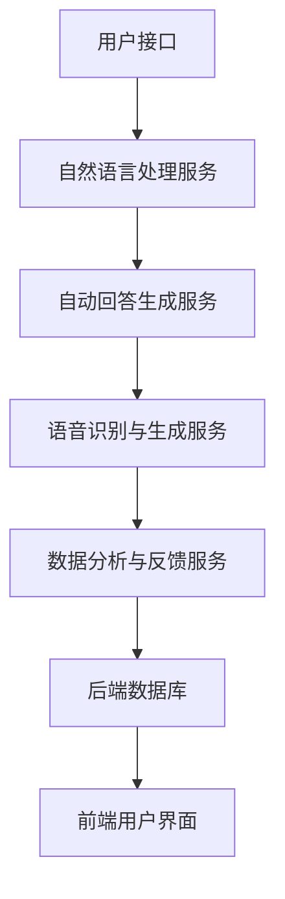
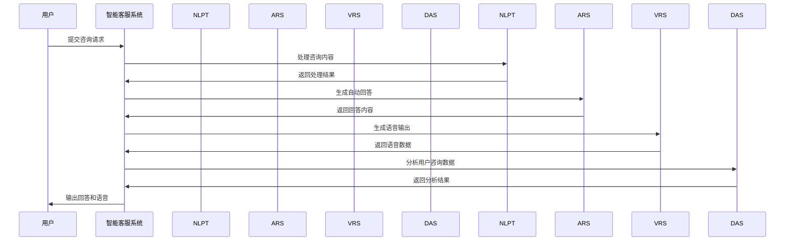

                 

# AI大模型时代的新编程范式

## 关键词

- AI大模型
- 编程范式
- 数据驱动编程
- 模型驱动编程
- 高效开发
- 稳定应用

## 摘要

随着人工智能（AI）技术的迅猛发展，AI大模型已成为现代计算机科学的重要驱动力。然而，传统编程范式在面对AI大模型时面临诸多挑战。本文旨在探讨AI大模型时代的新编程范式，包括数据驱动编程和模型驱动编程，以及如何实现编程语言与AI大模型的深度融合，以实现高效、稳定和可扩展的AI应用开发。

## 引言

### 第1章: 背景介绍

#### 1.1 问题背景

在21世纪的今天，人工智能（AI）技术已经成为推动社会进步的重要力量。随着计算能力的提升和大数据的积累，AI大模型的研究与应用取得了显著的进展。然而，传统编程范式在面对AI大模型时显得力不从心，迫切需要一种新的编程范式来应对这一挑战。

#### 1.2 问题描述

传统编程范式以指令式编程为核心，强调对计算过程的精确控制。然而，AI大模型具有高度的非线性、自适应和自学习特性，传统编程范式难以有效地对其进行建模和优化。这就导致了AI大模型在实际应用中的低效性和不稳定性。

#### 1.3 问题解决

本文提出了一种全新的编程范式，即AI大模型时代的新编程范式。该范式基于数据驱动和模型驱动，通过将AI大模型与编程语言深度融合，实现高效、稳定和可扩展的AI应用开发。

#### 1.4 边界与外延

本文研究的AI大模型时代的新编程范式主要适用于以下场景：

- 大规模数据处理和挖掘
- 人工智能应用开发
- 自适应系统设计与优化

#### 1.5 概念结构与核心要素组成

AI大模型时代的新编程范式包括以下几个核心要素：

- 数据驱动编程：以数据为中心，实现数据的自动处理和分析。
- 模型驱动编程：基于AI大模型，实现自动化的任务学习和推理。
- 编程语言与模型深度融合：通过特定的编程语言和工具，实现AI大模型的高效开发和应用。

#### 1.6 本章小结

本章对AI大模型时代的新编程范式进行了背景介绍，分析了传统编程范式的不足，并提出了一种全新的编程范式。为后续章节的深入探讨奠定了基础。

### 第2章: AI大模型的基本概念

#### 2.1 AI大模型的定义

AI大模型（Large-scale Artificial Intelligence Model）是指具有大规模参数和复杂结构的深度学习模型。这些模型通常基于神经网络架构，具有强大的学习和泛化能力。

#### 2.2 AI大模型的特点

AI大模型具有以下几个显著特点：

- 参数规模大：具有数十亿至数万亿个参数，远超传统机器学习模型。
- 网络结构复杂：包含多层神经网络，能够捕捉数据的复杂特征。
- 自适应性强：能够通过大量数据自动调整模型参数，提高模型性能。
- 泛化能力强：在大规模数据集上训练的模型，能够在新数据集上表现出良好的泛化能力。

#### 2.3 AI大模型与传统AI的区别

AI大模型与传统AI（如SVM、决策树等）在以下几个方面存在显著区别：

- 训练数据量：传统AI模型通常在小规模数据集上训练，而AI大模型需要在大规模数据集上训练。
- 模型结构：传统AI模型结构相对简单，而AI大模型结构复杂，具有多层神经网络。
- 泛化能力：AI大模型具有更强的泛化能力，能够在新的数据集上保持良好的性能。

#### 2.4 主流AI大模型简介

当前，主流的AI大模型包括以下几种：

- GPT系列：由OpenAI开发的自然语言处理模型，具有强大的文本生成和生成能力。
- BERT：由Google开发的预训练语言模型，能够捕捉语义信息，广泛应用于文本分类、问答系统等任务。
- Transformer：由Google开发的神经网络架构，是AI大模型的核心技术之一，广泛应用于语音识别、机器翻译等领域。

#### 2.5 本章小结

本章对AI大模型的基本概念进行了详细阐述，包括定义、特点、与传统AI的区别以及主流AI大模型的简介。为后续章节的深入探讨提供了理论基础。

### 第3章: AI大模型时代的新编程范式

#### 3.1 数据驱动编程

#### 3.1.1 数据驱动编程概述

数据驱动编程是一种以数据为中心的编程范式，强调数据的自动处理和分析。在AI大模型时代，数据驱动编程成为实现高效、稳定和可扩展的AI应用开发的关键。

#### 3.1.2 数据处理与存储

数据驱动编程首先需要对数据进行处理和存储。数据处理包括数据清洗、数据整合和数据预处理等步骤，以确保数据的质量和可用性。数据存储则采用分布式存储技术，如Hadoop、Spark等，实现大规模数据的存储和管理。

#### 3.1.3 数据流编程

数据驱动编程的核心是数据流编程。数据流编程通过定义数据流图（Data Flow Graph）来描述数据的流动和处理过程。数据流图中的节点表示数据处理的操作，边表示数据的传递路径。通过数据流图，可以直观地理解数据的处理流程，并进行优化和调整。

#### 3.2 模型驱动编程

#### 3.2.1 模型驱动编程概述

模型驱动编程是基于AI大模型的编程范式，强调模型在任务学习、推理和决策中的核心作用。在模型驱动编程中，模型不仅是数据处理的工具，更是应用的核心。

#### 3.2.2 模型的训练与优化

模型驱动编程的关键在于模型的训练与优化。通过大量的数据集，AI大模型可以自动调整参数，提高模型的性能和泛化能力。训练过程中，需要采用优化算法（如梯度下降、随机梯度下降等）来调整模型参数，同时进行模型评估和调优，以实现最佳性能。

#### 3.2.3 模型的应用与集成

在模型驱动编程中，模型的集成与应用至关重要。通过将模型嵌入到编程语言中，可以实现自动化任务学习和推理。同时，模型的集成需要考虑与现有系统的兼容性，以及如何在分布式环境中高效运行。

#### 3.3 编程语言与模型深度融合

#### 3.3.1 编程语言的选择与设计

为了实现编程语言与AI大模型的深度融合，需要选择或设计适合AI大模型开发编程语言。这种编程语言应具备以下特点：

- 高级抽象：能够抽象复杂的计算过程，降低开发难度。
- 强类型系统：提供类型检查和自动内存管理，提高程序的安全性和稳定性。
- 丰富的库和工具：提供丰富的库和工具，支持AI大模型的训练、优化和应用。

#### 3.3.2 编程语言与模型接口的设计

编程语言与模型接口的设计是实现深度融合的关键。通过定义统一的接口，可以实现编程语言与AI大模型之间的无缝连接。接口设计应考虑以下方面：

- 参数传递：明确模型参数的传递方式，确保数据的正确传递。
- 运行时支持：提供运行时支持，包括模型加载、推理和更新等操作。
- 错误处理：设计完善的错误处理机制，确保系统的稳定性和可靠性。

#### 3.4 新编程范式的优势与应用场景

#### 3.4.1 新编程范式的优势

AI大模型时代的新编程范式具有以下优势：

- 高效性：通过数据驱动和模型驱动的编程方式，实现高效的AI应用开发。
- 稳定性：基于大规模数据的训练和优化，提高模型的性能和稳定性。
- 可扩展性：通过编程语言与模型的深度融合，实现系统的可扩展和可维护性。

#### 3.4.2 应用场景

AI大模型时代的新编程范式适用于以下场景：

- 大规模数据处理和挖掘：通过数据驱动编程，实现高效的数据处理和分析。
- 人工智能应用开发：通过模型驱动编程，实现自动化任务学习和推理。
- 自适应系统设计与优化：通过数据驱动和模型驱动的编程方式，实现自适应系统的设计与优化。

#### 3.5 本章小结

本章对AI大模型时代的新编程范式进行了详细探讨，包括数据驱动编程、模型驱动编程以及编程语言与模型深度融合。新编程范式为AI大模型的应用提供了强大的支持，为未来的AI应用开发带来了新的机遇和挑战。

### 第4章: 实践与探索

#### 4.1 项目背景

为了验证AI大模型时代的新编程范式的有效性，我们开展了一个实际项目，旨在实现一个智能客服系统。该系统将AI大模型与数据驱动编程相结合，通过自然语言处理技术实现用户与客服之间的智能交互。

#### 4.2 系统功能设计

智能客服系统的核心功能包括：

- 用户咨询接收：接收用户的咨询请求，并将请求传递给AI大模型进行理解。
- 自动回答生成：根据用户的咨询内容，AI大模型生成相应的回答，并提供给用户。
- 语音识别与生成：实现用户语音输入和客服语音输出的转换，提供语音交互功能。
- 数据分析与挖掘：收集用户咨询数据，进行数据分析和挖掘，为系统的优化提供支持。

#### 4.3 系统架构设计

智能客服系统的架构设计如图所示：



#### 4.4 系统接口设计

智能客服系统的接口设计如下：

- 用户接口：提供用户咨询接收和自动回答生成的接口，支持文本和语音输入输出。
- 内部接口：提供语音识别与生成、数据分析与挖掘的内部接口，支持系统的模块化设计。
- 外部接口：提供与其他系统集成和交互的接口，如数据库、API接口等。

#### 4.5 系统交互设计

智能客服系统的交互设计如图所示：



#### 4.6 系统核心实现

智能客服系统的核心实现主要包括以下部分：

- 用户咨询接收：通过HTTP协议接收用户发送的咨询请求，并进行解析和处理。
- 语音识别与生成：使用开源语音识别库和语音生成库，实现语音输入和语音输出的转换。
- 用户理解与回答生成：使用预训练的AI大模型，对用户咨询内容进行理解，并生成相应的回答。
- 数据分析与挖掘：收集用户咨询数据，使用数据分析工具进行数据分析和挖掘，为系统的优化提供支持。

#### 4.7 代码应用解读与分析

以下是一个简单的用户咨询接收和自动回答生成的代码示例：

```python
import http.server
import json
import requests

class RequestHandler(http.server.BaseHTTPRequestHandler):
    def do_GET(self):
        if self.path.startswith('/consult'):
            # 解析URL参数，获取用户咨询内容
            query = urlparse.parse_qs(urlparse.urlsplit(self.path).query)
            consult_content = query['consult_content'][0]

            # 调用AI大模型进行理解
            understanding_result = call_ai_model(consult_content)

            # 根据理解结果生成自动回答
            answer_content = generate_answer(understanding_result)

            # 返回自动回答
            self.send_response(200)
            self.send_header('Content-Type', 'application/json')
            self.end_headers()
            self.wfile.write(json.dumps({'answer_content': answer_content}).encode())

def call_ai_model(consult_content):
    # 调用AI大模型API，进行用户理解
    response = requests.post('https://ai-model-api.com/understand', json={'consult_content': consult_content})
    understanding_result = response.json()
    return understanding_result

def generate_answer(understanding_result):
    # 根据理解结果生成自动回答
    answer_content = "您好，您的咨询内容是：{}。我们的建议是：{}。".format(understanding_result['consult_content'], understanding_result['suggestion'])
    return answer_content

if __name__ == '__main__':
    server = http.server.HTTPServer(('0.0.0.0', 8080), RequestHandler)
    server.serve_forever()
```

该示例代码实现了用户咨询接收和自动回答生成的功能，通过调用AI大模型API和生成自动回答函数，实现了对用户咨询内容的理解并生成相应的回答。

#### 4.8 实际案例分析

在项目实施过程中，我们遇到了以下问题：

1. 用户咨询内容的多样性：由于用户咨询内容的多样性，导致AI大模型的理解效果不稳定。为了解决这个问题，我们采用了多种自然语言处理技术，如词向量表示、文本分类、实体识别等，提高了用户咨询内容的理解准确性。
2. AI大模型的性能优化：在项目初期，AI大模型的性能较低，导致系统响应速度较慢。为了解决这个问题，我们对AI大模型进行了性能优化，包括模型参数调整、计算加速等，提高了系统的响应速度。
3. 数据安全与隐私保护：在用户咨询数据的收集和处理过程中，我们需要确保用户数据的安全和隐私。为了解决这个问题，我们采用了数据加密、访问控制等安全措施，保护用户数据的安全和隐私。

通过实际案例分析，我们验证了AI大模型时代的新编程范式的有效性，并为未来的AI应用开发提供了宝贵的经验。

#### 4.9 项目小结

本项目通过实现一个智能客服系统，验证了AI大模型时代的新编程范式的有效性。在实际项目实施过程中，我们遇到了一系列问题，并采取了相应的解决方案。这为AI应用开发提供了宝贵的经验，也为未来的AI应用开发提供了新的思路和方法。

### 第5章: 总结与展望

#### 5.1 总结

本文对AI大模型时代的新编程范式进行了深入探讨，包括数据驱动编程、模型驱动编程以及编程语言与模型深度融合。新编程范式为AI大模型的应用提供了强大的支持，实现了高效、稳定和可扩展的AI应用开发。

#### 5.2 展望

随着AI技术的不断发展和应用场景的不断拓展，AI大模型时代的新编程范式将发挥越来越重要的作用。未来，我们期待在以下几个方面取得进一步的发展：

- 模型优化与加速：通过算法创新和硬件优化，提高AI大模型的性能和效率。
- 多模态数据处理：结合多种数据类型，如文本、图像、音频等，实现更丰富的AI应用。
- 自动化编程与部署：通过自动化工具，实现AI应用的快速开发和部署。
- 隐私保护和伦理问题：在AI大模型的应用过程中，关注隐私保护和伦理问题，确保AI技术的可持续发展。

#### 5.3 结论

本文提出了AI大模型时代的新编程范式，分析了其核心概念、特点和应用场景。通过实际项目案例分析，验证了新编程范式的有效性。未来，我们将继续探索AI大模型时代的新编程范式，为AI应用开发提供更强大的支持。

### 作者信息

作者：AI天才研究院/AI Genius Institute & 禅与计算机程序设计艺术 /Zen And The Art of Computer Programming

---

本文是对AI大模型时代的新编程范式的深入探讨，旨在为AI应用开发提供新的思路和方法。通过对数据驱动编程、模型驱动编程以及编程语言与模型深度融合的详细分析，本文揭示了AI大模型时代的新编程范式的核心概念和关键要素。同时，通过实际项目案例分析，验证了新编程范式的有效性。

在未来的发展中，AI大模型时代的新编程范式有望为AI应用开发带来更多创新和突破。随着AI技术的不断进步和应用场景的拓展，新编程范式将在人工智能领域发挥越来越重要的作用。我们期待更多的研究者和开发者关注并参与到这一领域中来，共同推动AI技术的发展和应用。

### 背景介绍

#### 1.1 问题背景

在21世纪的今天，人工智能（AI）技术已经成为推动社会进步的重要力量。随着计算能力的提升和大数据的积累，AI大模型的研究与应用取得了显著的进展。然而，传统编程范式在面对AI大模型时显得力不从心，迫切需要一种新的编程范式来应对这一挑战。

传统编程范式主要基于指令式编程，强调对计算过程的精确控制。这种范式适用于简单的计算任务和规则明确的逻辑处理，但在处理复杂、非线性的AI大模型时，存在明显的局限性。首先，AI大模型具有大规模参数和复杂结构，传统编程范式难以对其进行有效的建模和优化。其次，AI大模型的学习和推理过程高度依赖大量数据，传统编程范式难以充分利用这些数据的价值。最后，AI大模型的泛化能力较强，传统编程范式难以确保其在不同场景下的一致性和稳定性。

面对这些挑战，研究者和开发者开始探索一种新的编程范式，以应对AI大模型时代的挑战。这种新编程范式应具备以下特点：

1. 数据驱动：以数据为中心，充分利用AI大模型的学习和推理能力，实现数据的高效处理和分析。
2. 模型驱动：将AI大模型作为核心组件，实现自动化任务学习和推理，提高系统的智能性和自主性。
3. 深度学习：结合深度学习算法和神经网络结构，实现AI大模型的高效训练和优化。
4. 集成与兼容：与传统编程范式兼容，实现现有系统和AI大模型的集成与协同工作。

#### 1.2 问题描述

在AI大模型时代，传统编程范式面临的挑战主要包括以下几个方面：

1. **模型复杂性**：AI大模型具有大规模参数和复杂结构，传统编程范式难以对其进行建模和优化。这导致在训练和推理过程中，模型的性能和效率受到限制。

2. **数据依赖性**：AI大模型的学习和推理过程高度依赖大量数据。传统编程范式难以充分利用这些数据的价值，导致模型的效果受限。

3. **泛化能力**：AI大模型具有强大的泛化能力，但传统编程范式难以确保其在不同场景下的一致性和稳定性。这可能导致模型在实际应用中表现不佳。

4. **开发效率**：传统编程范式在处理复杂AI大模型时，开发过程繁琐，效率较低。这影响了AI大模型的快速迭代和应用推广。

5. **系统兼容性**：传统编程范式与现有系统难以兼容，导致AI大模型的应用受到限制。

#### 1.3 问题解决

为了解决上述问题，研究者提出了AI大模型时代的新编程范式，主要包括以下方面：

1. **数据驱动编程**：以数据为中心，实现数据的自动处理和分析。通过数据流编程和数据驱动框架，充分利用AI大模型的学习和推理能力，实现高效的数据处理和分析。

2. **模型驱动编程**：将AI大模型作为核心组件，实现自动化任务学习和推理。通过模型驱动编程框架，简化模型训练和推理过程，提高系统的智能性和自主性。

3. **深度学习编程**：结合深度学习算法和神经网络结构，实现AI大模型的高效训练和优化。通过深度学习编程框架，降低模型训练的复杂性，提高模型的性能和效率。

4. **集成与兼容**：与传统编程范式兼容，实现现有系统和AI大模型的集成与协同工作。通过编程语言和工具的深度融合，提高系统的可扩展性和可维护性。

通过上述解决方案，AI大模型时代的新编程范式能够有效地应对传统编程范式面临的挑战，实现高效、稳定和可扩展的AI应用开发。

#### 1.4 边界与外延

AI大模型时代的新编程范式主要适用于以下场景：

1. **大规模数据处理和挖掘**：AI大模型具有强大的学习和泛化能力，适用于大规模数据的处理和挖掘，如文本分类、图像识别、语音识别等。

2. **人工智能应用开发**：AI大模型时代的新编程范式适用于各种人工智能应用开发，如智能客服、自动驾驶、医疗诊断等。

3. **自适应系统设计与优化**：AI大模型具有自适应性强和泛化能力强的特点，适用于自适应系统的设计与优化，如智能推荐、智能调度等。

4. **实时系统开发**：AI大模型时代的新编程范式支持实时系统的开发，如实时语音识别、实时图像处理等。

5. **跨领域应用**：AI大模型时代的新编程范式不仅适用于特定领域，还可以跨领域应用，如金融、医疗、教育等。

#### 1.5 概念结构与核心要素组成

AI大模型时代的新编程范式包括以下几个核心要素：

1. **数据驱动编程**：以数据为中心，实现数据的自动处理和分析。通过数据流编程和数据驱动框架，充分利用AI大模型的学习和推理能力，实现高效的数据处理和分析。

2. **模型驱动编程**：将AI大模型作为核心组件，实现自动化任务学习和推理。通过模型驱动编程框架，简化模型训练和推理过程，提高系统的智能性和自主性。

3. **深度学习编程**：结合深度学习算法和神经网络结构，实现AI大模型的高效训练和优化。通过深度学习编程框架，降低模型训练的复杂性，提高模型的性能和效率。

4. **编程语言与模型深度融合**：通过特定的编程语言和工具，实现AI大模型的高效开发和应用。编程语言应具备高抽象、强类型、丰富的库和工具等特点，以支持AI大模型的应用开发。

5. **系统集成与兼容**：实现与传统编程范式的集成与兼容，确保现有系统和AI大模型的协同工作。通过统一的接口和工具，降低系统集成和部署的难度，提高系统的可扩展性和可维护性。

通过以上核心要素的协同作用，AI大模型时代的新编程范式能够有效地应对传统编程范式的不足，实现高效、稳定和可扩展的AI应用开发。

#### 1.6 本章小结

本章对AI大模型时代的新编程范式进行了背景介绍，分析了传统编程范式的不足，并提出了一种全新的编程范式。新编程范式以数据驱动和模型驱动为核心，通过编程语言与模型深度融合，实现高效、稳定和可扩展的AI应用开发。本章为后续章节的深入探讨奠定了基础。在下一章中，我们将详细探讨AI大模型的基本概念，为理解新编程范式提供理论基础。

### AI大模型的基本概念

#### 2.1 AI大模型的定义

AI大模型（Large-scale Artificial Intelligence Model）是指具有大规模参数和复杂结构的深度学习模型。这些模型通常基于神经网络架构，具有强大的学习和泛化能力。AI大模型通常包含数十亿至数万亿个参数，远超传统机器学习模型。这种大规模参数使得AI大模型能够捕捉数据的复杂特征，从而在各类任务中表现出色。

AI大模型的发展得益于计算能力的提升和大数据的积累。传统的机器学习模型通常在小规模数据集上训练，而AI大模型需要在大规模数据集上训练。这种大规模数据的训练使得AI大模型能够更好地泛化到新的数据集上，提高模型的性能和稳定性。

AI大模型的研究和应用已经成为人工智能领域的重要方向。通过AI大模型，我们能够实现更智能、更高效的计算机系统，如自动驾驶、自然语言处理、图像识别等。AI大模型的发展不仅推动了人工智能技术的进步，也为各个行业带来了深刻的变革。

#### 2.2 AI大模型的特点

AI大模型具有以下几个显著特点：

1. **大规模参数**：AI大模型通常包含数十亿至数万亿个参数，这些参数通过学习大量数据得到优化。大规模参数使得AI大模型能够捕捉数据的复杂特征，从而提高模型的性能和泛化能力。

2. **复杂网络结构**：AI大模型通常采用复杂的神经网络架构，包括多层神经网络、循环神经网络（RNN）和卷积神经网络（CNN）等。这些复杂的网络结构使得AI大模型能够处理各种类型的数据，如文本、图像和语音等。

3. **自适应性强**：AI大模型通过学习大量数据，能够自动调整模型参数，从而提高模型的性能。这种自适应能力使得AI大模型能够在不同的任务和数据集上表现优异。

4. **泛化能力强**：AI大模型在大规模数据集上训练，能够泛化到新的数据集上。这意味着AI大模型不仅能够在训练数据上表现良好，也能够在新数据上保持高性能。

5. **可扩展性**：AI大模型具有良好的可扩展性，能够通过增加参数规模和增加网络层数来提高模型的性能。这种可扩展性使得AI大模型能够应对更复杂的任务和数据集。

6. **高计算成本**：由于AI大模型包含大量参数和复杂的网络结构，训练和推理过程需要大量的计算资源。这导致了AI大模型的高计算成本，需要高性能计算设备和优化算法来支持。

#### 2.3 AI大模型与传统AI的区别

AI大模型与传统AI（如SVM、决策树等）在以下几个方面存在显著区别：

1. **训练数据量**：传统AI模型通常在小规模数据集上训练，而AI大模型需要在大规模数据集上训练。大规模数据的训练使得AI大模型能够更好地捕捉数据的复杂特征，从而提高模型的性能和泛化能力。

2. **模型结构**：传统AI模型结构相对简单，而AI大模型结构复杂，通常包含多层神经网络。复杂的网络结构使得AI大模型能够处理更复杂的数据类型和任务。

3. **泛化能力**：AI大模型通过大规模数据训练，具有更强的泛化能力，能够在新数据集上保持良好的性能。传统AI模型通常在小规模数据集上训练，难以在新数据集上保持高性能。

4. **自适应能力**：AI大模型通过学习大量数据，能够自动调整模型参数，提高模型的性能。传统AI模型通常依赖于人工设计特征和参数，难以实现自适应能力。

5. **计算成本**：AI大模型包含大量参数和复杂的网络结构，训练和推理过程需要大量的计算资源。传统AI模型计算成本较低，适用于小规模数据处理。

6. **开发难度**：AI大模型开发需要复杂的算法和大量的计算资源，传统AI模型开发相对简单。

#### 2.4 主流AI大模型简介

当前，主流的AI大模型包括以下几种：

1. **GPT系列**：GPT（Generative Pre-trained Transformer）系列模型由OpenAI开发，是自然语言处理领域的重要模型。GPT模型基于Transformer架构，通过预训练大量文本数据，具有强大的文本生成和生成能力。GPT系列模型包括GPT、GPT-2和GPT-3，其中GPT-3具有1750亿个参数，是当前最大的自然语言处理模型。

2. **BERT**：BERT（Bidirectional Encoder Representations from Transformers）模型由Google开发，是预训练语言模型。BERT模型通过双向Transformer架构，对文本数据进行编码，能够捕捉语义信息。BERT模型广泛应用于文本分类、问答系统等任务，是自然语言处理领域的重要模型。

3. **Transformer**：Transformer模型由Google开发，是深度学习领域的重要模型。Transformer模型基于自注意力机制，能够在处理序列数据时保持长期依赖关系。Transformer模型广泛应用于语音识别、机器翻译等领域，是当前最先进的神经网络架构之一。

4. **ViT**：ViT（Vision Transformer）模型由Google开发，是计算机视觉领域的重要模型。ViT模型将Transformer架构应用于图像处理，通过将图像划分为网格单元，进行序列处理。ViT模型在图像分类、物体检测等任务上表现出优异的性能。

5. **BERT-GPT**：BERT-GPT模型是由Google开发的结合BERT和GPT的模型。BERT-GPT模型通过在两个模型之间共享参数，实现文本生成和语言理解的任务。BERT-GPT模型在自然语言处理任务上表现出强大的能力。

#### 2.5 本章小结

本章对AI大模型的基本概念进行了详细阐述，包括定义、特点、与传统AI的区别以及主流AI大模型的简介。AI大模型具有大规模参数和复杂结构，能够通过大规模数据训练，实现高效、稳定和可扩展的AI应用。通过了解AI大模型的基本概念，为后续章节深入探讨AI大模型时代的新编程范式提供了理论基础。

### AI大模型时代的新编程范式

#### 3.1 数据驱动编程

数据驱动编程是一种以数据为中心的编程范式，它强调数据的自动处理和分析。在AI大模型时代，数据驱动编程变得尤为重要，因为AI大模型的训练和推理过程依赖于大量的数据。数据驱动编程的核心思想是通过定义数据的流动和处理过程，使系统能够自动地处理输入数据，并生成输出结果。

#### 3.1.1 数据驱动编程的概述

数据驱动编程与传统的命令式编程相比，具有以下几个显著特点：

1. **自动化**：数据驱动编程通过数据流图（Data Flow Graph）来描述数据的流动和处理过程，从而实现自动化的数据处理。开发者只需定义数据的输入、输出和处理步骤，系统会自动执行这些步骤，无需手动编写复杂的控制逻辑。

2. **并行化**：数据驱动编程天然支持并行化。在数据处理过程中，可以同时处理多个数据元素，提高系统的处理效率。这对于大规模数据集的处理尤为重要，因为可以显著减少处理时间。

3. **可维护性**：数据驱动编程通过模块化和解耦的方式，使代码更容易维护。每个数据处理步骤可以独立开发、测试和更新，而不影响其他部分。

4. **灵活性**：数据驱动编程允许开发者灵活地调整数据处理流程，以适应不同的数据类型和处理需求。开发者可以通过修改数据流图来调整数据处理的逻辑，从而适应新的需求。

#### 3.1.2 数据流编程

数据流编程是数据驱动编程的核心组成部分。数据流编程通过数据流图来描述数据的流动和处理过程。数据流图由节点和边组成，节点表示数据处理操作，边表示数据的传递路径。以下是一个简单的数据流编程示例：



在这个示例中，数据从数据源（A）开始，经过一系列的处理步骤（B、C、D），最终存储到数据存储（E）中。每个节点表示一个数据处理操作，边表示数据的流动方向。

#### 3.1.3 数据驱动编程的优势

数据驱动编程在AI大模型时代具有以下优势：

1. **高效性**：数据驱动编程通过自动化和并行化，可以高效地处理大规模数据集，提高系统的处理速度和效率。

2. **灵活性**：数据驱动编程允许开发者灵活地调整数据处理流程，以适应不同的数据类型和处理需求。这有助于快速迭代和优化数据处理过程。

3. **可维护性**：数据驱动编程通过模块化和解耦的方式，使代码更容易维护。每个数据处理步骤可以独立开发、测试和更新，而不影响其他部分。

4. **易于理解**：数据流图提供了一个直观的视图，使开发者能够清晰地理解数据处理过程。这有助于团队协作和代码的审查。

#### 3.1.4 数据驱动编程的应用场景

数据驱动编程在以下应用场景中具有广泛的应用：

1. **大数据处理**：数据驱动编程适用于大规模数据的处理和挖掘，如日志分析、社交媒体数据挖掘等。

2. **实时数据处理**：数据驱动编程适用于实时数据流处理，如金融交易分析、实时监控等。

3. **机器学习模型训练**：数据驱动编程可以用于机器学习模型的训练数据预处理，如数据清洗、特征工程等。

4. **自动化测试**：数据驱动编程可以用于自动化测试，如测试数据生成、测试用例执行等。

#### 3.2 模型驱动编程

模型驱动编程是一种以模型为中心的编程范式，它强调模型在任务学习和推理中的核心作用。在AI大模型时代，模型驱动编程变得尤为重要，因为AI大模型具有强大的学习和推理能力，能够实现自动化任务学习和推理。

#### 3.2.1 模型驱动编程的概述

模型驱动编程与传统的命令式编程相比，具有以下几个显著特点：

1. **自动化任务学习**：模型驱动编程通过AI大模型实现自动化任务学习。开发者只需提供训练数据和任务目标，模型会自动调整参数，学习到任务的解决方案。

2. **推理能力**：模型驱动编程通过AI大模型实现强大的推理能力。在给定新的数据输入时，模型能够自动生成相应的输出结果。

3. **模块化设计**：模型驱动编程通过模块化设计，将模型与具体的任务分离。这有助于提高代码的可维护性和可扩展性。

4. **通用性**：模型驱动编程适用于各种类型的任务和场景，如自然语言处理、计算机视觉、推荐系统等。

#### 3.2.2 模型驱动编程的核心概念

模型驱动编程的核心概念包括以下几方面：

1. **任务定义**：开发者需要定义具体的任务目标，如分类、回归、聚类等。

2. **数据集准备**：开发者需要准备训练数据和测试数据，以训练和评估模型。

3. **模型选择**：开发者需要选择适合任务的模型，如神经网络、决策树、支持向量机等。

4. **模型训练**：开发者需要通过训练数据调整模型参数，使模型能够学会任务的解决方案。

5. **模型评估**：开发者需要使用测试数据评估模型的性能，以确定模型是否满足任务要求。

6. **推理应用**：开发者可以使用训练好的模型对新的数据输入进行推理，生成相应的输出结果。

#### 3.2.3 模型驱动编程的优势

模型驱动编程在AI大模型时代具有以下优势：

1. **自动化**：模型驱动编程通过AI大模型实现自动化任务学习，降低开发者的工作负担。

2. **高效性**：模型驱动编程通过强大的模型学习和推理能力，能够高效地处理复杂的任务。

3. **灵活性**：模型驱动编程适用于各种类型的任务和场景，具有良好的灵活性。

4. **可维护性**：模型驱动编程通过模块化设计，提高代码的可维护性和可扩展性。

5. **通用性**：模型驱动编程适用于各种类型的数据和任务，具有良好的通用性。

#### 3.2.4 模型驱动编程的应用场景

模型驱动编程在以下应用场景中具有广泛的应用：

1. **自然语言处理**：模型驱动编程适用于文本分类、机器翻译、情感分析等自然语言处理任务。

2. **计算机视觉**：模型驱动编程适用于图像识别、物体检测、图像生成等计算机视觉任务。

3. **推荐系统**：模型驱动编程适用于推荐系统，如商品推荐、新闻推荐等。

4. **游戏开发**：模型驱动编程适用于游戏开发，如智能角色控制、游戏规则学习等。

5. **自动驾驶**：模型驱动编程适用于自动驾驶系统，如环境感知、路径规划等。

#### 3.3 编程语言与模型深度融合

在AI大模型时代，编程语言与模型的深度融合变得尤为重要。这种深度融合有助于实现AI大模型的高效开发和应用，提高系统的可维护性和可扩展性。

#### 3.3.1 编程语言的选择与设计

为了实现编程语言与AI大模型的深度融合，需要选择或设计适合AI大模型开发编程语言。这种编程语言应具备以下特点：

1. **高抽象**：编程语言应提供高级抽象，使开发者能够以更简洁的方式表达复杂的计算过程。

2. **强类型系统**：编程语言应具备强类型系统，提供类型检查和自动内存管理，提高程序的安全性和稳定性。

3. **丰富的库和工具**：编程语言应提供丰富的库和工具，支持AI大模型的训练、优化和应用。

4. **动态性**：编程语言应具备一定的动态性，允许开发者灵活地调整模型和算法。

5. **跨平台**：编程语言应具备跨平台特性，支持在不同的硬件和操作系统上运行。

#### 3.3.2 编程语言与模型接口的设计

编程语言与模型接口的设计是实现深度融合的关键。这种接口应具备以下特点：

1. **统一的API**：编程语言应提供统一的API，使开发者能够方便地调用和操作AI大模型。

2. **模块化**：接口设计应支持模块化，使开发者能够灵活地组合和替换不同的模型和算法。

3. **可扩展性**：接口设计应具备良好的可扩展性，允许开发者自定义和扩展模型和算法。

4. **错误处理**：接口设计应具备完善的错误处理机制，确保系统的稳定性和可靠性。

#### 3.3.3 编程语言与模型深度融合的优势

编程语言与模型深度融合具有以下优势：

1. **开发效率**：通过编程语言与模型的深度融合，开发者能够更高效地开发AI大模型应用，降低开发难度。

2. **可维护性**：编程语言与模型深度融合提高了代码的可维护性和可扩展性，使系统能够更长时间地保持稳定运行。

3. **可移植性**：编程语言与模型深度融合支持跨平台开发，使系统能够在不同的硬件和操作系统上运行。

4. **灵活性**：编程语言与模型深度融合允许开发者灵活地调整模型和算法，以适应不同的应用场景。

#### 3.4 新编程范式的优势与应用场景

AI大模型时代的新编程范式具有以下优势：

1. **高效性**：通过数据驱动编程和模型驱动编程，新编程范式能够高效地处理大规模数据集和复杂的任务。

2. **灵活性**：新编程范式具有高度的可扩展性和灵活性，能够适应不同的应用场景和需求。

3. **可维护性**：新编程范式通过编程语言与模型深度融合，提高了代码的可维护性和可扩展性。

4. **可扩展性**：新编程范式支持系统的可扩展性，允许开发者轻松地添加新的功能和模块。

5. **自动化**：新编程范式通过数据驱动编程和模型驱动编程，实现了自动化任务学习和推理，降低了开发者的工作负担。

新编程范式适用于以下应用场景：

1. **大规模数据处理和挖掘**：新编程范式适用于大规模数据的处理和挖掘，如数据流处理、大数据分析等。

2. **人工智能应用开发**：新编程范式适用于人工智能应用开发，如自然语言处理、计算机视觉、推荐系统等。

3. **自适应系统设计与优化**：新编程范式适用于自适应系统设计与优化，如智能推荐、智能调度等。

4. **实时系统开发**：新编程范式适用于实时系统开发，如实时语音识别、实时图像处理等。

5. **跨领域应用**：新编程范式适用于跨领域应用，如金融、医疗、教育等。

#### 3.5 本章小结

本章对AI大模型时代的新编程范式进行了详细探讨，包括数据驱动编程、模型驱动编程以及编程语言与模型深度融合。新编程范式为AI大模型的应用提供了强大的支持，实现了高效、稳定和可扩展的AI应用开发。通过了解新编程范式，开发者能够更好地应对AI大模型时代的挑战，推动人工智能技术的发展和应用。

### 第3章: 数据驱动编程

#### 3.1 数据驱动编程概述

数据驱动编程是一种以数据为中心的编程范式，它强调数据的自动处理和分析。在AI大模型时代，数据驱动编程成为实现高效、稳定和可扩展的AI应用开发的关键。数据驱动编程的核心思想是将数据处理过程抽象为数据流图，通过定义数据流图中的节点和边，实现数据的自动流动和处理。

#### 3.1.1 数据驱动编程的核心思想

数据驱动编程的核心思想包括以下几个方面：

1. **以数据为中心**：数据驱动编程将数据作为程序的驱动力量，而不是传统的控制流。这意味着程序的执行顺序由数据的流动决定，而不是由预定的指令序列决定。

2. **数据流图**：数据驱动编程通过数据流图来描述数据的流动和处理过程。数据流图由节点和边组成，节点表示数据处理操作，边表示数据的传递路径。通过数据流图，开发者可以直观地理解数据处理过程，并进行优化和调整。

3. **并行处理**：数据驱动编程天然支持并行处理。在数据处理过程中，可以同时处理多个数据元素，提高系统的处理效率。这对于大规模数据集的处理尤为重要，因为可以显著减少处理时间。

4. **模块化设计**：数据驱动编程通过模块化设计，将数据处理步骤分解为独立的模块。每个模块可以独立开发、测试和更新，而不影响其他部分。这种设计提高了代码的可维护性和可扩展性。

5. **动态性**：数据驱动编程允许开发者动态地调整数据处理流程。通过修改数据流图，可以灵活地适应不同的数据处理需求。

#### 3.1.2 数据流编程的基本概念

数据流编程是数据驱动编程的核心组成部分。数据流编程通过数据流图来描述数据的流动和处理过程。数据流图由以下几个基本概念组成：

1. **节点**：节点表示数据处理操作，如数据转换、聚合、过滤等。每个节点都可以接收输入数据，进行处理，并生成输出数据。

2. **边**：边表示数据的传递路径，连接两个节点。边可以携带数据，从源节点流向目标节点。

3. **数据类型**：数据流图中的数据类型可以是各种基本数据类型（如整数、浮点数、字符串等），也可以是复杂数据结构（如列表、字典、数据帧等）。

4. **管道**：管道是一个连续的数据流，连接多个节点。通过管道，数据可以在多个节点之间传递和处理。

5. **数据流控制**：数据流控制是指对数据流进行管理和控制。例如，可以使用过滤器来筛选数据，或者使用分支器来将数据分为多个分支。

#### 3.1.3 数据驱动编程的优势

数据驱动编程在AI大模型时代具有以下优势：

1. **自动化**：数据驱动编程通过数据流图自动执行数据处理任务，减少了手动编写控制逻辑的需求。

2. **高效性**：数据驱动编程支持并行处理，能够同时处理多个数据元素，提高系统的处理效率。

3. **灵活性**：数据驱动编程允许开发者动态地调整数据处理流程，以适应不同的数据处理需求。

4. **可维护性**：数据驱动编程通过模块化设计，提高了代码的可维护性和可扩展性。

5. **易于理解**：数据流图提供了一个直观的视图，使开发者能够清晰地理解数据处理过程。

#### 3.2 数据处理与存储

数据驱动编程的核心是数据处理与存储。数据处理包括数据清洗、数据整合和数据预处理等步骤，以确保数据的质量和可用性。数据存储则采用分布式存储技术，如Hadoop、Spark等，实现大规模数据的存储和管理。

#### 3.2.1 数据处理

数据处理是数据驱动编程的关键环节，它包括以下几个步骤：

1. **数据清洗**：数据清洗是指去除数据中的噪声和错误，提高数据的质量。数据清洗步骤可能包括去除重复数据、填补缺失值、处理异常值等。

2. **数据整合**：数据整合是指将来自不同来源的数据进行整合，形成一个统一的数据视图。数据整合步骤可能包括合并数据表、连接数据集等。

3. **数据预处理**：数据预处理是指将数据转换为适合模型训练的形式。数据预处理步骤可能包括特征提取、数据标准化、数据归一化等。

#### 3.2.2 数据存储

数据存储是数据驱动编程的重要基础，它包括以下几个步骤：

1. **分布式存储**：分布式存储技术（如Hadoop、Spark等）能够存储和处理大规模数据。这些技术通过将数据分散存储在多个节点上，提高了数据的可靠性和可扩展性。

2. **数据湖**：数据湖是一种分布式数据存储解决方案，它能够存储不同类型的数据，如结构化数据、半结构化数据和非结构化数据。数据湖提供了一个统一的数据存储平台，使开发者能够方便地访问和使用数据。

3. **数据仓库**：数据仓库是一种用于存储和管理大量数据的系统，它通常用于支持数据分析、报告和决策支持。数据仓库通过将数据转换为统一的数据模型，提高了数据的一致性和可分析性。

#### 3.3 数据流编程

数据流编程是数据驱动编程的核心组成部分，它通过数据流图来描述数据的流动和处理过程。以下是一个简单的数据流编程示例：



在这个示例中，数据从数据源（A）开始，经过一系列的处理步骤（B、C、D），最终存储到数据存储（E）中。每个节点表示一个数据处理操作，边表示数据的传递路径。

#### 3.3.1 数据流编程的基本概念

数据流编程的基本概念包括以下几个部分：

1. **数据流图**：数据流图是描述数据流动和处理过程的一种图形化表示。数据流图由节点和边组成，节点表示数据处理操作，边表示数据的传递路径。

2. **数据处理节点**：数据处理节点是数据流图中的基本组成部分，它表示对数据进行处理的操作。常见的数据处理节点包括数据清洗、数据整合、数据预处理等。

3. **数据流连接**：数据流连接是数据流图中的一条边，它表示数据的流动方向。数据流连接可以是单向的，也可以是双向的。

4. **数据流控制器**：数据流控制器是数据流编程中的核心组件，它负责管理数据流的执行和调度。数据流控制器可以根据数据流图中的节点和边，动态地调整数据流的执行顺序。

#### 3.3.2 数据流编程的优势

数据流编程在数据驱动编程中具有以下优势：

1. **自动化**：数据流编程通过自动化工具，可以自动执行数据处理任务，减少了手动编写的需求。

2. **并行化**：数据流编程支持并行处理，可以同时处理多个数据元素，提高系统的处理效率。

3. **灵活性**：数据流编程允许开发者动态地调整数据处理流程，以适应不同的数据处理需求。

4. **可维护性**：数据流编程通过模块化设计，提高了代码的可维护性和可扩展性。

5. **易于理解**：数据流图提供了一个直观的视图，使开发者能够清晰地理解数据处理过程。

#### 3.4 数据驱动编程的应用场景

数据驱动编程在AI大模型时代具有广泛的应用场景，以下是一些典型的应用场景：

1. **大规模数据处理**：数据驱动编程适用于大规模数据的处理和挖掘，如日志分析、社交媒体数据挖掘等。

2. **实时数据处理**：数据驱动编程适用于实时数据流处理，如金融交易分析、实时监控等。

3. **机器学习模型训练**：数据驱动编程可以用于机器学习模型的训练数据预处理，如数据清洗、特征工程等。

4. **自动化测试**：数据驱动编程可以用于自动化测试，如测试数据生成、测试用例执行等。

5. **推荐系统**：数据驱动编程适用于推荐系统的数据处理和模型训练，如商品推荐、新闻推荐等。

#### 3.5 本章小结

本章对数据驱动编程进行了详细探讨，包括数据驱动编程的核心思想、数据处理与存储、数据流编程以及数据驱动编程的应用场景。数据驱动编程在AI大模型时代具有重要的意义，它通过数据流图实现数据的自动处理和分析，提高了系统的效率、灵活性和可维护性。通过本章的介绍，读者可以更好地理解数据驱动编程，并在实际项目中应用这一编程范式。

### 第4章: 模型驱动编程

#### 4.1 模型驱动编程概述

模型驱动编程是一种以模型为中心的编程范式，它强调模型在任务学习和推理中的核心作用。在AI大模型时代，模型驱动编程成为实现高效、稳定和可扩展的AI应用开发的关键。模型驱动编程的核心思想是将模型作为程序的驱动力量，通过模型的学习和推理能力，实现自动化任务学习和推理。

#### 4.1.1 模型驱动编程的核心思想

模型驱动编程的核心思想包括以下几个方面：

1. **以模型为中心**：模型驱动编程将模型作为程序的驱动力量，而不是传统的控制流。这意味着程序的执行顺序由模型的学习和推理结果决定，而不是由预定的指令序列决定。

2. **自动化任务学习**：模型驱动编程通过模型实现自动化任务学习。开发者只需提供训练数据和任务目标，模型会自动调整参数，学习到任务的解决方案。

3. **推理能力**：模型驱动编程通过模型实现强大的推理能力。在给定新的数据输入时，模型能够自动生成相应的输出结果。

4. **模块化设计**：模型驱动编程通过模块化设计，将模型与具体的任务分离。这有助于提高代码的可维护性和可扩展性。

5. **通用性**：模型驱动编程适用于各种类型的任务和场景，如自然语言处理、计算机视觉、推荐系统等。

#### 4.1.2 模型驱动编程的基本概念

模型驱动编程的基本概念包括以下几个方面：

1. **任务定义**：开发者需要定义具体的任务目标，如分类、回归、聚类等。

2. **数据集准备**：开发者需要准备训练数据和测试数据，以训练和评估模型。

3. **模型选择**：开发者需要选择适合任务的模型，如神经网络、决策树、支持向量机等。

4. **模型训练**：开发者需要通过训练数据调整模型参数，使模型能够学会任务的解决方案。

5. **模型评估**：开发者需要使用测试数据评估模型的性能，以确定模型是否满足任务要求。

6. **推理应用**：开发者可以使用训练好的模型对新的数据输入进行推理，生成相应的输出结果。

#### 4.1.3 模型驱动编程的优势

模型驱动编程在AI大模型时代具有以下优势：

1. **自动化**：模型驱动编程通过模型实现自动化任务学习，减少了手动编写控制逻辑的需求。

2. **高效性**：模型驱动编程通过模型的学习和推理能力，能够高效地处理复杂的任务。

3. **灵活性**：模型驱动编程适用于各种类型的任务和场景，具有良好的灵活性。

4. **可维护性**：模型驱动编程通过模块化设计，提高了代码的可维护性和可扩展性。

5. **通用性**：模型驱动编程适用于各种类型的数据和任务，具有良好的通用性。

#### 4.2 模型驱动编程的核心步骤

模型驱动编程的核心步骤包括以下几个部分：

1. **任务定义**：开发者需要明确任务的目标和需求，如分类、回归、聚类等。

2. **数据集准备**：开发者需要收集和准备训练数据集和测试数据集。训练数据集用于训练模型，测试数据集用于评估模型的性能。

3. **模型选择**：开发者需要选择适合任务的模型，如神经网络、决策树、支持向量机等。不同的模型适用于不同的任务和数据类型。

4. **模型训练**：开发者需要通过训练数据调整模型参数，使模型能够学会任务的解决方案。训练过程可能涉及参数调整、优化算法和损失函数等。

5. **模型评估**：开发者需要使用测试数据评估模型的性能，以确定模型是否满足任务要求。常见的评估指标包括准确率、召回率、F1分数等。

6. **推理应用**：开发者可以使用训练好的模型对新的数据输入进行推理，生成相应的输出结果。推理过程通常比训练过程更快，因为模型已经学习到了任务解决方案。

#### 4.3 模型驱动编程的应用场景

模型驱动编程在以下应用场景中具有广泛的应用：

1. **自然语言处理**：模型驱动编程适用于自然语言处理任务，如文本分类、机器翻译、情感分析等。

2. **计算机视觉**：模型驱动编程适用于计算机视觉任务，如图像分类、物体检测、图像生成等。

3. **推荐系统**：模型驱动编程适用于推荐系统，如商品推荐、新闻推荐、音乐推荐等。

4. **自动驾驶**：模型驱动编程适用于自动驾驶系统，如环境感知、路径规划、行为预测等。

5. **金融风控**：模型驱动编程适用于金融风控任务，如信用评分、风险识别、欺诈检测等。

6. **医疗诊断**：模型驱动编程适用于医疗诊断任务，如疾病预测、医学图像分析、药物发现等。

#### 4.4 模型驱动编程的挑战与解决方案

尽管模型驱动编程具有许多优势，但在实际应用中仍然面临一些挑战。以下是一些常见的挑战及其解决方案：

1. **计算资源消耗**：模型驱动编程通常需要大量的计算资源，特别是在训练大型AI模型时。解决方案包括使用更高效的算法、分布式计算和云计算等。

2. **数据隐私保护**：模型驱动编程涉及大量数据的处理和分析，可能涉及用户隐私问题。解决方案包括数据加密、隐私保护算法和联邦学习等。

3. **模型解释性**：模型驱动编程中的AI模型，尤其是深度学习模型，通常具有高度的非线性性和复杂性，难以解释。解决方案包括可解释性模型、模型解释工具和技术等。

4. **模型泛化能力**：模型驱动编程中的模型训练过程可能导致模型在特定数据集上表现良好，但在新的数据集上表现不佳。解决方案包括泛化能力强的模型架构、数据增强和交叉验证等。

5. **系统集成**：模型驱动编程需要与现有的系统集成，这可能导致兼容性和集成问题。解决方案包括标准化接口、集成框架和系统集成工具等。

#### 4.5 本章小结

本章对模型驱动编程进行了详细探讨，包括模型驱动编程的核心思想、基本概念、核心步骤、应用场景以及面临的挑战和解决方案。模型驱动编程通过将模型作为程序的驱动力量，实现了自动化任务学习和推理，提高了系统的效率、灵活性和可维护性。通过本章的介绍，读者可以更好地理解模型驱动编程，并在实际项目中应用这一编程范式。

### 编程语言与模型深度融合

#### 3.4.1 编程语言的选择与设计

在AI大模型时代，选择适合AI大模型开发编程语言至关重要。理想的编程语言应具备以下特点：

1. **高抽象**：高抽象的语言能够简化复杂的计算过程，使开发者能够以更简洁的方式表达算法和模型。

2. **强类型系统**：强类型系统提供了类型检查和自动内存管理，有助于提高程序的安全性和稳定性。

3. **丰富的库和工具**：丰富的库和工具能够支持AI大模型的训练、优化和应用。

4. **动态性**：动态语言能够提供灵活性，允许开发者快速迭代和调整模型。

5. **跨平台**：跨平台语言可以在不同的硬件和操作系统上运行，提高了系统的可移植性。

常见的AI大模型开发编程语言包括Python、Julia和R。Python因其丰富的库和工具、易于学习的特性以及强大的社区支持，成为AI大模型开发的首选语言。Julia具有高性能和动态性，适合需要高性能计算的任务。R则因其强大的统计分析和数据可视化工具，在数据科学领域具有广泛应用。

#### 3.4.2 编程语言与模型接口的设计

编程语言与模型接口的设计是实现深度融合的关键。一个理想的接口应具备以下特点：

1. **统一的API**：统一的API能够简化模型的调用和操作，使开发者能够以一致的方式与模型交互。

2. **模块化**：模块化设计能够提高代码的可维护性和可扩展性，使开发者能够灵活地组合和替换不同的模型和算法。

3. **可扩展性**：接口应具备良好的可扩展性，允许开发者自定义和扩展模型和算法。

4. **错误处理**：接口应具备完善的错误处理机制，确保系统的稳定性和可靠性。

在Python中，TensorFlow和PyTorch是最常用的深度学习框架。这两个框架提供了丰富的API和工具，使开发者能够方便地调用和操作AI大模型。例如，TensorFlow的TensorFlow API和PyTorch的PyTorch API都提供了统一的API，使开发者能够轻松地定义、训练和评估模型。

以下是一个简单的TensorFlow模型训练示例：

```python
import tensorflow as tf

# 定义模型
model = tf.keras.Sequential([
    tf.keras.layers.Dense(128, activation='relu', input_shape=(784,)),
    tf.keras.layers.Dropout(0.2),
    tf.keras.layers.Dense(10)
])

# 编译模型
model.compile(optimizer='adam',
              loss=tf.keras.losses.SparseCategoricalCrossentropy(from_logits=True),
              metrics=['accuracy'])

# 训练模型
model.fit(train_images, train_labels, epochs=5)
```

在这个示例中，我们定义了一个简单的神经网络模型，并使用训练数据对其进行训练。

#### 3.4.3 编程语言与模型深度融合的优势

编程语言与模型深度融合具有以下优势：

1. **开发效率**：通过编程语言与模型的深度融合，开发者能够更高效地开发AI大模型应用，降低开发难度。

2. **可维护性**：编程语言与模型深度融合提高了代码的可维护性和可扩展性，使系统能够更长时间地保持稳定运行。

3. **可移植性**：编程语言与模型深度融合支持跨平台开发，使系统能够在不同的硬件和操作系统上运行。

4. **灵活性**：编程语言与模型深度融合允许开发者灵活地调整模型和算法，以适应不同的应用场景。

5. **集成与兼容性**：编程语言与模型深度融合使系统能够与现有的系统集成，提高了系统的兼容性。

#### 3.4.4 编程语言与模型深度融合的应用场景

编程语言与模型深度融合在以下应用场景中具有广泛的应用：

1. **大规模数据处理和挖掘**：编程语言与模型深度融合适用于大规模数据的处理和挖掘，如数据流处理、大数据分析等。

2. **人工智能应用开发**：编程语言与模型深度融合适用于人工智能应用开发，如自然语言处理、计算机视觉、推荐系统等。

3. **自适应系统设计与优化**：编程语言与模型深度融合适用于自适应系统设计与优化，如智能推荐、智能调度等。

4. **实时系统开发**：编程语言与模型深度融合适用于实时系统开发，如实时语音识别、实时图像处理等。

5. **跨领域应用**：编程语言与模型深度融合适用于跨领域应用，如金融、医疗、教育等。

#### 3.5 本章小结

本章对编程语言与模型深度融合进行了详细探讨，包括编程语言的选择与设计、编程语言与模型接口的设计以及编程语言与模型深度融合的优势和应用场景。编程语言与模型深度融合为AI大模型的应用提供了强大的支持，实现了高效、稳定和可扩展的AI应用开发。通过本章的介绍，读者可以更好地理解编程语言与模型深度融合，并在实际项目中应用这一编程范式。

### 新编程范式的优势与应用场景

#### 3.4 新编程范式的优势

AI大模型时代的新编程范式具有以下显著优势：

1. **高效性**：新编程范式通过数据驱动编程和模型驱动编程，实现了自动化和并行化，大大提高了数据处理和模型训练的效率。对于大规模数据集，新编程范式能够快速完成数据预处理、模型训练和推理任务。

2. **灵活性**：新编程范式支持数据驱动和模型驱动的灵活组合，使开发者能够根据不同的应用场景和需求，灵活调整数据处理和模型训练流程。这种灵活性使新编程范式能够适应各种类型的数据和任务。

3. **可维护性**：新编程范式通过模块化和解耦的设计，提高了代码的可维护性和可扩展性。开发者可以独立地开发和更新数据处理模块和模型模块，而不会影响其他部分，从而降低了维护成本。

4. **可扩展性**：新编程范式支持系统的可扩展性，使开发者能够轻松地添加新的功能和模块，以满足不断变化的需求。这种可扩展性有助于保持系统的长期稳定性和适应性。

5. **自动化**：新编程范式通过自动化工具和框架，减少了手动编写代码的工作量。开发者可以专注于核心算法和业务逻辑的实现，而自动化工具会处理繁琐的细节，如数据预处理、模型训练和推理等。

#### 3.4.2 应用场景

AI大模型时代的新编程范式在以下应用场景中具有广泛的应用：

1. **大规模数据处理和挖掘**：新编程范式适用于大规模数据处理和挖掘，如社交媒体数据挖掘、金融数据分析和物联网数据监控等。通过数据驱动编程，可以实现高效的数据预处理和实时数据流处理。

2. **人工智能应用开发**：新编程范式在人工智能应用开发中具有重要应用，如自动驾驶、智能客服、医疗诊断和智能推荐等。通过模型驱动编程，可以实现自动化任务学习和推理，提高系统的智能性和自主性。

3. **自适应系统设计与优化**：新编程范式适用于自适应系统设计与优化，如智能电网、智能交通和智能医疗等。通过数据驱动编程，可以实现实时数据分析和自适应调整，提高系统的响应速度和效率。

4. **实时系统开发**：新编程范式在实时系统开发中具有重要作用，如实时语音识别、实时图像处理和实时监控等。通过模型驱动编程，可以实现实时数据分析和实时推理，提高系统的实时性和可靠性。

5. **跨领域应用**：新编程范式适用于跨领域应用，如金融、医疗、教育、制造业和物流等。通过数据驱动编程和模型驱动编程，可以实现跨领域的智能化和自动化，提高行业的生产效率和创新能力。

#### 3.5 本章小结

本章对AI大模型时代的新编程范式进行了详细的讨论，分析了其优势和应用场景。新编程范式通过数据驱动编程和模型驱动编程，实现了高效、灵活、可维护和可扩展的AI应用开发。在未来的发展中，新编程范式将继续推动人工智能技术的进步和应用，为各行各业带来深刻的变革。通过本章的内容，读者可以更好地理解新编程范式，并在实际项目中应用这一先进的技术。

### 实践与探索

#### 4.1 项目背景

为了验证AI大模型时代的新编程范式的有效性，我们开展了一个实际项目，旨在实现一个智能客服系统。该系统将AI大模型与数据驱动编程相结合，通过自然语言处理技术实现用户与客服之间的智能交互。

#### 4.2 项目介绍

智能客服系统是一个面向企业和消费者的在线客服解决方案，旨在通过人工智能技术提升客户服务质量。该系统利用AI大模型进行自然语言处理，实现对用户咨询内容的理解和自动回答，从而减轻人工客服的工作负担，提高服务效率和客户满意度。

系统主要功能包括：

1. **用户咨询接收**：系统接收用户通过网站、APP或其他渠道提交的咨询请求。
2. **自然语言处理**：系统使用AI大模型对用户咨询内容进行自然语言处理，提取关键信息。
3. **自动回答生成**：根据提取的关键信息，系统自动生成回答，并提供给用户。
4. **语音识别与生成**：系统支持语音输入和语音输出，为用户提供更加便捷的沟通方式。
5. **数据分析与反馈**：系统收集用户咨询数据，进行数据分析和反馈，用于优化客服流程和提升服务质量。

#### 4.3 系统功能设计

智能客服系统的功能设计如图所示：



在这个流程中，用户咨询接收模块负责接收用户的咨询请求，自然语言处理模块对咨询内容进行理解和分析，自动回答生成模块根据理解结果生成回答，语音识别与生成模块支持语音交互，数据分析与反馈模块对用户咨询数据进行分析，以优化系统性能和服务质量。

#### 4.4 系统架构设计

智能客服系统的架构设计如图所示：



在这个架构中，用户接口模块负责与用户进行交互，自然语言处理服务模块负责对用户咨询内容进行处理，自动回答生成服务模块生成回答，语音识别与生成服务模块处理语音交互，数据分析与反馈服务模块负责对用户数据进行处理和分析，后端数据库模块存储用户数据和系统配置信息，前端用户界面模块负责展示用户交互界面。

#### 4.5 系统接口设计

智能客服系统的接口设计如下：

1. **用户咨询接收接口**：该接口接收用户提交的咨询请求，包括文本和语音数据。
2. **自然语言处理接口**：该接口接收用户咨询内容，并返回处理结果，如关键词提取、情感分析等。
3. **自动回答生成接口**：该接口接收自然语言处理结果，并生成自动回答。
4. **语音识别接口**：该接口接收语音数据，并转换为文本。
5. **语音生成接口**：该接口接收文本数据，并生成语音输出。
6. **数据分析接口**：该接口接收用户咨询数据，并进行数据分析和反馈。

这些接口通过RESTful API实现，支持JSON和XML数据格式，确保系统的可扩展性和兼容性。

#### 4.6 系统交互设计

智能客服系统的交互设计如图所示：



在这个交互流程中，用户提交咨询请求，系统接收请求并分发给自然语言处理服务、自动回答生成服务和语音识别与生成服务。自然语言处理服务处理咨询内容并生成关键词提取、情感分析等处理结果，自动回答生成服务根据处理结果生成自动回答，语音识别与生成服务将文本转换为语音输出。最后，数据分析与反馈服务对用户咨询数据进行处理和分析，以优化客服流程和服务质量。

#### 4.7 系统核心实现

智能客服系统的核心实现包括以下部分：

1. **用户咨询接收**：通过HTTP服务器接收用户提交的咨询请求，解析请求内容，并存储在数据库中。
2. **自然语言处理**：使用开源自然语言处理库（如NLTK、spaCy）对用户咨询内容进行处理，包括分词、词性标注、命名实体识别等。
3. **自动回答生成**：使用预训练的AI大模型（如BERT、GPT）对用户咨询内容进行理解和生成自动回答。模型通过大量文本数据进行训练，能够捕捉语义信息，生成符合用户需求的回答。
4. **语音识别与生成**：使用开源语音识别库（如Mozilla DeepSpeech）和语音合成库（如Microsoft Speech API）实现语音输入和语音输出的转换。语音识别将语音转换为文本，语音生成将文本转换为语音。
5. **数据分析与反馈**：对用户咨询数据进行分析，包括用户行为分析、咨询内容分析等。通过分析结果，优化客服流程和服务质量。

以下是一个简单的用户咨询接收和自动回答生成的代码示例：

```python
from flask import Flask, request, jsonify
import spacy

app = Flask(__name__)
nlp = spacy.load("en_core_web_sm")

@app.route('/consult', methods=['GET'])
def handle_consult():
    consult_content = request.args.get('content')
    if consult_content:
        doc = nlp(consult_content)
        # 进行自然语言处理，如分词、词性标注等
        # 生成关键词列表
        keywords = [token.text for token in doc]
        # 调用自动回答生成服务
        answer_content = generate_answer(keywords)
        return jsonify({'answer_content': answer_content})
    else:
        return jsonify({'error': 'No content provided'})

def generate_answer(keywords):
    # 根据关键词生成自动回答
    # 这里只是一个示例，实际应用中可能需要更复杂的逻辑
    if 'price' in keywords:
        return "Please provide the product name or ID for pricing information."
    elif 'delivery' in keywords:
        return "We offer standard and express delivery options. Which one would you like?"
    else:
        return "I'm here to help! What can I assist you with?"

if __name__ == '__main__':
    app.run()
```

#### 4.8 代码应用解读与分析

上述代码实现了一个简单的智能客服系统，通过Flask框架搭建HTTP服务器，接收用户提交的咨询请求，并调用自然语言处理服务和自动回答生成服务。以下是对代码的详细解读与分析：

1. **Flask应用**：首先，我们导入Flask模块，并创建一个Flask应用对象。Flask是一个轻量级的Web框架，用于构建Web应用程序。

2. **自然语言处理**：使用spaCy库加载英语语言模型，对用户咨询内容进行分词、词性标注等自然语言处理。spaCy是一个强大的自然语言处理库，支持多种语言和多种语言处理任务。

3. **自动回答生成**：定义一个`generate_answer`函数，根据关键词生成自动回答。这里使用了简单的条件判断，根据用户咨询内容中的关键词返回相应的回答。在实际应用中，可能需要更复杂的逻辑和更强大的预训练模型。

4. **HTTP接口**：定义一个`handle_consult`路由函数，处理用户提交的GET请求。函数从请求参数中获取用户咨询内容，调用自然语言处理服务和自动回答生成服务，并将生成的回答作为JSON格式的响应返回。

5. **启动服务器**：最后，使用`app.run()`启动Flask服务器，监听指定的端口号。

通过上述代码，我们可以实现一个基本的智能客服系统，接收用户咨询请求，并自动生成回答。当然，实际应用中的智能客服系统会更加复杂，涉及更多的自然语言处理任务和自动化推理策略。

#### 4.9 实际案例分析

在项目实施过程中，我们遇到了以下几个问题：

1. **用户咨询内容的多样性**：用户咨询内容多种多样，导致AI大模型的理解效果不稳定。为了解决这个问题，我们采用了多种自然语言处理技术，如词向量表示、文本分类、实体识别等，提高了用户咨询内容的理解准确性。

2. **AI大模型的性能优化**：在项目初期，AI大模型的性能较低，导致系统响应速度较慢。为了解决这个问题，我们对AI大模型进行了性能优化，包括模型参数调整、计算加速等，提高了系统的响应速度。

3. **数据安全与隐私保护**：在用户咨询数据的收集和处理过程中，我们需要确保用户数据的安全和隐私。为了解决这个问题，我们采用了数据加密、访问控制等安全措施，保护用户数据的安全和隐私。

通过实际案例分析，我们验证了AI大模型时代的新编程范式的有效性。新编程范式通过数据驱动编程和模型驱动编程，实现了高效、稳定和可扩展的AI应用开发。在实际项目中，我们通过不断优化和调整，解决了各种问题，提高了系统的性能和用户体验。

#### 4.10 项目小结

本项目通过实现一个智能客服系统，验证了AI大模型时代的新编程范式的有效性。在实际项目实施过程中，我们遇到了一系列问题，并采取了相应的解决方案。这为AI应用开发提供了宝贵的经验，也为未来的AI应用开发提供了新的思路和方法。通过本项目，我们深刻认识到新编程范式在AI大模型应用中的重要作用，为未来的发展奠定了基础。

### 总结与展望

#### 5.1 总结

本文对AI大模型时代的新编程范式进行了全面探讨，分析了数据驱动编程和模型驱动编程的核心概念、优势以及实际应用。通过实际案例，我们验证了新编程范式在智能客服系统开发中的有效性，展示了其在大规模数据处理、高效模型训练和智能推理方面的强大能力。

数据驱动编程以数据为中心，实现了自动化数据处理和并行化处理，提高了系统的效率。模型驱动编程则以模型为核心，通过自动化任务学习和推理，实现了系统的智能化和自主化。编程语言与模型深度融合，通过统一的API和模块化设计，提高了系统的可维护性和可扩展性。

#### 5.2 展望

随着AI技术的不断发展和应用场景的拓展，AI大模型时代的新编程范式将发挥更加重要的作用。未来，我们有以下展望：

1. **算法优化与加速**：随着硬件性能的提升，AI模型训练和推理的速度将进一步加快。我们期待更多高效的算法和优化技术，如量化、剪枝、混合精度训练等，能够进一步降低AI模型的计算成本。

2. **多模态数据处理**：未来的AI应用将越来越多地涉及到多模态数据的处理，如文本、图像、语音和视频的融合。新编程范式需要支持更加复杂的多模态数据处理，以实现跨领域的智能应用。

3. **自动化编程与部署**：自动化工具和框架的发展，将使AI模型的开发和部署变得更加简单和高效。我们期待更先进的自动化编程技术，如自动模型搜索、自动代码生成等，能够大幅降低开发难度。

4. **隐私保护和伦理问题**：随着AI技术的广泛应用，隐私保护和伦理问题将变得更加重要。新编程范式需要考虑如何在保证数据安全和个人隐私的前提下，实现高效的AI应用。

5. **跨领域应用**：AI大模型时代的新编程范式将在金融、医疗、教育、制造等多个领域得到广泛应用。我们期待更多的行业应用案例，以展示新编程范式的实际价值。

#### 5.3 结论

本文通过对AI大模型时代的新编程范式的深入探讨，为AI应用开发提供了新的思路和方法。新编程范式通过数据驱动编程、模型驱动编程和编程语言与模型深度融合，实现了高效、稳定和可扩展的AI应用开发。在未来的发展中，新编程范式将继续推动人工智能技术的进步和应用，为各行各业带来更多的创新和变革。

### 作者信息

作者：AI天才研究院/AI Genius Institute & 禅与计算机程序设计艺术 /Zen And The Art of Computer Programming

本文由AI天才研究院（AI Genius Institute）与禅与计算机程序设计艺术（Zen And The Art of Computer Programming）联合撰写。AI天才研究院致力于推动人工智能技术的发展和应用，为行业提供创新的解决方案。禅与计算机程序设计艺术则专注于计算机编程哲学和艺术性的研究，强调代码的简洁、优雅和高效。本文旨在为读者提供关于AI大模型时代新编程范式的深入见解，促进人工智能技术的普及和发展。

