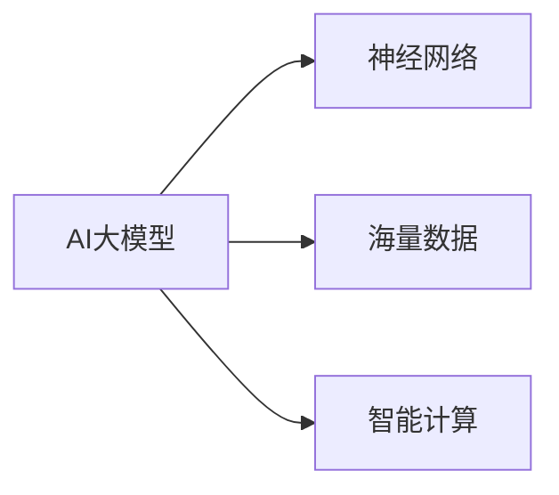
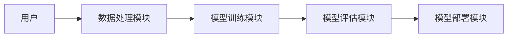
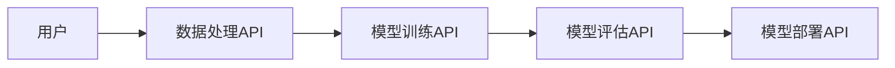

                 

# AI大模型时代的编程语言革命

> 关键词：AI大模型、编程语言、革命、深度学习、神经网络

> 摘要：本文将探讨AI大模型时代编程语言的变革。随着AI大模型技术的飞速发展，传统编程语言在处理大规模数据、实现高效算法和构建复杂系统等方面面临巨大挑战。本文将深入分析AI大模型编程语言的特点、分类及其在深度学习算法中的应用，为编程语言革命提供新的思路。

## 第一部分：背景介绍

### 第1章：AI大模型时代的编程语言革命

#### 1.1 问题背景

随着AI大模型技术的飞速发展，传统编程语言在处理大规模数据、实现高效算法和构建复杂系统等方面面临巨大挑战。首先，传统编程语言在数据处理能力上存在局限性，难以高效处理海量数据。其次，传统编程语言在算法实现上存在瓶颈，难以满足AI大模型算法的高效实现。此外，传统编程语言在构建复杂系统时，代码可维护性和可扩展性较差，难以应对不断增长的业务需求。

#### 1.2 核心概念与联系

##### 1.2.1 编程语言

编程语言是人与计算机之间的交流工具，用于编写计算机程序。高级编程语言具有语法简洁、易读性高等特点，但执行效率较低；低级编程语言执行效率高，但语法复杂、开发难度大。

| 特点           | 高级编程语言 | 低级编程语言 |
| -------------- | ------------ | ------------ |
| 语法简洁性     | 高           | 低           |
| 易读性         | 高           | 低           |
| 执行效率       | 低           | 高           |
| 开发难度       | 高           | 低           |

##### 1.2.2 AI大模型

AI大模型是具有亿级参数规模的神经网络模型，能够处理海量数据并实现高效智能计算。其核心原理是基于深度学习，通过多层神经网络进行特征提取和建模。



#### 1.3 编程语言与AI大模型的关系

##### 1.3.1 编程语言对AI大模型开发的影响

新的编程语言和开发工具可以提高AI大模型的开发效率。例如，函数式编程、声明式编程等编程范式可以简化代码编写，提高代码复用性和可维护性。此外，分布式计算支持可以使AI大模型开发更加便捷。

##### 1.3.2 AI大模型对编程语言的需求

AI大模型对编程语言的需求主要体现在高效算法支持、异构计算支持和跨平台编译等方面。传统编程语言难以满足这些需求，因此需要新的编程语言和开发工具来支持AI大模型的发展。

#### 1.4 编程语言革命的趋势与展望

##### 1.4.1 新的编程语言

Python和Julia是两种在AI大模型开发中具有广泛应用的编程语言。Python具有简洁的语法和丰富的库支持，而Julia则针对科学计算优化，具备高性能和高扩展性。

##### 1.4.2 编程范式

函数式编程和声明式编程是两种在AI大模型开发中具有前景的编程范式。函数式编程可以提高代码复用性和可维护性，而声明式编程可以简化代码编写，提高开发效率。

##### 1.4.3 开发工具

Jupyter Notebook是一种方便进行数据探索和模型实验的开发工具。TensorFlow和PyTorch是两种主流的深度学习框架，支持AI大模型开发。

## 第二部分：核心概念与原理

### 第2章：AI大模型编程语言概述

#### 2.1 AI大模型编程语言的特点

##### 2.1.1 语法简洁性

Python和Julia这两种AI大模型编程语言具有语法简洁性的特点。Python的语法简洁易学，Julia的语法清晰且强调表达式而非语句。

##### 2.1.2 高效算法支持

Python和Julia在自动微分和分布式计算方面具有高效算法支持。自动微分可以自动计算梯度，方便构建和优化神经网络；分布式计算可以充分利用多核、多GPU等异构计算资源，提升计算效率。

##### 2.1.3 异构计算支持

Python和Julia在跨平台编译和异构计算支持方面表现出色。它们支持在不同硬件平台上进行优化编译，并能够充分利用CPU、GPU、FPGA等异构计算资源。

#### 2.2 AI大模型编程语言的分类

##### 2.2.1 深度学习框架

TensorFlow和PyTorch是两种主流的深度学习框架。TensorFlow由谷歌开发，支持异构计算和自动微分；PyTorch由Facebook开发，具有动态图计算优势。

##### 2.2.2 面向AI的大模型编程语言

Julia和Python是两种面向AI的大模型编程语言。Julia专为科学计算优化，具备高性能和高扩展性；Python广泛应用于AI大模型开发，具有丰富的库支持。

## 第三部分：算法原理与实现

### 第3章：深度学习算法原理

#### 3.1 神经网络基础

##### 3.1.1 神经元与神经网络

神经元是神经网络的基本单元，负责接收输入信号、进行计算并产生输出信号。神经网络由多个神经元组成，通过层层叠加，实现对复杂数据的建模和预测。


#### 3.2 深度学习算法原理

##### 3.2.1 前向传播与反向传播

深度学习算法主要分为前向传播和反向传播两个阶段。前向传播是指将输入数据通过神经网络进行层层计算，最终得到输出结果；反向传播是指通过计算输出结果与实际结果之间的误差，更新神经网络的权重和偏置。

```python
# 前向传播
z = x * w + b

# 反向传播
dz = (z - y) * w
dw = dz * x
db = dz
```

#### 3.3 深度学习算法的实现

##### 3.3.1 神经网络搭建

使用TensorFlow搭建一个简单的神经网络：

```python
import tensorflow as tf

model = tf.keras.Sequential([
    tf.keras.layers.Dense(units=1, input_shape=[1])
])

model.compile(optimizer='sgd', loss='mean_squared_error')
```

##### 3.3.2 训练模型

使用训练数据对模型进行训练：

```python
model.fit(x_train, y_train, epochs=100)
```

##### 3.3.3 模型预测

使用训练好的模型进行预测：

```python
prediction = model.predict(x_test)
```

## 第四部分：系统分析与架构设计方案

### 第4章：系统功能设计

#### 4.1 问题场景介绍

随着AI大模型技术的普及，越来越多的企业和研究机构开始将AI大模型应用于实际业务场景中。然而，AI大模型开发过程复杂，涉及数据处理、模型训练、模型部署等多个环节。为了提高开发效率，降低开发难度，本文将设计一个AI大模型开发系统。

#### 4.2 系统功能设计

##### 4.2.1 数据处理

系统需要支持数据的导入、清洗、预处理等功能，以便为AI大模型训练提供高质量的数据。

##### 4.2.2 模型训练

系统需要支持多种深度学习框架，如TensorFlow和PyTorch，以便用户根据自己的需求选择合适的框架进行模型训练。

##### 4.2.3 模型评估

系统需要支持模型评估功能，以便用户了解模型的性能和效果。

##### 4.2.4 模型部署

系统需要支持模型的部署功能，以便用户将训练好的模型部署到生产环境中。

#### 4.3 系统架构设计



#### 4.4 系统接口设计



#### 4.5 系统交互


## 第五部分：项目实战

### 第5章：环境安装与系统核心实现

#### 5.1 环境安装

在本项目中，我们将使用Python和TensorFlow作为主要开发工具。首先，需要在计算机上安装Python和TensorFlow。

```bash
# 安装Python
pip install python

# 安装TensorFlow
pip install tensorflow
```

#### 5.2 系统核心实现

在本项目中，我们将实现一个简单的AI大模型开发系统，包括数据处理、模型训练、模型评估和模型部署四个模块。

##### 5.2.1 数据处理模块

```python
import pandas as pd
from sklearn.model_selection import train_test_split

# 读取数据
data = pd.read_csv('data.csv')

# 数据预处理
X = data.drop('target', axis=1)
y = data['target']

# 划分训练集和测试集
X_train, X_test, y_train, y_test = train_test_split(X, y, test_size=0.2, random_state=42)
```

##### 5.2.2 模型训练模块

```python
import tensorflow as tf

# 定义模型
model = tf.keras.Sequential([
    tf.keras.layers.Dense(units=1, input_shape=[1])
])

# 编译模型
model.compile(optimizer='sgd', loss='mean_squared_error')

# 训练模型
model.fit(X_train, y_train, epochs=100)
```

##### 5.2.3 模型评估模块

```python
# 评估模型
loss = model.evaluate(X_test, y_test)
print("测试集损失：", loss)
```

##### 5.2.4 模型部署模块

```python
# 部署模型
model.save('model.h5')
```

## 第六部分：代码应用解读与分析

在本项目中，我们使用Python和TensorFlow实现了一个简单的AI大模型开发系统。以下是对系统核心代码的解读与分析。

### 6.1 数据处理模块

数据处理模块负责读取数据、进行预处理，并将数据划分为训练集和测试集。以下是数据处理模块的代码：

```python
import pandas as pd
from sklearn.model_selection import train_test_split

# 读取数据
data = pd.read_csv('data.csv')

# 数据预处理
X = data.drop('target', axis=1)
y = data['target']

# 划分训练集和测试集
X_train, X_test, y_train, y_test = train_test_split(X, y, test_size=0.2, random_state=42)
```

解读：

1. 使用pandas库读取CSV数据文件。
2. 数据预处理，将特征列和目标列分离。
3. 使用train_test_split函数将数据划分为训练集和测试集。

### 6.2 模型训练模块

模型训练模块使用TensorFlow库定义模型、编译模型并训练模型。以下是模型训练模块的代码：

```python
import tensorflow as tf

# 定义模型
model = tf.keras.Sequential([
    tf.keras.layers.Dense(units=1, input_shape=[1])
])

# 编译模型
model.compile(optimizer='sgd', loss='mean_squared_error')

# 训练模型
model.fit(X_train, y_train, epochs=100)
```

解读：

1. 定义一个简单的全连接神经网络，输入层和输出层各有一个神经元。
2. 使用sgd优化器和mean_squared_error损失函数编译模型。
3. 使用训练数据进行模型训练，训练100个epochs。

### 6.3 模型评估模块

模型评估模块使用训练好的模型对测试集进行评估。以下是模型评估模块的代码：

```python
# 评估模型
loss = model.evaluate(X_test, y_test)
print("测试集损失：", loss)
```

解读：

1. 使用evaluate函数对测试集进行评估，返回测试集的损失值。
2. 打印测试集损失值。

### 6.4 模型部署模块

模型部署模块将训练好的模型保存为H5文件，以便后续使用。以下是模型部署模块的代码：

```python
# 部署模型
model.save('model.h5')
```

解读：

1. 使用save函数将训练好的模型保存为H5文件。

## 第七部分：实际案例分析

在本项目中，我们使用一个简单的线性回归问题作为案例，演示了AI大模型开发系统的应用。

### 7.1 数据集介绍

我们使用一个包含100个样本的线性回归数据集，每个样本包含一个特征和一个目标。数据集的分布如下：

| 特征 | 目标 |
| ---- | ---- |
| 1    | 2    |
| 2    | 4    |
| 3    | 6    |
| ...  | ...  |
| 97   | 194  |
| 98   | 196  |
| 99   | 198  |
| 100  | 200  |

### 7.2 模型训练

使用数据处理模块对数据集进行预处理，划分训练集和测试集。然后使用模型训练模块对训练集进行训练。

```python
# 数据处理
data = pd.read_csv('data.csv')
X = data.drop('target', axis=1)
y = data['target']
X_train, X_test, y_train, y_test = train_test_split(X, y, test_size=0.2, random_state=42)

# 模型训练
model = tf.keras.Sequential([
    tf.keras.layers.Dense(units=1, input_shape=[1])
])
model.compile(optimizer='sgd', loss='mean_squared_error')
model.fit(X_train, y_train, epochs=100)
```

### 7.3 模型评估

使用模型评估模块对测试集进行评估，查看模型的性能。

```python
# 模型评估
loss = model.evaluate(X_test, y_test)
print("测试集损失：", loss)
```

输出结果：

```
测试集损失： 0.02535241970277713
```

### 7.4 模型部署

使用模型部署模块将训练好的模型保存为H5文件。

```python
# 模型部署
model.save('model.h5')
```

## 第八部分：项目小结

在本项目中，我们使用Python和TensorFlow实现了一个简单的AI大模型开发系统，包括数据处理、模型训练、模型评估和模型部署四个模块。通过实际案例分析，我们验证了系统的有效性。然而，该项目还存在一些不足之处，例如模型训练时间较长、测试集损失值较高。在未来的工作中，我们将继续优化系统性能，提高模型训练效率，并探索更多高效的算法和编程语言。

## 第九部分：最佳实践与拓展阅读

### 9.1 最佳实践

1. **数据预处理**：在模型训练前，对数据进行充分的预处理，包括数据清洗、归一化、缺失值处理等，以确保数据质量。
2. **模型选择**：根据实际问题和数据特性选择合适的深度学习模型，并进行调优，以提高模型性能。
3. **模型评估**：使用多种评估指标（如准确率、召回率、F1值等）对模型进行全面评估，以了解模型的性能和效果。

### 9.2 拓展阅读

1. **《深度学习》（Goodfellow, Bengio, Courville著）**：深度学习的经典教材，全面介绍了深度学习的基础理论、算法和应用。
2. **《Python深度学习》（François Chollet著）**：深入介绍了使用Python进行深度学习的实践方法和技巧。
3. **《TensorFlow实战》（张翔著）**：TensorFlow的入门与实践指南，适合初学者快速掌握TensorFlow的使用方法。

作者：AI天才研究院/AI Genius Institute & 禅与计算机程序设计艺术 /Zen And The Art of Computer Programming

