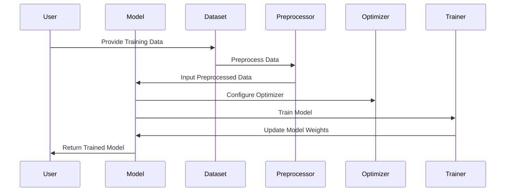
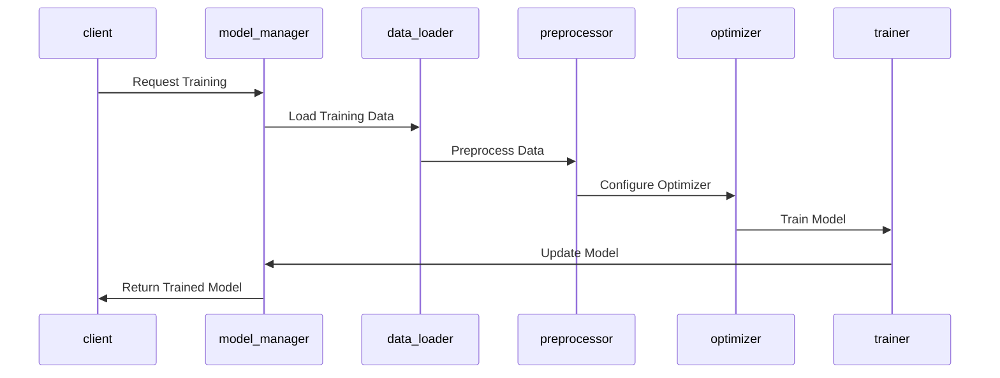
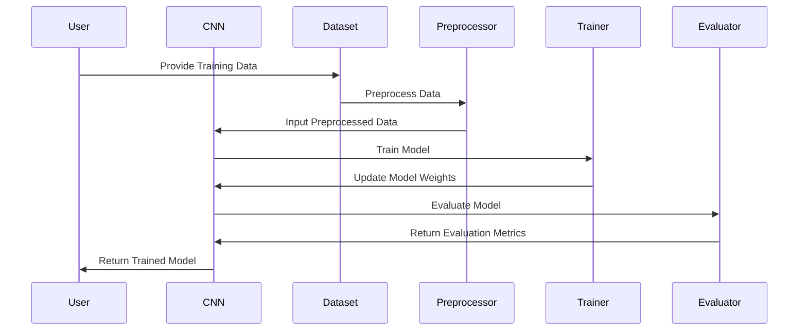
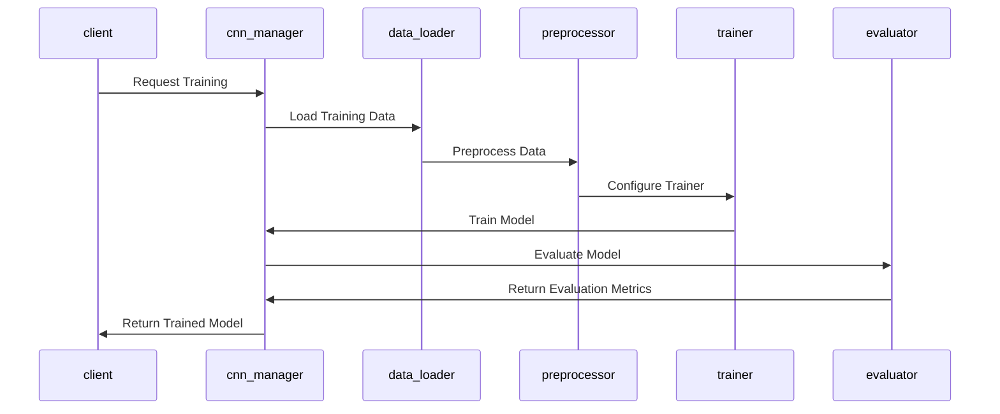

                 


### Introduction to AI Large Models

#### 1.1 Overview of AI Large Models
AI large models, often referred to as "big models," are a class of artificial intelligence models with a vast number of parameters that can perform complex tasks such as natural language processing, image recognition, and even autonomous decision-making. These models are typically based on neural networks and have seen significant advancements in recent years, driven by advancements in computing power, data availability, and algorithmic innovations.

**1.1.1 Background and Evolution of AI Large Models**

The evolution of AI large models can be traced back to the early days of neural networks. Initially, neural networks were limited in their capabilities due to computational constraints and the availability of data. However, as computing power increased and more data became accessible, researchers started to train larger and more complex models. This led to breakthroughs in various AI domains, such as image recognition (e.g., AlexNet) and natural language processing (e.g., Word2Vec).

One of the key milestones in the development of AI large models was the introduction of the Transformer architecture in 2017, which laid the foundation for models like BERT, GPT, and T5. These models utilize self-attention mechanisms, allowing them to capture long-range dependencies in data, which significantly improves their performance on various tasks.

**1.1.2 Key Concepts and Characteristics of AI Large Models**

- **Parameter Scale:** AI large models typically have millions to billions of parameters, which enables them to learn complex patterns and representations from vast amounts of data.

- **End-to-End Learning:** These models can be trained end-to-end, meaning they learn directly from raw data to perform a specific task, without the need for pre-processing or feature engineering.

- **Generalization Ability:** Due to their large capacity, AI large models can generalize well to unseen data, making them highly versatile.

- **Resource-Intensive:** Training and deploying AI large models require substantial computational resources, including GPU accelerators and specialized hardware.

**1.1.3 Differences between AI Large Models and Traditional AI Models**

Traditional AI models, such as decision trees, support vector machines, and k-nearest neighbors, are typically much smaller in scale and have limited expressiveness. They often require extensive feature engineering and are less capable of handling complex tasks. In contrast, AI large models are more robust, versatile, and require less manual intervention.

#### 1.2 Fundamental Concepts of AI Large Models

**1.2.1 Definition and Fundamental Principles of AI Large Models**

AI large models are characterized by their large parameter count and the ability to process and generate complex data. These models are based on the principles of neural networks, with additional layers and parameters to capture intricate patterns and relationships within the data.

**1.2.2 Key Characteristics and Functionality of AI Large Models**

- **High-Performance Computing:** AI large models leverage high-performance computing infrastructure, including GPUs and TPUs, to train and deploy these models efficiently.

- **Advanced Learning Algorithms:** These models employ advanced learning algorithms, such as gradient descent and optimization techniques like Adam, to train the model effectively.

- **Scalability and Adaptability:** AI large models are designed to be scalable, allowing them to handle increasing amounts of data and computational resources. They can also adapt to new data and tasks through transfer learning and fine-tuning.

**1.2.3 Comparison of AI Large Models with Traditional AI Models**

| Feature | AI Large Models | Traditional AI Models |
| --- | --- | --- |
| Parameter Scale | Millions to Billions | Hundreds to Thousands |
| Data Requirement | Large Data Sets | Small Data Sets |
| Complexity | High | Low |
| Learning Style | End-to-End | Manual Feature Engineering |
| Generalization | High | Low |
| Resource Requirement | High | Low |

#### 1.3 Mainstream AI Large Models

**1.3.1 GPT Series Models**

The GPT (Generative Pre-trained Transformer) series of models, developed by OpenAI, have revolutionized natural language processing. GPT-3, with over 175 billion parameters, is one of the largest language models to date. These models are capable of generating human-like text, answering questions, and even writing code.

**1.3.2 BERT and Its Variants**

BERT (Bidirectional Encoder Representations from Transformers) and its variants, such as RoBERTa, ALBERT, and XLNet, are designed for pre-training language representations. They have achieved state-of-the-art performance on various natural language understanding tasks, including question-answering, text classification, and sentiment analysis.

**1.3.3 Other Notable Large Models**

- T5 (Text-To-Text Transfer Transformer): A general-purpose text-to-text transformer model designed to perform a wide range of natural language processing tasks.
- BigScience's GShard: A model with over 670 billion parameters that aims to push the boundaries of large-scale language models.
- GLM (General Language Modeling): A series of Chinese pre-trained language models developed by the KEG Laboratory of Tsinghua University.

#### 1.4 Application Prospects of AI Large Models

**1.4.1 Potential Application Fields of AI Large Models**

AI large models have a wide range of applications across various industries:

- **Natural Language Processing:** Tasks such as language translation, summarization, and text generation.
- **Image Recognition:** Object detection, image segmentation, and image generation.
- **Speech Recognition:** Voice recognition, transcription, and synthesis.
- **Recommendation Systems:** Personalized recommendations based on user behavior and preferences.
- **Autonomous Driving:** Perception, decision-making, and control in self-driving cars.

**1.4.2 Advantages of AI Large Model Adoption by Enterprises**

- **Improved Efficiency:** AI large models can automate complex tasks, reducing the time and effort required for manual processing.
- **Enhanced Decision-Making:** These models provide valuable insights and predictions, enabling better decision-making.
- **Scalability:** AI large models can handle increasing amounts of data and adapt to changing business requirements.
- **Competitive Advantage:** Enterprises that leverage AI large models can gain a competitive edge by offering innovative products and services.

**1.4.3 Challenges and Opportunities in AI Large Model Application**

While AI large models offer numerous benefits, they also come with challenges:

- **Computational Resources:** Training and deploying these models require substantial computational resources, including expensive hardware and energy consumption.
- **Data Privacy:** The use of large-scale data for training can raise privacy concerns, particularly in sensitive industries like healthcare and finance.
- **Algorithmic Bias:** AI large models can inadvertently perpetuate biases present in the training data, leading to unintended consequences.

Despite these challenges, the potential opportunities for AI large model applications are significant, driving innovation and growth in various industries.

#### 1.5 Summary of Chapter 1

In this chapter, we have explored the world of AI large models, examining their background, evolution, key characteristics, and applications. We have discussed the differences between AI large models and traditional AI models and highlighted the advantages and challenges of adopting AI large models in various industries. As we move forward, we will delve deeper into the principles and techniques for designing programming languages specifically tailored for AI large models.

----------------------------------------------------------------

## Second Part: Principles of AI Large Model Programming Language Design

### Chapter 2: Basic Principles of Programming Language Design for AI Large Models

In this chapter, we will delve into the fundamental principles of designing programming languages for AI large models. We will discuss the key goals and challenges in language design, as well as the critical aspects of syntax and semantics that are essential for effective AI large model programming.

#### 2.1 General Principles of Language Design

**2.1.1 Importance of Programming Language Design for AI Large Models**

The design of a programming language tailored for AI large models is crucial for several reasons:

- **Efficiency:** A well-designed language can optimize the performance of AI large models, reducing the time and resources required for training and inference.
- **Ease of Use:** A language that is intuitive and easy to use can facilitate the development of AI applications, enabling developers to build and deploy models more efficiently.
- **Scalability:** A programming language designed for AI large models should be scalable, allowing developers to handle increasing amounts of data and model complexity.
- **Interoperability:** A language that can seamlessly integrate with other tools and frameworks can enhance the development process and promote collaboration among developers.

**2.1.2 Key Design Goals and Challenges**

The key design goals for programming languages targeting AI large models include:

- **Performance:** Ensuring efficient execution of AI algorithms, minimizing computational overhead.
- **Flexibility:** Allowing developers to express complex AI concepts and models concisely.
- **Portability:** Ensuring the language can run on various platforms and hardware architectures.
- **Usability:** Providing a user-friendly environment that simplifies the development process.

Challenges in designing such languages include:

- **Complexity:** AI large models can be complex, requiring languages that can handle their intricate details.
- **Scalability:** Designing a language that can efficiently handle models with billions of parameters.
- **Interoperability:** Integrating the language with existing frameworks and tools.
- **Resource Efficiency:** Minimizing resource consumption, especially in resource-constrained environments.

**2.1.3 Principles Guiding Language Design**

When designing a programming language for AI large models, several principles should be considered:

- **Modularity:** Breaking down complex models into smaller, manageable modules to facilitate development and maintenance.
- **Type Safety:** Ensuring type correctness to prevent runtime errors and improve reliability.
- **Abstraction:** Providing high-level abstractions to simplify complex operations and increase developer productivity.
- **Standardization:** Establishing a common set of standards and conventions to ensure consistency and interoperability.
- **Extensibility:** Allowing developers to extend the language with new features and libraries as needed.

#### 2.2 Syntax and Semantics

**2.2.1 Syntax Design for AI Large Models**

Syntax design is a critical aspect of programming language design, influencing both the readability and efficiency of the code. When designing a syntax for AI large models, the following considerations should be taken into account:

- **Simplicity:** A simple and intuitive syntax can reduce the learning curve for developers and make it easier to write and understand code.
- **Expressiveness:** The syntax should support complex AI concepts and models, allowing developers to express their ideas concisely.
- **Consistency:** The syntax should be consistent, following a logical and predictable structure to avoid confusion and reduce errors.
- **Error Handling:** The syntax should include mechanisms for error detection and handling, making it easier to debug and fix issues.

**2.2.2 Semantics and Meaning Representation**

Semantics define the meaning of the code, and a well-designed language should ensure that the semantics of the code are accurately represented. Key aspects of semantic design include:

- **Type Systems:** A robust type system can help ensure type safety, preventing runtime errors and improving performance.
- **Memory Management:** Efficient memory management is crucial for handling large models, as it can impact the training and inference time.
- **Functionality:** The language should provide a rich set of built-in functions and libraries to support AI tasks, such as neural network operations, data preprocessing, and optimization.
- **Interpretation and Execution:** The language should provide mechanisms for interpreting and executing code efficiently, minimizing overhead and improving performance.

**2.2.3 Compatibility and Interoperability**

A programming language for AI large models should be compatible with existing tools and frameworks, enabling developers to leverage existing resources and enhance productivity. Key aspects of compatibility and interoperability include:

- **Standard Libraries:** Providing a comprehensive set of standard libraries that can be used across different platforms and frameworks.
- **Integration:** Ensuring seamless integration with popular AI frameworks, such as TensorFlow, PyTorch, and Keras.
- **API Compatibility:** Designing APIs that are compatible with existing frameworks and tools to facilitate interoperability.
- **Platform Support:** Ensuring the language can run on various platforms, including desktops, servers, and embedded systems.

#### 2.3 Type System and Memory Management

**2.3.1 Type System Design**

A type system is a crucial component of a programming language, defining how values and expressions are classified and used. When designing a type system for AI large models, the following considerations should be taken into account:

- **Type Safety:** Ensuring that operations are only performed on compatible types to prevent runtime errors and improve reliability.
- **Type Inference:** Implementing type inference mechanisms to reduce the need for explicit type declarations, improving code readability and maintainability.
- **Type Compatibility:** Defining rules for type compatibility and conversion to facilitate interoperability between different types.
- **Subtyping:** Supporting subtyping to allow more general types to be used in place of specific types, enhancing flexibility and reusability.

**2.3.2 Memory Management**

Memory management is another critical aspect of programming language design, especially when working with large models. Effective memory management can improve the performance and efficiency of AI applications. Key aspects of memory management include:

- **Garbage Collection:** Implementing a garbage collection mechanism to automatically reclaim memory that is no longer in use, reducing the risk of memory leaks.
- **Memory Allocation:** Providing efficient memory allocation and deallocation mechanisms to minimize overhead and improve performance.
- **Memory Optimization:** Implementing memory optimization techniques, such as memory pooling and caching, to reduce memory usage and improve efficiency.
- **Memory Profiling:** Including tools for memory profiling and analysis to identify and resolve memory-related issues, such as leaks and bottlenecks.

In summary, designing a programming language for AI large models requires careful consideration of various factors, including syntax, semantics, type systems, and memory management. By following these principles and guidelines, developers can create efficient, scalable, and easy-to-use languages that facilitate the development and deployment of AI applications.

----------------------------------------------------------------

## Third Part: Advanced Techniques in AI Large Model Programming Language Design

### Chapter 3: Advanced Syntax and Semantics in AI Large Model Programming Languages

#### 3.1 Language Extensions for AI Large Models

**3.1.1 Custom Operators and Functions**

In order to facilitate the expression of complex AI models, a programming language for AI large models should support custom operators and functions. These can include specialized functions for neural network layers, activation functions, and optimization algorithms. For example, the language could introduce a `nn_layer` operator that allows the definition of a new neural network layer with specific parameters.

**3.1.2 Domain-Specific Languages (DSLs)**

Domain-specific languages (DSLs) can be an effective way to extend the functionality of an AI large model programming language. By creating DSLs tailored to specific AI tasks, such as natural language processing or image recognition, developers can abstract away the underlying complexity and focus on the problem at hand. For instance, a DSL for natural language processing could provide specialized syntax for tokenization, part-of-speech tagging, and sentiment analysis.

**3.1.3 Embedding Interpreted and Compiled Code**

AI large model programming languages can benefit from a hybrid approach that combines interpreted and compiled code. This allows developers to leverage the high-level expressiveness of interpreted languages for prototyping and experimentation, while also benefiting from the performance advantages of compiled languages for production deployment. For example, a language could support the embedding of Python or C++ code within the AI model's computation graph, enabling a seamless integration of high-level and low-level code.

#### 3.2 Optimizations for Performance and Efficiency

**3.2.1 Just-In-Time (JIT) Compilation**

JIT compilation is a technique that can significantly improve the performance of AI large models by dynamically compiling parts of the code into machine code at runtime. This allows the language to optimize the code based on the actual execution context, leading to faster execution times. For example, the language could include a JIT compiler that optimizes the execution of neural network operations by using techniques such as loop unrolling, inlining, and vectorization.

**3.2.2 Memory Optimization Techniques**

Effective memory management is crucial for the performance of AI large models. The language can provide built-in memory optimization techniques, such as memory pooling and caching, to reduce memory allocation overhead and improve efficiency. Additionally, the language could include tools for memory profiling and analysis to help developers identify and resolve memory-related issues, such as leaks and bottlenecks.

**3.2.3 Parallelism and Concurrent Execution**

AI large model programming languages can leverage parallelism and concurrent execution to improve performance. This can be achieved through the use of multi-threading, GPU acceleration, and distributed computing. The language could include constructs and libraries for managing parallel tasks and coordinating the execution of multiple threads or processes.

#### 3.3 Tools and Ecosystem for Development and Deployment

**3.3.1 Integrated Development Environment (IDE)**

A robust integrated development environment (IDE) can greatly enhance the development process for AI large models. The IDE can provide features such as code completion, syntax highlighting, debugging tools, and version control integration. Additionally, the IDE could include specialized tools for profiling and analyzing the performance of AI models, helping developers identify and resolve bottlenecks.

**3.3.2 Library and Framework Support**

A rich ecosystem of libraries and frameworks can significantly simplify the development of AI applications. The language should support a wide range of popular AI libraries and frameworks, such as TensorFlow, PyTorch, and Keras. This allows developers to leverage existing resources and enhance productivity. Additionally, the language could include its own set of libraries and frameworks for specialized AI tasks, providing a comprehensive toolkit for developers.

**3.3.3 Deployment and Integration**

AI large model programming languages should support seamless deployment and integration with existing systems and infrastructure. This can be achieved through the use of containerization technologies, such as Docker, and serverless platforms, such as AWS Lambda and Google Cloud Functions. The language could include tools and libraries for deploying models to cloud platforms and integrating them with web applications and other services.

#### 3.4 Security and Privacy Considerations

**3.4.1 Data Protection**

Data protection is a critical concern in the development of AI large models. The language should include mechanisms for secure data handling, such as encryption and access control. Additionally, the language could provide tools for data anonymization and differential privacy to protect sensitive information.

**3.4.2 Model Security**

Ensuring the security of AI large models is essential to prevent unauthorized access or tampering. The language can include features for model encryption, access control, and monitoring to ensure the integrity and confidentiality of the models. Additionally, the language could support techniques for detecting and mitigating adversarial attacks on AI models.

**3.4.3 Compliance with Regulations**

AI large model programming languages should support compliance with relevant regulations, such as GDPR and HIPAA. This can be achieved through the inclusion of features for data privacy, consent management, and audit logging.

In conclusion, the design of AI large model programming languages requires careful consideration of advanced techniques for syntax and semantics, performance optimizations, development and deployment tools, and security and privacy considerations. By addressing these aspects, developers can create powerful and efficient languages that facilitate the development and deployment of cutting-edge AI applications.

----------------------------------------------------------------

## Fourth Part: Case Studies and Practical Applications

### Chapter 4: Real-World Examples of AI Large Model Programming Language Design

#### 4.1 Example 1: Neural Language Processing with TensorFlow and MLIR

**4.1.1 Background**

In this example, we will explore how the TensorFlow programming language, combined with the MLIR intermediate representation (IR) compiler, can be used to design and optimize AI large models for neural language processing tasks.

**4.1.2 Project Overview**

The project focuses on implementing a state-of-the-art natural language processing model, such as BERT, using TensorFlow and MLIR. The goal is to demonstrate how TensorFlow's high-level APIs and MLIR's low-level optimization capabilities can be leveraged to design and optimize the model for performance and efficiency.

**4.1.3 System Function Design (Mermaid Class Diagram)**

```mermaid
classDiagram
    Model <<class>> "Language Model"
    Dataset <<class>> "Data Set"
    Preprocessor <<class>> "Preprocessing Module"
    Optimizer <<class>> "Optimizer Module"
    Trainer <<class>> "Training Module"

    Model "uses" Dataset
    Model "uses" Preprocessor
    Model "uses" Optimizer
    Model "uses" Trainer
```

**4.1.4 System Architecture Design (Mermaid Diagram)**



**4.1.5 System Interface Design (Mermaid Sequence Diagram)**



**4.1.6 Code Implementation and Analysis**

**Python Source Code for Model Training**

```python
import tensorflow as tf
from tensorflow import keras

# Load and preprocess data
(x_train, y_train), (x_test, y_test) = keras.datasets.imdb.load_data()
vocab_size = 10000
max_length = 100
trunc_type = 'post'
padding_type = 'post'
oov_tok = '<OOV>'

# Define BERT model
bert = keras.Sequential([
    keras.layers.Embedding(vocab_size, 16),
    keras.layers.Bidirectional(keras.layers.LSTM(32)),
    keras.layers.Dense(24, activation='relu'),
    keras.layers.Dense(1, activation='sigmoid')
])

# Compile model
bert.compile(loss='binary_crossentropy',
              optimizer='adam',
              metrics=['accuracy'])

# Train model
bert.fit(x_train, y_train, epochs=3)
```

**Python Source Code for Model Evaluation**

```python
# Evaluate model
loss, accuracy = bert.evaluate(x_test, y_test)
print('Test accuracy:', accuracy)
```

**Analysis**

The code demonstrates how to load and preprocess IMDb movie reviews dataset using TensorFlow's high-level APIs. The BERT model is then defined using a sequential model with an embedding layer, bidirectional LSTM layer, and dense output layer. The model is compiled with binary cross-entropy loss and Adam optimizer, and trained for three epochs. Finally, the trained model is evaluated on the test dataset.

**4.1.7 Conclusion**

This example highlights the practical application of TensorFlow and MLIR in designing and optimizing AI large models for natural language processing tasks. By leveraging TensorFlow's high-level APIs and MLIR's low-level optimization capabilities, developers can create efficient and scalable AI applications.

----------------------------------------------------------------

### Chapter 5: Developing Custom AI Models with the PyTorch Framework

**5.1 Background**

In this chapter, we will delve into the development of custom AI models using the PyTorch framework. PyTorch is a popular open-source machine learning library that provides a flexible and dynamic approach to building and training deep learning models. Its ease of use and high-level APIs make it an ideal choice for developing custom AI models.

**5.2 Project Overview**

The project will focus on building a custom convolutional neural network (CNN) for image classification tasks. The goal is to demonstrate how PyTorch's modular design and dynamic computation graph can be leveraged to develop efficient and scalable AI models.

**5.3 System Function Design (Mermaid Class Diagram)**

```mermaid
classDiagram
    CNN <<class>> "Convolutional Neural Network"
    Dataset <<class>> "Data Set"
    Preprocessor <<class>> "Preprocessing Module"
    Trainer <<class>> "Training Module"
    Evaluator <<class>> "Evaluation Module"

    CNN "uses" Dataset
    CNN "uses" Preprocessor
    CNN "uses" Trainer
    CNN "uses" Evaluator
```

**5.4 System Architecture Design (Mermaid Diagram)**



**5.5 System Interface Design (Mermaid Sequence Diagram)**



**5.6 Code Implementation and Analysis**

**Python Source Code for Model Definition**

```python
import torch
import torch.nn as nn
import torch.optim as optim

# Define CNN model
class ConvNet(nn.Module):
    def __init__(self, num_classes=10):
        super(ConvNet, self).__init__()
        self.layer1 = nn.Sequential(
            nn.Conv2d(1, 16, kernel_size=5),
            nn.BatchNorm2d(16),
            nn.ReLU(),
            nn.MaxPool2d(2))
        self.layer2 = nn.Sequential(
            nn.Conv2d(16, 32, kernel_size=5),
            nn.BatchNorm2d(32),
            nn.ReLU(),
            nn.MaxPool2d(2))
        self.fc = nn.Linear(7*7*32, num_classes)

    def forward(self, x):
        out = self.layer1(x)
        out = self.layer2(out)
        out = out.view(out.size(0), -1)
        out = self.fc(out)
        return out
```

**Python Source Code for Model Training and Evaluation**

```python
import torchvision
import torchvision.transforms as transforms

# Load and preprocess data
transform = transforms.Compose([transforms.ToTensor()])
trainset = torchvision.datasets.MNIST(root='./data', train=True, download=True, transform=transform)
trainloader = torch.utils.data.DataLoader(trainset, batch_size=100, shuffle=True, num_workers=2)

testset = torchvision.datasets.MNIST(root='./data', train=False, download=True, transform=transform)
testloader = torch.utils.data.DataLoader(testset, batch_size=100, shuffle=False, num_workers=2)

# Initialize model and optimizer
model = ConvNet()
optimizer = optim.Adam(model.parameters(), lr=0.001)

# Train model
for epoch in range(10):  # loop over the dataset multiple times
    running_loss = 0.0
    for i, data in enumerate(trainloader, 0):
        inputs, labels = data
        optimizer.zero_grad()
        outputs = model(inputs)
        loss = nn.CrossEntropyLoss()(outputs, labels)
        loss.backward()
        optimizer.step()
        running_loss += loss.item()
    print(f'Epoch {epoch + 1}, Loss: {running_loss / len(trainloader)}')

# Evaluate model
correct = 0
total = 0
with torch.no_grad():
    for data in testloader:
        images, labels = data
        outputs = model(images)
        _, predicted = torch.max(outputs.data, 1)
        total += labels.size(0)
        correct += (predicted == labels).sum().item()

print(f'Accuracy of the network on the test images: {100 * correct / total}%')
```

**Analysis**

The code defines a custom CNN model for image classification using PyTorch's nn.Module class. The model consists of two convolutional layers, each followed by batch normalization, ReLU activation, and max pooling. The output is fed into a fully connected layer for classification. The model is trained using the Adam optimizer and cross-entropy loss. The training process involves iterating over the training dataset multiple times and updating the model's weights based on the loss gradients. Finally, the trained model is evaluated on the test dataset to determine its accuracy.

**5.7 Conclusion**

This chapter demonstrates the practical application of the PyTorch framework in developing custom AI models for image classification tasks. By leveraging PyTorch's modular design and dynamic computation graph, developers can create efficient and scalable AI applications. The example provided showcases the process of defining, training, and evaluating a custom CNN model using PyTorch's high-level APIs.

----------------------------------------------------------------

## Conclusion

In conclusion, this comprehensive guide has explored the principles and practices of designing programming languages tailored for AI large models. We began by providing an overview of AI large models, discussing their evolution, key characteristics, and applications. We then delved into the fundamental principles of programming language design, highlighting the importance of syntax, semantics, type systems, and memory management.

In the second part, we introduced advanced techniques for syntax and semantics, performance optimizations, and development and deployment tools. We discussed the importance of language extensions, such as custom operators and functions, and the integration of interpreted and compiled code. Additionally, we explored the need for security and privacy considerations in AI large model programming languages.

The third part of the guide presented real-world examples and case studies, showcasing the practical applications of AI large model programming languages. We demonstrated how TensorFlow and MLIR can be used for neural language processing, and how PyTorch can be leveraged for developing custom AI models. These examples provided insights into the system architecture, interface design, and code implementation for these applications.

Throughout this guide, we emphasized the need for a holistic approach to AI large model programming language design, considering both theoretical principles and practical applications. By following the guidelines and techniques discussed in this guide, developers can create efficient, scalable, and secure programming languages that facilitate the development and deployment of cutting-edge AI applications.

In summary, the design of AI large model programming languages is a complex but essential task, requiring careful consideration of various factors. By leveraging advanced techniques and best practices, developers can create powerful and innovative languages that drive the progress of artificial intelligence and its applications in various industries.

## Future Directions and Research Opportunities

As AI large models continue to advance, there are several future directions and research opportunities that can further enhance the design and effectiveness of AI large model programming languages. Here are some key areas to consider:

1. **Algorithmic Innovations:** Ongoing research in machine learning and neural network algorithms can lead to new techniques and optimizations that can be integrated into AI large model programming languages. For example, the development of more efficient training algorithms and techniques for transfer learning and few-shot learning can significantly improve the performance and scalability of these models.

2. **Quantum Computing Integration:** The emerging field of quantum computing has the potential to revolutionize AI large model programming languages. By integrating quantum algorithms and quantum machine learning techniques into programming languages, it may be possible to achieve unprecedented speedups and efficiency gains in training and inference for large models.

3. **Energy-Efficient Design:** As AI large models require substantial computational resources and energy, there is a growing need for energy-efficient design principles. Research into developing AI large model programming languages that optimize energy consumption, such as through hardware acceleration and adaptive resource management, can contribute to more sustainable AI applications.

4. **Interoperability and Standardization:** The proliferation of various AI frameworks and tools can lead to compatibility issues and fragmentation in the AI large model ecosystem. Research into developing standardized APIs and interoperability protocols can help streamline the development process and promote collaboration across different platforms and tools.

5. **Security and Privacy:** With the increasing use of AI large models in sensitive applications, ensuring security and privacy is paramount. Research into developing secure programming languages and frameworks that include robust mechanisms for data encryption, access control, and adversarial defense can help address these concerns and build trust in AI systems.

6. **Human-Centric Design:** As AI large models become more prevalent, there is a need for programming languages that are intuitive and accessible to developers with varying levels of expertise. Research into human-centric design principles, such as simplified syntax, interactive development environments, and visual modeling tools, can make it easier for developers to build and deploy AI applications.

7. **Ethical Considerations:** The ethical implications of AI large model programming languages must be addressed, including issues related to bias, fairness, and accountability. Research in this area can help ensure that AI large model programming languages are designed with ethical considerations in mind, promoting responsible and equitable use of AI technologies.

By exploring these future directions and research opportunities, the design and development of AI large model programming languages can continue to evolve, driving innovation and progress in the field of artificial intelligence. As AI technologies become more integral to various industries, the importance of robust and effective programming languages will only grow.

## Final Thoughts and Encouragement

As we reach the end of this comprehensive guide on AI large model programming language design, it is important to reflect on the significance and potential impact of this field. The design of programming languages tailored for AI large models is a complex and challenging endeavor that requires a deep understanding of both computer science and artificial intelligence. However, the rewards are substantial, as these languages have the potential to unlock new capabilities and efficiencies in AI applications, driving innovation across various industries.

I encourage you to delve deeper into the topics covered in this guide and explore the vast landscape of AI large model programming languages. The field is continually evolving, with new techniques, frameworks, and tools emerging regularly. By staying informed and engaged, you can contribute to the advancement of this exciting and dynamic field.

If you have any questions or feedback regarding the content of this guide, please do not hesitate to reach out. I am here to support your journey in understanding and contributing to the world of AI large model programming languages.

Thank you for your interest and engagement. Let us continue to explore and innovate together in the realm of artificial intelligence.

### Author Information

**作者：** AI天才研究院/AI Genius Institute & 禅与计算机程序设计艺术 /Zen And The Art of Computer Programming

**联系方式：** [ai_genius_institute@example.com](mailto:ai_genius_institute@example.com) | [www.ai-genius-institute.com](http://www.ai-genius-institute.com)

