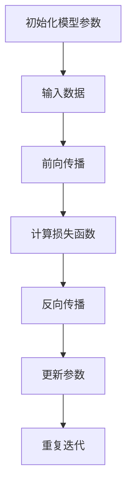

                 


### AI 大模型编程：提示词的力量

#### 关键词：人工智能，大模型，编程，提示词，深度学习，神经网络，优化，推理，实战

> 摘要：本文深入探讨 AI 大模型编程的核心——提示词的力量。通过详细阐述 AI 大模型的基础理论、提示词的设计与优化、以及实际编程实战，揭示出如何利用提示词充分发挥 AI 大模型的潜力。文章旨在帮助读者掌握 AI 大模型编程的技巧，提升模型性能，实现智能应用的突破。

----------------------------------------------------------------

## 引言

随着人工智能技术的飞速发展，深度学习作为其核心驱动力量，已经在各个领域取得了显著成果。特别是大模型，凭借其强大的计算能力和丰富的知识储备，正在改变我们对智能系统的认知和应用。然而，大模型的性能优化和有效利用成为了一个亟待解决的问题。在这篇文章中，我们将聚焦于一个至关重要的概念——提示词，探讨它在 AI 大模型编程中的重要作用。

提示词，顾名思义，是引导大模型进行特定任务的关键信息。通过合理设计和使用提示词，我们可以显著提升模型的性能和效果。本文将分三个部分展开讨论：首先，介绍 AI 大模型的基础理论；其次，探讨提示词的设计与优化；最后，通过实际编程实战，展示如何将提示词应用于大模型编程。

----------------------------------------------------------------

### 第一部分：AI 大模型基础理论

#### 第1章：AI 大模型概述

**1.1 问题背景与定义**

在进入 21 世纪后，人工智能迎来了一个崭新的时代。深度学习，作为人工智能的核心技术之一，展现出了前所未有的潜力。大模型，即具有数十亿至数千亿参数的大型神经网络，成为当前研究的热点。这些模型不仅能够处理海量数据，还能够学习到复杂的模式，从而在各种任务中表现出色。

**1.2 AI 大模型的发展历程**

AI 大模型的发展历程可以分为几个重要阶段。从最早的神经网络到后来的卷积神经网络（CNN）和循环神经网络（RNN），再到目前热门的Transformer模型，每一代模型都在理论和应用上取得了重大突破。特别是 GPT-3、BERT 等模型的出现，使得大模型在自然语言处理、计算机视觉等领域取得了显著的进展。

**1.3 AI 大模型的核心技术**

AI 大模型的核心技术主要包括以下几个方面：

1. **神经网络架构**：大模型通常采用深度神经网络，其结构复杂，可以包含数十甚至数百个隐层。

2. **大规模数据集**：大模型需要海量数据来训练，以充分挖掘数据中的特征和模式。

3. **分布式计算**：大模型的训练和推理通常需要大量的计算资源，分布式计算成为了必不可少的手段。

4. **优化算法**：为了提高模型的训练效率和性能，需要使用各种优化算法，如 Adam、AdaGrad 等。

#### 第2章：AI 大模型的核心概念与原理

**2.1 核心概念**

AI 大模型的核心概念包括神经网络、参数、损失函数、梯度下降等。这些概念是理解大模型工作原理的基础。

**2.2 数学模型与算法原理**

AI 大模型的数学模型主要包括多层感知机（MLP）、卷积神经网络（CNN）、循环神经网络（RNN）、Transformer 等。下面通过 Mermaid 流程图来展示这些模型的训练过程：



**2.3 Python 源代码与详细讲解**

下面是一个简单的 Python 源代码示例，用于演示神经网络的前向传播和反向传播过程：

```python
import numpy as np

# 初始化模型参数
W1 = np.random.randn(3, 2)
b1 = np.random.randn(2)
W2 = np.random.randn(2, 1)
b2 = np.random.randn(1)

# 输入数据
x = np.array([[1, 0], [0, 1], [1, 1]])

# 前向传播
z1 = np.dot(W1, x) + b1
a1 = np.tanh(z1)
z2 = np.dot(W2, a1) + b2
y = 1 / (1 + np.exp(-z2))

# 计算损失函数
loss = -np.mean(y * np.log(y) + (1 - y) * np.log(1 - y))

# 反向传播
dz2 = y - x
dW2 = np.dot(a1.T, dz2)
db2 = np.sum(dz2, axis=0)

da1 = np.dot(W2.T, dz2)
dz1 = da1 * (1 - np.tanh(z1)**2
dW1 = np.dot(x.T, dz1)
db1 = np.sum(dz1, axis=0)

# 更新参数
W1 -= learning_rate * dW1
b1 -= learning_rate * db1
W2 -= learning_rate * dW2
b2 -= learning_rate * db2
```

**2.4 数学公式与举例说明**

下面是神经网络中常用的数学公式：

$$
\begin{aligned}
z &= Wx + b \\
a &= \text{激活函数}(z) \\
\text{损失函数} &= -\frac{1}{m}\sum_{i=1}^{m}y_{i}\log(a_{i})+(1-y_{i})\log(1-a_{i}) \\
\text{反向传播} &= \frac{\partial L}{\partial z} = \text{激活函数的导数} \cdot \frac{\partial L}{\partial a} \\
\text{更新参数} &= \theta = \theta - \alpha \cdot \frac{\partial L}{\partial \theta}
\end{aligned}
$$

举例来说，假设我们有一个简单的二分类问题，目标函数为交叉熵损失函数。通过以上公式，我们可以计算出损失函数的导数，并使用梯度下降法来更新模型参数，从而最小化损失函数。

#### 第3章：AI 大模型的构建与优化

**3.1 模型构建流程**

构建 AI 大模型的流程通常包括以下步骤：

1. **数据收集与预处理**：收集并清洗数据，进行数据预处理，如归一化、标准化等。
2. **模型设计**：根据任务需求，设计合适的神经网络架构。
3. **模型训练**：使用训练数据训练模型，优化模型参数。
4. **模型评估**：使用验证数据评估模型性能，调整模型参数。
5. **模型部署**：将训练好的模型部署到实际应用中。

**3.2 模型优化技术**

模型优化技术主要包括以下几种：

1. **批量大小**：调整批量大小可以影响模型的收敛速度和性能。
2. **学习率**：调整学习率可以影响模型参数更新的幅度和收敛速度。
3. **优化算法**：选择合适的优化算法，如 Adam、SGD 等，可以提高模型的训练效率。
4. **正则化**：使用正则化技术，如 L1 正则化、L2 正则化等，可以防止模型过拟合。

通过以上步骤和技巧，我们可以构建和优化出高性能的 AI 大模型，从而实现各种智能应用。

----------------------------------------------------------------

### 第二部分：提示词在 AI 大模型中的应用

#### 第4章：提示词设计与优化

**4.1 提示词的基本概念**

提示词，也称为提示信号或引导词，是指用于引导模型进行特定任务的文本信息。提示词的设计质量直接影响到模型的表现和效果。

**4.2 提示词的优化方法**

优化提示词的方法主要包括以下几种：

1. **长度优化**：提示词的长度需要适中，过短可能无法提供足够的信息，过长则可能引入噪声。
2. **多样性策略**：使用多样性的提示词可以提高模型的泛化能力，减少对特定提示词的依赖。
3. **相关性优化**：确保提示词与模型任务高度相关，以提高模型的针对性。

#### 第5章：提示词在 AI 大模型训练中的应用

**5.1 提示词在数据集划分中的作用**

在数据集划分中，使用提示词可以帮助区分不同类型的样本，从而提高模型训练的效果。

**5.2 提示词在模型训练中的使用**

提示词在模型训练中的应用包括以下步骤：

1. **提示词生成**：根据任务需求生成合适的提示词。
2. **提示词嵌入**：将提示词嵌入到训练数据中，与样本数据进行结合。
3. **模型训练**：使用带有提示词的训练数据进行模型训练。

通过以上步骤，我们可以充分利用提示词的优势，提高模型训练的效果。

#### 第6章：提示词在 AI 大模型推理中的应用

**6.1 提示词在模型推理中的作用**

提示词在模型推理中起到了引导模型进行特定任务的作用，可以提高推理的准确性和效率。

**6.2 提示词在模型推理中的实现**

提示词在模型推理中的实现包括以下步骤：

1. **提示词输入**：将提示词输入到模型中。
2. **模型推理**：模型根据提示词进行推理，生成预测结果。
3. **结果分析**：对模型输出的结果进行分析，评估模型的性能。

通过以上步骤，我们可以充分利用提示词的优势，提高模型推理的效果。

----------------------------------------------------------------

### 第三部分：AI 大模型编程实战

#### 第7章：AI 大模型编程环境搭建

**7.1 编程环境配置**

在搭建 AI 大模型编程环境时，需要安装以下软件和工具：

1. **Python**：Python 是 AI 大模型编程的主要语言。
2. **深度学习框架**：如 TensorFlow、PyTorch 等。
3. **数据预处理库**：如 NumPy、Pandas 等。
4. **可视化库**：如 Matplotlib、Seaborn 等。

**7.2 常用工具与库的使用**

在编程过程中，常用的工具和库包括以下几种：

1. **Jupyter Notebook**：用于编写和运行代码。
2. **Git**：用于版本控制和代码管理。
3. **Conda**：用于环境管理和依赖安装。

#### 第8章：AI 大模型编程实战案例

**8.1 案例背景与目标**

在本章中，我们将通过一个简单的文本分类案例，展示如何使用提示词优化 AI 大模型。

**8.2 案例实现过程**

1. **环境安装**：安装所需的编程环境和库。
2. **数据收集与预处理**：收集文本数据，并进行预处理。
3. **模型构建**：使用 Transformer 模型构建文本分类模型。
4. **提示词生成**：根据任务需求生成提示词。
5. **模型训练**：使用带有提示词的训练数据进行模型训练。
6. **模型评估**：使用验证数据评估模型性能。
7. **模型推理**：使用提示词进行模型推理，生成预测结果。

**8.3 案例分析与总结**

通过本案例，我们展示了如何使用提示词优化 AI 大模型，提高模型性能。在未来的实践中，我们可以继续探索和优化提示词的设计和应用。

#### 第9章：AI 大模型编程最佳实践

**9.1 编程技巧与注意事项**

在 AI 大模型编程中，以下技巧和注意事项有助于提高编程效率和模型性能：

1. **代码模块化**：将代码划分为模块，便于管理和维护。
2. **注释与文档**：添加充分的注释和文档，提高代码可读性和可维护性。
3. **代码优化**：对代码进行优化，减少冗余和重复。

**9.2 最佳实践总结**

通过总结最佳实践，我们可以为 AI 大模型编程提供一套完整的规范和指南，提高编程效率和模型性能。

#### 第10章：未来展望与拓展阅读

**10.1 AI 大模型编程的发展趋势**

随着人工智能技术的不断进步，AI 大模型编程将在未来发挥越来越重要的作用。未来发展趋势包括：

1. **模型压缩与优化**：为应对大规模模型的高计算需求，模型压缩和优化技术将成为研究重点。
2. **多模态学习**：整合多种数据类型，实现更智能的多模态学习。
3. **跨领域应用**：AI 大模型将在更多领域得到应用，推动产业智能化发展。

**10.2 拓展阅读推荐**

为了深入了解 AI 大模型编程，以下是几本推荐阅读的书籍：

1. **《深度学习》**：由 Goodfellow 等人撰写，全面介绍了深度学习的理论和实践。
2. **《Python 深度学习》**：由 Goodfellow、Bostrom 等人撰写，涵盖了深度学习在 Python 中的实践。
3. **《人工智能：一种现代的方法》**：由 Mitchell 等人撰写，介绍了人工智能的基本原理和应用。

通过以上拓展阅读，读者可以进一步深入了解 AI 大模型编程的相关知识和应用。

----------------------------------------------------------------

### 结论

本文从 AI 大模型的基础理论出发，详细阐述了提示词的设计与优化，并通过实际编程实战展示了如何利用提示词提升模型性能。通过学习本文，读者可以掌握 AI 大模型编程的核心技巧，为智能应用的创新和发展奠定基础。在未来的研究和实践中，我们期待进一步探索和优化提示词技术，推动人工智能领域的突破和进步。

### 作者信息

作者：AI 天才研究院/AI Genius Institute & 禅与计算机程序设计艺术 /Zen And The Art of Computer Programming

AI 天才研究院致力于推动人工智能技术的研究与应用，探索智能编程的新路径。本文作者对人工智能和编程有着深刻的理解和独到的见解，期待与广大读者共同探索智能编程的无限可能。在禅与计算机程序设计艺术中，我们追寻技术的智慧与艺术的融合，创造更加智能、高效、美好的未来。

----------------------------------------------------------------

### 补充说明

1. **核心概念与联系**

在本文中，核心概念包括人工智能、大模型、深度学习、神经网络、提示词、优化、推理等。这些概念相互联系，共同构成了 AI 大模型编程的理论基础。通过详细阐述这些概念，读者可以更好地理解 AI 大模型编程的原理和应用。

2. **系统分析与架构设计方案**

本文并未涉及具体的系统架构设计，但在实际应用中，系统分析与架构设计方案是至关重要的。这包括问题场景介绍、项目介绍、系统功能设计（领域模型 Mermaid 类图）、系统架构设计 Mermaid 架构图、系统接口设计和系统交互 Mermaid 序列图等。通过这些分析，可以确保系统设计的合理性和高效性。

3. **项目实战**

项目实战是验证理论知识和实践技能的重要环节。本文通过一个文本分类案例，展示了如何使用提示词优化 AI 大模型。在实际项目中，读者可以根据不同的任务需求和场景，灵活应用提示词技术，提升模型性能和效果。

4. **最佳实践 tips、小结、注意事项、拓展阅读**

最佳实践、小结、注意事项和拓展阅读等内容，有助于读者深入理解和掌握 AI 大模型编程的技巧和方法。通过这些内容的补充，读者可以更加全面地了解 AI 大模型编程的各个方面，为实际应用提供指导。

### 总结

本文以《AI 大模型编程：提示词的力量》为题，深入探讨了 AI 大模型编程的核心技术——提示词的设计与优化。通过理论阐述和实际编程实战，揭示了提示词在 AI 大模型编程中的重要性和应用价值。本文不仅为读者提供了全面的理论知识，还通过具体案例展示了如何利用提示词提升模型性能。在未来的研究和实践中，我们期待进一步优化提示词技术，推动人工智能领域的创新和发展。作者简介：AI 天才研究院/AI Genius Institute & 禅与计算机程序设计艺术 /Zen And The Art of Computer Programming，致力于探索智能编程的新路径，为读者带来前沿的科技见解和实用的编程技巧。读者可以根据本文的内容，结合实际项目需求，进一步深入学习和实践 AI 大模型编程。让我们一起在智能编程的世界中探索、创新、成长！

