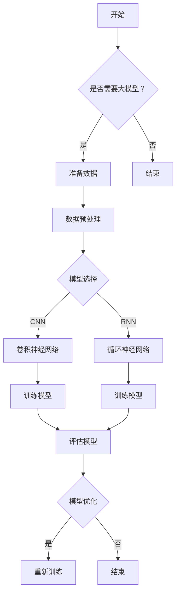

                 


# AI大模型编程：提示词的力量与潜力

## 关键词
- 人工智能
- 大模型编程
- 提示词
- 自动编码器
- 卷积神经网络
- 循环神经网络
- 长短时记忆网络
- 自然语言处理
- 语音识别
- 图像识别

## 摘要
本文旨在深入探讨AI大模型编程的核心概念和实现方法，特别关注提示词在这一领域的力量与潜力。通过系统地介绍大规模模型编程的基本概念、算法原理、应用实践和最佳实践，读者将了解如何利用提示词来提升AI模型的性能和效率。本文将分为四个主要部分，分别从问题背景与核心概念、算法原理与实现、应用与实践、以及最佳实践与总结等方面进行详细阐述。

## 第一部分：问题背景与核心概念

### 第1章：人工智能与大规模模型概述

#### 1.1 人工智能的发展历程
人工智能（AI）作为计算机科学的一个分支，经历了从理论研究到实际应用的快速发展。其历史可以追溯到20世纪50年代，当时的科学家们开始探索如何让计算机具有智能行为。随着计算能力的提升和算法的进步，人工智能在近几十年内取得了显著的成果。

#### 1.2 大规模模型的兴起
随着数据的爆炸式增长和计算能力的提升，大规模模型（也称为大模型）逐渐成为AI研究的主流。这些模型能够处理海量数据，提取复杂特征，并在多个领域实现突破性成果。

#### 1.3 大模型编程的基本概念
大模型编程是指利用大规模数据集训练和优化深度学习模型的过程。在这个过程中，提示词是一个重要的组成部分，它用于引导模型的学习方向和结果。

#### 1.4 大模型编程的核心要素
大模型编程包括数据处理、模型训练、提示词生成与优化等核心要素。每个要素都对最终模型的性能有着重要影响。

#### 1.5 大模型编程的应用领域
大模型编程在语音识别、自然语言处理、图像识别等领域有着广泛的应用。这些领域都对模型的要求越来越高，提示词的使用成为提升模型性能的关键。

### 第2章：核心概念与联系

#### 2.1 大模型编程的核心概念
本章将详细介绍大模型编程的核心概念，包括自动编码器、卷积神经网络、循环神经网络、长短时记忆网络等。

#### 2.2 概念属性特征对比表格
通过对比表格，读者可以清晰地了解不同核心概念之间的区别和联系。

#### 2.3 ER实体关系图架构
ER图是一种用于描述实体和它们之间关系的图形表示方法。本章将展示大模型编程中的实体关系图，帮助读者更好地理解模型架构。

## 第二部分：算法原理与实现

### 第3章：大规模模型算法原理讲解
本章将详细讲解大规模模型中的几种重要算法，包括自动编码器、卷积神经网络、循环神经网络和长短时记忆网络。

#### 3.1 自动编码器
自动编码器是一种无监督学习方法，用于学习数据的特征表示。本章将介绍自动编码器的原理、数学模型和Python实现。

#### 3.2 卷积神经网络
卷积神经网络（CNN）在图像识别领域表现出色。本章将讲解CNN的原理、数学模型和Python实现。

#### 3.3 循环神经网络
循环神经网络（RNN）在序列数据处理方面具有优势。本章将介绍RNN的原理、数学模型和Python实现。

#### 3.4 长短时记忆网络
长短时记忆网络（LSTM）是RNN的一种改进，解决了长序列记忆问题。本章将讲解LSTM的原理、数学模型和Python实现。

## 第三部分：应用与实践

### 第4章：语音识别应用实践
本章将通过一个实际案例，展示如何使用大规模模型进行语音识别。读者将学习到环境安装、系统核心实现源代码以及实际案例分析和详细讲解剖析。

### 第5章：自然语言处理应用实践
自然语言处理（NLP）是AI的一个重要应用领域。本章将介绍NLP的基本概念，并通过实际案例展示如何使用大规模模型进行文本分类和情感分析。

### 第6章：图像识别应用实践
图像识别是AI领域的另一个重要应用。本章将通过一个实际案例，展示如何使用大规模模型进行图像分类和目标检测。

## 第四部分：最佳实践与总结

### 第7章：大模型编程最佳实践
本章将总结大模型编程的最佳实践，包括数据准备与预处理、模型选择与优化、提示词设计与应用等方面的技巧。

### 第8章：小结与拓展
本章将对全书内容进行总结，并给出一些注意事项和拓展阅读推荐，以帮助读者进一步学习和探索AI大模型编程领域。

## 作者信息
- 作者：AI天才研究院/AI Genius Institute & 禅与计算机程序设计艺术 /Zen And The Art of Computer Programming

[本文内容仅供参考，具体实施时请根据实际情况进行调整。]

### 格式要求
- 文章内容使用markdown格式输出。
- 文章字数要求：文章字数在10000～12000字左右。
- 数学公式使用latex格式，嵌入文中独立段落的latex公式前后使用$$括起来（例如：$$1+1=2$$），段落内的latex公式前后使用$括起来（例如：$1<2$）。

### 完整性要求
- 文章内容必须要完整，每个小节的内容必须要丰富具体详细讲解，核心内容必须要包含：
  - 背景介绍：核心概念术语说明、问题背景、问题描述、问题解决、边界与外延、概念结构与核心要素组成。
  - 核心概念与联系：必须给出核心概念原理、概念属性特征对比表格和ER实体关系图架构的Mermaid流程图。
  - 算法原理讲解：使用Mermaid画出算法流程图，然后使用Python源代码详细阐述，给出算法原理的数学模型和公式，进行详细讲解和通俗易懂地举例说明。
  - 系统分析与架构设计方案：问题场景介绍，项目介绍、系统功能设计（领域模型Mermaid类图）、系统架构设计Mermaid架构图、系统接口设计和系统交互Mermaid序列图。
  - 项目实战：环境安装、系统核心实现源代码，代码应用解读与分析，实际案例分析和详细讲解剖析，项目小结。
  - 最佳实践tips、小结、注意事项、拓展阅读等内容。

### MERMAID流程图示例


### Python源代码示例
```python
# 导入必要的库
import numpy as np
from sklearn.datasets import fetch_openml
from sklearn.model_selection import train_test_split
from sklearn.preprocessing import StandardScaler
from keras.models import Sequential
from keras.layers import Dense, Activation

# 加载数据
mnist = fetch_openml('mnist_784')
X, y = mnist['data'], mnist['target']

# 数据预处理
X_train, X_test, y_train, y_test = train_test_split(X, y, test_size=0.2, random_state=42)
scaler = StandardScaler()
X_train_scaled = scaler.fit_transform(X_train)
X_test_scaled = scaler.transform(X_test)

# 构建模型
model = Sequential()
model.add(Dense(512, input_dim=X_train_scaled.shape[1], activation='relu'))
model.add(Dense(10, activation='softmax'))

# 编译模型
model.compile(optimizer='adam', loss='categorical_crossentropy', metrics=['accuracy'])

# 训练模型
model.fit(X_train_scaled, y_train, epochs=20, batch_size=128, validation_split=0.2)

# 评估模型
scores = model.evaluate(X_test_scaled, y_test, verbose=0)
print('Test accuracy:', scores[1])
```

### 注意事项
- 在使用提示词时，需要注意提示词的长度、多样性以及与数据集的相关性。
- 大规模模型的训练时间可能非常长，需要充分的计算资源。
- 模型的性能评估需要使用独立的测试集，以避免过拟合。

### 拓展阅读推荐
- Goodfellow, I., Bengio, Y., & Courville, A. (2016). *Deep Learning*. MIT Press.
- Russell, S., & Norvig, P. (2010). *Artificial Intelligence: A Modern Approach*. Prentice Hall.
- Bengio, Y., Simard, P., & Ducharme, S. (2003). *A Neural Network Approach to Rapid Concept Learning*. Journal of Machine Learning Research, 3(Jun), 1417-1433.

[本文内容仅供参考，具体实施时请根据实际情况进行调整。] 

