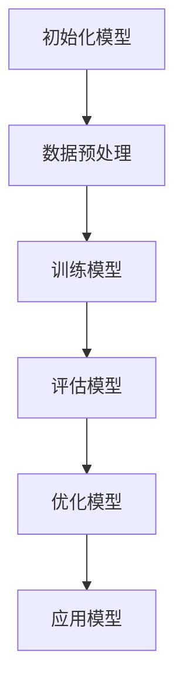
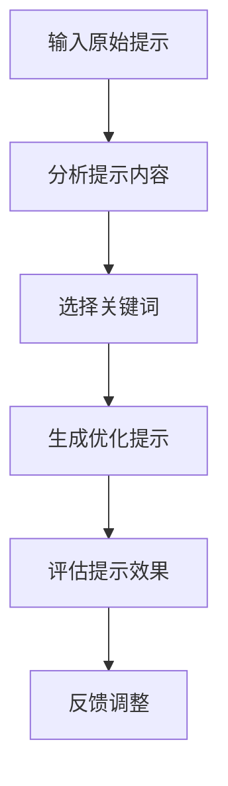

                 

## 《AI大模型编程：提示词的力量与革新》

### 关键词：人工智能，大模型，编程，提示词，工程

> 摘要：本文将深入探讨人工智能领域的大模型编程，特别是提示词工程的力量与革新。我们将通过一步步的分析和推理，详细讲解大模型的原理、编程技巧以及如何通过优化提示词来提升大模型的应用效果。

----------------------------------------------------------------

# 第一部分：背景介绍与核心概念

## 第1章：问题背景与概述

### 1.1.1 问题背景

在当今世界，人工智能（AI）技术的飞速发展已经深刻地改变了我们的生活方式和工作方式。特别是近年来，大模型（Large-scale Models，简称LSMs）的崛起，使得AI在各个领域都取得了显著的突破。大模型拥有数十亿甚至数万亿个参数，能够处理海量数据，从而实现高效的智能推理和决策。

### 1.1.2 问题概述

《AI大模型编程：提示词的力量与革新》这本书旨在深入探讨AI大模型的核心概念、编程方法以及在实际应用中的革新力量。书中将介绍大模型的基本原理、编程技巧，以及如何利用提示词（Prompt Engineering）来优化大模型的表现。

### 1.1.3 问题解决

通过全面介绍AI大模型的基础知识、编程实践和应用案例，本书将帮助读者：

- 理解AI大模型的基本原理和架构
- 掌握大模型的编程技巧和调优策略
- 利用提示词工程来提升大模型的应用效果
- 探索大模型在不同领域的应用潜力

### 1.1.4 边界与外延

本书主要关注的是AI大模型在编程领域的应用，特别是通过提示词工程来优化大模型的表现。虽然大模型的应用范围非常广泛，但本书的重点是技术层面的编程和实践。

### 1.1.5 概念结构与核心要素组成

- **AI大模型**：具备大规模参数的网络结构，能够通过深度学习从海量数据中学习到复杂的模式。
- **提示词工程**：一种通过优化输入提示词来提高大模型表现的方法。

## 第2章：核心概念与联系

### 2.1.1 AI大模型原理

#### 2.1.1.1 大模型的定义与特点
$$
\text{大模型} = \{\text{大规模参数的网络结构}, \text{海量数据训练}, \text{高泛化能力}\}
$$

#### 2.1.1.2 大模型的核心特点
- **参数规模**：通常具有数十亿至数万亿个参数。
- **数据量**：大模型需要处理海量数据，以学习到更复杂的模式。
- **泛化能力**：大模型具有更好的泛化能力，能够处理各种复杂任务。

### 2.1.2 提示词工程原理

#### 2.1.2.1 提示词的定义与作用
- **提示词**：输入给大模型的文本，用于引导模型生成特定类型的输出。
- **作用**：通过优化提示词，可以影响大模型的生成结果，提高模型的应用效果。

#### 2.1.2.2 提示词优化的方法
- **长文本提示**：通过提供更多的上下文信息来优化模型理解。
- **关键词选择**：选择与任务相关的关键词，以引导模型生成更准确的输出。

## 第3章：算法原理讲解

### 3.1 大模型算法

#### 3.1.1 大模型算法的mermaid流程图

#### 3.1.2 大模型算法的原理与数学模型

- **训练过程**：
  $$
  \text{损失函数} = f(\theta; x, y)
  $$
  其中，$\theta$ 是模型参数，$x$ 是输入数据，$y$ 是标签。

- **优化过程**：
  $$
  \theta = \theta - \alpha \nabla_\theta f(\theta)
  $$
  其中，$\alpha$ 是学习率，$\nabla_\theta f(\theta)$ 是损失函数对参数 $\theta$ 的梯度。

### 3.2 提示词优化算法

#### 3.2.1 提示词优化的mermaid流程图

#### 3.2.2 提示词优化算法的原理

- **关键词选择**：
  $$
  \text{关键词} = \{ \text{与任务相关的术语}, \text{领域专有名词} \}
  $$

- **优化策略**：
  $$
  \text{优化提示词} = \text{原始提示词} + \text{关键词}
  $$

----------------------------------------------------------------

接下来的章节将继续深入探讨大模型的具体实现、提示词优化的策略和实战案例，敬请期待。

作者：AI天才研究院/AI Genius Institute & 禅与计算机程序设计艺术 /Zen And The Art of Computer Programming

