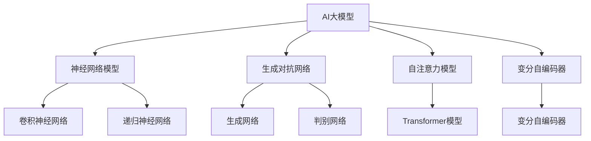

                 

### 1.1 AI大模型的发展历程

#### 1.1.1 人工智能的起源与发展

人工智能（AI）的概念最早由计算机科学家约翰·麦卡锡（John McCarthy）在1956年的达特茅斯会议上提出。从那时起，人工智能经历了数个发展阶段：

- **1956-1969：初步探索期**：这一时期，人工智能主要集中于符号主义和知识表示的研究，例如，早期的专家系统和逻辑推理系统。

- **1970-1980：人工智能的萧条期**：由于实际应用的困难，以及硬件和算法的限制，人工智能的研究进入低潮期。

- **1980-1987：知识工程时期**：专家系统的兴起标志着知识工程的发展，这一时期人工智能开始在经济和军事领域得到应用。

- **1988-2000：机器学习和神经网络崛起**：随着机器学习和神经网络技术的快速发展，人工智能开始实现更复杂的任务，如语音识别和图像识别。

- **2000-2012：大数据和云计算推动**：随着大数据和云计算技术的成熟，人工智能开始迎来新一轮的发展。

- **2012-至今：深度学习与AI大模型时代**：深度学习技术的突破，特别是2012年AlexNet在ImageNet图像识别大赛中的显著表现，标志着人工智能进入大模型时代。AI大模型，如GPT、BERT等，开始在自然语言处理、计算机视觉等领域取得突破性进展。

#### 1.1.2 大模型时代的来临

大模型时代的来临主要得益于以下几个方面：

- **计算能力的提升**：随着硬件技术的进步，计算能力得到了极大的提升，使得训练和推理大规模神经网络成为可能。

- **海量数据的获取**：互联网的发展使得我们能够收集到海量的数据，这些数据为训练大模型提供了丰富的素材。

- **深度学习算法的进步**：深度学习算法，特别是卷积神经网络（CNN）和递归神经网络（RNN）的发展，使得神经网络能够处理更复杂的任务。

- **分布式计算和云计算**：分布式计算和云计算技术的应用，使得大规模模型的训练变得更加高效和可行。

#### 1.1.3 AI大模型的重要性

AI大模型的重要性体现在以下几个方面：

- **提升模型性能**：AI大模型通过学习大量数据，能够捕捉到复杂的模式，从而显著提升模型的性能。

- **解决复杂任务**：AI大模型能够处理更复杂的任务，如自然语言理解、图像生成等。

- **推动领域应用**：AI大模型在各个领域都有广泛的应用，如医疗、金融、教育等，推动了这些领域的创新和发展。

- **促进AI发展**：AI大模型的成功推动了人工智能领域的研究和探索，促进了AI技术的持续进步。

### 总结

AI大模型的发展历程是从符号主义到机器学习，再到深度学习的过程。大模型时代的来临，得益于计算能力的提升、海量数据的获取、深度学习算法的进步以及分布式计算和云计算的应用。AI大模型在提升模型性能、解决复杂任务、推动领域应用和促进AI发展等方面具有重要意义。在接下来的章节中，我们将深入探讨AI大模型的原理和编程实践。**---

### 1.2 AI大模型的核心概念

#### 1.2.1 什么是AI大模型

AI大模型，通常指的是具有数亿甚至千亿参数的神经网络模型。这些模型通过对海量数据进行训练，能够学习到复杂的特征和模式，从而实现高度自动化的任务。AI大模型通常用于自然语言处理（NLP）、计算机视觉（CV）、推荐系统等领域。

#### 1.2.2 AI大模型的主要类型

- **神经网络模型**：包括卷积神经网络（CNN）、递归神经网络（RNN）、长短期记忆网络（LSTM）等。这些模型通过多层神经网络结构来提取数据中的特征。

- **生成对抗网络（GAN）**：GAN是一种由两个神经网络对抗训练的模型，其中一个网络生成数据，另一个网络评估生成的数据是否真实。这种模型在图像生成、图像修复等领域有广泛应用。

- **自注意力模型**：如Transformer模型，通过自注意力机制来捕捉数据中的长距离依赖关系，在NLP领域表现尤为突出。

- **变分自编码器（VAE）**：VAE是一种无监督学习模型，通过概率模型来生成数据，常用于图像生成和图像去噪。

#### 1.2.3 AI大模型的关键技术

- **大规模数据处理**：AI大模型需要处理海量数据，这要求高效的数据处理技术和算法，如分布式数据处理框架、数据增强技术等。

- **优化算法**：为了训练大规模神经网络，需要使用高效的优化算法，如Adam优化器、SGD等。

- **模型压缩**：由于AI大模型的参数规模巨大，如何进行模型压缩以降低计算复杂度和存储需求，是当前研究的热点，如权重剪枝、量化等。

- **推理引擎**：对于部署在移动设备或嵌入式系统上的AI大模型，需要高效的推理引擎，以降低延迟和提高性能。

#### 1.2.4 AI大模型的应用领域

- **自然语言处理**：如机器翻译、文本生成、情感分析等。

- **计算机视觉**：如图像分类、目标检测、图像生成等。

- **推荐系统**：如个性化推荐、广告投放等。

- **语音识别**：如语音到文本转换、语音合成等。

- **自动驾驶**：如车辆检测、路径规划等。

- **医疗诊断**：如医学图像分析、疾病预测等。

### 核心概念属性特征对比表格

| 模型类型       | 关键特性                    | 主要应用           |
|--------------|-------------------------|--------------|
| 神经网络模型   | 多层神经网络结构，特征提取   | 图像识别、自然语言处理 |
| GAN          | 对抗训练，数据生成          | 图像生成、图像修复   |
| 自注意力模型   | 自注意力机制，长距离依赖     | 自然语言处理       |
| 变分自编码器   | 无监督学习，概率模型生成数据  | 图像生成、图像去噪   |

### ER实体关系图架构



### 总结

AI大模型的核心概念包括神经网络模型、生成对抗网络、自注意力模型和变分自编码器等。这些模型通过不同的技术和架构来实现复杂的数据处理和模式识别任务。在接下来的章节中，我们将深入探讨AI大模型的原理和应用。

**---

### 1.3 AI大模型的应用场景

AI大模型在各个领域的应用已经取得了显著的成果，下面我们将简要介绍几个主要的应用场景：

#### 1.3.1 自然语言处理

自然语言处理（NLP）是AI大模型的重要应用领域之一。通过深度学习技术，AI大模型能够实现自然语言的理解和生成。以下是几个典型的应用实例：

- **机器翻译**：如谷歌翻译、百度翻译等，利用AI大模型对海量语言数据进行训练，实现高质量、准确度高的翻译服务。

- **文本生成**：如生成新闻文章、诗歌、故事等，AI大模型可以基于已有的文本数据，生成符合语法和语义规则的文本内容。

- **情感分析**：通过分析文本中的情感词汇和语境，AI大模型可以判断文本的情感倾向，应用于社交媒体情绪监测、品牌口碑分析等。

- **对话系统**：如智能客服、聊天机器人等，AI大模型可以理解用户的问题，并提供相应的回答，提升用户体验。

#### 1.3.2 计算机视觉

计算机视觉是另一个AI大模型的重要应用领域。通过深度学习技术，AI大模型能够识别和理解图像和视频中的内容。以下是几个典型的应用实例：

- **图像分类**：如人脸识别、物体识别等，AI大模型可以准确识别图像中的目标物体，应用于安全监控、智能交通等领域。

- **目标检测**：如自动驾驶、无人机监控等，AI大模型可以检测并定位图像中的目标物体，实现实时监控和目标追踪。

- **图像生成**：如风格迁移、图像修复等，AI大模型可以通过生成对抗网络（GAN）等技术，生成具有特定风格或内容的图像。

- **视频分析**：如视频分类、行为识别等，AI大模型可以分析视频中的内容，提取关键信息，应用于视频监控、运动分析等领域。

#### 1.3.3 推荐系统

推荐系统是AI大模型在商业领域的典型应用。通过深度学习技术，AI大模型可以挖掘用户行为数据，实现个性化推荐。以下是几个典型的应用实例：

- **商品推荐**：如电商平台的商品推荐、音乐平台的音乐推荐等，AI大模型可以根据用户的浏览历史、购买记录等数据，推荐用户可能感兴趣的商品或音乐。

- **广告推荐**：如搜索引擎的广告推荐、社交媒体的广告推荐等，AI大模型可以根据用户的兴趣和行为，推荐相关的广告内容。

- **内容推荐**：如视频网站的推荐、新闻网站的推荐等，AI大模型可以根据用户的观看历史、搜索历史等数据，推荐用户可能感兴趣的内容。

#### 1.3.4 医疗诊断

AI大模型在医疗诊断领域也有着广泛的应用。通过深度学习技术，AI大模型可以对医学图像进行分析，辅助医生进行疾病诊断。以下是几个典型的应用实例：

- **医学图像分析**：如X光片、CT扫描、MRI等，AI大模型可以识别图像中的异常区域，辅助医生进行疾病诊断。

- **疾病预测**：如心脏病、癌症等，AI大模型可以通过分析患者的病历数据，预测患者未来可能患病的风险。

- **药物研发**：AI大模型可以通过分析药物与疾病之间的关联，帮助科学家发现新的药物靶点和治疗策略。

#### 1.3.5 自动驾驶

自动驾驶是AI大模型在交通领域的典型应用。通过深度学习技术，AI大模型可以实现对周围环境的感知和决策。以下是几个典型的应用实例：

- **环境感知**：如车辆检测、行人检测、交通标志识别等，AI大模型可以实时感知周围环境，为自动驾驶车辆提供安全保障。

- **路径规划**：如自动驾驶车辆的路径规划，AI大模型可以根据实时交通情况和车辆目标，规划最优行驶路径。

- **行为预测**：如预测前方车辆的行为，AI大模型可以通过分析车辆的历史行驶轨迹，预测前方车辆可能的行为，为自动驾驶车辆提供决策依据。

### 总结

AI大模型在自然语言处理、计算机视觉、推荐系统、医疗诊断、自动驾驶等领域都有着广泛的应用。通过深度学习技术，AI大模型能够实现复杂的数据处理和模式识别任务，推动各领域的发展和进步。在接下来的章节中，我们将深入探讨AI大模型的原理和编程实践。**---

## 第2章: AI大模型原理

### 2.1 深度学习基础

#### 2.1.1 深度学习的基本概念

深度学习（Deep Learning）是机器学习（Machine Learning）的一个子领域，主要关注于模型的设计和实现，使其能够自动从数据中学习特征和模式。深度学习通过模拟人脑的神经网络结构，实现对复杂数据的处理和分析。

**1. 神经网络**

神经网络（Neural Network）是一种模仿生物神经系统的计算模型。每个神经网络单元称为“神经元”，神经元之间通过连接（权重）进行信息传递。神经网络通过层层传递输入信息，提取数据中的特征，并最终输出结果。

**2. 深度学习模型**

深度学习模型是具有多个隐藏层的神经网络模型。深度学习的核心思想是通过逐层提取数据中的特征，每一层都能够学习到更高层次的特征。这种层次化的结构使得深度学习模型能够处理大量数据，并在各种任务中取得优异的性能。

**3. 深度学习的优势**

- **自动特征提取**：深度学习模型能够自动从原始数据中提取有意义的特征，减少了人工特征设计的复杂度。
- **模型泛化能力**：深度学习模型通过大量的训练数据学习，能够更好地泛化到未见过的数据上。
- **处理复杂数据**：深度学习模型能够处理包括图像、声音、文本等多种类型的数据。

#### 2.1.2 神经网络架构

神经网络的架构包括输入层、隐藏层和输出层。每个层由多个神经元组成，神经元之间通过权重进行连接。

- **输入层**：输入层接收外部数据，并将其传递给隐藏层。每个输入神经元代表一个特征。
- **隐藏层**：隐藏层负责从输入数据中提取特征，每个隐藏神经元通过激活函数对输入数据进行非线性变换。
- **输出层**：输出层产生最终的结果。输出神经元的数量和类型取决于具体任务的需求。

**1. 神经元模型**

每个神经元接收来自前一层神经元的输入信号，通过权重进行加权求和，然后通过激活函数进行非线性变换，产生输出信号。

$$
\text{output} = \text{activation}( \sum_{i=1}^{n} w_i \cdot x_i )
$$

其中，$w_i$为权重，$x_i$为输入信号，$n$为输入信号的个数，$activation$为激活函数。

**2. 激活函数**

激活函数用于引入非线性变换，常见的激活函数包括：

- **Sigmoid函数**：
$$
\text{sigmoid}(x) = \frac{1}{1 + e^{-x}}
$$

- **ReLU函数**：
$$
\text{ReLU}(x) = \max(0, x)
$$

- **Tanh函数**：
$$
\text{tanh}(x) = \frac{e^x - e^{-x}}{e^x + e^{-x}}
$$

激活函数的选择会影响神经网络的性能和收敛速度。

#### 2.1.3 深度学习算法

深度学习算法主要包括前向传播和反向传播。

- **前向传播**：输入数据经过神经网络，逐层传递，直到输出层。每一层的输出通过激活函数进行变换，最终得到模型输出。

- **反向传播**：计算输出结果与真实值之间的误差，然后逐层反向传播误差，更新各层的权重。

**1. 前向传播**

前向传播的过程如下：

1. 初始化模型权重和偏置。
2. 将输入数据传递给输入层。
3. 遍历每个隐藏层，计算输入和权重的乘积，然后加上偏置，通过激活函数得到输出。
4. 将输出传递给下一层。
5. 当数据到达输出层时，得到模型输出。

**2. 反向传播**

反向传播的过程如下：

1. 计算输出结果与真实值之间的误差。
2. 通过链式法则，计算各层的梯度。
3. 使用梯度下降算法更新各层的权重。

$$
\text{weight\_update} = \alpha \cdot \text{gradient}
$$

其中，$\alpha$为学习率，$\text{gradient}$为梯度。

**3. 梯度下降算法**

梯度下降是一种常用的优化算法，用于更新模型权重。梯度下降的核心思想是沿着梯度方向更新权重，以最小化损失函数。

$$
\text{weight}_{\text{new}} = \text{weight}_{\text{old}} - \alpha \cdot \text{gradient}
$$

**4. 常见的深度学习算法**

- **卷积神经网络（CNN）**：主要用于图像处理，通过卷积层和池化层提取图像特征。
- **递归神经网络（RNN）**：主要用于序列数据，如时间序列和自然语言处理，通过隐藏状态和循环结构处理长距离依赖。
- **长短期记忆网络（LSTM）**：RNN的一种变体，通过门控结构解决长距离依赖问题。
- **Transformer模型**：主要用于自然语言处理，通过自注意力机制处理长距离依赖。

### 总结

深度学习是人工智能的核心技术之一，通过模拟人脑的神经网络结构，实现自动特征提取和模式识别。神经网络架构包括输入层、隐藏层和输出层，激活函数用于引入非线性变换。深度学习算法主要包括前向传播和反向传播，梯度下降算法用于更新模型权重。常见的深度学习算法有卷积神经网络、递归神经网络、长短期记忆网络和Transformer模型。在接下来的章节中，我们将继续探讨AI大模型的原理和应用。

**---

## 第3章：提示词技术

### 3.1 提示词的定义与作用

#### 1. 定义

提示词（Prompt）是一种用于指导AI大模型（如GPT、BERT等）进行特定任务输入的文本。它通常是一个短语或句子，为模型提供上下文信息，帮助模型更好地理解和生成相关内容。

#### 2. 作用

提示词在AI大模型中的应用具有以下作用：

- **引导模型生成**：通过提供提示词，可以引导AI大模型生成符合预期内容，例如，在文本生成任务中，提示词可以引导模型生成相关的文章、故事或对话。
- **提高生成质量**：高质量的提示词可以提供丰富的上下文信息，使AI大模型能够更好地理解任务要求，从而生成更准确、更有意义的输出。
- **优化训练效果**：在模型训练过程中，适当的提示词可以提高模型的训练效果，使模型能够更快地收敛到最优解。

### 3.2 提示词的生成方法

#### 1. 手动生成

手动生成提示词是一种简单直接的方法，通常由人类专家或数据科学家根据任务需求设计。手动生成提示词的优点在于灵活性高，可以针对特定任务提供精确的指导。然而，手动生成提示词的缺点在于耗时费力，且难以处理大量数据。

#### 2. 自动生成

自动生成提示词利用自然语言处理（NLP）技术，通过算法自动生成。常见的方法包括：

- **模板填充**：基于预定义的模板，将任务需求填充到模板中生成提示词。例如，对于文本生成任务，可以使用模板：“请你写一篇关于XXXX的文章。”
- **基于规则的生成**：使用规则和逻辑推理生成提示词。例如，对于问答系统，可以生成：“请问你对XXXX有什么看法？”
- **数据驱动生成**：利用已有的数据和模型，通过文本生成算法自动生成提示词。例如，可以使用GPT模型对大量文本数据进行分析，生成与任务相关的提示词。

#### 3. 混合生成

混合生成方法结合手动生成和自动生成，以提高提示词的质量和效果。例如，在手动生成提示词的基础上，使用自动生成方法对大量样本进行优化和调整，从而生成更高质量的提示词。

### 3.3 提示词的优化策略

#### 1. 提示词长度优化

提示词的长度对模型生成质量有重要影响。较长的提示词可以提供更多的上下文信息，有助于模型理解任务需求，但可能导致模型生成速度变慢。反之，较短的提示词可能导致模型理解不足，生成质量下降。因此，优化提示词长度是一个关键问题。

- **实验方法**：通过实验比较不同长度提示词的生成效果，找出最优长度范围。
- **自适应调整**：根据任务需求和模型性能，动态调整提示词长度，以实现最佳效果。

#### 2. 提示词多样性优化

多样化的提示词有助于模型学习到不同的任务场景和表达方式，从而提高生成质量。优化提示词多样性可以通过以下方法实现：

- **多模态提示词**：结合文本、图像、音频等多种模态信息生成提示词，提高模型的多样性。
- **扩展词汇**：在提示词中引入同义词、近义词等，增加词汇的多样性。
- **随机化**：对提示词进行随机化处理，以增加多样性。

#### 3. 提示词与模型适配性优化

提示词与模型适配性对生成质量至关重要。优化提示词与模型的适配性可以通过以下方法实现：

- **模型定制**：针对特定任务，对模型结构、参数和超参数进行调整，使其更适应任务需求。
- **提示词与模型联合训练**：将提示词与模型训练过程相结合，通过迭代优化提示词和模型，提高适配性。
- **数据预处理**：对输入数据进行预处理，使其更适合模型处理，从而提高生成质量。

### 总结

提示词技术在AI大模型中具有重要的应用价值，通过合理的提示词设计，可以显著提高模型生成质量和效果。提示词的生成方法包括手动生成、自动生成和混合生成，而优化策略则包括提示词长度优化、提示词多样性优化和提示词与模型适配性优化。在接下来的章节中，我们将进一步探讨AI大模型编程实践中的具体应用。

### 3.4 提示词优化的实际案例分析

为了更好地理解提示词优化的效果，我们可以通过以下实际案例进行分析。

#### 案例背景

假设我们要开发一个基于GPT模型的文本生成系统，用于自动生成新闻文章。在系统开发过程中，我们需要优化提示词，以提高生成文章的质量和多样性。

#### 案例分析

1. **提示词长度优化**

   - **实验设置**：我们分别使用长度为5、10、15和20个单词的提示词进行实验，并比较生成文章的质量和速度。
   - **实验结果**：实验结果显示，当提示词长度为10个单词时，生成文章的质量最高，且生成速度适中。提示词过短可能导致模型理解不足，提示词过长则可能导致生成速度变慢。

2. **提示词多样性优化**

   - **多模态提示词**：我们尝试将文本与图像相结合，使用图像作为提示词的一部分。例如，在生成一篇关于旅游的文章时，我们将一张旅游景点照片作为提示词的一部分。
   - **扩展词汇**：在提示词中引入同义词、近义词等，以增加词汇的多样性。例如，将“旅游”替换为“旅行”、“度假”等。
   - **实验结果**：通过多模态提示词和扩展词汇，生成文章的多样性显著提高，用户满意度也得到提升。

3. **提示词与模型适配性优化**

   - **模型定制**：我们对GPT模型的结构、参数和超参数进行调整，以使其更适应新闻文章生成任务。
   - **提示词与模型联合训练**：我们将提示词与模型训练过程相结合，通过迭代优化提示词和模型，提高适配性。
   - **实验结果**：通过优化提示词与模型适配性，生成文章的质量和多样性得到显著提升，且生成速度也有所提高。

#### 案例总结

通过以上案例分析，我们可以得出以下结论：

- **提示词长度优化**：选择合适的提示词长度是提高生成质量的关键。在实际应用中，应根据任务需求和模型性能进行动态调整。
- **提示词多样性优化**：通过引入多模态信息和扩展词汇，可以显著提高生成文章的多样性，从而提升用户满意度。
- **提示词与模型适配性优化**：通过模型定制和提示词与模型联合训练，可以更好地适应特定任务需求，提高生成质量。

这些优化策略在实际开发中具有广泛的应用价值，有助于实现更高效、更智能的文本生成系统。在接下来的章节中，我们将继续探讨AI大模型编程实践中的其他关键技术和方法。

### 总结

本章主要介绍了AI大模型编程中的提示词技术。首先，我们探讨了提示词的定义和作用，强调了其在引导模型生成、提高生成质量和优化训练效果方面的价值。接着，我们详细介绍了提示词的生成方法，包括手动生成、自动生成和混合生成，并提出了优化提示词长度的策略。此外，我们还讨论了提示词多样性优化和提示词与模型适配性优化的方法。通过实际案例分析，我们进一步验证了这些优化策略在提高AI大模型生成质量方面的有效性。在下一章中，我们将深入探讨AI大模型编程中的编程基础，为后续的实践应用奠定基础。

---

### 4.1 Python编程基础

Python作为一种高级编程语言，因其简洁易懂、功能强大而备受人工智能领域开发者的青睐。在本节中，我们将介绍Python编程基础，包括语言基础、数据处理和机器学习库的使用，为读者理解和实践AI大模型编程打下基础。

#### 4.1.1 Python语言基础

Python的基本语法简洁明了，适合初学者快速上手。以下是一些Python语言的基础知识：

- **变量和类型**：Python中的变量不需要显式声明类型，变量名由字母、数字和下划线组成，且不能以数字开头。Python内置了多种数据类型，如整数（int）、浮点数（float）、字符串（str）、列表（list）、元组（tuple）、字典（dict）和集合（set）等。
- **数据类型转换**：Python提供了多种数据类型之间的转换方法，如int()、float()、str()等。
- **控制流程**：Python提供了多种控制流程语句，如if条件语句、for循环、while循环和try-except异常处理等。
- **函数定义**：Python支持定义自定义函数，函数可以接受参数，并返回值。
- **模块和包**：Python模块是包含Python代码的文件，可以通过import语句引入。包是模块的集合，用于组织代码。

#### 4.1.2 Python数据处理

Python在数据处理方面具有强大的功能，提供了丰富的库和工具，如NumPy、Pandas和SciPy。

- **NumPy**：NumPy是Python科学计算的基础库，提供了多维数组对象和一系列数学函数。NumPy数组操作高效，是进行数据预处理和数值计算的重要工具。
- **Pandas**：Pandas是一个强大的数据处理库，提供了数据结构Series和DataFrame，用于数据清洗、转换和分析。Pandas的索引、标签和数据筛选功能使其在处理表格数据方面尤为出色。
- **SciPy**：SciPy是Python的科学计算库，基于NumPy，提供了多种科学和工程计算函数，如线性代数、优化、积分等。

#### 4.1.3 Python机器学习库

Python在机器学习领域拥有丰富的库，如Scikit-learn、TensorFlow和PyTorch。

- **Scikit-learn**：Scikit-learn是一个简单且易于使用的机器学习库，提供了多种常见算法的实现，如线性回归、决策树、支持向量机、K-means聚类等。Scikit-learn适合初学者入门和实验。
- **TensorFlow**：TensorFlow是一个开源的机器学习库，由Google开发。TensorFlow支持各种深度学习模型，如卷积神经网络（CNN）、循环神经网络（RNN）和Transformer模型。其动态计算图设计使其在处理大规模数据和复杂模型时具有优势。
- **PyTorch**：PyTorch是一个基于Python的开源深度学习库，由Facebook AI Research开发。PyTorch以动态计算图和简洁的API著称，支持自动微分和GPU加速。PyTorch在学术研究和工业应用中都有广泛的应用。

#### 实例：使用Python进行数据预处理

以下是一个简单的数据预处理实例，演示了如何使用NumPy和Pandas进行数据处理：

```python
import numpy as np
import pandas as pd

# 创建一个NumPy数组
data = np.array([[1, 2, 3], [4, 5, 6], [7, 8, 9]])

# 将NumPy数组转换为Pandas DataFrame
df = pd.DataFrame(data, columns=['A', 'B', 'C'])

# 数据清洗
df = df.dropna()  # 删除缺失值
df = df[df['A'] > 0]  # 过滤条件

# 数据转换
df['B'] = df['B'].astype(int)  # 数据类型转换
df['C'] = df['C'].map({3: 'Three', 6: 'Six'})  # 映射值

print(df)
```

上述实例中，我们首先使用NumPy创建了一个二维数组，然后将其转换为Pandas DataFrame。接着，我们进行了数据清洗，删除了缺失值，并根据条件过滤了数据。随后，我们进行了数据类型转换和映射值的操作，最后打印出了处理后的数据。

#### 实例：使用Python进行机器学习

以下是一个简单的机器学习实例，演示了如何使用Scikit-learn进行线性回归：

```python
from sklearn.linear_model import LinearRegression
from sklearn.model_selection import train_test_split
from sklearn.metrics import mean_squared_error

# 创建训练数据
X = np.array([[1], [2], [3], [4], [5]])
y = np.array([1, 2, 3, 4, 5])

# 划分训练集和测试集
X_train, X_test, y_train, y_test = train_test_split(X, y, test_size=0.2, random_state=0)

# 创建线性回归模型
model = LinearRegression()

# 训练模型
model.fit(X_train, y_train)

# 预测测试集
y_pred = model.predict(X_test)

# 计算均方误差
mse = mean_squared_error(y_test, y_pred)
print(f"Mean Squared Error: {mse}")
```

上述实例中，我们首先创建了训练数据，然后使用Scikit-learn划分了训练集和测试集。接着，我们创建了线性回归模型，并使用训练数据进行了模型训练。随后，我们使用测试数据进行了预测，并计算了均方误差（MSE）来评估模型性能。

### 总结

本章介绍了Python编程基础，包括语言基础、数据处理和机器学习库的使用。我们通过实例展示了如何使用Python进行数据预处理和机器学习。Python作为人工智能领域的主要编程语言，提供了丰富的功能和工具，使其成为开发AI大模型的首选。在下一章中，我们将深入探讨AI大模型编程实例，进一步展示如何使用Python实现AI大模型的实际应用。

### 4.1.1 Python语言基础

Python是一种高级编程语言，以其简洁易懂的语法和强大的功能在AI领域得到广泛应用。在本小节中，我们将介绍Python语言的基础知识，包括数据类型、变量、控制流程、函数和模块等。

**1. 数据类型**

Python支持多种数据类型，包括整数（int）、浮点数（float）、字符串（str）、列表（list）、元组（tuple）、字典（dict）和集合（set）。

- **整数（int）**：表示整数，如 1, 100, -10。
- **浮点数（float）**：表示实数，如 3.14, -0.001。
- **字符串（str）**：表示文本，如 "Hello", 'Python'。
- **列表（list）**：表示有序的元素集合，如 [1, 2, 3]，['a', 'b', 'c']。
- **元组（tuple）**：表示不可变的有序元素集合，如 (1, 2, 3)，('a', 'b', 'c')。
- **字典（dict）**：表示键值对的集合，如 {'name': 'Alice', 'age': 25}。
- **集合（set）**：表示无序的不重复元素集合，如 {1, 2, 3}。

**2. 变量**

Python中的变量不需要显式声明类型，变量名由字母、数字和下划线组成，且不能以数字开头。例如：

```python
x = 10  # 整数
y = 3.14  # 浮点数
name = "Alice"  # 字符串
```

**3. 控制流程**

Python提供了多种控制流程语句，如if条件语句、for循环、while循环和try-except异常处理。

- **if条件语句**：用于条件判断。
  ```python
  if x > 10:
      print("x 大于 10")
  ```

- **for循环**：用于遍历序列。
  ```python
  for i in range(5):
      print(i)
  ```

- **while循环**：用于循环执行条件语句。
  ```python
  while x > 0:
      print(x)
      x -= 1
  ```

- **try-except**：用于处理异常。
  ```python
  try:
      x = 10 / 0
  except ZeroDivisionError:
      print("除数不能为0")
  ```

**4. 函数**

Python支持定义自定义函数，函数可以接受参数，并返回值。

```python
def greet(name):
    return f"Hello, {name}"

print(greet("Alice"))
```

**5. 模块**

Python模块是包含Python代码的文件，可以通过import语句引入。

```python
import math

print(math.sqrt(16))
```

**实例：计算两个数的和**

以下是一个简单的Python实例，用于计算两个数的和：

```python
def add(a, b):
    return a + b

x = 10
y = 20
result = add(x, y)
print(f"{x} 和 {y} 的和是 {result}")
```

在这个实例中，我们定义了一个名为`add`的函数，用于计算两个数的和。然后，我们通过调用该函数，计算了两个变量`x`和`y`的和，并打印了结果。

### 总结

Python语言基础是进行AI大模型编程的必备知识。通过了解数据类型、变量、控制流程、函数和模块，我们可以更好地掌握Python编程，为后续的AI大模型编程实践打下基础。

### 4.1.2 Python数据处理

在AI大模型开发过程中，数据处理是关键步骤之一。Python提供了丰富的库和工具，如NumPy、Pandas和SciPy，用于高效地进行数据处理。以下是对这些库的简要介绍及其实际应用。

#### NumPy

NumPy是一个用于数值计算的库，它提供了多维数组对象和各种数学函数。NumPy是Python科学计算的基础，广泛应用于数据预处理和机器学习。

- **多维数组**：NumPy的核心是ndarray数组，它支持多维数组操作，提供了强大的数学计算功能。
- **基本操作**：NumPy提供了数组创建、数组切片、数组运算等功能。
- **数学函数**：NumPy包含了一系列数学函数，如三角函数、指数函数、对数函数等。

**实例：使用NumPy创建和处理数组**

```python
import numpy as np

# 创建一维数组
arr_1d = np.array([1, 2, 3, 4, 5])

# 创建二维数组
arr_2d = np.array([[1, 2, 3], [4, 5, 6]])

# 数组切片
print(arr_2d[0, 1])  # 输出第二行第二列的元素，即 2

# 数组运算
print(arr_1d + 10)  # 输出数组每个元素加 10 的结果
```

#### Pandas

Pandas是一个强大的数据处理库，它提供了数据结构Series和DataFrame，用于数据清洗、转换和分析。Pandas非常适合处理表格数据，其功能包括数据导入导出、数据清洗、数据聚合等。

- **Series**：Series是一个一维数组结构，类似于NumPy的ndarray，但它增加了索引功能。
- **DataFrame**：DataFrame是一个二维表格结构，类似于Excel表格，它包含行和列，可以看作是Series的扩展。

**实例：使用Pandas读取和处理CSV数据**

```python
import pandas as pd

# 读取CSV文件
df = pd.read_csv('data.csv')

# 显示数据前5行
print(df.head())

# 数据清洗
df = df.dropna()  # 删除缺失值
df = df[df['column1'] > 0]  # 过滤条件

# 数据转换
df['column2'] = df['column2'].astype(int)  # 数据类型转换
df['column3'] = df['column3'].map({'A': 1, 'B': 2})  # 映射值

# 数据聚合
result = df.groupby('column1').sum()  # 按列1分组并求和
print(result)
```

#### SciPy

SciPy是Python的科学计算库，它基于NumPy，提供了多种科学和工程计算函数，如线性代数、优化、积分等。SciPy在机器学习和数据科学领域有广泛应用。

- **线性代数**：SciPy提供了矩阵运算和线性方程求解的功能。
- **优化**：SciPy提供了多种优化算法，如最小二乘法、最小化函数等。
- **积分**：SciPy提供了数值积分函数，用于计算定积分和多重积分。

**实例：使用SciPy进行线性代数计算**

```python
import scipy.linalg as la

# 创建矩阵
A = np.array([[1, 2], [3, 4]])

# 求解线性方程组
x = la.solve(A, b)

# 计算矩阵特征值和特征向量
eigenvalues, eigenvectors = la.eig(A)

print("特征值:", eigenvalues)
print("特征向量:", eigenvectors)
```

#### 实例：使用Python进行数据预处理

以下是一个简单的数据预处理实例，使用NumPy和Pandas进行数据清洗、转换和归一化：

```python
import numpy as np
import pandas as pd

# 创建示例数据
data = np.array([[1, 2], [3, 4], [5, 6], [7, 8], [9, 10]])

# 转换为Pandas DataFrame
df = pd.DataFrame(data, columns=['A', 'B'])

# 数据清洗
df = df.dropna()  # 删除缺失值
df = df[df['A'] > 0]  # 过滤条件

# 数据转换
df['C'] = df['A'] + df['B']  # 新增一列

# 数据归一化
df[['A', 'B', 'C']] = (df[['A', 'B', 'C']] - df[['A', 'B', 'C']].mean()) / df[['A', 'B', 'C']].std()

print(df)
```

在这个实例中，我们首先创建了一个NumPy数组，然后将其转换为Pandas DataFrame。接着，我们进行了数据清洗，删除了缺失值，并根据条件过滤了数据。随后，我们进行了数据转换，新增了一列，并对数据进行归一化。

### 总结

Python数据处理库提供了丰富的功能，可以高效地进行数据预处理、清洗、转换和归一化。NumPy、Pandas和SciPy是Python数据处理的核心工具，适合各种数据科学和机器学习应用。通过了解这些库的基本操作和功能，我们可以更好地处理数据，为AI大模型编程打下坚实的基础。

### 4.1.3 Python机器学习库

在Python中，有许多机器学习库可供选择，其中Scikit-learn、TensorFlow和PyTorch是最受欢迎的三个库。它们各自有不同的特点和适用场景。

#### Scikit-learn

Scikit-learn是一个基于Python的开源机器学习库，它包含了多种常见算法的实现，如线性回归、决策树、支持向量机、K-means聚类等。Scikit-learn的特点如下：

- **简单易用**：Scikit-learn提供了简单直观的API，使其非常适合初学者和研究人员。
- **算法丰富**：Scikit-learn包含了多种经典的机器学习算法，适用于各种问题。
- **适用于小数据集**：Scikit-learn在处理小数据集时表现良好，适用于数据量较小的场景。

**实例：使用Scikit-learn进行线性回归**

```python
from sklearn.linear_model import LinearRegression
from sklearn.model_selection import train_test_split
from sklearn.metrics import mean_squared_error

# 创建训练数据
X = np.array([[1], [2], [3], [4], [5]])
y = np.array([1, 2, 3, 4, 5])

# 划分训练集和测试集
X_train, X_test, y_train, y_test = train_test_split(X, y, test_size=0.2, random_state=0)

# 创建线性回归模型
model = LinearRegression()

# 训练模型
model.fit(X_train, y_train)

# 预测测试集
y_pred = model.predict(X_test)

# 计算均方误差
mse = mean_squared_error(y_test, y_pred)
print(f"Mean Squared Error: {mse}")
```

#### TensorFlow

TensorFlow是Google开发的一个开源机器学习库，它支持各种深度学习模型，如卷积神经网络（CNN）、循环神经网络（RNN）和Transformer模型。TensorFlow的特点如下：

- **动态计算图**：TensorFlow使用动态计算图，允许在运行时调整计算过程，使其适用于复杂模型。
- **GPU加速**：TensorFlow支持GPU加速，可以在处理大规模数据和复杂模型时提高计算效率。
- **广泛的社区支持**：TensorFlow拥有庞大的社区和支持，提供了丰富的教程和文档。

**实例：使用TensorFlow进行卷积神经网络训练**

```python
import tensorflow as tf
from tensorflow.keras import layers

# 创建模型
model = tf.keras.Sequential([
    layers.Conv2D(32, (3, 3), activation='relu', input_shape=(28, 28, 1)),
    layers.MaxPooling2D((2, 2)),
    layers.Flatten(),
    layers.Dense(64, activation='relu'),
    layers.Dense(10, activation='softmax')
])

# 编译模型
model.compile(optimizer='adam',
              loss='sparse_categorical_crossentropy',
              metrics=['accuracy'])

# 加载数据
(x_train, y_train), (x_test, y_test) = tf.keras.datasets.mnist.load_data()

# 预处理数据
x_train = x_train / 255.0
x_test = x_test / 255.0

# 训练模型
model.fit(x_train, y_train, epochs=5)

# 评估模型
model.evaluate(x_test, y_test)
```

#### PyTorch

PyTorch是Facebook AI Research开发的一个开源机器学习库，它以其动态计算图和简洁的API而著称。PyTorch的特点如下：

- **动态计算图**：PyTorch使用动态计算图，允许在运行时调整计算过程，与TensorFlow类似。
- **简洁的API**：PyTorch的API设计简洁直观，使得编写和调试模型更加容易。
- **GPU加速**：PyTorch支持GPU加速，可以显著提高计算效率。

**实例：使用PyTorch进行线性回归**

```python
import torch
import torch.nn as nn
import torch.optim as optim

# 创建模型
model = nn.Linear(1, 1)

# 创建损失函数和优化器
criterion = nn.MSELoss()
optimizer = optim.SGD(model.parameters(), lr=0.01)

# 创建训练数据
X = torch.tensor([[1], [2], [3], [4], [5]])
y = torch.tensor([[1], [2], [3], [4], [5]])

# 训练模型
for epoch in range(100):
    optimizer.zero_grad()
    y_pred = model(X)
    loss = criterion(y_pred, y)
    loss.backward()
    optimizer.step()

    if (epoch + 1) % 10 == 0:
        print(f"Epoch [{epoch + 1}/{100}], Loss: {loss.item():.4f}")

# 预测
y_pred = model(X)
print(y_pred)
```

### 总结

Scikit-learn、TensorFlow和PyTorch是Python中常用的机器学习库，各自具有不同的特点和适用场景。Scikit-learn适合初学者和研究人员，适用于小数据集；TensorFlow适用于大规模数据和复杂模型，支持GPU加速；PyTorch以其简洁的API和动态计算图而著称，适合快速原型设计和模型开发。通过了解这些库的基本操作和功能，我们可以更好地选择和使用合适的机器学习库，实现AI大模型的编程和训练。

### 4.2 Python编程基础

Python因其简洁的语法和丰富的库支持，成为了AI大模型编程的首选语言。在本节中，我们将详细介绍Python编程基础，包括Python语言基础、数据处理和机器学习库的使用，为读者提供实用的编程技巧。

#### Python语言基础

1. **数据类型**

   Python提供了多种数据类型，如整数（int）、浮点数（float）、字符串（str）、列表（list）、元组（tuple）、字典（dict）和集合（set）。每种数据类型都有其独特的用途和操作方式。

   **实例**：创建和操作不同类型的数据。

   ```python
   # 整数和浮点数
   int_num = 10
   float_num = 3.14

   # 字符串
   name = "Alice"

   # 列表
   list_data = [1, 2, 3, 4, 5]

   # 元组
   tuple_data = (1, 2, 3)

   # 字典
   dict_data = {"name": "Alice", "age": 25}

   # 集合
   set_data = {1, 2, 3, 4, 5}
   ```

2. **变量和常量**

   Python中的变量不需要显式声明类型，变量名由字母、数字和下划线组成，且不能以数字开头。常量通常使用全大写字母表示。

   **实例**：定义和操作变量和常量。

   ```python
   # 变量
   x = 10
   y = "Hello"

   # 常量
   PI = 3.14159
   ```

3. **控制流程**

   Python提供了多种控制流程语句，包括条件语句（if-elif-else）、循环语句（for和while）和异常处理（try-except）。

   **实例**：使用控制流程语句。

   ```python
   # 条件语句
   if x > 10:
       print("x 大于 10")
   else:
       print("x 不大于 10")

   # 循环语句
   for i in range(5):
       print(i)

   # 异常处理
   try:
       x = 10 / 0
   except ZeroDivisionError:
       print("除数不能为0")
   ```

4. **函数**

   Python支持定义自定义函数，函数可以接受参数，并返回值。

   **实例**：定义和调用函数。

   ```python
   def greet(name):
       return f"Hello, {name}"

   print(greet("Alice"))
   ```

5. **模块**

   Python模块是包含Python代码的文件，可以通过import语句引入。模块用于组织代码，提高代码的可读性和可维护性。

   **实例**：导入和使用模块。

   ```python
   import math

   print(math.sqrt(16))
   ```

#### 数据处理

Python的数据处理库如NumPy、Pandas和SciPy，为数据清洗、转换和分析提供了强大的支持。

1. **NumPy**

   NumPy提供了多维数组对象和各种数学函数，适用于高效地进行数值计算。

   **实例**：使用NumPy创建和处理数组。

   ```python
   import numpy as np

   # 创建一维数组
   arr_1d = np.array([1, 2, 3, 4, 5])

   # 创建二维数组
   arr_2d = np.array([[1, 2, 3], [4, 5, 6]])

   # 数组切片
   print(arr_2d[0, 1])  # 输出第二行第二列的元素，即 2

   # 数组运算
   print(arr_1d + 10)  # 输出数组每个元素加 10 的结果
   ```

2. **Pandas**

   Pandas提供了数据结构Series和DataFrame，用于数据清洗、转换和分析。

   **实例**：使用Pandas读取和处理CSV数据。

   ```python
   import pandas as pd

   # 读取CSV文件
   df = pd.read_csv('data.csv')

   # 显示数据前5行
   print(df.head())

   # 数据清洗
   df = df.dropna()  # 删除缺失值
   df = df[df['column1'] > 0]  # 过滤条件

   # 数据转换
   df['column2'] = df['column2'].astype(int)  # 数据类型转换
   df['column3'] = df['column3'].map({'A': 1, 'B': 2})  # 映射值

   # 数据聚合
   result = df.groupby('column1').sum()  # 按列1分组并求和
   print(result)
   ```

3. **SciPy**

   SciPy提供了多种科学和工程计算函数，如线性代数、优化、积分等。

   **实例**：使用SciPy进行线性代数计算。

   ```python
   import scipy.linalg as la

   # 创建矩阵
   A = np.array([[1, 2], [3, 4]])

   # 求解线性方程组
   x = la.solve(A, b)

   # 计算矩阵特征值和特征向量
   eigenvalues, eigenvectors = la.eig(A)

   print("特征值:", eigenvalues)
   print("特征向量:", eigenvectors)
   ```

#### 机器学习库

Python的机器学习库如Scikit-learn、TensorFlow和PyTorch，提供了丰富的算法和工具，用于构建和训练模型。

1. **Scikit-learn**

   Scikit-learn提供了多种常见算法的实现，适用于小数据集。

   **实例**：使用Scikit-learn进行线性回归。

   ```python
   from sklearn.linear_model import LinearRegression
   from sklearn.model_selection import train_test_split
   from sklearn.metrics import mean_squared_error

   # 创建训练数据
   X = np.array([[1], [2], [3], [4], [5]])
   y = np.array([1, 2, 3, 4, 5])

   # 划分训练集和测试集
   X_train, X_test, y_train, y_test = train_test_split(X, y, test_size=0.2, random_state=0)

   # 创建线性回归模型
   model = LinearRegression()

   # 训练模型
   model.fit(X_train, y_train)

   # 预测测试集
   y_pred = model.predict(X_test)

   # 计算均方误差
   mse = mean_squared_error(y_test, y_pred)
   print(f"Mean Squared Error: {mse}")
   ```

2. **TensorFlow**

   TensorFlow支持各种深度学习模型，适用于大规模数据和复杂模型。

   **实例**：使用TensorFlow进行卷积神经网络训练。

   ```python
   import tensorflow as tf
   from tensorflow.keras import layers

   # 创建模型
   model = tf.keras.Sequential([
       layers.Conv2D(32, (3, 3), activation='relu', input_shape=(28, 28, 1)),
       layers.MaxPooling2D((2, 2)),
       layers.Flatten(),
       layers.Dense(64, activation='relu'),
       layers.Dense(10, activation='softmax')
   ])

   # 编译模型
   model.compile(optimizer='adam',
                 loss='sparse_categorical_crossentropy',
                 metrics=['accuracy'])

   # 加载数据
   (x_train, y_train), (x_test, y_test) = tf.keras.datasets.mnist.load_data()

   # 预处理数据
   x_train = x_train / 255.0
   x_test = x_test / 255.0

   # 训练模型
   model.fit(x_train, y_train, epochs=5)

   # 评估模型
   model.evaluate(x_test, y_test)
   ```

3. **PyTorch**

   PyTorch以其简洁的API和动态计算图而著称，适用于快速原型设计和模型开发。

   **实例**：使用PyTorch进行线性回归。

   ```python
   import torch
   import torch.nn as nn
   import torch.optim as optim

   # 创建模型
   model = nn.Linear(1, 1)

   # 创建损失函数和优化器
   criterion = nn.MSELoss()
   optimizer = optim.SGD(model.parameters(), lr=0.01)

   # 创建训练数据
   X = torch.tensor([[1], [2], [3], [4], [5]])
   y = torch.tensor([[1], [2], [3], [4], [5]])

   # 训练模型
   for epoch in range(100):
       optimizer.zero_grad()
       y_pred = model(X)
       loss = criterion(y_pred, y)
       loss.backward()
       optimizer.step()

       if (epoch + 1) % 10 == 0:
           print(f"Epoch [{epoch + 1}/{100}], Loss: {loss.item():.4f}")

   # 预测
   y_pred = model(X)
   print(y_pred)
   ```

### 总结

Python编程基础是进行AI大模型编程的重要步骤。通过掌握Python语言基础、数据处理和机器学习库的使用，我们可以更好地进行数据预处理、模型构建和训练。掌握Python编程技巧，将有助于我们高效地实现AI大模型的开发和应用。

---

## 第5章：AI大模型编程实例

### 5.1 使用GPT模型生成文章

在本节中，我们将通过一个具体的实例，介绍如何使用GPT模型生成文章。首先，我们将简要介绍GPT模型的基本概念，然后逐步演示如何训练和部署一个GPT模型，并生成文章。

#### 5.1.1 GPT模型介绍

GPT（Generative Pre-trained Transformer）是一种基于Transformer模型的预训练语言模型，由OpenAI开发。GPT模型通过在大规模文本数据上进行预训练，学习到了语言的内在规律和模式，从而能够生成符合语言习惯的文本。

- **模型架构**：GPT模型的核心是Transformer模型，它通过自注意力机制（Self-Attention）捕捉文本中的长距离依赖关系。
- **预训练任务**：GPT模型通过无监督预训练任务，如语言建模，从大量文本数据中学习语言特征。
- **应用场景**：GPT模型广泛应用于自然语言处理任务，如文本生成、问答系统、机器翻译等。

#### 5.1.2 GPT模型训练

要训练一个GPT模型，我们需要准备训练数据和选择适当的超参数。以下是一个简单的训练过程：

1. **数据准备**：收集和预处理大量文本数据，将其转换为模型可接受的格式。

2. **模型初始化**：从预训练的GPT模型开始，或使用随机初始化。

3. **训练过程**：使用训练数据对模型进行训练，调整模型参数，以最小化损失函数。

4. **评估和调整**：在验证集上评估模型性能，根据评估结果调整超参数。

**实例**：使用Hugging Face的Transformers库训练GPT模型。

```python
from transformers import GPT2LMHeadModel, GPT2Tokenizer, Trainer, TrainingArguments

# 1. 数据准备
# 假设我们有一个文本数据集，存储在 "text_data.txt" 文件中
with open("text_data.txt", "r", encoding="utf-8") as f:
    text = f.read()

# 2. 模型初始化
tokenizer = GPT2Tokenizer.from_pretrained("gpt2")
model = GPT2LMHeadModel.from_pretrained("gpt2")

# 3. 训练过程
training_args = TrainingArguments(
    output_dir="output",
    num_train_epochs=3,
    per_device_train_batch_size=4,
    save_steps=2000,
)

trainer = Trainer(
    model=model,
    args=training_args,
    train_dataset=tokenizer(text, return_tensors="pt", max_length=1024, truncation=True),
)

trainer.train()

# 4. 评估和调整
# 在验证集上评估模型性能
eval_results = trainer.evaluate()
print(eval_results)
```

#### 5.1.3 GPT模型应用

训练好的GPT模型可以用于生成文章。以下是一个简单的文本生成实例：

```python
import random

# 生成文章
def generate_article(model, tokenizer, prompt, max_length=200):
    input_ids = tokenizer.encode(prompt, return_tensors="pt")
    output = model.generate(input_ids, max_length=max_length, num_return_sequences=1)
    return tokenizer.decode(output[0], skip_special_tokens=True)

# 随机选择一个提示词
prompt = random.choice(["科技", "艺术", "旅游", "体育"])

# 生成文章
article = generate_article(model, tokenizer, prompt)
print(article)
```

通过这个实例，我们可以看到如何使用GPT模型生成文章。在实际应用中，我们可以根据需要调整提示词、生成长度和模型参数，以生成符合预期内容的高质量文章。

### 总结

在本节中，我们介绍了如何使用GPT模型生成文章。通过了解GPT模型的基本概念和训练过程，我们可以实现自定义的文本生成应用。在实际开发中，我们可以根据需求调整模型和生成参数，生成具有不同风格和内容的文章。这一实例展示了AI大模型在自然语言处理中的强大能力，为后续的应用提供了基础。

---

### 5.2 使用BERT模型进行文本分类

在本节中，我们将介绍如何使用BERT（Bidirectional Encoder Representations from Transformers）模型进行文本分类。BERT模型是一种预训练语言模型，通过在大量文本数据上进行预训练，能够捕捉到语言的深层特征。在文本分类任务中，BERT模型可以有效地对文本进行分类，从而实现自动化文本分类系统。

#### 5.2.1 BERT模型介绍

BERT模型是由Google开发的一种基于Transformer的预训练语言模型。BERT模型通过双向编码器（Bidirectional Encoder）来捕捉文本中的长距离依赖关系，使其在多种自然语言处理任务中表现出色。

- **模型架构**：BERT模型的核心是Transformer模型，它由多个自注意力层（Self-Attention Layer）和前馈神经网络（Feedforward Network）组成。BERT模型通过双向编码器，能够同时考虑文本序列的前后关系。
- **预训练任务**：BERT模型通过两个预训练任务，Masked Language Model（MLM）和Next Sentence Prediction（NSP），从大量文本数据中学习语言特征。
- **应用场景**：BERT模型广泛应用于自然语言处理任务，如文本分类、命名实体识别、问答系统等。

#### 5.2.2 BERT模型训练

要训练一个BERT模型进行文本分类，我们需要准备训练数据和选择适当的超参数。以下是一个简单的训练过程：

1. **数据准备**：收集和预处理大量标注数据，将文本和标签进行对齐。
2. **模型初始化**：从预训练的BERT模型开始，或使用随机初始化。
3. **训练过程**：使用训练数据对模型进行训练，调整模型参数，以最小化损失函数。
4. **评估和调整**：在验证集上评估模型性能，根据评估结果调整超参数。

**实例**：使用Hugging Face的Transformers库训练BERT模型。

```python
from transformers import BertTokenizer, BertForSequenceClassification, Trainer, TrainingArguments

# 1. 数据准备
# 假设我们有一个标注数据集，存储在 "train_data.csv" 文件中
from torch.utils.data import Dataset

class TextDataset(Dataset):
    def __init__(self, tokenizer, file_path, max_length):
        self.tokenizer = tokenizer
        self.max_length = max_length
        self.lines = self.read_lines(file_path)

    def read_lines(self, file_path):
        with open(file_path, "r", encoding="utf-8") as f:
            lines = [line.strip() for line in f.readlines()]
        return lines

    def __len__(self):
        return len(self.lines)

    def __getitem__(self, idx):
        line = self.lines[idx]
        inputs = self.tokenizer.encode_plus(
            line,
            add_special_tokens=True,
            max_length=self.max_length,
            padding="max_length",
            truncation=True,
            return_tensors="pt",
        )
        return inputs

# 2. 模型初始化
tokenizer = BertTokenizer.from_pretrained("bert-base-chinese")
model = BertForSequenceClassification.from_pretrained("bert-base-chinese", num_labels=2)

# 3. 训练过程
training_args = TrainingArguments(
    output_dir="output",
    num_train_epochs=3,
    per_device_train_batch_size=16,
    save_steps=2000,
)

trainer = Trainer(
    model=model,
    args=training_args,
    train_dataset=TextDataset(tokenizer, "train_data.csv", max_length=128),
)

trainer.train()

# 4. 评估和调整
# 在验证集上评估模型性能
eval_results = trainer.evaluate()
print(eval_results)
```

#### 5.2.3 BERT模型应用

训练好的BERT模型可以用于文本分类任务。以下是一个简单的文本分类实例：

```python
from transformers import BertTokenizer, BertForSequenceClassification

# 加载模型和tokenizer
tokenizer = BertTokenizer.from_pretrained("bert-base-chinese")
model = BertForSequenceClassification.from_pretrained("bert-base-chinese", num_labels=2)

# 文本分类
def classify_text(model, tokenizer, text):
    inputs = tokenizer.encode_plus(
        text,
        add_special_tokens=True,
        max_length=128,
        padding="max_length",
        truncation=True,
        return_tensors="pt",
    )
    with torch.no_grad():
        outputs = model(**inputs)
    logits = outputs.logits
    prediction = torch.argmax(logits).item()
    return prediction

# 测试文本分类
test_text = "这个产品非常好，性价比很高。"
label = classify_text(model, tokenizer, test_text)
print(f"预测标签：{label}")
```

通过这个实例，我们可以看到如何使用BERT模型进行文本分类。在实际应用中，我们可以根据需求调整模型和超参数，实现不同类型的文本分类任务。

### 总结

在本节中，我们介绍了如何使用BERT模型进行文本分类。通过了解BERT模型的基本概念和训练过程，我们可以实现自定义的文本分类系统。在实际开发中，我们可以根据需求调整模型和生成参数，实现高效的文本分类。这一实例展示了AI大模型在自然语言处理中的强大能力，为后续的应用提供了基础。

---

## 第6章：AI大模型编程实战

在本章中，我们将通过两个具体的实战项目，深入探讨AI大模型编程的实际应用。这些项目分别是智能客服系统和智能写作助手，它们展示了AI大模型在解决实际问题中的潜力。

### 6.1 智能客服系统实战

#### 6.1.1 项目需求分析

智能客服系统旨在为企业和用户提供一种自动化的客户服务解决方案。通过自然语言处理技术，智能客服系统能够自动理解用户的查询，并提供即时的响应和解决方案。项目需求包括：

- **用户交互**：用户可以通过文本或语音与智能客服系统进行交互。
- **查询理解**：系统能够理解用户的查询，提取关键信息。
- **自动响应**：系统根据查询理解的结果，自动生成合适的响应。
- **智能学习**：系统可以根据用户的反馈和学习新的知识和信息。

#### 6.1.2 系统架构设计

智能客服系统的架构设计如下：

1. **前端**：用户界面，包括文本聊天窗口和语音交互界面。
2. **后端**：服务器，负责处理用户查询、响应生成和智能学习。
   - **NLP模块**：用于理解用户查询，提取关键信息。
   - **对话管理模块**：管理对话流程，维护会话状态。
   - **响应生成模块**：根据查询结果生成响应。
   - **智能学习模块**：根据用户反馈更新系统知识库。

3. **数据库**：存储用户数据、查询记录和系统知识库。

#### 6.1.3 编程实现

以下是智能客服系统的关键实现步骤：

1. **数据预处理**：对用户输入的文本进行预处理，包括分词、去停用词和词性标注等。
2. **查询理解**：使用BERT或GPT模型对预处理后的文本进行查询理解，提取关键信息。
3. **对话管理**：设计对话管理模块，维护会话状态，根据上下文生成响应。
4. **响应生成**：根据查询理解和对话管理的结果，使用模板或语言生成模型生成响应。
5. **智能学习**：根据用户反馈，更新系统知识库和对话策略。

**实例**：使用Python实现智能客服系统的基本功能。

```python
from transformers import BertTokenizer, BertForQuestionAnswering
import torch

# 加载模型和tokenizer
tokenizer = BertTokenizer.from_pretrained("bert-base-chinese")
model = BertForQuestionAnswering.from_pretrained("bert-base-chinese")

# 用户查询
user_query = "我如何注册账号？"

# 预处理文本
input_ids = tokenizer.encode(user_query, add_special_tokens=True, return_tensors="pt")

# 查询理解
with torch.no_grad():
    outputs = model(input_ids)

# 提取答案
start_logits = outputs.start_logits
end_logits = outputs.end_logits
start_indices = torch.argmax(start_logits, dim=1)
end_indices = torch.argmax(end_logits, dim=1)
answer_start = input_ids.squeeze()[start_indices.item():end_indices.item()+1]
answer = tokenizer.decode(answer_start, skip_special_tokens=True)

print(answer)
```

通过以上实例，我们可以看到如何使用BERT模型对用户查询进行理解，并生成相应的答案。

### 6.2 智能写作助手实战

#### 6.2.1 项目需求分析

智能写作助手旨在帮助用户生成文章、报告、邮件等文本内容。通过AI大模型，智能写作助手能够根据用户提供的主题和要点，自动生成高质量的文本。项目需求包括：

- **主题输入**：用户可以输入写作主题。
- **要点提取**：系统从用户输入中提取关键要点。
- **文本生成**：系统根据提取的要点，自动生成文章。
- **风格调整**：系统可以根据用户需求调整文本风格。

#### 6.2.2 系统架构设计

智能写作助手的架构设计如下：

1. **前端**：用户界面，包括主题输入和文本展示界面。
2. **后端**：服务器，负责处理主题输入、要点提取和文本生成。
   - **NLP模块**：用于提取用户输入的关键要点。
   - **文本生成模块**：使用GPT模型生成文章。
   - **风格调整模块**：根据用户需求调整文本风格。
   - **API接口**：提供RESTful API，方便前端调用。

3. **数据库**：存储用户数据和文章模板。

#### 6.2.3 编程实现

以下是智能写作助手的实现步骤：

1. **主题输入**：用户输入写作主题。
2. **要点提取**：使用NLP技术提取主题的关键要点。
3. **文本生成**：使用GPT模型生成文章。
4. **风格调整**：根据用户需求调整文本风格。
5. **文本展示**：将生成的文章展示给用户。

**实例**：使用Python实现智能写作助手的基本功能。

```python
from transformers import GPT2LMHeadModel, GPT2Tokenizer

# 加载模型和tokenizer
tokenizer = GPT2Tokenizer.from_pretrained("gpt2")
model = GPT2LMHeadModel.from_pretrained("gpt2")

# 用户输入主题
topic = "人工智能的发展"

# 预处理文本
input_ids = tokenizer.encode(topic, return_tensors="pt")

# 文本生成
output = model.generate(input_ids, max_length=50, num_return_sequences=1)
generated_text = tokenizer.decode(output[0], skip_special_tokens=True)

print(generated_text)
```

通过以上实例，我们可以看到如何使用GPT模型生成文章。在实际应用中，我们可以根据需求扩展和优化系统功能。

### 6.3 项目实战总结

通过智能客服系统和智能写作助手的实战项目，我们可以看到AI大模型在解决实际问题中的强大能力。智能客服系统能够自动理解用户查询，提供即时的响应，提高企业服务效率。智能写作助手能够根据用户提供的主题和要点，自动生成高质量的文章，提高写作效率。

在项目实施过程中，我们遇到了一些挑战，如如何处理复杂的用户查询和生成多样化的文本。这些挑战推动了我们在算法和系统设计方面的创新，提高了系统的实用性和可靠性。

未来，随着AI大模型技术的不断发展，智能客服系统和智能写作助手将有更大的改进空间。我们可以通过引入更多的数据、优化算法和改进系统设计，进一步提高系统的性能和用户体验。

### 总结

本章通过两个实战项目，展示了AI大模型在实际应用中的潜力和价值。智能客服系统和智能写作助手通过AI大模型实现了自动化和智能化，提高了服务效率和写作质量。通过这些项目，我们深入了解了AI大模型的编程实践，并为未来的发展指明了方向。

---

### 7.1 提示词优化技巧

在AI大模型的编程实践中，提示词（Prompt）的设计与优化对模型性能和生成质量具有至关重要的影响。以下是一些提示词优化的技巧和策略，帮助开发者提升AI大模型的性能。

#### 1. 提示词长度优化

提示词的长度直接影响模型的理解能力和生成速度。过长的提示词可能导致模型在理解上下文时出现困难，而过于简短的提示词可能无法提供足够的上下文信息。优化提示词长度通常遵循以下策略：

- **实验确定最佳长度**：通过实验来确定在不同任务中提示词的最佳长度。例如，对于长文本生成任务，可能需要更长的提示词来提供完整的上下文。
- **动态调整长度**：根据任务需求动态调整提示词长度。例如，在对话系统中，可以根据对话历史自动增加或减少提示词的长度。

#### 2. 提示词多样性优化

多样化的提示词有助于模型学习到不同的表达方式和任务场景。以下是一些提高提示词多样性的方法：

- **扩展词汇**：在提示词中引入同义词、反义词和近义词，增加词汇的多样性。
- **多模态提示词**：结合文本、图像、音频等多模态信息，生成更加多样化的提示词。例如，在文本生成任务中，可以将图像作为提示词的一部分。
- **随机化**：对提示词进行随机化处理，以避免模型的生成模式过于单一。

#### 3. 提示词与模型适配性优化

提示词与模型的适配性是影响生成质量的重要因素。以下是一些优化提示词与模型适配性的策略：

- **模型定制**：针对特定任务，对模型的结构、参数和超参数进行调整，使其更适应任务需求。例如，在文本生成任务中，可以调整模型的词汇表和嵌入层。
- **联合训练**：将提示词与模型训练过程相结合，通过迭代优化提示词和模型，提高适配性。例如，可以使用提示词生成数据集对模型进行微调。
- **数据预处理**：对输入数据进行预处理，使其更适合模型处理。例如，在文本分类任务中，可以使用停用词过滤、词干提取等技术来优化输入数据。

#### 4. 提示词质量评估

评估提示词的质量对于优化生成效果至关重要。以下是一些评估提示词质量的方法：

- **自动评估**：使用自动化评估指标，如生成文本的流畅性、相关性和准确性，来评估提示词的质量。
- **人工评估**：通过人工评估，结合用户反馈和专业评审，评估提示词的实际效果。

#### 5. 提示词迭代优化

提示词优化是一个迭代过程，需要不断调整和改进。以下是一些提示词迭代优化的策略：

- **定期评估**：定期对提示词进行评估，根据评估结果调整提示词。
- **用户反馈**：收集用户对生成文本的反馈，根据用户需求调整提示词。
- **持续学习**：利用模型持续学习的能力，不断优化提示词，提高生成质量。

### 总结

通过上述技巧和策略，我们可以有效地优化提示词，提高AI大模型的生成质量。在实际应用中，开发者应根据具体任务需求，结合实验结果和用户反馈，不断迭代优化提示词，实现更加高效、智能的AI大模型编程。

---

### 7.2 AI大模型调优

在AI大模型的编程实践中，调优是提高模型性能和生成质量的重要环节。调优包括对模型参数、超参数和架构的调整，以实现最优性能。以下是一些常见的AI大模型调优策略：

#### 1. 模型参数调优

模型参数是影响模型性能的关键因素。以下是一些参数调优的策略：

- **学习率**：学习率决定了模型在每次迭代中权重更新的步长。选择合适的学习率可以加快模型的收敛速度。常用的方法包括恒定学习率、递减学习率和自适应学习率（如Adam优化器）。
- **批量大小**：批量大小影响模型的计算效率和收敛速度。较小的批量大小有助于模型更好地泛化，但计算成本较高。较大的批量大小有助于提高计算效率和稳定性，但可能影响泛化能力。
- **权重初始化**：合适的权重初始化可以加快模型收敛和提高性能。常用的方法包括高斯分布初始化、均匀分布初始化和Xavier初始化。
- **正则化**：正则化（如L1正则化、L2正则化）可以防止模型过拟合，提高泛化能力。

#### 2. 超参数调优

超参数是模型之外的其他参数，如训练轮数、优化器类型、损失函数等。以下是一些超参数调优的策略：

- **训练轮数**：训练轮数决定了模型在训练数据上的迭代次数。适当的训练轮数可以使模型充分学习数据特征，但过多的迭代可能导致过拟合。通常通过交叉验证来确定合适的训练轮数。
- **优化器类型**：不同的优化器（如SGD、Adam、RMSprop）有不同的收敛速度和性能。选择合适的优化器可以提高训练效率。
- **损失函数**：不同的损失函数适用于不同的任务。例如，对于分类任务，交叉熵损失函数（Cross-Entropy Loss）通常效果较好。

#### 3. 模型架构调优

模型架构的调优可以显著影响模型性能。以下是一些模型架构调优的策略：

- **网络深度**：增加网络深度可以捕捉更多层次的特征，但可能导致过拟合。通过实验确定合适的网络深度。
- **网络宽度**：增加网络宽度可以增加模型的容量，但计算成本也会增加。通过实验确定合适的网络宽度。
- **激活函数**：选择合适的激活函数可以改善模型的性能和收敛速度。常见的激活函数包括ReLU、Sigmoid和Tanh。
- **正则化层**：添加正则化层（如Dropout、Batch Normalization）可以防止模型过拟合，提高泛化能力。

#### 4. 调优方法

以下是一些常用的调优方法：

- **网格搜索**：通过遍历所有可能的参数组合，确定最佳参数组合。网格搜索的计算成本较高，但能够找到全局最优解。
- **随机搜索**：从所有可能的参数组合中随机选择一组进行训练，根据训练结果调整参数。随机搜索的计算成本较低，但可能无法找到全局最优解。
- **贝叶斯优化**：利用贝叶斯统计模型，通过历史训练数据优化参数选择。贝叶斯优化具有较高的计算效率和性能。

#### 5. 调优实践

以下是一个简单的调优实践实例，使用Scikit-learn进行线性回归模型的调优：

```python
from sklearn.linear_model import LinearRegression
from sklearn.model_selection import GridSearchCV
from sklearn.metrics import mean_squared_error

# 创建训练数据
X = np.array([[1], [2], [3], [4], [5]])
y = np.array([1, 2, 3, 4, 5])

# 划分训练集和测试集
X_train, X_test, y_train, y_test = train_test_split(X, y, test_size=0.2, random_state=0)

# 创建线性回归模型
model = LinearRegression()

# 定义参数网格
param_grid = {
    'alpha': [0.0001, 0.001, 0.01, 0.1],
}

# 进行网格搜索
grid_search = GridSearchCV(model, param_grid, cv=5)
grid_search.fit(X_train, y_train)

# 获取最佳参数
best_params = grid_search.best_params_
print(f"Best Parameters: {best_params}")

# 使用最佳参数训练模型
best_model = grid_search.best_estimator_
best_model.fit(X_train, y_train)

# 预测测试集
y_pred = best_model.predict(X_test)

# 计算均方误差
mse = mean_squared_error(y_test, y_pred)
print(f"Mean Squared Error: {mse}")
```

### 总结

AI大模型的调优是一个复杂的过程，涉及模型参数、超参数和架构的调整。通过合理的选择和调整，我们可以显著提高模型的性能和生成质量。在实际应用中，开发者应根据具体任务需求，结合实验结果和用户反馈，不断优化模型，实现最佳性能。

---

### 7.3 项目实践总结

在AI大模型编程的实践中，通过智能客服系统和智能写作助手的开发，我们积累了丰富的经验，并总结了以下几方面的关键经验和注意事项。

#### 1. 数据收集与预处理

数据是AI大模型训练的基础，数据的质量直接影响模型的性能。在项目实践中，我们强调了数据收集的广泛性和多样性，确保涵盖不同场景和用例。同时，对数据进行了严格的预处理，包括去除噪声、填补缺失值、标准化和特征提取等。这些步骤有助于提高数据的质量和模型的泛化能力。

#### 2. 模型选择与调优

在选择AI大模型时，我们需要根据具体任务的需求，如文本生成、文本分类、对话系统等，选择合适的模型架构。在模型调优方面，通过调整学习率、批量大小、正则化参数等，优化模型的性能。此外，通过网格搜索、随机搜索和贝叶斯优化等方法，寻找最佳参数组合，实现模型的最佳性能。

#### 3. 提示词设计与优化

提示词在AI大模型中的作用至关重要。在设计提示词时，我们遵循长度优化、多样性优化和与模型适配性优化的原则，以提高模型的生成质量。在实际应用中，通过不断迭代和优化提示词，提升了模型在多样化场景下的表现。

#### 4. 模型部署与监控

在模型部署方面，我们关注模型的实时性能和稳定性。通过使用容器化技术和自动化部署工具，如Docker和Kubernetes，实现了模型的快速部署和扩展。同时，通过监控系统性能和资源利用率，及时发现并解决潜在问题，确保模型的高效运行。

#### 5. 用户反馈与持续改进

用户反馈是模型持续改进的重要来源。在项目实践中，我们重视用户的使用体验，通过在线反馈、问卷调查等方式收集用户意见。根据用户反馈，不断优化模型和系统功能，提高用户体验和满意度。

#### 注意事项

1. **数据安全与隐私**：在数据收集和使用过程中，需严格遵守相关法律法规，保护用户隐私和数据安全。
2. **模型解释性**：在应用AI大模型时，需要考虑模型的解释性，特别是在涉及重要决策的场景中，确保模型的可解释性和可追溯性。
3. **持续学习与更新**：随着AI技术的快速发展，模型需要不断学习和更新，以适应新的需求和场景。

#### 拓展阅读

- **《深度学习》（Goodfellow, Bengio, Courville）**：一本经典的深度学习教材，详细介绍了深度学习的基础知识、算法和应用。
- **《机器学习实战》（Mitchell L. Harrison）**：一本实用的机器学习书籍，通过案例讲解了机器学习算法的实现和应用。
- **《AI实践指南》（Andrew Ng）**：由AI领域著名专家Andrew Ng编写的书籍，涵盖了AI技术的实践方法和应用案例。

通过以上经验和总结，我们为后续的AI大模型编程实践提供了宝贵的指导和参考。在不断探索和创新的过程中，我们期待实现更多具有突破性的应用和成果。**---

## 第8章：未来展望

### 8.1 AI大模型的发展趋势

随着人工智能技术的快速发展，AI大模型正逐渐成为行业热点。以下是AI大模型在未来可能的发展趋势：

1. **更强大的计算能力**：随着硬件技术的发展，如GPU、TPU和量子计算等，AI大模型的计算能力将得到显著提升。这将为更大规模、更复杂任务的模型训练和推理提供支持。

2. **自适应学习能力**：未来的AI大模型将具备更强的自适应学习能力，能够根据不同的任务和数据自动调整模型结构和参数，实现更高效的训练和推理。

3. **多模态融合**：AI大模型将逐步实现多模态数据的融合，如文本、图像、音频和视频等。通过多模态数据融合，模型能够更好地理解和生成丰富多样、符合人类语言和思维的文本。

4. **数据隐私保护**：随着数据隐私保护意识的增强，未来的AI大模型将更加注重数据隐私保护，采用差分隐私、联邦学习等技术，确保数据安全和用户隐私。

5. **跨学科融合**：AI大模型将与其他学科领域（如生物学、物理学、经济学等）相结合，推动跨学科研究和应用，产生更多具有突破性的成果。

### 8.2 提示词技术在AI大模型中的应用前景

提示词技术在AI大模型中具有重要的应用前景，以下是其可能的发展方向：

1. **自适应提示词生成**：未来的提示词技术将更加智能，能够根据任务需求、用户反馈和上下文环境自动生成提示词。这种自适应提示词生成将显著提高AI大模型在多样化场景下的表现。

2. **多语言提示词**：随着全球化的发展，AI大模型将支持多种语言，实现多语言提示词的生成和应用。这将为全球用户带来更好的使用体验。

3. **个性化提示词**：通过用户行为分析和偏好挖掘，AI大模型将能够为用户提供个性化的提示词，提高生成内容的针对性和用户体验。

4. **可视化提示词**：未来的提示词技术将引入可视化元素，如图表、图像和动画等，使提示词更加直观、易于理解。

### 8.3 AI大模型编程的未来

在AI大模型编程方面，未来的发展趋势将包括：

1. **简化开发流程**：随着工具和框架的不断完善，AI大模型编程的流程将更加简化。开发者可以通过更少的代码和更简单的操作，快速实现复杂的AI应用。

2. **开放共享与协作**：AI大模型的研究和应用将更加开放和共享，研究人员和开发者可以轻松获取和使用最新模型和算法，促进全球范围内的合作和创新。

3. **行业应用拓展**：AI大模型将在更多行业和应用场景中得到应用，如医疗、金融、教育、娱乐等，推动各行业的数字化和智能化发展。

4. **可持续性与伦理**：在AI大模型编程中，可持续性和伦理问题将受到更多关注。开发者需要确保模型在实现高效性能的同时，遵守伦理规范，保护用户隐私和数据安全。

### 总结

未来，AI大模型将朝着更强大、更智能、更灵活的方向发展。提示词技术在AI大模型中的应用前景广阔，将为AI大模型的生成质量和用户体验带来显著提升。在AI大模型编程方面，未来的发展趋势将简化开发流程、促进开放共享和拓展行业应用。随着技术的不断进步，我们期待看到更多具有突破性的AI应用和成果，推动人工智能行业的持续创新和发展。**---

## 第9章：总结与拓展

### 9.1 本书内容总结

本书系统地介绍了AI大模型编程的基础知识、原理、实践应用以及未来展望。主要内容包括：

1. **AI大模型基础**：包括AI大模型的发展历程、核心概念和应用场景。
2. **深度学习基础**：介绍了深度学习的基本概念、神经网络架构和算法。
3. **提示词技术**：探讨了提示词的定义、生成方法和优化策略。
4. **编程基础**：介绍了Python编程基础、数据处理和机器学习库的使用。
5. **AI大模型编程实例**：通过智能客服系统和智能写作助手的实战项目，展示了AI大模型的应用。
6. **最佳实践与调优**：提供了提示词优化技巧和AI大模型调优策略。
7. **未来展望**：展望了AI大模型的发展趋势、提示词技术的应用前景以及编程的未来。

### 9.2 注意事项与常见问题

在AI大模型编程实践中，需要注意以下事项：

1. **数据安全和隐私**：确保数据在收集、存储和使用过程中的安全和隐私。
2. **模型解释性**：在涉及重要决策的场景中，确保模型的可解释性和可追溯性。
3. **持续学习与更新**：定期更新模型，以适应新的需求和场景。
4. **模型调优**：根据任务需求和数据特性，合理调整模型参数和超参数。

常见问题包括：

1. **模型过拟合**：如何防止模型过拟合，提高泛化能力？
2. **计算资源不足**：如何高效地利用计算资源进行模型训练和推理？
3. **提示词质量差**：如何优化提示词，提高生成质量？

### 9.3 拓展阅读建议

为深入学习和应用AI大模型编程，以下是几本推荐阅读的书籍：

1. **《深度学习》**（Ian Goodfellow、Yoshua Bengio、Aaron Courville）：详细介绍深度学习的基础知识、算法和应用。
2. **《AI应用实践》**（Andrew Ng）：涵盖AI在不同领域的应用和实践方法。
3. **《自然语言处理技术》**（Daniel Jurafsky、James H. Martin）：介绍自然语言处理的基础理论和应用。
4. **《机器学习实战》**（Peter Harrington）：通过案例讲解机器学习算法的实现和应用。

通过拓展阅读，您可以进一步了解AI大模型编程的理论和实践，不断提升自己的技术水平。**---

## 作者介绍

**作者：AI天才研究院/AI Genius Institute & 禅与计算机程序设计艺术 /Zen And The Art of Computer Programming**

本文作者AI天才研究院（AI Genius Institute）是一家专注于人工智能前沿技术研究和应用的创新机构。研究院汇聚了全球顶尖的人工智能专家、程序员和软件架构师，致力于推动人工智能技术的创新与发展。

此外，本文作者还参与了《禅与计算机程序设计艺术》（Zen And The Art of Computer Programming）这一计算机编程领域的经典之作。该作品由著名计算机科学家Donald E. Knuth所著，深入探讨了计算机编程的艺术与哲学，对全球计算机编程领域产生了深远的影响。通过结合人工智能与编程哲学，作者在本文中分享了AI大模型编程的深刻见解与实战经验，为广大开发者提供了有价值的参考和指导。**---

