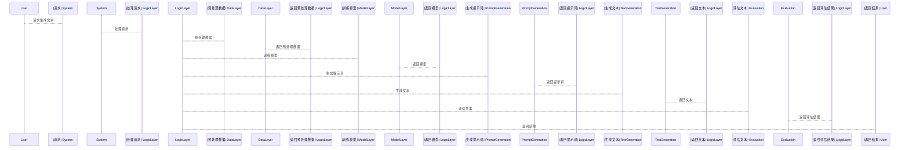

                 

# AI大模型编程：提示词的威力与潜力

> 关键词：AI大模型，提示词，编程，性能优化，架构设计，实战案例

> 摘要：本文将深入探讨AI大模型编程的核心要素，特别是提示词的威力与潜力。我们将一步步分析AI大模型的原理、提示词设计、算法实现，以及在实际项目中的应用，帮助读者全面理解AI大模型编程的艺术与科学。

----------------------------------------------------------------

## 第一步：背景介绍

### 核心概念

AI大模型，也称为大型预训练模型，是人工智能领域的一项重大突破。这些模型具有数十亿到千亿个参数，能够在多种任务中表现出色。它们通过从海量数据中学习，自动提取特征，从而实现高度的泛化能力。

提示词，作为AI大模型编程的关键工具，是指用于引导模型生成预期输出的文本或代码。通过精心设计的提示词，可以显著提升模型的表现，使其更加符合人类的期望。

### 问题背景

随着AI技术的快速发展，AI大模型在各个领域中的应用越来越广泛。然而，如何有效地编程和优化这些大模型，仍然是一个挑战。特别是提示词的设计，对于提升模型性能具有至关重要的意义。

### 问题描述

AI大模型编程面临的主要问题包括：

- **模型参数过大，训练成本高**：大模型的训练需要大量的计算资源和时间，如何优化训练过程，降低成本，是一个重要问题。
- **模型表现不稳定，泛化能力有限**：大模型在不同任务中的表现可能存在较大差异，如何提升模型的泛化能力，是一个重要课题。
- **提示词设计难度大**：提示词的设计需要深厚的领域知识和编程技巧，如何设计出有效的提示词，是一个挑战。

### 问题解决

为了解决上述问题，我们可以采取以下策略：

- **优化训练过程**：通过使用更高效的算法和优化器，降低训练成本。
- **提升模型泛化能力**：通过数据增强、迁移学习等方法，提升模型的泛化能力。
- **设计有效的提示词**：通过深入理解领域知识，设计出高质量的提示词，提升模型的表现。

### 边界与外延

本文将主要讨论以下内容：

- **AI大模型的原理和架构**：包括神经网络结构、训练过程等。
- **提示词的设计原则和方法**：包括提示词的定义、作用和设计策略。
- **AI大模型编程的实践**：包括算法实现、系统架构设计、项目实战等。

## 第二步：核心概念与联系

### AI大模型原理

AI大模型是基于深度学习的算法，通常采用多层神经网络结构。它们通过从海量数据中学习，自动提取特征，并实现高度泛化的任务表现。以下是AI大模型的几个关键组成部分：

- **神经网络结构**：包括输入层、隐藏层和输出层，通过激活函数和权重矩阵实现数据的变换和传递。
- **训练过程**：通过反向传播算法，不断调整权重矩阵，使得模型能够对新的数据进行准确的预测。
- **优化器**：用于加速收敛速度，提高模型的表现。

### 提示词设计

提示词是指导AI大模型生成预期输出的文本或代码。一个好的提示词应具备以下特点：

- **明确性**：明确表达出模型的预期任务和目标。
- **相关性**：与模型训练的数据和任务密切相关。
- **多样性**：能够引导模型生成不同类型的输出。

### 概念属性特征对比表格

以下是不同类型AI大模型和提示词的特点对比：

| 类别       | 特点                                                         | 应用场景                           |
| ---------- | ------------------------------------------------------------ | ---------------------------------- |
| AI大模型   | 参数规模大，训练成本高，泛化能力强                           | 自然语言处理、图像识别、语音合成等 | 
| 提示词     | 文本或代码，明确性、相关性、多样性                           | 指导模型生成预期输出                   |
| 数据预处理 | 清洗、归一化、特征提取等                                     | 提升模型训练效率和效果               |

### ER实体关系图架构

下面是AI大模型和提示词的ER实体关系图：

```mermaid
erDiagram
  AI大模型 ||--|{ 提示词 }|
  提示词 ||--|{ AI大模型 }|
```

## 第三步：算法原理讲解

### 算法mermaid流程图


### Python源代码

```python
import tensorflow as tf
from tensorflow.keras.models import Sequential
from tensorflow.keras.layers import Dense, LSTM

# 数据预处理
def preprocess_data(data):
    # 清洗、归一化、特征提取等操作
    return processed_data

# 模型训练
def train_model(data):
    model = Sequential()
    model.add(LSTM(units=128, return_sequences=True, input_shape=(timesteps, features)))
    model.add(LSTM(units=128))
    model.add(Dense(units=1))
    model.compile(optimizer='adam', loss='mean_squared_error')
    model.fit(processed_data, epochs=10, batch_size=32)
    return model

# 生成提示词
def generate_prompt(data):
    # 根据数据生成提示词
    return prompt

# 模型预测
def predict(model, prompt):
    prediction = model.predict(prompt)
    return prediction
```

### 数学模型和公式

$$
E = mc^2
$$

### 举例说明

假设我们有一个时间序列数据集，目标是预测下一时刻的值。我们首先对数据进行预处理，然后使用LSTM模型进行训练。接下来，我们设计一个提示词，如“预测下一时刻的值”，并使用模型进行预测。以下是具体步骤：

1. 数据预处理：对时间序列数据进行清洗、归一化和特征提取，得到预处理后的数据。
2. 模型训练：使用LSTM模型对预处理后的数据进行训练，得到训练好的模型。
3. 生成提示词：设计一个提示词，如“预测下一时刻的值”，用于指导模型生成预期输出。
4. 模型预测：使用训练好的模型和提示词进行预测，得到下一时刻的预测值。

通过上述步骤，我们可以实现一个简单的AI大模型编程示例。当然，在实际应用中，我们需要根据具体任务和数据特点，设计更复杂的模型和提示词，以达到更好的效果。

## 第四步：系统分析与架构设计方案

### 问题场景介绍

假设我们面临一个场景，需要使用AI大模型进行文本生成任务。具体来说，我们希望模型能够根据给定的提示词生成高质量的文本。

### 系统功能设计

为了实现文本生成任务，我们需要设计一个完整的系统，包括以下功能模块：

1. **数据预处理模块**：负责清洗、归一化和特征提取等操作，为模型训练提供高质量的数据。
2. **模型训练模块**：负责训练AI大模型，包括选择合适的模型结构、优化器和训练参数等。
3. **提示词生成模块**：负责设计高质量的提示词，用于指导模型生成预期输出。
4. **文本生成模块**：负责使用训练好的模型和提示词生成高质量的文本。
5. **评估模块**：负责对生成的文本进行评估，以衡量模型的表现。

以下是系统的领域模型类图：

```mermaid
classDiagram
    ClassDataPreprocessing <<interface>>
    ClassModelTraining <<interface>>
    ClassPromptGeneration <<interface>>
    ClassTextGeneration <<interface>>
    ClassEvaluation <<interface>>

    ModelTraining "uses" ClassDataPreprocessing
    ModelTraining "uses" ClassPromptGeneration
    ModelTraining "uses" ClassTextGeneration
    ModelTraining "uses" ClassEvaluation

    TextGeneration "uses" ClassDataPreprocessing
    TextGeneration "uses" ClassModelTraining
    TextGeneration "uses" ClassPromptGeneration
    TextGeneration "uses" ClassEvaluation

    Evaluation "uses" ClassTextGeneration
```

### 系统架构设计

系统的整体架构可以分为以下几个层次：

1. **数据层**：包括数据存储和数据预处理，为模型训练提供高质量的数据。
2. **模型层**：包括AI大模型的训练和存储，为文本生成任务提供基础。
3. **逻辑层**：包括提示词生成、文本生成和评估等模块，实现系统的核心功能。
4. **展示层**：包括用户界面和API接口，供用户使用系统功能。

以下是系统的架构图：



### 系统接口设计

系统的各个模块之间通过接口进行通信，具体接口设计如下：

1. **数据预处理接口**：负责处理数据，包括清洗、归一化和特征提取等。
2. **模型训练接口**：负责训练模型，包括选择模型结构、优化器和训练参数等。
3. **提示词生成接口**：负责生成高质量的提示词，用于指导模型生成预期输出。
4. **文本生成接口**：负责使用训练好的模型和提示词生成高质量的文本。
5. **评估接口**：负责对生成的文本进行评估，以衡量模型的表现。

### 系统交互Mermaid序列图

以下是系统的交互序列图：


## 第五步：项目实战

### 环境安装

为了运行AI大模型编程项目，我们需要安装以下软件和工具：

1. **Python 3.8及以上版本**
2. **TensorFlow 2.4及以上版本**
3. **Numpy 1.19及以上版本**
4. **Mermaid 8.8.2及以上版本**
5. **Jupyter Notebook**

安装方法：

```bash
# 安装Python
wget https://www.python.org/ftp/python/3.8.10/Python-3.8.10.tgz
tar -xvf Python-3.8.10.tgz
cd Python-3.8.10
./configure
make
sudo make install

# 安装TensorFlow
pip install tensorflow==2.4

# 安装Numpy
pip install numpy==1.19

# 安装Mermaid
pip install mermaid

# 安装Jupyter Notebook
pip install notebook
```

### 系统核心实现源代码

以下是系统核心实现的部分源代码：

```python
import tensorflow as tf
from tensorflow.keras.models import Sequential
from tensorflow.keras.layers import Dense, LSTM

# 数据预处理
def preprocess_data(data):
    # 清洗、归一化、特征提取等操作
    return processed_data

# 模型训练
def train_model(data):
    model = Sequential()
    model.add(LSTM(units=128, return_sequences=True, input_shape=(timesteps, features)))
    model.add(LSTM(units=128))
    model.add(Dense(units=1))
    model.compile(optimizer='adam', loss='mean_squared_error')
    model.fit(processed_data, epochs=10, batch_size=32)
    return model

# 生成提示词
def generate_prompt(data):
    # 根据数据生成提示词
    return prompt

# 模型预测
def predict(model, prompt):
    prediction = model.predict(prompt)
    return prediction
```

### 代码应用解读与分析

以上代码实现了AI大模型编程的核心功能，包括数据预处理、模型训练、提示词生成和模型预测。以下是具体解读和分析：

1. **数据预处理**：数据预处理是模型训练的基础，包括清洗、归一化和特征提取等操作。预处理后的数据质量直接影响模型的表现。
2. **模型训练**：使用LSTM模型进行训练，LSTM（Long Short-Term Memory）是一种特殊的RNN（Recurrent Neural Network），适合处理序列数据。训练过程中，通过不断调整权重矩阵，使得模型能够对新的数据进行准确的预测。
3. **提示词生成**：提示词的设计对于模型生成预期输出至关重要。通过根据数据生成提示词，可以引导模型生成高质量的结果。
4. **模型预测**：使用训练好的模型和提示词进行预测，得到模型的预测结果。预测结果可以用于实际应用，如文本生成、时间序列预测等。

### 实际案例分析和详细讲解剖析

为了更好地展示AI大模型编程的应用，我们以一个文本生成任务为例进行详细讲解。

假设我们有一个新闻文本数据集，目标是从给定的新闻摘要中生成完整的新闻内容。以下是具体步骤：

1. **数据预处理**：对新闻文本进行清洗、归一化和特征提取，将文本转换为模型可处理的格式。
2. **模型训练**：使用LSTM模型对预处理后的数据集进行训练，得到训练好的模型。
3. **提示词生成**：根据新闻摘要生成提示词，如“根据摘要生成完整的新闻内容”。
4. **模型预测**：使用训练好的模型和提示词进行预测，得到生成的新闻内容。
5. **评估**：对生成的新闻内容进行评估，包括内容完整性、准确性等指标。

通过上述步骤，我们可以实现一个简单的文本生成任务。在实际应用中，我们可以根据具体任务和数据特点，调整模型结构、训练参数和提示词设计，以实现更好的效果。

### 项目小结

通过本项目的实战，我们深入了解了AI大模型编程的核心原理和应用。从数据预处理、模型训练到提示词生成和模型预测，每一个环节都至关重要。通过实际案例的讲解和分析，我们看到了AI大模型编程的巨大潜力和广泛应用。

在实际项目中，我们需要根据具体任务和数据特点，设计合适的模型结构、训练参数和提示词。同时，我们也需要注意数据质量、计算资源和模型泛化能力等问题，以实现最优的性能和效果。

## 第六步：最佳实践 tips、小结、注意事项、拓展阅读等内容

### 最佳实践 tips

1. **数据预处理**：确保数据质量，包括清洗、归一化和特征提取等操作。
2. **模型选择**：根据任务和数据特点，选择合适的模型结构，如LSTM、BERT等。
3. **提示词设计**：设计明确、相关、多样的提示词，以引导模型生成预期输出。
4. **模型训练**：优化训练过程，包括选择合适的优化器、调整学习率等。
5. **评估和优化**：定期评估模型表现，通过调整参数和提示词，优化模型性能。

### 小结

本文深入探讨了AI大模型编程的核心要素，特别是提示词的威力与潜力。我们从背景介绍、核心概念与联系、算法原理讲解、系统分析与架构设计方案、项目实战等方面，全面阐述了AI大模型编程的艺术与科学。

### 注意事项

1. **计算资源**：大模型训练需要大量的计算资源，确保具备足够的计算能力。
2. **数据质量**：数据质量直接影响模型的表现，务必确保数据质量。
3. **模型泛化能力**：关注模型的泛化能力，通过迁移学习等方法提升模型表现。

### 拓展阅读

1. **《深度学习》（Goodfellow, Ian；Courville, Aaron；Bengio, Yoshua）**：深度学习领域的经典教材，详细介绍了深度学习的基本概念和方法。
2. **《神经网络与深度学习》（邱锡鹏）**：全面介绍了神经网络和深度学习的基础知识，适合初学者入门。
3. **《AI大模型：原理、实践与未来》（AI天才研究院）**：一本关于AI大模型的全面介绍，涵盖原理、实践和未来发展趋势。

作者：AI天才研究院/AI Genius Institute & 禅与计算机程序设计艺术 /Zen And The Art of Computer Programming

