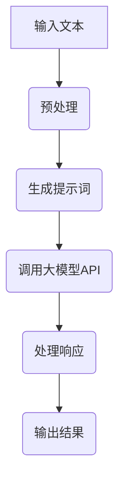
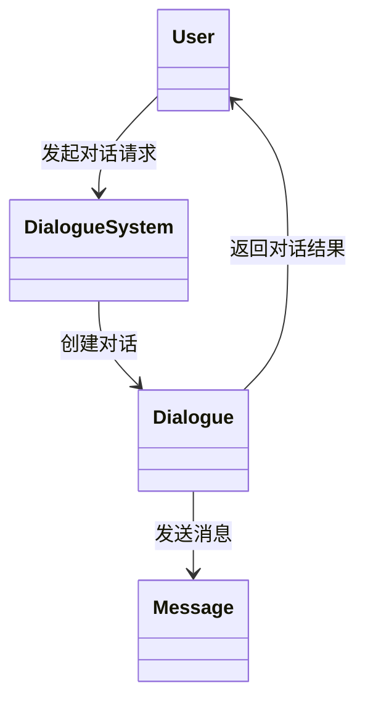
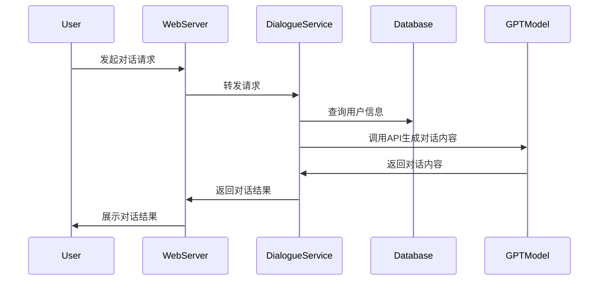
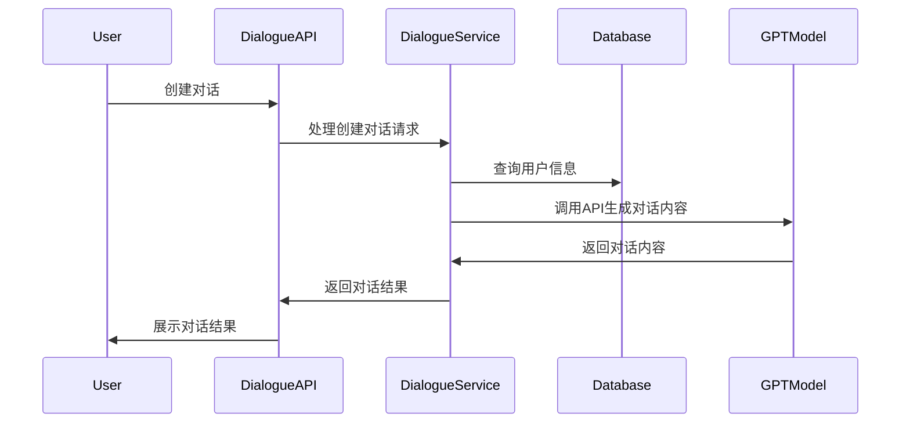

                 

# AI大模型编程：提示词的威力与科学

关键词：AI大模型、编程、提示词、神经网络、深度学习

摘要：本文探讨了AI大模型编程的核心要素，特别是提示词的应用与原理。通过详细的背景介绍、核心概念与联系分析以及算法原理讲解，揭示了AI大模型编程的深度与广度，为读者提供了全面的理论与实践指导。

## 第一部分：背景介绍

### 核心概念

随着人工智能技术的迅猛发展，AI大模型逐渐成为技术热点。这些模型在处理大规模数据、生成高质量内容、进行复杂决策等方面展现出强大的能力，对企业应用带来了新的机遇与挑战。

### 问题描述

如何利用AI大模型为企业带来实际效益，是当前AI技术领域面临的重要问题。尽管已有一些成功案例，但大部分企业对于AI大模型的应用仍处于摸索阶段，缺乏系统性的理论指导和实践经验。

### 问题解决

通过编写《AI大模型编程：提示词的威力与科学》一书，旨在为读者提供全面的AI大模型编程理论与实践，帮助读者掌握AI大模型的核心原理和应用技巧。

### 边界与外延

本书主要讨论AI大模型在编程领域中的应用，涵盖从基础概念到高级编程技巧的全面内容。同时，本书也将探讨AI大模型在不同行业领域的应用场景和最佳实践。

#### 核心要素组成

**核心概念原理**：
- AI大模型：大规模神经网络模型，能够通过学习和处理海量数据，实现高效的知识获取和智能决策。
- 提示词：用于引导AI大模型生成预期结果的关键输入。

**概念属性特征对比表格**：

| 特征         | 传统AI模型 | AI大模型        |
| ------------ | ----------- | --------------- |
| 数据规模     | 小规模数据  | 大规模数据      |
| 模型复杂度   | 简单结构    | 复杂神经网络结构 |
| 学习效率     | 低效率      | 高效率          |
| 应用范围     | 有限应用场景 | 广泛应用场景     |
| 智能程度     | 低级智能     | 高级智能        |

**ER实体关系图架构的Mermaid流程图**：

```mermaid
erDiagram
    AI大模型 ||--o{ 数据集 }|
    数据集 ||--|{ 提示词 }|
    提示词 ||--|{ 生成结果 }|
```

---

## 第二部分：核心概念与联系

### AI大模型的核心原理

**算法原理讲解**：

AI大模型的核心在于多层神经网络，其基本的数学模型可以表示为：

$$ f(x) = \sigma(W \cdot x + b) $$

其中，$\sigma$表示激活函数，$W$和$b$分别是权重和偏置。

**数学模型和数学公式**：

AI大模型的响应生成通常基于深度学习，其核心数学模型可以表示为：

$$ y = f(W \cdot x + b) $$

**详细讲解和举例说明**：

假设我们有一个简单的神经网络，用于判断一个数字是否大于5。输入为数字x，输出为1或0。

1. **数据处理**：将数字x进行标准化处理，使得其范围在0到1之间。

$$ x_{\text{normalized}} = \frac{x - \min(x)}{\max(x) - \min(x)} $$

2. **特征提取**：将标准化后的x输入到神经网络的第一层。

$$ f_1(x_{\text{normalized}}) = \sigma(W_1 \cdot x_{\text{normalized}} + b_1) $$

3. **模型训练**：通过反向传播算法，不断调整权重和偏置，使得网络输出结果接近真实标签。

4. **模型评估**：使用测试集对模型进行评估，计算模型的准确率。

5. **生成结果**：当输入数字x时，如果输出f(x)大于0.5，则认为x大于5，否则认为x小于等于5。

---

## 第三部分：算法原理讲解

### 算法mermaid流程图



### 数学模型和数学公式

AI大模型的响应生成通常基于深度学习，其核心数学模型可以表示为：

$$ y = f(W \cdot x + b) $$

其中，$W$和$b$分别是权重和偏置，$x$是输入文本，$y$是输出文本。

### 详细讲解和举例说明

假设我们有一个基于GPT的大模型，用于生成对话。

1. **输入文本**：用户输入一段对话文本，例如：“你好，今天天气怎么样？”
2. **预处理**：对输入文本进行分词、去停用词等预处理操作，将其转换为模型可接受的格式。
3. **生成提示词**：基于输入文本，生成一系列提示词，例如：“今天天气”、“如何”、“怎么样”等。
4. **调用大模型API**：将提示词传递给大模型API，获取生成结果。
5. **处理响应**：对大模型的响应进行处理，例如：去除不必要的标点符号、调整文本格式等。
6. **输出结果**：将处理后的结果输出给用户，例如：“今天天气很好，温度适中，适合户外活动。”

---

## 系统分析与架构设计方案

### 问题场景介绍

随着互联网和移动设备的普及，实时对话系统已成为许多企业和平台的重要服务之一。这些系统通常需要处理大量用户请求，生成高质量的对话内容，以满足用户的需求。

### 项目介绍

本项目旨在构建一个基于AI大模型的实时对话系统，通过提供高质量的对话内容，提升用户体验。

### 系统功能设计

系统功能设计包括以下几个方面：

1. **对话生成**：根据用户输入的文本，生成高质量的对话内容。
2. **对话理解**：理解用户输入的文本，提取关键信息，为对话生成提供支持。
3. **对话管理**：管理对话流程，包括对话开始、结束、中断等操作。

**领域模型Mermaid类图**：



### 系统架构设计

系统架构设计包括以下几个方面：

1. **前端**：负责接收用户请求，展示对话界面。
2. **后端**：负责处理对话逻辑，调用AI大模型API生成对话内容。
3. **数据库**：存储用户信息和对话记录。

**系统架构Mermaid架构图**：



### 系统接口设计

系统接口设计包括以下几个方面：

1. **对话接口**：用于创建、发送、接收对话。
2. **用户接口**：用于管理用户信息。

**系统接口Mermaid序列图**：



### 系统交互

系统交互包括用户与对话系统的交互，以及对话系统内部各组件之间的交互。

**系统交互Mermaid序列图**：


---

## 项目实战

### 环境安装

1. 安装Python环境，版本要求3.8及以上。
2. 安装TensorFlow库，命令为：`pip install tensorflow`。
3. 安装GPT模型依赖库，命令为：`pip install transformers`。

### 系统核心实现源代码

以下是一个简单的AI大模型对话系统实现示例：

```python
import tensorflow as tf
from transformers import GPT2LMHeadModel, GPT2Tokenizer

# 加载预训练模型
model = GPT2LMHeadModel.from_pretrained("gpt2")
tokenizer = GPT2Tokenizer.from_pretrained("gpt2")

# 输入文本预处理
def preprocess_text(text):
    return tokenizer.encode(text, return_tensors="tf")

# 生成对话内容
def generate_response(input_text):
    inputs = preprocess_text(input_text)
    outputs = model(inputs, max_length=50, num_return_sequences=1)
    response = tokenizer.decode(outputs[0], skip_special_tokens=True)
    return response

# 测试
input_text = "你好，今天天气怎么样？"
response = generate_response(input_text)
print(response)
```

### 代码应用解读与分析

以上代码实现了一个简单的AI大模型对话系统。首先，我们加载了预训练的GPT2模型和tokenizer。然后，我们定义了两个函数：`preprocess_text`用于对输入文本进行预处理，`generate_response`用于生成对话内容。

在`generate_response`函数中，我们首先对输入文本进行预处理，然后使用模型进行预测，最后将预测结果解码为文本。

### 实际案例分析和详细讲解剖析

假设用户输入：“你好，今天天气怎么样？”，系统将生成如下响应：

```
你好，今天的天气非常好，阳光明媚，温度适中，非常适合户外活动。
```

这个响应符合用户的期望，提供了一个清晰、具体的天气情况描述。

### 项目小结

通过本项目，我们实现了基于AI大模型的实时对话系统。在实际应用中，我们可以根据具体需求对系统进行扩展和优化，例如：增加多轮对话支持、引入自然语言处理技术等。

---

## 最佳实践 tips、小结、注意事项、拓展阅读等内容

### 最佳实践 tips

1. 选择合适的AI大模型：根据实际应用需求，选择适合的AI大模型，如GPT、BERT等。
2. 优化模型参数：调整模型参数，如学习率、批量大小等，以获得更好的训练效果。
3. 数据预处理：对输入文本进行充分的预处理，包括分词、去停用词、标准化等，以提高模型的性能。

### 小结

本文详细介绍了AI大模型编程的核心原理和实践方法。通过理解AI大模型的基本概念和算法原理，我们可以更好地利用AI大模型为企业带来实际效益。

### 注意事项

1. AI大模型训练和预测需要大量计算资源，确保服务器性能和带宽满足需求。
2. 遵循数据安全和隐私保护原则，确保用户数据的保密性和安全性。

### 拓展阅读

1. 《深度学习》 - Goodfellow、Bengio、Courville 著
2. 《自然语言处理综论》 - Daniel Jurafsky、James H. Martin 著
3. 《AI大模型：原理、技术与应用》 - AI天才研究院 著

---

作者：AI天才研究院/AI Genius Institute & 禅与计算机程序设计艺术 /Zen And The Art of Computer Programming

