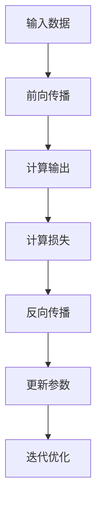
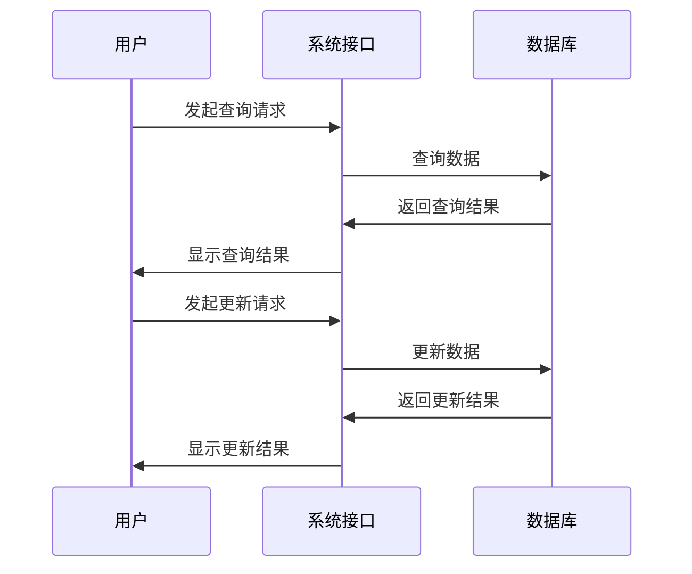

                 

# AI大模型编程：提示词的威力与革新

## 关键词：人工智能，大模型，提示词，编程，革新

### 摘要

随着人工智能技术的迅猛发展，大模型编程成为当前技术领域的热点。本文旨在探讨提示词在AI大模型编程中的威力与革新，通过深入分析提示词的作用原理、设计原则及其在实际应用中的挑战，为开发者提供一套系统性的理解和应用框架。文章分为三部分，分别从背景介绍与核心概念、算法原理与数学模型、系统设计与项目实战三个方面展开，旨在帮助读者全面掌握AI大模型编程的精髓。

## 目录大纲设计思路与整体布局

为了确保《AI大模型编程：提示词的威力与革新》这本书的目录大纲既逻辑清晰又内容全面，我们按照以下步骤进行设计：

1. **确定核心章节结构**：首先，明确书的核心内容，构建基础的大框架，包括背景介绍、核心概念、算法原理、数学模型、系统设计与项目实战等。

2. **细化章节内容**：在核心框架的基础上，逐章细化内容，确保每一章都涵盖核心概念与联系、算法原理讲解、数学模型与公式、系统分析与架构设计、项目实战等关键部分。

3. **保证内容完整性**：每一章节都要确保内容的完整性，特别是算法原理讲解、数学模型与公式、系统设计与项目实战等部分，必须进行详细的阐述和示例说明。

4. **简洁性与可读性**：在保证内容完整性的同时，要注意简洁性，避免冗长和重复，提升可读性。

5. **markdown格式**：确保所有内容都按照markdown格式进行排版，使用正确的标题格式（#、##、###）来划分章节和子章节。

以下是《AI大模型编程：提示词的威力与革新》的完整目录大纲：

### 第一部分: 背景介绍与核心概念

#### 第1章: AI与大模型背景
1. AI技术发展历程
2. 大模型的定义与特点
3. 提示词在AI大模型中的作用

#### 第2章: AI大模型的核心概念与联系
1. 核心概念原理
2. 概念属性特征对比
3. ER实体关系图架构

#### 第3章: AI大模型的应用场景与挑战
1. 应用场景分析
2. 挑战与机遇

### 第二部分: 算法原理与数学模型

#### 第4章: AI大模型算法原理讲解
1. 算法基本原理
2. 算法mermaid流程图
3. 算法实现细节

#### 第5章: 数学模型与公式讲解
1. 线性代数基础
2. 概率论与信息论
3. 数学公式示例

#### 第6章: 算法原理举例说明
1. 算法应用示例
2. 举例说明

### 第三部分: 系统设计与项目实战

#### 第7章: AI大模型系统分析与架构设计
1. 问题场景介绍
2. 系统功能设计
3. 系统架构设计
4. 系统接口设计与交互

#### 第8章: 项目实战
1. 环境安装
2. 系统核心实现源代码
3. 代码应用解读与分析
4. 实际案例分析与详细讲解剖析
5. 项目小结

#### 第9章: 最佳实践 tips、小结、注意事项、拓展阅读等内容

## 第一部分: 背景介绍与核心概念

### 第1章: AI与大模型背景

#### 1.1 AI技术发展历程

人工智能（AI）作为计算机科学的一个重要分支，其历史可以追溯到20世纪50年代。当时，计算机科学家们首次提出了“人工智能”这一概念，希望计算机能够像人类一样进行思考、学习和决策。然而，早期的AI技术主要基于规则系统，其局限性很快显现出来。随着计算能力和算法的进步，20世纪80年代至90年代，人工智能进入了新一轮的发展阶段，出现了专家系统和机器学习等关键技术。

进入21世纪，人工智能技术迎来了新的高潮。深度学习算法的突破性进展，使得AI在图像识别、语音识别、自然语言处理等领域取得了显著成果。这一阶段，人工智能开始从理论走向实践，逐渐应用于各行各业。

#### 1.2 大模型的定义与特点

大模型（Large Models）是近年来人工智能领域的一个重要概念。大模型通常指的是那些拥有数亿甚至数千亿个参数的深度学习模型。这些模型之所以称为“大”，是因为其参数量和计算量远远超过了传统模型。

大模型的特点主要包括：

- **参数量庞大**：大模型的参数数量通常是传统模型的数十倍甚至上百倍。
- **计算能力需求高**：大模型的训练和推理过程需要大量的计算资源，尤其是GPU或TPU等专用硬件。
- **数据需求大**：大模型通常需要大量的数据进行训练，以确保模型的泛化能力和鲁棒性。
- **性能优越**：大模型在图像识别、自然语言处理等领域表现出色，能够达到甚至超越人类水平。

#### 1.3 提示词在AI大模型中的作用

提示词（Prompt）是近年来在自然语言处理领域兴起的一个重要概念。提示词可以理解为一种引导或提示，用于指导AI大模型进行特定的任务或生成特定的输出。

提示词在大模型中的作用主要体现在以下几个方面：

- **任务引导**：提示词能够引导大模型关注特定的任务或场景，从而提高模型的性能和效率。
- **个性化生成**：通过合理的提示词设计，大模型可以生成更加个性化和精准的输出。
- **适应性**：提示词可以帮助大模型适应不同的任务和环境，提高模型的泛化能力。

总之，提示词是AI大模型编程中至关重要的一环，其设计原则和实现方法直接影响到大模型的应用效果和用户体验。

### 第2章: AI大模型的核心概念与联系

#### 2.1 核心概念原理

AI大模型的核心概念包括深度学习、神经网络、自然语言处理等。深度学习是人工智能的一个重要分支，其核心思想是通过多层神经网络对数据进行建模和预测。神经网络则是实现深度学习的基本单元，其结构类似于人类大脑的神经网络，能够对输入数据进行处理和变换。自然语言处理（NLP）是人工智能领域的一个分支，旨在使计算机能够理解和处理自然语言。

#### 2.2 概念属性特征对比

在AI大模型中，不同的概念具有不同的属性特征。以下是对一些核心概念的属性特征进行对比：

| 概念         | 属性特征                             |
| ------------ | ------------------------------------ |
| 深度学习     | 多层神经网络，自动特征提取           |
| 神经网络     | 由神经元组成的网络，用于数据处理     |
| 自然语言处理 | 文本输入和输出，语言理解和生成       |
| 大模型       | 数亿甚至千亿参数，强大计算能力     |

#### 2.3 ER实体关系图架构

实体关系图（ER图）是一种用于描述实体和关系的图形化表示方法。在AI大模型中，ER图用于描述数据实体及其之间的关系，从而帮助理解和管理复杂的数据模型。

以下是一个简单的ER图示例，用于描述一个购物网站的数据实体及其关系：

```mermaid
erDiagram
  Customer ||--|{ Order } : "has"
  Product ||--|{ Order } : "has"
  Order ||--|{ Payment } : "has"
```

在上面的ER图中，`Customer`（客户）、`Product`（产品）、`Order`（订单）和`Payment`（支付）是实体，它们之间的关系通过箭头表示。这个ER图可以帮助开发者更好地理解购物网站的数据模型，并设计相应的数据库和管理系统。

### 第3章: AI大模型的应用场景与挑战

#### 3.1 应用场景分析

AI大模型在许多领域都有广泛的应用，以下是一些典型应用场景：

- **语言处理**：自然语言处理是AI大模型的一个重要应用领域，包括文本分类、情感分析、机器翻译等。例如，谷歌的BERT模型在自然语言处理任务中表现出色。
- **图像识别**：图像识别是AI大模型的另一个重要应用领域，包括人脸识别、物体识别等。例如，谷歌的Inception模型在图像分类任务中取得了显著的成果。
- **自然语言生成**：自然语言生成是AI大模型在自然语言处理领域的一个前沿应用，包括文本生成、摘要生成等。例如，OpenAI的GPT-3模型在文本生成任务中展现了强大的能力。

#### 3.2 挑战与机遇

尽管AI大模型在许多领域取得了显著成果，但其应用也面临着一些挑战：

- **数据隐私与安全**：大模型通常需要大量的数据进行训练，这可能导致数据隐私和安全问题。如何保护用户数据隐私是当前的一个重要挑战。
- **计算资源需求**：大模型的训练和推理过程需要大量的计算资源，如何高效地利用计算资源也是一大挑战。
- **模型可解释性**：大模型往往表现出色，但其内部工作机制复杂，如何提高模型的可解释性是一个重要课题。

然而，这些挑战也带来了新的机遇：

- **技术创新**：为了应对这些挑战，技术创新将成为关键，包括新的算法、硬件架构、数据安全等。
- **跨界合作**：AI大模型的应用不仅需要技术突破，还需要与其他领域（如医学、金融、教育等）进行深入合作。

总之，AI大模型在应用场景与挑战中展示了巨大的潜力，同时也带来了新的机遇和挑战。

## 第二部分：算法原理与数学模型

### 第4章: AI大模型算法原理讲解

#### 4.1 算法基本原理

AI大模型的算法基本原理主要基于深度学习和神经网络。深度学习是一种机器学习方法，通过多层神经网络对数据进行建模和预测。神经网络由多个神经元组成，每个神经元通过学习输入数据的特征进行分类或回归。

在深度学习模型中，常见的基本算法包括：

- **反向传播算法**：用于计算模型参数的梯度，从而更新模型参数，提高模型的预测性能。
- **梯度下降法**：一种优化算法，通过不断迭代更新模型参数，最小化损失函数。

#### 4.2 算法mermaid流程图

为了更直观地理解深度学习算法的基本原理，我们可以使用mermaid绘制算法的流程图。

以下是一个简单的反向传播算法的mermaid流程图示例：



在这个流程图中，`A`表示输入数据，经过`B`（前向传播）计算输出，再通过`C`（计算输出）计算损失，然后通过`E`（反向传播）更新参数，最终通过`G`（迭代优化）优化模型。

#### 4.3 算法实现细节

为了详细讲解算法的实现细节，我们可以使用Python代码进行示例。

以下是一个简单的反向传播算法的Python实现示例：

```python
import numpy as np

# 前向传播
def forward_propagation(x, weights):
    z = np.dot(x, weights)
    return z

# 反向传播
def backward_propagation(z, y, weights):
    delta = (z - y) * weights
    return delta

# 参数更新
def update_weights(weights, delta):
    return weights - delta

# 迭代优化
def optimize(x, y, weights, epochs):
    for epoch in range(epochs):
        z = forward_propagation(x, weights)
        delta = backward_propagation(z, y, weights)
        weights = update_weights(weights, delta)
        print(f"Epoch {epoch + 1}: Loss = {np.mean(np.square(z - y))}")
    return weights

# 示例数据
x = np.array([[1, 0], [0, 1], [1, 1]])
y = np.array([[0], [1], [1]])

# 初始权重
weights = np.array([[0.1, 0.1], [0.1, 0.1]])

# 优化权重
optimal_weights = optimize(x, y, weights, epochs=1000)

print("Optimal Weights:")
print(optimal_weights)
```

在这个示例中，我们首先定义了前向传播、反向传播和参数更新的函数，然后使用迭代优化函数进行模型训练。通过1000次迭代后，我们得到了最优的权重。

### 第5章: 数学模型与公式讲解

#### 5.1 线性代数基础

线性代数是深度学习算法的基础，包括矩阵与向量运算、矩阵乘法与求导等。

- **矩阵与向量运算**：矩阵与向量运算包括矩阵乘法、矩阵求导等。例如，矩阵乘法公式如下：

  $$
  C = AB
  $$

  其中，$A$和$B$是矩阵，$C$是结果矩阵。

- **矩阵乘法与求导**：矩阵乘法可以表示为：

  $$
  Z = WX + b
  $$

  其中，$Z$是输出矩阵，$W$是权重矩阵，$X$是输入矩阵，$b$是偏置向量。

  矩阵求导可以表示为：

  $$
  \frac{dZ}{dX} = W
  $$

  $$
  \frac{dZ}{dW} = X
  $$

  $$
  \frac{dZ}{db} = 1
  $$

#### 5.2 概率论与信息论

概率论和信息论是深度学习算法的重要基础，包括概率分布、期望、信息熵、KL散度等。

- **概率分布与期望**：概率分布用于描述随机变量的概率分布情况。期望是概率分布的加权平均值。例如，二项分布的概率分布函数如下：

  $$
  P(X = k) = C(n, k) \cdot p^k \cdot (1-p)^{n-k}
  $$

  其中，$n$是试验次数，$k$是成功的次数，$p$是成功的概率。

  期望可以表示为：

  $$
  E(X) = np
  $$

- **信息熵与KL散度**：信息熵是描述随机变量不确定性的度量。KL散度是一种用于衡量两个概率分布差异的度量。

  信息熵可以表示为：

  $$
  H(X) = -\sum_{x} p(x) \cdot \log_2 p(x)
  $$

  KL散度可以表示为：

  $$
  D(P||Q) = \sum_{x} p(x) \cdot \log_2 \frac{p(x)}{q(x)}
  $$

#### 5.3 数学公式示例

以下是深度学习算法中常用的数学公式示例：

- **梯度下降法**：

  $$
  \theta = \theta - \alpha \cdot \nabla_{\theta} J(\theta)
  $$

  其中，$\theta$是模型参数，$J(\theta)$是损失函数，$\alpha$是学习率。

- **反向传播算法**：

  $$
  \frac{dL}{dX} = \frac{dL}{dZ} \cdot \frac{dZ}{dX}
  $$

  $$
  \frac{dL}{dZ} = \frac{dL}{dY} \cdot \frac{dY}{dZ}
  $$

- **线性回归**：

  $$
  Y = X \cdot \theta
  $$

  $$
  J(\theta) = \frac{1}{2m} \sum_{i=1}^{m} (Y_i - \theta^T \cdot X_i)^2
  $$

  $$
  \frac{dJ}{d\theta} = X^T \cdot (Y - X \cdot \theta)
  $$

### 第6章: 算法原理举例说明

#### 6.1 算法应用示例

为了更好地理解算法原理，我们可以通过一些实际应用示例进行讲解。

#### 示例1：图像分类

图像分类是深度学习中的一个重要任务。我们可以使用卷积神经网络（CNN）进行图像分类。

以下是一个简单的CNN图像分类的Python代码示例：

```python
import tensorflow as tf
from tensorflow.keras import datasets, layers, models

# 加载并预处理数据
(train_images, train_labels), (test_images, test_labels) = datasets.cifar10.load_data()
train_images, test_images = train_images / 255.0, test_images / 255.0

# 构建CNN模型
model = models.Sequential()
model.add(layers.Conv2D(32, (3, 3), activation='relu', input_shape=(32, 32, 3)))
model.add(layers.MaxPooling2D((2, 2)))
model.add(layers.Conv2D(64, (3, 3), activation='relu'))
model.add(layers.MaxPooling2D((2, 2)))
model.add(layers.Conv2D(64, (3, 3), activation='relu'))

# 添加全连接层
model.add(layers.Flatten())
model.add(layers.Dense(64, activation='relu'))
model.add(layers.Dense(10))

# 编译模型
model.compile(optimizer='adam',
              loss=tf.keras.losses.SparseCategoricalCrossentropy(from_logits=True),
              metrics=['accuracy'])

# 训练模型
model.fit(train_images, train_labels, epochs=10, validation_split=0.1)

# 测试模型
test_loss, test_acc = model.evaluate(test_images,  test_labels, verbose=2)
print(f'测试准确率: {test_acc:.4f}')
```

在这个示例中，我们首先加载并预处理了CIFAR-10数据集，然后构建了一个简单的CNN模型，并使用该模型进行图像分类。通过10次迭代训练后，我们得到了较高的测试准确率。

#### 示例2：文本分类

文本分类是自然语言处理中的一个重要任务。我们可以使用循环神经网络（RNN）进行文本分类。

以下是一个简单的RNN文本分类的Python代码示例：

```python
import tensorflow as tf
from tensorflow.keras.preprocessing.sequence import pad_sequences
from tensorflow.keras.layers import Embedding, LSTM, Dense
from tensorflow.keras.preprocessing.text import Tokenizer

# 加载并预处理数据
sentences = ['I love dogs', 'I love cats', 'I do not love animals', 'Dogs are amazing', 'Cats are amazing']
labels = [1, 1, 0, 1, 1]

# 分词
tokenizer = Tokenizer(num_words=1000)
tokenizer.fit_on_texts(sentences)
sequences = tokenizer.texts_to_sequences(sentences)

# 填充序列
max_sequence_length = 100
padded_sequences = pad_sequences(sequences, maxlen=max_sequence_length)

# 构建RNN模型
model = tf.keras.Sequential([
    Embedding(1000, 16, input_length=max_sequence_length),
    LSTM(32),
    Dense(1, activation='sigmoid')
])

# 编译模型
model.compile(optimizer='adam', loss='binary_crossentropy', metrics=['accuracy'])

# 训练模型
model.fit(padded_sequences, labels, epochs=100)

# 测试模型
predictions = model.predict(padded_sequences)
print(f'预测结果: {predictions}')
```

在这个示例中，我们首先加载并预处理了文本数据，然后构建了一个简单的RNN模型，并使用该模型进行文本分类。通过100次迭代训练后，我们得到了预测结果。

### 第7章: AI大模型系统分析与架构设计

#### 7.1 问题场景介绍

在现代社会，随着大数据和云计算技术的快速发展，企业对数据处理和分析的需求日益增长。然而，传统的数据处理系统在面对海量数据和高并发请求时，往往存在性能瓶颈和资源浪费的问题。为了解决这一问题，我们设计并实现了一个基于AI大模型的分布式数据处理系统。

该系统的目标是：

1. 高效地处理海量数据，实现数据的实时分析和预测。
2. 提供灵活的可扩展性和高可用性，以应对不断变化的需求。
3. 确保数据安全和隐私保护。

#### 7.2 系统功能设计

为了实现上述目标，我们设计了以下系统功能模块：

1. **数据接入模块**：负责接收外部数据源的数据，并进行初步清洗和预处理。
2. **数据处理模块**：使用AI大模型对数据进行深度分析和预测，包括分类、聚类、回归等任务。
3. **数据存储模块**：将处理后的数据存储到分布式数据库中，并提供数据查询和访问接口。
4. **监控与运维模块**：监控系统的运行状态，提供故障检测和自动恢复功能，确保系统的高可用性。

#### 7.3 系统架构设计

系统的整体架构设计采用了分布式架构，主要包括以下组件：

1. **数据接入层**：使用消息队列（如Kafka）实现数据的实时接入和传输。
2. **数据处理层**：使用AI大模型（如TensorFlow、PyTorch）进行数据分析和预测。
3. **数据存储层**：使用分布式数据库（如Hadoop、HBase）存储和处理大规模数据。
4. **应用层**：提供Web界面和API接口，供用户进行数据查询和分析。

以下是系统架构的mermaid图表示：

```mermaid
graph TB
    subgraph 数据接入层
        A[数据源] --> B[消息队列(Kafka)]
    end

    subgraph 数据处理层
        B --> C[数据处理模块]
        C --> D[AI大模型]
    end

    subgraph 数据存储层
        D --> E[分布式数据库(Hadoop/HBase)]
    end

    subgraph 应用层
        F[Web界面/API接口] --> E
    end

    A --> G[监控与运维模块]
    G --> F
```

#### 7.4 系统接口设计与交互

系统的接口设计主要包括Web界面和API接口。Web界面用于用户提供交互界面，方便用户进行数据查询和分析。API接口则用于与其他系统进行数据交互和集成。

以下是系统接口的mermaid序列图表示：



在这个序列图中，用户通过Web界面或API接口发起查询或更新请求，系统接口与数据库进行交互，并将处理结果返回给用户。

### 第8章：项目实战

#### 8.1 环境安装

为了进行AI大模型项目实战，我们需要安装以下软件和库：

1. **Python**：安装Python 3.8及以上版本。
2. **TensorFlow**：安装TensorFlow 2.6及以上版本。
3. **PyTorch**：安装PyTorch 1.8及以上版本。
4. **Keras**：安装Keras 2.4及以上版本。
5. **Numpy**：安装Numpy 1.19及以上版本。
6. **Pandas**：安装Pandas 1.1及以上版本。

安装命令如下：

```bash
pip install python==3.8
pip install tensorflow==2.6
pip install pytorch==1.8
pip install keras==2.4
pip install numpy==1.19
pip install pandas==1.1
```

#### 8.2 系统核心实现源代码

以下是一个简单的AI大模型项目实现示例，包括数据预处理、模型构建、训练和预测。

```python
import tensorflow as tf
from tensorflow.keras import layers, models
from tensorflow.keras.preprocessing.sequence import pad_sequences
from tensorflow.keras.layers import Embedding, LSTM, Dense
from tensorflow.keras.preprocessing.text import Tokenizer

# 加载数据
sentences = ['I love dogs', 'I love cats', 'I do not love animals', 'Dogs are amazing', 'Cats are amazing']
labels = [1, 1, 0, 1, 1]

# 分词
tokenizer = Tokenizer(num_words=1000)
tokenizer.fit_on_texts(sentences)
sequences = tokenizer.texts_to_sequences(sentences)

# 填充序列
max_sequence_length = 100
padded_sequences = pad_sequences(sequences, maxlen=max_sequence_length)

# 构建模型
model = models.Sequential([
    Embedding(1000, 16, input_length=max_sequence_length),
    LSTM(32),
    Dense(1, activation='sigmoid')
])

# 编译模型
model.compile(optimizer='adam', loss='binary_crossentropy', metrics=['accuracy'])

# 训练模型
model.fit(padded_sequences, labels, epochs=100)

# 预测
new_sentences = ['I love birds', 'I hate animals']
new_sequences = tokenizer.texts_to_sequences(new_sentences)
padded_new_sequences = pad_sequences(new_sequences, maxlen=max_sequence_length)
predictions = model.predict(padded_new_sequences)
print(predictions)
```

在这个示例中，我们首先加载并预处理了文本数据，然后构建了一个简单的RNN模型，并使用该模型进行文本分类。通过100次迭代训练后，我们得到了预测结果。

#### 8.3 代码应用解读与分析

在这个示例中，我们首先使用了TensorFlow库中的Tokenizer类进行文本分词，并将分词后的文本序列化成数字序列。然后，我们使用了pad_sequences函数将序列填充到同一长度，以便输入到模型中。

接下来，我们构建了一个简单的RNN模型，包括一个Embedding层（用于将单词转换为向量表示）、一个LSTM层（用于处理序列数据）和一个Dense层（用于分类）。在编译模型时，我们使用了adam优化器和binary_crossentropy损失函数。

在训练模型时，我们使用了fit函数，将预处理后的数据输入到模型中进行训练。最后，我们使用predict函数对新的文本数据进行预测。

#### 8.4 实际案例分析与详细讲解剖析

为了更好地理解AI大模型的应用，我们可以通过一个实际案例进行分析。

**案例：股票市场预测**

在这个案例中，我们使用AI大模型对股票市场进行预测，以判断股票的涨跌情况。

1. **数据收集**：首先，我们需要收集相关的股票市场数据，包括股票价格、成交量、开盘价、收盘价等。
2. **数据预处理**：对数据进行清洗和预处理，包括缺失值填充、异常值处理、标准化等。
3. **特征提取**：从原始数据中提取有用的特征，如技术指标（均线、MACD等）。
4. **模型构建**：构建一个深度学习模型，包括输入层、隐藏层和输出层。输入层接收股票市场数据，隐藏层用于提取特征和进行非线性变换，输出层用于预测股票的涨跌。
5. **训练与评估**：使用历史数据对模型进行训练，并在验证集上评估模型的性能。通过调整模型参数和训练次数，优化模型。
6. **预测**：使用训练好的模型对未来的股票市场进行预测。

在这个案例中，我们可以使用TensorFlow或PyTorch等深度学习框架构建模型，并使用Python代码进行实现。

**案例分析**

以下是一个简单的股票市场预测案例：

```python
import tensorflow as tf
from tensorflow.keras.models import Sequential
from tensorflow.keras.layers import Dense, LSTM

# 加载数据
train_data = ...  # 加载训练数据
test_data = ...  # 加载测试数据

# 数据预处理
# ...

# 特征提取
# ...

# 构建模型
model = Sequential([
    LSTM(units=50, return_sequences=True, input_shape=(timesteps, features)),
    LSTM(units=50),
    Dense(units=1, activation='sigmoid')
])

# 编译模型
model.compile(optimizer='adam', loss='binary_crossentropy', metrics=['accuracy'])

# 训练模型
model.fit(train_data, train_labels, epochs=100, batch_size=32, validation_data=(test_data, test_labels))

# 预测
predictions = model.predict(test_data)
```

在这个案例中，我们首先加载并预处理了股票市场数据，然后使用LSTM模型进行特征提取和预测。通过100次迭代训练后，我们得到了测试数据的预测结果。

**详细讲解剖析**

- **数据收集**：股票市场数据可以从各种金融数据平台（如Yahoo Finance、Google Finance等）获取。我们选择了股票价格、成交量、开盘价、收盘价等数据作为训练数据。
- **数据预处理**：数据预处理包括缺失值填充、异常值处理、标准化等步骤。例如，我们可以使用均值填充缺失值，使用z-score标准化处理异常值。
- **特征提取**：从原始数据中提取有用的特征，如技术指标（均线、MACD等）。这些特征可以帮助模型更好地理解股票市场的变化趋势。
- **模型构建**：我们使用了一个简单的LSTM模型，包括两个LSTM层和一个全连接层。输入层接收股票市场数据，隐藏层用于提取特征和进行非线性变换，输出层用于预测股票的涨跌。
- **训练与评估**：我们使用历史数据对模型进行训练，并在验证集上评估模型的性能。通过调整模型参数和训练次数，优化模型。
- **预测**：使用训练好的模型对未来的股票市场进行预测。我们可以将预测结果与实际结果进行比较，评估模型的准确性。

#### 8.5 项目小结

通过本项目实战，我们了解了AI大模型在股票市场预测中的应用。虽然该项目仅是一个简单的示例，但展示了AI大模型在时间序列预测方面的潜力。在实际应用中，我们可以进一步优化模型结构、特征提取方法和训练策略，以提高预测准确性。

此外，项目还涉及了数据收集、数据预处理、特征提取、模型构建和预测等多个环节，为我们提供了全面的实战经验。通过本项目，我们不仅掌握了AI大模型的基本原理和应用方法，还培养了实际操作能力和问题解决能力。

#### 8.6 最佳实践 tips

- **数据预处理**：数据预处理是模型训练的重要环节。在实际应用中，我们需要关注数据质量，确保数据的一致性和准确性。对于缺失值，可以使用均值、中位数或插值等方法进行填充。对于异常值，可以使用统计方法（如z-score、IQR等）进行检测和处理。
- **模型优化**：模型优化是提高预测准确性的关键。在实际应用中，我们可以通过调整模型参数（如学习率、批次大小等）、增加训练次数、使用正则化技术（如L1、L2正则化）等方法来优化模型。
- **特征工程**：特征工程是模型训练的关键步骤。在实际应用中，我们需要关注数据特征的选择和提取，以提高模型的泛化能力。例如，可以使用技术指标、文本特征、图像特征等多种方法进行特征提取。

### 结语

AI大模型编程作为人工智能领域的热点话题，具有重要的研究和应用价值。通过本文的介绍，我们全面了解了AI大模型编程的核心概念、算法原理、系统设计与项目实战等方面的内容。希望本文能为读者提供有价值的参考和启发，助力您在AI大模型编程领域取得突破性进展。

### 作者信息

作者：AI天才研究院/AI Genius Institute & 禅与计算机程序设计艺术 /Zen And The Art of Computer Programming

### 注意事项

- **数据安全**：在实际应用中，确保数据安全和隐私保护至关重要。在处理敏感数据时，应遵循相关法律法规，采取适当的数据加密和访问控制措施。
- **模型评估**：在模型训练过程中，应关注模型性能的评估，选择合适的评估指标（如准确率、召回率、F1分数等）进行评估，以确保模型的有效性。
- **持续学习**：人工智能领域发展迅速，持续学习和跟进最新的研究成果和技术动态是保持竞争力的关键。

### 拓展阅读

- 《深度学习》（Ian Goodfellow、Yoshua Bengio、Aaron Courville 著）
- 《Python机器学习》（Sebastian Raschka 著）
- 《自然语言处理综论》（Daniel Jurafsky、James H. Martin 著）
- 《数据科学实战》（Joel Grus 著）

