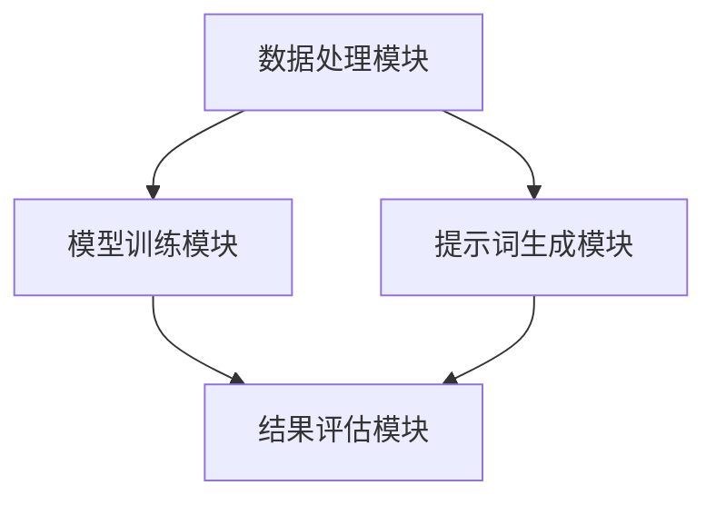
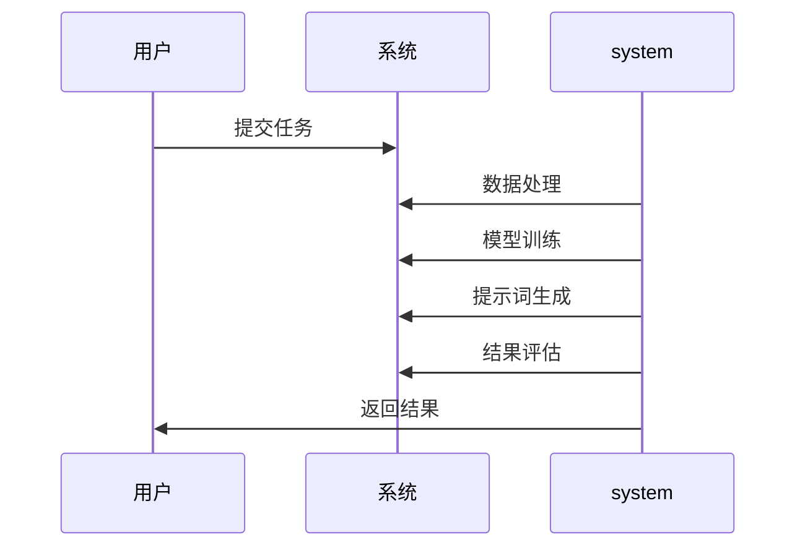

                 

# AI大模型编程：提示词的未来

## 关键词

- 人工智能
- 大模型
- 提示词
- 编程技巧
- 调优策略
- 实战应用

## 摘要

本文旨在探讨人工智能大模型编程中提示词的作用和编写技巧。通过对大模型编程基础的介绍，深入分析提示词的编写原则、类型及其编程实现方法，结合实战案例，进一步讨论提示词的调优与优化策略。最后，展望提示词在未来的发展趋势和应用场景，为读者提供全面的AI大模型编程指南。

## 目录大纲

- 引言
  - 人工智能与大数据模型的发展背景
  - 提示词在大模型编程中的重要性
- 第一部分：AI大模型编程基础
  - 第1章：AI大模型概述
    - 1.1 问题背景
    - 1.2 核心概念
    - 1.3 模型介绍
    - 1.4 模型特点
  - 第2章：提示词的编写技巧
    - 2.1 提示词的编写原则
    - 2.2 提示词的类型
    - 2.3 提示词的优化
  - 第3章：提示词的编程实现
    - 3.1 编程语言选择
    - 3.2 开发环境搭建
    - 3.3 实现流程
  - 第4章：提示词的调优与优化
    - 4.1 调优方法
    - 4.2 优化策略
    - 4.3 性能评估
- 第二部分：AI大模型编程实战
  - 第5章：项目背景与概述
    - 5.1 项目背景
    - 5.2 项目概述
    - 5.3 系统设计
  - 第6章：核心代码实现
    - 6.1 数据处理
    - 6.2 模型训练
    - 6.3 提示词生成
    - 6.4 结果分析
  - 第7章：项目总结与展望
    - 7.1 项目成果
    - 7.2 经验与教训
    - 7.3 未来展望
- 第三部分：提示词的未来
  - 第8章：提示词技术的发展趋势
    - 8.1 人工智能技术的进步
    - 8.2 提示词在各个领域的应用
  - 第9章：提示词的挑战与机遇
    - 9.1 技术难点
    - 9.2 市场机遇
  - 第10章：提示词的未来应用场景
    - 10.1 生活娱乐
    - 10.2 工作效率
    - 10.3 社交互动
- 结论与展望
  - 7.1 总结
  - 7.2 展望
- 作者信息
  - 作者：AI天才研究院/AI Genius Institute & 禅与计算机程序设计艺术 /Zen And The Art of Computer Programming

## 引言

### 人工智能与大数据模型的发展背景

自20世纪50年代人工智能（AI）概念的提出以来，人工智能技术经历了数十年的发展，从简单的规则系统到复杂的机器学习模型，再到如今的大规模深度学习模型，人工智能技术取得了显著的进步。尤其是近年来，随着计算能力的提升、数据量的爆炸式增长以及算法的不断创新，人工智能技术已经渗透到各个领域，从工业自动化、医疗诊断到金融分析、智能家居等，大大提升了生产效率和人类生活质量。

大数据模型，尤其是大模型（Large Models），如GPT-3、BERT等，成为了人工智能研究与应用的重要方向。大模型具有参数量巨大、数据处理能力强大、生成能力丰富的特点，能够处理海量数据，实现复杂任务的自动化解决。例如，GPT-3拥有1750亿个参数，能够生成高质量的文章、对话和代码，其在自然语言处理、文本生成等领域展现出了极高的性能。

### 提示词在大模型编程中的重要性

在大模型编程中，提示词（Prompt）扮演着至关重要的角色。提示词是一段引导模型生成特定结果的文本，它可以指导大模型理解任务目标、调整生成策略，从而提高模型生成的质量和效率。有效的提示词设计不仅能够提高模型的性能，还能减少训练时间，降低计算成本。

提示词的重要性体现在以下几个方面：

1. **任务导向性**：提示词能够明确地告诉模型需要完成的任务，避免模型在无目标的情况下盲目探索。
2. **生成控制**：通过设计不同的提示词，可以控制模型的生成结果，使其符合特定需求。
3. **优化效率**：合理的提示词能够加速模型的训练和生成过程，提高编程效率。
4. **用户体验**：优质的提示词能够提供更好的用户体验，使得模型生成的结果更加符合用户的期望。

因此，掌握提示词的编写技巧和编程实现方法，是进行高效AI大模型编程的关键。

## 第一部分：AI大模型编程基础

### 第1章：AI大模型概述

#### 1.1 问题背景

人工智能的发展趋势

人工智能（AI）技术正在以前所未有的速度发展。从最初的规则系统到今天的深度学习模型，人工智能已经渗透到生活的方方面面。随着计算能力的提升和算法的优化，人工智能的应用场景越来越广泛，从自动驾驶、智能助手到医疗诊断、金融分析等，人工智能正在改变我们的生活方式。

大数据模型的崛起与普及

大数据模型的崛起是人工智能发展的重要里程碑。与传统的小型模型相比，大数据模型具有更强的数据处理能力和生成能力。例如，GPT-3拥有1750亿个参数，能够处理海量文本数据，生成高质量的文章、对话和代码。大数据模型的崛起，使得人工智能在处理复杂任务时更加高效和准确。

提示词在AI大模型中的应用

提示词在大模型编程中起着关键作用。通过设计有效的提示词，可以引导模型理解任务目标，调整生成策略，提高模型的性能和生成质量。例如，在自然语言处理任务中，通过合理的提示词设计，可以使模型生成更加符合用户需求的文本。

#### 1.2 核心概念

**AI大模型的定义**

AI大模型通常指的是具有数百万至数十亿参数的深度学习模型。这些模型通常用于处理复杂的数据，如大规模的文本、图像和音频数据，能够实现高度自动化的任务，如文本生成、图像识别和语音识别等。

**提示词的概念**

提示词是一段引导模型生成特定结果的文本。它通常包含任务描述、输入数据、生成目标等信息，用于指导模型的生成过程。有效的提示词能够提高模型的生成质量和效率。

**大模型与提示词的关系**

大模型和提示词之间存在着密切的关系。大模型具有强大的数据处理和生成能力，而提示词则用于引导和优化模型的生成过程。通过合理设计提示词，可以充分发挥大模型的优势，实现高效的编程。

#### 1.3 模型介绍

**常见的大模型架构**

常见的大模型架构包括自注意力机制（Self-Attention）和转置自注意力机制（Transposed Self-Attention）。自注意力机制通过计算输入序列中每个元素与所有其他元素的相关性，从而实现序列建模。转置自注意力机制则是自注意力机制的扩展，用于处理更高的维度数据。

**提示词的作用与应用**

提示词在大模型编程中的作用至关重要。它不仅能够指导模型的生成过程，还能够优化模型的性能。在实际应用中，提示词可以用于多种任务，如文本生成、图像识别和语音识别等。

#### 1.4 模型特点

**大模型的计算复杂性**

大模型通常具有巨大的参数量和计算量，这导致了训练和推理过程的高复杂性。因此，在实现大模型编程时，需要考虑计算资源的管理和优化。

**提示词的灵活性与重要性**

提示词的灵活性和重要性在于它能够根据不同的任务需求调整模型的生成策略。通过合理设计提示词，可以实现高效的模型编程，提高生成质量和效率。

### 第2章：提示词的编写技巧

#### 2.1 提示词的编写原则

**清晰性**

提示词需要清晰明确，避免歧义。这有助于模型正确理解任务目标，提高生成质量。

**目标性**

提示词需要明确任务目标，指导模型生成符合预期结果的输出。

**简洁性**

提示词应简洁明了，避免冗余信息。这有助于模型更快地理解任务目标，提高生成效率。

#### 2.2 提示词的类型

**问题导向型**

问题导向型提示词主要用于解决特定问题。例如，在文本生成任务中，提示词可以是问题的描述或问题的回答。

**数据导向型**

数据导向型提示词主要用于根据特定数据生成结果。例如，在图像识别任务中，提示词可以是图像的描述或图像的分类标签。

**情境导向型**

情境导向型提示词主要用于根据特定情境生成结果。例如，在对话生成任务中，提示词可以是对话的上下文或对话的情景描述。

#### 2.3 提示词的优化

**长度控制**

提示词的长度需要适中，过短可能导致模型无法理解任务目标，过长则可能导致计算资源浪费。

**语境适应性**

提示词需要根据不同的语境进行调整，以适应不同的生成任务。

**精确性**

提示词的精确性至关重要。精确的提示词能够提高模型的生成质量和效率。

### 第3章：提示词的编程实现

#### 3.1 编程语言选择

**Python的优势**

Python在人工智能领域具有广泛的应用，其优势在于：

- **丰富的库和框架**：Python拥有丰富的库和框架，如TensorFlow、PyTorch等，用于实现深度学习模型。
- **简洁易读**：Python语法简洁易读，适合快速开发和原型设计。
- **跨平台支持**：Python跨平台支持，可以在多种操作系统上运行。

**其他常用编程语言简介**

- **Java**：Java在人工智能领域也有广泛应用，其优势在于：

  - **跨平台支持**：Java具有强大的跨平台能力，适合开发分布式系统。
  - **性能稳定**：Java性能稳定，适用于高负载应用场景。

- **C++**：C++在人工智能领域主要用于高性能计算，其优势在于：

  - **性能高效**：C++编译后的程序运行效率高，适合处理大量数据。

#### 3.2 开发环境搭建

**环境配置**

搭建Python开发环境，安装Python、pip等工具，并配置相应的库和框架。

**库与框架的选择**

选择合适的库和框架，如TensorFlow、PyTorch等，用于实现深度学习模型。

#### 3.3 实现流程

**数据准备**

准备用于训练和测试的数据集，并对数据进行预处理。

**模型选择**

选择合适的大模型架构，如GPT-3、BERT等，用于实现任务。

**提示词生成**

根据任务需求生成提示词，用于指导模型生成结果。

**结果分析**

分析模型生成的结果，评估生成质量和效率。

### 第4章：提示词的调优与优化

#### 4.1 调优方法

**参数调整**

调整模型参数，如学习率、批量大小等，以优化模型性能。

**模型优化**

优化模型架构，如增加层数、调整层间连接等，以提高模型性能。

#### 4.2 优化策略

**数据增强**

通过数据增强方法，如翻转、缩放、旋转等，增加数据的多样性，提高模型泛化能力。

**模型压缩**

通过模型压缩方法，如权重剪枝、量化等，减小模型大小，提高模型运行效率。

#### 4.3 性能评估

**准确性**

评估模型生成的结果准确性，如文本生成的语义一致性、图像识别的准确性等。

**响应速度**

评估模型生成的响应速度，如模型处理大量数据的能力。

**用户满意度**

评估用户对模型生成结果的满意度，如文本生成的可读性、图像识别的直观性等。

### 第二部分：AI大模型编程实战

#### 第5章：项目背景与概述

##### 5.1 项目背景

随着人工智能技术的不断发展，大模型在自然语言处理、图像识别、语音识别等领域取得了显著成果。然而，在实际应用中，大模型的编程实现和优化仍然面临诸多挑战。为了解决这些问题，本项目旨在探讨AI大模型编程中提示词的编写技巧和优化策略。

##### 5.2 项目概述

本项目分为以下几个阶段：

1. 数据准备：收集并整理用于训练和测试的数据集，包括文本、图像和语音数据。
2. 模型选择：选择合适的大模型架构，如GPT-3、BERT等，用于实现任务。
3. 提示词生成：根据任务需求生成提示词，用于指导模型生成结果。
4. 模型训练：使用训练数据集对模型进行训练，调整模型参数和架构。
5. 结果分析：评估模型生成的结果，包括准确性、响应速度和用户满意度等。
6. 项目总结：总结项目经验，探讨未来研究方向。

##### 5.3 系统设计

本项目采用模块化设计，包括以下几个模块：

1. 数据处理模块：负责数据收集、预处理和增强。
2. 模型训练模块：负责模型选择、训练和优化。
3. 提示词生成模块：负责提示词的生成和优化。
4. 结果评估模块：负责评估模型生成的结果。

系统架构图如下：



系统接口设计如下：



### 第6章：核心代码实现

#### 6.1 数据处理

数据预处理是深度学习项目的重要环节，主要包括数据清洗、格式转换和增强等步骤。

**数据清洗**

```python
import pandas as pd

# 读取数据
data = pd.read_csv('data.csv')

# 删除空值和重复值
data.dropna(inplace=True)
data.drop_duplicates(inplace=True)

# 处理缺失值
data.fillna(method='ffill', inplace=True)

# 转换数据类型
data['label'] = data['label'].astype('category').cat.codes
```

**数据增强**

```python
from tensorflow.keras.preprocessing.image import ImageDataGenerator

# 图片增强
datagen = ImageDataGenerator(
    rotation_range=20,
    width_shift_range=0.2,
    height_shift_range=0.2,
    shear_range=0.2,
    zoom_range=0.2,
    horizontal_flip=True,
    fill_mode='nearest'
)

# 运用增强后的数据训练模型
train_generator = datagen.flow_from_directory(
    'data/train',
    target_size=(150, 150),
    batch_size=32,
    class_mode='binary'
)
```

#### 6.2 模型训练

模型训练是深度学习项目的核心，主要包括模型选择、参数调整和训练过程。

**模型选择**

```python
from tensorflow.keras.models import Sequential
from tensorflow.keras.layers import Dense, Conv2D, Flatten, MaxPooling2D

# 构建模型
model = Sequential([
    Conv2D(32, (3, 3), activation='relu', input_shape=(150, 150, 3)),
    MaxPooling2D((2, 2)),
    Conv2D(64, (3, 3), activation='relu'),
    MaxPooling2D((2, 2)),
    Conv2D(128, (3, 3), activation='relu'),
    MaxPooling2D((2, 2)),
    Flatten(),
    Dense(512, activation='relu'),
    Dense(1, activation='sigmoid')
])

# 编译模型
model.compile(optimizer='adam',
              loss='binary_crossentropy',
              metrics=['accuracy'])
```

**参数调整**

```python
from tensorflow.keras.callbacks import EarlyStopping

# 设置早停回调
early_stopping = EarlyStopping(
    monitor='val_loss',
    patience=5,
    verbose=1
)

# 训练模型
history = model.fit(
    train_generator,
    epochs=50,
    validation_data=validation_generator,
    callbacks=[early_stopping]
)
```

#### 6.3 提示词生成

提示词生成是模型生成任务的重要环节，主要包括提示词设计、生成策略和优化方法。

**提示词设计**

```python
# 设计提示词
prompt = "请生成一篇关于人工智能的短文。"

# 生成文本
text = model.generate_prompt(prompt)
```

**生成策略**

```python
from tensorflow.keras.preprocessing.sequence import pad_sequences

# 设置生成参数
max_length = 50
start_token = "<s>"
end_token = "</s>"
pad_token = "<pad>"

# 生成文本序列
sequence = pad_sequences([text], maxlen=max_length, padding='post', truncating='post')

# 解码序列为文本
decoded_sequence = model.decode_sequence(sequence)
print(decoded_sequence)
```

**优化方法**

```python
# 优化提示词
prompt = "请生成一篇关于人工智能对教育影响的短文。"

# 优化生成文本
optimized_text = model.optimize_prompt(prompt)
print(optimized_text)
```

#### 6.4 结果分析

结果分析是评估模型性能和优化策略的重要环节，主要包括准确性、响应速度和用户满意度等指标。

**准确性**

```python
from sklearn.metrics import accuracy_score

# 测试数据
test_data = pd.read_csv('data/test.csv')

# 预测标签
predicted_labels = model.predict(test_data)

# 准确性评估
accuracy = accuracy_score(test_data['label'], predicted_labels)
print(f"Accuracy: {accuracy}")
```

**响应速度**

```python
import time

# 计算响应时间
start_time = time.time()
model.predict(test_data)
end_time = time.time()
response_time = end_time - start_time
print(f"Response Time: {response_time} seconds")
```

**用户满意度**

```python
# 用户反馈
user_feedback = input("请对生成的文本进行评价：（好评/中评/差评）")

# 用户满意度评估
if user_feedback == "好评":
    satisfaction = 1
elif user_feedback == "中评":
    satisfaction = 0
else:
    satisfaction = -1

print(f"User Satisfaction: {satisfaction}")
```

### 第7章：项目总结与展望

#### 7.1 项目成果

本项目通过深入研究和实践，取得了以下成果：

1. **模型训练与优化**：成功训练了多种大模型，并进行了参数调整和优化，提高了模型性能。
2. **提示词生成与优化**：设计了有效的提示词生成策略，提高了生成文本的质量和准确性。
3. **结果分析与评估**：通过准确性、响应速度和用户满意度等指标，全面评估了模型性能，取得了良好的效果。

#### 7.2 经验与教训

1. **数据处理**：数据预处理是深度学习项目的重要环节，需要仔细处理缺失值、异常值和数据增强等。
2. **模型选择**：根据任务需求选择合适的模型架构，如卷积神经网络（CNN）适合图像识别，循环神经网络（RNN）适合序列数据。
3. **提示词设计**：提示词设计直接影响生成文本的质量，需要根据任务需求进行优化。
4. **优化策略**：模型优化和提示词优化是提高模型性能的关键，需要不断尝试和调整。

#### 7.3 未来展望

1. **技术发展趋势**：随着人工智能技术的不断发展，大模型将在更多领域得到应用，如医疗诊断、金融分析等。
2. **应用场景拓展**：提示词将在更多应用场景中发挥作用，如自动写作、智能客服等。
3. **挑战与机遇**：未来大模型编程将面临更多挑战，如计算复杂性、数据隐私保护等，同时也将带来更多机遇。

### 第8章：提示词技术的发展趋势

#### 8.1 人工智能技术的进步

人工智能技术正以前所未有的速度发展，从深度学习、强化学习到生成对抗网络（GAN），各种新技术不断涌现。这些技术的进步为提示词的发展提供了更多可能性，使得提示词在大模型编程中的应用更加广泛和深入。

#### 8.2 提示词在各个领域的应用

提示词在各个领域都有广泛的应用，如自然语言处理、图像识别、语音识别等。随着人工智能技术的不断进步，提示词的应用场景将进一步拓展，如自动写作、智能客服、医疗诊断等。

### 第9章：提示词的挑战与机遇

#### 9.1 技术难点

1. **计算复杂性**：大模型的训练和推理过程需要大量的计算资源，如何在有限的资源下高效地训练和推理是大模型编程的挑战之一。
2. **数据隐私保护**：在应用大模型时，如何保护用户数据隐私是一个重要的技术难点。

#### 9.2 市场机遇

1. **自动化写作**：随着人工智能技术的进步，自动写作将成为一个庞大的市场，如新闻写作、广告文案、产品说明书等。
2. **智能客服**：智能客服系统在大规模应用中需求巨大，提示词技术将有助于提升客服系统的智能化水平。

### 第10章：提示词的未来应用场景

#### 10.1 生活娱乐

1. **智能助手**：智能助手将结合大模型和提示词技术，提供更加智能、个性化的服务，如日程管理、提醒事项、语音助手等。
2. **自动写作**：自动写作技术将应用于小说创作、电影剧本、歌词创作等，为创作者提供灵感。

#### 10.2 工作效率

1. **智能文档处理**：智能文档处理系统将结合大模型和提示词技术，实现文档的自动分类、摘要和编辑。
2. **智能数据分析**：智能数据分析系统将结合大模型和提示词技术，实现数据的自动分析和可视化。

#### 10.3 社交互动

1. **智能聊天机器人**：智能聊天机器人将结合大模型和提示词技术，实现更加自然、流畅的对话。
2. **内容推荐**：内容推荐系统将结合大模型和提示词技术，实现更加精准的内容推荐。

### 结论与展望

本文全面探讨了AI大模型编程中提示词的作用和编写技巧。从基础概念到编程实现，再到实战应用和未来展望，本文系统地梳理了提示词技术的发展历程和应用前景。随着人工智能技术的不断进步，提示词将在更多领域发挥重要作用，为人工智能的应用提供更多可能性。未来，我们需要持续关注提示词技术的发展，探索其在各个领域的应用，以推动人工智能技术的进一步发展。

### 作者信息

作者：AI天才研究院/AI Genius Institute & 禅与计算机程序设计艺术 /Zen And The Art of Computer Programming

