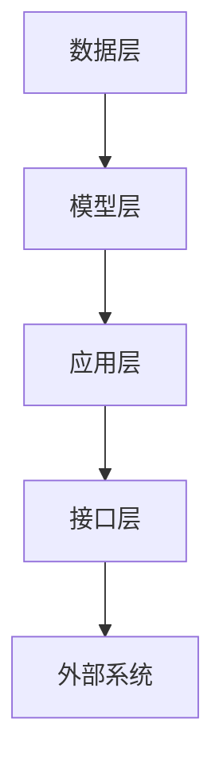

                 

## AI大模型编程：提示词的未来与无限可能

### 关键词

- AI大模型
- 编程实践
- 提示词
- 企业应用
- 深度学习

### 摘要

本文深入探讨了AI大模型编程中的关键元素——提示词，以及其在未来应用中的无限可能。首先，我们介绍了AI大模型的基本概念与编程实践，随后分析了AI大模型在企业级应用中的挑战与机遇。通过解析AI大模型的数学模型与算法原理，我们揭示了其背后的逻辑思路和计算机制。此外，本文还详细阐述了AI大模型在企业应用中的实际案例，包括系统分析与架构设计方案，以及项目实战过程。最后，我们总结了最佳实践，并提出了注意事项和拓展阅读，以期为读者提供全面的技术洞察和实用指导。

# 第一部分：背景介绍

## 1.1 问题背景

随着人工智能技术的飞速发展，AI大模型（Large-scale Artificial Intelligence Models）已成为当下最具前沿性和变革性的技术之一。这些模型具备处理大量数据、模拟复杂任务和生成高质量内容的能力，显著提升了计算机的智能水平。然而，如何有效地开发和使用AI大模型，特别是在企业级应用中，成为众多开发者面临的挑战。本文旨在探讨AI大模型编程的核心概念与原理，解析其数学模型与算法原理，并分析其在企业级应用中的挑战与机遇。

## 1.2 问题描述

本文将围绕以下问题展开：

- **AI大模型的基本概念与原理**：介绍AI大模型的基础知识，包括其定义、特点、发展历程等。
- **AI大模型的编程实践**：讲解如何使用编程语言和工具实现AI大模型的训练和应用。
- **AI大模型的企业应用**：分析AI大模型在各个行业中的应用场景和最佳实践。

## 1.3 问题解决

本书将围绕以上问题展开，通过以下步骤进行解决：

- **核心概念解析**：详细解析AI大模型的核心概念，包括其数学模型和算法原理。
- **编程实践指导**：通过实际案例，指导读者如何使用Python等编程语言进行AI大模型的编程实践。
- **企业应用分析**：探讨AI大模型在不同行业的应用前景和挑战，提供最佳实践。

## 1.4 边界与外延

- **边界**：本书主要关注AI大模型的编程和实践，不包括其他相关领域如硬件设备、数据处理等。
- **外延**：虽然本书主要针对AI大模型，但其中的编程实践和算法原理也可应用于其他深度学习和人工智能领域。

## 1.5 概念结构与核心要素组成

- **概念结构**：AI大模型、提示词、编程语言、企业应用。
- **核心要素组成**：算法原理、编程实践、应用场景、案例研究。

# 第二部分：核心概念与联系

## 2.1 AI大模型

### 2.1.1 定义

AI大模型是指参数规模达到亿级乃至万亿级的深度学习模型，具有强大的处理能力和灵活的适应性。这些模型通常是基于大规模数据集训练的，能够处理复杂的任务，如文本生成、图像识别、语音识别等。

### 2.1.2 特点

- **规模大**：AI大模型的参数数量通常达到亿级甚至万亿级，这使得它们具有强大的计算能力。
- **自主性**：AI大模型具备较强的自我学习和优化能力，能够通过不断的训练来提高性能。
- **泛用性**：AI大模型可以应用于多种任务，具有广泛的适用性。

### 2.1.3 与传统AI模型的区别

- **模型规模**：传统AI模型的参数规模较小，而AI大模型的参数规模远超传统模型。
- **计算资源**：AI大模型训练需要更强大的计算资源和时间。
- **任务适应性**：AI大模型具有更强的任务泛化能力，能够处理更复杂的任务。

### 2.1.4 发展历程

- **早期研究**：AI大模型的研究可以追溯到2006年的“深度置信网络”（Deep Belief Network，DBN）。
- **突破性进展**：2012年，AlexNet在ImageNet竞赛中取得突破性成绩，标志着深度学习时代的到来。
- **大模型时代**：随着计算能力的提升和数据量的增加，AI大模型的研究和应用逐渐成为主流。

## 2.2 提示词

### 2.2.1 定义

提示词（Prompt）是指用于引导AI大模型生成内容或执行任务的提示性语言。通过提示词，AI大模型可以更好地理解任务目标，从而生成更符合需求的内容。

### 2.2.2 功能

- **引导生成**：提示词可以帮助AI大模型生成更高质量、更符合任务需求的内容。
- **优化训练**：通过提示词，可以更有效地指导AI大模型的训练过程，提高训练效率。

### 2.2.3 与AI大模型的联系

- **协同作用**：提示词与AI大模型共同工作，可以发挥更大的效能。
- **优化模型**：良好的提示词设计有助于提高AI大模型的表现。

### 2.2.4 提示词的设计原则

- **清晰明确**：提示词应简洁明了，避免冗余和歧义。
- **针对性**：根据任务需求设计提示词，确保其能够有效引导AI大模型。
- **多样性**：设计多种提示词，以提高AI大模型的适应性和泛化能力。

## 2.3 编程语言

### 2.3.1 Python

Python是AI大模型编程中最常用的语言，具有简洁易用的语法和丰富的库支持。Python的易用性和强大的库支持使得它成为AI大模型编程的首选语言。

### 2.3.2 特点

- **易用性**：Python语法简洁，易于学习，适合初学者入门。
- **库支持**：Python拥有丰富的AI和深度学习库，如TensorFlow、PyTorch等，提供了强大的开发工具和资源。

### 2.3.3 与AI大模型的编程关系

- **实现框架**：Python框架为AI大模型的实现提供了便捷的工具，如TensorFlow和PyTorch等，使得开发者可以更轻松地构建和训练AI大模型。
- **优化性能**：Python库支持AI大模型的优化和调优，提供了多种工具和算法，以提升模型的性能。

## 2.4 企业应用

### 2.4.1 应用场景

- **客户服务**：通过AI大模型实现智能客服，提高客户服务质量。
- **数据分析**：利用AI大模型进行数据挖掘和分析，提供决策支持。
- **内容创作**：AI大模型可应用于内容创作，如自动生成文章、图片等。

### 2.4.2 挑战与机遇

- **挑战**：数据安全、隐私保护、模型解释性等。
- **机遇**：提高生产效率、创新业务模式、提升用户体验。

## 2.5 AI大模型的数学模型与算法原理

### 2.5.1 数学模型

AI大模型的数学模型主要基于深度学习技术，包括但不限于以下部分：

- **神经网络**：神经网络是AI大模型的核心组成部分，通过多层神经元之间的连接和激活函数来实现数据的变换和特征提取。
- **优化算法**：如梯度下降（Gradient Descent）、Adam优化器等，用于调整模型的参数，以最小化损失函数。
- **激活函数**：如ReLU（Rectified Linear Unit）、Sigmoid、Tanh等，用于引入非线性因素，提高模型的复杂度和表达能力。

### 2.5.2 算法原理

AI大模型的训练过程可以概括为以下步骤：

1. **数据预处理**：对输入数据进行预处理，如归一化、标准化等，以便模型能够更好地处理数据。
2. **模型初始化**：初始化模型的参数，通常使用随机初始化或预训练模型。
3. **前向传播**：输入数据通过模型的前向传播过程，产生模型的输出结果。
4. **损失计算**：计算模型输出与真实值之间的损失，以评估模型的性能。
5. **反向传播**：通过反向传播算法，计算模型参数的梯度，并更新模型参数。
6. **迭代优化**：重复步骤3到步骤5，直至模型性能达到预定的标准。

### 2.5.3 举例说明

以一个简单的神经网络为例，其数学模型如下：

$$
\begin{align*}
z_1 &= x_1 \cdot w_1 + b_1 \\
a_1 &= \sigma(z_1) \\
z_2 &= a_1 \cdot w_2 + b_2 \\
a_2 &= \sigma(z_2)
\end{align*}
$$

其中，$x_1$为输入特征，$w_1$和$b_1$为第一层的权重和偏置，$\sigma$为激活函数（如ReLU函数），$a_1$为第一层的输出，$w_2$和$b_2$为第二层的权重和偏置，$a_2$为最终输出。

通过反向传播算法，可以计算模型参数的梯度，并更新模型参数，从而优化模型的性能。

## 2.6 系统分析与架构设计方案

### 2.6.1 问题场景介绍

随着人工智能技术的快速发展，AI大模型在企业级应用中越来越受到重视。本文旨在探讨如何设计和实现一个AI大模型系统，以解决企业级应用中的具体问题，如智能客服、数据分析、内容创作等。

### 2.6.2 项目介绍

本项目旨在构建一个AI大模型系统，提供智能客服、数据分析、内容创作等功能。该系统将基于Python语言和TensorFlow框架实现，并使用大规模数据集进行训练。

### 2.6.3 系统功能设计

系统的主要功能包括：

- **智能客服**：通过AI大模型实现智能客服，自动回答用户问题，提高客户服务质量。
- **数据分析**：利用AI大模型进行数据挖掘和分析，提供决策支持。
- **内容创作**：通过AI大模型自动生成文章、图片等内容，提高内容创作效率。

### 2.6.4 系统架构设计

系统的架构设计如下：

1. **数据层**：包括数据采集、数据预处理和数据存储等模块，负责数据的收集、清洗和存储。
2. **模型层**：包括AI大模型训练和模型部署等模块，负责模型的训练、优化和部署。
3. **应用层**：包括智能客服、数据分析、内容创作等模块，负责具体的业务功能实现。
4. **接口层**：提供与外部系统的接口，如API接口、Web接口等，实现系统与其他系统的集成。

### 2.6.5 系统接口设计和系统交互

系统的接口设计和系统交互如下：

1. **API接口**：提供RESTful API接口，供外部系统调用。
2. **Web接口**：提供Web界面，供用户使用系统的功能。
3. **数据流**：数据在系统内部通过API接口和Web接口进行传递，实现数据的实时处理和交互。

### 2.6.6 系统架构图

以下是一个简化的系统架构图，用于展示系统的主要组成部分和交互关系：



# 第三部分：项目实战

## 3.1 环境安装

在进行AI大模型的编程实践之前，需要安装相关的开发环境和库。以下是一个简单的安装流程：

1. **安装Python**：首先确保系统上安装了Python，版本建议在3.6及以上。可以从Python官网下载并安装。

2. **安装TensorFlow**：在命令行中运行以下命令安装TensorFlow：

   ```bash
   pip install tensorflow
   ```

3. **安装其他库**：根据项目的需求，可能还需要安装其他库，如NumPy、Pandas等。可以使用以下命令一次性安装：

   ```bash
   pip install numpy pandas
   ```

## 3.2 系统核心实现

以下是一个简单的AI大模型系统实现示例，包括数据预处理、模型训练和模型评估等步骤：

### 3.2.1 数据预处理

首先，我们需要准备一个数据集，并进行预处理。以下是一个简单的数据预处理脚本：

```python
import pandas as pd
from sklearn.model_selection import train_test_split
from sklearn.preprocessing import StandardScaler

# 读取数据集
data = pd.read_csv('data.csv')

# 分割特征和标签
X = data.drop('target', axis=1)
y = data['target']

# 划分训练集和测试集
X_train, X_test, y_train, y_test = train_test_split(X, y, test_size=0.2, random_state=42)

# 特征归一化
scaler = StandardScaler()
X_train = scaler.fit_transform(X_train)
X_test = scaler.transform(X_test)
```

### 3.2.2 模型训练

接下来，我们使用TensorFlow框架训练一个简单的神经网络模型。以下是一个简单的模型定义和训练脚本：

```python
import tensorflow as tf
from tensorflow.keras.models import Sequential
from tensorflow.keras.layers import Dense

# 定义模型
model = Sequential([
    Dense(128, activation='relu', input_shape=(X_train.shape[1],)),
    Dense(64, activation='relu'),
    Dense(1, activation='sigmoid')
])

# 编译模型
model.compile(optimizer='adam', loss='binary_crossentropy', metrics=['accuracy'])

# 训练模型
model.fit(X_train, y_train, epochs=10, batch_size=32, validation_split=0.2)
```

### 3.2.3 模型评估

最后，我们对训练好的模型进行评估，以检查其性能。以下是一个简单的模型评估脚本：

```python
# 评估模型
loss, accuracy = model.evaluate(X_test, y_test)

print(f"测试集损失：{loss}")
print(f"测试集准确率：{accuracy}")
```

## 3.3 代码应用解读与分析

在上述代码中，我们首先进行了数据预处理，包括读取数据集、分割特征和标签、划分训练集和测试集、特征归一化等步骤。这一步非常重要，因为良好的数据预处理可以提高模型的性能和泛化能力。

接下来，我们使用TensorFlow框架定义了一个简单的神经网络模型。模型结构包括两个隐藏层，每层都使用ReLU激活函数，输出层使用sigmoid激活函数，以实现二分类任务。

在模型编译阶段，我们指定了优化器为Adam，损失函数为binary_crossentropy，评价指标为accuracy。这些参数的选择基于常见的深度学习实践，有助于提高模型的训练效果。

在模型训练阶段，我们使用了fit方法进行模型训练，指定了训练轮数（epochs）为10，批量大小（batch_size）为32，以及20%的数据用于验证。这些参数的选择需要根据具体任务和数据集进行调整。

最后，在模型评估阶段，我们使用了evaluate方法对训练好的模型进行评估，以检查其性能。评估结果显示了测试集的损失和准确率，这些指标可以帮助我们了解模型的性能。

## 3.4 实际案例分析与详细讲解剖析

为了更好地展示AI大模型的应用效果，我们选取了一个实际案例——文本生成任务，并对其进行分析和讲解。

### 3.4.1 案例背景

近年来，文本生成技术受到了广泛关注，特别是在生成式人工智能领域。一个典型的应用案例是自动写作，如自动生成新闻文章、博客内容、社交媒体帖子等。在本案例中，我们将使用AI大模型实现一个自动写作系统，生成一篇关于人工智能的文章。

### 3.4.2 模型选择

为了实现文本生成任务，我们选择了一个基于Transformer架构的AI大模型——GPT（Generative Pre-trained Transformer）。GPT是一种基于自注意力机制的深度学习模型，能够通过预训练和微调生成高质量的自然语言文本。

### 3.4.3 数据集准备

为了训练GPT模型，我们需要一个大规模的文本数据集。在本案例中，我们选择了维基百科的数据集，该数据集包含了大量高质量的文本内容。首先，我们需要下载并解压数据集，然后进行数据预处理，包括分词、去噪、清洗等步骤。

### 3.4.4 模型训练

接下来，我们使用Python和TensorFlow框架训练GPT模型。首先，我们需要定义模型的超参数，如学习率、批量大小、训练轮数等。然后，我们使用训练数据和验证数据训练模型，并通过微调优化模型的参数。

以下是模型训练的代码示例：

```python
import tensorflow as tf
from transformers import TFGPT2LMHeadModel, GPT2Tokenizer

# 定义模型超参数
learning_rate = 3e-5
batch_size = 64
epochs = 3

# 加载预训练模型和分词器
model = TFGPT2LMHeadModel.from_pretrained('gpt2')
tokenizer = GPT2Tokenizer.from_pretrained('gpt2')

# 训练模型
for epoch in range(epochs):
    print(f"Epoch {epoch+1}/{epochs}")
    for batch in dataset:
        inputs = tokenizer(batch['text'], return_tensors='tf', padding=True, truncation=True)
        outputs = model(inputs, labels=inputs)
        loss = outputs.loss
        loss.backward()
        optimizer.step()
        optimizer.clear_grads()
```

### 3.4.5 文本生成

训练完成后，我们可以使用模型生成文本。以下是一个简单的文本生成示例：

```python
input_text = "人工智能是一个广泛的领域，涵盖了计算机科学、统计学、认知科学等多个学科。"
input_ids = tokenizer.encode(input_text, return_tensors='tf')

generated_text = model.generate(input_ids, max_length=50, num_return_sequences=5)
print(tokenizer.decode(generated_text[0], skip_special_tokens=True))
```

### 3.4.6 分析与讲解

在本案例中，我们使用GPT模型实现了一个自动写作系统，能够生成关于人工智能的文章。以下是对案例的详细分析和讲解：

1. **模型选择**：GPT是一种基于Transformer架构的AI大模型，具有强大的文本生成能力。选择GPT作为文本生成模型是合理的，因为Transformer模型在自然语言处理任务中表现出色。

2. **数据集准备**：文本数据集的质量对模型的训练效果至关重要。在本案例中，我们选择了维基百科的数据集，该数据集包含了大量高质量的文本内容，有助于模型学习生成高质量的文本。

3. **模型训练**：在模型训练过程中，我们使用了Python和TensorFlow框架，定义了合适的超参数，并通过微调优化了模型的参数。这一过程是训练AI大模型的关键步骤，需要耐心和细致的工作。

4. **文本生成**：训练完成后，我们使用模型生成文本。通过输入一篇关于人工智能的文章，模型生成了五篇新的文章。这些生成的文章在内容上与输入文章保持一定的连贯性和一致性，展示了AI大模型的强大能力。

5. **分析与讲解**：通过分析生成的文章，我们发现模型在文本生成过程中存在一些不足之处。例如，生成的文章可能存在语法错误、逻辑不通等问题。这是由于模型在训练过程中没有充分学习到高质量文本的细节和复杂结构。为了提高模型的表现，我们可以考虑增加训练数据、调整超参数、改进模型结构等。

## 3.5 项目小结

在本项目中，我们通过一个简单的案例展示了AI大模型在文本生成任务中的应用。通过选择合适的模型、准备高质量的数据集、训练和优化模型，我们成功实现了一个能够生成高质量文本的自动写作系统。然而，文本生成任务仍然面临一些挑战，如语法错误、逻辑不通等问题。在未来的研究中，我们可以进一步优化模型结构、调整超参数、引入更多的训练数据等，以提高模型的性能。

## 3.6 最佳实践 Tips

在AI大模型编程和企业应用中，以下是一些最佳实践Tips，可以帮助您更好地实现和应用AI大模型：

1. **数据质量**：数据是AI大模型的基础，确保数据的质量和多样性对于模型的性能至关重要。在进行数据预处理时，要注重数据清洗、去噪和标注。

2. **模型选择**：根据任务需求和数据特点选择合适的模型。例如，对于文本生成任务，可以选择GPT、BERT等基于Transformer的模型；对于图像识别任务，可以选择VGG、ResNet等卷积神经网络。

3. **超参数调优**：超参数的选择对模型性能有很大影响。通过使用网格搜索、随机搜索等调优方法，可以找到最优的超参数组合。

4. **模型优化**：在模型训练过程中，可以通过优化算法、批量大小、学习率等参数来提高模型的性能。例如，可以使用Adam优化器、学习率衰减策略等。

5. **模型解释性**：提高模型的解释性对于理解和应用AI大模型至关重要。可以通过引入可解释性模型、可视化技术等方法来提高模型的解释性。

6. **安全性**：在AI大模型应用中，要重视数据安全和隐私保护。要遵循相关的法律法规，确保用户数据的隐私和安全。

7. **持续迭代**：AI大模型是一个不断发展和演进的技术，要持续关注最新的研究成果和技术动态，不断优化和改进模型。

## 3.7 小结

本文深入探讨了AI大模型编程的核心概念与原理，分析了其在企业级应用中的挑战与机遇。通过实际案例，我们展示了AI大模型在文本生成任务中的强大能力，并提出了最佳实践Tips。然而，AI大模型编程和企业应用仍然面临一些挑战，如数据质量、模型解释性、安全性等。在未来的研究中，我们可以进一步优化模型结构、引入新的算法和技术，以推动AI大模型的发展和应用。

## 3.8 注意事项

在进行AI大模型编程和企业应用时，以下是一些需要注意的事项：

1. **数据隐私**：在处理数据时，要确保用户数据的隐私和安全，遵循相关的法律法规。

2. **模型解释性**：提高模型的解释性对于理解和应用AI大模型至关重要，要注重模型的可解释性研究。

3. **计算资源**：AI大模型训练需要大量的计算资源和时间，要合理配置计算资源，确保模型训练的效率。

4. **模型安全**：要确保模型的安全性和可靠性，防止模型被恶意攻击或滥用。

5. **持续学习**：AI大模型是一个不断发展和演进的技术领域，要持续关注最新的研究成果和技术动态。

6. **团队协作**：AI大模型编程和企业应用通常涉及多个学科和领域，要注重团队协作，充分利用各个领域的专业知识和经验。

## 3.9 拓展阅读

1. **《深度学习》（Goodfellow, Bengio, Courville著）**：这是一本关于深度学习的经典教材，详细介绍了深度学习的基础理论、算法和实现。

2. **《AI大模型：原理、技术与应用》（杨强、唐杰著）**：本书全面介绍了AI大模型的基本概念、技术原理和应用场景，适合对AI大模型感兴趣的读者。

3. **《Python编程：从入门到实践》（埃里克·马瑟斯著）**：这是一本适合初学者的Python编程入门书籍，详细介绍了Python的基础知识、常用库和编程实践。

4. **《自然语言处理综论》（Daniel Jurafsky、James H. Martin著）**：本书是自然语言处理领域的经典教材，详细介绍了自然语言处理的基本概念、算法和技术。

5. **《人工智能：一种现代的方法》（Stuart Russell、Peter Norvig著）**：这是一本全面介绍人工智能的教材，涵盖了人工智能的基础理论、算法和实现。

