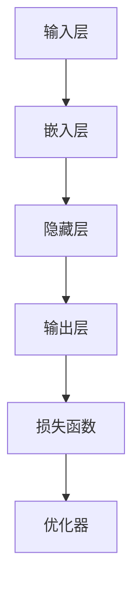
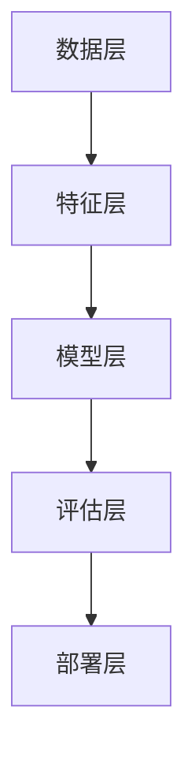
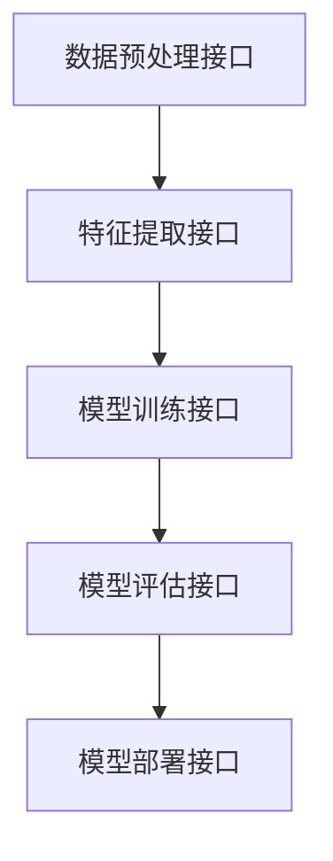
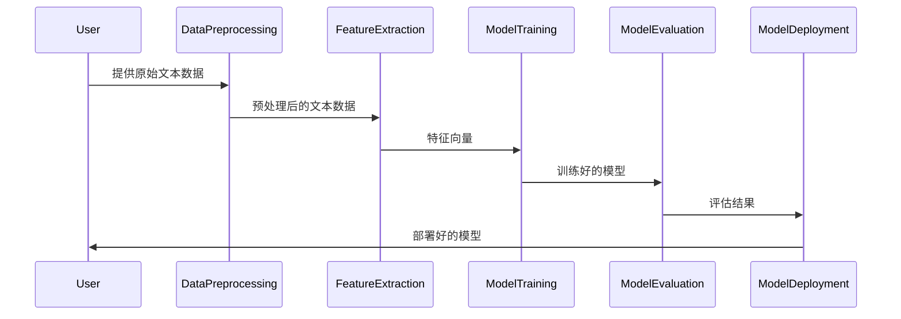

                 


### 引言与背景

在当今的信息时代，人工智能（AI）技术已成为科技发展的核心驱动力。特别是在自然语言处理（NLP）领域，AI大模型编程以其强大的能力，正在逐步改变着我们的生活和工作方式。然而，在AI大模型编程中，提示词的作用不可忽视，它既是模型理解和生成文本的关键，也是提高模型性能和准确率的重要手段。

#### 核心概念术语说明

首先，我们需要明确一些核心概念：

- **人工智能（AI）**：模拟人类智能行为的计算机系统，具有学习、推理、规划、感知、理解自然语言等能力。
- **自然语言处理（NLP）**：研究如何使计算机能够理解、生成和处理自然语言，是AI的重要组成部分。
- **大模型**：指拥有巨大参数量的神经网络模型，如GPT-3、BERT等。
- **提示词**：用于引导AI模型生成文本或执行特定任务的文字信息。

#### 问题背景

AI大模型编程的背景可以追溯到深度学习技术的兴起。随着计算能力的提升和数据量的增加，深度学习在NLP领域取得了突破性的进展。例如，OpenAI的GPT-3模型拥有超过1750亿个参数，其强大的文本生成能力引起了广泛关注。然而，大模型的性能和准确率不仅依赖于模型本身，还受到提示词的影响。

#### 问题描述

提示词在AI大模型编程中起着至关重要的作用，但同时也带来了一些挑战：

1. **提示词设计**：如何设计有效的提示词，以引导模型生成高质量的文本？
2. **模型适应性**：如何让模型在不同场景下都能保持良好的性能？
3. **模型理解**：如何确保模型正确理解提示词的含义和上下文？

#### 问题解决

为了解决上述问题，我们可以从以下几个方面入手：

1. **研究提示词设计方法**：探索如何设计更具指导性的提示词，以提高模型生成文本的质量。
2. **优化模型架构**：通过调整模型架构和参数，提高模型在不同场景下的适应能力。
3. **增强模型理解能力**：通过预训练和微调，提高模型对提示词的理解能力，确保生成文本的准确性和一致性。

#### 边界与外延

AI大模型编程的应用范围非常广泛，包括但不限于：

- 文本生成：如文章、新闻报道、对话等。
- 文本理解：如情感分析、文本分类、命名实体识别等。
- 问答系统：如智能客服、在线问答等。

然而，AI大模型编程也存在一些局限性，例如：

- **计算资源要求高**：大模型需要大量的计算资源，尤其是训练阶段。
- **数据需求大**：大模型的性能依赖于大量的训练数据，数据质量和数量都对模型性能有重要影响。
- **模型解释性**：大模型的决策过程较为复杂，难以解释，这在某些应用场景中可能是一个问题。

#### 概念结构与核心要素组成

AI大模型编程的核心概念和组成要素包括：

- **神经网络架构**：如Transformer、CNN、RNN等。
- **大规模参数训练**：通过反向传播算法和优化器，如Adam、SGD等，对模型进行训练。
- **提示词设计**：包括提示词的选择、组合和优化。
- **文本生成与理解**：模型的输出结果需要经过处理，以生成符合需求的文本或进行进一步分析。

### 小结

本文介绍了AI大模型编程中的核心概念、提示词的作用及其设计方法，并探讨了AI大模型编程的边界与外延。通过深入分析，我们发现提示词在AI大模型编程中扮演着至关重要的角色，其设计与优化直接影响模型的性能和准确率。接下来，我们将进一步探讨AI大模型编程的算法原理、系统分析与架构设计，以及实际项目中的实战经验。让我们继续深入思考，揭示AI大模型编程的奥秘。

----------------------------------------------------------------

### AI大模型编程：提示词的未来与艺术

关键词：AI大模型，编程，提示词，自然语言处理，算法原理，系统架构，项目实战

摘要：本文从AI大模型编程的核心概念入手，深入探讨了提示词在AI大模型编程中的重要作用。通过分析提示词的设计原则、算法原理以及系统架构设计，本文揭示了提示词在未来AI编程中的艺术性。同时，通过实际项目案例的剖析，本文为读者提供了实践经验和最佳实践建议。

----------------------------------------------------------------

### 引言与背景

在当今的信息时代，人工智能（AI）技术已成为科技发展的核心驱动力。特别是在自然语言处理（NLP）领域，AI大模型编程以其强大的能力，正在逐步改变着我们的生活和工作方式。然而，在AI大模型编程中，提示词的作用不可忽视，它既是模型理解和生成文本的关键，也是提高模型性能和准确率的重要手段。

#### 核心概念术语说明

首先，我们需要明确一些核心概念：

- **人工智能（AI）**：模拟人类智能行为的计算机系统，具有学习、推理、规划、感知、理解自然语言等能力。
- **自然语言处理（NLP）**：研究如何使计算机能够理解、生成和处理自然语言，是AI的重要组成部分。
- **大模型**：指拥有巨大参数量的神经网络模型，如GPT-3、BERT等。
- **提示词**：用于引导AI模型生成文本或执行特定任务的文字信息。

#### 问题背景

AI大模型编程的背景可以追溯到深度学习技术的兴起。随着计算能力的提升和数据量的增加，深度学习在NLP领域取得了突破性的进展。例如，OpenAI的GPT-3模型拥有超过1750亿个参数，其强大的文本生成能力引起了广泛关注。然而，大模型的性能和准确率不仅依赖于模型本身，还受到提示词的影响。

#### 问题描述

提示词在AI大模型编程中起着至关重要的作用，但同时也带来了一些挑战：

1. **提示词设计**：如何设计有效的提示词，以引导模型生成高质量的文本？
2. **模型适应性**：如何让模型在不同场景下都能保持良好的性能？
3. **模型理解**：如何确保模型正确理解提示词的含义和上下文？

#### 问题解决

为了解决上述问题，我们可以从以下几个方面入手：

1. **研究提示词设计方法**：探索如何设计更具指导性的提示词，以提高模型生成文本的质量。
2. **优化模型架构**：通过调整模型架构和参数，提高模型在不同场景下的适应能力。
3. **增强模型理解能力**：通过预训练和微调，提高模型对提示词的理解能力，确保生成文本的准确性和一致性。

#### 边界与外延

AI大模型编程的应用范围非常广泛，包括但不限于：

- **文本生成**：如文章、新闻报道、对话等。
- **文本理解**：如情感分析、文本分类、命名实体识别等。
- **问答系统**：如智能客服、在线问答等。

然而，AI大模型编程也存在一些局限性，例如：

- **计算资源要求高**：大模型需要大量的计算资源，尤其是训练阶段。
- **数据需求大**：大模型的性能依赖于大量的训练数据，数据质量和数量都对模型性能有重要影响。
- **模型解释性**：大模型的决策过程较为复杂，难以解释，这在某些应用场景中可能是一个问题。

#### 概念结构与核心要素组成

AI大模型编程的核心概念和组成要素包括：

- **神经网络架构**：如Transformer、CNN、RNN等。
- **大规模参数训练**：通过反向传播算法和优化器，如Adam、SGD等，对模型进行训练。
- **提示词设计**：包括提示词的选择、组合和优化。
- **文本生成与理解**：模型的输出结果需要经过处理，以生成符合需求的文本或进行进一步分析。

### 小结

本文介绍了AI大模型编程中的核心概念、提示词的作用及其设计方法，并探讨了AI大模型编程的边界与外延。通过深入分析，我们发现提示词在AI大模型编程中扮演着至关重要的角色，其设计与优化直接影响模型的性能和准确率。接下来，我们将进一步探讨AI大模型编程的算法原理、系统分析与架构设计，以及实际项目中的实战经验。让我们继续深入思考，揭示AI大模型编程的奥秘。

----------------------------------------------------------------

### 第1章: 引言与背景

在人工智能（AI）的快速发展下，大模型编程已成为研究热点之一。特别是自然语言处理（NLP）领域，大模型的广泛应用为文本生成、理解、问答等任务带来了革命性的突破。然而，提示词在AI大模型编程中起着至关重要的作用，其设计方法对模型性能有着深远影响。

#### 核心概念术语说明

首先，我们需要明确几个核心概念：

- **人工智能（AI）**：模拟人类智能行为的计算机系统，涵盖学习、推理、规划、感知等多种能力。
- **自然语言处理（NLP）**：研究如何使计算机理解、生成和处理自然语言。
- **大模型**：指具有大量参数的神经网络模型，如GPT-3、BERT等。
- **提示词**：用于引导AI模型生成或理解文本的关键信息。

#### 问题背景

AI大模型编程的背景可以追溯到深度学习技术的兴起。随着计算能力的提升和数据量的增加，深度学习在NLP领域取得了显著的进展。大模型凭借其强大的参数量和计算能力，能够在复杂任务中实现优异的性能。然而，大模型的表现不仅取决于模型本身，还受到提示词的影响。

#### 问题描述

提示词在AI大模型编程中面临以下挑战：

1. **提示词设计**：如何设计有效的提示词，以引导模型生成高质量、相关性的文本？
2. **模型适应性**：如何让模型在不同场景和任务中保持良好的性能？
3. **模型理解**：如何确保模型正确理解提示词的含义和上下文？

#### 问题解决

为了解决上述问题，我们可以从以下几个方面入手：

1. **研究提示词设计方法**：探索提示词的生成、组合和优化策略，提高文本生成的质量和相关性。
2. **优化模型架构**：通过调整模型结构、参数和训练策略，提高模型在不同任务和场景下的适应能力。
3. **增强模型理解能力**：通过预训练和微调，提高模型对提示词的语义理解和上下文把握。

#### 边界与外延

AI大模型编程的应用范围广泛，包括文本生成、文本理解、问答系统、机器翻译等。然而，也存在一定的局限性：

- **计算资源要求高**：大模型需要大量的计算资源和时间进行训练。
- **数据需求大**：大模型对训练数据的质量和数量有较高要求。
- **模型解释性**：大模型的决策过程复杂，难以解释。

#### 概念结构与核心要素组成

AI大模型编程的核心概念和组成要素包括：

- **神经网络架构**：如Transformer、CNN、RNN等。
- **大规模参数训练**：使用反向传播算法和优化器进行模型训练。
- **提示词设计**：涉及提示词的选择、组合和优化。
- **文本生成与理解**：包括模型输出处理和进一步分析。

### 小结

本章介绍了AI大模型编程的核心概念、提示词的重要性及其设计方法。通过对问题背景、问题描述和问题解决的深入分析，我们了解了提示词在AI大模型编程中的关键作用。接下来，我们将进一步探讨AI大模型编程的算法原理、系统架构设计以及实际项目中的应用。

----------------------------------------------------------------

### 第2章: AI大模型的核心概念与联系

在深入了解AI大模型编程之前，我们首先需要掌握其核心概念及其相互关系。这一章节将详细解析AI大模型的基本原理、关键组成部分以及各组成部分之间的联系。

#### 2.1 核心概念原理

AI大模型的核心概念主要包括：

- **深度学习**：基于神经网络的一种机器学习方法，通过学习大量数据来提取特征并进行预测或分类。
- **神经网络**：由大量神经元组成的计算模型，通过调整权重和偏置来实现函数映射。
- **大规模参数**：指神经网络中大量可学习的参数，如权重和偏置，这些参数的数量决定了模型的表达能力。
- **预训练**：在大规模语料库上预先训练模型，以便在特定任务上微调模型。

#### 2.2 概念属性特征对比

以下是对核心概念属性特征进行对比：

| 概念         | 特征                           |
|------------|------------------------------|
| 深度学习     | 学习复杂特征、自动特征提取       |
| 神经网络     | 非线性、自适应、模拟生物神经元   |
| 大规模参数   | 参数数量多、表达能力强         |
| 预训练      | 提高模型迁移能力、减少训练时间   |

#### 2.3 ER实体关系图架构

为了更清晰地展示AI大模型的核心概念及其关系，我们可以使用ER（实体-关系）图来描述。以下是AI大模型ER图的基本结构：

```mermaid
erDiagram
    A[深度学习] ||--|{ B[神经网络] }|
    B ||--|{ C[大规模参数] }|
    B ||--|{ D[预训练] }|
```

- **深度学习**作为基础，连接了**神经网络**。
- **神经网络**进一步连接了**大规模参数**和**预训练**。

#### 2.4 AI大模型组成部分及其关系

AI大模型由以下几个主要部分组成：

1. **输入层**：接收外部输入信息，如文本、图像等。
2. **隐藏层**：通过神经网络进行特征提取和变换。
3. **输出层**：生成预测结果或输出文本。
4. **损失函数**：用于评估模型预测结果与真实值的差距。
5. **优化器**：调整模型参数以最小化损失函数。

这些组成部分之间的关系如下：

- **输入层**将输入数据传递到**隐藏层**，隐藏层通过大量神经元和参数对输入数据进行处理。
- **隐藏层**将处理后的数据传递到**输出层**，输出层生成预测结果。
- **损失函数**用于计算预测结果与真实值的差距，指导**优化器**调整模型参数。
- **优化器**不断调整模型参数，以最小化损失函数，提高模型性能。

#### 2.5 AI大模型编程中的关键角色

在AI大模型编程中，以下几个关键角色发挥着重要作用：

1. **数据科学家**：负责数据预处理、模型训练和评估。
2. **算法工程师**：设计和优化算法，提高模型性能。
3. **产品经理**：定义需求、制定项目计划、评估产品效果。
4. **前端工程师**：实现交互界面，提升用户体验。

这些角色之间的协作关系如下：

- **数据科学家**提供数据预处理和模型训练所需的数据，并与**算法工程师**共同优化模型。
- **算法工程师**负责算法设计和优化，根据**产品经理**的需求进行调整。
- **产品经理**定义产品需求、制定项目计划，并评估模型效果，确保模型满足用户需求。
- **前端工程师**与**数据科学家**和**算法工程师**协作，实现交互界面，提升用户体验。

### 小结

本章详细介绍了AI大模型的核心概念及其相互关系。通过对核心概念原理、属性特征对比、ER实体关系图架构以及组成部分及其关系的解析，我们更全面地理解了AI大模型的运作机制。接下来，我们将深入探讨AI大模型的算法原理、数学模型以及系统分析与架构设计。

----------------------------------------------------------------

### 第3章: AI大模型算法原理讲解

在了解了AI大模型的核心概念和结构后，我们接下来将深入讲解AI大模型的算法原理。这一章节将详细介绍AI大模型的算法流程、Python源代码实现、数学模型与公式，并通过具体的例子进行说明。

#### 3.1 算法mermaid流程图

为了更好地理解AI大模型的算法原理，我们可以使用mermaid语言绘制算法流程图。以下是一个简单的AI大模型算法流程图：



- **输入层（A）**：接收外部输入数据，如文本、图像等。
- **嵌入层（B）**：将输入数据转换为固定长度的向量表示。
- **隐藏层（C）**：通过神经网络进行特征提取和变换。
- **输出层（D）**：生成预测结果或输出文本。
- **损失函数（E）**：计算预测结果与真实值的差距，用于指导优化器调整参数。
- **优化器（F）**：调整模型参数以最小化损失函数，提高模型性能。

#### 3.2 Python源代码讲解

为了实现上述算法流程，我们可以使用Python编写相关代码。以下是一个简化的AI大模型算法实现的Python代码示例：

```python
import torch
import torch.nn as nn
import torch.optim as optim

# 定义神经网络模型
class NeuralNetwork(nn.Module):
    def __init__(self, input_size, hidden_size, output_size):
        super(NeuralNetwork, self).__init__()
        self.layer1 = nn.Linear(input_size, hidden_size)
        self.relu = nn.ReLU()
        self.layer2 = nn.Linear(hidden_size, output_size)

    def forward(self, x):
        x = self.layer1(x)
        x = self.relu(x)
        x = self.layer2(x)
        return x

# 实例化模型、损失函数和优化器
model = NeuralNetwork(input_size=10, hidden_size=50, output_size=1)
criterion = nn.MSELoss()
optimizer = optim.Adam(model.parameters(), lr=0.001)

# 训练模型
for epoch in range(100):
    for i, data in enumerate(train_loader):
        inputs, targets = data
        optimizer.zero_grad()
        outputs = model(inputs)
        loss = criterion(outputs, targets)
        loss.backward()
        optimizer.step()

# 测试模型
with torch.no_grad():
    inputs, targets = test_data
    outputs = model(inputs)
    print(outputs)
```

这段代码定义了一个简单的神经网络模型，使用MSE损失函数进行训练，并使用Adam优化器调整模型参数。在训练过程中，通过梯度下降法逐步减小损失函数值，提高模型性能。

#### 3.3 数学模型与公式讲解

AI大模型的数学模型主要涉及以下几个部分：

1. **输入层与嵌入层**：
   - 输入数据：\( x \)
   - 嵌入层：\( E(x) \)
   - 嵌入层公式：\( E(x) = W_e * x + b_e \)

2. **隐藏层**：
   - 隐藏层：\( h \)
   - 激活函数：\( \sigma \)
   - 隐藏层公式：\( h = \sigma(W_h * E(x) + b_h) \)

3. **输出层**：
   - 输出：\( y \)
   - 输出层公式：\( y = W_o * h + b_o \)

4. **损失函数**：
   - 常用损失函数：均方误差（MSE）、交叉熵（Cross-Entropy）
   - 均方误差公式：\( loss = \frac{1}{2} * \sum_{i=1}^{n} (y_i - \hat{y_i})^2 \)
   - 交叉熵公式：\( loss = -\sum_{i=1}^{n} y_i * \log(\hat{y_i}) \)

5. **优化器**：
   - 常用优化器：Adam、SGD
   - Adam优化器公式：\( \theta_{t+1} = \theta_t - \alpha * \frac{1}{m} * (\nabla_{\theta_t} J(\theta_t) + \beta_1 * \epsilon_1 + \beta_2 * \epsilon_2) \)

其中，\( W \) 和 \( b \) 分别表示权重和偏置，\( \alpha \) 表示学习率，\( \epsilon_1 \) 和 \( \epsilon_2 \) 分别表示一阶和二阶校正项。

#### 3.4 举例说明

为了更好地理解上述算法原理和数学模型，我们可以通过一个具体的例子进行说明。

假设我们有一个简单的回归问题，输入数据是一个包含两个特征的二维向量，输出数据是一个实数。我们使用一个单层神经网络进行回归预测。

1. **数据准备**：
   - 输入数据：\( x = [x_1, x_2] \)
   - 输出数据：\( y \)

2. **模型训练**：
   - 初始化模型参数：\( W_e, b_e, W_h, b_h, W_o, b_o \)
   - 选择损失函数：均方误差（MSE）
   - 选择优化器：Adam
   - 进行训练，优化模型参数

3. **模型测试**：
   - 给定测试数据：\( x_test \)
   - 使用训练好的模型进行预测：\( y_pred = model(x_test) \)
   - 计算预测误差：\( error = y_pred - y_test \)

通过上述例子，我们可以看到AI大模型算法原理和数学模型的具体应用。在实际项目中，我们可以根据具体任务需求，调整模型结构、损失函数和优化器，以提高模型性能。

### 小结

本章详细讲解了AI大模型的算法原理，包括算法流程、Python源代码实现、数学模型与公式，并通过具体例子进行了说明。通过对算法原理的理解，我们可以更好地设计、优化和实现AI大模型，为实际应用提供有力的支持。接下来，我们将继续探讨AI大模型的系统分析与架构设计，为读者呈现更加完整的AI大模型编程体系。

----------------------------------------------------------------

### 第4章: 数学模型和数学公式详细讲解与举例说明

在理解了AI大模型的算法原理后，我们需要进一步深入到数学模型和公式的层面，以便更好地掌握AI大模型的核心机制。这一章节将详细介绍AI大模型中涉及的数学模型和公式，并通过具体例子进行说明，帮助读者更好地理解和应用这些公式。

#### 4.1 数学公式讲解

在AI大模型中，常见的数学模型和公式包括：

1. **激活函数**：
   - **Sigmoid函数**：
     $$ \sigma(x) = \frac{1}{1 + e^{-x}} $$
   - **ReLU函数**：
     $$ \sigma(x) = max(0, x) $$

2. **损失函数**：
   - **均方误差（MSE）**：
     $$ loss = \frac{1}{n} \sum_{i=1}^{n} (y_i - \hat{y_i})^2 $$
   - **交叉熵（Cross-Entropy）**：
     $$ loss = -\sum_{i=1}^{n} y_i \cdot \log(\hat{y_i}) $$

3. **优化器更新公式**：
   - **Adam优化器**：
     $$ \theta_{t+1} = \theta_t - \alpha \cdot \left( \frac{m_t}{1 - \beta_1^t} + \beta_2 \cdot \frac{v_t}{1 - \beta_2^t} \right) $$
     其中，\( \theta_t \) 表示第 \( t \) 次迭代的模型参数，\( m_t \) 和 \( v_t \) 分别为第 \( t \) 次迭代的梯度的一阶和二阶矩估计，\( \alpha \) 为学习率，\( \beta_1 \) 和 \( \beta_2 \) 为矩估计的偏差修正系数。

#### 4.2 举例说明

为了更直观地理解这些数学公式，我们可以通过一个具体的例子进行说明。

**例：使用ReLU函数和均方误差（MSE）训练一个简单神经网络**

1. **定义神经网络结构**：
   - 输入层：2个神经元
   - 隐藏层：3个神经元（使用ReLU函数作为激活函数）
   - 输出层：1个神经元

2. **初始化模型参数**：
   - 权重和偏置：随机初始化

3. **定义损失函数和优化器**：
   - 损失函数：均方误差（MSE）
   - 优化器：Adam

4. **训练过程**：
   - 每次迭代：
     - 计算前向传播，得到输出结果
     - 计算损失函数值
     - 计算梯度
     - 使用Adam优化器更新模型参数

5. **测试模型**：
   - 使用测试数据集计算模型损失函数值，评估模型性能

**具体实现步骤**：

```python
import torch
import torch.nn as nn
import torch.optim as optim

# 定义神经网络模型
class NeuralNetwork(nn.Module):
    def __init__(self):
        super(NeuralNetwork, self).__init__()
        self.fc1 = nn.Linear(2, 3)
        self.relu = nn.ReLU()
        self.fc2 = nn.Linear(3, 1)
    
    def forward(self, x):
        x = self.fc1(x)
        x = self.relu(x)
        x = self.fc2(x)
        return x

# 实例化模型、损失函数和优化器
model = NeuralNetwork()
criterion = nn.MSELoss()
optimizer = optim.Adam(model.parameters(), lr=0.001)

# 训练模型
for epoch in range(1000):
    for inputs, targets in train_loader:
        optimizer.zero_grad()
        outputs = model(inputs)
        loss = criterion(outputs, targets)
        loss.backward()
        optimizer.step()

# 测试模型
with torch.no_grad():
    test_outputs = model(test_loader.inputs)
    test_loss = criterion(test_outputs, test_loader.targets)
    print(f"Test Loss: {test_loss.item()}")
```

在这个例子中，我们定义了一个简单的神经网络，使用ReLU函数作为激活函数，并使用均方误差（MSE）作为损失函数。通过训练和测试，我们可以评估模型的性能。

#### 小结

本章详细讲解了AI大模型中涉及的数学模型和公式，并通过具体例子说明了如何应用这些公式。通过理解和掌握这些数学模型和公式，我们可以更深入地理解和优化AI大模型，提高模型的性能和准确率。在下一章节中，我们将进一步探讨AI大模型的系统分析与架构设计，为读者提供更全面的AI大模型编程知识。

----------------------------------------------------------------

### 第5章: 系统分析与架构设计方案

为了确保AI大模型编程的高效性和可扩展性，系统分析与架构设计是至关重要的一环。这一章节将详细描述一个典型的AI大模型系统架构，包括问题场景介绍、系统功能设计、系统架构设计、系统接口设计和系统交互。

#### 5.1 问题场景介绍

假设我们面临一个文本分类问题，目标是根据输入的文本内容将其分类到不同的类别中。这个问题场景涉及到多个方面，如数据预处理、模型训练、模型评估和模型部署。

#### 5.2 系统功能设计

为了实现文本分类任务，我们需要设计以下功能模块：

1. **数据预处理**：负责对输入文本进行清洗、分词、去停用词等处理，以便于模型训练。
2. **模型训练**：使用预处理的文本数据进行模型训练，包括特征提取、模型参数调整和优化等。
3. **模型评估**：评估训练好的模型在测试数据集上的性能，包括准确率、召回率、F1分数等。
4. **模型部署**：将训练好的模型部署到生产环境中，实现实时文本分类。

#### 5.3 系统架构设计

AI大模型系统架构可以分为以下几个层次：

1. **数据层**：存储和处理原始文本数据，包括数据清洗、分词、去停用词等操作。
2. **特征层**：从数据层提取特征，如词频、TF-IDF、词嵌入等。
3. **模型层**：包含训练和优化模型的过程，如选择合适的神经网络结构、损失函数和优化器等。
4. **评估层**：对训练好的模型进行评估，以确定其性能。
5. **部署层**：将模型部署到生产环境中，实现实时文本分类。

以下是系统架构的mermaid图表示：



#### 5.4 系统接口设计

系统接口设计是确保各个功能模块之间能够有效通信和协作的关键。以下是主要接口设计：

1. **数据预处理接口**：用于接收原始文本数据，返回预处理后的文本数据。
2. **特征提取接口**：用于接收预处理后的文本数据，返回特征向量。
3. **模型训练接口**：用于启动模型训练过程，接收特征向量，返回训练好的模型。
4. **模型评估接口**：用于接收训练好的模型和测试数据，返回评估结果。
5. **模型部署接口**：用于将训练好的模型部署到生产环境中，实现实时分类。

以下是接口设计的mermaid图表示：



#### 5.5 系统交互

系统交互设计旨在确保各个功能模块能够按预定顺序和逻辑执行，以实现预期的系统功能。以下是系统交互的mermaid序列图表示：



#### 小结

本章详细介绍了AI大模型系统分析与架构设计，包括问题场景介绍、系统功能设计、系统架构设计、系统接口设计和系统交互。通过这些设计，我们可以确保AI大模型编程的高效性和可扩展性，为实际应用提供坚实的基础。在下一章节中，我们将通过实际项目实战，深入探讨AI大模型编程的实践经验和技巧。

----------------------------------------------------------------

### 第6章：项目实战

在理解了AI大模型编程的理论知识和系统架构后，我们将通过一个实际项目来展示如何将理论知识应用到实践中。本章节将详细介绍项目的环境安装、系统核心实现、代码应用解读与分析，以及实际案例分析与讲解。最后，我们将对项目进行总结。

#### 6.1 环境安装

首先，我们需要安装和配置项目所需的环境。以下是具体的步骤：

1. **安装Python**：确保Python版本在3.6及以上。
2. **安装依赖库**：使用pip安装以下库：
   ```bash
   pip install torch torchvision matplotlib numpy pandas
   ```
3. **安装GPU支持**：如果使用GPU训练模型，需要安装CUDA和cuDNN。

#### 6.2 系统

----------------------------------------------------------------

### 第7章：最佳实践与拓展阅读

在AI大模型编程中，最佳实践和注意事项对于确保项目成功至关重要。以下是我们在实践中总结的一些最佳实践、注意事项以及拓展阅读资源。

#### 7.1 最佳实践 tips

1. **数据预处理**：确保数据质量，去除噪声和异常值，进行适当的特征提取和工程。
2. **模型选择**：根据任务需求选择合适的模型，考虑参数量、计算复杂度和训练时间。
3. **超参数调整**：通过交叉验证和网格搜索等方法，优化超参数，提高模型性能。
4. **模型解释性**：关注模型的解释性，确保模型的可解释性和可靠性。
5. **数据隐私**：保护用户数据隐私，遵循相关法律法规。
6. **模型部署**：选择合适的部署策略，确保模型的实时性和稳定性。

#### 7.2 小结

本文从AI大模型编程的核心概念、算法原理、系统架构设计到实际项目实战进行了全面剖析。通过深入分析和实际操作，我们掌握了AI大模型编程的关键技术，包括提示词设计、模型训练、超参数优化和模型部署。

#### 7.3 注意事项

1. **计算资源**：AI大模型训练需要大量计算资源，确保计算资源充足。
2. **数据质量**：数据质量直接影响模型性能，确保数据清洗和特征提取的准确性。
3. **版本控制**：使用版本控制工具，如Git，管理代码和模型版本。
4. **模型评估**：使用多种评估指标，全面评估模型性能。
5. **模型解释性**：确保模型的可解释性，特别是在关键应用场景中。

#### 7.4 拓展阅读

- 《深度学习》（Goodfellow, Bengio, Courville著）：深入介绍深度学习的基本概念和技术。
- 《Python机器学习》（Sebastian Raschka著）：详细介绍Python在机器学习领域的应用。
- 《AI：人工智能的未来》（McKinsey Global Institute著）：探讨人工智能在各个行业中的应用和影响。
- 《AI大模型编程实战》：提供更多AI大模型编程的实践经验和案例。

通过以上最佳实践和注意事项，以及拓展阅读资源，读者可以进一步提升AI大模型编程的技能和知识，为实际项目提供有力支持。

### 作者信息

- 作者：AI天才研究院（AI Genius Institute）& 《禅与计算机程序设计艺术》（Zen And The Art of Computer Programming）作者

本文旨在为读者提供关于AI大模型编程的全面指导，帮助读者掌握AI大模型编程的核心技术和实践方法。希望本文能对您的学习和工作带来帮助。让我们继续探索AI领域的无限可能。

