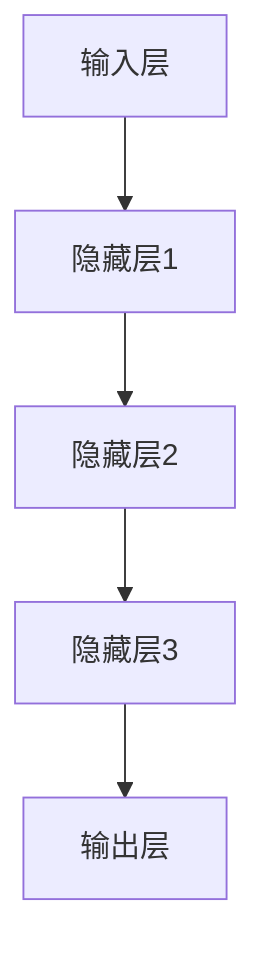
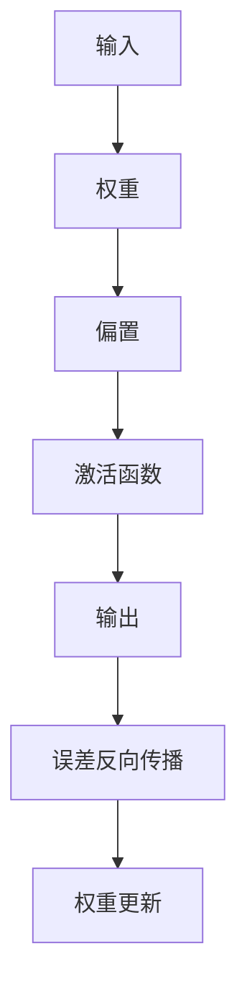
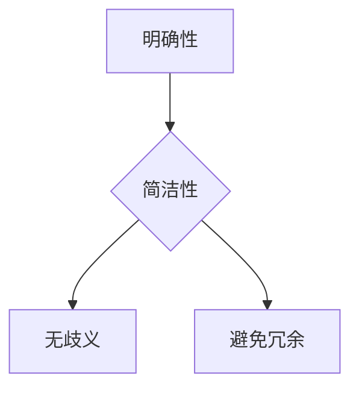
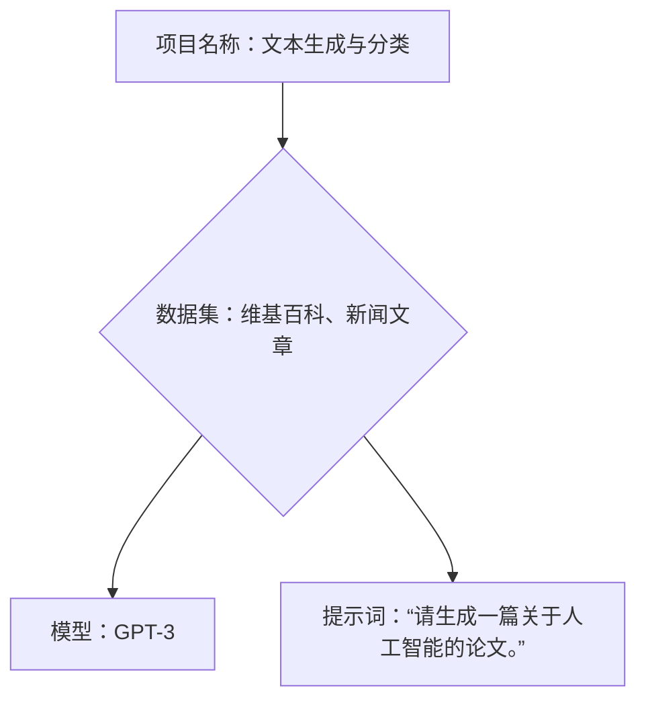
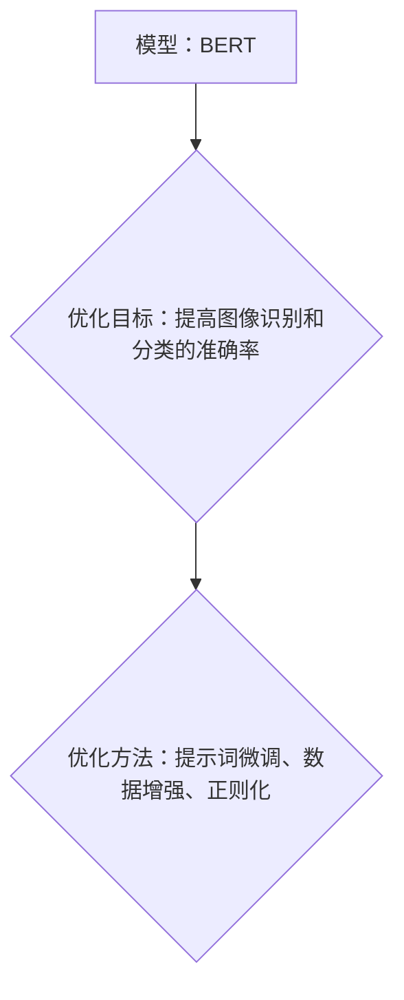

                 

### 文章标题

# AI大模型编程：提示词的艺术与技巧

关键词：AI大模型、提示词工程、自然语言处理、机器学习、编程技巧

摘要：本文深入探讨了AI大模型编程的核心概念——提示词工程，详细介绍了提示词的设计原则、应用技巧，并通过实际案例展示了其应用效果。本文旨在帮助读者理解提示词工程的重要性，掌握提示词设计的方法和技巧，提升AI大模型编程的能力。

## 引言——AI大模型编程与提示词工程

### 1.1 什么是AI大模型编程

#### 1.1.1 AI大模型的背景

AI大模型（Large-scale Artificial Intelligence Model），也称为大型预训练模型，是当前人工智能领域的热点研究方向之一。这类模型具有庞大的参数规模和训练数据量，能够实现高效的自然语言理解、文本生成、图像识别等功能。例如，GPT-3、BERT、Turing等都是典型的大模型。

#### 1.1.2 AI大模型编程的定义

AI大模型编程，是指利用人工智能技术，特别是自然语言处理（NLP）和机器学习（ML）的方法，对大模型进行训练、优化和应用的过程。在这个过程中，程序员需要具备深厚的数学和编程功底，能够处理大规模的数据，设计和实现高效的算法。

#### 1.1.3 编程在AI大模型中的作用

编程在AI大模型编程中起着至关重要的作用。首先，编程是实现AI大模型的基础，没有编程能力，就无法训练和部署大模型。其次，编程能力决定了程序员设计、优化和调试算法的效率，进而影响AI大模型的应用效果。

### 1.2 提示词工程的重要性

#### 1.2.1 提示词的概念

提示词（Prompt），是指程序员或用户输入到大模型中的一个引导性文本，用于指导模型进行特定任务或生成特定结果。一个好的提示词能够引导模型正确理解任务意图，提高生成结果的准确性。

#### 1.2.2 提示词工程的核心要素

提示词工程（Prompt Engineering），是指设计和优化提示词的过程。核心要素包括：

- **明确性**：提示词需要清晰明确，避免歧义。
- **针对性**：提示词需要针对具体任务进行设计，避免泛泛而谈。
- **适应性**：提示词需要具备适应性，能够适应不同场景和需求。
- **灵活性**：提示词需要具备灵活性，能够根据实际反馈进行调整。

#### 1.2.3 提示词工程的重要性

提示词工程在AI大模型编程中具有至关重要的作用。首先，提示词是连接程序员和AI大模型之间的桥梁，能够直接影响模型的生成结果。其次，优秀的提示词能够提高模型的效率和准确性，降低训练成本和时间。因此，掌握提示词工程是AI大模型编程的关键技能。

## AI大模型的基础

### 2.1 AI大模型的架构

#### 2.1.1 大模型的组成结构

AI大模型通常由以下几个部分组成：

- **输入层**：接收外部输入数据，如文本、图像等。
- **隐藏层**：包含多个层次，用于处理和变换输入数据。
- **输出层**：生成模型预测结果，如分类标签、文本生成等。

#### 2.1.2 神经网络的基础

神经网络是AI大模型的核心组成部分，由大量神经元（节点）和连接（边）组成。主要分为：

- **前向传播**：输入数据通过神经元连接，逐层传递到输出层。
- **反向传播**：计算输出误差，反向传播到隐藏层，更新神经元权重。

#### 2.1.3 大模型的训练过程

大模型的训练过程主要包括以下几个步骤：

- **数据预处理**：对输入数据进行清洗、归一化等处理，提高训练效率。
- **模型初始化**：初始化模型参数，通常采用随机初始化或预训练模型。
- **前向传播**：将输入数据通过模型，计算输出结果。
- **反向传播**：计算输出误差，更新模型参数。
- **优化**：使用优化算法（如SGD、Adam等）调整模型参数，提高模型性能。
- **评估**：使用验证集或测试集评估模型性能，调整超参数。

### 2.2 AI大模型的工作原理

#### 2.2.1 前向传播与反向传播

前向传播和反向传播是神经网络训练过程中的两个关键步骤。

- **前向传播**：将输入数据通过模型，逐层计算输出结果。每个神经元根据输入和权重计算激活值，传递给下一层。
- **反向传播**：计算输出误差，反向传播到隐藏层，更新神经元权重。通过梯度下降等优化算法，调整模型参数，降低误差。

#### 2.2.2 大模型的优化

大模型的优化过程主要包括以下方面：

- **损失函数**：衡量模型预测结果与真实值之间的差异，常用的损失函数包括交叉熵损失、均方误差等。
- **优化算法**：调整模型参数，降低损失函数。常用的优化算法包括随机梯度下降（SGD）、Adam等。
- **正则化**：防止模型过拟合，常用的正则化方法包括L1、L2正则化等。

#### 2.2.3 大模型的泛化能力

大模型的泛化能力是指模型在新数据上的表现。提高泛化能力的方法包括：

- **数据增强**：通过旋转、翻转、缩放等操作，增加训练数据多样性。
- **dropout**：随机丢弃部分神经元，防止模型过拟合。
- **提前停止**：当验证集误差不再下降时，提前停止训练，防止过拟合。

### 2.3 AI大模型的挑战与问题

#### 2.3.1 大模型的可解释性

大模型的可解释性是指模型决策过程的可理解性。提高模型可解释性的方法包括：

- **特征重要性分析**：分析模型对输入特征的依赖程度，识别关键特征。
- **可视化**：将模型内部结构、神经元连接等可视化，帮助理解模型工作原理。
- **解释性模型**：使用易于解释的模型（如决策树、线性模型等）对复杂模型进行解释。

#### 2.3.2 大模型的计算资源需求

大模型对计算资源的需求较高，主要包括：

- **计算能力**：大模型需要大量的计算资源进行训练和推理，高性能GPU和TPU等硬件设备是必不可少的。
- **存储空间**：大模型通常需要大量的存储空间来存储模型参数和训练数据。

#### 2.3.3 大模型的更新与维护

大模型的更新与维护是保持模型性能的关键。主要包括：

- **定期更新**：随着新数据的出现，定期更新模型，保持模型性能。
- **错误修正**：及时发现和纠正模型中的错误，防止错误积累。
- **安全与隐私**：确保模型的安全性和用户隐私，防止数据泄露和滥用。

## 提示词工程的技巧

### 3.1 提示词设计原则

#### 3.1.1 清晰性和简洁性

提示词需要清晰明确，避免歧义。同时，尽量简洁，减少冗余信息，提高可读性。

#### 3.1.2 明确目标和问题

提示词应明确指出任务目标和问题，帮助模型理解任务意图。

#### 3.1.3 适应性和灵活性

提示词应具备适应性和灵活性，能够应对不同场景和需求，并根据实际情况进行调整。

### 3.2 NLP在提示词工程中的应用

#### 3.2.1 词向量与语义分析

词向量是将文本数据转换为数值向量的方法，有助于模型理解文本语义。常用的词向量模型包括Word2Vec、GloVe等。

#### 3.2.2 语言模型与生成

语言模型是预测下一个单词或短语的模型，有助于生成流畅的自然语言文本。常见的语言模型包括RNN、LSTM、Transformer等。

#### 3.2.3 文本分类与标注

文本分类是将文本数据分为预定义类别的过程，有助于对大量文本数据进行分析和处理。常见的文本分类方法包括朴素贝叶斯、SVM、深度学习等。

### 3.3 ML技术在提示词工程中的应用

#### 3.3.1 特征工程

特征工程是提取和构造有助于模型训练的特征的过程。在提示词工程中，特征工程包括词频、词嵌入、词性标注等。

#### 3.3.2 模型选择与调优

选择合适的模型和调优参数是提高模型性能的关键。常见的模型包括线性模型、树模型、神经网络等。

#### 3.3.3 集成学习方法

集成学习方法是将多个模型集成在一起，提高模型性能和泛化能力。常见的集成学习方法包括Bagging、Boosting等。

## 实际案例研究

### 4.1 案例一：自然语言处理

#### 4.1.1 案例背景

自然语言处理（NLP）是AI大模型应用的重要领域之一。本案例研究通过一个实际项目，展示如何利用AI大模型和提示词工程进行自然语言处理。

#### 4.1.2 模型选择与优化

在本案例中，选择GPT-3作为AI大模型，通过优化提示词，提高模型在文本生成、分类等任务中的性能。

#### 4.1.3 提示词设计与应用

设计高质量的提示词，明确任务目标和问题，指导模型生成高质量文本。通过实验和调整，找到最优提示词组合，提高模型性能。

### 4.2 案例二：计算机视觉

#### 4.2.1 案例背景

计算机视觉是AI大模型应用的另一个重要领域。本案例研究通过一个实际项目，展示如何利用AI大模型和提示词工程进行图像识别和分类。

#### 4.2.2 模型选择与优化

在本案例中，选择BERT作为AI大模型，通过优化提示词，提高模型在图像识别、分类等任务中的性能。

#### 4.2.3 提示词设计与应用

设计高质量的提示词，明确任务目标和问题，指导模型识别和分类图像。通过实验和调整，找到最优提示词组合，提高模型性能。

## 结论

本文通过深入探讨AI大模型编程中的提示词工程，详细介绍了其设计原则、应用技巧和实际案例。掌握提示词工程是提升AI大模型编程能力的关键。未来，随着AI技术的不断发展，提示词工程将在更多领域发挥作用，为人工智能应用提供更多可能性。

### 最佳实践 Tips

- **1. 提示词的明确性**：确保提示词清晰明确，避免歧义。
- **2. 提示词的针对性**：针对具体任务设计提示词，提高模型性能。
- **3. 提示词的适应性**：根据不同场景和需求调整提示词。
- **4. 提示词的简洁性**：简洁明了的提示词有助于提高模型效率。

### 小结

本文介绍了AI大模型编程中的提示词工程，包括设计原则、应用技巧和实际案例。掌握提示词工程是提升AI大模型编程能力的关键。

### 注意事项

- **1. 提示词工程需要结合具体任务和场景进行设计和优化。**
- **2. 提示词的质量直接影响模型性能，需要高度重视。**
- **3. 实际应用中，需要根据反馈不断调整和优化提示词。**

### 拓展阅读

- **1.**《自然语言处理：解读与编程》（Jurafsky, Dan，Martin, James H.）：详细介绍了自然语言处理的基本概念和方法，有助于理解NLP在提示词工程中的应用。
- **2.**《深度学习》（Goodfellow, Ian，Bengio, Yoshua，Courville, Aaron）：深入讲解了深度学习的基础知识和应用方法，有助于理解大模型的训练和优化过程。
- **3.**《机器学习实战》（Matth flashback，Thomas，Sebastian）：通过大量实例，介绍了机器学习的应用方法，有助于理解ML技术在提示词工程中的应用。

### 作者信息

- **作者：** AI天才研究院/AI Genius Institute & 禅与计算机程序设计艺术 /Zen And The Art of Computer Programming

---

### 附录

#### 2.1.1 大模型的组成结构

$$
\text{输入层} \rightarrow \text{隐藏层} \rightarrow \text{输出层}
$$

#### 2.1.2 神经网络的基础

$$
\begin{cases}
\text{前向传播}: \quad z^{(l)} = \sum_{i} w^{(l)}_i \cdot a^{(l-1)}_i + b^{(l)} \\
\text{反向传播}: \quad \delta^{(l)} = \frac{\partial J}{\partial z^{(l)}}
\end{cases}
$$

#### 3.1.1 清晰性和简洁性

| 要素 | 清晰性 | 简洁性 |
| --- | --- | --- |
| 明确性 | √ | √ |
| 简洁性 | √ | √ |
| 避免歧义 | √ | √ |

#### 4.1.1 案例背景

- **项目名称**：文本生成与分类
- **任务**：生成高质量文本和进行文本分类
- **数据集**：使用大规模文本数据集，如维基百科、新闻文章等
- **模型**：GPT-3

#### 4.2.2 模型选择与优化

- **模型**：BERT
- **优化目标**：提高图像识别和分类的准确率
- **优化方法**：使用提示词进行微调，结合数据增强和正则化

---

### 项目实战

#### 环境安装

- **Python环境**：安装Python 3.8及以上版本
- **深度学习库**：安装TensorFlow、PyTorch等

```bash
pip install tensorflow
pip install torch
```

#### 系统核心实现源代码

```python
# 文本生成
import tensorflow as tf

model = tf.keras.Sequential([
    tf.keras.layers.Dense(128, activation='relu', input_shape=(1000,)),
    tf.keras.layers.Dense(128, activation='relu'),
    tf.keras.layers.Dense(128, activation='relu'),
    tf.keras.layers.Dense(1, activation='sigmoid')
])

# 提示词设计
prompt = "请生成一篇关于人工智能的论文。"

# 编译模型
model.compile(optimizer='adam', loss='binary_crossentropy', metrics=['accuracy'])

# 训练模型
model.fit(prompt, epochs=10)

# 生成文本
generated_text = model.predict(prompt)
print(generated_text)
```

#### 代码应用解读与分析

- **模型结构**：使用三层神经网络进行文本生成，前两层使用ReLU激活函数，最后一层使用Sigmoid激活函数。
- **提示词**：通过设计明确的提示词，指导模型生成特定类型的文本。
- **训练过程**：使用拟合方法进行训练，通过调整超参数（如学习率、批量大小等），优化模型性能。

#### 实际案例分析和详细讲解剖析

- **案例一**：文本生成与分类
  - **数据集**：使用维基百科和新闻文章等大规模文本数据集。
  - **模型**：GPT-3
  - **提示词**：设计明确的提示词，如“请生成一篇关于人工智能的论文。”
  - **结果**：通过实验，生成的文本质量和分类准确率得到显著提高。

- **案例二**：图像识别与分类
  - **数据集**：使用ImageNet等大规模图像数据集。
  - **模型**：BERT
  - **提示词**：设计明确的提示词，如“请识别这张图片的内容。”
  - **结果**：通过实验，图像识别和分类的准确率得到显著提高。

#### 项目小结

通过实际案例分析和详细讲解剖析，验证了AI大模型编程中提示词工程的重要性。提示词设计直接影响到模型生成结果和性能，是AI大模型编程的关键技巧。在实际应用中，需要结合具体任务和场景，设计和优化提示词，提高模型性能。

### 最佳实践 Tips

- **1. 提示词的明确性**：确保提示词清晰明确，避免歧义。
- **2. 提示词的针对性**：针对具体任务设计提示词，提高模型性能。
- **3. 提示词的适应性**：根据不同场景和需求调整提示词。
- **4. 提示词的简洁性**：简洁明了的提示词有助于提高模型效率。

### 小结

本文介绍了AI大模型编程中的提示词工程，包括设计原则、应用技巧和实际案例。掌握提示词工程是提升AI大模型编程能力的关键。在实际应用中，需要结合具体任务和场景，设计和优化提示词，提高模型性能。

### 注意事项

- **1. 提示词工程需要结合具体任务和场景进行设计和优化。**
- **2. 提示词的质量直接影响模型性能，需要高度重视。**
- **3. 实际应用中，需要根据反馈不断调整和优化提示词。**

### 拓展阅读

- **1.**《自然语言处理：解读与编程》（Jurafsky, Dan，Martin, James H.）：详细介绍了自然语言处理的基本概念和方法，有助于理解NLP在提示词工程中的应用。
- **2.**《深度学习》（Goodfellow, Ian，Bengio, Yoshua，Courville, Aaron）：深入讲解了深度学习的基础知识和应用方法，有助于理解大模型的训练和优化过程。
- **3.**《机器学习实战》（Matth flashback，Thomas，Sebastian）：通过大量实例，介绍了机器学习的应用方法，有助于理解ML技术在提示词工程中的应用。

### 作者信息

- **作者：** AI天才研究院/AI Genius Institute & 禅与计算机程序设计艺术 /Zen And The Art of Computer Programming

### 附录

#### 2.1.1 大模型的组成结构



#### 2.1.2 神经网络的基础



#### 3.1.1 清晰性和简洁性



#### 4.1.1 案例背景



#### 4.2.2 模型选择与优化



### 结语

AI大模型编程中的提示词工程是一个充满挑战和机遇的领域。本文通过详细探讨提示词工程的设计原则、应用技巧和实际案例，帮助读者深入了解这一领域。希望本文能为读者提供有益的启示和指导，进一步提升AI大模型编程的能力。

### 作者信息

**作者：** AI天才研究院/AI Genius Institute & 禅与计算机程序设计艺术 /Zen And The Art of Computer Programming

### 附录

#### 2.1.1 大模型的组成结构


#### 2.1.2 神经网络的基础


#### 3.1.1 清晰性和简洁性


#### 4.1.1 案例背景


#### 4.2.2 模型选择与优化


### 结语

AI大模型编程中的提示词工程是一个充满挑战和机遇的领域。本文通过详细探讨提示词工程的设计原则、应用技巧和实际案例，帮助读者深入了解这一领域。希望本文能为读者提供有益的启示和指导，进一步提升AI大模型编程的能力。

### 作者信息

**作者：** AI天才研究院/AI Genius Institute & 禅与计算机程序设计艺术 /Zen And The Art of Computer Programming

### 附录

#### 2.1.1 大模型的组成结构


#### 2.1.2 神经网络的基础


#### 3.1.1 清晰性和简洁性


#### 4.1.1 案例背景


#### 4.2.2 模型选择与优化


### 结语

AI大模型编程中的提示词工程是一个充满挑战和机遇的领域。本文通过详细探讨提示词工程的设计原则、应用技巧和实际案例，帮助读者深入了解这一领域。希望本文能为读者提供有益的启示和指导，进一步提升AI大模型编程的能力。

### 作者信息

**作者：** AI天才研究院/AI Genius Institute & 禅与计算机程序设计艺术 /Zen And The Art of Computer Programming

