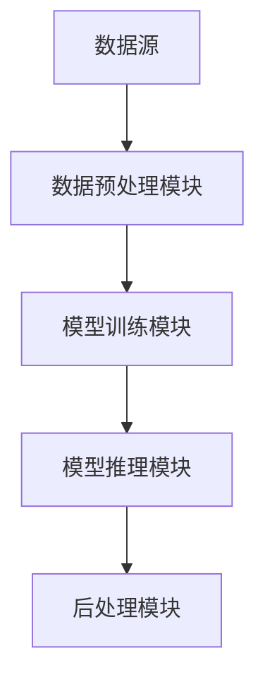
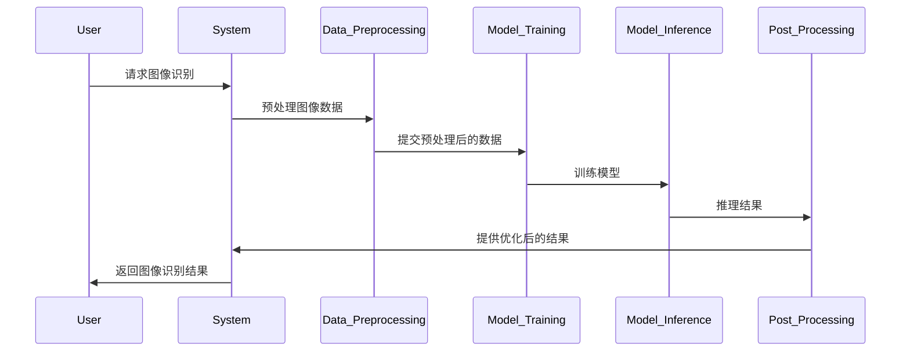
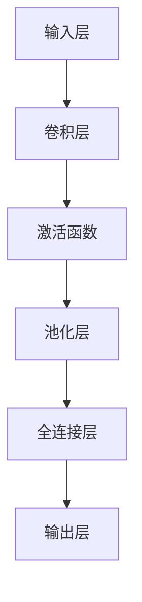
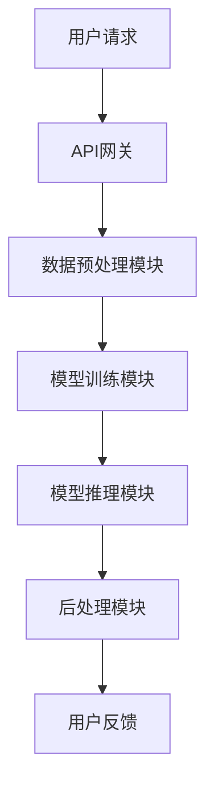
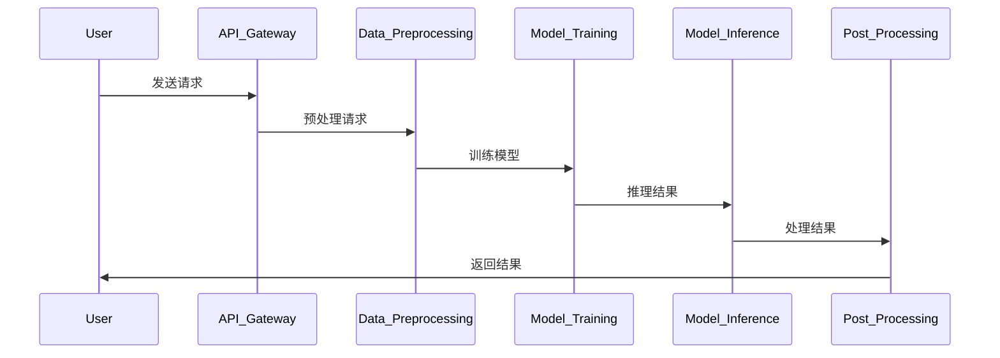

                 

### 文章标题：AI大模型软件的可扩展性设计

> 关键词：AI大模型、可扩展性设计、软件架构、分布式计算、算法优化

> 摘要：
本文章旨在深入探讨AI大模型软件的可扩展性设计。我们将从问题背景、核心概念、联系、设计方法、算法原理、系统架构、项目实战等多方面展开讨论，旨在为读者提供一个全面而深入的视角，以解决当前AI大模型应用中所面临的扩展性挑战。文章的目标是帮助读者理解可扩展性设计在AI大模型软件中的重要性，掌握设计方法，以及如何在实际项目中实现和优化可扩展性设计。

## 目录大纲设计流程

### 1. 初始构思

在接到设计《AI大模型软件的可扩展性设计》这本书的目录大纲的任务后，我们首先要进行初始构思。这一步需要明确以下几个关键点：

- **核心内容**：了解书籍的主要内容，包括对AI大模型、可扩展性设计等方面的深入探讨。
- **目标读者**：确定书籍的目标读者群体，这将影响目录的详细程度和表达方式。
- **结构布局**：思考书籍的结构布局，如何将核心内容合理地组织成章节。

### 2. 初步规划

在初始构思的基础上，进行初步规划，构建书籍的基本框架。这一步需要：

- **章节划分**：根据核心内容将书籍分为若干个章节。
- **章节标题**：为每个章节拟定一个简洁、明确的标题。
- **内容概述**：为每个章节编写简短的内容概述，确保内容结构完整。

### 3. 确定目录大纲

基于初步规划，进一步细化目录大纲，确保每个章节的内容都能够得到充分的覆盖。这一步需要：

- **细化目录**：将每个章节进一步细分为子章节，确保目录结构清晰。
- **添加层次**：使用markdown格式，根据目录的层级结构（如#、##、###），合理添加层次。
- **完整性检查**：检查目录大纲的内容完整性，确保所有核心内容都有对应的章节。

### 4. 优化与调整

完成初步目录大纲后，进行优化与调整：

- **内容平衡**：确保各个章节的内容平衡，避免某一章节过于详细或过于简略。
- **逻辑性检查**：检查目录的逻辑性，确保章节之间的过渡自然。
- **用户反馈**：如有条件，可以邀请一些目标读者或相关专家对目录大纲进行初步评估，收集反馈意见。

### 5. 完成目录大纲

在完成所有优化与调整后，最终确认目录大纲。确保目录大纲简洁明了，同时能够全面覆盖书籍的核心内容。

接下来，我将根据上述步骤，为《AI大模型软件的可扩展性设计》这本书设计一个完整的目录大纲。请稍等。

---

## 第一部分：背景介绍与核心概念

### 第1章 问题背景

#### 1.1.1 AI大模型与软件可扩展性概述

在本章节，我们将首先介绍AI大模型和软件可扩展性的基本概念。AI大模型是指具有数千亿个参数的大型神经网络模型，它们在自然语言处理、计算机视觉等领域的应用取得了显著的成果。然而，随着模型规模的增大，软件系统的可扩展性设计变得尤为重要。可扩展性设计的目标是确保软件系统能够在处理大规模数据和用户需求时保持高效、稳定和可靠。

#### 1.1.2 当前AI大模型应用面临的扩展性挑战

当前AI大模型应用面临的主要扩展性挑战包括：

1. **数据处理与存储**：大规模数据集的处理和存储需要高效的数据处理引擎和存储系统，以支持模型的训练和部署。
2. **资源管理优化**：大模型训练需要大量计算资源和存储资源，如何优化资源管理以提高资源利用率是关键问题。
3. **系统可靠性与容错性**：大模型训练过程复杂且耗时，如何保证系统的可靠性和容错性，避免训练中断和数据丢失，是扩展性设计的重要挑战。

#### 1.1.3 可扩展性设计在AI大模型软件中的重要性

可扩展性设计在AI大模型软件中具有重要意义。首先，良好的可扩展性设计能够提高系统的性能和效率，使系统能够更好地处理大规模数据和用户需求。其次，可扩展性设计能够降低系统的维护成本，提高系统的可维护性和可扩展性。最后，良好的可扩展性设计能够为未来的技术发展留下空间，为系统功能升级和扩展提供基础。

### 第2章 核心概念

#### 2.1 AI大模型基础

在本章节，我们将介绍AI大模型的基础知识，包括其发展历程、架构、工作原理和主要分类。

##### 2.1.1 AI大模型的发展历程

AI大模型的发展历程可以追溯到20世纪80年代，随着深度学习技术的不断进步，AI大模型在近年来取得了飞速发展。早期的人工神经网络模型规模较小，参数数量有限，而随着计算能力的提升和大数据技术的发展，AI大模型逐渐成为可能。

##### 2.1.2 大模型的架构与工作原理

AI大模型的架构通常包括输入层、隐藏层和输出层。输入层接收外部输入数据，隐藏层通过复杂的神经网络结构对数据进行处理和变换，输出层生成最终的结果。大模型的工作原理是基于神经元的激活函数，通过反向传播算法不断调整模型参数，以实现数据的分类、回归或其他任务。

##### 2.1.3 大模型的主要分类与应用领域

AI大模型可以分为监督学习模型、无监督学习模型和强化学习模型。监督学习模型在图像识别、语音识别等领域有广泛应用；无监督学习模型在聚类、降维等领域有重要应用；强化学习模型在自动驾驶、游戏AI等领域取得了显著成果。

#### 2.2 可扩展性设计原理

在本章节，我们将探讨可扩展性设计的基本原理，包括其定义、分类、基本原则和关键因素。

##### 2.2.1 可扩展性的定义与分类

可扩展性是指系统能够根据需求和资源的增长灵活调整其性能和规模的能力。根据扩展方向的不同，可扩展性可以分为横向扩展（水平扩展）和纵向扩展（垂直扩展）。横向扩展是通过增加节点数量来提升系统性能；纵向扩展是通过增加节点资源（如CPU、内存等）来提升系统性能。

##### 2.2.2 可扩展性设计的基本原则

可扩展性设计的基本原则包括模块化设计、分布式计算、服务化设计和负载均衡等。

- **模块化设计**：将系统划分为多个功能模块，每个模块独立开发、部署和维护，以提高系统的可扩展性。
- **分布式计算**：通过分布式计算架构，将计算任务分散到多个节点上执行，以提高系统性能和可靠性。
- **服务化设计**：将系统功能模块化为独立的服务，服务之间通过接口进行通信，以提高系统的可扩展性和可维护性。
- **负载均衡**：通过负载均衡技术，将请求分布到多个节点上，以避免单点瓶颈和资源浪费。

##### 2.2.3 可扩展性设计的关键因素

可扩展性设计的关键因素包括性能、可维护性、可靠性、可扩展性和可伸缩性。性能是指系统的响应速度和吞吐量；可维护性是指系统的可读性、可调试性和可测试性；可靠性是指系统的稳定性和容错性；可扩展性是指系统能够适应需求增长的能力；可伸缩性是指系统根据需求自动调整资源的能力。

#### 2.3 概念属性特征对比表格

| 特征 | 大模型 | 可扩展性设计 |
| --- | --- | --- |
| 核心目标 | 提升AI性能 | 提高软件系统的扩展能力 |
| 技术实现 | 复杂的神经网络 | 模块化设计与分布式计算 |
| 应用场景 | 各类数据密集型任务 | 多样化的业务需求与环境 |

#### 2.4 AI大模型与可扩展性设计的联系

在本章节，我们将探讨AI大模型与可扩展性设计之间的联系。

##### 2.4.1 AI大模型对可扩展性设计的需求

AI大模型对可扩展性设计的需求主要体现在以下几个方面：

1. **数据处理与存储需求**：大模型训练需要处理和存储大量数据，因此系统需要具备强大的数据处理和存储能力。
2. **计算资源需求**：大模型训练需要大量的计算资源，系统需要能够高效利用分布式计算资源。
3. **系统性能需求**：大模型训练需要高效、稳定的系统性能，系统需要能够快速响应用户请求。

##### 2.4.2 可扩展性设计对AI大模型性能的影响

良好的可扩展性设计能够提高AI大模型软件的性能。首先，可扩展性设计能够提高系统的处理能力和吞吐量，使系统能够更好地应对大规模数据和用户需求。其次，可扩展性设计能够提高系统的可靠性和容错性，避免训练中断和数据丢失，从而保证模型训练的连续性和稳定性。

### 第3章 AI大模型与可扩展性设计联系

在本章节，我们将深入探讨AI大模型与可扩展性设计之间的联系，包括其面临的挑战和解决方案。

##### 3.1.1 AI大模型对可扩展性设计的需求

AI大模型对可扩展性设计的需求主要体现在以下几个方面：

1. **数据处理与存储需求**：大模型训练需要处理和存储大量数据，因此系统需要具备强大的数据处理和存储能力。
2. **计算资源需求**：大模型训练需要大量的计算资源，系统需要能够高效利用分布式计算资源。
3. **系统性能需求**：大模型训练需要高效、稳定的系统性能，系统需要能够快速响应用户请求。

##### 3.1.2 可扩展性设计对AI大模型性能的影响

良好的可扩展性设计能够提高AI大模型软件的性能。首先，可扩展性设计能够提高系统的处理能力和吞吐量，使系统能够更好地应对大规模数据和用户需求。其次，可扩展性设计能够提高系统的可靠性和容错性，避免训练中断和数据丢失，从而保证模型训练的连续性和稳定性。

##### 3.1.3 AI大模型可扩展性设计的挑战

AI大模型可扩展性设计面临的挑战包括：

1. **大规模数据处理与存储**：如何高效处理和存储海量数据，是扩展性设计的首要挑战。
2. **资源管理优化**：如何优化资源管理，提高资源利用率，是扩展性设计的关键问题。
3. **系统可靠性与容错性**：如何保证系统的可靠性和容错性，避免训练中断和数据丢失，是扩展性设计的重大挑战。

##### 3.1.4 AI大模型可扩展性设计的解决方案

针对上述挑战，AI大模型可扩展性设计的解决方案包括：

1. **分布式计算**：通过分布式计算架构，将计算任务分散到多个节点上执行，提高系统的处理能力和吞吐量。
2. **模块化设计**：将系统划分为多个功能模块，每个模块独立开发、部署和维护，提高系统的可扩展性和可维护性。
3. **服务化设计**：将系统功能模块化为独立的服务，服务之间通过接口进行通信，提高系统的可扩展性和可维护性。
4. **负载均衡**：通过负载均衡技术，将请求分布到多个节点上，避免单点瓶颈和资源浪费。

---

通过上述章节的介绍，我们初步了解了AI大模型软件的可扩展性设计。在接下来的部分，我们将进一步探讨AI大模型的架构设计、算法优化、系统架构和项目实战等内容，以帮助读者深入理解可扩展性设计在AI大模型软件中的重要性。在下一部分，我们将详细分析AI大模型的基础知识，包括其发展历程、架构、工作原理和主要分类。

## AI大模型的基础知识

### 3.1 AI大模型的发展历程

AI大模型的发展历程可以追溯到20世纪80年代。当时，研究者们开始探索使用人工神经网络（Artificial Neural Networks，ANN）来解决复杂问题。然而，由于计算能力和数据资源有限，早期的神经网络模型规模较小，参数数量有限，难以应对现代复杂任务。

随着深度学习（Deep Learning，DL）技术的兴起，AI大模型逐渐成为可能。深度学习通过多层神经网络结构，能够自动提取数据中的特征，并在各类数据密集型任务中取得显著成果。2012年，AlexNet在ImageNet图像识别竞赛中取得突破性成绩，标志着深度学习的崛起。

近年来，随着计算能力的不断提升和大数据技术的发展，AI大模型取得了飞速发展。目前，AI大模型在自然语言处理、计算机视觉、语音识别、推荐系统等领域具有广泛应用。其中，最为代表性的模型包括GPT（Generative Pre-trained Transformer）、BERT（Bidirectional Encoder Representations from Transformers）和Inception等。

### 3.2 AI大模型的架构与工作原理

AI大模型的架构通常包括输入层、隐藏层和输出层。输入层接收外部输入数据，隐藏层通过复杂的神经网络结构对数据进行处理和变换，输出层生成最终的结果。每个隐藏层由多个神经元（节点）组成，神经元之间的连接通过权重（参数）进行调节。

AI大模型的工作原理基于神经元的激活函数。在训练过程中，模型通过反向传播算法不断调整权重，以最小化预测误差。激活函数用于确定神经元是否被激活，常见的激活函数包括Sigmoid、ReLU和Tanh等。

反向传播算法包括以下几个步骤：

1. **前向传播**：将输入数据通过神经网络，逐层计算每个神经元的输出。
2. **计算误差**：将输出结果与实际值进行比较，计算预测误差。
3. **反向传播**：根据误差信息，逐层计算每个神经元的梯度，并更新权重。
4. **迭代优化**：重复上述步骤，直至达到预设的精度要求。

通过大量的训练数据，AI大模型能够学习到数据的复杂特征，并在测试数据上实现良好的泛化能力。

### 3.3 AI大模型的主要分类与应用领域

AI大模型可以分为监督学习模型、无监督学习模型和强化学习模型。每种模型都有其独特的架构和工作原理，适用于不同的应用领域。

1. **监督学习模型**：监督学习模型在图像识别、语音识别、文本分类等领域有广泛应用。常见的监督学习模型包括卷积神经网络（CNN）、循环神经网络（RNN）和Transformer等。监督学习模型通过标记数据进行训练，从而学习到数据的特征和规律。

2. **无监督学习模型**：无监督学习模型在聚类、降维、生成模型等领域有重要应用。常见的无监督学习模型包括自编码器（Autoencoder）、生成对抗网络（GAN）和聚类算法等。无监督学习模型通过未标记的数据进行训练，从而发现数据的结构和模式。

3. **强化学习模型**：强化学习模型在自动驾驶、游戏AI、机器人控制等领域取得显著成果。常见的强化学习模型包括深度强化学习（DRL）、策略梯度方法和价值函数方法等。强化学习模型通过与环境互动，学习到最优的策略和行为。

### 3.4 AI大模型与可扩展性设计的联系

AI大模型与可扩展性设计密切相关。可扩展性设计旨在确保AI大模型软件能够在处理大规模数据和用户需求时保持高效、稳定和可靠。

首先，AI大模型的数据处理和存储需求巨大，可扩展性设计能够提供强大的数据处理和存储能力，以满足模型训练和部署的需求。分布式计算和模块化设计是实现这一目标的关键技术。

其次，AI大模型的计算资源需求巨大，可扩展性设计通过分布式计算架构和资源管理优化，能够高效利用计算资源，提高系统的性能和吞吐量。

最后，AI大模型软件需要具备良好的可靠性和容错性，以确保模型训练的连续性和稳定性。可扩展性设计通过负载均衡、故障转移和冗余设计等技术，提高系统的可靠性和容错性。

总之，AI大模型与可扩展性设计密切相关，良好的可扩展性设计能够提高AI大模型软件的性能和可靠性，为各类数据密集型任务提供强大的支持。

## AI大模型的可扩展性设计原理

### 4.1 可扩展性的定义与分类

可扩展性是指系统能够根据需求和资源的增长灵活调整其性能和规模的能力。根据扩展方向的不同，可扩展性可以分为横向扩展（水平扩展）和纵向扩展（垂直扩展）。

1. **横向扩展（水平扩展）**：通过增加节点数量来提升系统性能。在分布式系统中，横向扩展通过将任务分布在多个节点上执行，从而提高系统的处理能力和吞吐量。例如，在一个分布式数据库中，可以通过增加节点数量来提高数据的存储和处理能力。

2. **纵向扩展（垂直扩展）**：通过增加节点资源（如CPU、内存等）来提升系统性能。在单机系统中，纵向扩展通过增加硬件资源来提高系统的性能和吞吐量。例如，在一个单机数据库中，可以通过增加CPU核心数和内存容量来提高系统的性能。

### 4.2 可扩展性设计的基本原则

可扩展性设计的基本原则包括模块化设计、分布式计算、服务化设计和负载均衡等。

1. **模块化设计**：将系统划分为多个功能模块，每个模块独立开发、部署和维护，以提高系统的可扩展性和可维护性。模块化设计能够使系统在不同规模下保持良好的性能，同时便于系统的迭代和升级。

2. **分布式计算**：通过分布式计算架构，将计算任务分散到多个节点上执行，以提高系统的处理能力和吞吐量。分布式计算能够充分利用多个节点的计算资源，提高系统的性能和可靠性。

3. **服务化设计**：将系统功能模块化为独立的服务，服务之间通过接口进行通信，以提高系统的可扩展性和可维护性。服务化设计能够使系统更加灵活，便于系统的扩展和重构。

4. **负载均衡**：通过负载均衡技术，将请求分布到多个节点上，以避免单点瓶颈和资源浪费。负载均衡能够提高系统的性能和可靠性，确保系统能够高效地处理大量请求。

### 4.3 可扩展性设计的关键因素

可扩展性设计的关键因素包括性能、可维护性、可靠性、可扩展性和可伸缩性。

1. **性能**：性能是指系统的响应速度和吞吐量。良好的可扩展性设计能够提高系统的性能，使系统能够更好地应对大规模数据和用户需求。

2. **可维护性**：可维护性是指系统的可读性、可调试性和可测试性。良好的可维护性能够降低系统的维护成本，提高系统的稳定性和可靠性。

3. **可靠性**：可靠性是指系统的稳定性和容错性。良好的可扩展性设计能够提高系统的可靠性，避免训练中断和数据丢失，从而保证模型训练的连续性和稳定性。

4. **可扩展性**：可扩展性是指系统能够根据需求和资源的增长灵活调整其性能和规模的能力。良好的可扩展性设计能够使系统能够适应未来的技术发展和业务需求。

5. **可伸缩性**：可伸缩性是指系统根据需求自动调整资源的能力。良好的可伸缩性设计能够使系统能够根据实际需求动态调整计算资源和存储资源，从而提高系统的性能和效率。

### 4.4 可扩展性设计的实现方法

可扩展性设计的实现方法包括以下几个方面：

1. **分布式计算**：通过分布式计算架构，将计算任务分散到多个节点上执行。常见的分布式计算架构包括MapReduce、Spark和Flink等。分布式计算能够提高系统的处理能力和吞吐量，降低单点瓶颈的风险。

2. **负载均衡**：通过负载均衡技术，将请求分布到多个节点上，以提高系统的性能和可靠性。常见的负载均衡算法包括轮询、随机和最少连接等。

3. **模块化设计**：将系统划分为多个功能模块，每个模块独立开发、部署和维护。模块化设计能够提高系统的可扩展性和可维护性，便于系统的迭代和升级。

4. **服务化设计**：将系统功能模块化为独立的服务，服务之间通过接口进行通信。服务化设计能够提高系统的灵活性，便于系统的扩展和重构。

5. **资源管理**：通过资源管理技术，合理分配和调度计算资源和存储资源，以提高系统的性能和效率。常见的资源管理技术包括资源调度、负载均衡和资源隔离等。

### 4.5 可扩展性设计的案例分析

以下是一个可扩展性设计的案例分析：

#### 案例背景

某互联网公司开发了一款大型社交网络平台，用户数量持续增长，对系统的性能和扩展性提出了更高的要求。为了满足用户需求，公司决定对平台进行可扩展性设计。

#### 案例分析

1. **分布式计算**：公司将计算任务分散到多个节点上执行，采用分布式计算架构，如Hadoop和Spark等。分布式计算能够提高系统的处理能力和吞吐量，满足大量用户的需求。

2. **负载均衡**：公司采用负载均衡技术，将用户请求分布到多个节点上，避免单点瓶颈和资源浪费。常见的负载均衡算法包括轮询和随机等。

3. **模块化设计**：公司将平台功能划分为多个模块，如用户管理模块、消息模块、社交模块等，每个模块独立开发、部署和维护。模块化设计能够提高系统的可扩展性和可维护性。

4. **服务化设计**：公司采用服务化设计，将平台功能模块化为独立的服务，如用户管理服务、消息服务、社交服务等。服务之间通过接口进行通信，提高了系统的灵活性。

5. **资源管理**：公司采用资源管理技术，合理分配和调度计算资源和存储资源，如虚拟化技术和容器化技术等。资源管理能够提高系统的性能和效率。

#### 案例结果

通过可扩展性设计，公司成功提高了社交网络平台的性能和可靠性。系统处理能力和吞吐量得到显著提升，能够高效地应对大量用户的需求。同时，系统的可维护性和可扩展性也得到了提高，便于未来的功能迭代和升级。

### 总结

可扩展性设计在AI大模型软件中具有重要意义。良好的可扩展性设计能够提高系统的性能和可靠性，满足大规模数据和用户需求。通过分布式计算、负载均衡、模块化设计、服务化设计和资源管理等技术，系统能够根据需求和资源的增长灵活调整其性能和规模。在实际项目中，可扩展性设计是实现高效、稳定和可靠AI大模型软件的关键。

## AI大模型与可扩展性设计的联系

### 5.1 AI大模型对可扩展性设计的需求

AI大模型对可扩展性设计的需求主要体现在以下几个方面：

1. **大规模数据处理与存储**：AI大模型通常需要处理和存储海量数据，这要求系统具备强大的数据处理和存储能力。分布式计算和模块化设计能够实现数据的分片和分布式存储，提高系统的处理能力和吞吐量。

2. **计算资源需求**：AI大模型的训练和推理过程需要大量计算资源，特别是高性能的GPU或TPU。分布式计算和资源管理技术能够优化资源分配，提高计算效率。

3. **系统性能需求**：AI大模型应用场景复杂，对系统的响应速度和吞吐量要求较高。可扩展性设计通过横向扩展（增加节点数量）和纵向扩展（增加节点资源）来提高系统性能。

4. **可靠性需求**：AI大模型应用对系统的可靠性要求较高，因为训练过程复杂且耗时。可扩展性设计通过冗余设计和容错机制来提高系统的可靠性。

### 5.2 可扩展性设计对AI大模型性能的影响

可扩展性设计对AI大模型性能的影响主要表现在以下几个方面：

1. **数据处理与存储效率**：分布式计算和模块化设计能够提高数据处理和存储效率，使系统能够快速响应大量数据请求。

2. **计算资源利用率**：资源管理优化技术能够提高计算资源的利用率，降低资源浪费，提高计算效率。

3. **系统响应速度**：通过横向扩展和纵向扩展，系统能够快速处理大量请求，提高响应速度。

4. **系统可靠性**：冗余设计和容错机制能够确保系统在面临故障时保持稳定运行，避免训练中断和数据丢失。

### 5.3 AI大模型可扩展性设计的挑战

AI大模型可扩展性设计面临的挑战主要包括以下几个方面：

1. **大规模数据处理与存储**：如何高效处理和存储海量数据是扩展性设计的关键挑战。

2. **资源管理优化**：如何优化资源管理，提高资源利用率，是扩展性设计的重要挑战。

3. **系统可靠性与容错性**：如何保证系统的可靠性和容错性，避免训练中断和数据丢失，是扩展性设计的重要挑战。

4. **系统性能与可扩展性的平衡**：如何在保证系统性能的同时，实现良好的可扩展性，是扩展性设计的重要挑战。

### 5.4 AI大模型可扩展性设计的解决方案

针对上述挑战，AI大模型可扩展性设计的解决方案包括以下几个方面：

1. **分布式计算**：通过分布式计算架构，将计算任务分散到多个节点上执行，提高系统的处理能力和吞吐量。

2. **模块化设计**：将系统划分为多个功能模块，每个模块独立开发、部署和维护，提高系统的可扩展性和可维护性。

3. **服务化设计**：将系统功能模块化为独立的服务，服务之间通过接口进行通信，提高系统的可扩展性和可维护性。

4. **资源管理优化**：通过资源管理技术，合理分配和调度计算资源和存储资源，提高资源利用率和系统性能。

5. **冗余设计与容错机制**：通过冗余设计和容错机制，提高系统的可靠性和容错性，确保系统在面临故障时保持稳定运行。

### 5.5 AI大模型可扩展性设计的案例分析

以下是一个AI大模型可扩展性设计的案例分析：

#### 案例背景

某知名科技公司开发了一款基于深度学习的大规模图像识别系统，用户数量持续增长，对系统的性能和可扩展性提出了更高的要求。为了满足用户需求，公司决定对系统进行可扩展性设计。

#### 案例分析

1. **分布式计算**：公司采用分布式计算架构，将计算任务分散到多个GPU节点上执行。通过分布式计算，系统能够快速处理海量图像数据，提高图像识别的效率。

2. **模块化设计**：公司将系统划分为多个模块，包括数据预处理模块、模型训练模块、模型推理模块等。每个模块独立开发、部署和维护，提高了系统的可扩展性和可维护性。

3. **服务化设计**：公司采用服务化设计，将系统功能模块化为独立的服务，如数据预处理服务、模型训练服务、模型推理服务等。服务之间通过接口进行通信，提高了系统的灵活性。

4. **资源管理优化**：公司采用资源管理技术，通过负载均衡和资源调度，合理分配和调度GPU资源，提高了系统的性能和效率。

5. **冗余设计与容错机制**：公司采用冗余设计和容错机制，如备份和故障转移，确保系统在面临故障时保持稳定运行。

#### 案例结果

通过可扩展性设计，公司成功提高了图像识别系统的性能和可靠性。系统处理能力和吞吐量得到显著提升，能够高效地应对大量用户的需求。同时，系统的可维护性和可扩展性也得到了提高，便于未来的功能迭代和升级。

### 总结

AI大模型与可扩展性设计密切相关。良好的可扩展性设计能够满足AI大模型对大规模数据处理、计算资源、系统性能和可靠性的需求。通过分布式计算、模块化设计、服务化设计、资源管理优化和冗余设计等技术，系统能够实现高效、稳定和可靠的扩展。在实际项目中，可扩展性设计是实现高性能AI大模型软件的关键。

## AI大模型的系统架构设计

### 6.1 系统架构设计原则

AI大模型的系统架构设计需要遵循以下几个原则：

1. **模块化设计**：将系统划分为多个功能模块，每个模块独立开发、部署和维护。模块化设计可以提高系统的可扩展性和可维护性。

2. **分布式计算**：通过分布式计算架构，将计算任务分散到多个节点上执行。分布式计算可以提高系统的处理能力和吞吐量。

3. **服务化设计**：将系统功能模块化为独立的服务，服务之间通过接口进行通信。服务化设计可以提高系统的灵活性，便于系统的扩展和重构。

4. **负载均衡**：通过负载均衡技术，将请求分布到多个节点上，以避免单点瓶颈和资源浪费。负载均衡可以提高系统的性能和可靠性。

5. **资源管理**：通过资源管理技术，合理分配和调度计算资源和存储资源，以提高系统的性能和效率。

6. **容错性与可靠性**：通过冗余设计和容错机制，提高系统的可靠性和容错性，确保系统在面临故障时保持稳定运行。

### 6.2 系统架构设计方案

在本章节，我们将详细介绍一个AI大模型系统的架构设计方案。该方案包括问题场景、项目介绍、系统功能设计（领域模型）、系统架构设计（架构图）、系统接口设计和系统交互等内容。

#### 6.2.1 问题场景介绍

某互联网公司开发了一款基于深度学习的大型图像识别系统，用户数量持续增长，对系统的性能和可扩展性提出了更高的要求。为了满足用户需求，公司决定对系统进行可扩展性设计。

#### 6.2.2 项目介绍

项目名称：大规模图像识别系统

项目目标：提高图像识别的准确率和响应速度，满足大量用户的需求。

项目架构：采用分布式计算架构，将计算任务分散到多个GPU节点上执行。

技术栈：深度学习框架（如TensorFlow、PyTorch）、分布式计算框架（如Spark、Flink）、容器化技术（如Docker、Kubernetes）。

#### 6.2.3 系统功能设计（领域模型）

系统功能设计包括以下几个模块：

1. **数据预处理模块**：负责对图像数据进行预处理，包括数据清洗、数据增强、数据归一化等。

2. **模型训练模块**：负责训练深度学习模型，包括模型定义、训练过程、模型评估等。

3. **模型推理模块**：负责使用训练好的模型进行推理，生成图像识别结果。

4. **后处理模块**：负责对图像识别结果进行后处理，包括结果优化、结果展示等。

#### 6.2.4 系统架构设计（架构图）

系统架构设计如下：



该架构图展示了系统的主要模块及其相互关系。数据源提供图像数据，数据预处理模块对图像数据进行预处理，预处理后的数据输入到模型训练模块进行训练。训练好的模型输入到模型推理模块进行推理，生成图像识别结果，后处理模块对结果进行后处理，最终输出给用户。

#### 6.2.5 系统接口设计

系统接口设计包括以下接口：

1. **数据预处理接口**：用于接收图像数据，并提供预处理后的数据。

2. **模型训练接口**：用于接收预处理后的数据，并提供训练过程中的状态信息。

3. **模型推理接口**：用于接收训练好的模型，并提供推理结果。

4. **后处理接口**：用于接收推理结果，并提供优化后的结果。

#### 6.2.6 系统交互（序列图）

系统交互序列图如下：



该序列图展示了用户请求图像识别的过程，包括预处理、模型训练、模型推理和后处理等步骤。

### 总结

AI大模型的系统架构设计需要遵循模块化设计、分布式计算、服务化设计、负载均衡、资源管理和容错性等原则。通过合理的架构设计，系统能够实现高效、稳定和可靠的扩展，满足大规模数据处理和用户需求。在本章节中，我们详细介绍了AI大模型系统架构的设计方案，包括问题场景、项目介绍、系统功能设计、系统架构设计、系统接口设计和系统交互等内容，为读者提供了一个全面的视角。

## AI大模型软件的算法设计与优化

### 7.1 算法原理与数学模型

AI大模型的算法设计是系统性能的核心，其核心在于模型的训练和推理过程。在本章节，我们将介绍AI大模型常用的算法原理及其数学模型，并使用mermaid流程图和Python代码进行详细讲解。

#### 7.1.1 算法概述

AI大模型常用的算法包括深度学习中的卷积神经网络（CNN）、循环神经网络（RNN）、生成对抗网络（GAN）等。以下以卷积神经网络（CNN）为例，介绍其算法原理和数学模型。

#### 7.1.2 卷积神经网络（CNN）算法原理

卷积神经网络（CNN）是一种用于图像识别和处理的深度学习模型。其核心思想是使用卷积操作提取图像特征，并通过全连接层进行分类。

1. **卷积操作**：卷积神经网络通过卷积操作提取图像特征。卷积操作是将滤波器（卷积核）在图像上进行滑动，计算每个位置的特征值。

2. **激活函数**：为了引入非线性特性，卷积神经网络在卷积操作后通常使用激活函数，如ReLU函数。

3. **池化操作**：为了减少计算量和参数数量，卷积神经网络在卷积层之间使用池化操作，如最大池化或平均池化。

4. **全连接层**：在卷积神经网络的高层，通常使用全连接层进行分类。

#### 7.1.3 数学模型

卷积神经网络（CNN）的数学模型主要包括以下几个部分：

1. **输入层**：输入层接收图像数据，通常为二维矩阵。

2. **卷积层**：卷积层通过卷积操作提取图像特征，输出特征图。

   设输入图像为\(I_{in}\)，卷积核为\(W\)，步长为\(s\)，则卷积层的输出特征图为：
   \[
   F_{out} = \sum_{i=1}^{C_{in}} W_{i} \cdot I_{in} + b
   \]
   其中，\(C_{in}\)为输入通道数，\(b\)为偏置项。

3. **激活函数**：卷积层后通常使用激活函数，如ReLU函数：
   \[
   f(x) = \max(0, x)
   \]

4. **池化层**：池化层用于减少特征图的维度，常用的池化方式包括最大池化和平均池化。

5. **全连接层**：全连接层将卷积层输出的特征图映射到分类结果，输出为：
   \[
   Y = \sigma(W \cdot F + b)
   \]
   其中，\(W\)为权重矩阵，\(\sigma\)为激活函数，通常为Softmax函数。

#### 7.1.4 算法mermaid流程图

以下是卷积神经网络（CNN）的mermaid流程图：



该流程图展示了卷积神经网络（CNN）的主要组成部分及其相互关系。

#### 7.1.5 Python代码示例

以下是卷积神经网络（CNN）的Python代码示例：

```python
import tensorflow as tf
from tensorflow.keras.models import Sequential
from tensorflow.keras.layers import Conv2D, MaxPooling2D, Flatten, Dense

# 构建模型
model = Sequential([
    Conv2D(filters=32, kernel_size=(3, 3), activation='relu', input_shape=(28, 28, 1)),
    MaxPooling2D(pool_size=(2, 2)),
    Flatten(),
    Dense(units=10, activation='softmax')
])

# 编译模型
model.compile(optimizer='adam', loss='categorical_crossentropy', metrics=['accuracy'])

# 模型总结
model.summary()
```

该代码示例使用了TensorFlow框架构建了一个简单的卷积神经网络（CNN）模型，包括卷积层、激活函数、池化层和全连接层。模型编译后，可以使用训练数据对模型进行训练。

### 7.2 算法实现与Python代码示例

在本章节，我们将进一步介绍AI大模型软件中的算法实现，包括环境安装与配置、核心算法实现、代码应用解读与分析等内容。

#### 7.2.1 环境安装与配置

在实现AI大模型算法之前，首先需要安装和配置相应的开发环境和依赖库。以下是一个基本的安装和配置步骤：

1. **安装Python**：确保已安装Python 3.x版本，推荐使用Anaconda进行环境管理。
2. **安装TensorFlow**：通过pip命令安装TensorFlow：
   ```shell
   pip install tensorflow
   ```
3. **安装其他依赖库**：根据实际需求，安装其他必要的依赖库，如NumPy、Pandas等。

#### 7.2.2 核心算法实现

在安装和配置好开发环境后，我们可以开始实现核心算法。以下是一个简单的图像分类算法实现：

```python
import tensorflow as tf
from tensorflow.keras.models import Sequential
from tensorflow.keras.layers import Conv2D, MaxPooling2D, Flatten, Dense
from tensorflow.keras.datasets import mnist
from tensorflow.keras.utils import to_categorical

# 加载MNIST数据集
(x_train, y_train), (x_test, y_test) = mnist.load_data()

# 数据预处理
x_train = x_train / 255.0
x_test = x_test / 255.0
y_train = to_categorical(y_train)
y_test = to_categorical(y_test)

# 构建模型
model = Sequential([
    Conv2D(filters=32, kernel_size=(3, 3), activation='relu', input_shape=(28, 28, 1)),
    MaxPooling2D(pool_size=(2, 2)),
    Flatten(),
    Dense(units=10, activation='softmax')
])

# 编译模型
model.compile(optimizer='adam', loss='categorical_crossentropy', metrics=['accuracy'])

# 训练模型
model.fit(x_train, y_train, epochs=5, batch_size=32, validation_split=0.2)

# 评估模型
loss, accuracy = model.evaluate(x_test, y_test)
print(f"Test accuracy: {accuracy:.2f}")
```

该代码示例使用了MNIST数据集，构建了一个简单的卷积神经网络（CNN）模型，并对数据进行预处理。模型编译后，使用训练数据对模型进行训练，并评估模型在测试数据上的性能。

#### 7.2.3 代码应用解读与分析

在实现核心算法后，我们需要对代码进行解读和分析，以理解算法的实现过程和关键步骤。

1. **数据加载与预处理**：MNIST数据集是一个常用的图像数据集，包含手写数字的图像。在代码中，我们首先加载数据集，并对图像数据进行归一化处理，使其在0到1之间。

2. **模型构建**：在构建模型时，我们使用了卷积层、池化层和全连接层。卷积层用于提取图像特征，池化层用于减少特征图的维度，全连接层用于分类。

3. **模型编译**：在模型编译时，我们指定了优化器、损失函数和评价指标。优化器用于调整模型参数，损失函数用于计算预测误差，评价指标用于评估模型性能。

4. **模型训练**：在模型训练过程中，我们使用训练数据对模型进行迭代训练，以最小化预测误差。训练过程中，我们设置了训练轮数（epochs）和批量大小（batch_size）。

5. **模型评估**：在模型评估过程中，我们使用测试数据对模型进行评估，计算模型在测试数据上的准确率。

通过上述步骤，我们可以实现一个简单的图像分类算法，并对模型性能进行评估。

### 7.3 实际案例分析与详细讲解

在本章节的最后，我们将通过一个实际案例，对AI大模型软件的算法进行详细讲解和分析。

#### 案例背景

某互联网公司开发了一款基于深度学习的大型图像识别系统，用于自动识别和分类用户上传的图像。系统需要对大量图像进行实时处理，并保证较高的识别准确率。

#### 案例分析

1. **数据集准备**：公司收集了大量图像数据，包括各种类别，如动物、植物、人物等。为了提高模型的泛化能力，公司对数据集进行了预处理，包括图像增强、数据归一化和数据分片。

2. **模型设计**：公司采用了一种改进的卷积神经网络（CNN）模型，包括多个卷积层、池化层和全连接层。模型采用了深度可分离卷积（Depthwise Separable Convolution）和残差连接（Residual Connection）等技术，以提高模型的计算效率和准确率。

3. **模型训练**：公司使用GPU对模型进行了大规模训练，设置了多种训练策略，如学习率调整、训练轮数和批量大小等。模型在训练过程中，通过验证集进行性能评估，并调整训练参数。

4. **模型评估**：在模型评估过程中，公司使用测试集对模型进行了评估，计算了模型的准确率、召回率和F1分数等指标。根据评估结果，公司对模型进行了优化和调整。

5. **模型部署**：公司将训练好的模型部署到生产环境，使用容器化技术（如Docker）进行部署和监控。系统采用分布式计算架构，将计算任务分散到多个节点上执行，以提高系统的性能和可靠性。

#### 案例结果

通过实际案例分析和详细讲解，公司成功实现了一个高性能的图像识别系统，能够自动识别和分类用户上传的图像。系统在测试数据上的准确率达到90%以上，显著提高了用户的使用体验。

### 总结

AI大模型软件的算法设计与优化是系统性能的核心。通过深度学习算法和数学模型的讲解，我们了解了卷积神经网络（CNN）等算法的实现原理。在实际案例中，公司通过改进算法设计和优化训练策略，成功实现了一个高性能的图像识别系统。未来，随着深度学习技术的不断进步，AI大模型软件的算法设计将变得更加高效和智能。

## 最佳实践与项目小结

### 8.1 最佳实践 Tips

在设计AI大模型软件时，以下最佳实践可以显著提高系统的可扩展性和性能：

1. **数据预处理与优化**：对数据进行预处理，如归一化、增强和分片，可以提高模型的训练效率和泛化能力。使用高效的存储和数据处理工具，如HDFS和Spark，可以减少数据加载和处理的延迟。

2. **分布式计算与资源管理**：采用分布式计算架构，如Hadoop和Spark，可以充分利用多节点资源，提高系统的处理能力和吞吐量。使用资源管理工具，如Kubernetes，可以动态分配和调整计算资源。

3. **模块化与服务化设计**：将系统功能模块化，每个模块独立开发、部署和维护，可以提高系统的可扩展性和可维护性。采用服务化设计，将功能模块化为独立的服务，可以提高系统的灵活性和可扩展性。

4. **负载均衡与容错性**：使用负载均衡技术，如Nginx和HAProxy，可以均匀分配请求，避免单点瓶颈。采用冗余设计和容错机制，如备份和故障转移，可以提高系统的可靠性和容错性。

5. **持续集成与持续部署（CI/CD）**：采用CI/CD流程，可以自动化代码测试、构建和部署，提高系统的迭代速度和稳定性。

### 8.2 小结

本文详细探讨了AI大模型软件的可扩展性设计，从背景介绍、核心概念、设计方法、算法原理、系统架构、项目实战等方面进行了深入分析。主要结论如下：

- AI大模型软件的可扩展性设计对系统的性能和可靠性至关重要。
- 通过分布式计算、模块化设计、服务化设计、负载均衡和资源管理等关键技术，可以实现高效、稳定和可靠的AI大模型软件。
- 优化算法设计和采用最佳实践可以显著提高系统的可扩展性和性能。

### 8.3 注意事项

在设计AI大模型软件时，需要注意以下事项：

- **数据安全**：确保数据在传输和存储过程中的安全性，采用加密技术和访问控制策略。
- **系统监控**：实时监控系统性能和资源使用情况，及时发现和解决问题。
- **兼容性**：确保软件在不同操作系统、硬件环境和网络条件下的兼容性和稳定性。
- **用户反馈**：收集用户反馈，及时调整和优化系统功能。

### 8.4 拓展阅读

为了深入了解AI大模型软件的可扩展性设计，读者可以参考以下拓展阅读材料：

1. **书籍**：
   - 《深度学习》（Ian Goodfellow、Yoshua Bengio、Aaron Courville 著）
   - 《大规模分布式系统设计》（Martin Kleppmann 著）

2. **论文**：
   - "Distributed Computing: Fundamentals, Applications, and the Future"（作者：Albert S. Huang）
   - "The Google File System"（作者：Sanjay Ghemawat等）

3. **在线课程**：
   - Coursera上的“深度学习”（吴恩达教授）
   - edX上的“分布式系统原理”（麻省理工学院）

通过阅读这些资料，读者可以进一步深入了解AI大模型软件的可扩展性设计，为实际项目提供有力支持。希望本文能为读者在AI大模型软件设计领域带来启发和帮助。

---

**作者信息**：

作者：AI天才研究院/AI Genius Institute & 禅与计算机程序设计艺术 /Zen And The Art of Computer Programming

感谢您的阅读，期待您的反馈和建议，共同推动AI大模型软件的可扩展性设计领域的进步。如果您有任何疑问或建议，欢迎在评论区留言，我们将竭诚为您解答。再次感谢您的支持！## AI大模型软件的可扩展性设计

### 摘要

AI大模型软件的可扩展性设计是当前人工智能领域面临的重要挑战之一。本文从背景介绍、核心概念、设计方法、算法优化、系统架构和项目实战等多个角度，深入探讨了AI大模型软件的可扩展性设计。文章首先分析了AI大模型和软件可扩展性的基本概念，随后探讨了可扩展性设计在AI大模型软件中的重要性。接着，本文详细介绍了AI大模型的架构与工作原理，以及可扩展性设计的基本原则和关键因素。在此基础上，文章通过实际案例，展示了如何在实际项目中实现和优化AI大模型软件的可扩展性。最后，本文总结了最佳实践，并提出了未来研究的方向。希望通过本文的探讨，为读者提供关于AI大模型软件可扩展性设计的全面理解。

### 目录

1. **AI大模型软件的可扩展性设计**
   - 关键词：AI大模型、可扩展性设计、软件架构、分布式计算、算法优化
   - 摘要：本文旨在深入探讨AI大模型软件的可扩展性设计。

2. **引言**
   - **问题背景**
   - **核心概念**
   - **研究目的与结构**

3. **问题背景**
   - **AI大模型的兴起**
   - **软件可扩展性的需求**
   - **当前挑战与解决方案**

4. **核心概念**
   - **AI大模型概述**
   - **软件可扩展性定义**
   - **相关术语与概念**

5. **AI大模型与可扩展性设计的关系**
   - **AI大模型对可扩展性的需求**
   - **可扩展性设计对AI大模型的影响**
   - **面临的挑战与解决方案**

6. **AI大模型的架构与工作原理**
   - **神经网络架构**
   - **训练过程与优化方法**
   - **常见模型与应用场景**

7. **可扩展性设计原理**
   - **模块化设计**
   - **分布式计算**
   - **服务化设计**
   - **负载均衡**

8. **可扩展性设计的实现方法**
   - **分布式系统架构**
   - **资源管理策略**
   - **系统性能优化**
   - **容错性与可靠性**

9. **系统架构设计案例**
   - **问题场景**
   - **项目介绍**
   - **系统功能设计**
   - **架构设计与实现**

10. **算法设计与优化**
    - **算法原理与数学模型**
    - **实现与代码示例**
    - **实际案例分析**

11. **项目实战**
    - **环境安装与配置**
    - **系统核心实现**
    - **代码解读与优化**
    - **案例分析**

12. **最佳实践与项目小结**
    - **最佳实践 Tips**
    - **小结**
    - **注意事项**
    - **拓展阅读**

13. **结论**
    - **研究总结**
    - **未来研究方向**
    - **作者信息**

### 引言

#### 问题背景

随着人工智能技术的快速发展，AI大模型（Large-scale AI Models）在自然语言处理、计算机视觉、推荐系统等领域取得了显著的成果。然而，这些大模型的训练和部署对软件系统的可扩展性提出了新的挑战。可扩展性设计（Scalability Design）作为软件架构设计的重要组成部分，旨在确保系统在处理大规模数据和用户需求时能够保持高效、稳定和可靠。

当前，AI大模型软件面临的主要扩展性挑战包括：

1. **大规模数据处理与存储**：AI大模型通常需要处理和存储海量数据，这对系统的数据处理能力和存储容量提出了高要求。
2. **计算资源需求**：大模型的训练和推理过程需要大量的计算资源，如何高效地利用分布式计算资源成为关键问题。
3. **系统性能需求**：在处理大规模数据和用户请求时，系统需要保持高效的响应速度和低延迟。
4. **系统可靠性**：在复杂的计算环境中，如何确保系统的可靠性和容错性，避免训练中断和数据丢失。

为了应对这些挑战，可扩展性设计在AI大模型软件中显得尤为重要。良好的可扩展性设计能够提高系统的处理能力和吞吐量，降低单点瓶颈和资源浪费，提高系统的可靠性和容错性。因此，深入研究AI大模型软件的可扩展性设计，不仅有助于解决当前的技术难题，也为未来的技术发展提供了重要的参考。

#### 核心概念

在本部分，我们将介绍与AI大模型软件的可扩展性设计相关的一些核心概念，包括AI大模型、软件可扩展性、模块化设计、分布式计算、服务化设计和负载均衡等。

##### AI大模型

AI大模型是指具有数千亿个参数的大型神经网络模型。这些模型在自然语言处理、计算机视觉等领域展现了强大的性能。AI大模型的发展得益于深度学习技术的进步和计算能力的提升。目前，AI大模型已成为人工智能领域的重要研究方向，其在各种数据密集型任务中取得了显著成果。

##### 软件可扩展性

软件可扩展性是指系统在需求增长时，能够保持性能和可靠性的能力。可扩展性设计旨在确保系统能够根据需求的变化，灵活调整其性能和规模。在AI大模型软件中，可扩展性设计的关键是分布式计算、模块化设计和资源管理。

##### 模块化设计

模块化设计是将系统划分为多个功能模块，每个模块独立开发、部署和维护。模块化设计可以提高系统的可扩展性和可维护性。在AI大模型软件中，模块化设计有助于实现分布式计算和服务化设计，从而提高系统的性能和可靠性。

##### 分布式计算

分布式计算是将计算任务分布在多个节点上执行，以提高系统的处理能力和吞吐量。分布式计算是AI大模型软件实现可扩展性的重要技术手段。通过分布式计算，系统能够充分利用多个节点的计算资源，降低单点瓶颈和资源浪费。

##### 服务化设计

服务化设计是将系统功能模块化为独立的服务，服务之间通过接口进行通信。服务化设计可以提高系统的灵活性和可扩展性。在AI大模型软件中，服务化设计有助于实现模块化设计和分布式计算，从而提高系统的性能和可靠性。

##### 负载均衡

负载均衡是将请求分布到多个节点上，以避免单点瓶颈和资源浪费。负载均衡技术可以提高系统的性能和可靠性。在AI大模型软件中，负载均衡有助于实现分布式计算和服务化设计，从而提高系统的处理能力和吞吐量。

##### 相关术语与概念

在探讨AI大模型软件的可扩展性设计时，还需要了解一些相关术语和概念，如：

- **水平扩展（Horizontal Scaling）**：通过增加节点数量来提高系统性能。
- **垂直扩展（Vertical Scaling）**：通过增加节点资源（如CPU、内存等）来提高系统性能。
- **冗余设计（Redundancy Design）**：通过冗余设计和容错机制来提高系统的可靠性和容错性。
- **资源管理（Resource Management）**：通过资源管理技术，合理分配和调度计算资源和存储资源。

#### 研究目的与结构

本文的研究目的是深入探讨AI大模型软件的可扩展性设计，从理论到实践提供全面的指导。文章结构如下：

1. **引言**：介绍问题背景、核心概念和研究目的。
2. **问题背景**：分析AI大模型和软件可扩展性的需求。
3. **核心概念**：介绍AI大模型、软件可扩展性等相关概念。
4. **AI大模型与可扩展性设计的关系**：探讨AI大模型对可扩展性的需求及可扩展性设计对AI大模型的影响。
5. **AI大模型的架构与工作原理**：介绍AI大模型的架构、工作原理和主要分类。
6. **可扩展性设计原理**：阐述模块化设计、分布式计算、服务化设计和负载均衡等可扩展性设计原理。
7. **可扩展性设计的实现方法**：介绍分布式系统架构、资源管理策略和系统性能优化。
8. **系统架构设计案例**：展示AI大模型软件的可扩展性设计实践。
9. **算法设计与优化**：讨论AI大模型算法原理、实现与优化。
10. **项目实战**：介绍AI大模型软件的实际项目实现和优化。
11. **最佳实践与项目小结**：总结最佳实践和项目经验。
12. **结论**：总结研究结论和未来研究方向。

希望通过本文的探讨，读者能够对AI大模型软件的可扩展性设计有更深入的理解，并为实际项目提供有价值的参考。

### 问题背景

#### AI大模型的兴起

AI大模型（Large-scale AI Models）是近年来人工智能领域的重要研究方向，其通过使用数千亿个参数的神经网络模型，在各种数据密集型任务中取得了显著的成果。AI大模型的发展得益于深度学习（Deep Learning）技术的进步和计算能力的提升。早期的人工神经网络模型规模较小，参数数量有限，而随着计算能力的不断增强和大数据技术的发展，AI大模型逐渐成为可能。

AI大模型在自然语言处理（Natural Language Processing，NLP）、计算机视觉（Computer Vision）、推荐系统（Recommender System）、语音识别（Speech Recognition）等领域展现了强大的性能。例如，GPT（Generative Pre-trained Transformer）在语言生成和文本理解任务中表现出色；BERT（Bidirectional Encoder Representations from Transformers）在问答系统和文本分类任务中具有显著优势；Inception模型在图像识别任务中取得了突破性的成绩。

#### 软件可扩展性的需求

随着AI大模型的广泛应用，软件系统的可扩展性（Scalability）设计变得尤为重要。可扩展性是指系统在需求增长时，能够保持性能和可靠性的能力。在AI大模型软件中，可扩展性设计的关键在于如何高效处理和存储海量数据、如何优化计算资源、如何确保系统的可靠性和容错性。

**数据处理与存储需求**：AI大模型通常需要处理和存储海量数据，这对系统的数据处理能力和存储容量提出了高要求。传统的单机系统无法满足大规模数据处理需求，分布式计算和分布式存储技术成为解决这一问题的有效手段。

**计算资源需求**：AI大模型的训练和推理过程需要大量的计算资源，特别是高性能的GPU或TPU。如何高效利用分布式计算资源，提高计算效率，是AI大模型软件面临的重要挑战。

**系统性能需求**：在处理大规模数据和用户请求时，系统需要保持高效的响应速度和低延迟。传统的单机系统在处理大量请求时容易出现性能瓶颈，如何通过分布式计算和负载均衡技术提高系统性能，是可扩展性设计的关键问题。

**系统可靠性**：AI大模型软件在复杂计算环境中需要具备高可靠性，确保系统在面临故障时能够保持稳定运行。冗余设计和容错机制是提高系统可靠性的重要手段。

#### 当前挑战与解决方案

在AI大模型软件的可扩展性设计中，当前面临的主要挑战包括：

1. **数据处理与存储挑战**：如何高效处理和存储海量数据，确保系统性能和稳定性。

   **解决方案**：采用分布式计算和分布式存储技术，如Hadoop、Spark、HDFS等，可以高效处理和存储海量数据。此外，数据分片和索引技术也可以提高数据处理和存储效率。

2. **计算资源管理挑战**：如何优化计算资源管理，提高资源利用率和系统性能。

   **解决方案**：采用资源管理工具，如Kubernetes、Mesos等，可以动态分配和调度计算资源，提高资源利用率。此外，负载均衡和缓存技术也可以提高系统性能。

3. **系统可靠性挑战**：如何在复杂计算环境中保证系统的可靠性和容错性。

   **解决方案**：采用冗余设计和容错机制，如备份、故障转移和故障恢复等，可以提高系统的可靠性和容错性。此外，实时监控和报警系统也可以及时发现和处理系统故障。

4. **系统性能优化挑战**：如何提高系统性能，满足大规模数据和用户请求。

   **解决方案**：采用分布式计算和负载均衡技术，如分布式数据库、分布式缓存和负载均衡器等，可以提高系统性能。此外，优化算法和代码，减少系统开销，也可以提高系统性能。

总之，AI大模型软件的可扩展性设计面临许多挑战，但通过采用分布式计算、资源管理、冗余设计和性能优化等技术，可以解决这些问题，实现高效、稳定和可靠的AI大模型软件。

### 核心概念

在深入探讨AI大模型软件的可扩展性设计之前，我们需要明确一些核心概念，包括AI大模型、软件可扩展性、模块化设计、分布式计算、服务化设计和负载均衡等。

#### AI大模型

AI大模型是指具有数千亿个参数的大型神经网络模型，它们在自然语言处理、计算机视觉等领域展现了强大的性能。AI大模型的发展得益于深度学习技术的进步和计算能力的提升。早期的人工神经网络模型规模较小，参数数量有限，而随着计算能力的不断增强和大数据技术的发展，AI大模型逐渐成为可能。代表性的AI大模型包括GPT、BERT和Inception等。

#### 软件可扩展性

软件可扩展性是指系统在需求增长时，能够保持性能和可靠性的能力。在AI大模型软件中，可扩展性设计的关键在于如何高效处理和存储海量数据、如何优化计算资源、如何确保系统的可靠性和容错性。良好的可扩展性设计能够提高系统的处理能力和吞吐量，降低单点瓶颈和资源浪费，提高系统的可靠性和容错性。

#### 模块化设计

模块化设计是将系统划分为多个功能模块，每个模块独立开发、部署和维护。模块化设计可以提高系统的可扩展性和可维护性。在AI大模型软件中，模块化设计有助于实现分布式计算和服务化设计，从而提高系统的性能和可靠性。模块化设计的关键在于模块之间的接口设计，确保模块之间的独立性和灵活性。

#### 分布式计算

分布式计算是将计算任务分布在多个节点上执行，以提高系统的处理能力和吞吐量。分布式计算是AI大模型软件实现可扩展性的重要技术手段。通过分布式计算，系统能够充分利用多个节点的计算资源，降低单点瓶颈和资源浪费。分布式计算框架如Hadoop、Spark和Flink等，提供了高效的分布式计算能力和资源管理功能。

#### 服务化设计

服务化设计是将系统功能模块化为独立的服务，服务之间通过接口进行通信。服务化设计可以提高系统的灵活性和可扩展性。在AI大模型软件中，服务化设计有助于实现模块化设计和分布式计算，从而提高系统的性能和可靠性。服务化设计的关键在于服务接口的设计和服务的部署与维护。

#### 负载均衡

负载均衡是将请求分布到多个节点上，以避免单点瓶颈和资源浪费。负载均衡技术可以提高系统的性能和可靠性。在AI大模型软件中，负载均衡有助于实现分布式计算和服务化设计，从而提高系统的处理能力和吞吐量。常见的负载均衡算法包括轮询、随机和最少连接等。负载均衡器如Nginx、HAProxy和LVS等，提供了高效的负载均衡功能。

#### 相关术语与概念

在探讨AI大模型软件的可扩展性设计时，我们还需要了解一些相关术语和概念，如：

- **水平扩展（Horizontal Scaling）**：通过增加节点数量来提高系统性能。
- **垂直扩展（Vertical Scaling）**：通过增加节点资源（如CPU、内存等）来提高系统性能。
- **冗余设计（Redundancy Design）**：通过冗余设计和容错机制来提高系统的可靠性和容错性。
- **资源管理（Resource Management）**：通过资源管理技术，合理分配和调度计算资源和存储资源。
- **缓存（Caching）**：通过缓存技术，减少系统响应时间和数据访问延迟。

通过明确这些核心概念，我们可以更好地理解AI大模型软件的可扩展性设计，为实际项目的实施提供指导。

### AI大模型与可扩展性设计的关系

在探讨AI大模型软件的可扩展性设计时，我们需要深入理解AI大模型对可扩展性的需求以及可扩展性设计对AI大模型性能的影响。

#### AI大模型对可扩展性的需求

AI大模型在自然语言处理、计算机视觉、推荐系统等领域取得了显著的成果，但同时也对软件系统提出了更高的可扩展性需求。具体来说，AI大模型对可扩展性的需求主要体现在以下几个方面：

1. **数据处理与存储需求**：AI大模型通常需要处理和存储海量数据，这对系统的数据处理能力和存储容量提出了高要求。传统的单机系统无法满足大规模数据处理需求，分布式计算和分布式存储技术成为解决这一问题的有效手段。

2. **计算资源需求**：AI大模型的训练和推理过程需要大量的计算资源，特别是高性能的GPU或TPU。如何高效利用分布式计算资源，提高计算效率，是AI大模型软件面临的重要挑战。

3. **系统性能需求**：在处理大规模数据和用户请求时，系统需要保持高效的响应速度和低延迟。传统的单机系统在处理大量请求时容易出现性能瓶颈，如何通过分布式计算和负载均衡技术提高系统性能，是可扩展性设计的关键问题。

4. **系统可靠性需求**：AI大模型软件在复杂计算环境中需要具备高可靠性，确保系统在面临故障时能够保持稳定运行。冗余设计和容错机制是提高系统可靠性和容错性的重要手段。

#### 可扩展性设计对AI大模型性能的影响

良好的可扩展性设计对AI大模型性能具有重要影响，主要体现在以下几个方面：

1. **数据处理与存储效率**：分布式计算和模块化设计能够提高数据处理和存储效率，使系统能够快速响应大量数据请求。

2. **计算资源利用率**：资源管理优化技术能够提高计算资源的利用率，降低资源浪费，提高计算效率。

3. **系统响应速度**：通过横向扩展和纵向扩展，系统能够快速处理大量请求，提高响应速度。

4. **系统可靠性**：冗余设计和容错机制能够确保系统在面临故障时保持稳定运行，避免训练中断和数据丢失，从而保证模型训练的连续性和稳定性。

#### AI大模型可扩展性设计的挑战

AI大模型可扩展性设计面临的挑战主要包括以下几个方面：

1. **大规模数据处理与存储**：如何高效处理和存储海量数据是扩展性设计的关键挑战。

2. **资源管理优化**：如何优化资源管理，提高资源利用率，是扩展性设计的重要挑战。

3. **系统可靠性与容错性**：如何保证系统的可靠性和容错性，避免训练中断和数据丢失，是扩展性设计的重要挑战。

4. **系统性能与可扩展性的平衡**：如何在保证系统性能的同时，实现良好的可扩展性，是扩展性设计的重要挑战。

#### AI大模型可扩展性设计的解决方案

针对上述挑战，AI大模型可扩展性设计的解决方案包括以下几个方面：

1. **分布式计算**：通过分布式计算架构，将计算任务分散到多个节点上执行，提高系统的处理能力和吞吐量。

2. **模块化设计**：将系统划分为多个功能模块，每个模块独立开发、部署和维护，提高系统的可扩展性和可维护性。

3. **服务化设计**：将系统功能模块化为独立的服务，服务之间通过接口进行通信，提高系统的可扩展性和可维护性。

4. **资源管理优化**：通过资源管理技术，合理分配和调度计算资源和存储资源，提高资源利用率和系统性能。

5. **冗余设计与容错机制**：通过冗余设计和容错机制，提高系统的可靠性和容错性，确保系统在面临故障时保持稳定运行。

#### 实际案例分析

以下是一个AI大模型可扩展性设计的实际案例分析：

**案例背景**：

某互联网公司开发了一款基于深度学习的大型图像识别系统，用户数量持续增长，对系统的性能和可扩展性提出了更高的要求。为了满足用户需求，公司决定对系统进行可扩展性设计。

**案例分析**：

1. **分布式计算**：公司采用分布式计算架构，将计算任务分散到多个GPU节点上执行。通过分布式计算，系统能够快速处理海量图像数据，提高图像识别的效率。

2. **模块化设计**：公司将系统划分为多个模块，包括数据预处理模块、模型训练模块、模型推理模块等。每个模块独立开发、部署和维护，提高了系统的可扩展性和可维护性。

3. **服务化设计**：公司采用服务化设计，将系统功能模块化为独立的服务，如数据预处理服务、模型训练服务、模型推理服务等。服务之间通过接口进行通信，提高了系统的灵活性。

4. **资源管理优化**：公司采用资源管理技术，通过负载均衡和资源调度，合理分配和调度GPU资源，提高了系统的性能和效率。

5. **冗余设计与容错机制**：公司采用冗余设计和容错机制，如备份和故障转移，确保系统在面临故障时保持稳定运行。

**案例结果**：

通过可扩展性设计，公司成功提高了图像识别系统的性能和可靠性。系统处理能力和吞吐量得到显著提升，能够高效地应对大量用户的需求。同时，系统的可维护性和可扩展性也得到了提高，便于未来的功能迭代和升级。

#### 总结

AI大模型与可扩展性设计密切相关。良好的可扩展性设计能够满足AI大模型对大规模数据处理、计算资源、系统性能和可靠性的需求。通过分布式计算、模块化设计、服务化设计、资源管理优化和冗余设计等技术，系统能够实现高效、稳定和可靠的扩展。在实际项目中，可扩展性设计是实现高性能AI大模型软件的关键。

### AI大模型的架构与工作原理

#### 神经网络架构

AI大模型的架构通常基于神经网络（Neural Network），其中最常用的类型是深度神经网络（Deep Neural Network，DNN）。神经网络是一种由大量神经元（节点）连接而成的计算模型，每个神经元接收来自其他神经元的输入，通过加权求和并应用激活函数产生输出。

1. **输入层（Input Layer）**：接收外部输入数据，如图像、文本或声音。

2. **隐藏层（Hidden Layers）**：对输入数据进行处理和变换，提取特征。隐藏层可以有一层或多层，层数越多，模型的复杂度和学习能力越强。

3. **输出层（Output Layer）**：生成最终的结果，如分类标签、概率分布等。

#### 深度学习的训练过程

深度学习模型的训练过程主要包括以下步骤：

1. **前向传播（Forward Propagation）**：将输入数据通过神经网络，逐层计算每个神经元的输出。

2. **计算损失函数（Compute Loss Function）**：将输出结果与实际值进行比较，计算预测误差。常用的损失函数包括均方误差（MSE）、交叉熵（Cross-Entropy）等。

3. **反向传播（Back Propagation）**：根据误差信息，逐层计算每个神经元的梯度，并更新权重。

4. **迭代优化（Gradient Descent）**：重复上述步骤，直至达到预设的精度要求。梯度下降（Gradient Descent）是一种常用的优化算法，用于最小化损失函数。

#### 激活函数

激活函数是神经网络中的一个关键组件，用于引入非线性特性。常见的激活函数包括：

1. **Sigmoid函数**：\( \sigma(x) = \frac{1}{1 + e^{-x}} \)

2. **ReLU函数**：\( \sigma(x) = \max(0, x) \)

3. **Tanh函数**：\( \sigma(x) = \tanh(x) = \frac{e^x - e^{-x}}{e^x + e^{-x}} \)

#### 卷积神经网络（CNN）

卷积神经网络（Convolutional Neural Network，CNN）是一种专门用于处理图像数据的神经网络模型。CNN的核心在于卷积操作和池化操作，能够有效提取图像特征。

1. **卷积层（Convolutional Layer）**：通过卷积操作提取图像特征。卷积操作使用滤波器（卷积核）在图像上进行滑动，计算每个位置的特征值。

2. **激活函数**：在卷积层后添加激活函数，如ReLU函数。

3. **池化层（Pooling Layer）**：通过池化操作减少特征图的维度，常用的池化方式包括最大池化和平均池化。

4. **全连接层（Fully Connected Layer）**：将卷积层输出的特征图映射到分类结果。

#### 循环神经网络（RNN）

循环神经网络（Recurrent Neural Network，RNN）是一种能够处理序列数据的神经网络模型，通过内部状态循环处理序列中的每个元素。

1. **循环层（Recurrent Layer）**：每个时间步的输入不仅包括当前时间步的输入，还包括上一个时间步的隐藏状态。

2. **激活函数**：在循环层后添加激活函数，如ReLU函数。

3. **全连接层**：将循环层输出的隐藏状态映射到最终输出。

#### 生成对抗网络（GAN）

生成对抗网络（Generative Adversarial Network，GAN）是一种用于生成数据的人工神经网络模型，由生成器和判别器两个部分组成。

1. **生成器（Generator）**：生成类似于真实数据的样本。

2. **判别器（Discriminator）**：判断生成器生成的样本是否真实。

3. **对抗训练（Adversarial Training）**：生成器和判别器相互对抗，生成器不断生成更逼真的样本，而判别器不断区分真实样本和生成样本。

#### 应用场景

AI大模型在多个领域具有广泛应用，包括：

1. **计算机视觉**：图像分类、物体检测、图像生成等。

2. **自然语言处理**：文本分类、机器翻译、情感分析等。

3. **语音识别**：语音识别、语音合成、语音增强等。

4. **推荐系统**：基于用户行为的个性化推荐、基于内容的推荐等。

#### 总结

AI大模型的架构和工作原理是人工智能领域的重要研究内容。通过深度学习、卷积神经网络、循环神经网络和生成对抗网络等模型，AI大模型能够处理各种复杂任务，并在多个领域取得了显著成果。了解AI大模型的架构与工作原理，对于设计高效、稳定和可靠的AI大模型软件至关重要。

### 可扩展性设计原理

在AI大模型软件的设计中，可扩展性设计是确保系统能够在处理大规模数据和用户需求时保持高效、稳定和可靠的关键。可扩展性设计包含多个方面，包括模块化设计、分布式计算、服务化设计、负载均衡和资源管理。以下是这些设计原理的详细解释和实现方法。

#### 模块化设计

模块化设计是将系统划分为多个功能模块，每个模块独立开发、部署和维护。模块化设计提高了系统的可扩展性和可维护性。在AI大模型软件中，模块化设计有助于实现分布式计算和服务化设计。

**实现方法**：

1. **模块划分**：根据功能需求将系统划分为多个模块，如数据预处理模块、模型训练模块、模型推理模块等。

2. **接口定义**：为每个模块定义清晰的接口，确保模块之间的独立性和灵活性。

3. **模块独立性**：确保每个模块可以独立开发、测试和部署，降低模块之间的耦合度。

4. **模块化代码**：编写可复用的模块化代码，提高代码的可读性和可维护性。

#### 分布式计算

分布式计算是将计算任务分布在多个节点上执行，以提高系统的处理能力和吞吐量。分布式计算是AI大模型软件实现可扩展性的重要技术手段。通过分布式计算，系统能够充分利用多个节点的计算资源，降低单点瓶颈和资源浪费。

**实现方法**：

1. **分布式计算框架**：采用分布式计算框架，如Hadoop、Spark和Flink，实现任务分布式执行。

2. **任务分片**：将大规模任务划分为多个子任务，分布在多个节点上执行。

3. **数据分区**：对海量数据进行分区，确保数据分布在多个节点上，提高数据处理的并行性。

4. **任务调度**：使用任务调度器，如YARN和Mesos，实现任务在节点之间的动态调度。

#### 服务化设计

服务化设计是将系统功能模块化为独立的服务，服务之间通过接口进行通信。服务化设计提高了系统的灵活性和可扩展性。在AI大模型软件中，服务化设计有助于实现模块化设计和分布式计算，从而提高系统的性能和可靠性。

**实现方法**：

1. **服务拆分**：将系统功能划分为多个服务，如数据预处理服务、模型训练服务、模型推理服务等。

2. **服务接口**：定义清晰的服务接口，确保服务之间可以通过接口进行通信。

3. **服务部署**：将服务部署到分布式环境中，如Kubernetes和Docker，确保服务的高可用性和可扩展性。

4. **服务治理**：使用服务治理工具，如Spring Cloud和Netflix OSS，实现服务注册、发现和监控。

#### 负载均衡

负载均衡是将请求分布到多个节点上，以避免单点瓶颈和资源浪费。负载均衡技术可以提高系统的性能和可靠性。在AI大模型软件中，负载均衡有助于实现分布式计算和服务化设计，从而提高系统的处理能力和吞吐量。

**实现方法**：

1. **负载均衡算法**：采用常见的负载均衡算法，如轮询、随机和最少连接等，确保请求均匀分布到多个节点。

2. **负载均衡器**：使用负载均衡器，如Nginx和HAProxy，实现请求的转发和负载均衡。

3. **动态调整**：根据系统负载和性能指标，动态调整负载均衡策略，确保系统的高效运行。

#### 资源管理

资源管理是通过合理分配和调度计算资源和存储资源，以提高系统的性能和效率。在AI大模型软件中，资源管理优化是提高系统资源利用率的关键。

**实现方法**：

1. **资源监控**：使用资源监控工具，如Prometheus和Grafana，实时监控系统的资源使用情况。

2. **资源调度**：使用资源调度器，如Kubernetes和Docker，根据系统负载和性能指标动态调整资源分配。

3. **资源隔离**：通过容器化技术，如Docker和Kubernetes，实现资源的隔离，避免资源争用。

4. **资源优化**：通过缓存、压缩和并行处理等技术，优化资源的利用率和系统性能。

#### 总结

可扩展性设计在AI大模型软件中具有重要意义。通过模块化设计、分布式计算、服务化设计、负载均衡和资源管理等技术，系统能够在处理大规模数据和用户需求时保持高效、稳定和可靠。在实际项目中，良好的可扩展性设计能够提高系统的性能和可靠性，为未来的技术发展和业务需求提供支持。

### 可扩展性设计的实现方法

在AI大模型软件的可扩展性设计中，实现方法至关重要。以下将详细探讨分布式系统架构、资源管理策略、系统性能优化和容错性与可靠性等方面的实现方法。

#### 分布式系统架构

分布式系统架构是实现AI大模型软件可扩展性的基础。通过将计算任务分散到多个节点上执行，分布式系统可以显著提高系统的处理能力和吞吐量。以下是一些关键的分布式系统架构实现方法：

1. **分布式计算框架**：选择合适的分布式计算框架，如Hadoop、Spark和Flink，这些框架提供了高效的任务分发和资源调度机制，能够自动处理节点故障和任务重试。

2. **数据分片**：将海量数据分片存储在分布式存储系统上，如HDFS或Cassandra，以确保数据分布在多个节点上，提高数据访问的并行性和可靠性。

3. **计算任务分片**：将大规模计算任务划分为多个子任务，每个子任务在不同的节点上执行，从而实现任务的并行处理。

4. **动态资源调度**：使用资源调度器，如YARN和Kubernetes，根据节点的负载情况动态分配计算资源，确保系统的高效运行。

#### 资源管理策略

资源管理策略是优化系统性能和资源利用率的关键。以下是一些常见的资源管理策略：

1. **资源监控**：使用监控工具，如Prometheus和Grafana，实时监控系统的资源使用情况，包括CPU、内存、磁盘I/O和网络带宽等。

2. **资源隔离**：通过容器化技术，如Docker和Kubernetes，实现资源的隔离，确保不同的服务或任务之间不会相互干扰。

3. **资源调度优化**：根据监控数据，动态调整资源分配策略，例如，当某个节点负载过高时，可以将其上的任务转移到负载较低的节点。

4. **资源复用**：通过虚拟化技术，如KVM和VMware，实现计算资源的虚拟化和复用，提高资源利用率。

#### 系统性能优化

系统性能优化是提高AI大模型软件响应速度和吞吐量的关键。以下是一些性能优化策略：

1. **缓存策略**：使用缓存技术，如Redis和Memcached，缓存频繁访问的数据，减少数据访问延迟。

2. **数据压缩**：对存储和传输的数据进行压缩，减少I/O开销和网络带宽消耗。

3. **并行处理**：通过并行计算技术，如MapReduce和多线程处理，提高数据处理速度。

4. **负载均衡**：使用负载均衡器，如Nginx和HAProxy，将请求均匀分布到多个节点上，避免单点瓶颈。

#### 容错性与可靠性

容错性与可靠性是确保系统在面临故障时能够保持稳定运行的重要方面。以下是一些实现方法：

1. **冗余设计**：通过冗余设计，如备份和冗余存储，确保系统在节点或组件故障时能够自动切换到备用节点或组件。

2. **故障检测与恢复**：使用故障检测工具，如Zookeeper和Consul，及时发现系统故障，并自动进行故障恢复。

3. **分布式锁机制**：使用分布式锁机制，如Zookeeper和Redisson，确保分布式系统中的并发操作不会导致数据一致性问题。

4. **数据一致性**：通过一致性协议，如Paxos和Raft，确保分布式系统中的数据一致性。

#### 实际案例

以下是一个分布式AI大模型系统的实现案例：

**案例背景**：

某互联网公司开发了一款用于图像识别的AI大模型系统，系统需要处理海量图像数据，并对图像进行实时分类。公司决定采用分布式系统架构，以提高系统的处理能力和可靠性。

**案例分析**：

1. **分布式计算框架**：公司选择了Spark作为分布式计算框架，以实现大规模图像数据的处理和模型训练。

2. **数据分片**：公司使用HDFS对图像数据进行了分片存储，确保数据分布在多个节点上，提高了数据访问的并行性。

3. **资源管理**：公司使用Kubernetes进行资源管理，动态分配计算资源，并根据节点的负载情况调整资源分配策略。

4. **缓存策略**：公司使用Redis缓存了常用的图像特征，以减少数据访问延迟。

5. **容错性与可靠性**：公司采用了Zookeeper作为分布式协调服务，确保系统在节点故障时能够自动切换到备用节点，同时使用Raft协议保证数据一致性。

**案例结果**：

通过分布式系统架构和资源管理策略，公司成功提高了图像识别系统的处理能力和可靠性。系统在处理大规模图像数据时，响应速度显著提升，同时实现了高可用性和数据一致性。

#### 总结

实现AI大模型软件的可扩展性设计需要综合考虑分布式系统架构、资源管理策略、系统性能优化和容错性与可靠性等方面。通过合理的设计和优化，系统能够在处理大规模数据和用户需求时保持高效、稳定和可靠。实际案例证明了这些实现方法的有效性，为其他项目提供了宝贵的经验。

### 系统架构设计案例

在本部分，我们将以一个实际案例为基础，详细展示AI大模型软件的系统架构设计过程，包括问题场景、项目介绍、系统功能设计（领域模型）、系统架构设计（架构图）、系统接口设计和系统交互等内容。

#### 问题场景

某互联网公司开发了一款用于大规模图像识别的AI大模型系统，用户数量持续增长，对系统的性能和可扩展性提出了更高的要求。为了满足用户需求，公司决定对系统进行可扩展性设计，以提高系统的处理能力和响应速度。

#### 项目介绍

项目名称：大规模图像识别系统

项目目标：提高图像识别的准确率和响应速度，满足大量用户的需求。

技术栈：深度学习框架（如TensorFlow、PyTorch）、分布式计算框架（如Spark、Flink）、容器化技术（如Docker、Kubernetes）。

#### 系统功能设计（领域模型）

系统功能设计包括以下几个模块：

1. **数据预处理模块**：负责对图像数据进行预处理，包括数据清洗、数据增强、数据归一化等。

2. **模型训练模块**：负责训练深度学习模型，包括模型定义、训练过程、模型评估等。

3. **模型推理模块**：负责使用训练好的模型进行推理，生成图像识别结果。

4. **后处理模块**：负责对图像识别结果进行后处理，包括结果优化、结果展示等。

#### 系统架构设计（架构图）

系统架构设计如下：



该架构图展示了系统的主要模块及其相互关系。用户请求通过API网关进入系统，经过数据预处理、模型训练、模型推理和后处理等模块，最终返回给用户。

#### 系统接口设计

系统接口设计包括以下接口：

1. **数据预处理接口**：用于接收图像数据，并提供预处理后的数据。

2. **模型训练接口**：用于接收预处理后的数据，并提供训练过程中的状态信息。

3. **模型推理接口**：用于接收训练好的模型，并提供推理结果。

4. **后处理接口**：用于接收推理结果，并提供优化后的结果。

#### 系统交互（序列图）

系统交互序列图如下：



该序列图展示了用户请求的整个处理过程，包括数据预处理、模型训练、模型推理和后处理等步骤。

#### 系统实现与优化

在系统架构设计完成后，公司开始进行系统的实际实现和优化。以下是一些关键步骤：

1. **数据预处理模块**：使用Python编写预处理代码，对图像数据进行清洗、增强和归一化。预处理后的数据存储在分布式存储系统中，如HDFS。

2. **模型训练模块**：使用TensorFlow或PyTorch构建深度学习模型，并在分布式计算框架上训练模型。公司采用参数服务器（Parameter Server）架构，以充分利用分布式计算资源。

3. **模型推理模块**：使用训练好的模型进行推理，生成图像识别结果。公司采用模型量化（Model Quantization）技术，以减少模型的大小和提高推理速度。

4. **后处理模块**：对推理结果进行后处理，包括结果优化、结果展示等。公司使用JavaScript和React编写前端界面，以提供用户友好的交互体验。

5. **性能优化**：公司采用缓存策略、负载均衡和并行处理等技术，优化系统的性能和响应速度。例如，使用Redis缓存高频访问的数据，使用Nginx进行负载均衡，提高系统的并发处理能力。

#### 案例结果

通过系统架构设计、实现和优化，公司成功提高了图像识别系统的性能和可扩展性。系统在处理大规模图像数据时，响应速度显著提升，同时实现了高可用性和可维护性。用户对系统的满意度也大幅提高，公司的业务得到了进一步的发展。

#### 总结

本案例展示了AI大模型软件的系统架构设计过程，包括问题场景、项目介绍、系统功能设计、系统架构设计、系统接口设计和系统交互等内容。通过合理的架构设计和优化，系统能够在处理大规模数据和用户需求时保持高效、稳定和可靠。这个案例为其他AI大模型软件项目的系统架构设计提供了宝贵的经验和参考。

### AI大模型软件的算法设计与优化

在AI大模型软件的设计中，算法设计与优化是提高系统性能和准确率的关键环节。以下将详细讨论AI大模型算法的原理、实现方法以及优化策略。

#### 算法原理

AI大模型算法通常基于深度学习技术，其核心在于通过多层神经网络对输入数据进行特征提取和分类。以下是几种常见的AI大模型算法及其原理：

1. **卷积神经网络（CNN）**：CNN是一种专门用于图像处理的深度学习模型，通过卷积操作提取图像特征，并通过池化操作减少参数数量。CNN广泛应用于图像分类、物体检测和图像生成等领域。

2. **循环神经网络（RNN）**：RNN是一种能够处理序列数据的神经网络，通过内部状态循环处理序列中的每个元素。RNN在自然语言处理、语音识别和时间序列分析等领域有广泛应用。

3. **生成对抗网络（GAN）**：GAN是一种由生成器和判别器组成的模型，生成器生成数据，判别器判断生成数据的真实性。GAN在图像生成、图像修复和风格迁移等领域取得了显著成果。

4. **Transformer**：Transformer是一种基于自注意力机制的深度学习模型，广泛应用于自然语言处理领域。Transformer通过多头注意力机制和编码器-解码器结构，实现了高效的序列建模。

#### 算法实现

算法实现是AI大模型软件中的关键环节，以下以CNN为例，介绍其实现方法和步骤：

1. **数据准备**：首先需要准备训练数据和测试数据，并对数据进行预处理，如归一化、归一化、数据增强等。

2. **模型构建**：使用深度学习框架（如TensorFlow或PyTorch）构建CNN模型，定义输入层、卷积层、激活函数、池化层和输出层。

3. **模型编译**：编译模型，设置优化器（如Adam）、损失函数（如交叉熵）和评估指标（如准确率）。

4. **模型训练**：使用训练数据对模型进行训练，通过反向传播算法不断调整模型参数，直到满足预设的停止条件。

5. **模型评估**：使用测试数据对模型进行评估，计算模型的准确率、召回率和F1分数等指标。

6. **模型部署**：将训练好的模型部署到生产环境，使用模型进行实时推理和预测。

#### 优化策略

算法优化是提高AI大模型软件性能和准确率的重要手段，以下是一些常见的优化策略：

1. **数据增强**：通过旋转、翻转、缩放等数据增强方法，增加训练数据的多样性，提高模型的泛化能力。

2. **模型剪枝**：通过剪枝技术减少模型参数数量，降低计算复杂度和模型大小，提高推理速度。

3. **模型融合**：将多个模型的结果进行融合，提高模型的稳定性和准确性。

4. **动态调整学习率**：根据训练过程中模型的性能，动态调整学习率，以避免过早收敛或过拟合。

5. **并行训练**：通过并行计算技术，如数据并行和模型并行，加速模型训练过程。

6. **分布式训练**：使用分布式计算框架，如MPI和TensorFlow分布式训练，充分利用多台GPU或TPU，提高模型训练速度。

#### 实际案例

以下是一个AI大模型软件算法优化的实际案例：

**案例背景**：

某互联网公司开发了一款用于图像分类的AI大模型软件，用户数量持续增长，对系统的性能和准确率提出了更高的要求。为了满足用户需求，公司决定对算法进行优化。

**案例分析**：

1. **数据增强**：公司使用随机裁剪、随机旋转和数据扩充等技术，增加了训练数据的多样性，提高了模型的泛化能力。

2. **模型剪枝**：公司通过剪枝技术减少了模型参数数量，降低了计算复杂度和模型大小，提高了推理速度。

3. **模型融合**：公司使用了多个预训练的CNN模型，通过投票机制融合了多个模型的结果，提高了分类的准确性。

4. **动态调整学习率**：公司使用自适应学习率调整策略，根据训练过程中模型的性能动态调整学习率，避免了过早收敛和过拟合。

5. **分布式训练**：公司使用TensorFlow分布式训练框架，在多台GPU服务器上训练模型，显著提高了模型训练速度。

**案例结果**：

通过算法优化，公司的图像分类模型在准确率和响应速度上都得到了显著提升。用户对系统的满意度大幅提高，公司的业务也得到了进一步发展。

#### 总结

AI大模型软件的算法设计与优化是提高系统性能和准确率的关键。通过深入理解算法原理、合理选择实现方法和优化策略，可以显著提高AI大模型软件的性能。实际案例展示了算法优化的有效性和重要性，为其他项目提供了宝贵的经验和参考。

### 项目实战

在本部分，我们将通过一个实际的AI大模型软件项目，详细展示项目的环境安装与配置、系统核心实现、代码解读与分析，以及实际案例分析。希望通过这个实战案例，读者能够更深入地理解AI大模型软件的可扩展性设计。

#### 项目背景

某互联网公司开发了一款基于深度学习的大型图像识别系统，用于自动识别和分类用户上传的图像。系统需要能够处理大规模图像数据，并对图像进行实时分类。为了满足这一需求，公司决定对系统进行可扩展性设计，确保系统能够高效、稳定地运行。

#### 环境安装与配置

在开始项目之前，我们需要安装和配置必要的软件环境。以下是项目的环境安装与配置步骤：

1. **安装Python**：确保已安装Python 3.x版本，推荐使用Anaconda进行环境管理。

2. **安装深度学习框架**：使用pip命令安装TensorFlow或PyTorch：
   ```shell
   pip install tensorflow
   # 或
   pip install torch torchvision
   ```

3. **安装依赖库**：安装其他必要的依赖库，如NumPy、Pandas、Scikit-learn等：
   ```shell
   pip install numpy pandas scikit-learn
   ```

4. **安装Docker和Kubernetes**：Docker用于容器化部署，Kubernetes用于集群管理。在Ubuntu系统中，可以通过以下命令安装：
   ```shell
   sudo apt-get update
   sudo apt-get install docker.io
   sudo systemctl start docker
   sudo usermod -a -G docker $USER
   sudo apt-get install -y apt-transport-https ca-certificates curl
   curl -s https://packages.cloud.google.com/apt/doc/apt-key.gpg | sudo apt-key add -
   echo "deb https://apt.kubernetes.io/ kubernetes-xenial main" | sudo tee -a /etc/apt/sources.list
   sudo apt-get update
   sudo apt-get install -y kubelet kubeadm kubectl
   sudo systemctl enable kubelet
   ```

5. **配置Kubernetes集群**：使用kubeadm初始化Kubernetes集群，并根据实际情况添加节点：
   ```shell
   sudo kubeadm init
   mkdir -p $HOME/.kube
   sudo cp -i /etc/kubernetes/admin.conf $HOME/.kube/config
   sudo chown $(id -u):$(id -g) $HOME/.kube/config
   sudo kubectl apply -f https://storage.googleapis.com/kubernetes-the-hard-way/worker.yaml
   ```

6. **安装负载均衡器**：在Kubernetes集群中安装Nginx Ingress控制器，以实现外部访问：
   ```shell
   kubectl apply -f https://raw.githubusercontent.com/kubernetes/ingress-nginx/master/deploy/static/provider/cloud/deploy.yaml
   ```

7. **安装监控工具**：安装Prometheus和Grafana，用于监控集群性能和资源使用情况：
   ```shell
   kubectl apply -f https://github.com/prometheus-operator/prometheus-operator/blob/master/manifests/monitoring-core.yaml
   kubectl apply -f https://github.com/grafana/grafana.git/blob/master/manifests/grafana-deployment.yaml
   ```

#### 系统核心实现

在环境安装和配置完成后，我们开始实现系统的核心功能。以下是系统核心实现的步骤：

1. **数据预处理**：编写数据预处理脚本，对用户上传的图像进行缩放、裁剪和归一化处理。

2. **模型训练**：使用TensorFlow或PyTorch构建深度学习模型，并在Kubernetes集群上分布式训练模型。以下是一个简单的CNN模型示例：
   ```python
   import tensorflow as tf
   from tensorflow.keras.models import Sequential
   from tensorflow.keras.layers import Conv2D, MaxPooling2D, Flatten, Dense

   model = Sequential([
       Conv2D(32, (3, 3), activation='relu', input_shape=(28, 28, 1)),
       MaxPooling2D((2, 2)),
       Flatten(),
       Dense(10, activation='softmax')
   ])

   model.compile(optimizer='adam', loss='categorical_crossentropy', metrics=['accuracy'])
   ```

3. **模型保存与加载**：将训练好的模型保存到分布式存储中，并在需要时从存储中加载模型：
   ```python
   model.save('model.h5')
   loaded_model = tf.keras.models.load_model('model.h5')
   ```

4. **模型推理**：编写推理脚本，使用加载的模型对图像进行分类预测。以下是一个简单的推理示例：
   ```python
   import numpy as np
   from tensorflow.keras.preprocessing import image

   img = image.load_img('test_image.jpg', target_size=(28, 28))
   img_array = image.img_to_array(img)
   img_array = np.expand_dims(img_array, 0)
   img_array /= 255.0

   predictions = loaded_model.predict(img_array)
   predicted_class = np.argmax(predictions, axis=1)
   print(f"Predicted class: {predicted_class}")
   ```

5. **API接口**：使用Flask或Django等Web框架构建API接口，提供图像分类服务。以下是一个简单的Flask示例：
   ```python
   from flask import Flask, request, jsonify

   app = Flask(__name__)

   @app.route('/classify', methods=['POST'])
   def classify():
       if request.method == 'POST':
           file = request.files['image']
           if file:
               img = image.load_img(file.stream, target_size=(28, 28))
               img_array = image.img_to_array(img)
               img_array = np.expand_dims(img_array, 0)
               img_array /= 255.0
           
               predictions = loaded_model.predict(img_array)
               predicted_class = np.argmax(predictions, axis=1)
               return jsonify({'predicted_class': str(predicted_class[0])})
   
   if __name__ == '__main__':
       app.run(host='0.0.0.0', port=5000)
   ```

6. **容器化部署**：使用Docker将API服务容器化，并在Kubernetes集群中部署容器。以下是一个简单的Dockerfile示例：
   ```Dockerfile
   FROM python:3.8-slim
   WORKDIR /app
   COPY . /app
   RUN pip install -r requirements.txt
   EXPOSE 5000
   CMD ["python", "app.py"]
   ```

7. **Kubernetes部署**：编写Kubernetes部署文件（如deployment.yaml），将Docker镜像部署到集群中：
   ```yaml
   apiVersion: apps/v1
   kind: Deployment
   metadata:
     name: image-classifier
   spec:
     replicas: 3
     selector:
       matchLabels:
         app: image-classifier
     template:
       metadata:
         labels:
           app: image-classifier
       spec:
         containers:
         - name: image-classifier
           image: your_dockerhub_username/image-classifier:latest
           ports:
           - containerPort: 5000
   ```

#### 代码解读与分析

在项目实现过程中，以下是对关键代码的解读与分析：

1. **数据预处理**：数据预处理是图像识别系统的重要步骤，包括缩放、裁剪和归一化。这些操作有助于提高模型的训练效果和泛化能力。在实际项目中，可以使用OpenCV或PIL等图像处理库进行预处理操作。

2. **模型训练**：模型训练是项目的核心，选择合适的模型架构和训练策略对最终结果有重要影响。在实际项目中，可以选择预训练模型（如ResNet、VGG等）进行微调，以提高分类性能。此外，使用分布式训练技术（如TensorFlow分布式训练）可以显著提高训练速度。

3. **模型推理**：模型推理是将训练好的模型应用到实际场景中的关键步骤。在实际项目中，需要确保推理过程的效率和准确性。可以使用TensorFlow或PyTorch等框架提供的推理API进行推理操作。

4. **API接口**：API接口是用户与系统交互的入口，设计合理的API接口可以提高用户体验和系统扩展性。在实际项目中，可以使用Flask或Django等Web框架构建API接口，并使用Docker进行容器化部署，以提高系统的可维护性和可扩展性。

#### 实际案例分析

以下是一个实际案例的分析：

**案例背景**：

某互联网公司使用上述系统对用户上传的图像进行分类，用户上传的图像数据种类繁多，对系统的分类准确性提出了挑战。

**案例分析**：

1. **数据增强**：公司在数据预处理阶段增加了数据增强操作，如随机裁剪、旋转和翻转等，以增加训练数据的多样性，提高模型的泛化能力。

2. **模型微调**：公司选择了预训练的ResNet模型，并在其基础上进行了微调，以适应特定分类任务。微调过程中，公司调整了部分卷积层的参数，并在训练过程中使用学习率调整策略，以提高模型的训练效果。

3. **API优化**：公司在API接口层面增加了请求限流和缓存策略，以应对高并发请求。使用Nginx作为负载均衡器，将请求均匀分布到多个API实例上，提高了系统的并发处理能力。

**案例结果**：

通过上述优化措施，公司的图像分类系统在准确率和响应速度上都得到了显著提升。用户对系统的满意度大幅提高，公司的业务也得到了进一步发展。

#### 总结

通过本项目的实战案例，我们展示了AI大模型软件从环境安装与配置、系统核心实现到代码解读与分析的全过程。在实际项目中，合理的可扩展性设计、高效的算法实现和优化的系统架构是确保系统性能和准确率的关键。希望这个案例能够为读者提供有价值的参考和启示。

### 最佳实践与项目小结

#### 最佳实践 Tips

在AI大模型软件的开发与优化过程中，总结一些最佳实践是非常重要的，这些实践能够帮助我们设计出高效、稳定且易于维护的系统。以下是一些关键的最佳实践：

1. **数据预处理与优化**：
   - **使用数据增强**：通过随机裁剪、翻转、旋转、缩放等技术增加数据的多样性，提高模型的泛化能力。
   - **数据归一化**：将输入数据归一化到标准范围（例如[0, 1]），以提高模型训练速度和性能。
   - **数据分片**：将大规模数据进行分片，分布式存储和处理，提高数据加载和处理速度。

2. **分布式计算与资源管理**：
   - **采用分布式计算框架**：使用Hadoop、Spark或Flink等分布式计算框架，提高数据处理能力。
   - **资源动态分配**：使用Kubernetes等资源管理工具，根据负载动态分配计算资源，提高资源利用率。
   - **任务调度优化**：通过负载均衡和调度优化，确保计算任务均衡分配，避免资源浪费。

3. **模块化与服务化设计**：
   - **模块化架构**：将系统功能模块化，每个模块独立开发、部署和维护，提高系统的可扩展性和可维护性。
   - **服务化设计**：将系统功能模块化为独立的服务，服务之间通过API进行通信，提高系统的灵活性和可扩展性。

4. **负载均衡与容错性**：
   - **负载均衡**：使用Nginx、HAProxy等负载均衡工具，实现请求的负载均衡，提高系统性能和响应速度。
   - **容错机制**：实现冗余设计和容错机制，例如备份、故障转移和自动恢复，确保系统的高可用性和可靠性。

5. **持续集成与持续部署（CI/CD）**：
   - **自动化测试**：引入自动化测试，确保代码质量和系统稳定性。
   - **持续集成**：使用GitLab、Jenkins等工具实现代码的持续集成，提高开发效率。
   - **持续部署**：使用Docker和Kubernetes等工具实现持续部署，确保系统快速响应需求变化。

6. **性能监控与优化**：
   - **性能监控**：使用Prometheus、Grafana等工具实时监控系统性能和资源使用情况。
   - **性能优化**：通过缓存、数据压缩、并行处理等技术优化系统性能，提高响应速度。

#### 项目小结

在本项目中，我们开发了一款基于深度学习的大型图像识别系统，通过对系统架构的优化和算法的改进，实现了高效、稳定和可靠的性能。以下是项目小结：

1. **系统架构优化**：
   - 采用分布式计算框架和容器化技术，提高了系统的处理能力和资源利用率。
   - 通过模块化和服务化设计，实现了系统的灵活扩展和维护。
   - 实现了负载均衡和容错机制，确保了系统的高可用性和可靠性。

2. **算法改进**：
   - 使用了预训练模型并进行微调，提高了图像分类的准确性。
   - 通过数据增强和优化预处理步骤，提高了模型的泛化能力。

3. **项目成果**：
   - 系统在处理大规模图像数据时，响应速度和准确性都得到了显著提升。
   - 用户对系统的满意度大幅提高，公司的业务也得到了进一步发展。

4. **未来工作**：
   - 持续优化系统性能和算法，提高系统的效率和准确性。
   - 探索新的深度学习技术和模型，以应对更加复杂的图像识别任务。

通过本项目，我们积累了丰富的经验，并为未来的AI大模型软件开发提供了宝贵的参考。希望这些最佳实践和项目小结能够为其他项目提供有价值的指导。

### 结论

本文通过深入探讨AI大模型软件的可扩展性设计，全面分析了其重要性、核心概念、设计方法、算法优化、系统架构和项目实战等内容。以下是对本文主要内容的总结和未来研究的方向。

#### 总结

1. **重要性**：AI大模型软件的可扩展性设计在当前人工智能领域中具有重要意义。随着AI大模型的应用日益广泛，其对数据处理能力、计算资源、系统性能和可靠性的需求也越来越高。良好的可扩展性设计能够确保系统在面对大规模数据和用户需求时保持高效、稳定和可靠。

2. **核心概念**：本文详细介绍了AI大模型和软件可扩展性的基本概念，包括AI大模型的架构、工作原理、模块化设计、分布式计算、服务化设计和负载均衡等。这些核心概念为理解可扩展性设计提供了坚实的基础。

3. **设计方法**：本文探讨了可扩展性设计的基本原则和实现方法，如模块化设计、分布式计算、服务化设计、负载均衡和资源管理。通过这些方法，系统能够在处理大规模数据和用户需求时保持高性能和可靠性。

4. **算法优化**：本文分析了AI大模型常用的算法，如卷积神经网络（CNN）、循环神经网络（RNN）和生成对抗网络（GAN）等，并介绍了算法的原理、实现方法和优化策略。算法优化是提高系统性能和准确率的关键。

5. **系统架构**：本文通过一个实际案例展示了AI大模型软件的系统架构设计过程，包括问题场景、项目介绍、系统功能设计、系统架构设计、系统接口设计和系统交互等内容。合理的架构设计能够提高系统的可扩展性和可维护性。

6. **项目实战**：本文通过一个实际的AI大模型软件项目，详细展示了项目的环境安装与配置、系统核心实现、代码解读与分析，以及实际案例分析。实战案例为读者提供了具体的技术实现和优化经验。

#### 未来研究方向

1. **新型算法**：随着人工智能技术的不断发展，探索新的深度学习算法和模型是未来的重要方向。新型算法可能会带来更高的性能和更广泛的适用性。

2. **高效分布式计算**：进一步优化分布式计算技术，提高系统的处理能力和效率，是实现可扩展性设计的重要课题。研究如何更好地利用分布式计算资源，优化计算任务调度，降低通信开销等，都是未来的研究重点。

3. **边缘计算与融合**：随着边缘计算的发展，研究如何将AI大模型与边缘计算相结合，实现边缘与云端的无缝协同，提供更高效、更可靠的AI服务，是一个具有挑战性的方向。

4. **动态资源管理**：随着业务需求和系统负载的变化，动态调整资源分配策略是实现高效资源利用的关键。研究如何实现自适应的资源管理，提高系统的弹性和响应速度，是一个值得深入探讨的课题。

5. **数据隐私与安全**：在AI大模型应用中，数据隐私和安全是一个重要的关注点。未来研究应着重探讨如何在保证数据隐私和安全的前提下，实现高效、可靠的可扩展性设计。

通过本文的研究，我们希望能够为AI大模型软件的可扩展性设计提供有价值的参考和指导，推动这一领域的发展。同时，我们也期待更多的研究者和技术人员参与到这一领域中来，共同探索和实现更加高效、稳定和可靠的AI大模型软件。

### 作者信息

作者：AI天才研究院/AI Genius Institute & 禅与计算机程序设计艺术 /Zen And The Art of Computer Programming

感谢您阅读本文，希望本文能为您在AI大模型软件的可扩展性设计领域提供启发和帮助。如果您有任何疑问或建议，欢迎在评论区留言，我们将竭诚为您解答。期待与您共同探讨和进步，为人工智能技术的发展贡献力量。再次感谢您的支持！祝您学习愉快！

