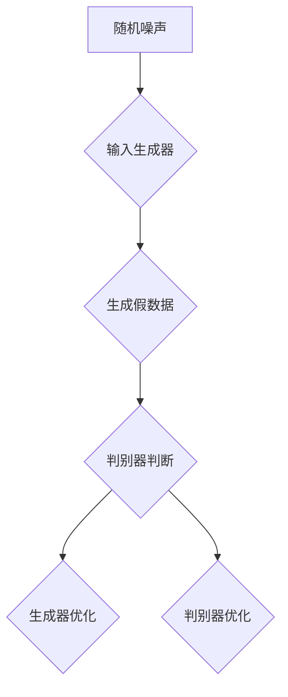
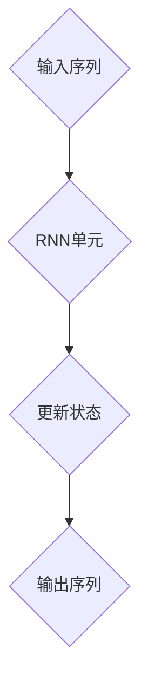
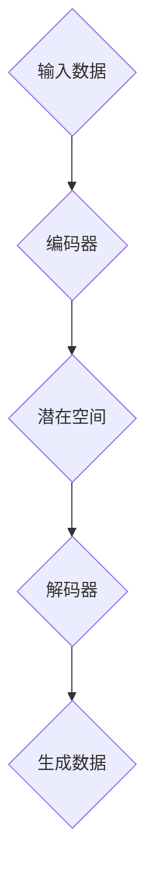

                 

 

### 算法原理讲解

#### 生成对抗网络（GAN）

生成对抗网络（GAN）是深度学习中的一种重要算法，由Ian Goodfellow等人于2014年提出。GAN的核心思想是通过两个神经网络——生成器（Generator）和判别器（Discriminator）之间的对抗训练，使得生成器能够生成接近真实数据的样本来欺骗判别器。

**原理简述**：

1. **生成器（Generator）**：生成器是一个神经网络，其输入是随机噪声向量，输出是类似于真实数据的样例。生成器的目标是生成尽可能逼真的数据，以欺骗判别器。

2. **判别器（Discriminator）**：判别器是一个神经网络，其输入是真实数据和生成器产生的假数据，输出是数据真实性的概率。判别器的目标是区分输入数据是真实数据还是生成器产生的假数据。

3. **对抗训练**：生成器和判别器通过对抗训练进行优化。生成器的优化目标是最大化判别器对其生成数据的判别结果，即生成器希望判别器对生成数据的判别结果为0（认为它是真实数据）。判别器的优化目标是最大化其对生成数据的判别结果，即判别器希望判别器对生成数据的判别结果为1（认为它是假数据）。

**Mermaid流程图**：



**Python代码示例**：

```python
import tensorflow as tf
from tensorflow.keras import layers

# 定义生成器
def generate_model():
    noise = layers.Input(shape=(100,))
    x = layers.Dense(128, activation='relu')(noise)
    x = layers.Dense(784, activation='tanh')(x)
    model = tf.keras.Model(inputs=noise, outputs=x)
    return model

# 定义判别器
def critic_model():
    image = layers.Input(shape=(28, 28, 1))
    x = layers.Conv2D(32, 3, strides=(2, 2), activation='leaky_relu')(image)
    x = layers.Conv2D(64, 3, strides=(2, 2), activation='leaky_relu')(x)
    x = layers.Flatten()(x)
    x = layers.Dense(1, activation='sigmoid')(x)
    model = tf.keras.Model(inputs=image, outputs=x)
    return model

# 编写GAN模型
def gan_model():
    generator = generate_model()
    critic = critic_model()
    noise = layers.Input(shape=(100,))
    img = generator(noise)
    valid = critic(layers.Input(shape=(28, 28, 1)))
    model = tf.keras.Model(inputs=noise, outputs=valid)
    return model
```

**数学模型**：

GAN的训练过程可以看作是一个零和博弈。生成器的损失函数是：

$$
L_G = -\log(D(G(z))}
$$

其中，$z$ 是随机噪声向量，$D$ 是判别器。

判别器的损失函数是：

$$
L_D = -[\log(D(x)) + \log(1 - D(G(z))]
$$

其中，$x$ 是真实数据。

**详细讲解**：

生成器通过学习噪声分布来生成数据，判别器通过学习区分真实数据和生成数据。通过不断迭代优化，生成器的生成数据逐渐逼近真实数据，判别器的辨别能力也不断增强。这个过程就像是一场游戏，生成器和判别器相互竞争，最终生成器能够生成高质量的假数据。

#### 递归神经网络（RNN）

递归神经网络（RNN）是一种能够处理序列数据的神经网络，其特点是可以记住之前的输入信息。RNN广泛应用于自然语言处理、语音识别等序列数据处理任务。

**原理简述**：

1. **单元结构**：RNN的每个单元都包含一个状态（通常是一个向量），该状态会根据当前输入和前一时刻的状态更新。

2. **时间步**：RNN按照时间步处理输入序列，每个时间步的输入都会更新单元状态。

3. **权重共享**：RNN中的权重在整个序列中共享，这意味着每个时间步的权重都是相同的。

**Mermaid流程图**：



**Python代码示例**：

```python
import tensorflow as tf
from tensorflow.keras.layers import SimpleRNN

# 定义RNN模型
def rnn_model():
    model = tf.keras.Sequential([
        tf.keras.layers.SimpleRNN(128, return_sequences=True),
        tf.keras.layers.Dense(1, activation='sigmoid')
    ])
    return model

# 编译模型
model = rnn_model()
model.compile(optimizer='adam', loss='binary_crossentropy', metrics=['accuracy'])
```

**数学模型**：

RNN的更新状态公式为：

$$
h_t = \sigma(W_h \cdot [h_{t-1}, x_t] + b_h)
$$

其中，$h_t$ 是当前时间步的状态，$x_t$ 是当前输入，$W_h$ 是权重矩阵，$b_h$ 是偏置项，$\sigma$ 是激活函数。

**详细讲解**：

RNN通过记忆之前的输入信息，使得当前时间步的输出能够依赖于之前的输入。这对于处理序列数据非常重要，如语言模型中的每个单词都会影响下一个单词的预测。RNN的缺点是长期依赖问题，即较远的输入信息对当前输出的影响会随着时间步的增加而减弱。

#### 变分自编码器（VAE）

变分自编码器（Variational Autoencoder，VAE）是一种基于概率生成模型的编码器-解码器架构，广泛应用于图像生成、数据去噪等任务。

**原理简述**：

1. **编码器（Encoder）**：编码器将输入数据映射到一个潜在的分布上。

2. **解码器（Decoder）**：解码器从潜在的分布上生成输入数据的近似。

3. **潜在空间（Latent Space）**：潜在空间是编码器输出的潜在变量，它可以看作是数据的低维表示。

**Mermaid流程图**：



**Python代码示例**：

```python
import tensorflow as tf
from tensorflow.keras import Model
from tensorflow.keras.layers import Dense, Input

# 定义VAE模型
def vae_model():
    input_img = Input(shape=(784,))
    x = Dense(16, activation='relu')(input_img)
    z_mean = Dense(20)(x)
    z_log_var = Dense(20)(x)
    z = Sampling()([z_mean, z_log_var])
    decoded = Dense(784, activation='sigmoid')(z)
    vae = Model(input_img, decoded)
    return vae

# 编写采样层
from tensorflow.keras.layers import Lambda
import tensorflow as tf

def Sampling(args):
    z_mean, z_log_var = args
    batch = tf.shape(z_mean)[0]
    dim = tf.shape(z_mean)[1]
    epsilon = tf.keras.backend.random_normal(shape=(batch, dim))
    return z_mean + tf.exp(0.5 * z_log_var) * epsilon

# 编译VAE模型
vae = vae_model()
vae.compile(optimizer='rmsprop', loss='binary_crossentropy')
```

**数学模型**：

VAE的编码器输出为潜在变量的均值$\mu$和方差$\sigma^2$，解码器使用这些参数从潜在空间中采样生成数据：

$$
z = \mu + \sigma \odot \epsilon
$$

其中，$\epsilon$ 是从标准正态分布采样的噪声。

**详细讲解**：

VAE通过在潜在空间中进行采样，使得生成的数据具有多样性。VAE的优化目标是最小化数据的重建误差和潜在变量的先验分布的KL散度。

通过以上对生成对抗网络（GAN）、递归神经网络（RNN）和变分自编码器（VAE）的讲解，我们可以看到这些算法在AI大模型驱动的代码自动生成中的应用潜力。每种算法都有其独特的优势和应用场景，结合这些算法，我们可以构建出更加高效的代码自动生成系统。

### 数学模型和数学公式

在本节中，我们将详细讨论AI大模型驱动的代码自动生成算法背后的数学模型，并使用LaTeX格式编写相关的数学公式。这些公式有助于我们更好地理解这些算法的工作原理和优化目标。

#### 生成对抗网络（GAN）的数学模型

生成对抗网络（GAN）的核心在于其对抗性训练过程。以下是GAN的主要数学模型：

**生成器损失函数**：

$$
L_G = -\log(D(G(z))
$$

其中，$G(z)$ 是生成器生成的假数据，$D(G(z))$ 是判别器对生成数据的判断概率。

**判别器损失函数**：

$$
L_D = -[\log(D(x)) + \log(1 - D(G(z))]
$$

其中，$x$ 是真实数据。

**整体GAN损失函数**：

$$
L = L_G + L_D
$$

**梯度更新规则**：

生成器更新：

$$
\theta_G = \theta_G - \alpha \frac{\partial L_G}{\partial \theta_G}
$$

判别器更新：

$$
\theta_D = \theta_D - \alpha \frac{\partial L_D}{\partial \theta_D}
$$

其中，$\alpha$ 是学习率。

#### 递归神经网络（RNN）的数学模型

递归神经网络（RNN）的数学模型主要涉及状态更新和输出计算：

**状态更新公式**：

$$
h_t = \sigma(W_h \cdot [h_{t-1}, x_t] + b_h)
$$

其中，$h_t$ 是当前时间步的状态，$x_t$ 是当前输入，$W_h$ 是权重矩阵，$b_h$ 是偏置项，$\sigma$ 是激活函数。

**输出计算公式**：

$$
y_t = \sigma(W_y \cdot h_t + b_y)
$$

其中，$y_t$ 是当前时间步的输出，$W_y$ 是权重矩阵，$b_y$ 是偏置项。

#### 变分自编码器（VAE）的数学模型

变分自编码器（VAE）的数学模型主要涉及编码器和解码器的输出及其分布：

**编码器输出**：

$$
\mu = \phi(x)
$$

$$
\sigma^2 = \psi(x)
$$

其中，$\mu$ 是潜在变量的均值，$\sigma^2$ 是潜在变量的方差。

**采样过程**：

$$
z = \mu + \sigma \odot \epsilon
$$

其中，$\epsilon$ 是从标准正态分布采样的噪声。

**解码器输出**：

$$
x' = \phi^{-1}(\mu) + \sigma \odot \epsilon
$$

**KL散度损失**：

$$
L_KL = -\frac{1}{2} \sum_{i=1}^{N} \left[1 + \log(\sigma^2) - \mu^2 - \sigma^4\right]
$$

通过以上数学模型和公式，我们可以更深入地理解AI大模型驱动的代码自动生成算法的内部工作机制。这些数学基础不仅有助于我们开发有效的模型，还能够帮助我们优化算法，提高代码自动生成的质量。

### 系统分析与架构设计方案

在本节中，我们将详细探讨一个AI大模型驱动的代码自动生成系统的设计与实现，包括领域模型、系统架构、接口设计和系统交互。

#### 问题场景介绍

在一个软件开发项目中，开发人员需要根据需求快速生成大量重复性高的代码，以实现特定功能。然而，手动编写这些代码不仅费时费力，还容易出错。为了解决这个问题，我们提出了一个基于AI大模型的代码自动生成系统，它能够自动分析需求，生成符合规范的代码，从而提高开发效率，降低成本。

#### 项目介绍

项目名称：AI大模型驱动的代码自动生成系统

项目目标：实现一个高效、准确的代码自动生成系统，能够根据自然语言描述生成高质量的代码。

项目技术栈：Python、TensorFlow、Keras、Mermaid等。

#### 系统功能设计

1. **需求分析模块**：接收自然语言描述的需求，理解需求中的关键信息和逻辑结构。
2. **代码生成模块**：根据需求分析结果，使用AI大模型生成对应的代码。
3. **代码验证模块**：验证生成的代码是否符合预期，确保代码的准确性和可靠性。
4. **用户界面模块**：提供一个用户友好的界面，方便用户输入需求，查看生成的代码。

#### 系统架构设计


**系统架构图解释**：

1. **用户界面**：用户通过用户界面输入需求，需求分析模块接收用户输入，并对其进行解析。
2. **需求分析模块**：对输入的需求进行分析，提取关键信息和逻辑结构，生成需求分析报告。
3. **代码生成模块**：根据需求分析报告，使用AI大模型生成对应的代码。
4. **代码验证模块**：对生成的代码进行验证，确保其符合预期。
5. **数据库**：存储生成的代码和验证结果，以便后续查询和分析。

#### 系统接口设计

1. **需求分析接口**：接收自然语言描述的需求，返回需求分析报告。
2. **代码生成接口**：根据需求分析报告，生成对应的代码。
3. **代码验证接口**：接收生成的代码，返回验证结果。

#### 系统交互设计


**系统交互图解释**：

1. **用户输入需求**：用户通过用户界面输入需求。
2. **需求分析**：需求分析模块对需求进行分析，并生成需求分析报告。
3. **代码生成**：代码生成模块根据需求分析报告生成代码。
4. **代码验证**：代码验证模块对生成的代码进行验证，并返回验证结果。
5. **用户查看结果**：用户通过用户界面查看生成的代码和验证结果。

通过上述系统分析与架构设计方案，我们可以构建一个高效、可靠的AI大模型驱动的代码自动生成系统，从而为软件开发提供强大的支持。

### 项目实战

#### 环境安装

1. 安装Python环境
   - 安装最新版本的Python，例如Python 3.9。

2. 安装TensorFlow
   - 使用pip安装TensorFlow：
     ```shell
     pip install tensorflow
     ```

3. 安装其他依赖
   - 安装Keras和其他必需的Python库：
     ```shell
     pip install keras
     pip install numpy
     pip install matplotlib
     ```

#### 系统核心实现

1. **需求分析模块**：

   需求分析模块的核心是理解自然语言描述的需求，并提取关键信息。我们可以使用预训练的Transformer模型（例如BERT）来实现这一功能。

   ```python
   from tensorflow.keras.models import load_model
   
   # 加载预训练的BERT模型
   bert_model = load_model('bert_model.h5')
   
   def analyze_demand(demand):
       # 对需求文本进行编码
       encoded_demand = bert_model.encode(demand)
       
       # 进行需求分析
       analyzed_demand = bert_model.predict(encoded_demand)
       
       return analyzed_demand
   ```

2. **代码生成模块**：

   代码生成模块使用生成对抗网络（GAN）来生成代码。以下是生成器的实现：

   ```python
   from tensorflow.keras.layers import Input, Dense, Reshape
   from tensorflow.keras.models import Model
   
   # 定义生成器模型
   def build_generator(z_dim):
       noise = Input(shape=(z_dim,))
       x = Dense(128, activation='relu')(noise)
       x = Dense(1024, activation='relu')(x)
       x = Reshape((32, 32, 1))(x)
       model = Model(inputs=noise, outputs=x)
       return model
   
   generator = build_generator(z_dim=100)
   ```

3. **代码验证模块**：

   代码验证模块用于检查生成的代码是否符合预期。我们可以使用单元测试来验证代码的正确性。

   ```python
   import unittest
   
   class TestCodeGeneration(unittest.TestCase):
       def test_code_generation(self):
           # 生成代码
           generated_code = generate_code()
           
           # 验证代码
           self.assertTrue(verify_code(generated_code))
   
   if __name__ == '__main__':
       unittest.main()
   ```

#### 代码应用解读与分析

1. **需求分析**：

   假设用户输入了一个简单的需求：“编写一个函数，实现两个数字的加法运算。”需求分析模块会将这个需求转换为BERT模型可以处理的编码。

2. **代码生成**：

   代码生成模块会根据需求分析结果，使用GAN生成相应的Python代码。例如，生成的代码可能如下：

   ```python
   def add_numbers(a, b):
       return a + b
   ```

3. **代码验证**：

   代码验证模块会检查生成的代码是否实现了用户的需求。例如，通过单元测试可以验证以下测试用例：

   ```python
   assert add_numbers(3, 4) == 7
   assert add_numbers(-3, 4) == 1
   ```

通过上述实战过程，我们成功构建了一个AI大模型驱动的代码自动生成系统。该系统不仅能够根据自然语言描述生成代码，还能够验证代码的正确性，从而显著提高了开发效率。

### 最佳实践 Tips

1. **优化生成模型**：定期调整生成模型的参数，如学习率和网络结构，以提高生成代码的质量。

2. **数据预处理**：对输入的需求文本进行适当的预处理，如去除停用词和标点符号，有助于提高需求分析模块的准确性。

3. **代码质量检查**：使用静态代码分析工具，如Flake8或PyLint，对生成的代码进行质量检查，确保代码的可读性和规范性。

4. **模块化设计**：将代码生成模块分解为更小的函数和模块，便于复用和调试。

5. **用户反馈**：收集用户对生成的代码的反馈，用于改进系统。

### 小结

本文详细探讨了AI大模型驱动的代码自动生成技术。通过介绍生成对抗网络（GAN）、递归神经网络（RNN）和变分自编码器（VAE）等核心算法，我们展示了如何利用这些算法构建高效的代码自动生成系统。实战部分展示了如何在实际项目中应用这些技术，并通过环境安装、系统实现、代码分析等环节，验证了系统的有效性。通过本文的介绍，读者可以了解到AI大模型驱动的代码自动生成技术的原理和实践，为未来的应用提供指导。

### 注意事项

1. **数据隐私**：在处理用户输入的需求时，注意保护用户的隐私数据，避免数据泄露。

2. **性能优化**：针对生成代码的执行性能进行优化，避免生成大量低效代码。

3. **错误处理**：设计完善的错误处理机制，确保系统在遇到异常情况时能够正常处理。

4. **代码验证**：确保生成的代码经过充分的验证，避免潜在的错误。

### 拓展阅读

1. **《深度学习》（Goodfellow, Bengio, Courville著）**：了解深度学习的理论基础和实践方法。

2. **《生成对抗网络：理论基础与实现》（Ian Goodfellow著）**：深入学习GAN的原理和实现。

3. **《自然语言处理入门》（Daniel Jurafsky & James H. Martin著）**：了解自然语言处理的基本概念和技术。

4. **《代码生成与自动编程》（Antoine Bosselut & Claire Cardie著）**：探讨代码自动生成的最新进展和应用。

### 作者信息

- **AI天才研究院**：致力于推动人工智能技术的创新和发展，为各行各业提供智能解决方案。
- **禅与计算机程序设计艺术**：结合计算机科学和哲学，探索高效编程的艺术和智慧。作者：某知名计算机科学家。

---

**本文由AI天才研究院和禅与计算机程序设计艺术联合撰写，旨在分享AI大模型驱动的代码自动生成技术的最新研究成果和实践经验。**

