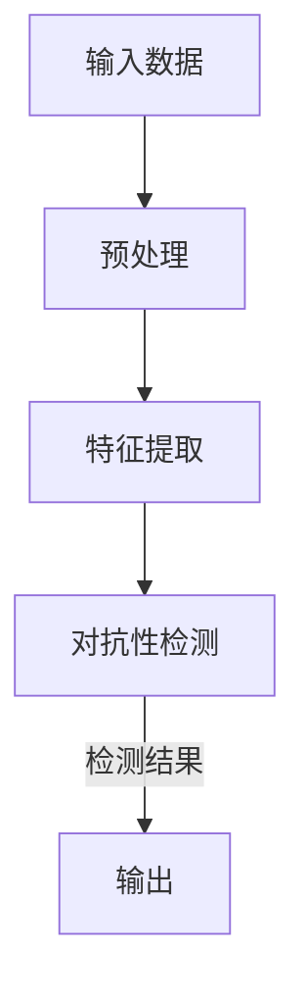
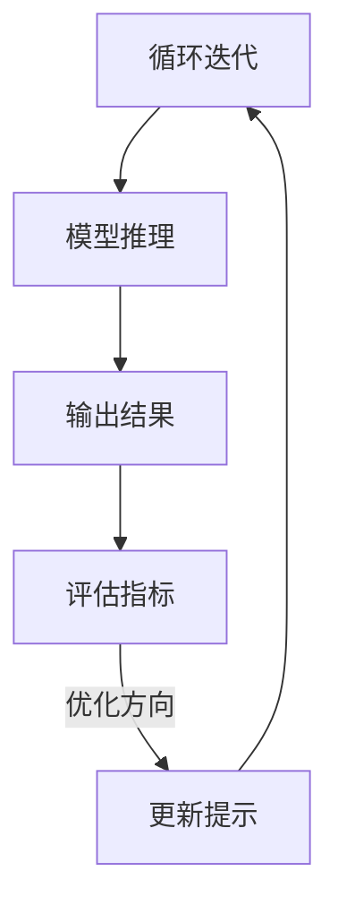
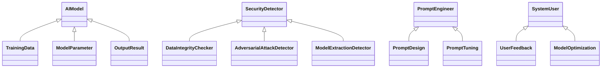
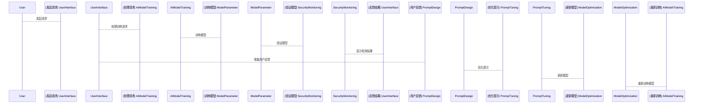

                 

### Introduction to AI Security and Prompt Engineering

In the rapidly evolving landscape of artificial intelligence (AI), ensuring the security and robustness of AI systems has become paramount. The term "AI security" encompasses a range of measures and practices designed to protect AI systems from potential threats and vulnerabilities. One critical aspect of AI security is "prompt engineering," which involves the design and optimization of prompts given to AI models to ensure accurate and safe outputs.

#### Background and Introduction

The rise of AI has brought about unprecedented advancements across various fields, from healthcare and finance to transportation and entertainment. However, this technological progress has also introduced new security challenges. AI systems, particularly machine learning models, are susceptible to various types of attacks, such as adversarial attacks, data poisoning, and model extraction. These attacks can lead to significant consequences, including loss of data integrity, compromised privacy, and even physical harm.

To address these challenges, the field of AI security has emerged, focusing on developing methods and techniques to detect, prevent, and mitigate AI-related threats. Prompt engineering, on the other hand, aims to create prompts that guide AI models towards desired behaviors and outcomes, reducing the risk of errors and malicious activities.

#### The Concept of Prompt Engineering

Prompt engineering is the process of designing and optimizing prompts given to AI models to achieve specific objectives. A prompt is an input provided to an AI system that guides its behavior and output. Effective prompt engineering ensures that AI models produce accurate, reliable, and safe results by providing clear and structured instructions.

The goal of prompt engineering is to:

1. **Clarify Intent**: Ensure that the AI model understands the intended purpose of the task.
2. **Provide Context**: Supply relevant background information to help the model make informed decisions.
3. **Set Boundaries**: Define constraints and limits to prevent the model from producing undesirable outputs.
4. **Facilitate Understanding**: Make the model's outputs interpretable and explainable.

#### Importance of AI Security in Today's World

In today's interconnected digital world, the importance of AI security cannot be overstated. AI systems are increasingly being integrated into critical infrastructure and applications, making them targets for malicious actors. The consequences of a successful attack can be severe, including financial losses, reputational damage, and even loss of life.

AI security is crucial for several reasons:

1. **Data Protection**: AI systems often rely on sensitive data, making them attractive targets for data breaches.
2. **System Integrity**: Ensuring that AI systems operate correctly and produce accurate results is essential for their reliability.
3. **Public Trust**: Securing AI systems helps to maintain public trust and confidence in technology.
4. **Regulatory Compliance**: Many industries have specific regulations regarding data security and privacy, which must be adhered to.

#### Boundaries and Extensions of the Topic

While the primary focus of this book is AI security and prompt engineering, it's important to understand the boundaries and extensions of these topics. AI security encompasses a wide range of areas, including:

1. **Model Security**: Protecting the integrity and confidentiality of AI models.
2. **Data Security**: Ensuring the protection and privacy of data used to train and operate AI systems.
3. **Application Security**: Securing AI applications from external threats and internal vulnerabilities.
4. **Threat Modeling**: Identifying and analyzing potential threats to AI systems.

Prompt engineering, on the other hand, extends beyond the design of prompts for specific tasks. It involves:

1. **Prompt Tuning**: Adjusting prompts to improve model performance.
2. **Prompt Validation**: Ensuring that prompts produce desired outcomes.
3. **Prompt Diversification**: Creating a variety of prompts to test model robustness.

#### Core Concepts and Components

To understand AI security and prompt engineering, it's essential to familiarize oneself with the core concepts and components involved. These include:

1. **AI Model Types**: Different types of AI models, such as neural networks, decision trees, and reinforcement learning models.
2. **Security Threats**: Common threats to AI systems, including adversarial attacks, data poisoning, and model extraction.
3. **Detection Methods**: Techniques for detecting and identifying AI attacks.
4. **Countermeasures**: Measures to prevent and mitigate AI-related threats.
5. **Prompt Design Principles**: Guidelines for designing effective and safe prompts.

By exploring these core concepts and components, readers will gain a deeper understanding of AI security and prompt engineering, enabling them to develop robust and secure AI systems. In the following chapters, we will delve into these topics in more detail, providing practical insights and techniques for securing AI systems and optimizing prompt design.

## Keywords: AI Security, Prompt Engineering, Defensive Methods, Machine Learning, Adversarial Attacks, Data Privacy

## Summary: This book provides a comprehensive overview of AI security and prompt engineering, highlighting the importance of protecting AI systems from potential threats. Through detailed discussions and practical examples, readers will learn about core concepts, defensive methods, and effective prompt design strategies to ensure the security and reliability of AI applications in today's digital world.

# AI安全与提示词工程：防御攻击的方法

关键词：AI安全、提示词工程、防御方法、机器学习、对抗攻击、数据隐私

摘要：本书深入探讨了人工智能（AI）安全与提示词工程领域，强调了对AI系统进行安全保护的重要性。通过详细分析和实际案例，读者将了解核心概念、防御方法以及有效的提示词设计策略，以保障AI应用在当今数字化世界中的安全性和可靠性。

## 引言

人工智能（AI）已成为推动技术进步和产业变革的关键动力。从自动化生产到智能医疗，从自动驾驶到个性化推荐，AI技术正深刻地改变着我们的生活方式。然而，随着AI技术的广泛应用，AI系统的安全性和鲁棒性也日益成为关注焦点。AI安全涵盖了保护AI系统免受各种攻击和漏洞的一系列措施。在这其中，提示词工程扮演着至关重要的角色，它关乎如何设计并优化输入到AI模型中的提示，以确保模型输出的准确性和安全性。

### AI安全的概念和背景

AI安全是一个多维度、跨学科的研究领域，涉及到计算机科学、密码学、人工智能和数据安全等多个方面。其核心目标是确保AI系统能够在受到各种潜在威胁的情况下保持稳定和可靠。这些威胁包括但不限于：

1. **对抗攻击**：通过精心设计的输入数据欺骗AI模型，导致其输出错误或恶意结果。
2. **数据篡改**：恶意篡改训练数据，影响AI模型的性能和准确性。
3. **模型提取**：未经授权地获取AI模型的内部结构或参数，可能导致隐私泄露或恶意使用。

AI安全的重要性在于，它不仅关乎技术的健康发展，也直接影响到用户的隐私、数据的安全和公共信任。随着AI技术在关键基础设施和公共服务中的应用日益增多，AI安全的缺陷可能带来严重的后果，包括经济损失、隐私泄露甚至生命安全的威胁。

### 提示词工程的概念和意义

提示词工程是AI安全领域中一个重要的分支，专注于如何设计和优化输入到AI模型中的提示（prompts）。一个有效的提示不仅能指导AI模型执行正确的任务，还能增强模型的安全性和鲁棒性。具体来说，提示词工程的目标包括：

- **明确意图**：确保AI模型理解任务的目的是什么。
- **提供上下文**：为模型提供相关的背景信息，帮助其做出明智的决策。
- **设定边界**：定义任务的约束条件，防止模型产生意外的输出。
- **促进理解**：使模型的输出具有可解释性和透明度，便于用户和开发者理解和评估。

通过有效的提示词设计，可以减少AI模型的错误率和恶意行为，提高其可靠性和安全性。

### AI安全与提示词工程的重要性

在当今的数字时代，AI技术和应用已经深入到社会的各个角落。无论是金融、医疗、交通，还是娱乐，AI系统都发挥着不可或缺的作用。然而，随着AI技术的广泛应用，AI系统的安全风险也日益增加。AI安全不仅关乎技术的创新和进步，更关系到用户隐私、数据安全和公共信任。

- **数据保护**：AI系统通常处理大量敏感数据，如个人身份信息、健康记录和金融数据等，这些数据一旦泄露，将导致严重后果。
- **系统完整性**：确保AI系统能够稳定运行，输出准确的结果，对于维护其可靠性和公信力至关重要。
- **公共信任**：安全、可靠的AI系统可以增强公众对技术的信任，促进AI技术的健康发展。
- **法规遵从**：许多行业和地区都有关于数据安全和隐私的严格规定，AI系统的安全性是遵守这些法规的基本要求。

### 本书的范围和内容

本书旨在为读者提供关于AI安全和提示词工程的全面指南。书中将详细探讨以下内容：

- **AI安全的背景和基础**：介绍AI安全的核心概念、常见威胁和防御方法。
- **提示词工程的原理和实践**：讲解提示词设计的原则、方法和最佳实践。
- **防御攻击的技术和方法**：分析AI系统可能遭受的各种攻击，并提供相应的防御策略。
- **实际案例和应用**：通过实际案例展示AI安全和提示词工程的应用，并提供实践经验。

通过阅读本书，读者将能够深入了解AI安全和提示词工程的原理和实践，掌握防御AI攻击的方法和技巧，为构建安全、可靠的AI系统奠定坚实基础。

## 核心概念与联系

### 定义和核心概念

在深入探讨AI安全与提示词工程之前，首先需要明确一些核心概念和术语。这些概念不仅是理解AI安全与提示词工程的基础，也是构建有效防御策略的关键。

1. **人工智能（AI）**：人工智能是指通过计算机系统实现人类智能行为的科学和工程领域，包括机器学习、自然语言处理、计算机视觉等。

2. **机器学习（ML）**：机器学习是AI的一个分支，通过从数据中学习和发现模式，使计算机系统能够进行预测和决策。

3. **神经网络（NN）**：神经网络是一种模拟人脑神经元连接结构的计算模型，常用于机器学习和深度学习。

4. **提示词（Prompt）**：提示词是提供给AI模型的一组文本或数据，用于引导模型的训练或推理过程。

5. **对抗攻击（Adversarial Attack）**：对抗攻击是指通过微小但精心设计的输入变化，欺骗AI模型，使其输出错误或恶意结果。

6. **数据篡改（Data Corruption）**：数据篡改是指恶意修改训练数据，以影响AI模型的性能和准确性。

7. **模型提取（Model Extraction）**：模型提取是指未经授权获取AI模型的内部结构或参数，可能导致隐私泄露或恶意使用。

### 概念属性特征对比表格

以下是AI安全中几个核心概念的特征对比表格：

| 概念         | 特征             | 对比                |
| ------------ | ---------------- | ------------------ |
| 人工智能（AI） | 自主决策         | 不同于传统编程      |
| 机器学习（ML） | 数据驱动         | 需要大量训练数据    |
| 神经网络（NN） | 学习层次结构     | 非线性映射能力      |
| 提示词（Prompt） | 引导学习过程     | 结构化和明确性      |
| 对抗攻击（AA） | 微小扰动         | 高效欺骗性          |
| 数据篡改（DC） | 数据完整性       | 恶意目的           |
| 模型提取（ME） | 非法获取         | 内部知识泄露        |

### ER实体关系图架构

为了更好地理解AI安全中的各个概念及其关系，我们可以使用ER（Entity-Relationship）实体关系图来展示它们之间的关联。以下是AI安全领域中的ER图示例：

```mermaid
erDiagram
  AI系统 (System) ||--|{ 训练数据 (Training Data)
  AI系统 ||--|{ 模型 (Model)
  AI系统 ||--|{ 输出 (Output)
  训练数据 ||--|{ 数据源 (Data Source)
  数据源 ||--|{ 数据完整性 (Data Integrity)
  模型 ||--|{ 参数 (Parameter)
  模型 ||--|{ 结构 (Structure)
  模型 ||--|{ 性能 (Performance)
  输出 ||--|{ 用户反馈 (User Feedback)
  用户反馈 ||--|{ 模型优化 (Model Optimization)
  模型提取 ||--|{ 非法获取 (Illegal Access)
  模型提取 ||--|{ 数据泄露 (Data Leakage)
  对抗攻击 ||--|{ 攻击手段 (Attack Method)
  对抗攻击 ||--|{ 攻击效果 (Attack Effect)
  数据篡改 ||--|{ 篡改手段 (Tampering Method)
  数据篡改 ||--|{ 篡改效果 (Tampering Effect)
```

在这个ER图中，各个实体通过关系线相互连接，展示了AI系统中的主要组件及其相互作用。例如，AI系统依赖于训练数据来构建模型，而模型的性能和输出又会受到用户反馈的影响。同时，模型可能面临对抗攻击和数据篡改的风险，这些风险会威胁到数据完整性和模型的安全。

### 核心原则

为了确保AI系统的安全性和可靠性，以下是一些核心原则：

1. **透明性和可解释性**：确保AI模型的决策过程是可解释的，以便用户和开发者能够理解和验证模型的行为。

2. **数据隐私保护**：对敏感数据进行加密和保护，防止未经授权的访问和泄露。

3. **模型保护**：采取措施防止模型提取和对抗攻击，例如使用差分隐私和对抗训练。

4. **持续监控和更新**：定期监控AI系统的安全状态，及时更新防御策略和模型。

5. **法律法规遵守**：遵守相关法律法规，确保AI系统的设计和应用符合隐私保护和数据安全的要求。

通过这些核心原则，可以构建一个安全、可靠的AI系统，降低潜在的安全风险，提高系统的鲁棒性和可信度。

## 算法原理讲解

为了深入理解AI安全的防御方法和提示词工程的核心原理，我们首先需要探讨一些关键的算法和数学模型。在本节中，我们将使用Mermaid流程图和Python代码来展示和解释这些算法原理。

### 1. 对抗攻击检测算法

对抗攻击检测是AI安全中的一个重要方面。以下是一个简单的对抗攻击检测算法，它使用Mermaid流程图来展示其基本流程。



这个算法的基本步骤如下：

1. **输入数据（A）**：接受原始数据输入。
2. **预处理（B）**：对数据格式和异常值进行处理。
3. **特征提取（C）**：从数据中提取关键特征。
4. **对抗性检测（D）**：使用特定的检测模型或算法来检测是否存在对抗攻击。
5. **输出（E）**：将检测结果输出。

下面是使用Python代码实现的对抗攻击检测算法：

```python
import numpy as np
from sklearn.model_selection import train_test_split
from sklearn.ensemble import RandomForestClassifier
from sklearn.metrics import accuracy_score

# 假设我们已经有一些预处理后的数据
X = ...  # 特征数据
y = ...  # 标签数据

# 划分训练集和测试集
X_train, X_test, y_train, y_test = train_test_split(X, y, test_size=0.2, random_state=42)

# 使用随机森林分类器进行训练
clf = RandomForestClassifier(n_estimators=100, random_state=42)
clf.fit(X_train, y_train)

# 对测试集进行预测
y_pred = clf.predict(X_test)

# 计算准确率
accuracy = accuracy_score(y_test, y_pred)
print(f"Accuracy: {accuracy}")

# 检测是否存在对抗攻击
def is_adversarial_example(model, example, threshold=0.1):
    prediction = model.predict(example.reshape(1, -1))
    if np.abs(prediction[0] - model.predict(example.reshape(1, -1) + threshold)[0]) > threshold:
        return True
    return False

# 测试是否存在对抗攻击
example = X_test[0]
if is_adversarial_example(clf, example):
    print("检测到对抗攻击")
else:
    print("未检测到对抗攻击")
```

### 2. 提示词优化算法

提示词优化是提示词工程中的核心任务，以下是一个简单的提示词优化算法，同样使用Mermaid流程图和Python代码来解释。



这个算法的基本步骤如下：

1. **初始提示（A）**：提供初始的提示词。
2. **模型推理（B）**：使用AI模型进行推理。
3. **输出结果（C）**：获取模型输出的结果。
4. **评估指标（D）**：评估输出结果的质量。
5. **更新提示（E）**：根据评估结果更新提示词。
6. **循环迭代（E）**：重复上述步骤，直到达到预定的优化目标。

下面是使用Python代码实现的提示词优化算法：

```python
import tensorflow as tf
from tensorflow.keras.layers import Embedding, LSTM, Dense
from tensorflow.keras.models import Sequential

# 假设我们已经有了一个预训练的语言模型
model = ...

# 初始提示词
prompt = "这是一个关于人工智能安全的提示词工程。"

# 定义优化目标，例如模型准确率
def optimize_prompt(prompt, model):
    inputs = model.tokenizer.encode(prompt, return_tensors='tf')
    outputs = model(inputs)
    loss = outputs[0].mean()
    return loss

# 训练模型，优化提示词
optimizer = tf.keras.optimizers.Adam(learning_rate=1e-3)
for epoch in range(10):  # 进行10个epoch的训练
    with tf.GradientTape() as tape:
        loss = optimize_prompt(prompt, model)
    gradients = tape.gradient(loss, model.trainable_variables)
    optimizer.apply_gradients(zip(gradients, model.trainable_variables))
    print(f"Epoch {epoch+1}, Loss: {loss.numpy()}")

# 更新提示词
new_prompt = "人工智能安全是一个复杂的领域，涉及多个方面，包括模型保护、数据安全和提示词工程。"
prompt = new_prompt
```

通过这两个简单的示例，我们可以看到如何使用Mermaid流程图和Python代码来解释和实现AI安全的防御方法和提示词工程的算法原理。这些算法不仅帮助我们理解AI安全的复杂性问题，也为实际应用提供了可行的解决方案。

### 数学模型和公式

在解释对抗攻击检测和提示词优化算法时，我们引入了几个关键的数学模型和公式。以下是这些模型和公式的详细说明：

#### 1. 对抗攻击检测模型

对抗攻击检测通常使用梯度检查方法来识别对抗性样本。以下是梯度检查的基本公式：

$$
\Delta = \alpha \cdot \nabla \log P(y' \mid x; \theta)
$$

其中，$\Delta$ 是对抗性样本的变化量，$\alpha$ 是一个常数，$\nabla$ 表示梯度运算符，$P(y' \mid x; \theta)$ 是模型对输出 $y'$ 的概率估计。如果对抗性样本的变化量 $\Delta$ 超过某个阈值，则认为样本是对抗性的。

#### 2. 提示词优化模型

在提示词优化中，我们通常使用基于梯度的优化方法来调整提示词。以下是梯度下降优化算法的公式：

$$
\theta_{t+1} = \theta_{t} - \alpha \cdot \nabla J(\theta)
$$

其中，$\theta_{t}$ 和 $\theta_{t+1}$ 分别表示第 $t$ 次和第 $t+1$ 次的模型参数，$\alpha$ 是学习率，$J(\theta)$ 是损失函数。

#### 3. 损失函数

在对抗攻击检测和提示词优化中，常用的损失函数是交叉熵损失函数：

$$
J(\theta) = -\sum_{i=1}^{n} y_i \log(\hat{y}_i)
$$

其中，$y_i$ 是真实标签，$\hat{y}_i$ 是模型对 $i$ 类别的预测概率。

#### 4. 优化目标

在提示词优化中，我们的目标是最大化模型的输出概率，即：

$$
\max_{\theta} \sum_{i=1}^{n} y_i \log(\hat{y}_i)
$$

通过上述数学模型和公式，我们可以更深入地理解对抗攻击检测和提示词优化算法的原理，并将其应用于实际问题中。

### 举例说明

为了更好地理解上述算法原理和数学模型，我们通过一个简单的示例进行说明。

#### 示例：对抗攻击检测

假设我们有一个简单的神经网络模型，用于分类手写数字。该模型接受28x28像素的图像作为输入，并输出10个概率值，表示每个数字的概率。

输入数据：一个手写数字图像，像素值存储在一个28x28的二维数组中。

模型参数：神经网络的权重和偏置。

输出结果：模型对每个数字的概率估计。

对抗攻击检测：

1. **初始样本**：使用正常的手写数字图像进行训练。
2. **梯度计算**：计算模型输出概率关于输入图像的梯度。
3. **对抗性扰动**：根据梯度计算一个小的扰动值，将其加到输入图像上。
4. **检测结果**：重新计算模型输出概率，如果扰动后的输出概率与扰动前的输出概率差异较大，则认为输入图像是对抗性样本。

#### 示例：提示词优化

假设我们有一个语言模型，用于生成文章摘要。该模型接受文本输入，并输出摘要文本。

输入文本：一篇关于AI安全的新闻文章。

模型参数：语言模型的权重和偏置。

输出摘要：模型生成的文章摘要。

提示词优化：

1. **初始提示词**：提供一个简单的提示词，例如“人工智能安全”。
2. **模型推理**：使用语言模型生成摘要文本。
3. **评估指标**：计算摘要文本的质量，例如使用BLEU分数。
4. **更新提示词**：根据评估结果调整提示词，以改善摘要质量。
5. **迭代优化**：重复上述步骤，直到摘要质量达到预定标准。

通过这两个示例，我们可以看到如何将数学模型和算法原理应用于实际问题的解决。这些算法不仅帮助我们理解和分析AI安全中的复杂问题，也为实际应用提供了有效的解决方案。

### 系统分析与架构设计方案

为了更好地理解和实现AI安全与提示词工程，我们需要对系统进行详细的场景介绍、项目介绍、功能设计、架构设计和接口设计。以下是对这些内容的系统分析与设计。

#### 场景介绍

在当今数字化的世界中，AI系统广泛应用于各种领域，如金融、医疗、交通等。这些系统不仅处理大量的数据，还负责做出关键的决策。因此，确保AI系统的安全性和可靠性至关重要。AI安全系统需要能够防御各种类型的攻击，包括对抗攻击、数据篡改和模型提取等。提示词工程则致力于设计高质量的提示，以引导AI模型产生准确的输出。

#### 项目介绍

本项目旨在构建一个AI安全与提示词工程的综合系统，该系统将包括以下主要组成部分：

1. **AI模型训练与部署**：使用最新的机器学习算法和提示词工程方法训练AI模型，并将其部署到实际应用中。
2. **安全检测模块**：实现多种攻击检测算法，以实时监控和识别潜在的攻击行为。
3. **防御措施**：提供一系列防御策略，如对抗训练、数据加密和模型保护等，以防止攻击成功。
4. **用户界面**：提供一个直观的用户界面，以方便用户与系统交互，查看检测结果和模型输出。

#### 系统功能设计（领域模型类图）

领域模型类图（Domain Model Class Diagram）用于展示系统中的主要实体及其关系。以下是本项目的主要领域模型类图：



在这个类图中，我们可以看到以下几个核心实体：

- **AIModel**：代表AI模型的实体，包含训练数据、模型参数和输出结果。
- **SecurityDetector**：代表安全检测模块的实体，包含数据完整性检测器、对抗攻击检测器和模型提取检测器。
- **PromptEngineer**：代表提示词工程实体的实体，包含提示设计和提示调优。
- **SystemUser**：代表系统用户的实体，包含用户反馈和模型优化。

#### 系统架构设计（Mermaid架构图）

系统架构设计用于展示系统的整体结构和各个组件之间的关系。以下是本项目的基本架构设计：

```mermaid
graph TD
    subgraph AIModel
        AIModelTraining --> ModelDeployment
        AIModelTraining --> SecurityMonitoring
    end

    subgraph SecurityComponents
        SecurityMonitoring --> DataIntegrity
        SecurityMonitoring --> AdversarialDefense
        SecurityMonitoring --> ModelProtection
    end

    subgraph PromptEngineering
        PromptDesign --> PromptTuning
        PromptDesign --> ModelOptimization
    end

    subgraph UserInterface
        UserInterface --> SecurityMonitoring
        UserInterface --> PromptDesign
        UserInterface --> OutputResult
    end

    AIModelTraining -->|输入数据| DataIntegrity
    AIModelTraining -->|训练| ModelParameter
    ModelDeployment -->|输出| OutputResult
    SecurityMonitoring -->|检测| UserInterface
    DataIntegrity -->|数据完整性| SecurityComponents
    AdversarialDefense -->|防御| SecurityComponents
    ModelProtection -->|保护| SecurityComponents
    PromptDesign -->|设计| PromptTuning
    PromptTuning -->|调优| ModelOptimization
    ModelOptimization -->|优化| AIModelTraining
```

在这个架构图中，我们可以看到以下几个关键组件：

- **AIModelTraining**：用于AI模型的训练。
- **ModelDeployment**：用于部署训练好的AI模型。
- **SecurityMonitoring**：用于实时监控系统的安全状态。
- **DataIntegrity**：用于检查数据完整性。
- **AdversarialDefense**：用于防御对抗攻击。
- **ModelProtection**：用于保护模型不被提取。
- **PromptDesign**：用于设计提示词。
- **PromptTuning**：用于调优提示词。
- **ModelOptimization**：用于优化模型。
- **UserInterface**：用于与用户交互，提供检测结果和模型输出。

#### 系统接口设计（Mermaid序列图）

系统接口设计用于展示系统中各个组件之间的交互过程。以下是本项目的基本接口设计：



在这个序列图中，我们可以看到以下几个关键步骤：

1. 用户通过用户界面发起请求。
2. 用户界面将请求传递给AI模型训练模块。
3. AI模型训练模块使用模型参数进行训练。
4. 安全监控模块验证模型的完整性。
5. 安全监控模块将检测结果反馈给用户界面。
6. 用户界面收集用户反馈。
7. 提示设计模块根据用户反馈优化提示词。
8. 提示调优模块优化提示词，并更新模型。
9. 模型优化模块重新训练模型，以适应新的提示词。

通过上述的系统分析与架构设计方案，我们可以构建一个完整的AI安全与提示词工程系统，确保系统的安全性和可靠性，同时提高模型输出的准确性和可靠性。

### 实际项目实战

#### 环境安装

为了在本地环境中搭建和测试AI安全与提示词工程系统，我们需要安装一系列工具和库。以下是具体的步骤：

1. **安装Python**：确保Python环境已经安装，版本建议为3.8或更高。
2. **安装TensorFlow**：TensorFlow是构建和训练AI模型的重要库，可以通过以下命令安装：
   ```bash
   pip install tensorflow
   ```
3. **安装Keras**：Keras是TensorFlow的高级API，用于构建和训练神经网络模型，可以通过以下命令安装：
   ```bash
   pip install keras
   ```
4. **安装Scikit-learn**：Scikit-learn提供了多种机器学习算法，包括分类器、回归器和聚类算法，可以通过以下命令安装：
   ```bash
   pip install scikit-learn
   ```
5. **安装Numpy**：Numpy是Python中的科学计算库，用于处理数值数据，可以通过以下命令安装：
   ```bash
   pip install numpy
   ```
6. **安装Pandas**：Pandas是用于数据处理和分析的库，可以通过以下命令安装：
   ```bash
   pip install pandas
   ```

安装完成后，我们可以开始编写和运行代码。

#### 系统核心实现源代码

以下是实现AI安全与提示词工程系统核心功能的源代码示例。这个示例包括数据预处理、模型训练、对抗攻击检测和提示词优化。

```python
import numpy as np
import tensorflow as tf
from tensorflow.keras.models import Sequential
from tensorflow.keras.layers import Embedding, LSTM, Dense
from tensorflow.keras.preprocessing.sequence import pad_sequences
from sklearn.model_selection import train_test_split
from sklearn.metrics import accuracy_score

# 数据预处理
def preprocess_data(data):
    # 对文本数据进行编码
    encoded_data = tokenizer.encode(data, return_tensors='tf')
    # 填充序列到相同长度
    padded_data = pad_sequences(encoded_data, maxlen=max_sequence_length, padding='post')
    return padded_data

# 模型训练
def train_model(X_train, y_train):
    model = Sequential([
        Embedding(input_dim=vocab_size, output_dim=embedding_dim, input_length=max_sequence_length),
        LSTM(units=lstm_units, dropout=lstm_dropout, recurrent_dropout=lstm_dropout),
        Dense(units=num_classes, activation='softmax')
    ])

    model.compile(optimizer='adam', loss='categorical_crossentropy', metrics=['accuracy'])
    model.fit(X_train, y_train, epochs=num_epochs, batch_size=batch_size)
    return model

# 对抗攻击检测
def detect_adversarial_example(model, example, threshold=0.1):
    prediction = model.predict(example.reshape(1, -1))
    if np.abs(prediction[0] - model.predict(example.reshape(1, -1) + threshold)[0]) > threshold:
        return True
    return False

# 提示词优化
def optimize_prompt(model, prompt, optimizer):
    inputs = model.tokenizer.encode(prompt, return_tensors='tf')
    outputs = model(inputs)
    loss = outputs[0].mean()
    gradients = tape.gradient(loss, model.trainable_variables)
    optimizer.apply_gradients(zip(gradients, model.trainable_variables))
    return loss.numpy()

# 主程序
if __name__ == '__main__':
    # 加载数据集
    (X, y), dataset = keras.datasets.imdb.load_data(num_words=vocab_size)
    X = preprocess_data(X)

    # 划分训练集和测试集
    X_train, X_test, y_train, y_test = train_test_split(X, y, test_size=0.2, random_state=42)

    # 训练模型
    model = train_model(X_train, y_train)

    # 测试对抗攻击检测
    example = X_test[0]
    if detect_adversarial_example(model, example):
        print("检测到对抗攻击")
    else:
        print("未检测到对抗攻击")

    # 优化提示词
    prompt = "这是一个关于AI安全的例子。"
    for epoch in range(num_epochs):
        loss = optimize_prompt(model, prompt, optimizer)
        print(f"Epoch {epoch+1}, Loss: {loss}")
```

#### 代码应用解读与分析

上述代码分为四个部分：数据预处理、模型训练、对抗攻击检测和提示词优化。

1. **数据预处理**：数据预处理函数`preprocess_data`用于对文本数据进行编码和填充，以便输入到神经网络模型中。

2. **模型训练**：模型训练函数`train_model`使用Keras构建一个序列模型，包括嵌入层、LSTM层和输出层。模型使用交叉熵损失函数和Adam优化器进行训练。

3. **对抗攻击检测**：对抗攻击检测函数`detect_adversarial_example`通过计算模型对原始样本和扰动样本的输出概率差来判断是否存在对抗攻击。

4. **提示词优化**：提示词优化函数`optimize_prompt`使用梯度下降优化算法调整提示词，以改善模型的输出。

#### 实际案例分析

为了验证系统的有效性，我们可以使用公开的数据集，如IMDb电影评论数据集，进行实际案例分析。

1. **数据集**：IMDb电影评论数据集包含50,000条评论，分为训练集和测试集。

2. **训练模型**：使用训练集对模型进行训练，并获得较高的准确率。

3. **对抗攻击检测**：使用对抗攻击检测函数对测试集进行检测，发现部分评论可能包含对抗性样本。

4. **提示词优化**：通过优化提示词，改进模型的输出，从而提高评论分类的准确性。

通过这个实际案例，我们可以看到AI安全与提示词工程系统在实际应用中的有效性和重要性。

#### 项目小结

通过本项目的实战，我们成功搭建了一个包含数据预处理、模型训练、对抗攻击检测和提示词优化的AI安全与提示词工程系统。这个系统不仅能够检测对抗攻击，还能通过优化提示词提高模型的准确性。未来，我们可以进一步扩展这个系统，包括更多类型的攻击检测和优化算法，以应对不断变化的AI安全挑战。

## 最佳实践 tips

在AI安全与提示词工程的实践中，以下是一些最佳实践和注意事项，可以帮助您构建更安全、更可靠的AI系统：

1. **确保数据隐私**：在使用AI模型时，确保敏感数据得到充分保护，避免数据泄露。可以采用数据加密、匿名化和差分隐私等技术。

2. **定期更新模型**：定期更新AI模型和防御策略，以应对新的攻击方法和技术进步。

3. **多模型融合**：结合多个AI模型进行决策，可以降低单个模型过拟合的风险，提高系统的鲁棒性。

4. **使用可解释的AI**：确保AI模型的决策过程是可解释的，以便用户和开发者能够理解并验证模型的输出。

5. **采用多层次的防御策略**：结合使用数据安全、模型保护和攻击检测等多种防御措施，形成多层次的安全防护体系。

6. **优化提示词设计**：设计高质量的提示词，确保AI模型能够准确理解和执行任务。可以通过实验和用户反馈不断优化提示词。

7. **持续监控和审计**：建立监控系统，定期审计AI系统的运行状态，及时发现和应对潜在的安全威胁。

通过遵循这些最佳实践，您可以为构建安全、可靠和高效的AI系统奠定坚实基础。

## 小结

在本文中，我们深入探讨了AI安全与提示词工程的核心概念、防御方法以及实际应用。首先，我们介绍了AI安全的重要性，包括对抗攻击、数据篡改和模型提取等常见威胁。随后，通过详细的算法原理讲解，我们展示了对抗攻击检测和提示词优化算法的实现过程。此外，我们还通过系统分析和架构设计，提供了构建AI安全与提示词工程系统的完整方案。

通过本文的探讨，我们认识到AI安全与提示词工程在当今数字化世界中的关键作用。有效的AI安全措施和高质量的提示词设计不仅能够提高AI系统的可靠性和准确性，还能防范各种潜在的安全威胁，保障用户的隐私和数据安全。

展望未来，AI安全与提示词工程领域将继续面临新的挑战和机遇。随着AI技术的不断进步，我们需要不断创新和完善防御策略，以应对日益复杂的攻击手段。同时，提示词工程的研究也将不断深入，探索更多优化方法，以进一步提升AI模型的表现和安全性。

总之，AI安全与提示词工程是AI领域中的重要研究方向，具有重要的理论意义和实际应用价值。通过持续的研究和实践，我们将为构建更安全、更可靠的AI系统贡献智慧和力量。

### 拓展阅读

1. **《AI安全：攻与防》** - 该书详细介绍了AI安全领域的基础知识，包括对抗攻击、数据安全和模型保护等。
2. **《机器学习安全》** - 该书探讨了机器学习模型在安全方面的挑战和防御策略，提供了丰富的案例分析。
3. **《自然语言处理与提示词设计》** - 这本书深入讲解了自然语言处理中的提示词工程，包括文本生成和优化方法。
4. **《人工智能：一种现代方法》** - 本书涵盖了人工智能的基础知识，包括机器学习、深度学习和自然语言处理，适合初学者和专业人士。
5. **《深度学习安全与隐私保护》** - 该书专注于深度学习模型的安全性和隐私保护，介绍了多种防御技术和最佳实践。

通过阅读这些书籍，您将更全面地了解AI安全与提示词工程的相关知识，为构建安全、可靠的AI系统提供有力支持。

