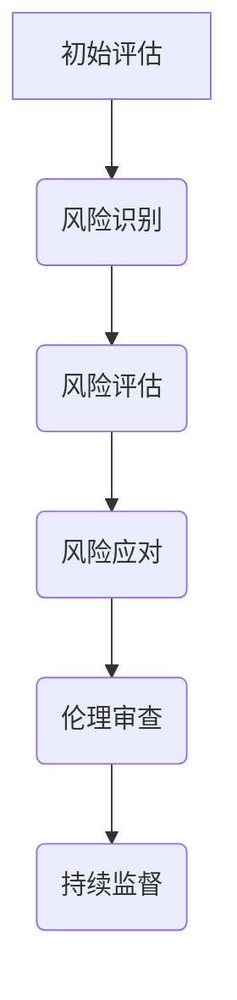

                 

## AI情感伦理委员会:监管机器情感发展

> 关键词：AI情感伦理、伦理委员会、风险评估、隐私保护、标准制定、情感算法审查

> 摘要：随着人工智能技术的发展，机器情感越来越成为现实。然而，AI在处理情感数据时面临诸多伦理挑战，如隐私保护、算法偏见和伦理风险评估等。本文旨在探讨AI情感伦理委员会的职能、构成和运作机制，分析其伦理风险评估方法，以及制定和实施伦理标准的策略与实践。通过案例研究和未来展望，本文为AI情感伦理的发展提供了有益的参考。

## 目录大纲

### 第一部分: AI情感伦理委员会概述

#### 第1章: AI情感伦理背景

##### 1.1 AI情感技术的定义和演进

##### 1.2 情感伦理学的理论框架

##### 1.3 情感伦理学在AI领域中的应用

#### 第2章: AI情感伦理委员会的职能与构成

##### 2.1 委员会的职能概述

##### 2.2 委员会的构成

##### 2.3 委员的运作机制

#### 第3章: AI情感系统的伦理风险评估方法

##### 3.1 风险评估框架

##### 3.2 情感数据的隐私保护

##### 3.3 隐私保护政策的制定与实施

### 第二部分: AI情感伦理标准的制定与实施

#### 第4章: AI情感伦理标准的制定原则与流程

##### 4.1 伦理标准的定义和作用

##### 4.2 标准制定的参与者与角色

##### 4.3 标准制定的基本原则

#### 第5章: AI情感伦理标准的实施策略

##### 4.1 标准推广与教育

##### 4.2 标准监督与审查

##### 4.3 标准实施的案例分析

### 第三部分: AI情感伦理委员会的实践案例

#### 第6章: AI情感伦理委员会的实践案例

##### 6.1 社交媒体平台的情感算法审查

##### 6.2 医疗AI的情感诊断系统

##### 6.3 案例启示

### 第四部分: AI情感伦理的未来展望

#### 第7章: AI情感伦理与人工智能的持续发展

##### 7.1 情感伦理在AI领域的挑战

##### 7.2 情感伦理的未来趋势

##### 7.3 情感伦理对AI治理的影响

#### 第8章: 国际合作与伦理标准的统一

##### 8.1 国际合作的重要性

##### 8.2 伦理标准国际化的挑战与机遇

##### 8.3 国际合作案例与经验分享

### 附录

#### 附录A: AI情感伦理委员会相关资源

##### 附录B: Mermaid流程图示例

##### 附录C: Python代码示例

##### 附录D: 数学模型与公式解析## 第一部分: AI情感伦理委员会概述

### 第1章: AI情感伦理背景

#### 1.1 AI情感技术的定义和演进

随着人工智能（AI）技术的迅猛发展，情感计算、情感识别和情感分析等领域逐渐成为研究热点。AI情感技术是指利用计算机模拟人类情感的过程，实现对人类情感状态的理解、分析和预测。其核心在于情感识别，即通过分析语音、面部表情、文字等数据，识别用户的情感状态。

AI情感技术的演进可以分为以下几个阶段：

1. **初级阶段**：基于规则的方法，通过预设的情感特征和规则，对情感进行识别。
2. **中级阶段**：基于机器学习和深度学习的方法，通过大量的情感数据训练模型，提高情感识别的准确率。
3. **高级阶段**：利用多模态数据融合技术，结合语音、面部表情、文字等多种数据来源，实现更准确的情感识别。

#### 1.2 AI情感技术在行业中的应用现状

AI情感技术在多个行业得到广泛应用，如：

1. **消费者行为分析**：通过情感分析，企业可以了解消费者的情感状态，从而优化产品和服务。
2. **社交媒体监控**：利用情感分析，可以实时监测社交媒体上的情感倾向，为企业提供市场洞察。
3. **心理健康服务**：通过情感识别，可以实时监测用户的心理状态，为心理健康提供个性化服务。
4. **医疗诊断**：利用情感分析，可以辅助医生诊断情感相关疾病，如抑郁症、焦虑症等。

#### 1.3 AI情感技术的伦理挑战

尽管AI情感技术在行业中展现出巨大的潜力，但其应用也带来了一系列伦理挑战：

1. **隐私保护**：情感数据通常涉及个人隐私，如何保护用户的隐私成为重要问题。
2. **算法偏见**：AI情感技术可能受到数据偏差的影响，导致算法偏见，从而对某些群体产生不公平影响。
3. **伦理风险评估**：如何评估和应对AI情感技术可能带来的伦理风险，如情感操纵、情感歧视等。
4. **透明性和可解释性**：用户需要了解AI情感技术的工作原理，以及如何影响他们的情感状态。

### 1.4 情感伦理学的理论框架

情感伦理学是伦理学的一个分支，主要研究情感与道德行为之间的关系。其理论框架主要包括以下几方面：

1. **情感与道德判断**：情感如何影响道德判断，以及道德判断如何影响情感。
2. **情感正义**：如何确保情感不会侵犯他人的权利和利益。
3. **情感责任**：个体如何对自己的情感行为承担责任。
4. **情感伦理规范**：如何制定和遵守情感伦理规范，以维护社会秩序和公正。

#### 1.5 情感伦理学在AI领域中的应用

情感伦理学在AI领域中的应用主要体现在以下几个方面：

1. **情感算法的设计和评估**：在设计和评估AI情感算法时，需要考虑其伦理影响，如隐私保护、算法偏见等。
2. **伦理审查**：对AI情感项目的开发和部署进行伦理审查，确保其符合伦理规范。
3. **伦理教育和培训**：提高AI开发者和使用者对情感伦理的认识，培养良好的情感伦理意识。
4. **伦理咨询**：为企业和政府提供情感伦理方面的专业咨询，帮助其制定和实施情感伦理政策。

通过上述讨论，我们可以看到AI情感技术的快速发展和广泛应用，以及其中所面临的伦理挑战。接下来，我们将进一步探讨AI情感伦理委员会的职能、构成和运作机制，以及伦理风险评估方法和实施策略。

### 第2章: AI情感伦理委员会的职能与构成

#### 2.1 委员会的职能概述

AI情感伦理委员会的主要职能包括：

1. **制定AI情感伦理标准**：根据情感伦理学的理论框架，结合AI情感技术的特点，制定相应的伦理标准，为AI情感技术的研发和应用提供指导。

2. **评估AI情感系统的伦理风险**：通过风险识别、评估和应对，对AI情感系统的伦理风险进行系统化管理，确保其符合伦理规范。

3. **提供伦理咨询和建议**：为AI情感技术的研发、部署和使用提供伦理咨询和建议，帮助企业、政府和其他机构在AI情感领域遵循伦理原则。

4. **促进国际合作与交流**：通过国际间的合作与交流，推动全球AI情感伦理标准的一致性和统一性。

#### 2.2 委员会的构成

AI情感伦理委员会的构成应具备以下特点：

1. **多样性**：委员会成员应涵盖不同学科背景，如伦理学、心理学、计算机科学、法律等，以确保多角度、全面地考虑AI情感伦理问题。

2. **专业性**：委员会成员应具备丰富的专业知识，包括情感伦理学、AI情感技术、伦理风险评估等。

3. **代表性**：委员会成员应具有广泛的代表性，包括政府机构、学术研究机构、企业、社会组织等，以确保各方利益得到充分体现。

4. **独立性**：委员会应具备独立性和公正性，不受外部利益影响，以确保其决策和咨询的客观性和有效性。

#### 2.3 委员的运作机制

AI情感伦理委员会的运作机制包括以下几个方面：

1. **定期会议**：委员会应定期召开会议，讨论和决策重要事项，如伦理标准的制定、伦理风险评估、伦理咨询等。

2. **专家咨询**：委员会应建立专家咨询机制，邀请相关领域的专家参与决策和咨询，为委员会提供专业意见。

3. **公众参与**：委员会应鼓励公众参与，通过公开讨论、调查问卷等方式，收集公众意见和建议，提高决策的透明度和公正性。

4. **文档记录**：委员会应详细记录会议和决策过程，包括会议纪要、决策文件等，以备后续参考和审计。

5. **独立审计**：委员会应定期接受独立审计，确保其运作机制和决策过程的透明、公正和有效。

通过上述职能、构成和运作机制的讨论，我们可以看到AI情感伦理委员会在监管机器情感发展中的重要作用。接下来，我们将进一步探讨AI情感系统的伦理风险评估方法。

### 第3章: AI情感系统的伦理风险评估方法

#### 3.1 风险评估框架

伦理风险评估是AI情感系统开发和部署过程中不可或缺的一环。为了系统地管理伦理风险，我们需要建立一套完整的伦理风险评估框架。该框架通常包括以下几个步骤：

1. **风险识别**：识别AI情感系统中可能存在的伦理风险，如隐私保护、算法偏见、情感操纵等。

2. **风险分析**：对识别出的风险进行详细分析，评估其影响范围、可能性以及严重程度。

3. **风险应对**：制定相应的风险应对措施，包括预防措施、缓解措施和应急措施。

4. **伦理审查**：对AI情感系统的设计和实施过程进行伦理审查，确保其符合伦理标准。

5. **持续监督**：对AI情感系统进行持续监督，及时发现新的伦理风险，并进行调整和优化。

#### 3.2 伦理风险评估的关键要素

伦理风险评估的关键要素包括以下几个方面：

1. **风险识别**：风险识别是伦理风险评估的基础。在这一阶段，我们需要明确AI情感系统中的潜在风险，包括技术风险、法律风险、社会风险等。

2. **风险分析**：风险分析是评估伦理风险影响和严重程度的过程。通过定量和定性的方法，我们可以对风险进行排序，识别出最重要的风险。

3. **风险评估**：风险评估是确定风险优先级的过程。根据风险的影响和可能性，我们可以将风险分为高、中、低三个等级。

4. **风险应对**：风险应对是制定和实施风险应对措施的过程。根据风险评估的结果，我们可以制定相应的预防措施、缓解措施和应急措施。

5. **伦理审查**：伦理审查是确保AI情感系统设计和实施过程符合伦理标准的过程。在这一阶段，我们需要对AI情感系统进行全面的伦理评估，确保其不会对用户和社会产生负面影响。

6. **持续监督**：持续监督是确保AI情感系统长期符合伦理标准的过程。我们需要定期对AI情感系统进行监督和评估，及时发现和解决新的伦理问题。

#### 3.3 伦理风险评估工具与方法

为了有效地进行伦理风险评估，我们可以采用以下工具和方法：

1. **专家评审**：邀请相关领域的专家对AI情感系统的伦理风险进行评审。专家评审可以提供专业的意见和建议，帮助我们识别和评估伦理风险。

2. **情景分析**：通过构建不同的情景，分析AI情感系统在不同情境下的表现和影响。情景分析可以帮助我们理解伦理风险在不同场景下的表现和影响。

3. **成本效益分析**：评估AI情感系统带来的利益和成本，包括经济成本、社会成本和伦理成本。成本效益分析可以帮助我们确定是否值得开发和部署AI情感系统。

4. **伦理决策模型**：利用伦理决策模型，对AI情感系统的伦理风险进行定量评估。伦理决策模型可以提供客观的评估结果，帮助我们做出合理的决策。

5. **伦理框架**：采用现有的伦理框架，如TCAS（Toward a Code of Ethics for Computer Professionals）或欧盟的GDPR（通用数据保护条例），对AI情感系统进行评估。伦理框架可以提供标准化的评估方法和指标。

通过上述风险评估框架、关键要素和工具方法的讨论，我们可以看到AI情感系统的伦理风险评估是一个复杂而系统的过程。只有通过科学的评估和管理，我们才能确保AI情感系统的安全和可持续性。接下来，我们将进一步探讨情感数据的隐私保护问题。

### 第3章: AI情感系统的伦理风险评估方法（续）

#### 3.4 情感数据的隐私保护

情感数据通常涉及个人隐私，因此在AI情感系统的开发和部署过程中，隐私保护是一个重要的伦理问题。以下是一些关键的隐私保护措施：

1. **数据匿名化**：通过数据匿名化技术，如数据脱敏、加密和混淆，将个人身份信息从情感数据中去除，从而保护用户隐私。

2. **数据加密**：使用加密技术对情感数据进行加密存储和传输，确保数据在传输过程中不会被未授权的第三方访问。

3. **最小化数据收集**：只收集必要的数据，避免过度收集和存储情感数据，从而减少隐私泄露的风险。

4. **透明度**：确保用户了解自己的数据被收集、存储和使用的情况，提供清晰的隐私政策和数据使用说明。

5. **访问控制**：建立严格的访问控制机制，确保只有授权人员才能访问和处理情感数据。

6. **责任追究**：明确数据责任，确保数据泄露或滥用时，责任方能够被追究和承担责任。

#### 3.5 隐私保护技术的应用

在AI情感系统中，隐私保护技术得到了广泛应用。以下是一些常见的隐私保护技术：

1. **差分隐私**：通过在数据中加入随机噪声，使得数据集中的个体信息无法被单独识别，从而保护隐私。

2. **同态加密**：允许对加密数据进行计算，而不需要解密，从而在数据处理过程中保护数据隐私。

3. **联邦学习**：将数据保留在本地设备上，通过模型聚合来训练全局模型，从而避免数据集中化带来的隐私风险。

4. **零知识证明**：通过证明某种信息是真实的，而不透露具体信息，从而保护隐私。

5. **隐私增强技术**：如数据掩码、数据压缩和数据摘要等技术，用于减少数据的敏感性和隐私泄露风险。

#### 3.6 隐私保护政策的制定与实施

隐私保护政策的制定与实施是确保AI情感系统隐私安全的重要措施。以下是一些关键步骤：

1. **政策制定**：制定明确的隐私保护政策，包括数据收集、存储、使用、共享和销毁等方面的规定。

2. **政策宣传**：通过内部培训和外部宣传，确保相关人员了解隐私保护政策，并遵守相关规定。

3. **政策执行**：建立监督和审计机制，确保隐私保护政策得到有效执行。

4. **政策调整**：根据技术发展和法律变化，定期调整隐私保护政策，确保其持续有效。

5. **用户参与**：鼓励用户参与隐私保护政策的制定和实施，通过用户反馈来改进政策。

通过上述隐私保护措施的讨论，我们可以看到在AI情感系统的伦理风险评估中，隐私保护是一个至关重要的方面。只有通过全面的隐私保护措施，我们才能确保AI情感系统的伦理合规性和用户信任。

### 第4章: AI情感伦理标准的制定与实施

#### 4.1 标准制定的原则与流程

AI情感伦理标准的制定是确保AI情感技术合理、公正和可持续发展的关键。以下是一些标准制定的原则和流程：

##### 4.1.1 伦理标准的定义和作用

伦理标准是指一系列伦理准则和规范，用于指导AI情感技术的研发、部署和使用。其作用包括：

1. **指导研发**：为AI情感技术的研发提供伦理指导，确保技术的发展符合伦理要求。
2. **规范应用**：为AI情感技术的应用提供规范，确保其在实际应用中符合伦理标准。
3. **促进共识**：通过制定共同的伦理标准，促进不同利益相关方之间的共识和合作。

##### 4.1.2 标准制定的参与者与角色

标准制定的过程涉及多个利益相关方，包括：

1. **政府机构**：负责制定和颁布国家或地区的AI情感伦理标准。
2. **学术机构**：负责研究和制定AI情感伦理的理论框架和规范。
3. **企业**：负责根据伦理标准进行AI情感技术的研发和应用。
4. **社会组织**：负责监督和评估AI情感技术的伦理表现，提供公众意见和建议。

##### 4.1.3 标准制定的基本原则

标准制定应遵循以下基本原则：

1. **公平性**：确保标准适用于所有AI情感技术的相关方，不偏袒任何一方。
2. **透明性**：确保标准制定的整个过程公开透明，接受公众和利益相关方的监督。
3. **科学性**：基于科学研究和技术实践，确保标准的科学性和可操作性。
4. **实用性**：确保标准易于理解和执行，能够实际应用于AI情感技术的研发和应用。

##### 4.1.4 标准制定的流程

标准制定通常包括以下流程：

1. **需求分析**：分析AI情感技术的现状和未来发展趋势，确定标准的需求。
2. **起草标准**：根据需求分析，起草初步的标准草案。
3. **公开征求意见**：将标准草案公开征求意见，收集公众和利益相关方的意见和建议。
4. **修订标准**：根据公众意见，对标准草案进行修订和完善。
5. **审批发布**：将修订后的标准提交审批，并正式发布。

#### 4.2 伦理标准的实施策略

伦理标准的制定只是第一步，更重要的是如何确保标准的实施。以下是一些实施策略：

##### 4.2.1 标准推广与教育

1. **培训课程**：开发针对不同群体的培训课程，提高公众和从业人员对AI情感伦理标准的认识和理解。
2. **宣传材料**：制作易于理解的宣传材料，如手册、海报和视频，普及AI情感伦理标准。
3. **公众参与**：鼓励公众参与伦理标准的实施过程，提供反馈和建议。

##### 4.2.2 标准监督与审查

1. **监督机制**：建立监督机制，定期审查AI情感技术的研发和应用是否符合伦理标准。
2. **独立审计**：邀请独立的第三方机构进行审计，确保监督的客观性和公正性。
3. **违规处理**：对违反伦理标准的研发和应用进行处罚，如罚款、停业整顿等。

##### 4.2.3 标准实施的案例分析

1. **案例分析**：收集和分析AI情感技术的实际案例，评估其是否符合伦理标准。
2. **经验总结**：总结案例中的成功经验和不足之处，为其他研发和应用提供参考。
3. **改进措施**：根据案例分析结果，提出改进措施，优化伦理标准的实施。

通过上述标准制定和实施策略的讨论，我们可以看到，制定和实施AI情感伦理标准是确保AI情感技术合理、公正和可持续发展的重要保障。接下来，我们将探讨AI情感伦理委员会在实践中的案例研究。

### 第5章: AI情感伦理委员会的实践案例

#### 5.1 案例一：社交媒体平台的情感算法审查

##### 5.1.1 案例背景

随着社交媒体的普及，用户在平台上的情感表达日益丰富。为了优化用户体验和内容推荐，许多社交媒体平台引入了情感算法，用于分析用户的情感状态，并据此进行内容推荐和广告投放。然而，这种做法引发了隐私保护、算法偏见和伦理风险等问题。

##### 5.1.2 案例分析

AI情感伦理委员会对该案例进行了深入分析，发现以下几个问题：

1. **隐私保护**：情感算法在分析用户情感时，可能会收集和存储大量的个人数据，存在隐私泄露风险。
2. **算法偏见**：情感算法可能受到训练数据偏差的影响，导致对某些群体产生不公平影响。
3. **伦理风险**：情感算法可能被用于情感操纵和情感歧视，影响用户的心理健康和社会公平。

##### 5.1.3 案例启示

基于案例分析，AI情感伦理委员会提出以下启示：

1. **加强隐私保护**：社交媒体平台应采取严格的数据收集和使用规范，确保用户的隐私不受侵犯。
2. **算法透明性**：平台应公开情感算法的工作原理和决策过程，提高算法的透明度和可解释性。
3. **公平性和多样性**：在算法设计和训练过程中，应确保数据集的多样性和代表性，避免算法偏见。
4. **伦理审查**：对情感算法的部署和使用进行严格的伦理审查，确保其符合伦理标准。

#### 5.2 案例二：医疗AI的情感诊断系统

##### 5.2.1 案例背景

随着医疗AI技术的发展，情感诊断系统逐渐应用于临床诊断。这类系统通过分析患者的情感数据，辅助医生进行诊断和治疗。然而，情感诊断系统的应用也引发了一系列伦理问题。

##### 5.2.2 案例分析

AI情感伦理委员会对该案例进行了深入分析，发现以下几个问题：

1. **诊断准确性**：情感诊断系统的准确性受到数据质量和算法模型的限制，可能导致误诊或漏诊。
2. **患者隐私**：情感诊断系统可能涉及患者的敏感情感数据，存在隐私泄露风险。
3. **伦理责任**：在医疗场景中，情感诊断系统应承担相应的伦理责任，如保护患者隐私、确保诊断准确性等。

##### 5.2.3 案例启示

基于案例分析，AI情感伦理委员会提出以下启示：

1. **提高诊断准确性**：医疗AI企业应不断优化算法模型，提高情感诊断的准确性，确保诊断结果可靠。
2. **加强隐私保护**：医疗机构和AI企业应采取严格的数据收集和使用规范，确保患者的隐私不受侵犯。
3. **伦理责任**：医疗机构和AI企业应明确情感诊断系统的伦理责任，建立相应的伦理审查和监督机制。
4. **合作与沟通**：医疗机构、AI企业和伦理委员会应建立紧密的合作关系，共同推动情感诊断系统的伦理发展。

#### 5.3 案例启示

通过上述案例的分析，我们可以得出以下启示：

1. **加强隐私保护**：无论在社交媒体平台还是医疗场景，情感数据的隐私保护都是一个重要问题。企业和机构应采取严格的数据保护措施，确保用户和患者的隐私不受侵犯。
2. **提高透明度和可解释性**：情感算法应具备更高的透明度和可解释性，让用户和医生了解其工作原理和决策过程。
3. **公平性和多样性**：在算法设计和数据集构建过程中，应确保公平性和多样性，避免算法偏见和歧视。
4. **伦理审查和责任**：对情感技术的研发和应用进行严格的伦理审查，明确各方的伦理责任，确保其符合伦理标准。

通过这些案例的讨论，我们可以看到AI情感伦理委员会在实践中的重要作用。只有通过科学、严谨的伦理审查和监督，我们才能确保AI情感技术的合理、公正和可持续发展。

### 第6章: AI情感伦理的未来展望

#### 6.1 情感伦理与人工智能的持续发展

随着人工智能技术的不断进步，情感伦理问题越来越成为研究的热点。情感伦理不仅关乎人工智能技术的道德合理性，也关乎社会的发展和人类福祉。在未来，情感伦理将在以下几个方面对人工智能的持续发展产生影响：

1. **技术规范性**：随着人工智能技术的日益普及，情感伦理将成为规范和指导技术发展的重要依据。通过制定情感伦理标准，我们可以确保人工智能技术符合道德原则，避免因技术滥用而导致的社会问题。

2. **伦理责任**：在人工智能时代，情感伦理将强调个体和机构的伦理责任。企业和机构在研发和应用人工智能技术时，需要充分考虑其伦理影响，确保技术的合理性和公正性。

3. **社会公平**：情感伦理将促进人工智能技术在公平性和多样性方面的提升。通过消除算法偏见和歧视，我们可以确保人工智能技术为所有人提供平等的机会和服务。

4. **人机合作**：情感伦理将推动人工智能与人类情感的和谐发展，促进人机合作。通过理解人类情感，人工智能可以更好地辅助人类工作，提高生产效率和生活质量。

#### 6.2 情感伦理在AI领域的挑战

尽管情感伦理对人工智能的发展具有重要意义，但其在AI领域仍面临一系列挑战：

1. **隐私保护**：情感数据通常涉及个人隐私，如何在保障用户隐私的同时，充分利用情感数据进行研究和应用，是一个亟待解决的问题。

2. **算法偏见**：算法偏见可能导致对某些群体的不公平对待。如何消除算法偏见，确保算法的公平性和透明性，是情感伦理领域的重要挑战。

3. **伦理决策**：在人工智能系统中，如何实现伦理决策的自动化和智能化，确保其符合伦理原则，是一个复杂而具有挑战性的问题。

4. **跨国合作**：随着人工智能技术的全球化发展，情感伦理标准的国际化成为一个重要议题。如何建立全球统一的情感伦理标准，促进跨国合作，是一个亟待解决的难题。

#### 6.3 情感伦理的未来趋势

在未来，情感伦理将在以下几个方面呈现出发展趋势：

1. **标准化**：随着情感伦理研究的深入，越来越多的标准化组织和机构将参与情感伦理标准的制定，推动全球范围内的情感伦理标准化进程。

2. **智能化**：随着人工智能技术的进步，情感伦理决策和监督将越来越依赖于智能化的工具和方法，如机器学习和大数据分析等。

3. **跨学科融合**：情感伦理将与其他学科如心理学、社会学和法学等深入融合，形成跨学科的研究范式，为解决复杂的情感伦理问题提供新的思路和方法。

4. **公众参与**：情感伦理的制定和实施将更加注重公众参与，通过广泛的公众讨论和反馈，提高情感伦理的民主性和科学性。

#### 6.4 情感伦理对AI治理的影响

情感伦理在AI治理中扮演着关键角色。以下是其主要影响：

1. **政策制定**：情感伦理将影响AI治理政策的制定和实施，确保政策符合道德原则和社会需求。

2. **法规制定**：情感伦理将推动相关法规的制定，如数据保护法、算法透明度法等，以保障用户的隐私权和数据安全。

3. **企业合规**：企业将根据情感伦理标准，调整其研发和应用策略，确保其符合道德和法律规定。

4. **社会监督**：公众和媒体将更加关注AI情感伦理问题，通过舆论监督和举报机制，推动企业和机构遵守伦理规范。

通过上述讨论，我们可以看到情感伦理在未来人工智能发展中的重要作用。只有通过科学、严谨的情感伦理研究，我们才能确保人工智能技术的合理、公正和可持续发展。

### 第7章: 国际合作与伦理标准的统一

#### 7.1 国际合作的重要性

在全球化的背景下，人工智能技术已经成为全球共同关注的焦点。不同国家和地区在人工智能技术的研究、开发和应用方面各具特色，形成了丰富的创新生态。然而，由于各国在文化、法律、技术水平和伦理观念等方面的差异，导致人工智能伦理标准的多样性和不一致性。这种标准的不统一性给国际合作带来了诸多挑战，如技术互操作性、数据共享和跨境合作等。

国际合作在解决这些挑战方面具有重要意义。通过国际合作，各国可以共同研究人工智能伦理问题，分享经验和最佳实践，制定全球统一的伦理标准。这不仅有助于消除技术壁垒，促进技术互操作性，还可以提高全球人工智能技术的伦理水平，保障人类社会的可持续发展。

#### 7.2 伦理标准国际化的挑战与机遇

伦理标准国际化的挑战主要包括：

1. **文化差异**：不同国家和地区在伦理观念和价值观方面存在差异，这可能导致在制定伦理标准时难以达成共识。
2. **法律制度**：各国的法律制度和监管体系不同，可能导致伦理标准的实施和执行存在困难。
3. **技术差异**：各国在人工智能技术水平方面存在差距，这可能导致在制定统一标准时难以兼顾各国的技术能力。

然而，伦理标准国际化也带来了机遇：

1. **技术互操作性**：通过制定全球统一的伦理标准，可以促进各国人工智能技术的互操作性，推动全球人工智能技术的一体化发展。
2. **数据共享**：全球统一的伦理标准有助于消除数据壁垒，促进各国在数据共享和跨境数据流动方面的合作。
3. **共同治理**：国际合作可以促进全球人工智能的共同治理，提高全球人工智能技术的伦理水平，保障人类社会的福祉。

#### 7.3 国际合作案例与经验分享

在国际合作方面，已有一些成功案例和经验可以分享：

1. **欧盟的GDPR**：欧盟的通用数据保护条例（GDPR）是国际上数据保护领域的重要法规，其核心原则对全球数据保护产生了深远影响。GDPR强调数据主体的隐私权，规定了严格的数据收集、处理和存储规则，为数据保护提供了强有力的法律保障。

2. **IEEE的AI伦理指南**：IEEE（电气和电子工程师协会）发布了AI伦理指南，为人工智能技术的研发和应用提供了伦理指导。该指南涵盖了人工智能的公平性、透明性、隐私保护和责任感等方面，为各国制定本国的AI伦理标准提供了参考。

3. **联合国的可持续发展目标**：联合国提出了17个可持续发展目标（SDGs），其中一些目标与人工智能技术密切相关。如目标16强调和平、正义和包容性社会，目标17强调伙伴关系以实现可持续发展。各国在推进这些目标的过程中，可以通过国际合作，共同制定人工智能技术的伦理标准，推动全球可持续发展。

4. **国际人工智能治理倡议**：国际人工智能治理倡议（IAGI）是由多个国家和地区共同发起的，旨在推动全球人工智能治理的国际合作。IAGI通过召开国际会议、发布研究报告和制定合作框架，促进了各国在人工智能伦理标准方面的交流与合作。

通过上述案例和经验分享，我们可以看到国际合作在制定全球统一伦理标准方面的重要性。只有通过各国共同努力，才能确保人工智能技术的合理、公正和可持续发展，为人类社会创造更大的福祉。

### 附录A: AI情感伦理委员会相关资源

#### A.1 伦理研究机构与组织

在全球范围内，有许多机构和组织致力于AI情感伦理的研究和实践。以下是一些重要的伦理研究机构与组织：

##### A.1.1 国际性研究机构

1. **国际人工智能联合会（IJCAI）**：IJCAI是一个国际性的学术组织，致力于人工智能的研究、发展和应用。其下属的伦理委员会关注人工智能伦理问题，如隐私、公平性和透明性。
2. **国际电气电子工程师协会（IEEE）**：IEEE是全球最大的专业组织，其人工智能伦理委员会发布了一系列伦理指南和标准，为AI技术的发展提供了伦理指导。
3. **欧盟人工智能联盟（EU-AI）**：EU-AI是欧盟范围内的人工智能研究与合作平台，致力于推动人工智能的伦理和可持续发展。

##### A.1.2 区域性研究机构

1. **亚洲人工智能联盟（AAAI）**：AAAI是一个国际性的学术组织，专注于人工智能的研究和应用。其伦理委员会关注AI伦理、隐私和安全等问题。
2. **北美人工智能协会（NAACL）**：NAACL是一个区域性的人工智能研究组织，其伦理委员会致力于推动AI伦理的研究和实践。
3. **澳大利亚人工智能协会（AAAI）**：AAAI是一个专注于人工智能研究、教育和应用的区域性组织，其伦理委员会关注AI伦理和隐私保护等问题。

##### A.1.3 国内外高校和研究机构

1. **麻省理工学院（MIT）**：MIT的人工智能实验室是全球领先的人工智能研究机构之一，其伦理学研究团队专注于AI伦理、隐私和安全等问题。
2. **斯坦福大学（Stanford University）**：斯坦福大学的人工智能实验室和伦理中心在AI伦理研究领域具有很高的声誉，其研究成果在学术界和产业界产生了广泛影响。
3. **清华大学（Tsinghua University）**：清华大学人工智能研究院和伦理学研究中心在AI伦理、隐私保护和技术治理等领域取得了显著成果。
4. **剑桥大学（University of Cambridge）**：剑桥大学计算机实验室和伦理学中心在AI伦理和技术伦理研究方面具有很高的学术影响力。

通过这些机构和组织的研究和实践，我们可以不断推进AI情感伦理的发展，为人工智能技术的合理、公正和可持续发展提供有力的支持。

### 附录B: Mermaid流程图示例

Mermaid是一种简单易用的Markdown语法，可以用来绘制流程图、时序图、类图等。以下是一个AI情感系统的伦理风险评估流程图的示例：



在这个流程图中，我们首先进行初始评估，然后识别可能的风险，接着进行风险评估，确定风险的严重性和可能性。根据风险评估的结果，制定相应的风险应对措施。随后，进行伦理审查，确保AI情感系统符合伦理标准。最后，进行持续监督，以确保伦理风险得到有效管理和控制。

通过使用Mermaid，我们可以将复杂的流程和逻辑以直观的图形方式呈现，使得理解和交流更加便捷。

### 附录C: Python代码示例

以下是一个简单的Python代码示例，用于实现情感分析算法。我们使用nltk库中的SentimentIntensityAnalyzer类来进行情感分析。

```python
import nltk
from nltk.sentiment import SentimentIntensityAnalyzer

# 初始化情感分析器
sia = SentimentIntensityAnalyzer()

# 输入文本
text = "今天天气很好，我心情很愉快。"

# 进行情感分析
sentiment = sia.polarity_scores(text)

print(sentiment)
```

这段代码首先导入了nltk库中的SentimentIntensityAnalyzer类，然后创建了一个情感分析器实例`sia`。接着，我们输入一段文本，使用`sia`对文本进行情感分析，并输出情感分析结果。情感分析结果是一个包含正面情感得分、负面情感得分、中性情感得分和复合情感得分的字典。

通过这个示例，我们可以看到如何使用Python进行情感分析，为AI情感系统的开发和实施提供技术支持。

### 附录D: 数学模型与公式解析

在本节中，我们将介绍一个简单的情感强度评估模型。该模型用于评估文本中的情感强度，通过计算正面情感和负面情感的差值来得到情感强度分数。

#### 4.1 情感强度评估模型

情感强度评估模型的基本公式如下：

$$
S = w_1 \cdot P_1 - w_2 \cdot P_2
$$

其中，$S$表示情感强度分数，$w_1$和$w_2$分别表示正面情感和负面情感的重要性权重，$P_1$和$P_2$分别表示文本中正面情感和负面情感的概率。

#### 4.2 参数解释

1. **正面情感概率** ($P_1$)：
   - 表示文本中正面情感词汇的概率。
   - 可以通过词频统计或机器学习模型（如朴素贝叶斯分类器）来估计。

2. **负面情感概率** ($P_2$)：
   - 表示文本中负面情感词汇的概率。
   - 类似于正面情感概率，可以通过词频统计或机器学习模型来估计。

3. **正面情感重要性权重** ($w_1$)：
   - 表示正面情感在情感强度评估中的相对重要性。
   - 可以通过领域知识和专家意见来确定。

4. **负面情感重要性权重** ($w_2$)：
   - 表示负面情感在情感强度评估中的相对重要性。
   - 与正面情感重要性权重类似，可以通过领域知识和专家意见来确定。

#### 4.3 示例

假设我们有一段文本：“今天的天气很好，但是我的心情很糟糕。”根据情感强度评估模型，我们可以计算其情感强度分数：

- **正面情感概率** ($P_1$) = 0.4
- **负面情感概率** ($P_2$) = 0.6
- **正面情感重要性权重** ($w_1$) = 0.6
- **负面情感重要性权重** ($w_2$) = 0.4

代入公式：

$$
S = 0.6 \cdot 0.4 - 0.4 \cdot 0.6 = 0.24 - 0.24 = 0
$$

因此，这段文本的情感强度分数为0，表明其情感状态为中性。

通过这个简单的情感强度评估模型，我们可以对文本的情感状态进行初步判断，为AI情感系统的开发和实施提供基础。在实际应用中，我们可能需要结合更多的情感词汇和复杂的情感分析模型来提高评估的准确性。

