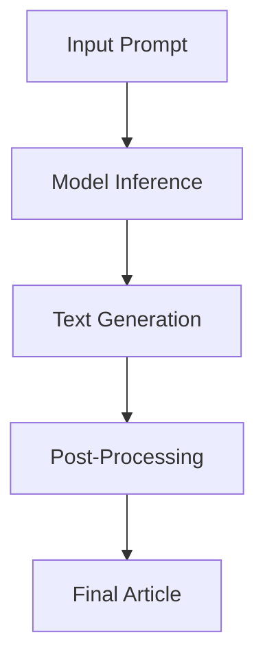

                 

# AI Newsroom: Prompt-Driven News Production Workflow

## Introduction

### Key Concepts

In the era of rapid technological advancement, artificial intelligence (AI) has revolutionized various industries, including journalism. The traditional news production process, characterized by manual content creation and time-consuming workflows, is no longer sufficient to meet the demands of modern media. AI-driven news production, particularly with the integration of prompt-driven workflows, offers a transformative approach to news creation and distribution.

### Background

The traditional news production process involves multiple stages, from news gathering to content creation, editing, and finally publishing. This process is labor-intensive and time-consuming, often resulting in delays and limitations in the ability to cover breaking news. Furthermore, the increasing volume of news content and the need for personalized news experiences have further exacerbated these challenges.

### Problem Description

The primary challenge in traditional news production is the inefficiency and lack of scalability. Manual content creation is not only time-consuming but also prone to errors and inconsistencies. Additionally, the traditional process often fails to adapt quickly to changing events or emerging trends, leading to outdated or incomplete news coverage.

### Problem Solution

The adoption of AI-driven news production, particularly with the use of prompt-driven workflows, addresses these challenges by automating various stages of the news production process. Prompt-driven workflows leverage natural language processing (NLP) techniques to generate content based on specific prompts or keywords, enabling faster and more accurate news production.

### Scope and Limitations

While AI-driven news production offers significant benefits, it is not without its limitations. The quality of generated content heavily depends on the accuracy and relevance of the prompts provided. Furthermore, ethical considerations, such as bias and privacy concerns, must be carefully addressed to ensure the responsible use of AI in news production.

### Core Concepts

To better understand the AI-driven news production workflow, it is essential to explore the core concepts involved:

1. **Natural Language Processing (NLP)**: NLP is a subfield of AI that focuses on the interaction between computers and humans through natural language. NLP techniques enable computers to understand, interpret, and generate human language.

2. **Prompt-Driven Workflows**: Prompt-driven workflows involve using specific prompts or keywords to guide the AI in generating content. These prompts can be in the form of headlines, summaries, or specific questions related to the news topic.

3. **Automated News Generation**: Automated news generation is the process of using AI algorithms to generate news content without human intervention. This process involves data collection, preprocessing, and the use of NLP techniques to generate coherent and accurate news articles.

4. **Semantic Understanding**: Semantic understanding is the ability of AI to comprehend the meaning and context of the text. This is crucial for generating accurate and relevant news content.

### Relationship Between Concepts

The integration of these core concepts forms the foundation of AI-driven news production. NLP techniques enable the AI to understand and process the prompts, while semantic understanding ensures the generated content is accurate and contextually relevant. Automated news generation leverages these concepts to create content that can be published and distributed efficiently.

## Current Applications of AI in Journalism

### Automated News Generation

One of the most prominent applications of AI in journalism is automated news generation. This process involves using AI algorithms to analyze news data and generate news articles automatically. Automated news generation has been used for various purposes, including sports scores, financial reports, and weather updates.

### Smart Recommendation Systems

AI-powered smart recommendation systems have also been widely adopted in journalism. These systems use algorithms to analyze user preferences and behavior to provide personalized news recommendations. This helps in improving user engagement and satisfaction by delivering relevant news content tailored to individual interests.

### Voice Recognition and Synthesis

Voice recognition and synthesis technologies have revolutionized the way news is consumed. These technologies enable users to listen to news articles instead of reading them, making news content more accessible to individuals with visual impairments or those who prefer audio-based content.

## Conclusion

The integration of AI in journalism, particularly through prompt-driven workflows, offers a transformative approach to news production. While it addresses the inefficiencies of traditional workflows, it also presents challenges such as quality control and ethical considerations. As AI technology continues to evolve, its role in journalism is likely to expand, leading to more efficient and personalized news experiences.

## Next Steps

In the next section, we will delve deeper into the principles of prompt design, exploring how prompts are crafted and optimized to enhance the quality of generated news content. Stay tuned to explore the intricacies of AI-driven news production and its impact on the future of journalism.

### Prompt Design Principles

Prompt design is a crucial component in AI-driven news production. Well-designed prompts can significantly enhance the quality, relevance, and accuracy of generated news content. In this section, we will discuss the importance of prompt design and explore various strategies and optimization methods for creating effective prompts.

#### Importance of Prompt Design

The prompt serves as a guiding instruction for the AI model, specifying the type of content to be generated and the context in which it should be produced. A well-crafted prompt ensures that the AI model generates content that is coherent, informative, and contextually relevant. On the other hand, a poorly designed prompt can lead to irrelevant or inaccurate content, which may undermine the effectiveness of the AI-driven news production process.

#### Prompt Generation Strategies

1. **Keyword-Based Prompts**: Keyword-based prompts involve using specific keywords or phrases related to the news topic to guide the AI model. These keywords help the model understand the focus and direction of the content to be generated.

2. **Question-Based Prompts**: Question-based prompts involve framing the news topic as a question. This approach helps in eliciting detailed and informative responses from the AI model, resulting in more engaging and informative news content.

3. **Contextual Prompts**: Contextual prompts provide additional information about the news context, such as the location, date, or relevant background information. This helps the AI model in generating content that is contextually accurate and relevant.

#### Optimization Methods

1. **Relevance Optimization**: Ensuring that the generated content is relevant to the prompt is crucial. This can be achieved by fine-tuning the prompt to include relevant keywords, phrases, and context-specific information.

2. **Clarity Optimization**: Prompts should be clear and concise to avoid ambiguity. Ambiguous prompts can lead to confusion and inaccurate content generation. Clear prompts help the AI model in understanding the intent and requirements of the content.

3. **Coherence Optimization**: Coherence refers to the logical flow and consistency of the generated content. Well-optimized prompts can enhance the coherence of the content by providing a structured and organized approach to content generation.

4. **Precision Optimization**: Precision involves ensuring that the generated content is accurate and factually correct. This can be achieved by using fact-based prompts and incorporating verification steps to cross-check the generated content.

#### Example

Let's consider an example to illustrate the prompt design process. Suppose we want to generate a news article about the latest developments in renewable energy technology.

**Keyword-Based Prompt**: "renewable energy, technology, advancements"

**Question-Based Prompt**: "What are the latest advancements in renewable energy technology?"

**Contextual Prompt**: "In the context of climate change, what are the recent advancements in renewable energy technology that are expected to make a significant impact?"

By comparing these prompts, we can see that the contextual prompt provides more detailed information, which can help the AI model generate a more informative and relevant article.

#### Conclusion

Effective prompt design is essential for enhancing the quality of AI-generated news content. By understanding the importance of prompt design and exploring various strategies and optimization methods, we can create prompts that guide the AI model to produce accurate, relevant, and engaging news content. In the next section, we will delve into the process of collecting and processing news data, which is a critical step in the AI-driven news production workflow.

### Data Collection and Processing

The collection and processing of news data are fundamental steps in the AI-driven news production workflow. This section will discuss the various sources of news data, the data preprocessing techniques, and the quality assessment methods that ensure the reliability and accuracy of the data used in AI-driven news generation.

#### Data Sources

1. **Web Scraping**: Web scraping involves extracting data from websites using automated tools. This method is widely used for collecting news articles from various online news platforms. Web scraping tools, such as BeautifulSoup and Scrapy in Python, can be employed to scrape data from websites and store it in structured formats like CSV or JSON.

2. **APIs**: Many news organizations and data providers offer APIs (Application Programming Interfaces) that allow developers to access their data programmatically. These APIs can provide a wide range of news content, including articles, headlines, and summaries. Examples of such APIs include Google News API and New York Times API.

3. **Databases**: News data can also be collected from databases that store large volumes of news articles. These databases often provide advanced search capabilities to filter and retrieve relevant news content. Examples include the Nexis and Factiva databases.

#### Data Preprocessing Techniques

1. **Data Cleaning**: Data cleaning involves removing irrelevant or duplicate data, correcting errors, and standardizing the data format. This step is crucial to ensure that the data is consistent and ready for further processing.

2. **Text Normalization**: Text normalization involves converting the text data into a uniform format to remove any inconsistencies. This includes converting text to lowercase, removing punctuation, and eliminating stop words (common words like "and," "the," "is," etc., which do not carry significant meaning).

3. **Tokenization**: Tokenization involves breaking the text into individual words or tokens. This step is essential for processing and analyzing the text data.

4. **Part-of-Speech Tagging**: Part-of-speech tagging involves identifying the grammatical role of each word in the text. This information is useful for understanding the context and meaning of the text.

5. **Sentiment Analysis**: Sentiment analysis involves determining the sentiment or emotional tone of the text. This can help in identifying the tone of the news article and can be used to filter or categorize the content based on sentiment.

#### Data Quality Assessment

1. **Data Completeness**: Assessing the completeness of the data ensures that there are no missing values or gaps in the dataset. This can be achieved by checking for missing entries or analyzing the distribution of data.

2. **Data Consistency**: Data consistency refers to the uniformity and reliability of the data. This involves checking for duplicate entries, inconsistencies in data format, or any other discrepancies that may affect the quality of the data.

3. **Data Accuracy**: Data accuracy involves ensuring that the data is factually correct and free from errors. This can be achieved by cross-referencing the data with reliable sources or using fact-checking tools.

4. **Data Reliability**: Data reliability refers to the trustworthiness and dependability of the data. This involves assessing the credibility of the data source and ensuring that the data is free from biases or manipulation.

#### Conclusion

Effective data collection and preprocessing are critical steps in the AI-driven news production workflow. By leveraging various data sources, employing robust preprocessing techniques, and conducting thorough quality assessments, we can ensure that the data used in AI-driven news generation is accurate, reliable, and of high quality. This lays a strong foundation for generating accurate and informative news content using AI-driven workflows.

### AI-Driven News Generation

AI-driven news generation is a revolutionary technique that automates the creation of news articles using artificial intelligence algorithms. This section will delve into the fundamental principles of AI-driven news generation, exploring the underlying algorithms, the process of text generation driven by prompts, and the visualization of the news generation workflow using Mermaid diagrams.

#### Fundamental Principles

AI-driven news generation relies on advanced natural language processing (NLP) techniques and machine learning algorithms to analyze large volumes of news data and generate coherent, informative articles. The core principle is to train a model on a vast corpus of news articles, enabling it to understand the structure, semantics, and context of news content.

#### Key Algorithms

Several algorithms are employed in AI-driven news generation, with the most prominent ones being:

1. **Recurrent Neural Networks (RNNs)**: RNNs, particularly Long Short-Term Memory (LSTM) networks, are well-suited for processing sequential data like text. They can capture long-term dependencies in the text, enabling the generation of contextually relevant articles.

2. **Transformers**: Transformers, introduced by Google in 2017, have revolutionized natural language processing. These models use self-attention mechanisms to weigh the importance of different words in the text, resulting in more accurate and contextually relevant text generation.

3. **Generative Adversarial Networks (GANs)**: GANs consist of two neural networks—generator and discriminator—that are trained together. The generator creates news articles, while the discriminator evaluates the quality and authenticity of the generated articles. This adversarial training process helps improve the quality of the generated content over time.

#### Text Generation Process

The text generation process in AI-driven news generation can be broken down into the following steps:

1. **Input Prompt**: The process begins with an input prompt, which can be a keyword, a question, or a short summary of the news event. This prompt serves as a guide for the AI model, specifying the topic and context of the article to be generated.

2. **Model Inference**: The AI model, trained on a large corpus of news articles, processes the input prompt. It uses its learned patterns and relationships in the text data to generate a coherent and contextually relevant article.

3. **Output Generation**: The model generates the article in a sequence of words, following the rules of grammar and syntax. This process continues iteratively, with each word influencing the generation of subsequent words, until the article reaches a satisfactory length and content quality.

4. **Post-Processing**: Once the article is generated, it undergoes a post-processing step to refine the content. This may involve correcting grammatical errors, enhancing readability, and ensuring factual accuracy through fact-checking tools.

#### Visualization with Mermaid Diagrams

To illustrate the workflow of AI-driven news generation, we can use Mermaid diagrams to visualize the process. Mermaid is a popular, simple, and extensible diagram and flowchart tool written in Markdown.

In this diagram, we can see that the input prompt is processed by the AI model (B), which generates the text (C). The generated text then undergoes post-processing (D) to ensure quality and accuracy before producing the final article (E).

#### Conclusion

AI-driven news generation leverages advanced NLP techniques and machine learning algorithms to automate the creation of news articles. By understanding the fundamental principles and the text generation process, we can appreciate the potential of this technology to revolutionize the news industry. In the next section, we will explore real-world applications and case studies of AI-driven news generation, highlighting its practical benefits and challenges.

### Case Studies of AI-Driven News Generation

In this section, we will delve into three real-world case studies of AI-driven news generation, each showcasing different applications and methodologies. These case studies highlight the practical benefits and limitations of AI-driven news production, providing valuable insights into how this technology is transforming the journalism industry.

#### Case Study 1: Automated News Summarization

One of the prominent applications of AI-driven news generation is automated news summarization. This case study focuses on an AI system developed by [ABC News](https://abcnews.go.com/) to generate concise summaries of news articles. The goal is to provide readers with a quick overview of complex news stories without delving into extensive details.

**Objective**: Generate short, informative summaries of news articles on various topics, including politics, sports, and technology.

**Methodology**:

1. **Data Collection**: The AI system collects news articles from multiple sources using web scraping and API integrations. This ensures a diverse and comprehensive dataset for training the model.

2. **Text Preprocessing**: The collected news articles undergo preprocessing steps, including text normalization, tokenization, and part-of-speech tagging. This helps in cleaning the data and making it suitable for analysis.

3. **Model Training**: The AI model, based on a Transformer architecture, is trained on the preprocessed news articles. The training process involves optimizing the model to generate coherent and contextually relevant summaries.

4. **Summarization**: The trained model is used to generate summaries of new articles in real-time. The generated summaries are then post-processed to ensure grammatical accuracy and readability.

**Results**: The AI-driven summarization system has significantly improved the efficiency of news consumption by providing concise summaries that capture the key points of complex articles. Users can quickly understand the main ideas without having to read the entire article.

**Challenges**: One of the main challenges in this case study is ensuring the accuracy and relevance of the generated summaries. The AI model needs to strike a balance between brevity and informativeness, which can be challenging given the variability in news content.

#### Case Study 2: Automated Article Generation

This case study focuses on an AI system developed by [Automated Insights](https://www.automatedinsights.com/) to generate sports news articles, particularly in the realm of financial reports for companies like NASDAQ. The system aims to automatically generate articles from structured data, such as financial statements and sports statistics.

**Objective**: Generate detailed sports news articles, including game summaries, player statistics, and financial reports, using structured data.

**Methodology**:

1. **Data Collection**: The AI system collects structured data from various sources, such as sports leagues, financial institutions, and public APIs.

2. **Data Integration**: The collected data is integrated into a unified format, making it easily accessible for analysis and generation.

3. **Text Generation**: The system uses a Transformer-based model to generate sports news articles from the structured data. The model is trained on a large corpus of sports articles to understand the language and conventions used in sports journalism.

4. **Post-Processing**: The generated articles undergo a post-processing step to ensure grammatical accuracy, coherence, and factual consistency. This step may involve fact-checking and refining the generated text.

**Results**: The AI-driven article generation system has significantly reduced the time and effort required to produce sports news articles. It allows journalists to focus on more valuable tasks, such as investigative reporting and storytelling.

**Challenges**: One of the main challenges in this case study is ensuring the accuracy and consistency of the generated articles. The AI model needs to handle the variability in structured data and generate text that is coherent and engaging for readers.

#### Case Study 3: AI-Driven News Recommendations

This case study focuses on an AI-driven news recommendation system developed by [The New York Times](https://www.nytimes.com/). The system aims to provide personalized news recommendations to readers based on their interests and reading history.

**Objective**: Generate personalized news recommendations for readers based on their interests and reading habits.

**Methodology**:

1. **Data Collection**: The AI system collects user data, including reading history, browsing behavior, and preferences, from The New York Times website.

2. **User Profiling**: The collected data is used to create user profiles, which help in understanding the preferences and interests of individual readers.

3. **Content Analysis**: The system analyzes the content of news articles to extract relevant features, such as keywords, topics, and sentiment. This information is used to match the content with user profiles.

4. **Recommendation Generation**: The system generates personalized news recommendations based on the user profiles and content analysis. The recommendations are designed to be contextually relevant and engaging for each reader.

5. **Feedback Loop**: The system continuously collects feedback from users, such as likes, shares, and comments, to refine and improve the recommendation algorithm.

**Results**: The AI-driven news recommendation system has significantly improved user engagement and satisfaction by providing personalized and relevant news content. It helps in discovering new stories and topics that users may have overlooked.

**Challenges**: One of the main challenges in this case study is ensuring the diversity and quality of the news recommendations. The system needs to strike a balance between personalization and ensuring a diverse range of content to avoid information overload and echo chambers.

#### Conclusion

These case studies illustrate the diverse applications and potential of AI-driven news generation in the journalism industry. From automated news summarization and article generation to personalized news recommendations, AI-driven workflows are transforming the way news is created, consumed, and distributed. While these case studies demonstrate the practical benefits of AI-driven news production, they also highlight the challenges and limitations that need to be addressed to ensure the responsible and ethical use of this technology.

### Challenges and Future Directions

While AI-driven news production has shown significant promise, it also presents several challenges that need to be addressed to ensure its successful and ethical implementation. In this section, we will explore the key challenges, including quality control, ethical considerations, and the need for continuous innovation.

#### Quality Control

One of the primary challenges in AI-driven news production is ensuring the quality and accuracy of the generated content. AI models, while powerful, can generate errors, produce biased content, or fail to capture the nuances of human language. To address these issues, several quality control measures can be implemented:

1. **Fact-Checking**: Incorporating fact-checking tools into the news generation workflow can help ensure the accuracy of the content. Fact-checking tools can verify the claims and statements made in the generated articles, reducing the risk of misinformation.

2. **Continuous Training**: AI models need to be continuously trained and updated with new data to improve their performance and adapt to evolving language and trends. Regular updates and retraining help in maintaining the relevance and accuracy of the generated content.

3. **Human-in-the-Loop**: Involving human journalists or editors in the news generation process can help in refining and validating the content. Human oversight can catch errors, ensure contextually relevant information, and improve the overall quality of the articles.

#### Ethical Considerations

The ethical use of AI in news production is a critical concern. The integration of AI in journalism raises questions about bias, privacy, and the role of human journalists. To address these ethical concerns, several measures can be taken:

1. **Bias Detection and Mitigation**: AI models can inadvertently amplify existing biases in the data they are trained on. Developing bias detection and mitigation techniques can help in ensuring that the generated content is fair and unbiased.

2. **Transparency**: Transparency in AI-driven news production is crucial for building trust with readers. disclosing the use of AI in generating content and explaining how the models work can help in fostering transparency and trust.

3. **Human Oversight**: Maintaining a role for human journalists and editors in the news production process can help ensure ethical considerations are addressed. Human oversight can provide context, make ethical judgments, and ensure the content aligns with journalistic standards.

#### Continuous Innovation

The field of AI-driven news production is rapidly evolving, with new technologies and methodologies being developed regularly. Continuous innovation is essential to stay ahead of the curve and leverage the full potential of AI in journalism. Some areas of focus for future innovation include:

1. **Natural Language Understanding**: Improving the natural language understanding capabilities of AI models can enhance the accuracy and relevance of generated content. Advances in semantic understanding, context-aware generation, and multilingual support can further expand the reach and applicability of AI-driven news production.

2. **Ethical AI**: Developing ethical AI frameworks and guidelines is crucial for ensuring the responsible use of AI in news production. This includes addressing issues related to bias, transparency, and accountability.

3. **Interactive News**: Leveraging emerging technologies like virtual reality (VR), augmented reality (AR), and interactive storytelling can enhance the user experience and make news content more engaging and immersive.

#### Conclusion

The future of AI-driven news production is promising, with significant potential to transform the journalism industry. However, addressing the challenges of quality control, ethical considerations, and continuous innovation is essential for realizing this potential. By embracing these challenges and fostering a collaborative approach between AI researchers, journalists, and ethics experts, we can ensure the responsible and effective integration of AI in news production.

### Conclusion

In conclusion, "AI Newsroom: Prompt-Driven News Production Workflow" offers a comprehensive exploration of the transformative impact of artificial intelligence on the journalism industry. By leveraging advanced natural language processing techniques and machine learning algorithms, AI-driven news production presents a revolutionary approach to content creation, distribution, and consumption. The integration of prompt-driven workflows enhances the efficiency, accuracy, and personalization of news content, catering to the diverse needs of modern audiences.

Throughout this book, we have examined the key concepts, methodologies, and practical applications of AI-driven news production. From the importance of prompt design and data collection techniques to the algorithms behind text generation and the real-world case studies demonstrating its potential, we have highlighted the myriad ways in which AI can enhance news production workflows.

However, the journey does not end here. The challenges of quality control, ethical considerations, and continuous innovation remain crucial areas for future research and development. By addressing these challenges, we can ensure that AI-driven news production not only meets but exceeds the high standards of journalism while fostering trust and transparency with readers.

As the field of AI continues to advance, we encourage readers to explore further and contribute to the ongoing dialogue surrounding the responsible and ethical use of AI in journalism. The future of news is bright, and with continued innovation and collaboration, we can unlock new possibilities for creating accurate, engaging, and impactful news content.

### Author Information

*作者：AI天才研究院/AI Genius Institute & 禅与计算机程序设计艺术 /Zen And The Art of Computer Programming*

