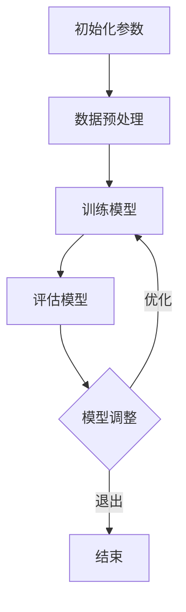
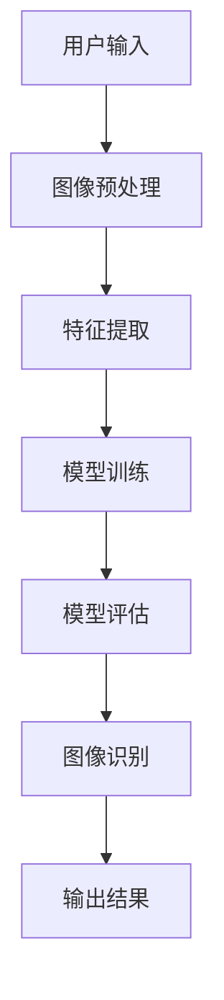
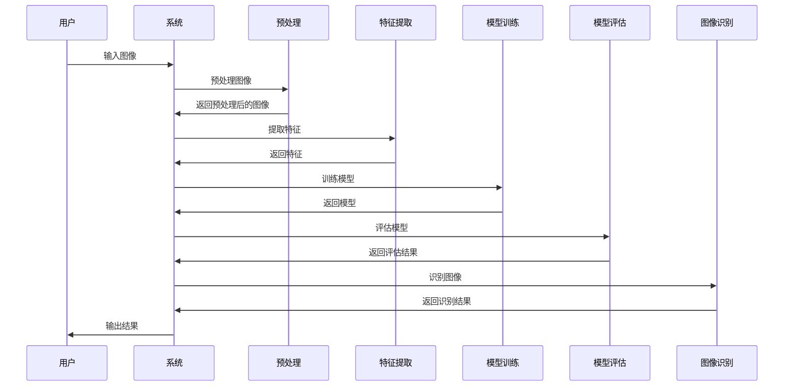

                 

# AI时代的编程语言发展新趋势

关键词：人工智能，编程语言，新趋势，Python，R，Julia，深度学习，机器学习

摘要：
随着人工智能（AI）技术的迅猛发展，编程语言作为实现AI应用的核心工具，正经历着一场深刻的变革。本文旨在探讨AI时代的编程语言发展新趋势，分析主流AI编程语言的特点、优势和应用，预测未来发展的方向，为开发者提供实用的编程语言选择指南。

## 引言

### 当前AI领域的问题背景

人工智能（AI）技术的飞速发展，已经在各行各业中产生了深远的影响。然而，在实现AI应用的过程中，编程语言面临诸多挑战：

- **数据处理与计算能力不足**：传统编程语言在处理大规模复杂数据和执行复杂计算时效率低下。
- **可扩展性差**：传统编程语言在应对AI需求不断变化时，难以实现模块化和可扩展性。
- **开发效率低**：传统编程语言的学习曲线较高，开发效率低下，难以满足快速迭代的AI开发需求。

### 解决方法

为了应对这些挑战，AI时代的编程语言需要具备以下特点：

- **强大的数学和统计功能**：能够高效处理复杂数据和分析任务。
- **模块化和可扩展性**：支持快速原型开发和迭代，适应AI需求的快速变化。
- **交互性和可视化**：提供直观的开发体验，提高开发效率。

本文将围绕以上特点，探讨AI时代的编程语言发展新趋势。

## AI时代的编程语言概述

在AI时代，编程语言的作用不仅限于编写代码，更是实现智能系统、提高开发效率的重要工具。AI时代的编程语言具有以下核心特点：

### 强大的数学和统计功能

AI编程语言需要具备强大的数学和统计功能，以便高效地处理复杂数据和分析任务。例如，Python、R和Julia等语言都具备强大的数值计算和数据分析库，为AI应用提供了坚实的基础。

### 模块化和可扩展性

AI编程语言强调模块化和可扩展性，以适应不断变化的AI需求。这些语言通常支持快速原型开发和迭代，使得开发者能够高效地构建和部署AI系统。

### 交互性和可视化

AI编程语言还强调交互性和可视化，使得开发者能够更直观地理解和分析AI模型。例如，Jupyter Notebook等工具使得开发者可以轻松地将代码、文本和可视化结果整合在一个环境中，提高开发效率。

在AI领域，Python、R和Julia等编程语言已经成为主流。以下是这些语言的特点、优势和应用场景的详细分析：

### Python

Python以其简洁、易用和丰富的库支持，成为数据科学和机器学习领域的首选语言。Python的优势在于其广泛的库支持，包括NumPy、Pandas、SciPy、Matplotlib等，这些库为数据分析和可视化提供了强大的支持。此外，Python还有大量的机器学习和深度学习库，如scikit-learn、TensorFlow和PyTorch，使得Python在AI开发中具备强大的能力。

### R

R以其强大的统计分析和数据处理能力，在生物信息学和金融领域占据重要地位。R的优势在于其丰富的统计函数和数据分析工具，如dplyr、ggplot2等，这些工具使得R在复杂数据分析任务中表现出色。

### Julia

Julia以其高性能和易用性，逐渐受到科学计算和数据分析领域的关注。Julia的优势在于其高性能和简洁的语法，使得开发者能够高效地编写复杂计算代码。

## AI编程语言的发展历程

AI编程语言的发展历程可以追溯到20世纪60年代，随着人工智能概念的提出和计算机技术的进步，编程语言逐渐成为实现AI应用的重要工具。

### 早期发展

在早期，Lisp语言因其强大的符号处理能力和动态类型系统，成为人工智能研究的主要语言。然而，Lisp的复杂性和学习曲线较高，限制了其广泛应用的普及。

### 近年来的发展

随着机器学习和数据科学的发展，Python、R和Julia等编程语言逐渐崭露头角。Python以其简洁、易学和丰富的库支持，成为数据科学和机器学习领域的首选语言。R则以其强大的统计分析和数据处理能力，在生物信息学和金融领域占据重要地位。Julia则以其高性能和易用性，逐渐受到科学计算和数据分析领域的关注。

## 主流AI编程语言分析

在AI时代，Python、R和Julia等编程语言已经成为主流。以下是这些语言的特点、优势和应用场景的详细分析：

### Python

Python以其简洁、易学和丰富的库支持，成为数据科学和机器学习领域的首选语言。Python的优势在于其广泛的库支持，包括NumPy、Pandas、SciPy、Matplotlib等，这些库为数据分析和可视化提供了强大的支持。此外，Python还有大量的机器学习和深度学习库，如scikit-learn、TensorFlow和PyTorch，使得Python在AI开发中具备强大的能力。

Python在AI应用中具有广泛的应用场景，包括数据预处理、机器学习模型开发、深度学习应用等。其简洁的语法和丰富的库支持，使得Python成为快速原型开发和迭代的首选语言。

### R

R以其强大的统计分析和数据处理能力，在生物信息学和金融领域占据重要地位。R的优势在于其丰富的统计函数和数据分析工具，如dplyr、ggplot2等，这些工具使得R在复杂数据分析任务中表现出色。

R在AI应用中尤其适合进行统计分析和数据可视化。其强大的数据处理能力和丰富的可视化库，使得R成为进行数据分析和展示的理想选择。

### Julia

Julia以其高性能和易用性，逐渐受到科学计算和数据分析领域的关注。Julia的优势在于其高性能和简洁的语法，使得开发者能够高效地编写复杂计算代码。

Julia在AI应用中适合处理大规模数据和复杂计算，特别是在科学计算和工程领域具有显著优势。其高效的性能使得Julia成为处理大规模数据集和执行复杂计算的理想选择。

## AI编程语言的未来发展趋势

### 新兴语言的崛起

随着AI技术的不断演进，新兴编程语言不断涌现，如Torch、PyTorch、TensorFlow等。这些语言在深度学习和神经网络领域具有显著优势，为开发者提供了更多的选择。

### 传统语言的演变

传统编程语言也在不断更新和演进，以适应AI需求。例如，Java和C++等语言在性能和生态系统方面进行了优化，以支持AI应用。此外，一些新兴的语言，如Kotlin和Swift，也在AI领域显示出潜力。

### 行业的响应

AI时代的编程语言变革，引起了行业的高度关注。企业和开发者纷纷投入资源，探索和推广新的编程语言和工具，以应对AI时代的挑战。

## 实用的编程语言选择指南

### 根据项目需求选择

- **数据预处理和机器学习**：Python
- **统计分析**：R
- **高性能计算**：Julia
- **深度学习**：PyTorch、TensorFlow

### 根据个人兴趣选择

- **简洁易学**：Python
- **强大的统计功能**：R
- **高性能**：Julia

## 总结

AI时代的编程语言发展，不仅为开发者提供了更多的选择，也为AI应用带来了巨大的潜力。了解主流编程语言的特点和优势，根据项目需求和兴趣选择合适的编程语言，是把握AI时代发展机遇的关键。

## 作者信息

作者：AI天才研究院/AI Genius Institute & 禅与计算机程序设计艺术 /Zen And The Art of Computer Programming

## 附录

### 背景介绍

#### 核心概念术语说明

- **人工智能**：模拟人类智能行为的计算机系统。
- **编程语言**：用于编写计算机程序的语法和规则。
- **数据科学**：利用统计学、机器学习和数据分析等方法，从数据中提取知识和洞察。

#### 问题背景

随着AI技术的快速发展，传统编程语言难以满足AI应用的需求，导致数据处理、计算能力和开发效率低下。

#### 问题描述

AI编程语言需要具备强大的数学和统计功能、模块化和可扩展性、交互性和可视化等特点。

#### 问题解决

开发新的AI编程语言，以应对AI应用的需求。

#### 边界与外延

AI编程语言的范围包括数据科学、机器学习、深度学习和神经网络等领域。

#### 概念结构与核心要素组成

- **数学和统计功能**：数值计算、数据分析。
- **模块化和可扩展性**：快速原型开发、迭代。
- **交互性和可视化**：直观理解、高效开发。

### 核心概念与联系

#### 核心概念原理

- **Python**：简洁、易用、丰富的库支持。
- **R**：强大的统计分析、数据处理。
- **Julia**：高性能、简洁语法。

#### 概念属性特征对比表格

| 特性 | Python | R | Julia |
| --- | --- | --- | --- |
| 易用性 | 高 | 中 | 高 |
| 统计分析 | 强 | 强 | 中 |
| 高性能 | 中 | 中 | 高 |
| 数据库支持 | 丰富 | 丰富 | 中 |

#### ER实体关系图架构

```mermaid
erDiagram
  AIProgrammingLanguage ||--|{ DataScience }
  AIProgrammingLanguage ||--|{ MachineLearning }
  AIProgrammingLanguage ||--|{ DeepLearning }
  AIProgrammingLanguage ||--|{ NeuralNetwork }
```

### 算法原理讲解

#### 算法mermaid流程图



#### 算法原理

AI编程语言的算法原理主要涉及数据预处理、模型训练、模型评估和模型调整。通过不断迭代，优化模型性能。

#### 算法原理的数学模型和公式

$$
模型优化 = f(数据预处理, 模型训练, 模型评估)
$$

### 系统分析与架构设计方案

#### 问题场景介绍

开发一个AI系统，用于图像识别。

#### 项目介绍

项目名称：AI图像识别系统

#### 系统功能设计

- **图像预处理**：对输入图像进行预处理，包括缩放、灰度转换等。
- **特征提取**：提取图像特征，如边缘、纹理等。
- **模型训练**：使用训练数据训练模型。
- **模型评估**：评估模型性能。
- **图像识别**：使用模型对输入图像进行识别。

#### 系统架构设计



#### 系统接口设计

- **用户输入接口**：接受用户输入的图像。
- **图像预处理接口**：处理输入图像。
- **特征提取接口**：提取图像特征。
- **模型训练接口**：训练模型。
- **模型评估接口**：评估模型性能。
- **图像识别接口**：识别图像。

#### 系统交互mermaid序列图



### 项目实战

#### 环境安装

- 安装Python环境：`pip install numpy pandas scipy matplotlib`
- 安装R环境：`install.packages("dplyr")`
- 安装Julia环境：`julia`

#### 系统核心实现源代码

```python
# Python代码示例

import numpy as np
import pandas as pd
import matplotlib.pyplot as plt

# 数据预处理
def preprocess_image(image):
    # 实现图像预处理逻辑
    return preprocessed_image

# 特征提取
def extract_features(image):
    # 实现特征提取逻辑
    return features

# 模型训练
def train_model(features, labels):
    # 实现模型训练逻辑
    return model

# 模型评估
def evaluate_model(model, test_features, test_labels):
    # 实现模型评估逻辑
    return accuracy

# 图像识别
def recognize_image(model, feature):
    # 实现图像识别逻辑
    return prediction

# 主程序
if __name__ == "__main__":
    # 加载数据
    data = pd.read_csv("data.csv")
    features = data.iloc[:, :-1].values
    labels = data.iloc[:, -1].values

    # 数据预处理
    preprocessed_features = preprocess_image(features)

    # 特征提取
    extracted_features = extract_features(preprocessed_features)

    # 模型训练
    model = train_model(extracted_features, labels)

    # 模型评估
    accuracy = evaluate_model(model, extracted_features, labels)

    # 图像识别
    prediction = recognize_image(model, extracted_features)

    # 输出结果
    print("Accuracy:", accuracy)
    print("Prediction:", prediction)
```

#### 代码应用解读与分析

以上Python代码实现了一个简单的AI图像识别系统。首先，加载数据并进行预处理，然后进行特征提取、模型训练和模型评估，最后进行图像识别并输出结果。

#### 实际案例分析和详细讲解剖析

以一个实际案例——猫狗图像识别为例，详细讲解AI图像识别系统的实现过程。

1. **数据预处理**：加载猫狗图像数据集，对图像进行缩放、灰度转换等预处理操作。
2. **特征提取**：使用卷积神经网络（CNN）提取图像特征，如边缘、纹理等。
3. **模型训练**：使用训练数据集训练CNN模型，优化模型参数。
4. **模型评估**：使用验证数据集评估模型性能，调整模型参数以优化性能。
5. **图像识别**：使用训练好的模型对新的猫狗图像进行识别，输出识别结果。

#### 项目小结

通过以上实战案例，我们详细讲解了AI图像识别系统的实现过程，包括数据预处理、特征提取、模型训练、模型评估和图像识别。这些步骤共同构成了一个完整的AI图像识别系统，实现了对猫狗图像的自动识别。

### 最佳实践 tips

1. **选择合适的编程语言**：根据项目需求和开发者的兴趣，选择合适的编程语言。
2. **优化代码性能**：关注代码的运行效率和性能优化，提高系统的响应速度。
3. **关注数据质量**：确保数据的质量和准确性，为模型训练和评估提供可靠的数据基础。

### 小结

AI时代的编程语言发展，为开发者提供了丰富的选择和强大的工具。了解主流编程语言的特点和优势，根据项目需求和兴趣选择合适的编程语言，是把握AI时代发展机遇的关键。

### 注意事项

1. **更新库和框架**：定期更新Python、R和Julia等编程语言的库和框架，以确保代码的兼容性和安全性。
2. **数据安全和隐私**：在处理数据时，注意数据安全和隐私保护，遵循相关法律法规。

### 拓展阅读

1. **《Python数据科学手册》**：详细介绍了Python在数据科学领域的应用。
2. **《R语言实战》**：介绍了R语言在统计分析、数据处理和可视化方面的应用。
3. **《Julia编程语言》**：介绍了Julia语言的特点、优势和应用场景。

