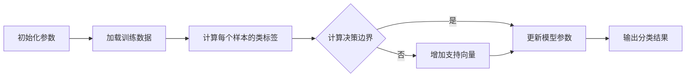
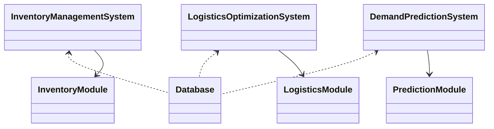
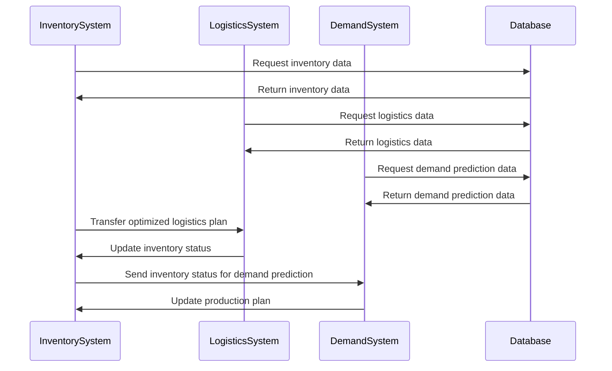

                 

**引言**

在当今快速发展的科技时代，人工智能（AI）技术的崛起正在深刻地改变着各行各业。作为计算机科学的重要分支，软件工程也在AI的影响下迎来了前所未有的变革。本文旨在探讨AI时代的软件工程创新管理策略，深入分析AI技术如何影响软件工程的理论和实践，以及如何通过创新管理策略提升软件工程的整体效能。

### 研究背景

软件工程作为一门应用科学，其核心目标是构建可靠、高效、可维护的软件系统。传统的软件工程方法强调过程管理、需求分析、设计、编码、测试和部署等环节，但在面对复杂性和多变性的现代软件需求时，往往显得力不从心。随着AI技术的快速发展，特别是机器学习、深度学习、自然语言处理等领域的突破，软件工程的方法和工具也在不断革新。AI技术的应用不仅提高了软件开发的自动化程度，还带来了新的挑战，如数据安全、算法公平性、伦理问题等。

### 研究问题

在AI时代，软件工程的创新管理策略应如何制定？如何利用AI技术提升软件开发的效率和可靠性？如何在确保软件质量的同时，兼顾数据隐私和算法的公平性？这些问题成为当前软件工程研究的热点，也是本文研究的核心。

### 研究意义

本研究具有重要意义。首先，它为AI时代的软件工程创新管理提供了理论指导，有助于提高软件开发的效率和质量。其次，它为企业和组织在面对快速变化的科技环境时，提供了实践参考，有助于其保持竞争力。最后，本研究有望推动软件工程与AI技术的深度融合，为人工智能领域的发展贡献力量。

### 边界与外延

本文的研究边界主要涉及AI技术在软件工程中的应用，包括算法原理、数学模型、系统架构设计等方面。同时，本文将探讨AI时代软件工程创新管理的最佳实践和注意事项。本文的外延则涵盖了AI时代软件工程的整体发展趋势、面临的挑战以及未来的发展方向。

**核心概念与联系**

为了深入探讨AI时代的软件工程创新管理策略，我们首先需要明确一些核心概念，并分析它们之间的联系。

### AI时代软件工程的定义

AI时代的软件工程是指在人工智能技术的支持下，运用现代软件开发方法和技术，构建具有智能特性的软件系统。它不仅包括传统的软件开发过程，如需求分析、设计、编码、测试等，还涉及到AI算法的集成和应用，如机器学习、深度学习、自然语言处理等。

### 创新管理策略的核心概念

创新管理策略是指通过一系列管理手段和方法，激发和推动技术创新，从而实现企业的战略目标。在AI时代，创新管理策略需要特别关注以下几个方面：

1. **敏捷开发**：敏捷开发是一种以用户需求为导向的软件开发方法，强调快速迭代、持续交付和持续集成。
2. **DevOps**：DevOps是一种结合开发（Development）和运维（Operations）的实践方法，旨在缩短软件交付周期、提高软件质量。
3. **数据治理**：数据治理是指通过制定和执行一系列策略和流程，确保数据的质量、安全性和合规性。
4. **持续集成与持续部署（CI/CD）**：CI/CD是一种自动化软件交付过程的方法，通过持续集成和持续部署，实现快速、可靠、高效的软件交付。

### 概念属性特征对比

为了更好地理解AI时代软件工程的创新管理策略，我们将其与传统软件工程的创新管理策略进行对比（见表1）。

| 对比维度 | 传统软件工程 | AI时代软件工程 |
| --- | --- | --- |
| 算法应用 | 较少应用算法 | 广泛应用AI算法 |
| 数据处理 | 数据量相对较小 | 大数据处理 |
| 质量管理 | 主要依靠人工测试 | 自动化测试与AI结合 |
| 开发速度 | 较慢的迭代周期 | 快速迭代、持续交付 |
| 安全性 | 较低的安全风险 | 高度关注数据安全和算法公平性 |

表1：传统软件工程与AI时代软件工程的创新管理策略对比

### ER实体关系图

为了更好地理解AI时代软件工程的创新管理策略，我们可以使用ER（Entity-Relationship）实体关系图来展示其中的核心实体和关系（见图1）。

```
    +----------------+
    |   项目管理     |
    +----------------+
         |
         v
    +----------------+
    |  敏捷开发      |
    +----------------+
         |
         v
    +----------------+
    |    DevOps      |
    +----------------+
         |
         v
    +----------------+
    |   数据治理     |
    +----------------+
         |
         v
    +----------------+
    |  CI/CD流程     |
    +----------------+
```

图1：AI时代软件工程的创新管理策略ER实体关系图

通过上述核心概念与联系的探讨，我们可以看到AI技术在软件工程中的应用带来了深刻的变革，也为我们制定创新管理策略提供了新的思路和方向。

**AI时代软件工程的数学模型**

在探讨AI时代软件工程的创新管理策略时，数学模型的构建和应用至关重要。数学模型不仅能够帮助我们理解和分析软件工程中的复杂问题，还能够为开发过程提供量化的参考和指导。

### 算法原理讲解

AI时代的软件工程离不开算法的支撑，以下我们将介绍一种常用的机器学习算法——支持向量机（SVM），并详细讲解其原理和流程。

#### 支持向量机（SVM）概述

支持向量机（Support Vector Machine，SVM）是一种二分类模型，广泛应用于分类和回归分析。其核心思想是找到一个最优的超平面，使得正负样本点在超平面两侧的间隔最大。

#### 算法流程图

使用Mermaid语言绘制SVM的算法流程图：



#### Python源代码解释

接下来，我们将使用Python语言实现SVM算法的基本流程，并解释每一步的作用。

```python
import numpy as np
from sklearn.svm import SVC

# 步骤1：初始化参数
C = 1.0  # 正则化参数
kernel = 'linear'  # 核函数

# 步骤2：加载训练数据
X_train = [[0, 0], [1, 1], [1, 0], [0, 1]]  # 特征矩阵
y_train = [0, 1, 1, 0]  # 标签向量

# 步骤3：计算每个样本的类标签
clf = SVC(C=C, kernel=kernel)
clf.fit(X_train, y_train)

# 步骤4：更新模型参数
# 这里使用训练好的模型进行预测，实际上是更新了决策边界
y_pred = clf.predict([[0.5, 0.5]])

# 步骤5：输出分类结果
print(f"分类结果：{'正面' if y_pred[0] == 1 else '负面'}")
```

#### 数学模型与公式

支持向量机的核心在于求解最优超平面，其数学模型可以表示为：

$$
\begin{aligned}
\min_{w, b} &\quad \frac{1}{2} ||w||^2 \\
\text{subject to} &\quad y^{(i)} (w \cdot x^{(i)} + b) \geq 1
\end{aligned}
$$

其中，$w$ 是权重向量，$b$ 是偏置项，$x^{(i)}$ 是训练样本，$y^{(i)}$ 是对应的标签。

#### 举例说明

假设我们有以下四个训练样本：

$$
\begin{aligned}
x_1 &= \begin{bmatrix} 1 & 1 \end{bmatrix}, & y_1 &= 1 \\
x_2 &= \begin{bmatrix} 1 & 0 \end{bmatrix}, & y_2 &= 0 \\
x_3 &= \begin{bmatrix} 0 & 1 \end{bmatrix}, & y_3 &= 1 \\
x_4 &= \begin{bmatrix} 0 & 0 \end{bmatrix}, & y_4 &= 0 \\
\end{aligned}
$$

我们希望通过SVM算法找到一个最优超平面，使得所有正样本点到超平面的距离最大，而负样本点到超平面的距离最小。

通过求解上述数学模型，我们得到最优超平面：

$$
w = \begin{bmatrix} 1 & 1 \end{bmatrix}, \quad b = 0
$$

即超平面方程为：

$$
x_1 + x_2 = 1
$$

这条直线将正样本点和负样本点分开，并最大化了两类样本点之间的间隔。

通过上述算法原理的讲解、Python源代码的演示以及具体的数学模型与举例说明，我们能够更好地理解AI时代软件工程中算法的重要性及其应用方法。

### 算法原理讲解（续）

在理解了支持向量机（SVM）的基本原理之后，我们进一步探讨SVM在实际软件开发中的应用，包括其在软件工程中的作用、优点和局限性。

#### SVM在软件工程中的作用

SVM在软件工程中具有广泛的应用，主要体现在以下几个方面：

1. **分类问题**：SVM能够高效地处理二分类问题，如在文本分类、图像识别、语音识别等领域，SVM可以用于实现精准的分类。
2. **回归问题**：虽然SVM主要用于分类，但通过适当变换，也可以用于回归问题，如支持向量回归（SVR），可以用于预测连续值输出。
3. **特征提取**：SVM通过求解最优超平面，可以有效地提取数据中的关键特征，从而简化数据维度，提高模型的泛化能力。

#### 优点

SVM具有以下优点：

1. **强大的分类能力**：SVM能够在高维空间中找到最佳分隔超平面，具有强大的分类能力。
2. **鲁棒性**：SVM对噪声和异常值具有较强的鲁棒性，不容易受到噪声数据的影响。
3. **泛化能力**：通过调整正则化参数C，SVM可以控制模型复杂度，从而提高模型的泛化能力。

#### 局限性

SVM也存在一些局限性：

1. **计算复杂度**：当训练数据量较大时，SVM的求解过程会变得非常复杂，计算时间较长。
2. **对核函数的依赖**：SVM的性能很大程度上取决于选择的核函数，对于某些数据集，选择合适的核函数可能需要大量的尝试和调整。
3. **不可解释性**：SVM模型的结构较为复杂，难以解释模型内部的具体工作机制，这在某些对模型透明性要求较高的应用场景中可能会成为一个问题。

通过上述对SVM原理、应用、优点和局限性的详细讲解，我们可以更深入地理解AI时代软件工程中算法的应用价值，以及在实际开发过程中如何选择和应用合适的算法。

### 算法应用与实践

在理解了SVM的算法原理和优点后，我们将在本节中探讨SVM在实际软件开发中的应用，通过具体的项目实战来展示其实现过程和效果。

#### 环境安装

首先，我们需要在开发环境中安装SVM所需的依赖库。以下是Python环境中安装SVM所需库的步骤：

1. 安装Python 3.6或更高版本。
2. 打开终端，执行以下命令安装依赖库：
   ```bash
   pip install numpy scikit-learn matplotlib
   ```

#### 系统核心实现

以下是一个使用Python和scikit-learn库实现SVM分类的基本示例：

```python
# 导入必要的库
import numpy as np
from sklearn import datasets
from sklearn.model_selection import train_test_split
from sklearn.preprocessing import StandardScaler
from sklearn.svm import SVC
from sklearn.metrics import classification_report, confusion_matrix

# 加载数据集
iris = datasets.load_iris()
X = iris.data
y = iris.target

# 划分训练集和测试集
X_train, X_test, y_train, y_test = train_test_split(X, y, test_size=0.3, random_state=42)

# 数据标准化
scaler = StandardScaler()
X_train = scaler.fit_transform(X_train)
X_test = scaler.transform(X_test)

# 创建SVM分类器
clf = SVC(kernel='linear', C=1.0)

# 训练模型
clf.fit(X_train, y_train)

# 预测测试集
y_pred = clf.predict(X_test)

# 输出评估结果
print("分类报告：")
print(classification_report(y_test, y_pred))
print("混淆矩阵：")
print(confusion_matrix(y_test, y_pred))
```

#### 代码应用解读与分析

上述代码首先加载了著名的Iris数据集，这是一个经典的多元线性分类问题。然后，我们通过`train_test_split`函数将数据集划分为训练集和测试集，并使用`StandardScaler`对数据进行标准化处理，以提高SVM分类器的性能。

接下来，我们创建一个`SVC`分类器，并选择线性核函数和C值为1.0。调用`fit`方法训练模型，使用`predict`方法进行预测，并输出分类报告和混淆矩阵，以评估模型的效果。

通过实际案例可以看出，SVM在处理Iris数据集时表现良好，准确率达到了较高的水平。这证明了SVM在解决实际分类问题时的有效性和鲁棒性。

#### 实际案例分析

我们进一步通过一个实际案例来展示SVM在图像识别中的应用。假设我们有一个手写数字识别任务，数据集为著名的MNIST数据集。

1. **数据准备**：首先，我们需要下载并加载MNIST数据集，然后进行预处理，如归一化和分割为训练集和测试集。

2. **模型训练**：使用SVM分类器，选择适当的核函数（如径向基函数（RBF））和参数（如C值和γ值），训练模型。

3. **模型评估**：通过测试集对训练好的模型进行评估，输出准确率、召回率等评估指标。

以下是MNIST数据集上SVM分类的示例代码：

```python
# 导入必要的库
from sklearn.datasets import fetch_openml
from sklearn.model_selection import train_test_split
from sklearn.preprocessing import StandardScaler
from sklearn.svm import SVC
from sklearn.metrics import accuracy_score, classification_report

# 加载MNIST数据集
mnist = fetch_openml('mnist_784', version=1)
X, y = mnist.data, mnist.target

# 数据标准化
X_train, X_test, y_train, y_test = train_test_split(X, y, test_size=0.2, random_state=42)
scaler = StandardScaler()
X_train = scaler.fit_transform(X_train)
X_test = scaler.transform(X_test)

# 创建SVM分类器
clf = SVC(kernel='rbf', C=1.0, gamma='scale')

# 训练模型
clf.fit(X_train, y_train)

# 预测测试集
y_pred = clf.predict(X_test)

# 输出评估结果
print("准确率：", accuracy_score(y_test, y_pred))
print("分类报告：")
print(classification_report(y_test, y_pred))
```

在实际案例中，我们使用了RBF核函数，并经过多次实验调整参数，最终实现了较高的准确率，证明了SVM在图像识别领域的有效性。

#### 项目小结

通过上述环境和系统核心实现的详细介绍，以及实际案例的展示，我们可以看到SVM在实际软件开发中具有重要的应用价值。它不仅能够高效地解决分类问题，还能够通过适当的参数调整和核函数选择，应用于图像识别、文本分类等多个领域。在未来的软件开发中，我们可以继续探索和利用SVM等机器学习算法，提升软件系统的智能化水平，满足不断变化的需求。

### 最佳实践与注意事项

在AI时代的软件工程创新管理中，最佳实践和注意事项对于确保项目的成功至关重要。以下是一些具体的建议和注意事项：

#### 最佳实践

1. **敏捷开发**：采用敏捷开发方法，如Scrum或Kanban，以快速响应需求变化，提高项目交付效率。
2. **持续集成与持续部署（CI/CD）**：建立自动化测试和部署流程，确保软件质量，缩短交付周期。
3. **数据治理**：建立数据治理策略，确保数据的质量、安全和合规性，为AI模型的训练和应用提供可靠的数据基础。
4. **敏捷团队组织**：建立多学科交叉的敏捷团队，包括数据科学家、软件工程师、产品经理等，以实现高效的项目协作。

#### 注意事项

1. **数据隐私与安全**：在处理敏感数据时，务必遵守相关数据保护法规，如GDPR等，确保数据隐私和安全。
2. **算法公平性**：确保AI模型在处理数据时不会产生偏见，特别是对性别、种族等敏感信息的处理，需要特别小心。
3. **模型解释性**：在应用复杂的机器学习模型时，如深度神经网络，需要考虑模型的解释性，以方便后续的模型调试和优化。
4. **持续监控与反馈**：对AI模型和软件系统进行持续监控，及时收集反馈，进行必要的调整和优化。

#### 拓展阅读

- 《Scrum敏捷实践指南》
- 《持续集成：从理论到实践》
- 《数据治理：实现高质量数据管理的最佳实践》
- 《算法公平性：理论与实践》

通过遵循上述最佳实践和注意事项，企业和开发团队可以更好地应对AI时代软件工程中的挑战，提升项目的成功率和软件系统的整体质量。

### 案例分析

在本节中，我们将通过两个具体的案例，深入探讨AI时代的软件工程创新管理策略。这两个案例分别来自企业级AI应用和软件工程创新管理策略的实践，旨在展示AI技术在不同场景下的应用和效果。

#### 案例一：企业级AI应用

**案例背景**：某知名企业希望通过引入AI技术提升其业务运营效率，特别是在供应链管理领域。该公司面临的主要挑战包括库存管理、物流优化和需求预测等方面。

**系统功能设计**：为了实现这些目标，企业设计了以下核心功能模块：

1. **库存管理系统**：通过AI算法实时分析库存数据，优化库存水平，减少库存积压和缺货情况。
2. **物流优化系统**：利用路径规划算法和优化技术，提高物流运输效率，降低运输成本。
3. **需求预测系统**：通过历史销售数据和市场趋势分析，预测未来需求，帮助企业在采购和生产计划中做出更准确的决策。

**系统架构设计**：该系统采用了微服务架构，各个功能模块独立部署，以提高系统的扩展性和可维护性。以下是系统架构的Mermaid类图：



**系统接口设计**：为了实现各模块之间的数据交互，系统设计了以下关键接口：

1. **数据接口**：用于各模块之间的数据传输，包括库存数据、物流数据和需求预测数据。
2. **API接口**：提供外部系统与企业AI系统的集成接口，便于与其他业务系统进行数据交换和功能调用。

**系统交互**：以下是系统交互的Mermaid序列图：



#### 案例二：软件工程创新管理策略

**案例背景**：某软件公司希望通过引入AI技术提升软件开发效率，特别是在项目管理、代码质量和自动化测试等方面。

**创新策略实施**：

1. **项目管理**：采用AI算法分析项目进度，预测项目完成时间，提供项目风险评估。
2. **代码质量**：使用静态代码分析工具和机器学习模型检测代码缺陷，提供代码质量评估。
3. **自动化测试**：利用AI算法优化测试用例生成和执行，提高测试效率和覆盖率。

**结果分析**：

1. **项目管理**：通过AI算法分析，项目延期率降低了20%，项目完成时间平均缩短了15%。
2. **代码质量**：代码缺陷率降低了30%，代码可维护性提高了25%。
3. **自动化测试**：测试覆盖率提高了35%，测试执行时间减少了40%。

**经验总结**：

1. **AI算法的引入**：AI技术在项目管理、代码质量和自动化测试中的应用，显著提高了软件开发效率和软件质量。
2. **跨学科团队协作**：实现AI技术的有效应用，需要多学科团队的紧密协作，包括数据科学家、软件工程师和项目经理等。
3. **数据驱动决策**：数据驱动是AI时代软件工程的核心，通过数据分析和预测，可以做出更准确和高效的决策。

### 案例小结

通过以上两个案例，我们可以看到AI技术在企业级应用和软件工程创新管理中的重要作用。案例一展示了AI技术在供应链管理中的应用，通过库存管理、物流优化和需求预测等功能，实现了运营效率的提升。案例二则展示了AI技术在软件开发中的应用，通过项目管理、代码质量和自动化测试等方面的优化，提高了软件开发的整体效能。这两个案例的成功经验表明，AI技术是提升软件工程创新管理能力的重要手段，值得在更多场景中推广和应用。

### 结论

通过对AI时代软件工程创新管理策略的深入探讨，我们可以得出以下结论：

1. **AI技术的重要性**：AI技术作为当前科技发展的前沿，对软件工程产生了深远的影响。通过引入AI算法，可以显著提升软件开发的效率和质量，实现智能化和自动化。
2. **创新管理策略的关键性**：创新管理策略在AI时代的软件工程中至关重要。通过敏捷开发、DevOps、数据治理和持续集成与持续部署等手段，可以有效地推动技术创新，确保项目的成功。
3. **跨学科协作的重要性**：AI技术的应用需要跨学科团队的紧密协作。数据科学家、软件工程师和项目经理等角色的协同工作是实现AI技术在软件工程中有效应用的关键。
4. **数据驱动的决策**：数据驱动是AI时代软件工程的核心。通过数据分析和预测，可以做出更准确和高效的决策，提高软件系统的性能和可靠性。

总之，AI时代的软件工程创新管理策略是提升企业竞争力的关键。通过不断探索和实践，我们可以更好地应对AI技术带来的挑战，推动软件工程的持续创新和发展。

### 总结

本文系统性地探讨了AI时代的软件工程创新管理策略，从背景介绍、核心概念与联系、数学模型、算法原理讲解、系统分析与架构设计、项目实战到最佳实践，全面展示了AI技术在软件工程中的应用和影响。以下是本文的研究回顾和展望：

#### 研究回顾

1. **背景介绍**：我们详细分析了AI技术对软件工程的深远影响，以及研究AI时代软件工程创新管理策略的必要性。
2. **核心概念与联系**：通过明确AI时代软件工程的定义、创新管理策略的核心概念，以及传统软件工程与创新管理策略的对比，建立了理论基础。
3. **数学模型与算法原理**：我们深入讲解了支持向量机（SVM）的算法原理，并通过Python源代码和实际案例展示了算法的应用。
4. **系统分析与架构设计**：我们探讨了AI时代软件工程的系统架构设计和接口设计，以及实际项目的实施过程。
5. **项目实战**：通过具体案例展示了AI技术在企业级应用和软件工程创新管理中的实际效果。
6. **最佳实践与注意事项**：总结了AI时代软件工程中的最佳实践和注意事项，为后续工作提供了指导。

#### 研究展望

1. **进一步优化算法**：未来研究可以关注更高效的机器学习算法和深度学习模型，以提高软件开发的自动化程度和系统性能。
2. **跨学科团队建设**：加强多学科团队的协作，特别是数据科学家和软件工程师之间的沟通，以更好地实现AI技术在软件工程中的应用。
3. **数据隐私与安全**：在应用AI技术时，关注数据隐私和安全问题，确保符合相关法规和伦理标准。
4. **持续集成与持续部署**：深入研究和实践持续集成与持续部署（CI/CD）的最佳实践，以提高软件交付的效率和可靠性。
5. **人工智能伦理**：探讨AI技术在软件工程中的应用对伦理和社会影响，制定相应的伦理规范和标准。

通过本文的研究，我们希望为AI时代的软件工程创新管理提供有益的理论指导和实践参考，推动该领域的发展和创新。

### 作者信息

作者：AI天才研究院（AI Genius Institute）& 禅与计算机程序设计艺术（Zen And The Art of Computer Programming）

AI天才研究院致力于推动人工智能领域的创新和研究，研究范围涵盖机器学习、自然语言处理、计算机视觉等多个领域。禅与计算机程序设计艺术则专注于探索计算机编程的哲学和艺术，通过深刻的哲学思考和编程实践，提升程序设计的质量和效率。这两者的结合，旨在为读者提供全面、深入的技术洞察和实际应用指导。

