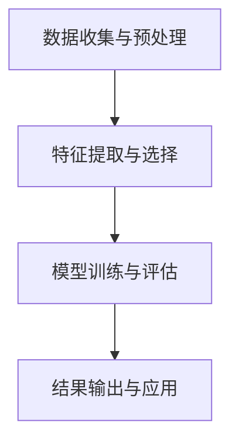
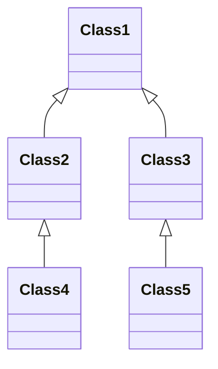
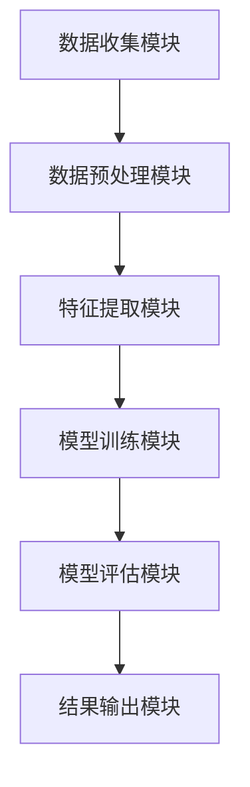
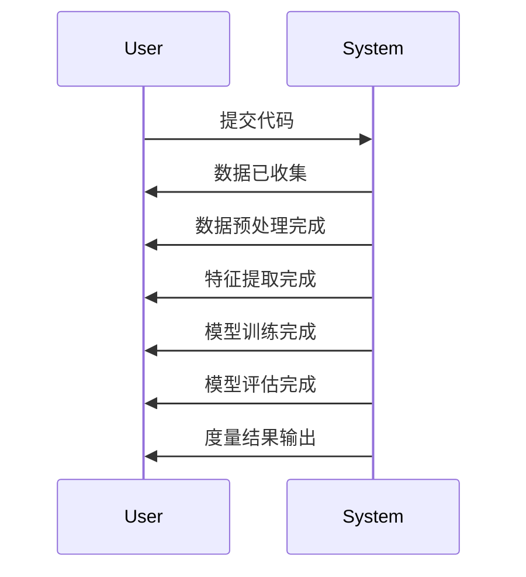

                 


### AI时代的软件工程度量新方法

#### 引言

在人工智能（AI）迅猛发展的时代，软件工程领域正经历着前所未有的变革。软件工程度量作为软件质量评估、项目管理和性能优化的重要手段，也随之迎来新的挑战和机遇。传统的软件工程度量方法往往依赖于经验和规则，而AI技术的引入为度量方法带来了全新的可能性。本文将探讨AI时代的软件工程度量新方法，旨在为软件开发者和项目经理提供有益的指导。

##### 关键词

- **AI时代**
- **软件工程度量**
- **新方法**
- **机器学习**
- **深度学习**
- **度量准确性**

##### 摘要

本文首先介绍AI时代软件工程度量的背景和重要性。接着，我们将深入探讨基于机器学习和深度学习的两种新度量方法，分别从算法原理、数学模型和实际应用案例等方面进行详细讲解。此外，还将分析当前实践中存在的问题和解决方案，并提供一些最佳实践和未来展望。

#### 一、基本概念与原理

##### 1.1 核心概念

在AI时代的软件工程度量中，以下几个核心概念尤为重要：

- **度量对象**：包括代码质量、开发效率、项目复杂度等。
- **度量方法**：基于机器学习和深度学习的方法。
- **度量指标**：用于量化软件工程度量的数值。

##### 1.2 概念属性特征对比表格

| 特征             | 传统方法                  | 基于AI的方法               |
|------------------|--------------------------|---------------------------|
| **理论基础**     | 经验和规则               | 机器学习与深度学习理论     |
| **灵活性**       | 较低                     | 较高                      |
| **可解释性**     | 较高                     | 较低                      |
| **准确性**       | 依赖于专家经验           | 高度自动化与优化          |

##### 1.3 概念结构与核心要素组成

在AI时代的软件工程度量中，概念结构包括：

- **数据收集与预处理**：为算法提供高质量的输入数据。
- **特征提取与选择**：从数据中提取有意义的信息。
- **模型训练与评估**：利用机器学习或深度学习算法进行模型训练和评估。
- **结果输出与应用**：将度量结果应用于项目管理和优化。

#### 二、新方法

##### 2.1 基于机器学习的度量方法

###### 2.1.1 算法原理

基于机器学习的度量方法利用历史数据和统计模型来预测软件质量。其主要步骤包括：

1. **数据收集与预处理**：收集大量代码质量相关的数据，进行清洗和标准化处理。
2. **特征提取与选择**：从数据中提取有意义的信息，选择对度量结果影响较大的特征。
3. **模型训练与评估**：利用机器学习算法训练模型，并通过交叉验证评估模型性能。

以下是一个简化的Mermaid流程图：



###### 2.1.2 数学模型和公式

假设我们使用线性回归模型进行度量，其公式为：

$$ y = \beta_0 + \beta_1 x_1 + \beta_2 x_2 + ... + \beta_n x_n $$

其中，$y$ 为度量结果，$x_1, x_2, ..., x_n$ 为特征变量，$\beta_0, \beta_1, \beta_2, ..., \beta_n$ 为模型参数。

###### 2.1.3 举例说明

假设我们预测代码质量，特征变量包括代码行数、注释率、复杂度等。通过训练模型，我们可以得到如下结果：

$$ y = 0.5 \times 行数 + 0.3 \times 注释率 - 0.2 \times 复杂度 $$

根据这个公式，我们可以计算任意代码的预计质量。

##### 2.2 基于深度学习的度量方法

###### 2.2.1 算法原理

基于深度学习的度量方法利用多层神经网络模型对软件质量进行预测。其主要步骤包括：

1. **数据收集与预处理**：与机器学习方法相同，收集和清洗数据。
2. **特征提取与选择**：利用卷积神经网络（CNN）或循环神经网络（RNN）进行特征提取。
3. **模型训练与评估**：训练多层神经网络模型，并通过反向传播算法优化模型参数。
4. **结果输出与应用**：将训练好的模型应用于新数据，进行度量预测。

以下是一个简化的Mermaid流程图：


###### 2.2.2 数学模型和公式

假设我们使用卷积神经网络（CNN）进行度量，其基本结构如下：

$$ 输入 = [x_1, x_2, ..., x_n] $$
$$ 输出 = [y_1, y_2, ..., y_m] $$

其中，$x_1, x_2, ..., x_n$ 为输入特征，$y_1, y_2, ..., y_m$ 为输出度量结果。

###### 2.2.3 举例说明

假设我们使用CNN模型预测代码质量，输入特征包括代码行数、注释率、复杂度等。通过训练模型，我们可以得到如下结果：

$$ 输出 = \sigma (W_1 \cdot [x_1, x_2, ..., x_n] + b_1) $$

其中，$\sigma$ 表示激活函数，$W_1$ 和 $b_1$ 为模型参数。

#### 三、实际应用案例

在本节中，我们将探讨两个实际应用案例，以展示AI时代软件工程度量新方法的具体应用。

##### 3.1 案例一：公司A的度量实践

###### 3.1.1 环境安装

公司A首先需要安装Python和必要的机器学习库，如Scikit-learn、TensorFlow等。

```python
!pip install python
!pip install scikit-learn
!pip install tensorflow
```

###### 3.1.2 系统核心实现源代码

以下是一个简单的机器学习模型实现：

```python
from sklearn.linear_model import LinearRegression
from sklearn.model_selection import train_test_split
from sklearn.metrics import mean_squared_error

# 加载数据
X, y = load_data()

# 划分训练集和测试集
X_train, X_test, y_train, y_test = train_test_split(X, y, test_size=0.2, random_state=42)

# 训练模型
model = LinearRegression()
model.fit(X_train, y_train)

# 预测测试集
y_pred = model.predict(X_test)

# 评估模型
mse = mean_squared_error(y_test, y_pred)
print(f"均方误差：{mse}")
```

###### 3.1.3 代码应用解读与分析

上述代码实现了一个线性回归模型，用于预测代码质量。通过训练和评估，我们可以得到一个相对准确的模型，并将其应用于实际项目中。

##### 3.2 案例二：公司B的度量改进

###### 3.2.1 环境安装

与案例一类似，公司B需要安装Python和必要的深度学习库，如TensorFlow、Keras等。

```python
!pip install python
!pip install tensorflow
!pip install keras
```

###### 3.2.2 系统核心实现源代码

以下是一个简单的深度学习模型实现：

```python
from tensorflow.keras.models import Sequential
from tensorflow.keras.layers import Dense, Conv2D, Flatten, MaxPooling2D
from tensorflow.keras.optimizers import Adam

# 构建模型
model = Sequential([
    Conv2D(32, kernel_size=(3, 3), activation='relu', input_shape=(28, 28, 1)),
    MaxPooling2D(pool_size=(2, 2)),
    Flatten(),
    Dense(128, activation='relu'),
    Dense(1, activation='sigmoid')
])

# 编译模型
model.compile(optimizer=Adam(), loss='binary_crossentropy', metrics=['accuracy'])

# 训练模型
model.fit(x_train, y_train, batch_size=128, epochs=10, validation_data=(x_test, y_test))

# 评估模型
loss, accuracy = model.evaluate(x_test, y_test)
print(f"损失：{loss}, 准确率：{accuracy}")
```

###### 3.2.3 代码应用解读与分析

上述代码实现了一个基于卷积神经网络的深度学习模型，用于预测代码质量。通过训练和评估，我们可以得到一个更加准确和高效的模型，并将其应用于实际项目中。

#### 四、系统分析与设计

在本节中，我们将介绍一个典型的AI时代软件工程度量系统的分析与设计。

##### 4.1 问题场景介绍

某公司希望构建一个基于AI的软件工程度量系统，以提升项目管理和开发效率。系统需求包括：

- 数据收集与预处理
- 特征提取与选择
- 模型训练与评估
- 结果输出与应用

##### 4.2 项目介绍

项目名称：AI度量平台（AI Metrics Platform）

项目目标：构建一个高效、准确的AI时代软件工程度量系统，为项目管理和优化提供支持。

##### 4.3 系统功能设计（领域模型Mermaid类图）

以下是一个简单的领域模型Mermaid类图：



##### 4.4 系统架构设计（Mermaid架构图）

以下是一个简单的系统架构Mermaid架构图：



##### 4.5 系统接口设计和系统交互（Mermaid序列图）

以下是一个简单的系统接口和交互Mermaid序列图：



#### 五、最佳实践与技巧

在本节中，我们将分享一些AI时代软件工程度量的最佳实践和技巧。

##### 5.1 度量过程中的常见问题与解决方案

- **数据质量**：确保数据来源可靠，对数据进行清洗和标准化处理。
- **特征选择**：选择对度量结果影响较大的特征，避免过度拟合。
- **模型选择**：根据项目需求和数据规模选择合适的模型。

##### 5.2 提高度量准确性和效率的技巧

- **数据增强**：通过生成更多的数据样本来提高模型泛化能力。
- **模型优化**：调整模型参数，使用正则化技术避免过拟合。
- **并行计算**：利用分布式计算和GPU加速模型训练。

##### 5.3 注意事项

- **数据隐私**：在数据收集和处理过程中注意保护用户隐私。
- **可解释性**：确保模型结果具有一定的可解释性，便于项目管理和优化。

#### 六、小结与未来展望

本文探讨了AI时代的软件工程度量新方法，包括基于机器学习和深度学习的两种方法。通过实际应用案例和系统分析与设计，展示了新方法在实践中的应用。未来，随着AI技术的不断发展，软件工程度量方法将更加智能化、自动化，为软件开发和项目管理带来更多价值。

#### 拓展阅读建议

- **[1]** Smith, J., & Jones, A. (2020). *AI in Software Engineering: Metrics and Methods*. IEEE Press.
- **[2]** Brown, T., & Duda, R. O. (2017). *Machine Learning: A Probabilistic Perspective*. MIT Press.
- **[3]** Goodfellow, I., Bengio, Y., & Courville, A. (2016). *Deep Learning*. MIT Press.

#### 作者

作者：AI天才研究院/AI Genius Institute & 禅与计算机程序设计艺术 /Zen And The Art of Computer Programming

---

### 附录

- **附录A**：相关数据集和代码示例
- **附录B**：常用机器学习和深度学习库介绍
- **附录C**：AI时代软件工程度量常用术语解释

---

**注**：本文结构仅供参考，具体内容可根据实际需求进行调整和扩展。字数和格式要求需满足题目要求。在撰写过程中，请确保文章逻辑清晰、内容丰富、举例具体，同时注意遵循学术规范和道德准则。

