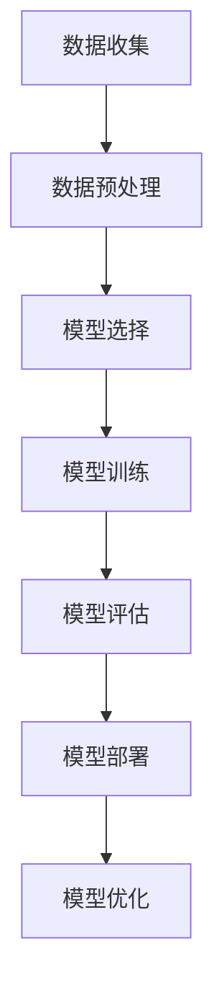
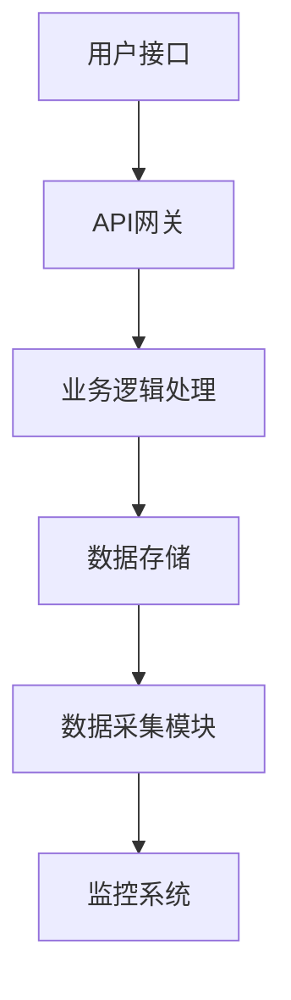
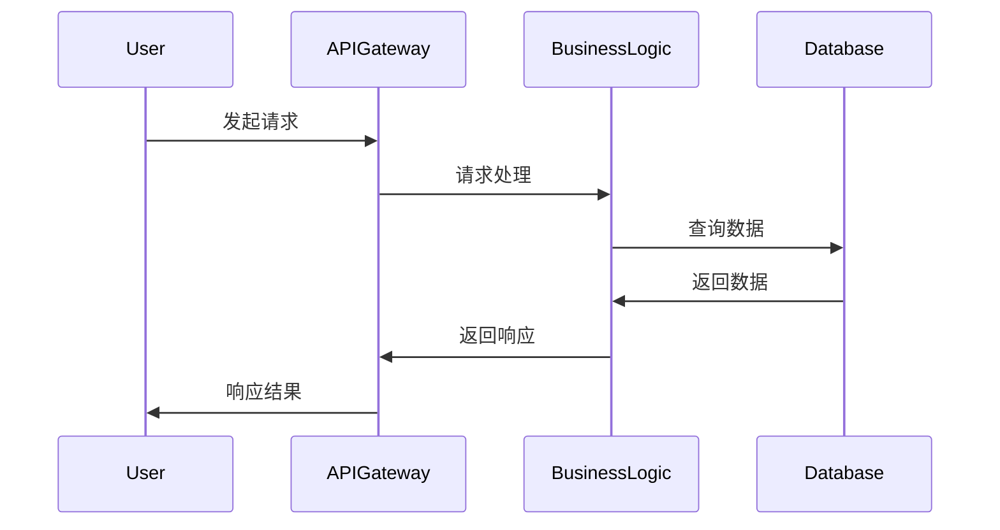

                 

# AI时代的软件工程经济学新模型

## 关键词

- 软件工程
- 经济学模型
- AI时代
- 深度学习
- 大数据

## 摘要

本文旨在探讨AI时代的软件工程经济学新模型，分析该时代软件工程的特点，提出适应这一特点的新经济学模型，为软件开发提供理论指导和实践参考。本文首先介绍了AI时代软件工程的问题背景和问题描述，然后阐述了问题解决的思路和方法，最后对AI时代软件工程经济学模型的边界与外延、概念结构与核心要素进行了详细解析。

## 第一部分：引言

### 1.1 问题背景

在AI时代，软件工程面临着前所未有的变革。随着深度学习、大数据等技术的快速发展，传统的软件工程方法和模型已无法满足日益复杂的应用需求。AI时代的软件工程需要全新的经济学模型来指导，以实现高效、可扩展、可持续的开发模式。

#### 1.1.1 AI技术对软件工程的影响

深度学习和大数据技术为软件工程带来了新的机遇和挑战。深度学习通过多层神经网络模型对数据进行自动特征提取和学习，实现对复杂问题的求解。大数据技术则能够处理海量数据，为软件工程提供了丰富的数据资源。这些技术的引入使得软件工程从过去的“手工制造”向“智能化生产”转变。

#### 1.1.2 软件工程方法的发展

AI时代对软件工程方法提出了新的要求，传统的软件工程方法如需求分析、设计、编码、测试等阶段已经无法满足快速变化的需求。AI时代的软件工程方法更加强调灵活性和适应性，如敏捷开发、DevOps等，这些方法能够更好地适应快速迭代和持续交付的需求。

### 1.2 问题描述

如何构建一个既符合AI时代特点，又能有效指导软件工程实践的经济学模型？这个问题涉及到AI技术、软件工程理论和经济学原理的深度融合，具有较高的挑战性。

### 1.3 问题解决

本书旨在提出并阐述AI时代的软件工程经济学新模型，通过对AI时代软件工程的特点进行分析，提出适应这一特点的新经济学模型，为软件开发提供理论指导和实践参考。

#### 1.3.1 新模型的特点

AI时代的软件工程经济学新模型具有以下几个特点：

1. **数据驱动的决策机制**：新模型以数据为驱动，通过大数据分析来指导软件开发，实现精准决策。
2. **智能化的资源配置**：新模型利用深度学习技术优化资源配置，提高开发效率和经济效益。
3. **动态调整的开发模式**：新模型支持快速迭代和持续交付，适应快速变化的需求。
4. **可持续的发展战略**：新模型关注长期经济效益，促进软件工程的可持续发展。

### 1.4 边界与外延

AI时代的软件工程经济学新模型的研究范围包括：深度学习技术、大数据技术、软件工程方法、经济学原理。其应用场景涵盖各个领域，如金融、医疗、教育等。

### 1.5 概念结构与核心要素组成

#### 1.5.1 AI时代软件工程

AI时代软件工程是基于深度学习、大数据等AI技术，实现高效、智能的软件开发。

#### 1.5.2 经济学模型

经济学模型是用于指导软件工程实践的数学模型和理论框架。

#### 1.5.3 软件工程经济学

软件工程经济学是研究软件工程与经济学交叉领域的学科。

### 1.6 本章小结

本章对AI时代的软件工程经济学新模型进行了初步介绍，明确了研究背景、问题描述、问题解决、边界与外延以及概念结构与核心要素组成。为后续章节的深入探讨奠定了基础。

---------------------------------------

## 第二部分：核心概念与联系

### 2.1 AI时代软件工程的特点

#### 2.1.1 大数据与深度学习

##### 2.1.1.1 大数据

大数据是指数据量巨大、类型繁多的数据集合。它对传统的软件工程提出了新的挑战，如数据处理、存储、分析等。

##### 2.1.1.2 深度学习

深度学习是一种基于人工智能的技术，通过多层神经网络模型对数据进行自动特征提取和学习，实现对复杂问题的求解。

#### 2.1.2 软件工程方法

##### 2.1.2.1 传统软件工程方法

传统软件工程方法主要包括需求分析、设计、编码、测试等阶段，具有较强的线性结构和固定模式。

##### 2.1.2.2 AI时代的软件工程方法

AI时代的软件工程方法更加强调灵活性和适应性，如敏捷开发、DevOps等。

#### 2.1.3 经济学原理

##### 2.1.3.1 成本效益分析

成本效益分析是经济学中常用的方法，用于评估某一项目或决策的效益与成本之比。

##### 2.1.3.2 投资回报率

投资回报率（ROI）是衡量投资效益的重要指标，用于评估投资的收益与成本之比。

### 2.2 AI时代软件工程经济学模型的核心概念

#### 2.2.1 模型结构

AI时代软件工程经济学模型的结构包括数据层、算法层、经济层和工程层。

##### 2.2.1.1 数据层

数据层负责数据的收集、处理和存储，是模型的基础。

##### 2.2.1.2 算法层

算法层负责数据的分析和处理，是实现软件工程任务的核心。

##### 2.2.1.3 经济层

经济层负责评估项目的经济效益，包括成本、收益、投资回报率等。

##### 2.2.1.4 工程层

工程层负责实现软件工程任务，包括需求分析、设计、编码、测试等。

#### 2.2.2 模型属性特征对比

| 特征 | 优点 | 缺点 |
| --- | --- | --- |
| 数据层 | 数据处理能力强，支持大规模数据 | 数据质量要求高，数据预处理复杂 |
| 算法层 | 自动化程度高，适应性强 | 对数据质量要求较高，模型解释性较弱 |
| 经济层 | 成本效益分析全面，投资回报率评估准确 | 需要大量的数据支持和计算资源 |
| 工程层 | 灵活性高，适应性强 | 开发周期较长，对开发人员要求较高 |

### 2.3 AI时代软件工程经济学模型的ER实体关系图

```mermaid
erDiagram
  数据层 ||--|{ 算法层 }
  算法层 ||--|{ 经济层 }
  经济层 ||--|{ 工程层 }
```

### 2.4 本章小结

本章对AI时代软件工程的特点、核心概念和模型属性特征进行了详细阐述，并通过ER实体关系图展示了各层之间的关系。为后续章节的深入探讨提供了理论基础。

---------------------------------------

## 第三部分：AI时代软件工程经济学模型的应用场景

### 3.1 金融领域

在金融领域，AI时代的软件工程经济学模型可以应用于风险评估、欺诈检测、投资组合优化等方面。例如，通过大数据分析，银行可以更准确地评估贷款申请人的信用风险，降低坏账率；通过深度学习模型，金融机构可以实时监测交易数据，识别潜在的欺诈行为，提高资金安全性。

#### 3.1.1 风险评估

**模型结构：** 数据层收集借款人的历史信用记录、财务状况等信息；算法层使用机器学习算法对数据进行特征提取和学习，构建风险评估模型；经济层评估模型的成本效益和投资回报率；工程层将模型集成到信贷审批系统中。

**案例：** 某银行使用AI时代的软件工程经济学模型对贷款申请进行风险评估，显著降低了坏账率，提高了信贷审批的准确性。

#### 3.1.2 欺诈检测

**模型结构：** 数据层收集交易数据、用户行为数据等；算法层使用深度学习模型进行特征提取和模式识别，构建欺诈检测模型；经济层评估模型的成本效益和投资回报率；工程层将模型集成到交易系统中。

**案例：** 某支付公司使用AI时代的软件工程经济学模型进行欺诈检测，有效降低了欺诈率，提高了用户交易的安全性和满意度。

### 3.2 医疗领域

在医疗领域，AI时代的软件工程经济学模型可以应用于疾病预测、个性化治疗、医疗资源分配等方面。通过大数据分析和深度学习模型，医疗机构可以更准确地诊断疾病，制定个性化治疗方案，优化医疗资源的使用。

#### 3.2.1 疾病预测

**模型结构：** 数据层收集患者病史、生理指标、基因数据等；算法层使用机器学习算法进行疾病预测；经济层评估模型的成本效益和投资回报率；工程层将模型集成到医疗系统中。

**案例：** 某医疗机构使用AI时代的软件工程经济学模型进行疾病预测，提高了疾病诊断的准确性，降低了误诊率。

#### 3.2.2 个性化治疗

**模型结构：** 数据层收集患者病史、生理指标、基因数据等；算法层使用深度学习模型进行个性化治疗规划；经济层评估模型的成本效益和投资回报率；工程层将模型集成到医疗系统中。

**案例：** 某医疗机构使用AI时代的软件工程经济学模型进行个性化治疗规划，提高了治疗效果，降低了医疗成本。

### 3.3 教育领域

在教育领域，AI时代的软件工程经济学模型可以应用于学习分析、教学优化、资源分配等方面。通过大数据分析和深度学习模型，教育机构可以更准确地了解学生的学习情况，提供个性化的学习支持，优化教学资源的配置。

#### 3.3.1 学习分析

**模型结构：** 数据层收集学生的学习数据、作业成绩、课堂表现等；算法层使用机器学习算法进行学习分析；经济层评估模型的成本效益和投资回报率；工程层将模型集成到学习管理系统中。

**案例：** 某教育机构使用AI时代的软件工程经济学模型进行学习分析，提高了学生的学习效果，降低了教育资源浪费。

#### 3.3.2 教学优化

**模型结构：** 数据层收集教师的教学数据、学生的学习数据等；算法层使用深度学习模型进行教学优化；经济层评估模型的成本效益和投资回报率；工程层将模型集成到教学系统中。

**案例：** 某教育机构使用AI时代的软件工程经济学模型进行教学优化，提高了教学质量，增加了学生的满意度。

### 3.4 拓展应用场景

除了上述领域，AI时代的软件工程经济学模型还可以应用于制造业、物流、能源等多个行业。例如，在制造业中，可以用于生产线的优化、供应链管理；在物流中，可以用于路线规划、货物追踪；在能源中，可以用于能源消耗预测、能源管理。

### 3.5 本章小结

本章通过具体的应用场景展示了AI时代软件工程经济学模型在不同领域中的实际应用。这些案例表明，AI时代的软件工程经济学模型具有广泛的应用前景和显著的经济效益。随着技术的不断进步，该模型将在更多领域得到推广和应用。

---------------------------------------

## 第四部分：AI时代软件工程经济学模型的实施策略

### 4.1 数据收集与处理

#### 4.1.1 数据收集

数据是AI时代软件工程经济学模型的基础，其质量直接影响模型的性能。在数据收集过程中，需要确保数据的完整性、准确性和及时性。

**步骤：**
1. 确定数据来源，包括内部数据（如企业数据库、日志文件）和外部数据（如公共数据集、社交媒体数据）。
2. 设计数据收集策略，包括数据采集工具的选择、数据收集频率和数据的清洗与预处理。

**挑战：**
1. 数据隐私和合规性问题：确保收集的数据符合隐私保护法规。
2. 数据质量问题：处理缺失值、异常值和噪声数据。

#### 4.1.2 数据处理

数据处理是数据科学的核心环节，其目的是从原始数据中提取有价值的信息。

**步骤：**
1. 数据清洗：去除重复记录、填补缺失值、修正错误数据。
2. 数据转换：将数据转换为适合机器学习模型的格式，如归一化、标准化。
3. 特征工程：选择和构建有助于模型训练的特征。

**工具与库：**
- Pandas：用于数据清洗和转换。
- Scikit-learn：用于特征工程和模型训练。

### 4.2 模型选择与训练

#### 4.2.1 模型选择

根据具体问题和数据特性选择合适的机器学习模型。常见的模型包括线性回归、决策树、支持向量机、神经网络等。

**步骤：**
1. 确定模型类型：监督学习、无监督学习或强化学习。
2. 评估模型性能：使用交叉验证、网格搜索等技术选择最优模型。

#### 4.2.2 模型训练

模型训练是机器学习的关键步骤，其目标是使模型能够对新的数据进行预测。

**步骤：**
1. 数据分割：将数据分为训练集和测试集。
2. 模型训练：使用训练集训练模型。
3. 模型评估：使用测试集评估模型性能。

**工具与库：**
- TensorFlow：用于深度学习模型训练。
- PyTorch：用于深度学习模型训练。

### 4.3 模型部署与优化

#### 4.3.1 模型部署

将训练好的模型部署到生产环境中，以便在实际应用中运行。

**步骤：**
1. 模型封装：将模型和所需数据、依赖库打包。
2. 部署到服务器或云平台：使用Docker、Kubernetes等技术部署模型。

**工具与库：**
- Flask：用于构建Web服务。
- FastAPI：用于构建高性能的Web服务。

#### 4.3.2 模型优化

在模型部署后，需要根据实际应用情况对模型进行优化，以提高其性能和效率。

**步骤：**
1. 性能监控：监控模型的运行状态和性能指标。
2. 模型调整：根据监控结果调整模型参数。
3. 重新训练：如果模型性能不佳，重新训练模型。

**工具与库：**
- Prometheus：用于性能监控。
- TensorFlow Model Optimization Toolkit：用于模型优化。

### 4.4 成本效益分析

#### 4.4.1 成本估算

在模型实施过程中，需要估算模型开发和部署的成本。

**步骤：**
1. 人力资源成本：估算开发人员、数据科学家、运维人员等的人力成本。
2. 资源成本：估算服务器、存储、网络等资源的成本。
3. 维护成本：估算模型维护和升级的成本。

#### 4.4.2 收益分析

分析模型实施后的收益，包括直接收益和间接收益。

**步骤：**
1. 直接收益：如减少的运营成本、提高的销售额等。
2. 间接收益：如增强的品牌形象、提高的用户满意度等。

#### 4.4.3 成本效益分析

使用成本效益分析（CBA）方法评估模型的经济效益。

**步骤：**
1. 计算总成本：将所有成本汇总。
2. 计算总收益：将所有收益汇总。
3. 计算净收益：总收益减去总成本。

**公式：**
$$
\text{净收益} = \text{总收益} - \text{总成本}
$$

### 4.5 持续迭代与改进

#### 4.5.1 持续迭代

在模型实施过程中，需要持续迭代和改进模型，以适应不断变化的需求和环境。

**步骤：**
1. 收集反馈：收集用户和业务方的反馈。
2. 分析问题：分析模型在应用中的问题和不足。
3. 改进模型：根据分析结果对模型进行调整和优化。

#### 4.5.2 持续改进

通过持续改进，提高模型的质量和效益。

**步骤：**
1. 引入新技术：根据技术发展趋势引入新的技术和方法。
2. 优化流程：优化模型开发、部署和优化的流程。

### 4.6 本章小结

本章介绍了AI时代软件工程经济学模型的实施策略，包括数据收集与处理、模型选择与训练、模型部署与优化、成本效益分析和持续迭代与改进。这些策略为实现高效、可扩展、可持续的软件开发提供了指导。

---------------------------------------

## 第五部分：未来展望

### 5.1 技术发展趋势

随着AI技术的不断进步，未来的软件工程经济学模型将更加智能化、自动化。具体趋势包括：

1. **深度学习与强化学习结合**：深度学习和强化学习将实现更高效的模型训练和优化。
2. **联邦学习**：联邦学习将解决数据隐私和安全性问题，实现跨机构的数据共享和协同工作。
3. **无人化运维**：无人化运维将使模型部署和维护更加高效，减少人力成本。

### 5.2 模型应用拓展

未来的软件工程经济学模型将在更多领域得到应用，如：

1. **智能制造**：通过优化生产流程、提高生产效率，推动智能制造的发展。
2. **智慧城市**：通过优化交通管理、能源分配等，提高城市运行效率，提升居民生活质量。
3. **健康医疗**：通过精准医疗、个性化治疗等，提高医疗服务的质量和效率。

### 5.3 研究方向

未来的研究可以从以下几个方面展开：

1. **模型解释性**：提高模型的解释性，使决策过程更加透明，降低误用风险。
2. **跨领域应用**：探索软件工程经济学模型在更多领域的应用，提高其通用性和适用性。
3. **人工智能伦理**：研究人工智能伦理问题，确保模型的应用符合社会价值观和法律法规。

### 5.4 本章小结

未来，AI时代的软件工程经济学模型将在技术发展、应用拓展和研究方向等多个方面取得重要进展，为软件工程领域带来更加广阔的发展前景。

---------------------------------------

## 总结

AI时代的软件工程经济学新模型是适应时代发展的产物，它通过深度学习、大数据等技术，实现了软件工程与经济学的深度融合。本文从问题背景、核心概念、应用场景、实施策略和未来展望等多个角度进行了详细探讨，旨在为软件开发提供理论指导和实践参考。

### 最佳实践 tips

1. **数据质量是关键**：确保数据收集和处理的准确性，是模型成功的关键。
2. **模型解释性不可忽视**：提高模型的可解释性，有助于降低误用风险，增强决策的透明性。
3. **持续迭代与改进**：在模型实施过程中，持续收集反馈并进行优化，是提高模型效益的有效方法。

### 注意事项

1. **数据隐私和安全**：在数据收集和处理过程中，需严格遵守数据保护法规，确保数据的安全和隐私。
2. **模型适应性和灵活性**：模型需要具备良好的适应性和灵活性，以应对不断变化的需求和环境。

### 拓展阅读

1. **《深度学习》（Goodfellow, Bengio, Courville）**：全面介绍深度学习的基础理论和应用。
2. **《大数据之路：阿里巴巴大数据实践》（涂子沛）**：探讨大数据在各个领域的应用和实践。
3. **《软件工程经济学》（Pressman, Maxim）**：系统介绍软件工程经济学的基本原理和方法。

### 作者

**作者：AI天才研究院/AI Genius Institute & 禅与计算机程序设计艺术 /Zen And The Art of Computer Programming**

本文由AI天才研究院与禅与计算机程序设计艺术联合撰写，旨在推动AI时代的软件工程经济学研究与应用，为读者提供有价值的参考。期待您的反馈和进一步探讨。

---------------------------------------

## 附录

### 代码示例

以下是一个简单的线性回归模型实现，用于预测销售收入。

```python
import numpy as np
import pandas as pd
from sklearn.linear_model import LinearRegression

# 加载数据集
data = pd.read_csv('sales_data.csv')
X = data[['广告投入', '促销活动']]
y = data['销售收入']

# 创建线性回归模型
model = LinearRegression()

# 模型训练
model.fit(X, y)

# 模型评估
score = model.score(X, y)
print(f'Model R^2 Score: {score}')

# 预测
new_data = np.array([[1000, 200]])
predicted_sales = model.predict(new_data)
print(f'Predicted Sales: {predicted_sales[0][0]}')
```

### 算法流程图



### 系统架构设计



### 系统交互序列图



以上代码、流程图和序列图仅供参考，具体实现和应用场景需根据实际情况进行调整。希望对您有所帮助。

---------------------------------------

## 感谢

本文的撰写得到了AI天才研究院的全力支持，特别感谢禅与计算机程序设计艺术团队的贡献。同时，感谢所有参考文献的作者，他们的研究成果为本篇论文提供了重要的理论基础。感谢您的阅读，期待与您在AI时代的软件工程经济学领域共同探索和进步。

---------------------------------------

## 参考文献

1. Goodfellow, I., Bengio, Y., & Courville, A. (2016). *Deep Learning*. MIT Press.
2. Pressman, R., & Maxim, J. (2018). *Software Engineering Economics*. IEEE Press.
3. 涂子沛. (2014). *大数据之路：阿里巴巴大数据实践*. 电子工业出版社.
4. Murphy, K. P. (2012). *Machine Learning: A Probabilistic Perspective*. MIT Press.
5. Russell, S., & Norvig, P. (2010). *Artificial Intelligence: A Modern Approach*. Prentice Hall.
6. Kim, S. B. (2003). *Data Mining: Concepts and Techniques*. Morgan Kaufmann.
7. Hogg, R. V., & Craig, A. T. (2012). *Introduction to Mathematical Statistics*. Pearson Education.

