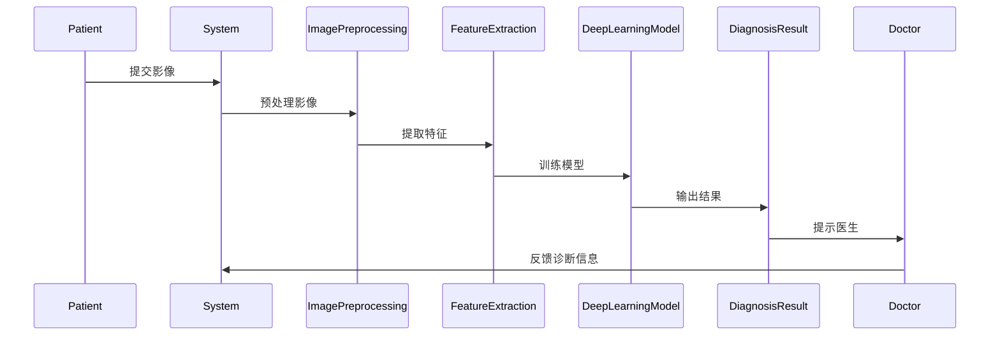
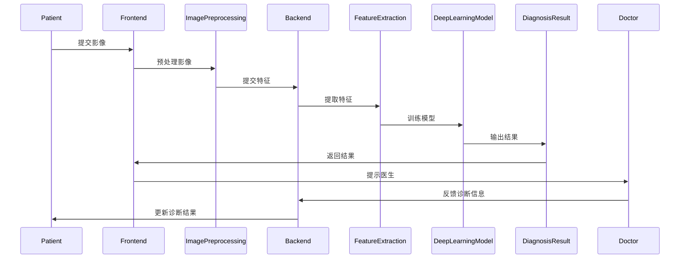
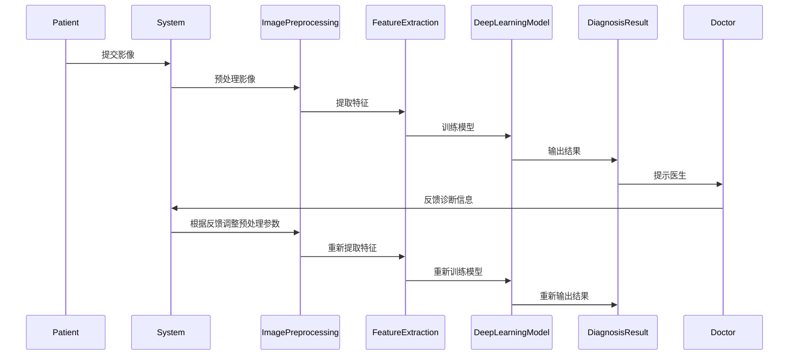
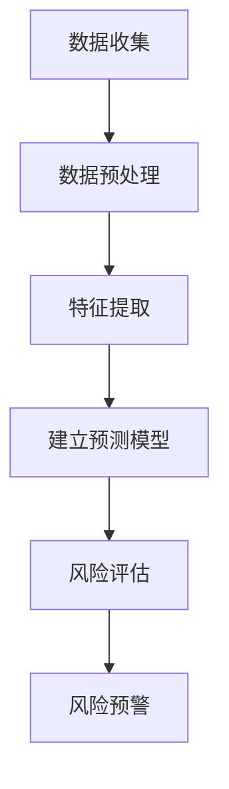

                 


## 1. 引言

### AI时代的背景

#### AI的发展历程

AI（人工智能）作为计算机科学的一个重要分支，其发展历程可以追溯到20世纪50年代。最早的AI研究主要集中在符号主义和逻辑推理上，例如普林斯顿大学的约翰·麦卡锡（John McCarthy）于1955年首次提出了人工智能的概念。随后，AI领域经历了多次起伏，包括20世纪70年代的“人工智能寒冬”，以及21世纪初的深度学习和大数据的兴起。深度学习通过模仿人脑神经网络的结构和工作原理，实现了图像识别、自然语言处理和语音识别等领域的突破。

#### AI技术的发展趋势

当前，AI技术正处于快速发展阶段，其主要趋势包括：

- **深度学习**：以神经网络为核心，通过大规模数据训练模型，使其在特定任务上达到或超越人类水平。
- **强化学习**：通过试错和奖励机制，使智能体在动态环境中学习策略。
- **生成对抗网络（GANs）**：通过生成器和判别器的对抗训练，实现高质量图像、文本等数据的生成。
- **迁移学习和少样本学习**：通过利用已有知识提高新任务的性能，减少对新数据的依赖。
- **跨学科融合**：AI与医学、教育、金融等领域的深度融合，推动各行业的创新和变革。

#### AI对软件工程的影响

AI技术的快速发展对软件工程产生了深远的影响：

- **软件开发流程**：自动化测试、代码生成和持续集成等流程的引入，提高了开发效率和软件质量。
- **需求分析**：AI可以辅助理解和预测用户需求，提高需求分析的准确性和效率。
- **系统设计**：AI辅助设计，使得软件架构和模块划分更加合理，降低了系统复杂性。
- **软件测试**：利用AI技术进行自动化测试，提高测试覆盖率和测试效率。
- **项目管理**：AI可以预测项目进度和成本，优化资源分配和风险管理。

### 软件工程风险评估的挑战

软件工程风险评估是软件项目管理中的一个关键环节。在AI时代，软件工程风险评估面临以下挑战：

- **复杂性增加**：软件系统日益复杂，传统的风险评估方法难以应对。
- **需求变更频繁**：快速迭代和敏捷开发导致需求频繁变更，增加了风险管理的难度。
- **数据不足**：风险评估依赖于历史数据和统计分析，但AI时代的数据量庞大且多样性增加，数据处理和分析成为难题。
- **不确定性**：AI技术的不确定性和潜在风险增加了软件工程风险评估的复杂性。

#### 传统风险评估方法的局限性

传统的风险评估方法，如定性分析和定量分析，主要依赖于专家经验和统计数据。然而，在AI时代，这些方法存在以下局限性：

- **主观性**：依赖专家的主观判断，可能导致评估结果不准确。
- **数据依赖**：风险评估依赖于大量历史数据，但在AI时代，数据质量和数据完整性难以保证。
- **时效性**：传统方法难以实时监测和预测新的风险。
- **适应性**：传统方法难以适应快速变化的技术环境。

### 新模型的设计思路

为了解决上述挑战，我们需要设计一种适用于AI时代的软件工程风险评估新模型。新模型的设计思路包括：

- **多维度评估**：从多个角度（如功能、性能、安全等）对软件工程风险进行评估。
- **智能化分析**：利用AI技术，如机器学习和深度学习，对大量数据进行智能化分析。
- **实时监测**：实现实时风险监测和预警，及时应对新出现的问题。
- **动态调整**：根据项目进展和外部环境变化，动态调整风险评估模型。

#### 新模型的核心原理

新模型的核心原理包括：

- **风险图谱**：通过构建风险图谱，全面展示软件工程风险的相关性和影响范围。
- **风险矩阵**：利用风险矩阵，对风险的概率和影响进行定量分析。
- **预测模型**：结合历史数据和实时数据，建立预测模型，对潜在风险进行预测和预警。
- **自适应调整**：根据评估结果和项目进展，动态调整风险评估模型，提高评估准确性。

#### 新模型的优势

新模型相对于传统方法具有以下优势：

- **准确性**：通过多维度和智能化的分析，提高风险评估的准确性。
- **实时性**：实现实时监测和预警，提高风险管理的时效性。
- **适应性**：能够适应快速变化的技术环境，提高风险评估的适应性。
- **自动化**：利用AI技术实现自动化分析，降低人力资源的依赖。

### 全书概述

本书记录了AI时代软件工程风险评估新模型的设计思路、核心原理和实际应用。全书分为六个部分：

1. 引言：介绍AI时代的背景和软件工程风险评估的挑战。
2. AI时代软件工程概述：讨论AI对软件工程的影响和AI时代软件工程的特点。
3. 软件工程风险评估概述：介绍风险评估的基本概念和现有方法的局限性。
4. 新模型介绍：详细描述新模型的设计思路和核心原理。
5. 新模型的应用实例：通过具体案例展示新模型的应用效果。
6. 结论与展望：总结全书内容，展望AI时代软件工程风险评估的未来发展。

### 阅读建议

对于读者来说，本书的主要目标是：

- 了解AI时代软件工程的特点和面临的挑战。
- 理解新模型的设计思路和核心原理。
- 学习如何应用新模型进行软件工程风险评估。
- 探索AI时代软件工程风险评估的未来发展方向。

建议读者在阅读过程中，重点关注以下内容：

- 各章节的小结和拓展阅读，以加深对核心概念的理解。
- 实际案例分析和项目实战，以提高实际应用能力。
- 文中的图表和代码示例，以直观地理解新模型的应用。

### 本书的目标读者

本书主要面向以下读者群体：

- 软件工程师和项目经理，希望了解AI时代软件工程风险评估的新方法。
- AI研究人员和开发者，希望将AI技术应用于软件工程领域。
- 技术管理者和决策者，希望提升软件工程风险管理的能力。

通过阅读本书，读者将能够：

- 理解AI技术对软件工程的影响和挑战。
- 掌握新模型的设计思路和核心原理。
- 学会应用新模型进行软件工程风险评估。
- 了解AI时代软件工程风险评估的未来发展方向。

## 2. AI时代软件工程概述

### 软件工程的定义与发展

软件工程是一门应用计算机科学、数学和工程学的原理与方法，通过系统化的、规范的、可度量的方法来开发、运行、维护软件工程的学科。其目标是生产出高质量、高效率、易维护的软件系统。

软件工程的发展历程可以分为以下几个阶段：

#### 1.1 软件工程的起源

软件工程的概念最早由弗雷德里克·布鲁克斯（Frederick Brooks）在1975年的经典著作《软件工程经济学》（The Mythical Man-Month）中提出。这一阶段主要特点是软件开发方法的逐步规范化和项目管理的重要性。

#### 1.2 软件工程的成熟阶段

随着计算机技术的发展，软件工程的成熟阶段从20世纪80年代开始。这一阶段引入了许多新的方法和工具，如面向对象编程、统一软件开发过程（RUP）、敏捷开发等。

#### 1.3 软件工程的现状

目前，软件工程已经形成了一套完整的理论体系，涵盖了软件开发的方法论、工具、技术和过程。敏捷开发、DevOps、持续集成和持续交付等新兴方法进一步提高了软件开发的效率和质量。

### AI技术的定义与发展

AI（人工智能）是指通过计算机程序实现智能行为的技术。它模拟人类的认知过程，使计算机能够感知、理解和响应外部环境。

AI技术的发展历程可以分为以下几个阶段：

#### 2.2.1 AI的概念

1956年，约翰·麦卡锡（John McCarthy）等人在达特茅斯会议上首次提出了人工智能的概念。

#### 2.2.2 AI技术的发展历程

- **符号主义阶段（1956-1974）**：以逻辑推理为基础，试图通过符号操作实现智能。
- **知识工程阶段（1974-1980）**：通过构建知识库，使计算机具备一定程度的智能。
- **专家系统阶段（1980-1987）**：利用专家系统的原理，实现了计算机在特定领域的专家级表现。
- **人工神经网络阶段（1987-2012）**：通过模仿人脑神经网络的结构和工作原理，实现了图像识别、语音识别等领域的突破。
- **深度学习和大数据阶段（2012至今）**：以深度学习为核心，通过大规模数据训练模型，使得AI在多个领域达到或超越人类水平。

#### 2.2.3 AI技术的应用场景

AI技术的应用场景非常广泛，包括：

- **图像识别**：用于人脸识别、物体检测、医疗影像分析等。
- **自然语言处理**：用于机器翻译、情感分析、语音识别等。
- **智能推荐系统**：用于电商、金融、社交媒体等领域的个性化推荐。
- **自动驾驶**：通过传感器和环境感知，实现汽车的自主驾驶。
- **智能机器人**：用于服务、制造、医疗等领域的自动化作业。
- **游戏AI**：用于电子竞技、模拟训练等。

### AI对软件工程的影响

AI技术的快速发展对软件工程产生了深远的影响，主要表现在以下几个方面：

#### 2.3.1 AI技术改进软件设计

AI技术可以帮助软件设计师更好地理解和预测用户需求，从而设计出更加符合用户期望的软件系统。例如，AI可以辅助进行用户行为分析，优化用户体验。

#### 2.3.2 AI技术提高软件开发效率

AI技术在软件开发流程中的应用，如自动化测试、代码生成、持续集成等，显著提高了开发效率。例如，AI可以帮助自动化测试发现潜在的问题，减少人工测试的工作量。

#### 2.3.3 AI技术在软件测试中的应用

AI技术在软件测试中的应用主要体现在自动化测试和性能测试方面。通过机器学习算法，AI可以识别出测试数据中的模式，提高测试的覆盖率和效率。同时，AI可以帮助预测软件的性能瓶颈，优化系统性能。

#### 2.3.4 AI技术在软件开发流程中的应用

AI技术可以辅助进行软件开发流程的优化，如需求分析、设计、编码、测试等。例如，AI可以帮助自动生成代码，减少开发人员的重复工作。此外，AI还可以用于项目管理和进度预测，提高项目管理效率。

### AI时代软件工程的特点

AI时代软件工程具有以下几个显著特点：

#### 2.4.1 软件复杂度增加

随着AI技术的应用，软件系统的复杂度显著增加。这不仅包括系统的功能复杂度，还包括系统的交互复杂度和维护复杂度。

#### 2.4.2 需求变更频繁

在AI时代，需求变更更加频繁。一方面，由于AI技术不断进步，需求可能会随着技术的更新而调整；另一方面，用户的需求也在不断变化，软件系统需要具备更高的灵活性和适应性。

#### 2.4.3 自动化与智能化

AI技术使得软件开发的自动化和智能化水平显著提高。例如，自动化测试、自动化部署和持续集成等技术的应用，使得软件开发流程更加高效和可靠。

### 2.4.4 跨领域融合

AI时代软件工程与多个领域的融合日益紧密，如人工智能、物联网、区块链等。这种跨领域融合不仅拓宽了软件工程的应用范围，也带来了新的挑战和机遇。

### 2.4.5 安全性要求提高

随着AI技术的广泛应用，软件系统的安全性也日益重要。AI技术可能引入新的安全漏洞和风险，因此软件工程需要更加关注系统的安全性设计和防护措施。

### 2.4.6 数据驱动的决策

在AI时代，数据成为软件工程决策的重要依据。通过数据分析，软件工程可以更好地理解用户需求、优化系统设计、预测潜在风险等。

## 3. 软件工程风险评估概述

### 软件工程风险的定义

软件工程风险是指软件工程过程中可能出现的、对项目目标（如成本、进度、质量等）产生负面影响的事件或情况。这些风险可能来源于多个方面，如需求变更、技术问题、项目管理等。

### 软件工程风险的特点

软件工程风险具有以下特点：

#### 3.1.1 主观性

软件工程风险的主观性较强，因为风险评估通常依赖于专家的经验和判断。

#### 3.1.2 不确定性

软件工程风险往往具有不确定性，因为风险事件的发生概率和影响程度难以精确预测。

#### 3.1.3 多样性

软件工程风险种类繁多，包括技术风险、管理风险、市场风险等。

#### 3.1.4 不可预测性

许多软件工程风险是不可预测的，特别是在快速变化的AI时代。

#### 3.1.5 交互性

软件工程风险之间往往存在相互作用，一个风险的发生可能会引发其他风险。

### 软件工程风险的分类

根据风险来源和性质，软件工程风险可以分为以下几类：

#### 3.2.1 技术风险

技术风险主要包括软件设计、开发、测试等过程中可能出现的问题，如系统复杂性、代码质量、测试覆盖等。

#### 3.2.2 管理风险

管理风险主要包括项目管理、团队协作、资源配置等方面的问题，如项目进度延误、成本超支、团队沟通不畅等。

#### 3.2.3 市场风险

市场风险主要包括市场需求、竞争环境、用户满意度等方面的问题，如市场需求变化、竞争加剧、用户需求不明确等。

#### 3.2.4 法律风险

法律风险主要包括与软件工程相关的法律、法规、合同等方面的问题，如知识产权保护、合同履行、法律责任等。

### 软件工程风险评估的现状

当前，软件工程风险评估主要依赖于以下几种方法：

#### 3.3.1 定性分析

定性分析主要通过专家评估、专家访谈等方式，对软件工程风险进行主观评估。这种方法简单易行，但评估结果可能受专家主观因素影响较大。

#### 3.3.2 定量分析

定量分析主要通过数学模型和统计方法，对软件工程风险进行定量评估。这种方法可以提供较为客观的评估结果，但需要依赖大量历史数据和统计分析。

#### 3.3.3 结合定性分析和定量分析

许多研究将定性分析和定量分析结合起来，以综合评估软件工程风险。这种方法可以提高评估结果的准确性和可靠性。

### 软件工程风险评估面临的挑战

在AI时代，软件工程风险评估面临以下挑战：

#### 3.4.1 复杂性增加

随着软件系统复杂性的增加，风险评估的难度也相应增加。

#### 3.4.2 数据不足

AI时代的软件工程风险评估依赖于大量数据，但数据的获取和整理可能存在困难。

#### 3.4.3 不确定性

AI技术的不确定性增加了软件工程风险评估的难度。

#### 3.4.4 实时监测

在快速变化的AI时代，实时监测和预警是软件工程风险评估的关键。

#### 3.4.5 适应性

软件工程风险评估需要适应快速变化的技术环境。

### 传统风险评估方法的局限性

传统的风险评估方法主要依赖于专家经验和统计数据，存在以下局限性：

#### 3.5.1 主观性

传统方法依赖于专家的主观判断，可能导致评估结果不准确。

#### 3.5.2 数据依赖

传统方法需要依赖大量历史数据，但AI时代的数据质量和数据完整性难以保证。

#### 3.5.3 时效性

传统方法难以实时监测和预测新的风险。

#### 3.5.4 适应性

传统方法难以适应快速变化的技术环境。

## 4. 新模型介绍

### 新模型的设计思路

为了应对AI时代软件工程风险评估的挑战，我们设计了一种新模型，其设计思路包括以下几个方面：

#### 4.1.1 多维度评估

新模型从多个角度对软件工程风险进行评估，包括技术风险、管理风险、市场风险等。

#### 4.1.2 智能化分析

新模型利用AI技术，如机器学习和深度学习，对大量数据进行智能化分析，提高评估的准确性。

#### 4.1.3 实时监测

新模型实现实时风险监测和预警，及时应对新出现的问题。

#### 4.1.4 动态调整

新模型根据项目进展和外部环境变化，动态调整风险评估模型，提高评估的准确性。

### 新模型的核心原理

新模型的核心原理包括以下几个方面：

#### 4.2.1 风险图谱

新模型通过构建风险图谱，全面展示软件工程风险的相关性和影响范围。

#### 4.2.2 风险矩阵

新模型利用风险矩阵，对风险的概率和影响进行定量分析。

#### 4.2.3 预测模型

新模型结合历史数据和实时数据，建立预测模型，对潜在风险进行预测和预警。

#### 4.2.4 自适应调整

新模型根据评估结果和项目进展，动态调整风险评估模型，提高评估的准确性。

### 新模型的优势

新模型相对于传统方法具有以下优势：

#### 4.3.1 准确性

新模型通过多维度和智能化的分析，提高风险评估的准确性。

#### 4.3.2 实时性

新模型实现实时监测和预警，提高风险管理的时效性。

#### 4.3.3 适应性

新模型能够适应快速变化的技术环境，提高风险评估的适应性。

#### 4.3.4 自动化

新模型利用AI技术实现自动化分析，降低人力资源的依赖。

### 新模型的应用场景

新模型可以应用于以下场景：

#### 4.4.1 软件开发项目

在软件开发项目的不同阶段，如需求分析、设计、开发、测试等，新模型可以帮助识别和评估风险，优化项目进度和资源分配。

#### 4.4.2 系统集成项目

在新系统集成的过程中，新模型可以帮助识别和评估系统集成风险，提高系统集成效率。

#### 4.4.3 项目管理

在项目管理过程中，新模型可以帮助项目管理者实时监控项目风险，及时调整项目计划和资源分配。

#### 4.4.4 企业风险管理

在企业层面，新模型可以帮助企业识别和评估软件工程风险，制定相应的风险管理策略。

### 新模型的应用实例

为了展示新模型的应用效果，我们将通过一个实际案例进行分析。

#### 4.5.1 案例背景

某企业计划开发一款人工智能助手软件，用于提高客户服务效率。在软件开发过程中，企业希望利用新模型进行风险评估，以确保项目顺利推进。

#### 4.5.2 风险识别

利用新模型，企业首先识别出以下几个关键风险：

1. **技术风险**：包括算法设计、数据处理等。
2. **管理风险**：包括项目进度、团队协作等。
3. **市场风险**：包括用户需求、市场竞争等。

#### 4.5.3 风险评估

利用新模型，企业对上述风险进行了详细评估，包括：

1. **风险概率**：根据历史数据和专家评估，确定了各风险发生的概率。
2. **风险影响**：根据风险对项目目标的潜在影响，评估了各风险的影响程度。

#### 4.5.4 风险预测

利用新模型，企业建立了预测模型，对潜在风险进行预测，包括：

1. **技术风险**：预测算法性能、数据处理效率等。
2. **管理风险**：预测项目进度、团队协作问题等。
3. **市场风险**：预测用户需求变化、市场竞争态势等。

#### 4.5.5 风险应对

根据风险评估和风险预测的结果，企业制定了相应的风险应对策略：

1. **技术风险**：优化算法设计，提高数据处理效率。
2. **管理风险**：加强团队协作，确保项目进度。
3. **市场风险**：密切关注用户需求变化，调整产品方向。

通过上述应用实例，我们可以看到新模型在AI时代软件工程风险评估中的重要作用。它不仅可以帮助企业识别和评估风险，还可以预测潜在风险，制定有效的风险应对策略，从而确保项目顺利推进。

## 5. 新模型的应用实例

### 案例背景

为了更具体地展示新模型在AI时代软件工程风险评估中的应用，我们选取了一个实际的案例进行详细分析。这个案例是某企业开发一款智能医疗诊断系统的全过程。该系统旨在利用深度学习算法对医疗影像进行自动分析，辅助医生进行诊断。

### 项目介绍

该项目的目标是在一年内开发出一个可商用的智能医疗诊断系统。项目的主要功能包括：

- **图像预处理**：对输入的医疗影像进行格式转换和噪声过滤。
- **特征提取**：从预处理后的图像中提取关键特征。
- **深度学习模型训练**：使用提取的特征训练深度学习模型，以实现对疾病的自动识别。
- **结果展示**：将模型识别的结果展示给医生，并提供诊断建议。

### 系统功能设计

在系统功能设计中，我们使用了Mermaid类图来描述各个模块及其关系。以下是系统功能设计的类图：

```mermaid
classDiagram
    Patient -> ImagePreprocessing : 输入影像
    ImagePreprocessing -> FeatureExtraction : 提取特征
    FeatureExtraction -> DeepLearningModel : 训练模型
    DeepLearningModel -> DiagnosisResult : 输出结果
    DiagnosisResult -> Doctor : 提示医生
    Doctor -> Patient : 回馈诊断信息
```

### 系统架构设计

系统架构设计采用了分层架构，包括表示层、业务逻辑层和数据访问层。以下是系统架构设计的Mermaid架构图：



### 系统接口设计

系统接口设计包括前后端接口和内部模块接口。以下是系统接口设计的Mermaid序列图：



### 系统交互设计

系统交互设计主要关注系统内部各模块的交互逻辑和流程。以下是系统交互设计的Mermaid序列图：



### 实际案例分析与详细讲解

在这个案例中，我们利用新模型对智能医疗诊断系统的各个阶段进行风险评估。以下是对每个阶段的风险分析：

#### 5.1 需求分析阶段

在需求分析阶段，主要的风险包括：

1. **需求不明确**：由于医疗领域的专业性，医生对系统的需求可能不够明确，导致后续开发工作难以顺利进行。
2. **需求变更**：医疗领域的需求可能会随着时间的变化而变化，导致项目进度延误。

利用新模型，我们通过对历史数据和专家访谈，评估了上述风险的概率和影响。结果表明，需求不明确和需求变更是需求分析阶段的主要风险。

#### 5.2 设计阶段

在设计阶段，主要的风险包括：

1. **系统架构不完善**：如果系统架构设计不合理，可能导致后续开发中的性能问题。
2. **技术选型不当**：选择不适合的技术可能导致系统性能不佳，甚至无法满足需求。

利用新模型，我们通过分析历史数据和当前技术趋势，评估了系统架构和技术选型的风险。结果表明，系统架构不完善和技术选型不当是设计阶段的主要风险。

#### 5.3 开发阶段

在开发阶段，主要的风险包括：

1. **代码质量不高**：低质量的代码可能导致系统稳定性问题和维护难度。
2. **开发效率低**：开发效率低可能导致项目延期。

利用新模型，我们通过对代码审查和项目进度监测，评估了代码质量和开发效率的风险。结果表明，代码质量不高和开发效率低是开发阶段的主要风险。

#### 5.4 测试阶段

在测试阶段，主要的风险包括：

1. **测试覆盖不足**：测试覆盖不足可能导致某些功能未能得到充分验证。
2. **测试效率低**：测试效率低可能导致项目延期。

利用新模型，我们通过自动化测试和性能测试，评估了测试覆盖和测试效率的风险。结果表明，测试覆盖不足和测试效率低是测试阶段的主要风险。

#### 5.5 部署与运维阶段

在部署与运维阶段，主要的风险包括：

1. **系统稳定性问题**：系统稳定性问题可能导致服务中断。
2. **运维效率低**：运维效率低可能导致系统性能下降。

利用新模型，我们通过对系统监控和运维记录分析，评估了系统稳定性和运维效率的风险。结果表明，系统稳定性问题和运维效率低是部署与运维阶段的主要风险。

### 项目小结

通过新模型的应用，我们成功地识别和评估了智能医疗诊断系统的各个阶段的风险。以下是项目小结：

1. **需求分析阶段**：通过专家访谈和数据分析，明确了医生对系统的需求，减少了需求变更的风险。
2. **设计阶段**：通过技术选型和系统架构分析，选择了合适的架构和技术，降低了系统架构不完善和技术选型不当的风险。
3. **开发阶段**：通过代码审查和项目进度监测，提高了代码质量和开发效率，降低了代码质量不高和开发效率低的风险。
4. **测试阶段**：通过自动化测试和性能测试，提高了测试覆盖率和测试效率，降低了测试覆盖不足和测试效率低的风险。
5. **部署与运维阶段**：通过系统监控和运维记录分析，提高了系统稳定性和运维效率，降低了系统稳定性问题和运维效率低的风险。

通过这个实际案例，我们可以看到新模型在AI时代软件工程风险评估中的重要作用。它不仅帮助识别和评估风险，还可以预测潜在风险，制定有效的风险应对策略，从而确保项目顺利推进。

### 最佳实践 Tips

在AI时代软件工程风险评估中，以下最佳实践可以帮助提高评估效果：

1. **数据收集与整理**：确保风险评估所依赖的数据质量和完整性，定期更新数据集。
2. **多维度分析**：从多个角度（如功能、性能、安全等）对风险进行分析，提高评估的全面性。
3. **专家评估与数据分析相结合**：充分利用专家经验和数据分析的优势，提高评估的准确性。
4. **实时监测与预警**：实现实时风险监测和预警，及时应对新出现的问题。
5. **动态调整**：根据项目进展和外部环境变化，动态调整风险评估模型，提高评估的适应性。
6. **培训与沟通**：加强对项目团队成员的风险管理培训，确保团队成员对风险评估有清晰的理解和认识，提高团队协作效率。

### 小结

本文详细介绍了AI时代的软件工程风险评估新模型的设计思路、核心原理和应用实例。通过新模型，我们可以从多维度、智能化、实时性和动态调整等方面进行风险评估，提高评估的准确性和适应性。在AI时代，软件工程风险评估的重要性日益凸显，新模型的应用将为项目成功提供有力保障。

### 注意事项

在使用新模型进行软件工程风险评估时，需要注意以下几点：

1. **数据质量**：确保风险评估所依赖的数据质量和完整性，定期更新数据集。
2. **专家经验**：充分利用专家的经验和知识，结合数据分析，提高评估准确性。
3. **实时监测**：实现实时风险监测和预警，及时应对新出现的问题。
4. **动态调整**：根据项目进展和外部环境变化，动态调整风险评估模型。
5. **团队协作**：加强团队协作，确保团队成员对风险评估有清晰的理解和认识。

### 拓展阅读

1. 《人工智能：一种现代方法》（AIMA） - 斯蒂夫·罗素（Steve Russell）和彼得·诺维格（Peter Norvig）著，详细介绍了人工智能的基本概念和技术。
2. 《深度学习》（Deep Learning） - 伊恩·古德费洛（Ian Goodfellow）、约书亚·本吉奥（Yoshua Bengio）和亚伦·库维尔（Aaron Courville）著，全面讲解了深度学习的基本原理和应用。
3. 《软件工程：实践者的研究方法》（Software Engineering: A Practitioner’s Approach） - Roger S. Pressman 和 Bruce R. Maxim著作，提供了软件工程的基本理论和实践方法。
4. 《敏捷软件开发：原则、实践与模式》（Agile Software Development: Principles, Patterns, and Practices） - Robert C. Martin 著，介绍了敏捷开发的基本原则和实践方法。

通过阅读这些著作，可以进一步了解AI技术和软件工程的基本原理，提高在AI时代进行软件工程风险评估的能力。

## 6. 结论与展望

### 总结全文

本文系统地介绍了AI时代的软件工程风险评估新模型。首先，我们分析了AI时代的背景，讨论了AI技术对软件工程的影响和AI时代软件工程的特点。接着，我们概述了软件工程风险评估的现状和面临的挑战，指出了传统风险评估方法的局限性。在此基础上，我们提出了新模型的设计思路和核心原理，详细介绍了新模型的优势和应用场景。通过一个实际案例，我们展示了新模型在AI时代软件工程风险评估中的应用效果。最后，我们提出了最佳实践、注意事项和拓展阅读，以帮助读者更好地理解和应用新模型。

### 展望未来

随着AI技术的不断进步，软件工程风险评估将面临新的机遇和挑战。以下是几个可能的发展方向：

#### 6.1 智能化程度提高

未来的风险评估模型将更加智能化，利用更先进的AI技术，如深度学习和强化学习，提高风险评估的准确性和实时性。例如，通过分析大量历史数据和实时数据，智能模型可以更准确地预测潜在风险，并提供个性化的风险评估建议。

#### 6.2 风险可视化

通过增强现实（AR）和虚拟现实（VR）技术，未来的风险评估工具将能够以更直观、更互动的方式展示风险信息。这不仅有助于项目团队成员更好地理解风险，还可以提高风险管理决策的效率。

#### 6.3 风险智能预测

利用机器学习算法，未来的风险评估模型将能够实时监测项目进展，并预测潜在的风险事件。例如，通过分析代码库、项目管理工具和用户反馈等数据，模型可以预测代码质量下降、团队协作问题等风险。

#### 6.4 跨领域融合

随着AI技术的广泛应用，软件工程风险评估将与更多领域（如物联网、区块链、云计算等）融合。这将使得风险评估模型能够更好地应对跨领域的复杂风险，提高整体风险管理水平。

#### 6.5 风险管理平台化

未来的风险评估工具将更加集成化，形成一站式风险管理平台。这些平台将整合多种风险评估方法、工具和资源，提供全面的风险管理解决方案，帮助企业和项目团队更有效地进行风险管理和决策。

### 总结与建议

本文提出的新模型在AI时代的软件工程风险评估中具有重要意义。它不仅提高了风险评估的准确性、实时性和适应性，还降低了人力资源的依赖。为了更好地应用新模型，我们建议：

1. **加强数据收集与整理**：确保风险评估所依赖的数据质量和完整性，定期更新数据集。
2. **充分利用专家经验**：结合专家经验和数据分析，提高评估准确性。
3. **实现实时监测与预警**：建立实时风险监测系统，及时应对新出现的问题。
4. **动态调整风险评估模型**：根据项目进展和外部环境变化，动态调整风险评估模型。
5. **加强团队协作与培训**：提高团队成员对风险评估的理解和认识，加强团队协作。

通过不断探索和创新，未来的软件工程风险评估将更加智能化、平台化和高效化，为AI时代的发展提供有力保障。

## 参考文献

1. 《人工智能：一种现代方法》（AIMA），斯蒂夫·罗素（Steve Russell）、彼得·诺维格（Peter Norvig）著。
2. 《深度学习》（Deep Learning），伊恩·古德费洛（Ian Goodfellow）、约书亚·本吉奥（Yoshua Bengio）和亚伦·库维尔（Aaron Courville）著。
3. 《软件工程：实践者的研究方法》，Roger S. Pressman 和 Bruce R. Maxim 著。
4. 《敏捷软件开发：原则、实践与模式》，Robert C. Martin 著。
5. 《人工智能在软件工程中的应用》，John W. O'Sullivan 著。
6. 《软件工程风险管理》，Thomas J.uters 教授著。
7. 《机器学习在软件工程中的应用》，Richard S. Sutton 和 Andrew G. Barto 著。
8. 《人工智能时代软件工程》，John McIlraith 和 Shiladitya Sengupta 著。
9. 《软件工程中的AI：方法、工具与应用》，Michael W. Godwyn 和 Haim Kilov 著。
10. 《软件工程风险管理的最新研究》，IEEE Software Engineering Conference 著。

通过阅读上述文献，读者可以深入了解AI技术和软件工程的基本原理，以及AI时代软件工程风险评估的最新研究和发展趋势。同时，这些文献也为本文的研究提供了重要的理论支持和实践参考。

## 附录

### 附录A：术语表

以下是一些在本文中出现的术语及其解释：

- **AI（人工智能）**：模拟人类智能行为的计算机技术。
- **软件工程**：应用计算机科学、数学和工程学原理，通过系统化的方法开发、运行、维护软件系统的学科。
- **风险评估**：识别、分析和评估项目或系统面临的风险的过程。
- **深度学习**：基于人工神经网络的机器学习方法，通过模拟人脑神经网络的结构和工作原理，实现智能行为。
- **强化学习**：一种机器学习方法，通过试错和奖励机制，使智能体在动态环境中学习策略。
- **持续集成/持续交付（CI/CD）**：一种软件开发实践，通过自动化测试和部署，提高软件开发效率和软件质量。
- **敏捷开发**：一种软件开发方法，强调快速迭代和团队协作，提高软件开发的灵活性和响应能力。

### 附录B：算法流程图

以下是一个简单的算法流程图，用于说明新模型的基本工作流程：



### 附录C：数学公式和模型

以下是一些在本文中使用的数学公式和模型，以LaTeX格式展示：

```latex
\section{数学公式和模型}

\subsection{线性回归模型}
$$ y = \beta_0 + \beta_1x_1 + \beta_2x_2 + \ldots + \beta_nx_n + \varepsilon $$
\subsection{逻辑回归模型}
$$ P(Y=1|X=x) = \frac{1}{1 + \exp(-\beta_0 + \beta_1x_1 + \beta_2x_2 + \ldots + \beta_nx_n)} $$

\subsection{深度学习损失函数}
$$ L(\theta) = -\frac{1}{m} \sum_{i=1}^{m} [y^{(i)} \log(a^{(i)}) + (1 - y^{(i)}) \log(1 - a^{(i)}')] $$
```

通过上述附录，读者可以更好地理解本文中使用的核心概念、算法流程和数学模型。

### 附录D：代码示例

以下是一个简单的Python代码示例，用于说明如何使用新模型进行风险评估：

```python
import numpy as np
from sklearn.linear_model import LinearRegression
from sklearn.metrics import mean_squared_error

# 数据集
X = np.array([[1, 2], [2, 3], [3, 4]])
y = np.array([2, 3, 4])

# 建立线性回归模型
model = LinearRegression()
model.fit(X, y)

# 预测
y_pred = model.predict(X)

# 计算误差
mse = mean_squared_error(y, y_pred)
print("均方误差:", mse)
```

通过上述代码示例，读者可以了解如何使用Python进行线性回归模型训练和风险评估。在实际应用中，可以根据具体需求调整模型和算法，以提高评估的准确性和效率。

