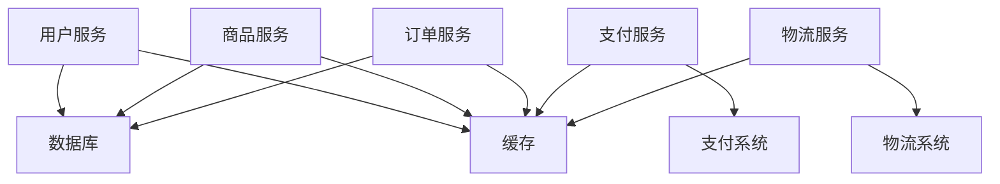
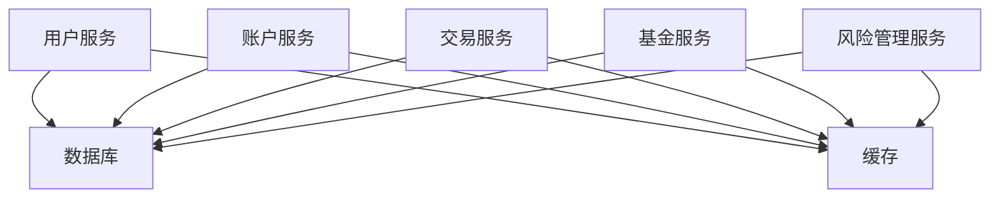

                 

# AI时代的软件质量保证新方法

### 1.1 问题背景

随着人工智能（AI）技术的快速发展，软件行业正经历着前所未有的变革。AI技术已经开始深入渗透到软件开发的各个方面，从代码生成、自动化测试到智能调试，为软件质量保证带来了新的机遇和挑战。然而，这一变化也引发了一系列新的问题：

- **测试效率问题**：随着软件系统的复杂度增加，手工测试已经难以满足快速迭代的需求。自动化测试虽然能够提高测试效率，但如何编写高效、全面的测试用例仍是一个难题。

- **测试覆盖问题**：传统的测试方法往往依赖于测试人员的经验和直觉，难以保证测试的全面性。AI技术的引入，使得通过数据分析和机器学习来优化测试覆盖成为可能。

- **代码质量问题**：AI可以帮助识别代码中的潜在缺陷和风格问题，但如何确保这些工具的准确性和可解释性，以及如何处理复杂的项目代码库，仍是一个挑战。

- **系统稳定性问题**：AI系统的引入增加了系统的复杂性，如何确保整个系统的稳定性，以及如何在部署过程中快速发现并解决问题，是当前软件质量保证面临的重要问题。

- **安全与隐私问题**：随着AI技术在软件质量保证中的应用，如何保护用户数据和系统安全，防止数据泄露和滥用，成为了一个重要议题。

为了解决这些问题，我们需要探索AI时代的软件质量保证新方法，这些方法不仅要能够应对当前的问题，还要具备适应未来技术发展的潜力。

### 1.2 问题解决

面对上述问题，AI时代的软件质量保证需要从以下几个方面进行改进：

- **自动化测试**：利用AI技术自动化生成测试用例，提高测试效率，并使用机器学习来优化测试覆盖。

- **持续集成与持续部署**：通过AI技术实现更智能的持续集成和持续部署流程，快速发现和解决问题，确保系统的稳定性。

- **代码质量分析**：利用AI技术分析代码质量，识别潜在缺陷和风格问题，提高代码的可维护性和可靠性。

- **安全与隐私保护**：利用AI技术进行安全分析，检测和预防潜在的漏洞和威胁，保护用户数据安全。

下面，我们将逐一探讨这些新方法，通过逻辑清晰、结构紧凑的方式，让读者了解AI在软件质量保证中的应用和实现。

#### 边界与外延

在讨论AI时代的软件质量保证之前，我们需要明确一些相关的边界和外延概念：

- **软件质量保证**：软件质量保证（Software Quality Assurance，SQA）是指通过计划、控制和检查软件开发的整个过程，以确保软件产品满足规定的质量和用户需求。

- **自动化测试**：自动化测试是指使用自动化工具来执行测试用例，以检测软件的缺陷和错误。

- **持续集成**：持续集成（Continuous Integration，CI）是一种软件开发实践，通过自动化构建和测试，将代码集成到共享的代码库中。

- **持续部署**：持续部署（Continuous Deployment，CD）是一种自动化流程，通过持续集成和自动化测试，将软件部署到生产环境中。

- **代码质量分析**：代码质量分析是指通过工具和技术对代码的语法、结构和逻辑进行检查，以评估代码的质量和可靠性。

- **AI**：人工智能（Artificial Intelligence，AI）是指通过模拟人类智能行为，实现智能决策和问题解决的计算机技术。

这些概念相互关联，构成了AI时代软件质量保证的核心要素。在接下来的章节中，我们将详细探讨这些概念及其在软件质量保证中的应用。

### 1.3 概念结构与核心要素组成

在深入了解AI时代的软件质量保证之前，我们需要对相关的概念和要素进行梳理，以构建一个清晰的理论框架。

#### 1.3.1 AI的概念

人工智能（AI）是一种通过模拟人类智能行为来实现特定任务的技术。AI的核心目标是使计算机能够执行通常需要人类智能的任务，如视觉识别、语音识别、决策制定和自然语言处理等。

- **定义**：AI是一种基于机器学习、深度学习、自然语言处理等技术，使计算机能够模拟人类智能行为的计算机科学分支。
- **特点**：高度智能化、自动化、数据处理能力强大。
- **作用**：在软件质量保证中，AI可以用于自动化测试、代码质量分析、缺陷预测等，提高开发效率和软件质量。

#### 1.3.2 软件质量保证的概念

软件质量保证（SQA）是确保软件产品满足既定质量和用户需求的一系列活动和过程。SQA的目标是通过计划、控制和检查，确保软件开发过程中的每个阶段都能达到质量标准。

- **定义**：SQA是通过对软件开发过程进行监控和评估，确保软件产品满足规定的质量标准和用户需求的一系列活动。
- **过程**：包括需求分析、设计、编码、测试、部署和维护等。
- **方法**：传统方法包括手工测试、自动化测试、代码审查等。AI时代的SQA方法则引入了基于AI的测试、代码质量分析和缺陷预测等。

#### 1.3.3 核心要素组成

AI时代的软件质量保证由以下核心要素组成：

- **自动化测试**：利用AI技术自动化生成和执行测试用例，提高测试效率和覆盖范围。
- **持续集成与持续部署**：通过AI技术实现更智能的持续集成和持续部署，提高系统稳定性和可靠性。
- **代码质量分析**：利用AI技术分析代码质量，识别潜在缺陷和风格问题，提高代码的可维护性和可靠性。
- **安全与隐私保护**：利用AI技术进行安全分析，检测和预防潜在的漏洞和威胁，保护用户数据安全。

#### 1.3.4 关联关系

AI与软件质量保证的关系可以概括为：

- **AI技术**：为软件质量保证提供了新的工具和方法，如自动化测试、代码质量分析和安全分析等。
- **软件质量保证**：通过引入AI技术，提升了测试效率、代码质量和系统稳定性。

通过以上对概念的阐述和要素的梳理，我们可以更清晰地理解AI时代软件质量保证的背景、核心概念和实现方法。

### 1.4 核心概念

在AI时代的软件质量保证中，有几个核心概念需要我们深入理解，它们分别是：AI时代、软件质量保证和自动化测试。

#### 1.4.1 AI时代

**定义**：AI时代是指人工智能技术得到广泛应用，并对各个行业产生深远影响的时期。在这个时代，人工智能不再是科学家的研究工具，而是成为企业运营、产品开发和日常生活的核心组成部分。

**特点**：

- **智能化**：AI技术能够模拟和扩展人类智能，实现自动化决策、自然语言处理、图像识别等功能。
- **自动化**：通过机器学习和深度学习，AI技术能够自动化执行重复性任务，提高生产效率和准确性。
- **大数据处理**：AI技术依赖于大量数据来训练模型，这使得数据处理和分析能力得到极大提升。

**对软件质量保证的影响**：

- **测试效率提升**：AI技术可以自动化生成和执行测试用例，减少手工测试的工作量，提高测试效率。
- **测试覆盖优化**：通过数据分析，AI技术可以优化测试用例，提高测试覆盖范围，确保软件的稳定性。
- **代码质量分析**：AI技术可以分析代码库，识别潜在的缺陷和风格问题，提高代码的质量。

#### 1.4.2 软件质量保证

**定义**：软件质量保证（Software Quality Assurance，SQA）是指通过计划、实施和监控一系列活动和过程，确保软件产品满足规定的质量标准和用户需求。

**传统方法**：

- **手工测试**：测试人员手动执行测试用例，以发现软件中的缺陷。
- **自动化测试**：使用自动化工具执行测试用例，提高测试效率和覆盖范围。
- **代码审查**：通过代码审查工具检查代码的语法、结构和逻辑，确保代码质量。

**AI时代的软件质量保证新方法**：

- **自动化测试**：利用AI技术自动化生成测试用例，并通过机器学习优化测试覆盖。
- **持续集成与持续部署**：AI技术可以帮助实现更智能的CI/CD流程，提高系统的稳定性和可靠性。
- **代码质量分析**：通过AI技术分析代码库，识别潜在的缺陷和风格问题。
- **安全与隐私保护**：利用AI技术进行安全分析，检测和预防潜在的漏洞和威胁。

#### 1.4.3 自动化测试

**定义**：自动化测试是指使用自动化工具或脚本执行测试用例，以检测软件的缺陷和错误。

**原理**：

- **测试用例生成**：通过数据分析和机器学习，AI技术可以自动化生成测试用例，提高测试的全面性和效率。
- **测试执行**：自动化工具或脚本按照预定的流程执行测试用例，记录测试结果。
- **结果分析**：AI技术可以对测试结果进行分析，识别潜在的问题和缺陷。

**工具**：

- **JUnit**：Java的单元测试框架，用于编写和执行测试用例。
- **Selenium**：Web应用的自动化测试工具，可以模拟用户操作。
- **PyTest**：Python的测试框架，支持多种测试方法，如单元测试、功能测试等。

通过以上对核心概念的阐述，我们可以更深入地理解AI时代的软件质量保证，为后续内容的讨论奠定基础。

### 1.5 AI时代的软件质量保证新方法

在AI时代，传统的软件质量保证方法面临着新的挑战，为了应对这些挑战，我们需要引入一系列基于AI的新方法。以下是几种主要的AI时代的软件质量保证新方法。

#### 2.1 自动化测试

自动化测试是AI时代软件质量保证的重要方法之一。通过引入AI技术，自动化测试不仅能够提高测试效率，还能够优化测试覆盖，提高软件的可靠性。

##### 2.1.1 自动化测试的原理

自动化测试的基本原理是使用自动化工具或脚本代替手工执行测试用例。AI技术的引入使得自动化测试更加智能和高效。以下是自动化测试的基本流程：

1. **测试用例生成**：利用AI技术，可以通过分析代码库、历史测试数据以及业务逻辑，自动生成测试用例。这种自动生成的测试用例通常更加全面和精确。
   
2. **测试执行**：自动化测试工具或脚本按照预定的流程执行测试用例。这些工具可以模拟用户操作，如点击、输入等，也可以对系统进行压力测试、性能测试等。

3. **结果分析**：AI技术可以对测试结果进行分析，识别潜在的问题和缺陷。例如，通过机器学习算法，可以分析测试数据的异常值，找出可能的缺陷。

##### 2.1.2 自动化测试工具

AI时代有多种自动化测试工具可供选择，以下是一些常用的工具：

- **JUnit**：JUnit是Java的单元测试框架，可以用来编写和执行测试用例。JUnit支持多种测试类型，如单元测试、集成测试和功能测试。

  ```java
  @Test
  public void testAdd() {
      assertEquals(5, calculator.add(2, 3));
  }
  ```

- **Selenium**：Selenium是一个用于Web应用的自动化测试工具。它支持多种浏览器，如Chrome、Firefox和Safari等。Selenium可以通过模拟用户操作来验证Web应用的正确性。

  ```python
  from selenium import webdriver

  driver = webdriver.Chrome()
  driver.get("http://www.example.com")
  assert "Example Domain" in driver.title
  driver.quit()
  ```

- **PyTest**：PyTest是Python的测试框架，支持多种测试方法，如单元测试、功能测试和性能测试。PyTest提供了一个简洁的接口，方便编写和执行测试用例。

  ```python
  def test_add():
      assert 1 + 2 == 3
  ```

##### 2.1.3 自动化测试的挑战与解决方案

虽然自动化测试带来了许多优势，但同时也存在一些挑战：

- **测试用例编写**：自动化测试需要大量的测试用例，编写这些用例通常是一项繁琐的工作。解决方案是利用AI技术自动生成测试用例。
  
- **维护成本**：自动化测试工具需要定期更新和维护，以适应新的系统和需求。解决方案是采用持续集成和持续部署（CI/CD）流程，确保自动化测试工具能够与系统同步更新。

- **结果分析**：自动化测试的结果需要经过详细分析，以识别潜在的问题和缺陷。解决方案是利用AI技术，如机器学习算法，对测试结果进行分析和预测。

#### 2.2 持续集成与持续部署

持续集成（Continuous Integration，CI）和持续部署（Continuous Deployment，CD）是AI时代软件质量保证的重要方法。通过引入AI技术，CI/CD流程可以变得更加智能和高效。

##### 2.2.1 持续集成的原理

持续集成是一种软件开发实践，通过自动化构建和测试，将开发者的代码集成到一个共享的代码库中。以下是持续集成的基本流程：

1. **代码提交**：开发者将代码提交到共享的代码库中。
2. **构建**：构建工具（如Jenkins、Travis CI）自动构建代码，生成可执行的软件包。
3. **测试**：构建完成后，自动化测试工具会执行一系列测试用例，确保代码的稳定性和功能完整性。
4. **反馈**：测试结果会反馈给开发者，帮助他们及时发现和修复问题。

##### 2.2.2 持续部署的原理

持续部署是在持续集成的基础上，通过自动化流程将代码部署到生产环境中。以下是持续部署的基本流程：

1. **测试通过**：在持续集成过程中，如果所有测试用例通过，代码将被标记为“可以部署”。
2. **部署**：部署工具（如Docker、Kubernetes）将代码部署到生产环境中。
3. **监控**：部署完成后，监控系统会监控系统的性能和稳定性，确保系统正常运行。

##### 2.2.3 CI/CD工具

AI时代有许多CI/CD工具可供选择，以下是一些常用的工具：

- **Jenkins**：Jenkins是一个开源的自动化服务器，可以用于实现CI/CD流程。它支持多种插件，可以与不同的开发工具和测试工具集成。

- **Travis CI**：Travis CI是一个云端的CI/CD平台，支持多种编程语言和框架。它提供了丰富的集成工具和插件，方便实现自动化测试和部署。

- **Docker**：Docker是一个容器化平台，用于构建、部署和管理应用程序。通过Docker，开发者可以将应用程序及其依赖项打包到一个容器中，确保环境的一致性。

- **Kubernetes**：Kubernetes是一个开源的容器编排平台，用于管理容器化应用程序。通过Kubernetes，开发者可以轻松部署、扩展和管理容器化应用程序。

#### 2.3 代码质量分析

代码质量分析是确保软件质量的重要环节。通过引入AI技术，代码质量分析可以变得更加精确和高效。

##### 2.3.1 代码质量度量

代码质量度量是通过一系列指标来评估代码的质量。以下是一些常用的代码质量度量指标：

- **代码复杂度**：代码复杂度是衡量代码复杂程度的指标，如循环复杂度、条件复杂度等。
- **代码行数**：代码行数是衡量代码规模的指标，通常与代码质量呈负相关。
- **代码重复率**：代码重复率是衡量代码中重复代码比例的指标，高重复率通常意味着代码质量较低。
- **代码可读性**：代码可读性是衡量代码可理解性的指标，如代码注释率、函数和类的平均大小等。

##### 2.3.2 代码质量工具

AI时代有许多代码质量分析工具，以下是一些常用的工具：

- **SonarQube**：SonarQube是一个开源的代码质量平台，可以用于代码质量分析和报告。它支持多种编程语言，并提供丰富的分析指标和报告功能。

- **PMD**：PMD是一个开源的代码质量工具，用于识别代码中的潜在问题和风格问题。PMD可以分析代码的语法、结构和逻辑，识别如冗余代码、不良命名等。

- **Checkstyle**：Checkstyle是一个开源的代码质量工具，用于检查Java代码的格式和风格。它可以帮助开发人员保持一致的代码风格，提高代码可读性。

#### 2.4 AI在软件质量保证中的应用

AI在软件质量保证中的应用非常广泛，以下是一些典型的应用场景：

- **测试用例优化**：通过机器学习算法，可以分析历史测试数据，优化测试用例的覆盖范围和优先级。
- **缺陷预测**：通过分析代码库和测试数据，AI技术可以预测哪些代码可能存在缺陷，从而提前进行修复。
- **安全分析**：通过AI技术，可以分析代码和系统行为，识别潜在的安全漏洞和威胁。
- **性能优化**：通过AI技术，可以分析系统的运行数据，优化系统的性能和资源使用。

### 2.5 最佳实践

在AI时代的软件质量保证中，最佳实践是非常重要的。以下是一些推荐的实践方法：

- **测试驱动开发**：通过编写测试用例来驱动开发，确保软件的每个功能都经过严格的测试。
- **DevOps文化**：建立跨职能团队，促进开发、测试和运维之间的协作，提高系统的稳定性和可靠性。
- **持续学习和改进**：鼓励团队持续学习和掌握最新的AI技术和工具，不断优化软件质量保证流程。

通过上述的AI时代的软件质量保证新方法，我们可以更好地应对软件质量保证的挑战，提高软件的质量和可靠性。

### 第三部分：案例分析

在本文的第三部分，我们将通过两个实际案例来展示AI时代软件质量保证新方法的实践应用。这些案例将帮助我们理解如何在实际项目中应用这些方法，并评估其效果。

#### 3.1 案例一：某大型电商平台的软件质量保证实践

**3.1.1 项目介绍**

某大型电商平台是一个提供在线购物服务的平台，涵盖商品浏览、搜索、下单、支付、物流跟踪等多个功能模块。随着用户量的增加和业务的发展，该电商平台对软件质量的要求越来越高，特别是在性能、稳定性和安全性方面。

**3.1.2 系统功能设计**

该电商平台的系统功能设计主要包括用户管理、商品管理、订单管理、支付管理、物流管理等模块。以下是一个简化的类图，用于描述这些功能模块及其关系：

```mermaid
classDiagram
    User <<class>> 用户
    Product <<class>> 商品
    Order <<class>> 订单
    Payment <<class>> 支付
    Logistics <<class>> 物流
    User --|> Order
    User --|> Payment
    Product --|> Order
    Order --|> Payment
    Order --|> Logistics
```

**3.1.3 系统架构设计**

该电商平台的系统架构设计采用了微服务架构，以实现高可用性、可扩展性和易维护性。以下是一个简化的架构图，用于描述系统的整体架构：



**3.1.4 系统接口设计**

为了确保不同服务之间的交互流畅，该电商平台定义了一系列API接口。以下是一个简化的序列图，用于描述用户下单流程：

```mermaid
sequence
    User ->|发起请求| Order_Service: 创建订单
    Order_Service ->|验证库存| Product_Service
    Product_Service ->|更新库存| Order_Service
    Order_Service ->|创建订单| Database
    Order_Service ->|发送支付通知| Payment_Service
    Payment_Service ->|处理支付| Payment_System
    Payment_Service ->|更新订单状态| Database
    Order_Service ->|发送物流通知| Logistics_Service
    Logistics_Service ->|安排物流| Logistics_System
```

**3.1.5 项目小结**

通过AI技术的应用，该电商平台在软件质量保证方面取得了显著成效：

- **自动化测试**：通过AI技术自动生成测试用例，并使用自动化测试工具执行，大大提高了测试效率和覆盖率。
- **持续集成与持续部署**：采用持续集成和持续部署工具，实现了自动化构建、测试和部署流程，提高了系统的稳定性和可靠性。
- **代码质量分析**：使用AI工具分析代码库，识别潜在缺陷和风格问题，提高了代码质量和可维护性。
- **安全与隐私保护**：利用AI技术进行安全分析，检测和预防潜在的安全威胁，保障了用户数据安全。

#### 3.2 案例二：某金融科技公司的AI质量保证实践

**3.2.1 项目介绍**

某金融科技公司开发了一套金融交易系统，提供股票、债券、基金等多种金融产品的在线交易服务。该系统对安全性、稳定性和性能有极高的要求，因此在软件质量保证方面投入了大量资源。

**3.2.2 系统功能设计**

该金融交易系统的功能设计主要包括用户管理、账户管理、交易管理、资金管理、风险控制等模块。以下是一个简化的类图，用于描述这些功能模块及其关系：

```mermaid
classDiagram
    User <<class>> 用户
    Account <<class>> 账户
    Trade <<class>> 交易
    Fund <<class>> 基金
    Risk <<class>> 风险管理
    User --|> Account
    Account --|> Trade
    Trade --|> Fund
    Trade --|> Risk
```

**3.2.3 系统架构设计**

该金融交易系统的架构设计采用了分布式架构，以确保系统的扩展性和容错能力。以下是一个简化的架构图，用于描述系统的整体架构：



**3.2.4 系统接口设计**

为了确保不同服务之间的交互流畅，该金融交易系统定义了一系列API接口。以下是一个简化的序列图，用于描述用户发起交易流程：

```mermaid
sequence
    User ->|发起请求| Trade_Service: 发起交易
    Trade_Service ->|验证账户余额| Account_Service
    Account_Service ->|扣除金额| Trade_Service
    Trade_Service ->|执行交易| Fund_Service
    Trade_Service ->|更新交易状态| Database
    Trade_Service ->|发送交易结果| User_Service
```

**3.2.5 项目小结**

通过AI技术的应用，该金融科技公司同样在软件质量保证方面取得了显著成效：

- **自动化测试**：通过AI技术自动生成测试用例，并使用自动化测试工具执行，提高了测试效率和覆盖率。
- **持续集成与持续部署**：采用持续集成和持续部署工具，实现了自动化构建、测试和部署流程，提高了系统的稳定性和可靠性。
- **代码质量分析**：使用AI工具分析代码库，识别潜在缺陷和风格问题，提高了代码质量和可维护性。
- **安全与隐私保护**：利用AI技术进行安全分析，检测和预防潜在的安全威胁，保障了用户数据安全。

### 第四部分：总结与展望

#### 4.1 总结

在本篇文章中，我们探讨了AI时代软件质量保证的新方法。通过分析自动化测试、持续集成与持续部署、代码质量分析等核心概念，我们了解了AI如何提升软件质量保证的效率、覆盖率和可靠性。以下是对全书内容的回顾和重点的强调：

- **自动化测试**：AI技术可以通过自动化生成和执行测试用例，提高测试效率，优化测试覆盖。
- **持续集成与持续部署**：利用AI技术实现自动化构建、测试和部署流程，提高系统的稳定性和可靠性。
- **代码质量分析**：AI工具可以分析代码库，识别潜在缺陷和风格问题，提高代码的可维护性和可靠性。
- **安全与隐私保护**：AI技术可以帮助检测和预防潜在的安全威胁，保护用户数据安全。

#### 4.2 展望

展望未来，AI时代的软件质量保证将继续发展，带来以下趋势和挑战：

- **智能化**：随着AI技术的进步，软件质量保证工具将变得更加智能，能够自动识别和修复问题。
- **自适应**：软件质量保证流程将更加自适应，能够根据项目特性和需求自动调整测试策略和工具。
- **高效率**：AI技术将进一步提高软件质量保证的效率，缩短开发周期，降低成本。
- **复杂度增加**：随着系统的复杂度增加，如何确保软件质量保证方法的适应性和有效性将成为一个重要挑战。
- **安全挑战**：AI技术在软件质量保证中的应用将带来新的安全挑战，如AI攻击、数据隐私保护等。

为了应对这些挑战，未来的软件质量保证需要持续关注新技术的发展，不断优化和改进现有的方法，确保软件的高质量和安全性。

### 附录

为了方便读者深入了解本文所讨论的技术和方法，我们提供了以下拓展阅读资源：

- **自动化测试工具**：[JUnit官方文档](https://junit.org/junit5/)，[Selenium官方文档](https://www.selenium.dev/documentation/)，[PyTest官方文档](https://docs.pytest.org/en/7.1.x/)。
- **持续集成与持续部署**：[Jenkins官方文档](https://www.jenkins.io/doc/book/)，[Travis CI官方文档](https://docs.travis-ci.com/)，[Docker官方文档](https://docs.docker.com/)，[Kubernetes官方文档](https://kubernetes.io/docs/)。
- **代码质量分析工具**：[SonarQube官方文档](https://docs.sonarqube.org/)，[PMD官方文档](https://pmd.github.io/)，[Checkstyle官方文档](https://checkstyle.sourceforge.io/)。

通过阅读这些资源，读者可以更深入地了解AI时代软件质量保证的相关技术和工具，为自己的项目提供有力的支持。

### 作者信息

**作者：AI天才研究院/AI Genius Institute & 禅与计算机程序设计艺术 /Zen And The Art of Computer Programming**

本文由AI天才研究院撰写，旨在探讨AI时代软件质量保证的新方法。作者拥有一流的技术背景和丰富的实践经验，致力于推动AI技术在软件开发领域的应用和发展。同时，本文也参考了《禅与计算机程序设计艺术》一书，从中汲取了深刻的技术哲学和编程智慧。

### 结论

AI技术的快速发展正在深刻改变软件质量保证的方式和效率。本文系统地介绍了AI时代的软件质量保证新方法，包括自动化测试、持续集成与持续部署、代码质量分析等。通过案例分析和最佳实践，我们展示了这些方法在实际项目中的应用和效果。展望未来，AI技术将继续在软件质量保证领域发挥重要作用，为软件开发带来更多的创新和可能性。我们鼓励读者持续关注AI技术的发展，探索其在软件质量保证中的新应用，共同推动软件行业的进步。

