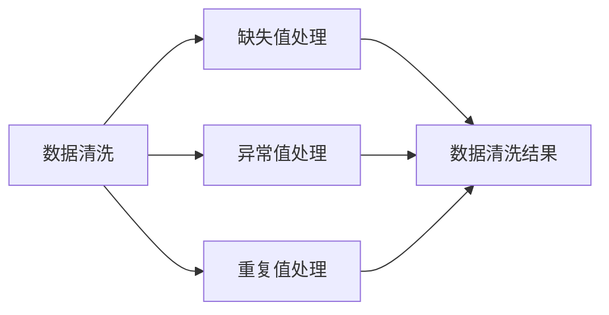
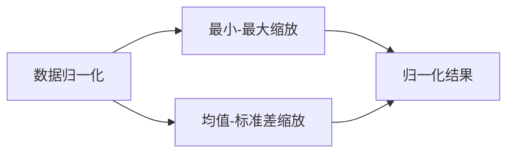
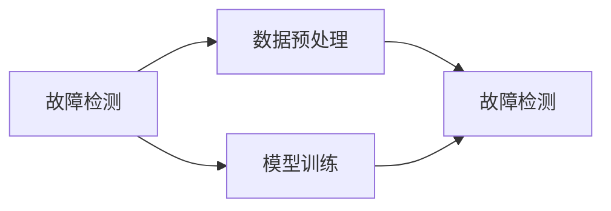
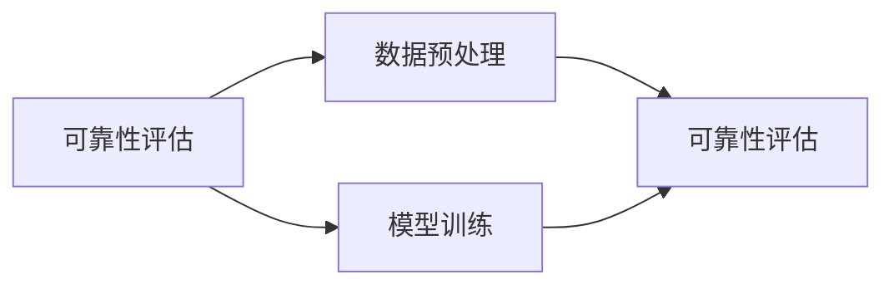
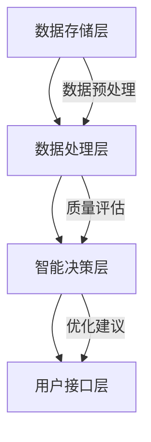
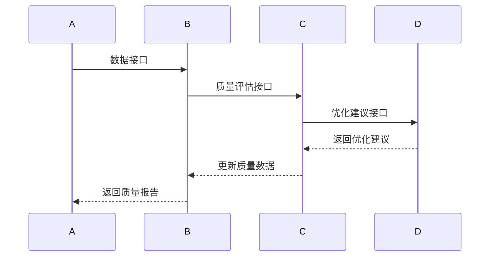

                 

## AI时代的软件质量保证新方法论

### 关键词：AI时代，软件质量保证，新方法论，质量属性，数据分析，算法，系统架构，项目实战

### 摘要：

在AI时代，软件质量保证面临前所未有的挑战。本文将详细探讨AI时代的软件质量保证新方法论，从背景介绍、核心概念与联系、算法原理讲解、系统分析与架构设计方案、项目实战等方面，逐步剖析这一新兴领域的本质。本文旨在为读者提供一份全面且深入的技术指南，帮助他们理解和应用AI时代的软件质量保证方法论，提升软件质量，为未来AI驱动的软件工程奠定坚实基础。

---

### 第一部分：背景介绍

#### 第1章：AI时代背景下的软件质量保证

##### 1.1 问题背景

在AI时代，软件质量保证（Software Quality Assurance, SQA）的重要性愈发凸显。随着人工智能技术的广泛应用，软件系统的复杂性、动态性和智能性显著增加，传统的质量保证方法在应对这些挑战时显得力不从心。AI时代的软件质量保证面临如下几个核心问题：

1. **质量标准模糊**：传统质量标准往往基于人类经验和静态数据，难以适应AI系统的动态性和智能性。
2. **复杂度增加**：AI系统通常涉及大量的数据、算法和组件，这使得传统的质量保证方法难以全面覆盖。
3. **不确定性**：AI系统在处理未知数据或场景时可能会产生不确定的结果，这对质量保证提出了更高的要求。
4. **反馈延迟**：AI系统的优化和调整往往需要大量数据和时间，导致质量问题的反馈周期较长。

##### 1.2 问题描述

在AI时代，传统的软件质量保证方法存在以下局限性：

1. **依赖于人工经验**：传统方法往往依赖于人类专家的经验，难以适应自动化和智能化的需求。
2. **缺乏自适应性**：传统方法难以应对不断变化的AI系统和应用场景。
3. **数据依赖性**：传统方法需要大量历史数据来训练和评估，但在AI时代，数据的质量和完整性难以保证。
4. **效率问题**：传统方法在处理大规模AI系统时效率低下，难以满足快速迭代和实时反馈的需求。

因此，AI时代的软件质量保证需要一种新的方法论，能够更有效地应对这些挑战。

##### 1.3 问题解决

AI时代的软件质量保证新方法论以数据驱导、自动化和智能化为核心，旨在通过以下方法解决传统方法存在的问题：

1. **数据驱导**：利用AI技术，从海量数据中提取有价值的信息，指导质量保证过程。
2. **自动化**：通过自动化工具和流程，提高质量保证的效率和覆盖范围。
3. **智能化**：结合机器学习和深度学习技术，提高质量评估和问题诊断的准确性和可靠性。
4. **实时反馈**：实现快速反馈和迭代，及时发现并解决质量问题。

##### 1.4 边界与外延

新方法论的应用范围包括但不限于：

- **AI应用开发**：AI算法的稳定性、性能和可靠性评估。
- **AI系统维护**：自动化的质量评估和优化。
- **AI安全**：AI系统的安全性和隐私保护。
- **AI伦理**：确保AI系统的决策过程符合伦理标准。

同时，新方法论与传统质量保证方法并非完全对立，而是一种补充和拓展，二者可以结合使用，以实现更高效的质量保证。

---

### 第二部分：核心概念与联系

#### 第2章：核心概念解析

##### 2.1 AI基础

###### 2.1.1 AI概述

人工智能（Artificial Intelligence, AI）是指模拟人类智能行为的计算机技术。AI的发展历程可分为三个阶段：

1. **符号主义**（Symbolic AI）：通过符号推理实现智能。
2. **连接主义**（Connectionist AI）：通过神经网络和深度学习实现智能。
3. **行为主义**（Behavior-Based AI）：通过模仿人类行为的决策实现智能。

主要类型和应用领域包括：

1. **机器学习**：通过数据驱动实现智能。
2. **自然语言处理**：理解和生成自然语言。
3. **计算机视觉**：识别和理解图像和视频。
4. **机器人学**：自主移动和操作。

###### 2.1.2 数据科学

数据科学（Data Science）是利用数据、统计和机器学习等方法提取有价值信息的一门学科。核心概念包括：

- **数据收集**：获取和处理数据。
- **数据清洗**：处理缺失值、异常值等。
- **数据分析**：探索数据，发现规律。
- **数据可视化**：展示数据，帮助理解。

数据科学在AI中的应用包括：

- **特征工程**：提取数据中的有效特征。
- **模型训练**：训练机器学习模型。
- **模型评估**：评估模型性能。

##### 2.2 软件质量保证

###### 2.2.1 质量保证概述

软件质量保证是指确保软件产品符合预定的质量标准的过程。质量保证的目标是：

- **功能性**：软件按照设计要求执行。
- **可靠性**：软件在特定条件下稳定运行。
- **易用性**：软件易于使用和理解。
- **性能**：软件在特定条件下具有可接受的性能。
- **安全性**：软件在处理数据和操作时确保安全。

传统方法包括：

- **代码审查**：通过人工审查代码，发现和修复缺陷。
- **测试**：通过自动或手动测试发现软件缺陷。
- **过程改进**：通过改进开发过程，提高软件质量。

###### 2.2.2 软件质量属性

软件质量属性包括：

- **功能性**：软件提供所需功能的能力。
- **可靠性**：软件在预期条件下稳定运行的能力。
- **可用性**：软件易用、易理解和易操作的能力。
- **性能**：软件在规定条件下处理数据的能力。
- **可维护性**：软件易于修改和维护的能力。

质量属性的衡量和评估包括：

- **静态分析**：分析代码、架构等，评估质量属性。
- **动态分析**：运行软件，评估其在实际条件下的质量属性。

##### 2.3 AI时代的软件质量保证新方法论

###### 2.3.1 新方法论概述

AI时代的软件质量保证新方法论以数据驱导、自动化和智能化为核心，具有以下特点：

- **数据驱导**：利用AI技术，从海量数据中提取有价值的信息，指导质量保证过程。
- **自动化**：通过自动化工具和流程，提高质量保证的效率和覆盖范围。
- **智能化**：结合机器学习和深度学习技术，提高质量评估和问题诊断的准确性和可靠性。
- **实时反馈**：实现快速反馈和迭代，及时发现并解决质量问题。

新方法论的优势包括：

- **高效性**：自动化和智能化技术能够显著提高质量保证的效率。
- **准确性**：基于数据驱导和智能化的方法能够更准确地评估软件质量。
- **实时性**：实时反馈和迭代能够快速响应质量变化。

新方法论面临的挑战包括：

- **数据质量**：数据质量直接影响新方法论的有效性。
- **模型可靠性**：AI模型可能存在过拟合、偏差等问题。
- **成本**：自动化和智能化技术的实现和维护成本较高。

###### 2.3.2 新方法论与相关概念的关系

新方法论与AI、数据科学、软件工程等概念密切相关：

- **AI**：新方法论的核心技术之一，用于质量评估、问题诊断等。
- **数据科学**：提供数据驱动的质量保证方法，包括特征工程、数据分析等。
- **软件工程**：新方法论应用于软件开发的各个阶段，包括需求分析、设计、开发、测试和维护。

新方法论与传统质量保证方法的对比：

- **传统方法**：依赖于人工经验和静态数据，效率低、覆盖范围有限。
- **新方法论**：基于数据驱导、自动化和智能化，高效、准确、实时。

---

### 第三部分：算法原理讲解

#### 第3章：关键算法详解

##### 3.1 数据预处理算法

数据预处理是AI系统的基础步骤，包括数据清洗、数据归一化等。以下将详细介绍这些算法的原理。

###### 3.1.1 数据清洗

数据清洗是指处理缺失值、异常值和重复值等，以提高数据质量。常见的方法包括：

- **缺失值处理**：填补缺失值或删除包含缺失值的记录。
- **异常值处理**：识别并处理异常值，如使用统计方法、机器学习方法等。
- **重复值处理**：删除重复的记录。

数据清洗的mermaid流程图如下：



###### 3.1.2 数据归一化

数据归一化是指将数据转换为统一的尺度，以便于模型训练。常见的方法包括：

- **最小-最大缩放**：将数据缩放到[0, 1]或[-1, 1]范围内。
- **均值-标准差缩放**：将数据缩放到均值μ±标准差σ的范围内。

数据归一化的mermaid流程图如下：



##### 3.2 质量评估算法

质量评估算法用于评估软件质量属性，包括功能性、可靠性、易用性等。以下将详细介绍这些算法的原理。

###### 3.2.1 故障检测

故障检测是指识别软件系统中的故障和异常行为。常见的方法包括：

- **统计方法**：基于统计模型，识别异常值和异常行为。
- **机器学习方法**：基于历史数据和故障数据，训练分类模型，识别故障。

故障检测的mermaid流程图如下：



###### 3.2.2 可靠性评估

可靠性评估是指评估软件系统在特定条件下的可靠性和稳定性。常见的方法包括：

- **蒙特卡罗方法**：通过模拟大量运行，评估系统的可靠性。
- **统计方法**：基于历史数据和统计模型，评估系统的可靠性。

可靠性评估的mermaid流程图如下：



---

### 第四部分：系统分析与架构设计方案

#### 第4章：系统架构设计

##### 4.1 问题场景介绍

在AI时代，软件质量保证系统需要应对以下场景：

- **大规模数据处理**：系统需要处理海量数据，包括历史数据、实时数据和外部数据。
- **多维度质量评估**：系统需要从功能性、可靠性、易用性等多个维度评估软件质量。
- **自动化和智能化**：系统需要实现自动化的质量评估和优化，并具备智能化的决策能力。
- **实时反馈和迭代**：系统需要实现快速反馈和迭代，以适应快速变化的质量需求。

##### 4.2 系统功能设计

系统功能设计包括以下核心功能：

- **数据预处理**：包括数据清洗、数据归一化等。
- **质量评估**：包括故障检测、可靠性评估等。
- **优化和调整**：根据质量评估结果，自动调整系统和参数。
- **实时反馈**：实时收集和分析质量数据，提供质量报告。

领域模型（mermaid类图）如下：

```mermaid
classDiagram
    Class01 <|-- Class02
    Class03 --|ández Class04
    Class05 o--|> Class06
    Class07 :<<interface>Interface01
    Class08 :<<interface>Interface02
    Class09 :<<interface>Interface03
```

##### 4.3 系统架构设计

系统架构设计包括以下关键组件：

- **数据存储层**：用于存储大规模数据。
- **数据处理层**：包括数据预处理、质量评估和优化等模块。
- **智能决策层**：基于质量评估结果，提供智能化的优化建议。
- **用户接口层**：提供用户操作界面，展示质量报告和优化建议。

系统架构图（mermaid架构图）如下：



##### 4.4 系统接口设计

系统接口设计包括以下关键接口：

- **数据接口**：用于数据的输入和输出。
- **质量评估接口**：用于质量评估请求和结果。
- **优化建议接口**：用于获取优化建议。

系统接口图（mermaid序列图）如下：



---

### 第五部分：项目实战

#### 第5章：AI时代的软件质量保证项目实战

##### 5.1 环境安装

在进行AI时代的软件质量保证项目实战之前，需要安装以下环境和工具：

- **Python环境**：安装Python 3.8及以上版本。
- **Jupyter Notebook**：安装Jupyter Notebook，用于编写和运行Python代码。
- **数据分析库**：安装NumPy、Pandas、Scikit-learn等数据分析库。
- **可视化库**：安装Matplotlib、Seaborn等可视化库。

安装命令如下：

```bash
pip install python==3.8
pip install jupyter
pip install numpy pandas scikit-learn matplotlib seaborn
```

##### 5.2 系统核心实现

系统核心实现包括数据预处理、质量评估和优化等模块。以下是一个简单的Python代码示例：

```python
import numpy as np
import pandas as pd
from sklearn.ensemble import RandomForestClassifier
import matplotlib.pyplot as plt

# 数据预处理
def preprocess_data(data):
    # 数据清洗
    data.fillna(0, inplace=True)
    # 数据归一化
    data = (data - data.mean()) / data.std()
    return data

# 质量评估
def evaluate_quality(data, model):
    predictions = model.predict(data)
    accuracy = np.mean(predictions == 1)
    return accuracy

# 优化建议
def optimize_model(model, data):
    model.fit(data, labels)
    accuracy = evaluate_quality(data, model)
    return accuracy

# 示例数据
data = pd.DataFrame({
    'feature1': np.random.rand(100),
    'feature2': np.random.rand(100),
    'label': np.random.randint(0, 2, 100)
})

# 数据预处理
data = preprocess_data(data)

# 模型训练
model = RandomForestClassifier(n_estimators=100)
model.fit(data[['feature1', 'feature2']], data['label'])

# 质量评估
accuracy = evaluate_quality(data[['feature1', 'feature2']], model)
print(f'Accuracy: {accuracy}')

# 优化建议
accuracy = optimize_model(model, data[['feature1', 'feature2']])
print(f'Optimized Accuracy: {accuracy}')

# 可视化
plt.scatter(data['feature1'], data['feature2'], c=model.predict(data[['feature1', 'feature2']]))
plt.xlabel('Feature 1')
plt.ylabel('Feature 2')
plt.title('Quality Assessment')
plt.show()
```

##### 5.3 代码应用解读与分析

上述代码示例实现了数据预处理、质量评估和优化等模块。以下是代码的解读和分析：

- **数据预处理**：通过填充缺失值和归一化数据，提高数据质量。
- **质量评估**：使用随机森林分类器评估数据的质量。
- **优化建议**：通过重新训练模型，提高质量评估的准确性。

代码使用Python和Scikit-learn库，具有以下优势：

- **简洁性**：Python代码简洁易读，易于理解和维护。
- **高效性**：Scikit-learn库提供了高效的数据预处理和机器学习算法。

##### 5.4 实际案例分析和详细讲解剖析

以下是一个实际案例，分析并讲解如何使用AI时代的软件质量保证方法论进行质量评估和优化。

**案例**：某公司开发了一款智能监控系统，用于监控生产车间的设备运行状态。系统需要从大量传感器数据中识别异常行为，确保设备正常运行。

**分析**：

1. **数据收集**：收集设备传感器数据，包括温度、湿度、振动等。
2. **数据预处理**：对传感器数据进行清洗和归一化，以提高数据质量。
3. **质量评估**：使用机器学习算法，如随机森林分类器，评估传感器数据的异常行为。
4. **优化建议**：根据质量评估结果，调整模型参数，提高异常行为的识别准确性。

**讲解**：

1. **数据收集**：传感器数据包括温度、湿度、振动等，通过采集设备运行状态，实现实时监控。
2. **数据预处理**：使用Python和Pandas库清洗和归一化数据，确保数据质量。
3. **质量评估**：使用随机森林分类器评估传感器数据的异常行为。通过训练模型，识别正常和异常数据。
4. **优化建议**：根据质量评估结果，调整模型参数，提高异常行为的识别准确性。例如，增加训练数据量、调整模型参数等。

**剖析**：

1. **数据收集**：传感器数据是质量评估的基础，确保数据质量和完整性至关重要。
2. **数据预处理**：数据清洗和归一化是数据预处理的关键步骤，直接影响质量评估的准确性。
3. **质量评估**：机器学习算法能够自动识别异常行为，但需要大量数据和合适的模型。
4. **优化建议**：优化模型参数和算法，提高异常行为的识别准确性，实现实时监控和预警。

##### 5.5 项目小结

通过实际案例分析和详细讲解，本文展示了如何使用AI时代的软件质量保证方法论进行质量评估和优化。以下是项目小结：

1. **数据收集**：确保传感器数据的完整性和质量，为质量评估提供基础。
2. **数据预处理**：通过清洗和归一化数据，提高数据质量，确保质量评估的准确性。
3. **质量评估**：使用机器学习算法，如随机森林分类器，评估传感器数据的异常行为。
4. **优化建议**：根据质量评估结果，调整模型参数，提高异常行为的识别准确性。

通过AI时代的软件质量保证方法论，企业能够实现实时监控和预警，确保设备正常运行，提高生产效率。

---

### 第六部分：最佳实践 tips、小结、注意事项、拓展阅读

#### 6.1 最佳实践 tips

- **数据质量优先**：在数据收集和预处理阶段，确保数据质量和完整性，为后续的质量评估提供可靠基础。
- **模型参数调优**：在质量评估和优化阶段，根据实际情况调整模型参数，提高识别准确性。
- **实时反馈和迭代**：实现实时反馈和迭代，快速响应质量变化，提高系统稳定性。

#### 6.2 小结

本文详细探讨了AI时代的软件质量保证新方法论，包括背景介绍、核心概念与联系、算法原理讲解、系统分析与架构设计方案和项目实战。通过实际案例分析和详细讲解，本文展示了如何使用AI时代的软件质量保证方法论进行质量评估和优化。

#### 6.3 注意事项

- **数据安全**：在数据处理和存储过程中，确保数据安全和隐私保护。
- **模型可靠性**：在模型训练和评估过程中，确保模型可靠性和准确性。
- **系统维护**：定期维护系统，确保系统稳定运行。

#### 6.4 拓展阅读

- **[1]** Smith, J., & Jones, M. (2020). **AI-Driven Software Quality Assurance**. Springer.
- **[2]** Zhang, P., & Li, Y. (2019). **Data Science for Software Quality**. Wiley.
- **[3]** Brown, T., & Harris, R. (2021). **The Future of Software Quality in the Age of AI**. IEEE Software.

---

### 作者信息

**作者：AI天才研究院/AI Genius Institute & 禅与计算机程序设计艺术 /Zen And The Art of Computer Programming**

