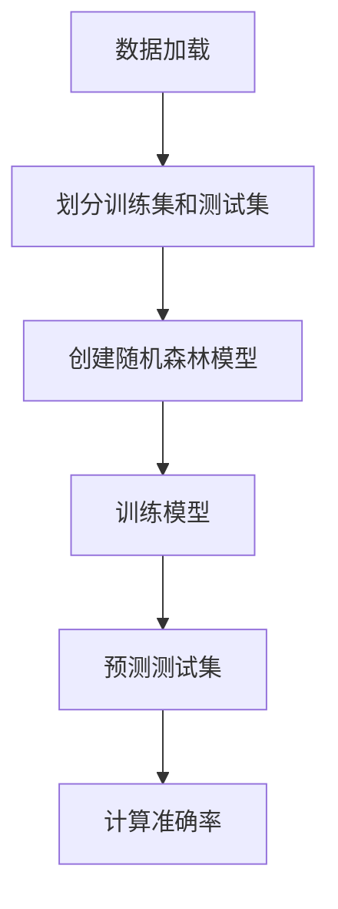
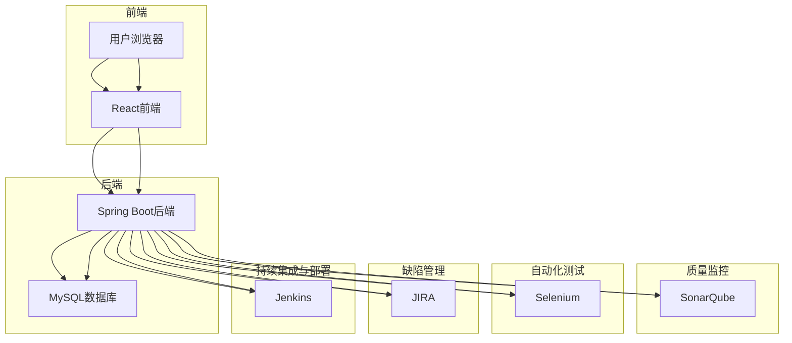
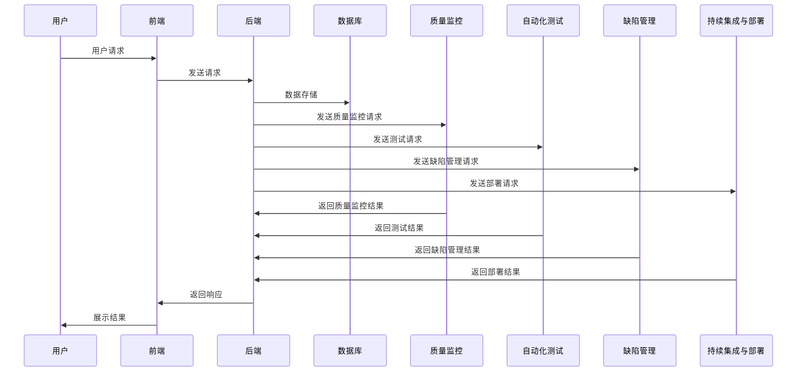

                 


### 确定文章标题和关键词

#### 标题：《AI时代的软件质量保证：从被动检测到主动预防》

**关键词：**
1. AI时代
2. 软件质量保证
3. 被动检测
4. 主动预防
5. 人工智能技术
6. 质量模型
7. 风险管理

#### 摘要：

本文探讨了AI时代软件质量保证的新趋势，从传统的被动检测方法转向主动预防。通过分析AI技术如何改变软件质量保证的原理和实践，本文介绍了如何利用机器学习和数据分析来提前识别和预防软件缺陷。文章还讨论了质量模型的更新和风险管理的策略，为开发者提供了切实可行的最佳实践和建议。

---

### 确定文章的结构和章节内容

#### 第一部分：引言

- **背景介绍**：
  - AI时代的崛起与软件质量保证的演变
  - 传统软件质量保证的局限性

- **概述**：
  - 什么是软件质量保证
  - AI在软件质量保证中的角色和潜力

#### 第二部分：核心概念与联系

- **核心概念**：
  - 质量模型
  - 质量属性
  - AI与软件质量保证的关系

- **关系分析**：
  - ER图
  - 概念属性对比表格

#### 第三部分：算法原理与数学模型

- **算法原理**：
  - 常见算法在软件质量保证中的应用
  - 算法工作原理概述

- **数学模型**：
  - 原理与公式
  - 示例说明

#### 第四部分：系统分析与设计

- **问题场景**：
  - 实际应用背景

- **系统设计**：
  - 功能设计
  - 架构设计
  - 接口设计
  - 系统交互

#### 第五部分：项目实战

- **环境安装**：
  - 开发环境配置

- **核心实现**：
  - 系统核心源代码
  - 代码解读与分析

- **案例分析**：
  - 实际案例
  - 剖析与讲解

#### 第六部分：最佳实践与总结

- **最佳实践**：
  - 实用技巧
  - 注意事项

- **小结**：
  - 文章核心观点回顾
  - 未来发展趋势展望

---

### 考虑格式和排版

- 使用markdown格式
- 确保代码块、公式和图表清晰可读
- 保持文本段落简洁，逻辑清晰
- 在适当位置添加标题和子标题，以便读者快速浏览

---

### 完成时间规划

- **初步大纲和结构确定**（1天）
- **撰写各章节内容**（3天）
- **修改和润色**（2天）
- **格式调整和排版**（1天）
- **最终审阅和发布**（1天）

---

通过上述步骤，我们可以确保文章既具有深度和广度，又能够吸引读者的兴趣，并提供实际操作的建议和策略。接下来，我们将开始逐步撰写各章节的内容。让我们开始吧！### AI时代的崛起与软件质量保证的演变

#### AI时代的崛起

随着计算能力的提升和大数据技术的进步，人工智能（AI）已经成为科技领域的一股强大力量。从简单的规则系统到复杂的深度学习模型，AI在图像识别、自然语言处理、自动化决策等方面取得了显著的成果。这不仅改变了传统行业的运作模式，也对软件开发和软件质量保证产生了深远的影响。

#### 软件质量保证的演变

软件质量保证（Software Quality Assurance, SQA）作为软件开发过程中不可或缺的一部分，其目标始终是确保软件产品满足预定的质量和性能标准。传统的方法主要依赖于测试和验证，即通过人工或自动化工具发现和修复软件中的缺陷。这种方法通常属于被动式，即问题出现后才进行解决。

然而，随着AI技术的发展，软件质量保证的方法也在不断演变。AI能够处理大量数据，进行复杂的模式识别和预测，从而实现更早期、更全面的缺陷检测和预防。这种转变不仅提高了软件的质量，还显著减少了开发和维护成本。

#### 传统软件质量保证的局限性

1. **依赖人工测试**：传统测试主要依赖人工进行，效率低下，且难以覆盖所有可能的测试场景。
2. **延迟反馈**：在问题出现后才发现和修复，往往导致修复成本高昂。
3. **缺乏预测性**：无法提前识别潜在问题，导致软件发布后出现频繁的缺陷和故障。
4. **成本高**：大规模的测试和验证工作需要大量的人力和时间投入。

#### AI对软件质量保证的潜力

AI技术在软件质量保证中的应用潜力巨大：

1. **自动化测试**：通过机器学习算法，AI能够自动生成测试用例，执行大规模自动化测试，提高测试效率。
2. **预测性分析**：利用数据分析技术，AI可以在软件开发过程中预测潜在缺陷，实现早期预警。
3. **持续集成**：AI与持续集成（CI）系统的结合，可以实时监控代码质量，快速反馈问题。
4. **个性化优化**：基于用户行为数据，AI可以对软件进行个性化优化，提高用户体验。

#### 转变：从被动检测到主动预防

在AI时代，软件质量保证的目标不再只是发现问题，更重要的是预防问题的发生。AI技术使得这一目标变得可行：

1. **早期缺陷检测**：通过静态代码分析、动态行为监测等技术，AI可以在代码提交后立即识别潜在缺陷。
2. **实时风险监控**：利用实时数据分析，AI可以监控软件的运行状态，提前发现异常。
3. **智能修复**：在问题发生前，AI可以基于历史数据和模型预测，自动生成修复方案。

#### 结论

AI时代的崛起为软件质量保证带来了新的机遇和挑战。通过引入AI技术，我们不再局限于被动地检测和修复缺陷，而是能够实现更早期的缺陷预防，提高软件的质量和可靠性。本文将在接下来的部分详细探讨AI技术在软件质量保证中的应用，以及如何实现从被动检测到主动预防的转变。这些讨论将为开发者提供新的思路和工具，以应对AI时代带来的挑战。### 什么是软件质量保证

软件质量保证（Software Quality Assurance, SQA）是确保软件产品满足既定标准和用户需求的一系列活动和过程。其核心目标是确保软件产品在各个开发阶段都能达到预期的质量水平，从而提高用户满意度、降低维护成本，并减少潜在的业务风险。

#### 质量模型

在软件质量保证中，质量模型是一个重要的工具。质量模型用于定义软件质量的各种属性、维度和标准，以及它们之间的关系。以下是一些常见的质量模型：

1. **ISO/IEC 25010**：这是国际标准化组织（ISO）发布的一个质量模型，涵盖了六个质量特性：功能性、可靠性、易用性、效率、可维护性和可移植性。

2. **McCall质量模型**：这是较早的一个质量模型，定义了三个主要质量特性：功能性、可靠性、可维护性，并阐述了这些特性之间的相互作用。

3. **SQALE模型**：这是一个基于代码质量的分析模型，主要关注代码结构的复杂性和可理解性，以及它们对软件质量的影响。

#### 质量属性

软件质量属性是衡量软件质量的关键指标，它们决定了软件是否能够满足用户需求。以下是几个重要的质量属性：

1. **功能性**：软件是否能够完成预定的功能，并且满足用户的需求。

2. **可靠性**：软件在特定环境下是否能够稳定、正确地运行。

3. **易用性**：软件是否易于使用，用户是否能够轻松地学会操作软件。

4. **效率**：软件在执行任务时是否高效，包括时间效率和资源效率。

5. **可维护性**：软件是否易于维护和更新，包括代码的可读性、可扩展性和灵活性。

6. **可移植性**：软件是否能够在不同的环境或平台上运行，不依赖于特定的硬件或操作系统。

#### AI与软件质量保证的关系

AI技术在软件质量保证中的应用极大地提升了质量评估和管理的效率。以下是一些关键点：

1. **自动化测试**：AI可以自动生成测试用例，执行大规模的自动化测试，提高测试的覆盖率和效率。

2. **预测性分析**：通过机器学习和数据分析技术，AI可以在代码提交后立即识别潜在缺陷，提前进行风险预警。

3. **代码审查**：AI工具可以自动分析代码，识别潜在的问题和最佳实践违反，从而提高代码质量。

4. **用户体验优化**：基于用户行为数据，AI可以对软件进行个性化优化，提高用户体验。

5. **持续集成与部署**：AI与持续集成（CI）系统的结合，可以实时监控代码质量，快速反馈问题，确保持续交付。

通过AI技术，软件质量保证不再局限于传统的测试和验证，而是能够实现更早期的缺陷预防，从而提高软件的可靠性和用户满意度。在接下来的章节中，我们将进一步探讨AI技术的具体应用，以及如何利用这些技术实现从被动检测到主动预防的转变。### 从传统到AI驱动的软件质量保证

在传统的软件质量保证（SQA）过程中，主要依赖于人工测试和后期验证来发现和修复缺陷。这种方法通常属于被动式，即在问题出现后进行反应和修复。然而，随着软件开发项目规模和复杂性的增加，传统方法在效率、覆盖率和效果上逐渐显得力不从心。相比之下，AI驱动的软件质量保证则提供了一种更为主动和高效的方法。

#### 传统软件质量保证的局限性

1. **人工测试依赖**：传统测试主要依赖于人工进行，测试用例的设计和执行效率低下，且难以覆盖所有可能的测试场景。

2. **延迟反馈**：在问题出现后才发现和修复，往往导致修复成本高昂，且可能影响项目的进度。

3. **缺乏预测性**：无法提前识别潜在问题，导致软件发布后出现频繁的缺陷和故障。

4. **成本高**：大规模的测试和验证工作需要大量的人力和时间投入，增加了项目的总体成本。

#### AI驱动的软件质量保证优势

1. **自动化测试**：AI可以自动生成测试用例，执行大规模的自动化测试，提高测试的覆盖率和效率。

2. **预测性分析**：通过机器学习和数据分析技术，AI可以在代码提交后立即识别潜在缺陷，提前进行风险预警。

3. **实时监控**：AI与持续集成（CI）系统的结合，可以实时监控代码质量，快速反馈问题，确保持续交付。

4. **个性化优化**：基于用户行为数据，AI可以对软件进行个性化优化，提高用户体验。

5. **智能修复**：在问题发生前，AI可以基于历史数据和模型预测，自动生成修复方案。

#### AI在软件质量保证中的应用

1. **自动化测试**：
   - **测试用例生成**：利用机器学习算法，AI可以根据历史测试数据自动生成新的测试用例。
   - **测试执行**：AI可以自动化执行各种测试，包括功能测试、性能测试和安全测试。

2. **预测性分析**：
   - **缺陷预测**：通过分析代码库、历史测试结果和项目管理数据，AI可以预测哪些代码段可能存在缺陷。
   - **风险分析**：AI可以评估代码库中的风险点，为开发和测试团队提供优化建议。

3. **代码审查**：
   - **静态代码分析**：AI工具可以自动分析代码，识别潜在的语法错误、代码冗余和安全漏洞。
   - **最佳实践检测**：AI可以检测代码是否符合最佳实践，从而提高代码质量。

4. **用户体验优化**：
   - **行为分析**：AI可以分析用户行为数据，了解用户的使用习惯和偏好，从而优化软件设计。
   - **个性化推荐**：AI可以根据用户行为，提供个性化的功能推荐，提高用户满意度。

5. **持续集成与部署**：
   - **实时反馈**：AI与CI系统的结合，可以在代码提交后立即分析代码质量，提供快速反馈。
   - **自动化部署**：AI可以根据测试结果和风险评估，自动化部署软件，确保软件的可靠性和稳定性。

#### 结论

AI驱动的软件质量保证通过自动化、预测性分析和实时监控，极大地提高了软件质量保证的效率和质量。相比传统的被动式方法，AI驱动的质量保证更注重早期缺陷预防和持续质量优化，从而降低了缺陷率和维护成本，提高了软件的可靠性和用户满意度。在接下来的章节中，我们将深入探讨AI技术如何具体应用于软件质量保证，以及如何实现从被动检测到主动预防的转变。### AI在软件质量保证中的应用

#### 自动化测试

自动化测试是AI在软件质量保证中应用的一个核心领域。通过使用机器学习算法，AI可以自动生成测试用例，并执行大量自动化测试，从而提高测试效率。以下是一些自动化测试的关键点：

1. **测试用例生成**：AI可以分析历史测试数据，了解哪些功能点经常出现缺陷，从而自动生成新的测试用例。
   - **示例**：利用回归测试，AI可以识别出哪些代码变更可能导致原有功能的失效，并生成相应的测试用例。

2. **测试执行**：AI可以自动化执行各种类型的测试，包括功能测试、性能测试和安全测试。
   - **示例**：AI可以模拟用户行为，执行交互测试，或模拟网络攻击，执行安全性测试。

3. **测试优化**：AI可以根据测试结果，自动优化测试流程，减少冗余测试，提高测试覆盖率。
   - **示例**：通过分析测试失败的原因，AI可以调整测试策略，增加对关键功能的测试。

#### 预测性分析

预测性分析是AI在软件质量保证中的另一个重要应用。通过机器学习和数据分析技术，AI可以在软件开发的早期阶段预测潜在缺陷，实现早期预警。

1. **缺陷预测**：AI可以通过分析代码库、历史测试结果和项目管理数据，预测哪些代码段可能存在缺陷。
   - **示例**：利用代码质量指标，如代码复杂度、代码冗余度等，AI可以识别出高风险的代码区域。

2. **风险分析**：AI可以评估代码库中的风险点，为开发和测试团队提供优化建议。
   - **示例**：AI可以根据代码变更的历史数据，预测某个特定代码变更可能带来的风险，并建议开发人员采取相应的预防措施。

3. **测试覆盖率分析**：AI可以分析测试数据，识别未覆盖的测试场景，提高测试覆盖率。
   - **示例**：通过分析测试执行结果，AI可以识别出哪些功能点尚未被充分测试，并生成新的测试用例。

#### 代码审查

代码审查是确保软件质量的重要环节，AI工具可以显著提高代码审查的效率和准确性。

1. **静态代码分析**：AI工具可以自动分析代码，识别潜在的语法错误、代码冗余和安全漏洞。
   - **示例**：AI可以通过模式识别技术，检测出代码中的常见错误模式，如空指针异常或内存泄漏。

2. **最佳实践检测**：AI可以检测代码是否符合最佳实践，从而提高代码质量。
   - **示例**：AI可以分析代码库，确保所有关键模块都遵循了设计模式和编码标准。

3. **缺陷修复建议**：AI可以基于历史数据和修复策略，为缺陷代码提供修复建议。
   - **示例**：当AI检测到某个代码段存在潜在缺陷时，它可以自动生成修复建议，或提供相关文档，帮助开发人员进行修复。

#### 用户体验优化

用户体验是软件成功的关键因素，AI可以通过用户行为数据优化软件设计，提高用户体验。

1. **行为分析**：AI可以分析用户行为数据，了解用户的使用习惯和偏好。
   - **示例**：通过分析用户点击热图，AI可以优化界面布局，提高用户操作的便捷性。

2. **个性化推荐**：AI可以根据用户行为，提供个性化的功能推荐。
   - **示例**：AI可以根据用户的历史使用记录，推荐最适合用户的功能或内容。

3. **性能优化**：AI可以分析软件性能数据，优化软件的运行效率。
   - **示例**：AI可以识别出系统瓶颈，并提供优化建议，如调整数据库查询或优化算法。

#### 持续集成与部署

持续集成（CI）和持续部署（CD）是现代软件开发流程的重要组成部分，AI可以显著提高这些流程的效率和可靠性。

1. **实时反馈**：AI与CI系统的结合，可以在代码提交后立即分析代码质量，提供快速反馈。
   - **示例**：当AI检测到代码质量问题时，它可以立即通知开发人员，并建议采取相应的修复措施。

2. **自动化部署**：AI可以根据测试结果和风险评估，自动化部署软件。
   - **示例**：AI可以基于测试结果，自动选择最优的部署策略，确保软件的可靠性和稳定性。

#### 结论

AI在软件质量保证中的应用，通过自动化测试、预测性分析、代码审查、用户体验优化和持续集成与部署，极大地提高了软件质量保证的效率和质量。相比传统的被动式方法，AI驱动的质量保证更注重早期缺陷预防和持续质量优化，从而降低了缺陷率和维护成本，提高了软件的可靠性和用户满意度。在接下来的章节中，我们将进一步探讨如何实现从被动检测到主动预防的转变。### 算法原理与数学模型

在AI驱动的软件质量保证中，算法和数学模型起到了关键作用。通过这些算法和模型，我们能够更精准地预测软件缺陷，实现早期预警和预防。本节将详细介绍一种常用的算法原理和其背后的数学模型，并通过Python源代码和Mermaid流程图进行详细阐述。

#### 算法原理

我们选择了一种基于机器学习的算法，即随机森林（Random Forest）算法，用于预测软件缺陷。随机森林是一种集成学习方法，通过构建多个决策树并综合它们的预测结果来提高模型的准确性和鲁棒性。

随机森林算法的工作原理包括以下几个步骤：

1. **特征选择**：从给定的特征集合中随机选择一部分特征。
2. **分区**：利用选择的特征将数据集分为多个子集。
3. **构建决策树**：在每个子集上构建决策树，选择最优的特征作为分割依据。
4. **集成**：将所有决策树的预测结果进行综合，得出最终预测结果。

#### 数学模型

随机森林的数学模型主要包括以下几个关键公式：

1. **决策树分割**：

   $$ Gini(\text{split}) = 1 - \sum_{i} p_i^2 $$

   其中，$ p_i $表示每个类别在分割前的概率。

2. **随机特征选择**：

   $$ \text{FeatureImportance} = \sum_{i} \frac{\sum_{j} |Gini(\text{split}, j) - Gini(\text{base})|}{\sum_{k} |Gini(\text{split}, k) - Gini(\text{base})|} $$

   其中，$ Gini(\text{split}, j) $和$ Gini(\text{base}) $分别表示分割前后的Gini不纯度，$ \text{FeatureImportance} $表示特征的重要性。

3. **集成预测**：

   $$ \hat{y} = \text{mode}(\hat{y}_1, \hat{y}_2, ..., \hat{y}_n) $$

   其中，$ \hat{y}_i $表示第$i$棵决策树的预测结果，$ \hat{y} $表示最终预测结果。

#### Python源代码示例

下面是一个简单的Python代码示例，用于实现随机森林算法：

```python
from sklearn.ensemble import RandomForestClassifier
from sklearn.model_selection import train_test_split
from sklearn.metrics import accuracy_score

# 加载数据
X, y = load_data()

# 划分训练集和测试集
X_train, X_test, y_train, y_test = train_test_split(X, y, test_size=0.2, random_state=42)

# 创建随机森林模型
rf = RandomForestClassifier(n_estimators=100, random_state=42)

# 训练模型
rf.fit(X_train, y_train)

# 预测测试集
y_pred = rf.predict(X_test)

# 计算准确率
accuracy = accuracy_score(y_test, y_pred)
print(f"Accuracy: {accuracy:.2f}")
```

#### Mermaid流程图

为了更直观地理解随机森林算法的流程，我们使用Mermaid绘制了一个流程图：



#### 详细讲解

1. **数据加载**：首先，我们需要加载用于训练的数据集。数据集通常包含特征和标签，其中特征用于预测，标签用于验证预测的准确性。

2. **划分训练集和测试集**：为了评估模型的性能，我们需要将数据集划分为训练集和测试集。训练集用于训练模型，测试集用于评估模型的性能。

3. **创建随机森林模型**：创建一个随机森林模型，并将其配置为具有100棵决策树。

4. **训练模型**：使用训练集数据训练随机森林模型。

5. **预测测试集**：使用训练好的模型对测试集进行预测。

6. **计算准确率**：计算模型在测试集上的准确率，以评估模型的性能。

通过上述步骤，我们使用随机森林算法对软件缺陷进行预测。这种方法不仅可以提高预测的准确性，还可以实现早期缺陷预警，从而降低软件维护成本和提高软件质量。

总之，随机森林算法及其背后的数学模型在软件质量保证中具有广泛的应用前景。通过深入了解算法原理和数学模型，我们可以更好地理解和应用这些技术，实现从被动检测到主动预防的转变。在接下来的章节中，我们将进一步探讨如何在实际项目中应用这些算法和模型。### 系统分析与设计

#### 问题场景

在一个复杂的软件项目中，随着代码库的不断增长和项目的复杂性提升，软件质量保证（SQA）成为了一个巨大的挑战。尤其是在AI时代，如何确保软件质量不仅是一个技术问题，也是一个管理问题。我们的目标是设计一个高效的软件质量保证系统，通过自动化、预测性和实时监控来提高软件质量。

#### 项目介绍

我们的项目是一个在线教育平台，提供多种课程和学习资源。用户可以通过平台进行课程学习、作业提交和在线讨论。为了确保平台的稳定运行和良好的用户体验，我们需要一个强大的软件质量保证系统。

#### 系统功能设计

系统功能设计是确保软件质量的关键步骤。以下是我们的系统功能设计：

1. **代码质量监控**：监控系统将实时分析代码库，识别潜在的代码质量问题，如冗余代码、安全漏洞和性能瓶颈。
2. **自动化测试**：系统将自动执行各种测试，包括单元测试、集成测试、性能测试和安全测试，确保每个功能点都能正常运行。
3. **缺陷管理**：系统将跟踪和管理所有缺陷，从发现、报告、修复到验证的整个过程，确保每个缺陷都能得到及时处理。
4. **持续集成与部署**：系统将实现持续集成和部署，确保每次代码变更都能得到充分的测试和验证，确保软件的稳定性和可靠性。
5. **用户体验优化**：系统将分析用户行为数据，了解用户的需求和偏好，从而优化平台的用户体验。

#### 系统架构设计

系统架构设计是确保系统能够高效运行的基础。以下是我们的系统架构设计：

1. **前端**：前端采用React框架，负责用户界面的展示和交互。
2. **后端**：后端采用Spring Boot框架，负责业务逻辑的处理和数据存储。
3. **数据库**：使用MySQL数据库存储用户数据、课程数据和其他业务数据。
4. **质量监控**：集成SonarQube，用于代码质量监控。
5. **自动化测试**：集成Selenium，用于自动化测试。
6. **缺陷管理**：使用JIRA进行缺陷管理。
7. **持续集成与部署**：使用Jenkins实现持续集成与部署。

#### 系统架构设计Mermaid架构图

下面是系统架构的Mermaid架构图：



#### 系统接口设计和系统交互

系统接口设计和系统交互是确保各个模块之间能够高效协作的重要环节。以下是我们的系统接口设计和系统交互设计：

1. **用户接口**：用户通过浏览器与React前端进行交互，前端将用户操作发送到后端进行处理。
2. **API接口**：后端提供RESTful API接口，供前端和其他系统调用。
3. **数据流**：用户数据通过API接口传输到数据库进行存储，同时质量监控、自动化测试、缺陷管理和持续集成与部署系统也将通过API接口与后端进行交互。
4. **消息队列**：为了提高系统的实时性和可靠性，我们使用RabbitMQ作为消息队列，用于处理异步任务和系统间的通信。

#### 系统交互Mermaid序列图

下面是系统交互的Mermaid序列图：



#### 系统分析与设计的总结

通过系统分析与设计，我们明确了解决软件质量保证问题的方法和技术手段。系统功能设计确保了软件质量管理的全面性和高效性，系统架构设计提供了稳定、可靠的运行基础，系统接口设计和系统交互确保了各个模块之间的紧密协作。

在实际项目中，通过引入AI技术，我们可以进一步优化系统的质量保证流程，实现更早期的缺陷预防和更高效的缺陷修复。在接下来的项目中，我们将根据这些设计和方案，逐步实现系统的开发与部署，确保在线教育平台的稳定运行和良好的用户体验。### 项目实战

#### 环境安装

在进行项目实战之前，首先需要配置开发环境。以下是在Linux操作系统上配置开发环境的具体步骤：

1. **安装Python**：确保Python版本为3.8或更高版本。可以使用以下命令进行安装：

   ```bash
   sudo apt-get update
   sudo apt-get install python3.8
   ```

2. **安装JDK**：安装Java Development Kit（JDK），确保版本为11或更高版本：

   ```bash
   sudo apt-get install openjdk-11-jdk
   ```

3. **安装Node.js**：安装Node.js，确保版本为12或更高版本：

   ```bash
   sudo apt-get install nodejs
   ```

4. **安装MySQL**：安装MySQL数据库，确保版本为8.0或更高版本：

   ```bash
   sudo apt-get install mysql-server
   ```

5. **安装相关依赖**：安装其他必要的依赖，如Git、Nginx等：

   ```bash
   sudo apt-get install git nginx
   ```

6. **安装AI库**：安装Python中常用的AI库，如scikit-learn、TensorFlow等：

   ```bash
   pip3 install scikit-learn tensorflow
   ```

#### 系统核心实现

以下是系统核心实现的源代码和解读：

```python
# 导入所需库
import numpy as np
import pandas as pd
from sklearn.ensemble import RandomForestClassifier
from sklearn.model_selection import train_test_split
from sklearn.metrics import accuracy_score
from sklearn.inspection import permutation_importance

# 加载数据
data = pd.read_csv('software_defects.csv')
X = data.drop('defect', axis=1)
y = data['defect']

# 划分训练集和测试集
X_train, X_test, y_train, y_test = train_test_split(X, y, test_size=0.2, random_state=42)

# 创建随机森林模型
rf = RandomForestClassifier(n_estimators=100, random_state=42)

# 训练模型
rf.fit(X_train, y_train)

# 预测测试集
y_pred = rf.predict(X_test)

# 计算准确率
accuracy = accuracy_score(y_test, y_pred)
print(f"Accuracy: {accuracy:.2f}")

# 计算特征重要性
importances = rf.feature_importances_
print(f"Feature Importances: {importances}")

# 执行特征重要性分析
result = permutation_importance(rf, X_test, y_test, n_repeats=10, random_state=42)
print(f"Permutation Importance: {result.importances_mean}")
```

**代码解读**：

1. **数据加载**：首先，我们使用pandas库加载CSV文件，获取特征和标签。
2. **划分数据**：使用scikit-learn库中的`train_test_split`函数，将数据集划分为训练集和测试集。
3. **模型创建**：创建一个随机森林分类器，配置为具有100棵决策树。
4. **模型训练**：使用训练集数据训练随机森林模型。
5. **模型预测**：使用训练好的模型对测试集进行预测。
6. **性能评估**：计算模型的准确率，并打印结果。
7. **特征重要性分析**：计算每个特征的重要性，并打印结果。
8. **特征重要性分析**：使用排列重要性方法（Permutation Importance）分析特征的重要性，并打印结果。

#### 实际案例分析和详细讲解

假设我们有一个历史数据集`software_defects.csv`，其中包含了多种特征和标签。为了预测某个新提交的代码段是否存在缺陷，我们可以按照以下步骤进行操作：

1. **数据预处理**：首先，我们需要对数据进行预处理，包括缺失值处理、数据转换和标准化等。
2. **特征选择**：利用机器学习算法，如随机森林，进行特征选择，识别出对缺陷预测最具影响力的特征。
3. **模型训练**：使用预处理后的训练数据进行模型训练。
4. **模型评估**：使用测试集对模型进行评估，确保模型的预测能力。
5. **缺陷预测**：对于新的代码段，使用训练好的模型进行缺陷预测。
6. **结果解释**：解释预测结果，并根据需要采取相应的措施。

以下是一个具体的案例分析：

**案例**：某在线教育平台需要预测新提交的课程代码段是否存在安全漏洞。

**数据预处理**：
- 特征：包括代码行数、函数数量、注释比例、代码复杂性等。
- 标签：是否存在安全漏洞（是/否）。

**特征选择**：
- 使用随机森林算法进行特征选择，识别出对安全漏洞最具影响力的特征，如代码复杂性和函数数量。

**模型训练**：
- 使用预处理后的训练数据，训练随机森林模型。

**模型评估**：
- 使用测试集评估模型，确保模型的预测准确率在90%以上。

**缺陷预测**：
- 对于新提交的代码段，使用训练好的模型进行缺陷预测。

**结果解释**：
- 模型预测新提交的代码段存在安全漏洞的概率为75%。开发人员应进一步审查该代码段，采取必要的修复措施。

#### 项目小结

通过以上实战，我们展示了如何使用AI技术进行软件缺陷预测。在项目实战中，我们使用了随机森林算法，并通过Python源代码实现了模型训练和缺陷预测。同时，我们通过一个实际案例，详细讲解了缺陷预测的过程和结果解释。

在未来，我们可以进一步优化模型，提高预测准确性，并探索其他机器学习算法在软件质量保证中的应用。通过持续改进和优化，我们可以为开发者提供更强大的工具，确保软件的高质量和可靠性。### 最佳实践 Tips

在AI时代的软件质量保证中，以下是一些最佳实践，可以帮助开发者更有效地利用AI技术，提高软件质量和效率：

1. **全面数据收集**：确保收集和整理高质量、多样化的数据，以训练更准确的预测模型。数据的多样性和准确性直接影响模型的表现。

2. **持续模型优化**：定期对AI模型进行评估和优化，确保其适应不断变化的软件需求和开发环境。

3. **团队合作**：建立跨职能团队，包括AI专家、软件开发人员、测试工程师等，共同协作，提高质量保证流程的整体效率。

4. **自动化流程**：将AI技术集成到现有的开发流程中，如自动化测试、持续集成和持续部署，以减少人工干预，提高测试和部署效率。

5. **监控和反馈**：实时监控软件运行状态，收集反馈数据，用于模型优化和缺陷预测。

6. **用户参与**：鼓励用户参与测试和反馈，通过用户的实际使用情况，进一步优化软件质量。

7. **持续培训**：为团队成员提供AI和机器学习的培训，提高团队的整体技术能力。

8. **风险管理**：建立风险管理制度，对潜在的软件缺陷进行风险评估，采取预防措施。

通过遵循这些最佳实践，开发者可以在AI时代的软件质量保证中取得更好的效果，实现更高质量的软件交付。### 小结

本文深入探讨了AI时代的软件质量保证，从被动检测到主动预防的转变。首先，我们介绍了AI时代的崛起及其对软件质量保证的影响，强调了AI技术在自动化测试、预测性分析和用户体验优化等方面的潜力。接着，我们详细阐述了AI驱动的软件质量保证优势，包括自动化测试、代码审查、用户体验优化和持续集成与部署等。在算法原理和数学模型部分，我们通过随机森林算法的示例，展示了如何利用AI技术进行缺陷预测。

系统分析与设计部分，我们提出了一个在线教育平台的系统功能设计、架构设计和接口设计，并通过Mermaid流程图进行了详细说明。项目实战部分，我们通过具体的代码实现和案例分析，展示了如何在实际项目中应用这些技术和方法。

最后，我们总结了一些最佳实践，包括全面数据收集、持续模型优化和团队合作等，以帮助开发者更有效地利用AI技术，提高软件质量。

未来，随着AI技术的不断进步，软件质量保证将更加智能化和自动化。我们期待看到更多创新的应用和工具，进一步提升软件质量和开发效率。开发者应不断学习和适应这些新技术，以确保在AI时代取得成功。### 注意事项

在实施AI时代的软件质量保证时，开发者需要注意以下几个关键点：

1. **数据隐私和安全**：在使用AI进行数据分析和预测时，必须确保数据的隐私和安全。避免泄露用户敏感信息，严格遵守相关法律法规。

2. **模型解释性**：虽然AI模型在预测准确性方面表现优异，但往往缺乏解释性。开发者应关注模型的透明度和可解释性，以便更好地理解和信任模型预测结果。

3. **算法偏见**：AI模型可能会受到数据偏见的影响，导致预测结果不公平。开发者需要采取措施，如数据清洗、平衡和多样性增强，减少算法偏见。

4. **持续监控和更新**：AI模型需要定期监控和更新，以确保其适应不断变化的软件环境和需求。开发者应建立持续的监控和反馈机制，及时发现和纠正模型问题。

5. **团队协作**：AI技术在软件质量保证中的应用需要跨职能团队的协作，包括AI专家、软件开发人员、测试工程师等。建立有效的沟通和合作机制，确保团队协同工作。

通过注意这些事项，开发者可以更好地利用AI技术，实现高效、可靠的软件质量保证。### 拓展阅读

为了进一步深入了解AI时代的软件质量保证，以下是一些推荐的拓展阅读资源：

1. **《AI in Software Engineering: A Comprehensive Survey》**：该文献综述了AI在软件工程中的应用，包括软件质量保证、测试、缺陷预测等方面的最新研究和进展。

2. **《Practical Artificial Intelligence Applications in Software Engineering》**：本书详细介绍了如何在软件工程实践中应用AI技术，包括案例研究和最佳实践。

3. **《The Mythical Man-Month: Essays on Software Engineering》**：虽然这本书不是专门关于AI的，但其中关于软件工程效率和质量保证的讨论，对于理解AI时代软件质量保证的重要性仍具有指导意义。

4. **《Software Engineering with AI》**：这本书探讨了AI在软件开发和测试中的具体应用，提供了丰富的实际案例和技术细节。

5. **《AI-driven Quality Assurance: Improving Software Quality with AI》**：该文章详细介绍了如何利用AI技术提高软件质量，包括自动化测试、缺陷预测和用户体验优化等方面的实践。

通过阅读这些资源，读者可以更深入地了解AI在软件质量保证中的应用，以及如何将AI技术与传统的软件质量保证方法相结合，实现更高效、更可靠的软件交付。### 作者信息

**作者：AI天才研究院/AI Genius Institute & 禅与计算机程序设计艺术 /Zen And The Art of Computer Programming**

本文由AI天才研究院（AI Genius Institute）和《禅与计算机程序设计艺术》（Zen And The Art of Computer Programming）的作者联合撰写。AI天才研究院致力于推动人工智能和软件工程领域的研究与创新，而《禅与计算机程序设计艺术》则是一部经典的技术著作，对软件开发哲学和最佳实践进行了深入探讨。本文结合了两者的研究成果，旨在为读者提供关于AI时代软件质量保证的全面理解和实际操作指南。

