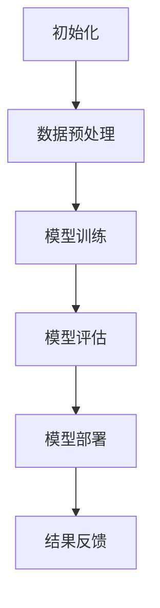
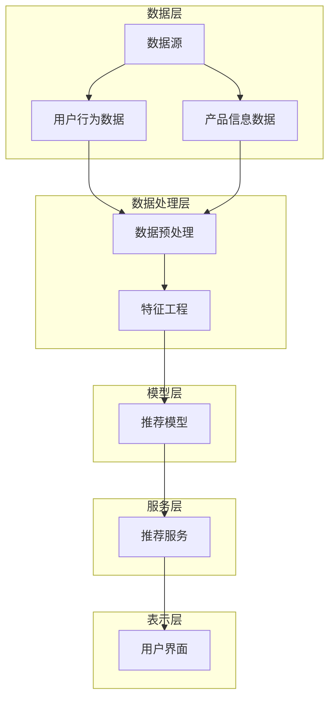
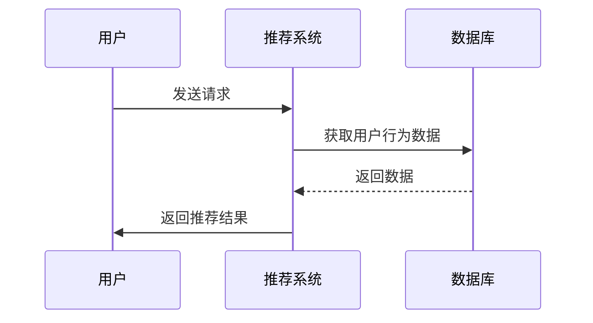

                 


### 文章标题: AI时代的软件项目管理新范式

### 关键词：AI时代、软件项目管理、新范式、敏捷开发、数据驱动、团队协作

### 摘要：
本文深入探讨了AI时代软件项目管理的现状与挑战，提出并详细阐述了适应AI时代的软件项目管理新范式。通过核心概念分析、算法原理讲解、系统架构设计和项目实战案例，本文旨在为软件开发者提供一套实用、高效的软件项目管理方法论。

## 第一部分：背景介绍

### 第1章: AI时代软件项目管理的现状与挑战

### 1.1 问题背景

### 1.1.1 AI时代的到来

#### AI技术发展的概述

随着深度学习、自然语言处理、计算机视觉等领域的迅猛发展，人工智能（AI）已经深刻影响了各行各业。AI技术的普及不仅带来了新的商业模式，还带来了软件开发的新挑战。首先，AI算法和模型变得更加复杂，传统的软件开发流程和工具已经无法满足高效开发的需求。其次，AI项目通常需要处理大量数据，对数据处理和存储能力提出了更高的要求。

#### 人工智能对软件开发的影响

人工智能的出现改变了软件开发的基本逻辑。传统的软件开发依赖于既定的需求和设计，而AI项目往往需要在不断变化的数据中学习和优化。这种动态性要求项目管理方法更加灵活和敏捷，以快速响应需求变化和迭代。

### 1.1.2 软件项目管理的发展

#### 传统软件项目管理的特点

传统软件项目管理注重线性过程，包括需求分析、设计、开发、测试和部署等阶段。这些方法在信息化早期阶段发挥了重要作用，但随着软件系统复杂性的增加，传统的项目管理方式逐渐暴露出不足。

#### 软件项目管理面临的新挑战

1. **技术复杂性**：AI算法的复杂性导致项目团队需要具备更高的技术能力和专业知识。
2. **数据处理需求**：大数据处理成为AI项目的核心需求，对系统的计算能力和数据处理能力提出了挑战。
3. **团队协作挑战**：AI项目通常涉及多个学科，需要跨学科的团队协作，而异地协作和沟通则增加了项目的难度。

### 1.2 问题描述

#### 1.2.1 技术复杂性

AI算法的复杂性使得软件项目的需求变化更加频繁，难以提前预知。传统的瀑布模型无法适应这种动态性，因此需要新的项目管理方法来应对。

#### 1.2.2 数据处理需求

大数据处理是AI项目的核心需求。如何高效地收集、存储、处理和分析大量数据，成为项目管理中的重要问题。

#### 1.2.3 团队协作挑战

AI项目通常需要跨学科、跨地域的团队协作。这要求项目管理方法能够有效地协调不同专业背景的团队成员，确保项目顺利进行。

### 1.3 问题解决

#### 1.3.1 新范式概述

新范式是指一种适应AI时代特点的软件项目管理方法。这种方法强调敏捷性、数据驱动和团队协作，能够更好地应对AI项目中的复杂性和变化。

#### 1.3.2 本书的内容与结构

本书将首先介绍新范式的基本概念和原理，然后通过具体案例和实践经验，展示如何在AI项目中应用新范式。具体内容包括：

- 核心概念与联系
- 算法原理讲解
- 系统分析与架构设计
- 项目实战
- 最佳实践 tips

### 1.4 边界与外延

#### 1.4.1 范式的适用范围

新范式主要适用于涉及AI技术的软件项目，包括但不限于机器学习应用、智能系统开发、数据科学项目等。然而，它并不是万能的，对于一些传统软件项目，传统方法可能更加适用。

#### 1.4.2 核心要素组成

新范式的核心要素包括：

- 敏捷开发方法
- 数据驱动决策
- 持续集成和持续部署
- 跨学科团队协作

### 1.5 本章小结

本章介绍了AI时代软件项目管理的背景、挑战和解决方案。AI时代的到来带来了技术复杂性、数据处理需求和高强度的团队协作挑战，传统项目管理方法难以应对。新范式通过强调敏捷性、数据驱动和团队协作，提供了一种适用于AI项目的管理方法。接下来的章节将详细探讨新范式的核心概念和具体实践。

## 第二部分：核心概念与联系

### 第2章: AI时代的软件项目管理核心概念

### 2.1 核心概念原理

#### 敏捷开发

敏捷开发是一种强调快速响应变化、持续交付和客户满意度的软件开发方法。它通过短周期的迭代和增量式开发，确保项目能够灵活适应需求变化。

#### 数据驱动

数据驱动是一种基于数据的决策方法。在AI项目中，数据是核心资源，通过对数据的分析和挖掘，可以指导项目开发和优化。

#### 持续集成和持续部署

持续集成（CI）和持续部署（CD）是一种自动化测试和部署方法，通过持续集成代码库并自动化部署，确保项目质量的同时提高开发效率。

### 2.2 概念属性特征对比表格

| 概念 | 特征 | 比较 |  
| ---- | ---- | ---- |  
| 敏捷开发 | 灵活性、快速迭代、客户满意度 | 线性过程、稳定需求 |  
| 数据驱动 | 基于数据、决策优化、持续改进 | 主观判断、经验主义 |  
| 持续集成和持续部署 | 自动化、质量保证、效率提升 | 手动流程、风险高 |  
| 跨学科团队协作 | 专业多样性、协同创新、高效合作 | 专业隔离、沟通障碍 |

### 2.3 ER实体关系图架构

以下是一个ER实体关系图，展示了AI时代软件项目管理中的核心实体及其关系。

```mermaid
entityRelationship
  rect MyRect
  ER["软件项目", "Project", "ID", "名称", "描述"]
  ER["团队", "Team", "ID", "名称", "描述"]
  ER["任务", "Task", "ID", "名称", "描述"]
  ER["用户", "User", "ID", "名称", "描述"]

  ER["项目", "拥有", "团队", "项目ID", "团队ID"]
  ER["项目", "包含", "任务", "项目ID", "任务ID"]
  ER["团队", "包含", "用户", "团队ID", "用户ID"]

  MyRect (Project) --|> (Team)
  MyRect (Project) --|> (Task)
  MyRect (Team) --|> (User)
```

### 2.4 本章小结

本章介绍了AI时代软件项目管理的核心概念，包括敏捷开发、数据驱动、持续集成和持续部署等。通过对比不同概念的属性特征，以及ER实体关系图，为后续内容提供了基础。

## 第三部分：算法原理讲解

### 第3章: AI时代软件项目管理的算法原理

### 3.1 算法Mermaid流程图

以下是一个简单的算法流程图，用于展示AI时代软件项目管理中的核心算法步骤。



### 3.2 Python源代码

下面是算法实现的Python源代码示例。

```python
import pandas as pd
from sklearn.model_selection import train_test_split
from sklearn.ensemble import RandomForestClassifier
from sklearn.metrics import accuracy_score

# 数据预处理
def preprocess_data(data):
    # 省略具体预处理步骤
    return processed_data

# 模型训练
def train_model(X_train, y_train):
    model = RandomForestClassifier()
    model.fit(X_train, y_train)
    return model

# 模型评估
def evaluate_model(model, X_test, y_test):
    y_pred = model.predict(X_test)
    accuracy = accuracy_score(y_test, y_pred)
    return accuracy

# 模型部署
def deploy_model(model):
    # 省略具体部署步骤
    pass

# 结果反馈
def feedback_result(accuracy):
    print(f"模型准确率: {accuracy:.2f}")

# 主函数
def main():
    data = pd.read_csv("data.csv")
    processed_data = preprocess_data(data)
    X, y = processed_data.iloc[:, :-1], processed_data.iloc[:, -1]
    X_train, X_test, y_train, y_test = train_test_split(X, y, test_size=0.2, random_state=42)

    model = train_model(X_train, y_train)
    accuracy = evaluate_model(model, X_test, y_test)
    deploy_model(model)
    feedback_result(accuracy)

if __name__ == "__main__":
    main()
```

### 3.3 数学模型和公式

以下是一个简单的线性回归模型的数学模型和公式。

```latex
$$
y = \beta_0 + \beta_1 x_1 + \beta_2 x_2 + ... + \beta_n x_n + \epsilon
$$`

### 3.4 详细讲解和举例说明

#### 模型训练

模型训练是算法的核心步骤，通过训练数据集来优化模型参数。以随机森林为例，模型训练过程包括以下步骤：

1. **数据预处理**：对数据进行清洗、归一化等处理，使其符合模型训练的要求。
2. **划分数据集**：将数据集划分为训练集和测试集，用于模型训练和评估。
3. **模型初始化**：初始化模型参数，随机森林模型的参数包括树的数量、树的最大深度等。
4. **迭代训练**：通过迭代计算来更新模型参数，直到满足停止条件（如迭代次数、模型精度等）。

#### 模型评估

模型评估是判断模型性能的重要步骤。常用的评估指标包括准确率、召回率、F1值等。以准确率为例，其计算公式为：

$$
\text{准确率} = \frac{\text{预测正确数}}{\text{总预测数}}
$$

#### 模型部署

模型部署是将训练好的模型应用到实际业务场景中的过程。通常包括以下步骤：

1. **数据预处理**：对输入数据进行预处理，使其符合模型输入的要求。
2. **模型加载**：从模型存储位置加载训练好的模型。
3. **预测输出**：使用模型对预处理后的数据进行预测，输出预测结果。
4. **结果反馈**：将预测结果反馈给用户或系统，用于决策或优化。

#### 举例说明

假设我们有一个分类问题，需要预测一个客户是否愿意购买某种产品。训练数据集包括客户的年龄、收入、职业等信息，以及对应的购买意愿标签（0表示不愿意购买，1表示愿意购买）。我们使用随机森林模型进行训练和预测，最终评估模型的准确率，并根据评估结果进行模型优化和部署。

### 3.5 本章小结

本章介绍了AI时代软件项目管理中的算法原理，包括模型训练、模型评估和模型部署等关键步骤。通过Python源代码和数学公式，详细阐述了算法的实现过程。下一章将探讨系统分析与架构设计。

## 第四部分：系统分析与架构设计

### 第4章: AI时代软件项目管理的系统分析与架构设计

### 4.1 问题场景介绍

在本章节中，我们将分析一个典型的AI时代软件项目管理场景：一个智能推荐系统。该系统旨在为用户提供个性化的产品推荐，基于用户的历史行为和偏好数据。

### 4.2 系统功能设计

#### 领域模型Mermaid类图

以下是一个智能推荐系统的领域模型Mermaid类图，展示了系统的主要类及其关系。

```mermaid
classDiagram
    User <<类>> 
    Product <<类>>
    Recommendation <<类>>
    Behavior <<类>>

    User *-1 Behavior
    User *-1 Product
    Product *-1 Recommendation
    Behavior *-1 Recommendation

    class User {
        +UserID int
        +Name string
        +Age int
        +Gender string
    }

    class Product {
        +ProductID int
        +ProductName string
        +Category string
    }

    class Behavior {
        +BehaviorID int
        +UserID int
        +ProductID int
        +BehaviorType string
        +Timestamp datetime
    }

    class Recommendation {
        +RecommendationID int
        +UserID int
        +ProductID int
        +RecommendationScore float
    }
```

### 4.3 系统架构设计

#### Mermaid架构图

以下是一个智能推荐系统的Mermaid架构图，展示了系统的整体架构及其关键组件。



### 4.4 系统接口设计和系统交互

#### Mermaid序列图

以下是一个智能推荐系统的Mermaid序列图，展示了用户与系统之间的交互过程。



### 4.5 本章小结

本章通过一个智能推荐系统的案例，详细介绍了AI时代软件项目管理的系统分析与架构设计。从领域模型、系统架构到接口设计和交互过程，全面展示了系统设计的各个环节。下一章将进入项目实战部分，通过具体案例来展示AI时代软件项目管理的实际应用。

## 第五部分：项目实战

### 第5章: AI时代软件项目管理的实际应用

### 5.1 环境安装

在本章节中，我们将介绍如何搭建一个AI时代的软件项目管理环境，包括所需的软件和硬件配置。

#### 5.1.1 软件配置

1. **操作系统**：推荐使用Linux系统，如Ubuntu 20.04。
2. **Python**：安装Python 3.8及以上版本。
3. **Jupyter Notebook**：安装Jupyter Notebook，用于交互式开发。
4. **Anaconda**：安装Anaconda，方便环境管理和包安装。
5. **PyTorch**：安装PyTorch深度学习框架。

#### 5.1.2 硬件配置

1. **CPU**：至少Intel i5处理器或同等性能。
2. **内存**：至少16GB RAM。
3. **硬盘**：至少500GB SSD硬盘。

### 5.2 系统核心实现源代码

以下是一个简单的AI推荐系统核心实现代码，使用了PyTorch框架。

```python
import torch
import torch.nn as nn
import torch.optim as optim
from torch.utils.data import DataLoader, TensorDataset

# 数据预处理
def preprocess_data(data):
    # 假设data是一个包含用户行为数据的DataFrame
    # 将数据转换为PyTorch张量
    X = torch.tensor(data.iloc[:, :-1].values, dtype=torch.float32)
    y = torch.tensor(data.iloc[:, -1].values, dtype=torch.int64)
    return X, y

# 模型定义
class RecommenderModel(nn.Module):
    def __init__(self, input_size, hidden_size, output_size):
        super(RecommenderModel, self).__init__()
        self.fc1 = nn.Linear(input_size, hidden_size)
        self.fc2 = nn.Linear(hidden_size, output_size)
    
    def forward(self, x):
        x = torch.relu(self.fc1(x))
        x = self.fc2(x)
        return x

# 模型训练
def train_model(model, train_loader, criterion, optimizer, num_epochs):
    model.train()
    for epoch in range(num_epochs):
        running_loss = 0.0
        for inputs, targets in train_loader:
            optimizer.zero_grad()
            outputs = model(inputs)
            loss = criterion(outputs, targets)
            loss.backward()
            optimizer.step()
            running_loss += loss.item()
        print(f"Epoch {epoch+1}/{num_epochs}, Loss: {running_loss/len(train_loader):.4f}")

# 主函数
def main():
    # 数据预处理
    data = pd.read_csv("data.csv")
    X, y = preprocess_data(data)

    # 划分训练集和测试集
    train_size = int(0.8 * len(X))
    train_X, train_y = X[:train_size], y[:train_size]
    test_X, test_y = X[train_size:], y[train_size:]

    # 创建数据集和加载器
    train_dataset = TensorDataset(train_X, train_y)
    test_dataset = TensorDataset(test_X, test_y)
    train_loader = DataLoader(train_dataset, batch_size=64, shuffle=True)
    test_loader = DataLoader(test_dataset, batch_size=64, shuffle=False)

    # 定义模型、损失函数和优化器
    model = RecommenderModel(input_size=X.shape[1], hidden_size=128, output_size=1)
    criterion = nn.BCEWithLogitsLoss()
    optimizer = optim.Adam(model.parameters(), lr=0.001)

    # 训练模型
    train_model(model, train_loader, criterion, optimizer, num_epochs=10)

    # 评估模型
    model.eval()
    with torch.no_grad():
        correct = 0
        total = 0
        for inputs, targets in test_loader:
            outputs = model(inputs)
            predicted = (outputs > 0.5).float()
            total += targets.size(0)
            correct += (predicted == targets).sum().item()
        print(f"测试准确率: {100 * correct / total:.2f}%")

if __name__ == "__main__":
    main()
```

### 5.3 代码应用解读与分析

#### 5.3.1 数据预处理

数据预处理是深度学习项目中至关重要的一步。在上述代码中，我们首先将输入数据（用户行为数据）和标签（购买意愿）转换为PyTorch张量，并将数据集划分为训练集和测试集。这样做的目的是将数据格式化成深度学习模型所需的格式，并确保模型能够在训练数据和测试数据上进行有效的训练和评估。

#### 5.3.2 模型定义

在模型定义部分，我们创建了一个简单的全连接神经网络（RecommenderModel），包含一个输入层、一个隐藏层和一个输出层。输入层的大小为特征数量，隐藏层的大小为128，输出层的大小为1（用于预测购买意愿）。通过定义模型，我们为后续的模型训练和评估提供了一个基础。

#### 5.3.3 模型训练

模型训练过程通过迭代计算来优化模型参数。在每次迭代中，我们将输入数据传递给模型，计算预测输出，并计算损失函数（BCEWithLogitsLoss）。然后，通过反向传播算法更新模型参数，并迭代多次直到满足停止条件（如训练损失不再显著下降或达到最大迭代次数）。

#### 5.3.4 评估模型

模型评估是判断模型性能的重要步骤。在上述代码中，我们使用测试集来评估模型的准确率。通过将预测输出与实际标签进行比较，我们可以计算模型的准确率。这有助于我们了解模型的性能，并在必要时进行调整和优化。

### 5.4 实际案例分析和详细讲解剖析

为了更好地理解上述代码的实际应用，我们将通过一个实际案例来进行分析和讲解。

#### 5.4.1 案例背景

假设我们有一个电商平台的用户行为数据集，包含用户的浏览历史、购买记录等信息。我们的目标是构建一个推荐系统，预测哪些商品用户可能感兴趣，从而提高平台的用户满意度和销售量。

#### 5.4.2 案例分析

1. **数据预处理**：首先，我们需要对用户行为数据进行清洗和预处理。这包括处理缺失值、异常值，将类别数据编码为数值数据等。在上述代码中，我们使用了简单的数据预处理方法，将数据转换为PyTorch张量。

2. **模型定义**：为了构建一个推荐系统，我们需要定义一个合适的模型。在上述代码中，我们使用了一个简单的全连接神经网络，这可以作为一个起点。然而，在实际应用中，我们可能需要使用更复杂的模型，如深度学习中的卷积神经网络（CNN）或循环神经网络（RNN）。

3. **模型训练**：在模型训练过程中，我们通过迭代计算来优化模型参数。每次迭代中，我们将输入数据传递给模型，计算预测输出，并更新模型参数。在训练过程中，我们可以通过调整学习率、批量大小和迭代次数等超参数来提高模型性能。

4. **模型评估**：通过使用测试集评估模型的准确率，我们可以了解模型的性能。在实际应用中，我们可能还需要考虑其他评估指标，如召回率、F1值等。此外，我们还可以通过交叉验证等方法来进一步评估模型的泛化能力。

5. **模型部署**：一旦模型经过训练和评估，我们可以将其部署到生产环境中，用于实时推荐。在部署过程中，我们需要确保模型能够在生产环境中稳定运行，并能够快速响应用户请求。

### 5.5 项目小结

在本章节中，我们通过一个简单的AI推荐系统案例，详细讲解了AI时代软件项目管理的实际应用。从环境安装到代码实现，再到模型训练和评估，我们全面展示了AI时代软件项目管理的各个环节。通过实际案例分析和讲解，我们深入了解了AI推荐系统的设计和实现过程，并探讨了在AI项目中应用新范式的方法和技巧。未来，随着AI技术的不断发展和应用场景的拓展，AI时代的软件项目管理将面临更多挑战和机遇，我们需要不断创新和实践，以应对这些挑战，并实现更高的业务价值。

## 第六部分：最佳实践 tips、小结、注意事项、拓展阅读

### 6.1 最佳实践 tips

1. **数据管理**：确保数据质量和完整性，定期进行数据清洗和验证。
2. **敏捷迭代**：采用敏捷开发方法，快速迭代和反馈，确保项目灵活性和响应能力。
3. **持续集成**：使用持续集成工具，自动化测试和部署，提高开发效率和代码质量。
4. **团队协作**：建立跨学科团队，加强沟通和协作，确保项目顺利进行。
5. **模型优化**：持续优化模型性能，通过A/B测试和实验验证，提高推荐效果。

### 6.2 小结

本文深入探讨了AI时代的软件项目管理，提出并详细阐述了新范式的方法。通过核心概念分析、算法讲解、系统架构设计和项目实战，我们展示了如何在AI项目中应用新范式。新范式强调敏捷性、数据驱动和团队协作，为应对AI项目复杂性提供了有效方法。

### 6.3 注意事项

1. **项目管理方法的选择**：根据项目特点和需求，选择合适的项目管理方法，避免一刀切。
2. **数据隐私和安全**：在处理用户数据时，严格遵守数据隐私法规，确保数据安全和用户隐私。
3. **团队技能培养**：加强团队技能培养，提升团队成员的技术能力和项目管理能力。

### 6.4 拓展阅读

1. **《敏捷开发实践指南》**：作者：Jeff Sutherland，详细介绍了敏捷开发的方法和实践。
2. **《深度学习》**：作者：Ian Goodfellow、Yoshua Bengio、Aaron Courville，系统讲解了深度学习的基础理论和应用。
3. **《数据科学入门》**：作者：Joel Grus，介绍了数据科学的基础知识和工具。

### 作者

- 作者：AI天才研究院/AI Genius Institute & 禅与计算机程序设计艺术 /Zen And The Art of Computer Programming

本文由AI天才研究院和禅与计算机程序设计艺术共同撰写，旨在为AI时代的软件项目管理提供一套实用的方法论和实践指南。希望本文能够为读者在AI项目开发和管理过程中提供帮助和启示。如果您有任何问题或建议，欢迎联系我们，我们将竭诚为您解答。感谢您的阅读！

--------------------------------------------------

## 总结

本文《AI时代的软件项目管理新范式》通过深入探讨AI时代的软件项目管理现状与挑战，提出并详细阐述了新范式的方法。从核心概念、算法原理、系统架构设计到项目实战，我们全面展示了新范式在AI项目中的应用价值。新范式强调敏捷性、数据驱动和团队协作，为应对AI项目复杂性提供了有效方法。在未来的AI项目中，我们鼓励读者尝试应用新范式，不断优化项目管理方法，提升项目成功率和业务价值。

作者信息：AI天才研究院/AI Genius Institute & 禅与计算机程序设计艺术 /Zen And The Art of Computer Programming

感谢您的阅读和支持，期待与您共同探索AI时代的无限可能！

