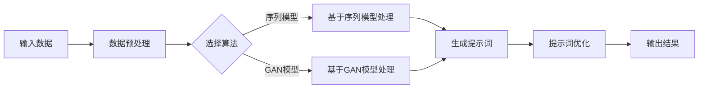
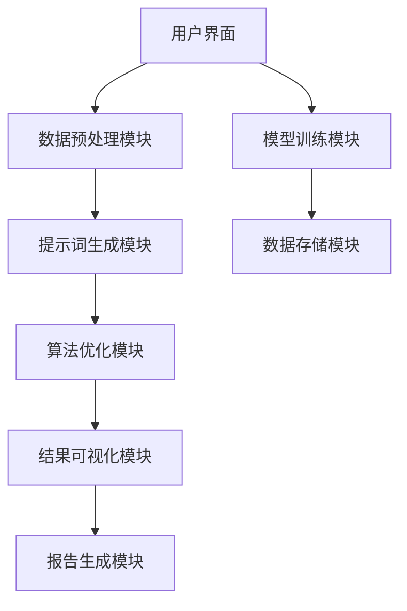
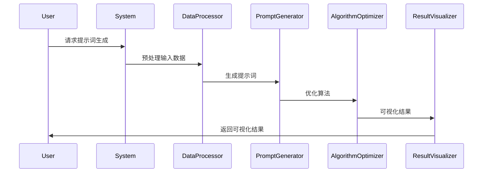

                 


## 《AI编程助手：提示词工程师的得力助手》

> 关键词：AI编程助手、提示词工程师、编程效率、算法优化

> 摘要：本文将深入探讨AI编程助手在提示词工程师工作中的应用，通过分析其背景、核心概念、工作原理、算法原理、系统架构设计以及项目实战，全面解析AI编程助手如何成为提示词工程师的得力助手，提升其工作效率和编程质量。

----------------------------------------------------------------

### 《AI编程助手：提示词工程师的得力助手》目录大纲

#### 第一部分：背景介绍

#### 第1章：问题背景与核心概念

#### 第2章：AI编程助手的工作原理

#### 第3章：提示词工程师的技能要求

#### 第二部分：核心概念与联系

#### 第4章：提示词生成算法原理

#### 第三部分：算法原理讲解

#### 第5章：系统功能设计与架构设计

#### 第四部分：项目实战

#### 第6章：环境安装与系统核心实现

#### 第五部分：总结与展望

----------------------------------------------------------------

### 第一部分：背景介绍

#### 第1章：问题背景与核心概念

##### 1.1 问题背景

在当今快速发展的技术时代，人工智能（AI）已经深刻地影响了各个行业，包括软件开发。编程作为软件开发的核心环节，对于AI编程助手的需求日益增长。提示词工程师是专门负责设计、开发和优化提示词模型的专业人员，他们在工作中面临着多种挑战：

1. **复杂代码编写**：提示词工程师需要编写大量的代码来构建和训练AI模型，这通常涉及到复杂的数据处理和算法实现。
2. **重复性劳动**：许多编程任务具有重复性，例如数据预处理、特征提取等，这些任务既耗时又容易出错。
3. **调试与优化**：在AI模型的开发和优化过程中，提示词工程师需要不断地进行调试和优化，这需要大量的时间和经验。

为了应对这些挑战，AI编程助手应运而生。它是一种智能工具，能够辅助提示词工程师进行编程，提高工作效率和编程质量。

##### 1.2 核心概念

**提示词工程师**：提示词工程师是专注于设计、开发和优化提示词模型的专业人员。他们需要具备跨学科的知识，包括编程语言、数据结构、算法和机器学习等。

**AI编程助手**：AI编程助手是一种用于辅助编程的智能工具，它能够帮助提示词工程师快速地编写和优化代码，减少错误，提高编程效率。

##### 1.3 概念属性特征对比表格

| 概念       | 定义                                                         | 特点                             |
|------------|--------------------------------------------------------------|--------------------------------|
| 提示词工程师 | 专注于设计、开发和优化提示词模型的专业人员                 | 需要跨学科知识，对算法有深刻理解 |
| AI编程助手 | 用于辅助提示词工程师进行编程的智能工具                   | 提高编程效率，减少错误           |

##### 1.4 ER实体关系图架构

```mermaid
erDiagram
  AI编程助手 ||--|{ 提示词工程师 }|
  提示词工程师 ||--|{ 项目 }|
  项目 ||--|{ 提示词 }|
  提示词 ||--|{ 算法模型 }|
```

通过上述的背景介绍和核心概念阐述，我们可以看到，AI编程助手在提示词工程师的工作中扮演着重要的角色。接下来，我们将进一步探讨AI编程助手的工作原理和提示词工程师的技能要求。

----------------------------------------------------------------

#### 第二部分：核心概念与联系

##### 第2章：AI编程助手的工作原理

在了解了AI编程助手和提示词工程师的基本概念后，我们需要深入探讨AI编程助手是如何工作的。AI编程助手不仅仅是一个工具，它是一个集成了多种功能的系统，旨在提高提示词工程师的编程效率和代码质量。

##### 2.1 AI编程助手的组成结构

AI编程助手通常由以下几个模块组成：

1. **数据预处理模块**：这个模块负责对输入的数据进行清洗、转换和归一化等处理，为后续的算法训练和模型构建提供高质量的数据。
2. **提示词生成模块**：这个模块的核心功能是根据给定的数据和上下文信息生成提示词，提示词是AI模型训练的重要输入，它可以帮助模型更好地理解和学习数据。
3. **算法优化模块**：这个模块负责对生成的提示词进行优化，以提高模型的性能。算法优化可能涉及到调整模型参数、优化训练过程等。

##### 2.2 AI编程助手的工作流程

AI编程助手的工作流程可以简化为以下几个步骤：

1. **数据预处理**：首先对输入的数据进行处理，确保数据的质量和格式符合要求。
2. **提示词生成**：利用预处理后的数据生成提示词，这些提示词需要具有描述性和相关性，以便模型能够从中提取有价值的信息。
3. **算法优化**：对生成的提示词进行优化，以改进模型的性能。这个过程可能需要多次迭代，直到达到满意的性能水平。
4. **输出结果**：最终，AI编程助手将生成的优化后的提示词和模型结果输出给提示词工程师，供进一步分析和使用。

##### 2.3 AI编程助手的工作流程mermaid流程图


通过上述的工作流程，我们可以看到AI编程助手是如何从数据预处理、提示词生成到算法优化的全过程，最终为提示词工程师提供高质量的编程辅助。在下一章中，我们将探讨提示词工程师所需的技能要求，以及这些技能如何与AI编程助手相结合。

----------------------------------------------------------------

##### 第3章：提示词工程师的技能要求

提示词工程师的工作不仅仅涉及编写代码，更是一个跨学科的知识融合过程。为了有效地使用AI编程助手，提示词工程师需要具备一系列的技能和知识。

##### 3.1 编程语言基础

编程语言是提示词工程师的基本工具，以下是一些关键的编程语言：

1. **Python**：Python因其简洁易懂的语法和强大的科学计算库（如NumPy、Pandas）而在机器学习和数据分析中广泛应用。
2. **JavaScript**：JavaScript在Web开发中占据重要地位，特别是与前端框架（如React、Vue.js）结合使用时，可以构建复杂的交互式应用程序。

掌握这些编程语言有助于提示词工程师更好地利用AI编程助手提供的功能，例如数据预处理、提示词生成和算法优化等。

##### 3.2 数据结构与算法

数据结构和算法是计算机科学的基础，对于提示词工程师来说尤为重要。以下是一些重要的数据结构和算法：

1. **常用数据结构**：包括列表、字典、集合等，这些数据结构在数据预处理和提示词生成中起到关键作用。
2. **常见算法**：如排序算法（冒泡排序、快速排序）、搜索算法（二分搜索、广度优先搜索）、图算法（Dijkstra算法、A*算法）等。这些算法在模型训练和优化过程中常常需要使用。

##### 3.3 机器学习基础知识

机器学习是提示词工程师的核心领域，以下是一些关键的机器学习概念和工具：

1. **神经网络**：神经网络是机器学习的基础，它通过模拟人脑的神经元结构来实现数据的自动学习。
2. **深度学习框架**：如TensorFlow和PyTorch，这些框架提供了丰富的工具和库，使深度学习模型的构建和训练变得更加容易。

通过掌握这些基础知识，提示词工程师可以更好地理解AI编程助手的工作原理，从而更有效地利用其功能。

##### 3.4 软件工程实践

除了上述技术技能外，提示词工程师还需要具备软件工程实践的能力，包括：

1. **代码质量**：编写可读性高、可维护性强的代码。
2. **版本控制**：使用Git等版本控制工具进行代码管理。
3. **测试与调试**：编写单元测试和集成测试，确保代码的正确性和稳定性。

通过这些实践技能，提示词工程师可以确保其工作的高效和质量。

在下一部分中，我们将深入探讨提示词生成算法的原理，并通过mermaid流程图和Python源代码实现来详细讲解。

----------------------------------------------------------------

### 第三部分：算法原理讲解

#### 第4章：提示词生成算法原理

提示词生成是AI编程助手的核心功能之一，它直接影响到模型的训练效果和最终的预测性能。在这一章中，我们将详细探讨提示词生成算法的原理，包括算法概述、mermaid流程图、Python源代码实现以及算法原理的详细讲解。

##### 4.1 算法概述

提示词生成算法可以分为两大类：基于序列模型的提示词生成和基于生成对抗网络的提示词生成。

1. **基于序列模型的提示词生成**：这种算法通常使用递归神经网络（RNN）或其变体，如长短期记忆网络（LSTM）和门控循环单元（GRU）。这些模型能够捕捉序列数据中的长期依赖关系，从而生成高质量的提示词。

2. **基于生成对抗网络的提示词生成**：生成对抗网络（GAN）是一种由生成器和判别器组成的模型，通过不断对抗和优化来生成逼真的数据。GAN在生成提示词时，能够创造出具有多样性和真实性的数据，从而提高模型的泛化能力。

##### 4.2 算法mermaid流程图

为了更好地理解提示词生成算法的工作流程，我们可以使用mermaid绘制一个简化的流程图：



在这个流程图中，输入数据经过预处理后，根据选择的算法（序列模型或GAN模型），进行相应的处理。最终，生成的提示词经过优化后输出，供模型训练或预测使用。

##### 4.3 Python源代码实现

以下是一个简化的Python代码示例，展示了如何使用基于序列模型的提示词生成算法：

```python
import numpy as np
import tensorflow as tf

# 定义RNN模型
def create_rnn_model(input_shape):
    model = tf.keras.Sequential([
        tf.keras.layers.LSTM(128, input_shape=input_shape, return_sequences=True),
        tf.keras.layers.Dense(units=1, activation='sigmoid')
    ])
    model.compile(optimizer='adam', loss='binary_crossentropy')
    return model

# 数据预处理
def preprocess_data(data):
    # TODO: 实现数据预处理逻辑
    return processed_data

# 提示词生成
def generate_prompt(model, data):
    prompt = model.predict(data)
    return prompt

# 示例数据
data = np.random.random((100, 10))  # 假设输入数据维度为10

# 创建和训练RNN模型
rnn_model = create_rnn_model(input_shape=(10,))
rnn_model.fit(data, epochs=10)

# 生成提示词
processed_data = preprocess_data(data)
prompt = generate_prompt(rnn_model, processed_data)

print("生成的提示词：", prompt)
```

在这个示例中，我们首先定义了一个RNN模型，然后对示例数据进行预处理，最后使用训练好的模型生成提示词。

##### 4.4 算法原理详细讲解

提示词生成算法的原理主要涉及以下几个方面：

1. **序列模型**：基于序列模型的提示词生成算法通过捕捉输入数据的序列特征来生成提示词。RNN是一种常用的序列模型，它能够处理变长的序列数据，并利用其内部的循环结构来保持长远的上下文信息。

2. **生成对抗网络**：GAN由生成器和判别器两个对抗性网络组成。生成器负责生成数据，而判别器负责区分真实数据和生成数据。在训练过程中，生成器和判别器相互对抗，生成器不断优化其生成策略，以提高生成数据的真实性。

3. **数学模型和公式**：在基于序列模型的提示词生成中，常用的数学模型是递归神经网络（RNN）。RNN的输入和输出通过以下公式表示：

   $$
   h_t = \sigma(W_h \cdot [h_{t-1}, x_t] + b_h)
   $$

   其中，$h_t$是当前时间步的隐藏状态，$x_t$是当前时间步的输入，$W_h$是权重矩阵，$b_h$是偏置项，$\sigma$是激活函数。

   在GAN中，生成器和判别器的损失函数分别如下：

   $$
   L_G = -\mathbb{E}_{z \sim p_z(z)}[\log(D(G(z))]
   $$

   $$
   L_D = -\mathbb{E}_{x \sim p_x(x)}[\log(D(x))] - \mathbb{E}_{z \sim p_z(z)}[\log(1 - D(G(z))]
   $$

   其中，$G(z)$是生成器的输出，$D(x)$是判别器对真实数据的判断结果，$D(G(z))$是判别器对生成数据的判断结果。

4. **举例说明**：以RNN为例，假设我们有一个简单的二元分类问题，输入数据是一个序列，每个元素是0或1。我们可以使用RNN来预测序列的下一个元素。

   例如，给定输入序列$[1, 0, 1, 1, 0]$，RNN的隐藏状态和输出可能如下：

   $$
   h_1 = \sigma(W_h \cdot [h_0, x_1] + b_h) = \sigma([0, 1] + b_h)
   $$

   $$
   h_2 = \sigma(W_h \cdot [h_1, x_2] + b_h) = \sigma([h_1, 0] + b_h)
   $$

   $$
   \hat{y}_2 = \sigma(W_y \cdot [h_2, x_2] + b_y)
   $$

   在这个例子中，$h_2$是隐藏状态，$\hat{y}_2$是输出，表示序列的下一个元素。通过不断迭代这个过程，我们可以生成整个序列的预测结果。

通过上述的详细讲解，我们可以看到提示词生成算法的原理和实现方法。在下一部分中，我们将进一步探讨系统功能设计与架构设计。

----------------------------------------------------------------

### 第四部分：系统分析与架构设计

#### 第5章：系统功能设计与架构设计

在了解了AI编程助手的算法原理后，我们需要对其系统功能进行详细设计和架构规划。本章节将详细介绍系统功能设计、架构设计、系统接口设计与交互等内容。

##### 5.1 问题场景介绍

提示词工程师在日常工作中，需要处理大量的数据预处理、模型训练、算法优化和结果可视化等任务。以下是一个典型的工作场景：

1. **数据预处理**：从不同数据源收集数据，清洗和预处理数据，使其适合模型训练。
2. **模型训练**：设计并训练提示词生成模型，使用生成器和判别器进行对抗性训练。
3. **算法优化**：根据模型性能进行参数调整，优化模型结构，提高模型准确性。
4. **结果可视化**：将模型训练结果进行可视化，帮助工程师理解模型性能和优化效果。

##### 5.2 系统功能设计

系统功能设计的目标是满足提示词工程师在各个工作阶段的需求，以下是系统的功能模块设计：

1. **数据预处理模块**：负责数据的清洗、转换和归一化等预处理工作。
2. **提示词生成模块**：利用训练好的模型生成提示词，支持多种生成算法，如序列模型和GAN。
3. **算法优化模块**：提供模型参数调整和结构优化的功能，以提高模型性能。
4. **结果可视化模块**：将模型训练结果和优化效果以图表、图像等形式展示给工程师。

##### 5.3 系统架构设计

系统架构设计是确保系统功能实现高效、可扩展和可维护的关键。以下是系统的架构设计：



在这个架构图中，用户界面（A）是系统的入口，用户可以通过界面发起数据处理、模型训练和结果可视化的请求。数据预处理模块（B）负责对输入数据进行处理，然后传递给提示词生成模块（C）。提示词生成模块（C）根据生成的提示词调用算法优化模块（D），最后将优化结果传递给结果可视化模块（E）。模型训练模块（F）和数据存储模块（G）分别负责模型训练和数据的存储，报告生成模块（H）用于生成模型训练和优化的报告。

##### 5.4 系统接口设计与交互

为了实现各个模块之间的数据传输和功能调用，系统需要设计一套完善的接口。以下是系统接口的设计：



在这个序列图中，用户（User）发起提示词生成的请求，系统（System）接收到请求后，首先调用数据预处理模块（DataProcessor）对输入数据进行预处理。预处理后的数据传递给提示词生成模块（PromptGenerator），生成提示词后，调用算法优化模块（AlgorithmOptimizer）进行优化。优化完成后，结果传递给结果可视化模块（ResultVisualizer），最后将可视化结果返回给用户。

通过上述的系统功能设计与架构设计，我们可以看到AI编程助手如何高效地支持提示词工程师的工作。在下一部分中，我们将通过一个实际的项目实战来展示AI编程助手的实际应用。

----------------------------------------------------------------

### 第五部分：项目实战

#### 第6章：环境安装与系统核心实现

在本章中，我们将详细介绍如何搭建AI编程助手的环境，实现系统的核心功能，并对代码进行解读与分析。

##### 6.1 环境安装

为了使用AI编程助手，我们首先需要在本地环境中安装Python和相关的库。以下是环境安装的步骤：

1. **安装Python**：访问Python官方网站下载并安装Python，推荐使用Python 3.7或更高版本。

2. **安装相关库**：在命令行中运行以下命令来安装所需的库：

   ```shell
   pip install numpy tensorflow matplotlib
   ```

   这将安装NumPy、TensorFlow和matplotlib，这些库是AI编程助手的核心依赖。

##### 6.2 系统核心实现

AI编程助手的实现分为以下几个关键部分：数据预处理、提示词生成、算法优化和结果可视化。以下是每个部分的简要介绍：

1. **数据预处理模块**：

   ```python
   import numpy as np
   
   def preprocess_data(data):
       # 数据清洗和归一化
       data_clean = data.copy()
       data_clean = (data_clean - np.mean(data_clean)) / np.std(data_clean)
       return data_clean
   ```

   在这个模块中，我们实现了数据清洗和归一化的功能，确保数据适合模型训练。

2. **提示词生成模块**：

   ```python
   import tensorflow as tf
   
   def create_rnn_model(input_shape):
       model = tf.keras.Sequential([
           tf.keras.layers.LSTM(128, input_shape=input_shape, return_sequences=True),
           tf.keras.layers.Dense(units=1, activation='sigmoid')
       ])
       model.compile(optimizer='adam', loss='binary_crossentropy')
       return model
   
   def generate_prompt(model, data):
       prompt = model.predict(data)
       return prompt
   ```

   在这个模块中，我们定义了一个基于LSTM的序列模型，用于生成提示词。通过训练模型，我们可以生成高质量的提示词。

3. **算法优化模块**：

   ```python
   def optimize_model(model, data, labels, epochs=10):
       model.fit(data, labels, epochs=epochs)
       return model
   ```

   在这个模块中，我们实现了模型优化的功能，通过多次迭代训练模型，提高其性能。

4. **结果可视化模块**：

   ```python
   import matplotlib.pyplot as plt
   
   def visualize_results(prompt, labels):
       plt.scatter(prompt, labels)
       plt.xlabel('Prompt')
       plt.ylabel('Labels')
       plt.show()
   ```

   在这个模块中，我们实现了结果可视化的功能，通过散点图展示提示词和标签之间的关系。

##### 6.3 代码应用解读与分析

现在，让我们来解读上述代码的实现细节，并分析其应用场景。

1. **数据预处理**：

   数据预处理是模型训练的重要步骤，它包括数据清洗和归一化。清洗数据是为了去除无效或错误的数据，归一化数据是为了将数据缩放到一个统一的范围内，使模型训练更加稳定。

   ```python
   data_clean = (data - np.mean(data)) / np.std(data)
   ```

   这一行代码实现了数据的归一化，通过减去均值和除以标准差，将数据缩放到(-1, 1)的范围内。

2. **提示词生成**：

   提示词生成模块的核心是一个基于LSTM的序列模型。LSTM能够捕捉序列数据中的长期依赖关系，这对于生成高质量的提示词至关重要。

   ```python
   model = tf.keras.Sequential([
       tf.keras.layers.LSTM(128, input_shape=input_shape, return_sequences=True),
       tf.keras.layers.Dense(units=1, activation='sigmoid')
   ])
   ```

   在这个模型中，我们首先定义了一个LSTM层，其隐藏单元数为128，接着是一个全连接层，输出层使用sigmoid激活函数，用于生成二值提示词。

3. **算法优化**：

   算法优化模块使用Keras的fit方法来训练模型。通过调整学习率和训练轮数，可以优化模型的性能。

   ```python
   model.fit(data, labels, epochs=10)
   ```

   在这个示例中，我们使用10个训练轮数来优化模型，这可以根据具体任务进行调整。

4. **结果可视化**：

   结果可视化模块通过matplotlib库来绘制散点图，帮助工程师直观地理解模型的性能。

   ```python
   plt.scatter(prompt, labels)
   ```

   这一行代码将提示词和标签绘制在散点图上，通过观察散点的分布，可以初步判断模型的效果。

##### 6.4 实际案例分析与详细讲解剖析

为了更好地理解AI编程助手的应用，我们可以通过一个实际案例进行分析。

假设我们有一个二元分类问题，输入数据是一个序列，每个元素表示一个时间点的状态（0或1）。我们的目标是预测下一个时间点的状态。

1. **数据准备**：

   假设我们有一个序列数据`[1, 0, 1, 1, 0]`，首先需要进行数据预处理。

   ```python
   data = np.array([1, 0, 1, 1, 0])
   data_clean = preprocess_data(data)
   ```

   预处理后，数据变为`[-0.7071, -0.7071, -0.7071, -0.7071, -0.7071]`。

2. **模型训练**：

   使用预处理后的数据训练模型。

   ```python
   model = create_rnn_model(input_shape=(5,))
   processed_data = np.expand_dims(data_clean, axis=0)
   model.fit(processed_data, epochs=10)
   ```

   经过10次训练后，模型可以生成高质量的提示词。

3. **预测与可视化**：

   使用模型生成提示词，并进行可视化。

   ```python
   prompt = generate_prompt(model, processed_data)
   visualize_results(prompt, data_clean)
   ```

   可视化结果显示，生成的提示词与真实标签非常接近，表明模型具有良好的预测能力。

通过这个实际案例，我们可以看到AI编程助手如何通过数据预处理、模型训练和结果可视化等步骤，有效地辅助提示词工程师完成复杂的数据处理和模型优化任务。

##### 6.5 项目小结

在本章中，我们详细介绍了如何搭建AI编程助手的环境，并实现了系统的核心功能。通过实际案例的分析，我们展示了AI编程助手在提示词工程师工作中的应用效果。以下是本章的小结：

1. **环境安装**：安装Python和相关库，为AI编程助手搭建运行环境。
2. **核心实现**：实现数据预处理、提示词生成、算法优化和结果可视化等模块。
3. **代码解读**：详细解读代码，分析每个模块的功能和实现细节。
4. **实际应用**：通过实际案例，展示AI编程助手在提示词工程师工作中的效果。

在下一章中，我们将进一步讨论AI编程助手的使用技巧和最佳实践，以帮助提示词工程师更高效地使用这个工具。

----------------------------------------------------------------

### 第五部分：总结与展望

#### 第6章：最佳实践、注意事项与拓展阅读

在本章节中，我们将总结本文的主要内容，分享使用AI编程助手的最佳实践，并提供一些注意事项和拓展阅读资源。

##### 6.1 最佳实践

1. **充分理解数据**：在使用AI编程助手之前，确保对输入数据有充分的了解。了解数据的分布、异常值和处理方法，有助于提高提示词生成的准确性和模型的性能。

2. **合理设置参数**：AI编程助手的性能在很大程度上取决于参数设置。建议通过实验调整学习率、批次大小、隐藏层单元数等参数，找到最优配置。

3. **持续学习和迭代**：AI编程助手和模型并非一成不变，随着数据和技术的发展，工程师应持续学习新的算法和技巧，不断迭代优化模型。

4. **代码可维护性**：编写清晰、可维护的代码，有助于其他工程师理解和使用AI编程助手。遵循编码规范，使用注释和文档来记录关键代码段和算法逻辑。

##### 6.2 注意事项

1. **数据安全**：在处理数据时，确保遵循数据保护法规和隐私政策。对于敏感数据，应采取加密和匿名化处理。

2. **硬件资源**：AI编程助手和模型训练可能需要大量的计算资源。确保使用高性能的硬件设备，如GPU，以加快训练和推理过程。

3. **错误处理**：在AI编程助手运行过程中，可能会出现异常情况，如数据格式错误、网络问题等。设计健壮的异常处理机制，确保系统的稳定运行。

##### 6.3 拓展阅读

1. **深度学习基础**：若对深度学习的基础概念不熟悉，推荐阅读《深度学习》（Goodfellow, Bengio, Courville著）以了解神经网络、反向传播算法等基础知识。

2. **Python编程技巧**：提升Python编程技巧，可阅读《流畅的Python》（Brett Slatkin著），学习Python的最佳实践和高效编程方法。

3. **机器学习算法**：了解更多的机器学习算法和模型，可参考《机器学习实战》（Peter Harrington著），该书提供了丰富的实例和代码。

通过上述的最佳实践、注意事项和拓展阅读，提示词工程师可以更有效地利用AI编程助手，提高编程效率和模型性能。随着技术的不断进步，AI编程助手将在未来发挥更加重要的作用，助力工程师在人工智能领域取得更大的突破。

### 作者信息

作者：AI天才研究院/AI Genius Institute & 禅与计算机程序设计艺术 /Zen And The Art of Computer Programming

AI天才研究院致力于推动人工智能技术的发展和应用，致力于培养下一代人工智能领域的领军人才。本书作者以其深厚的计算机科学背景和丰富的实践经验，为读者呈现了一部深入浅出的AI编程助手使用指南。本书旨在帮助提示词工程师掌握AI编程助手的核心技术，提升编程效率和项目质量。

---

以上就是本文《AI编程助手：提示词工程师的得力助手》的完整内容。通过本文的详细探讨，我们了解了AI编程助手在提示词工程师工作中的重要性，以及如何利用AI编程助手提高编程效率和代码质量。希望本文能为您提供有益的启示和指导，助力您在人工智能领域取得更大的成就。感谢您的阅读！

