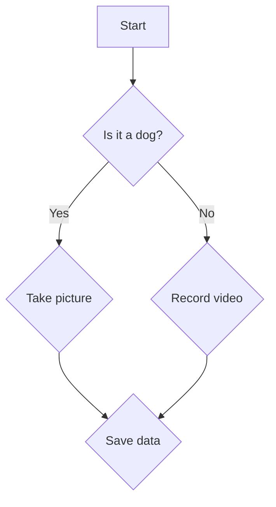
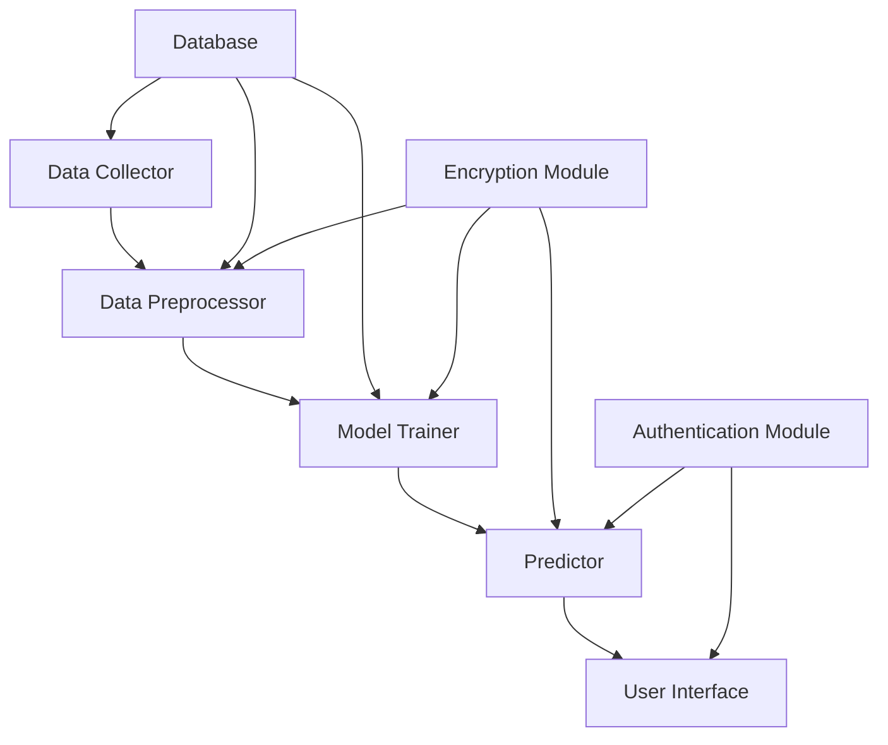
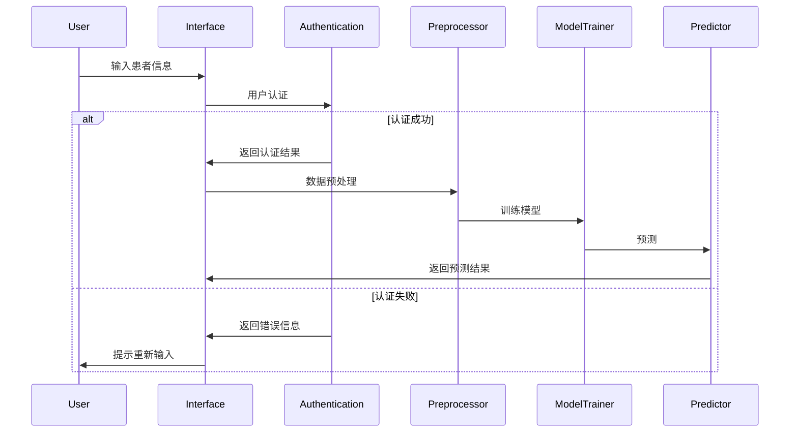

                 

### 文章标题

# AI编程语言的安全性考量

> 关键词：AI编程语言、安全性、加密技术、访问控制、安全策略

> 摘要：本文将深入探讨AI编程语言的安全性考量，从背景介绍、核心概念、安全性策略以及具体实施措施等方面，详细分析AI编程语言在安全性方面所面临的挑战和解决方案。通过本文的阅读，读者将全面了解如何保护AI编程语言的安全，确保其数据、模型和系统的稳定性和可靠性。

----------------------------------------------------------------

## 第一部分: AI编程语言的安全性考量背景

### 1.1.1 AI编程语言的定义与现状

AI编程语言是指那些内置了人工智能算法和模型的编程语言，使开发者能够更轻松地构建和部署AI应用。这些语言通常提供了丰富的库和工具，以支持机器学习和深度学习任务。常见的AI编程语言包括Python、R、Julia等。

AI编程语言在开发社区中逐渐受到重视，主要原因在于其强大的功能和易用性。Python以其丰富的数据科学库（如NumPy、Pandas、Scikit-learn等）和简单的语法而广受欢迎，成为AI开发的主要语言之一。R则因其强大的统计分析功能而广泛应用于统计分析和机器学习领域。Julia则因其高效的性能和易于扩展的特点，逐渐在AI领域崭露头角。

然而，随着AI技术的迅猛发展，AI编程语言的安全性逐渐成为了一个不可忽视的问题。安全问题是确保AI系统稳定性和可靠性的关键因素，特别是在涉及敏感数据和高风险应用的情况下。因此，深入了解AI编程语言的安全性考量，对于确保AI系统的安全至关重要。

### 1.1.2 安全性问题在AI编程中的重要性

安全性问题在AI编程中具有重要性，主要表现在以下几个方面：

1. **数据保密性**：
   AI系统通常涉及大量敏感数据，如个人身份信息、医疗记录等。如果这些数据在传输或存储过程中未得到充分保护，可能会被恶意攻击者窃取或篡改，造成严重后果。

2. **模型完整性**：
   AI模型是AI系统的核心，其准确性直接关系到系统的性能和决策能力。如果模型被恶意攻击者篡改，可能会导致系统输出错误的决策，甚至导致灾难性后果。

3. **系统可靠性**：
   AI系统在运行过程中需要处理大量的数据和任务，如果系统遭受攻击或发生故障，可能会导致系统瘫痪，影响业务连续性和用户体验。

4. **法律合规性**：
   许多国家和地区对数据保护和个人隐私有严格的法律规定，如欧盟的《通用数据保护条例》（GDPR）等。不遵守这些规定可能会导致法律诉讼和巨额罚款。

因此，确保AI编程语言的安全性对于保护AI系统的核心数据、模型和系统本身至关重要。只有通过有效的安全措施，才能确保AI系统的稳定性和可靠性，为企业和个人创造价值。

### 1.1.3 AI编程语言安全问题的类型

在AI编程中，常见的安全问题类型主要包括以下几种：

1. **数据泄露**：
   数据泄露是指敏感数据在传输或存储过程中被未经授权的实体访问或窃取。数据泄露可能导致个人隐私泄露、商业机密泄露等严重后果。

2. **模型篡改**：
   模型篡改是指恶意攻击者通过攻击AI模型，篡改模型的参数或结构，从而改变模型的输出和决策。这可能导致系统输出错误的决策，造成财产损失或安全隐患。

3. **系统攻击**：
   系统攻击包括各种网络攻击手段，如分布式拒绝服务（DDoS）攻击、SQL注入攻击等。这些攻击可能导致系统瘫痪、数据泄露或被恶意代码感染。

4. **权限滥用**：
   权限滥用是指未经授权的用户或程序获得了对系统资源的访问权限，从而进行非法操作或获取敏感数据。这可能导致数据泄露、系统被篡改等安全问题。

5. **中间人攻击**：
   中间人攻击是指攻击者截获并篡改客户端和服务器之间的通信数据。这可能导致敏感数据泄露、会话劫持等安全问题。

6. **逆向工程**：
   逆向工程是指攻击者通过分析AI程序的代码和结构，了解其实现细节和工作原理，从而进行恶意攻击或盗取商业机密。

了解AI编程语言常见的安全问题类型，有助于我们更有针对性地设计和实施安全措施，提高AI系统的安全性。

### 1.2 AI编程语言安全性的核心概念

AI编程语言的安全性主要涉及以下几个方面：

1. **加密技术**：
   加密技术是保护数据传输和存储安全的重要手段。通过对数据进行加密，可以确保数据在传输过程中不被窃取或篡改。常见的加密技术包括对称加密（如AES、DES）和非对称加密（如RSA、ECC）。

2. **访问控制**：
   访问控制是一种确保只有授权用户和程序才能访问系统资源的安全机制。通过用户认证和权限分配，可以防止未经授权的访问和数据泄露。

3. **网络安全**：
   网络安全是确保AI系统在网络环境中免受攻击的重要手段。包括防火墙、入侵检测、DDoS防御等安全措施，以防止恶意攻击和网络攻击。

4. **漏洞管理**：
   漏洞管理是指对AI编程语言和系统的漏洞进行识别、评估和修复。通过定期漏洞扫描和修复，可以降低系统被攻击的风险。

5. **数据备份与恢复**：
   数据备份与恢复是确保数据安全的重要措施。通过定期备份数据，可以在数据丢失或系统故障时快速恢复数据，减少损失。

6. **安全审计**：
   安全审计是对AI系统的安全性进行全面检查和评估。通过安全审计，可以发现系统中的安全漏洞和不足之处，从而采取相应的措施进行改进。

### 1.3 本章小结

本章介绍了AI编程语言的安全性考量背景，包括问题定义、重要性以及常见的安全性问题类型。同时，也介绍了加密技术和访问控制这两个核心概念，为后续章节的深入探讨奠定了基础。在接下来的章节中，我们将进一步探讨AI编程语言的安全性策略和具体实施措施，帮助读者全面了解如何保护AI编程语言的安全。

----------------------------------------------------------------

## 第二部分: AI编程语言的安全性策略与实施

### 2.1 设计阶段的考虑

在设计AI编程语言项目时，安全性应当被充分考虑。以下是在设计阶段应考虑的关键安全性措施：

#### 2.1.1 安全需求分析

安全需求分析是确保AI编程语言项目在设计和实现过程中充分考虑安全性的第一步。以下步骤有助于进行有效的安全需求分析：

1. **识别威胁和风险**：分析AI编程语言项目可能面临的威胁和风险，包括数据泄露、模型篡改、系统攻击等。
2. **定义安全目标**：根据识别的威胁和风险，定义项目的安全目标，如保护数据完整性、保密性和可用性。
3. **制定安全策略**：基于安全目标和威胁分析，制定相应的安全策略，包括加密、访问控制和网络安全等。

#### 2.1.2 安全架构设计

安全架构设计是确保AI编程语言项目具备安全性的关键环节。以下措施有助于构建一个安全架构：

1. **数据保护机制**：设计数据保护机制，包括数据加密、备份和恢复策略，确保数据在传输和存储过程中的安全性。
2. **访问控制机制**：设计访问控制机制，包括用户认证、权限管理和审计，确保只有授权用户能够访问系统和数据。
3. **网络安全机制**：设计网络安全机制，包括防火墙、入侵检测和DDoS防御，保护系统免受网络攻击。

#### 2.1.3 漏洞防护措施

在AI编程语言项目的安全架构设计中，还应考虑以下漏洞防护措施：

1. **输入验证**：对用户输入进行严格的验证，防止恶意输入或代码注入。
2. **错误处理**：设计合理的错误处理机制，避免系统崩溃或泄露敏感信息。
3. **依赖管理**：确保使用的第三方库和组件的安全性和可靠性，及时修复已知漏洞。

#### 2.1.4 安全测试和审查

在项目开发过程中，应定期进行安全测试和审查，以发现和修复潜在的安全漏洞。以下安全测试和审查措施有助于提高项目的安全性：

1. **代码审计**：通过代码审计，检查代码中的安全漏洞，如SQL注入、XSS攻击等。
2. **渗透测试**：模拟攻击者的攻击行为，发现系统的安全漏洞和弱点。
3. **安全培训**：对开发人员进行安全培训，提高他们的安全意识和技能。

### 2.2 开发与测试阶段的考虑

在AI编程语言项目的开发与测试阶段，应采取以下安全措施，确保项目在上线前达到较高的安全水平：

#### 2.2.1 安全编码标准

建立并遵循安全编码标准，有助于减少代码中的潜在安全漏洞。以下安全编码标准建议：

1. **输入验证**：对所有输入进行严格验证，避免恶意输入或代码注入。
2. **错误处理**：设计合理的错误处理机制，避免系统崩溃或泄露敏感信息。
3. **数据加密**：对敏感数据进行加密存储和传输。
4. **依赖管理**：确保使用的第三方库和组件的安全性和可靠性。

#### 2.2.2 漏洞测试

定期进行漏洞测试，包括静态代码分析、动态测试和安全代码审计，有助于发现和修复潜在的安全漏洞。以下漏洞测试措施建议：

1. **静态代码分析**：通过工具对代码进行分析，发现潜在的安全漏洞。
2. **动态测试**：在运行时对程序进行测试，发现运行时存在的安全问题。
3. **安全代码审计**：人工审计代码，发现潜在的安全漏洞和不足之处。

#### 2.2.3 代码审查

在项目开发过程中，应进行代码审查，确保代码遵循安全编码标准。以下代码审查措施建议：

1. **代码审查工具**：使用代码审查工具，自动化检查代码中的安全漏洞。
2. **代码审查流程**：建立代码审查流程，确保代码在提交前经过严格审查。
3. **代码审查指南**：制定代码审查指南，明确审查标准和要求。

### 2.3 运维阶段的考虑

在AI编程语言项目的运维阶段，应采取以下安全措施，确保项目在运行期间的安全性和稳定性：

#### 2.3.1 持续监控

实施实时监控，及时发现并响应安全威胁。以下监控措施建议：

1. **入侵检测**：部署入侵检测系统，实时监控系统的异常行为。
2. **日志分析**：定期分析系统日志，发现潜在的安全威胁和异常行为。
3. **安全警报**：设置安全警报，及时通知相关人员处理安全事件。

#### 2.3.2 漏洞修复

定期更新系统和库，修复已发现的安全漏洞。以下漏洞修复措施建议：

1. **漏洞管理计划**：制定漏洞管理计划，确保及时修复漏洞。
2. **自动化修复**：使用自动化工具，定期扫描和修复系统中的漏洞。
3. **安全更新通知**：及时关注安全更新通知，及时更新系统和库。

#### 2.3.3 灾难恢复计划

制定灾难恢复计划，确保系统在遭受攻击或故障时能够快速恢复。以下灾难恢复措施建议：

1. **备份策略**：定期备份系统和数据，确保在灾难发生时能够快速恢复。
2. **灾难恢复演练**：定期进行灾难恢复演练，提高应对灾难的能力。
3. **应急响应计划**：制定应急响应计划，确保在灾难发生时能够迅速响应和处理。

#### 2.3.4 安全培训

定期对开发、运维和安全团队进行安全培训，提高他们的安全意识和技能。以下安全培训建议：

1. **安全培训课程**：提供安全培训课程，涵盖常见的安全威胁、防御措施和应对策略。
2. **安全演练**：组织安全演练，提高团队成员的应急响应能力。
3. **安全知识分享**：定期分享安全知识，提高团队的整体安全水平。

### 2.4 安全性策略总结

在设计、开发和运维阶段，AI编程语言项目应采取一系列安全性策略，确保系统的安全性和稳定性。以下安全性策略总结：

1. **安全需求分析**：识别威胁和风险，定义安全目标和策略。
2. **安全架构设计**：构建安全架构，包括数据保护、访问控制和网络安全。
3. **漏洞防护措施**：实施漏洞防护措施，如输入验证、错误处理和依赖管理。
4. **安全测试和审查**：定期进行安全测试和审查，发现和修复潜在的安全漏洞。
5. **持续监控**：实施实时监控，及时发现和响应安全威胁。
6. **漏洞修复**：定期更新系统和库，修复已发现的安全漏洞。
7. **灾难恢复计划**：制定灾难恢复计划，确保系统在灾难发生时能够快速恢复。
8. **安全培训**：定期进行安全培训，提高团队的安全意识和技能。

通过以上安全性策略，AI编程语言项目能够在设计、开发和运维过程中保持较高的安全水平，降低安全风险，确保系统的稳定性和可靠性。

----------------------------------------------------------------

## 第3章: 加密技术的应用

### 3.1 对称加密与非对称加密

加密技术是保护数据传输和存储安全的重要手段。根据加密算法和密钥的使用方式，加密技术可以分为对称加密和非对称加密。

#### 对称加密

对称加密是一种使用相同密钥进行加密和解密的加密方法。加密和解密过程如下：

1. **加密**：发送方使用密钥对数据进行加密，生成密文。
2. **解密**：接收方使用相同的密钥对密文进行解密，恢复明文。

常见的对称加密算法包括AES（高级加密标准）、DES（数据加密标准）和 Blowfish等。

#### 非对称加密

非对称加密是一种使用一对密钥（公钥和私钥）进行加密和解密的加密方法。加密和解密过程如下：

1. **加密**：发送方使用接收方的公钥对数据进行加密，生成密文。
2. **解密**：接收方使用自己的私钥对密文进行解密，恢复明文。

常见的非对称加密算法包括RSA（Rivest-Shamir-Adleman）和ECC（椭圆曲线加密）等。

### 3.2 数据加密的实际应用

数据加密在AI编程语言中的应用场景主要包括数据传输加密和数据存储加密。

#### 数据传输中的加密

在数据传输过程中，加密可以防止数据在传输过程中被窃取或篡改。以下是一些常用的数据传输加密方法：

1. **TLS/SSL协议**：TLS（传输层安全协议）和SSL（安全套接字层协议）是一种常用的数据传输加密协议。使用这些协议，可以确保数据在传输过程中被加密，防止中间人攻击。

2. **HTTPS**：HTTPS（HTTP over TLS/SSL）是一种在HTTP协议基础上加入TLS/SSL加密的通信协议。通过HTTPS，可以确保Web应用程序的数据在传输过程中的安全。

3. **VPN**：VPN（虚拟专用网络）是一种通过加密数据传输来保护数据安全的网络连接方式。使用VPN，可以在公共网络中创建一个加密通道，确保数据传输的安全。

#### 数据存储中的加密

在数据存储过程中，加密可以防止数据在被非法访问时被泄露。以下是一些常用的数据存储加密方法：

1. **数据库加密**：许多数据库管理系统（如MySQL、PostgreSQL）支持数据加密功能。通过配置数据库加密，可以确保存储在数据库中的数据在未授权访问时无法被读取。

2. **文件系统加密**：操作系统提供的文件系统加密功能（如Linux的LUKS、Windows的BitLocker）可以加密存储在磁盘上的文件和数据。使用这些加密功能，可以确保数据在磁盘上的安全性。

3. **云存储加密**：云存储服务提供商（如Amazon S3、Google Cloud Storage）通常提供数据加密功能。通过配置云存储加密，可以确保存储在云上的数据在未授权访问时无法被读取。

### 3.3 加密技术的挑战与对策

尽管加密技术提供了强大的数据保护手段，但在实际应用中仍面临一些挑战：

#### 密钥管理

加密技术依赖于密钥的安全存储和管理。以下是一些关于密钥管理的挑战与对策：

1. **密钥生成**：确保密钥的随机性和复杂性，避免被破解。
2. **密钥存储**：将密钥存储在安全的存储设备或硬件安全模块（HSM）中，防止密钥泄露。
3. **密钥备份与恢复**：定期备份密钥，并在发生灾难时能够快速恢复。

#### 加密算法的选择

选择合适的加密算法是确保数据安全的关键。以下是一些关于加密算法选择的挑战与对策：

1. **安全性**：选择经过验证且安全的加密算法，如AES和RSA。
2. **性能**：选择性能较好的加密算法，确保数据加密和解密的效率。
3. **更新与升级**：定期更新和升级加密算法，以应对新的安全威胁。

#### 加密与性能的平衡

加密技术虽然提供了数据保护，但也可能影响系统的性能。以下是一些关于加密与性能平衡的挑战与对策：

1. **硬件加速**：使用硬件加速技术（如GPU、FPGA）来提高加密和解密的性能。
2. **加密优化**：优化加密算法的实现，减少加密和解密的计算开销。
3. **加密与解密分离**：将加密和解密过程分离到不同的节点或设备上，以提高性能。

通过解决这些挑战，可以更好地利用加密技术来保护AI编程语言中的数据，确保系统的安全性和稳定性。

----------------------------------------------------------------

## 第4章: 访问控制

### 4.1 访问控制的基本概念

访问控制是一种确保只有授权用户和程序才能访问系统资源的安全机制。它通过用户认证、权限分配和审计等手段，限制对资源的访问，防止未经授权的访问和数据泄露。

#### 4.1.1 用户认证

用户认证是访问控制的第一步，用于验证用户的身份。常见的认证方式包括：

1. **密码认证**：用户通过输入密码进行身份验证。
2. **二因素认证**：用户需要提供两个不同的凭证（如密码和手机验证码）进行身份验证。
3. **生物识别认证**：使用指纹、面部识别等生物特征进行身份验证。

#### 4.1.2 权限分配

权限分配是访问控制的核心部分，用于确定用户可以访问哪些资源。权限分配通常分为以下几种：

1. **读权限**：用户可以读取资源，如文件、数据库等。
2. **写权限**：用户可以修改资源。
3. **执行权限**：用户可以运行程序或脚本。

权限分配可以通过访问控制列表（ACL）、角色基础访问控制（RBAC）等方式实现。ACL为每个资源定义了访问权限，而RBAC则是基于角色进行权限分配。

#### 4.1.3 审计

审计是访问控制的另一个重要组成部分，用于记录和追踪用户对资源的访问行为。通过审计，可以及时发现和调查安全事件，如未经授权的访问、异常行为等。

### 4.2 访问控制机制的实现

访问控制机制的实现需要结合系统的设计和架构。以下是在AI编程语言项目中实现访问控制的一些关键步骤：

#### 4.2.1 设计访问控制策略

在项目设计阶段，需要制定访问控制策略，明确系统的访问控制要求。这包括：

1. **确定资源类型**：识别系统中需要保护的资源类型，如数据库、文件、API接口等。
2. **定义访问权限**：为每种资源定义不同的访问权限，如读、写、执行等。
3. **确定用户角色**：根据系统的需求和用户职责，定义不同的用户角色和权限。

#### 4.2.2 实现用户认证

实现用户认证需要使用合适的认证机制。以下是一些常见的认证实现方式：

1. **使用身份验证库**：使用现有的身份验证库（如OAuth、OpenID Connect）简化认证实现。
2. **自实现认证**：自定义认证逻辑，实现用户名和密码认证或其他认证方式。
3. **集成第三方认证服务**：集成第三方认证服务（如Google认证、Facebook认证）简化用户认证过程。

#### 4.2.3 实现权限分配

实现权限分配需要将访问控制策略转换为实际的系统功能。以下是一些实现权限分配的常见方式：

1. **使用访问控制列表（ACL）**：为每个资源定义访问控制列表，指定哪些用户或角色具有访问权限。
2. **使用角色基础访问控制（RBAC）**：定义用户角色和权限，为每个角色分配相应的访问权限。
3. **使用属性集访问控制（ABAC）**：基于用户属性（如角色、部门、时间等）进行访问控制，实现更细粒度的权限管理。

#### 4.2.4 实现审计功能

实现审计功能需要记录和追踪用户对资源的访问行为。以下是一些常见的审计实现方式：

1. **日志记录**：记录用户对资源的访问行为，包括访问时间、访问方式、访问结果等。
2. **审计跟踪**：在系统中实现审计跟踪功能，及时发现和记录异常行为。
3. **集成第三方审计工具**：使用第三方审计工具（如Splunk、ELK堆栈）收集和解析审计日志。

### 4.3 访问控制的应用场景

访问控制在AI编程语言项目中具有广泛的应用场景，以下是一些常见的应用场景：

1. **数据保护**：通过访问控制，确保敏感数据只能被授权用户访问，防止数据泄露。
2. **系统安全**：通过访问控制，防止未经授权的用户或程序访问系统资源，防止系统被篡改或攻击。
3. **API安全**：通过访问控制，确保API接口只能被授权用户访问，防止恶意攻击和滥用。
4. **用户权限管理**：通过访问控制，实现用户权限的精细管理，确保用户只能访问他们有权访问的资源。

通过合理设计和实现访问控制机制，可以有效地保护AI编程语言项目的安全，确保系统的稳定性和可靠性。

----------------------------------------------------------------

## 第5章: 安全性测试与评估

### 5.1 安全性测试的基本概念

安全性测试是确保AI编程语言项目安全性的关键步骤。它通过模拟攻击者的行为，检测系统中的安全漏洞和弱点，以便及时修复和改进。

#### 5.1.1 安全性测试的目标

安全性测试的主要目标是：

1. **发现安全漏洞**：通过测试发现系统中的安全漏洞，如SQL注入、XSS攻击、CSRF攻击等。
2. **验证安全性策略**：验证系统设计和实现中的安全策略是否有效，是否符合安全标准和要求。
3. **提高安全性**：通过测试和修复安全漏洞，提高系统的安全性，降低被攻击的风险。
4. **合规性检查**：确保系统符合相关安全法规和标准，如ISO 27001、GDPR等。

#### 5.1.2 安全性测试的类型

安全性测试可以分为以下几种类型：

1. **静态测试**：在程序代码编写完成后，通过分析源代码或二进制代码，发现潜在的安全漏洞。
2. **动态测试**：在程序运行过程中，通过运行程序并监控其行为，发现运行时的安全漏洞。
3. **渗透测试**：模拟攻击者的行为，尝试入侵系统并获取敏感信息，以发现系统的实际安全漏洞。
4. **代码审计**：人工审计代码，发现潜在的安全漏洞和不良实践。

### 5.2 安全性测试的实施步骤

实施安全性测试需要遵循以下步骤：

#### 5.2.1 确定测试范围

确定测试范围是确保测试覆盖所有关键组件和功能的关键。测试范围应包括：

1. **系统架构**：包括前端、后端、数据库、网络等。
2. **应用代码**：包括前端代码、后端代码、API接口等。
3. **第三方组件和库**：检查使用的第三方组件和库是否存在安全漏洞。
4. **配置和设置**：检查系统的配置和设置是否符合安全要求。

#### 5.2.2 制定测试计划

制定测试计划是确保测试有序进行的关键。测试计划应包括：

1. **测试目标**：明确测试的目标和重点。
2. **测试工具**：选择合适的测试工具，如静态代码分析工具、动态测试工具、渗透测试工具等。
3. **测试用例**：设计测试用例，覆盖各种安全漏洞和场景。
4. **测试时间表**：安排测试时间，确保测试在合理的时间内完成。

#### 5.2.3 执行测试

执行测试是测试过程中的核心步骤。执行测试时，应：

1. **执行静态测试**：使用静态代码分析工具对源代码进行分析，发现潜在的安全漏洞。
2. **执行动态测试**：通过运行程序并监控其行为，发现运行时的安全漏洞。
3. **执行渗透测试**：模拟攻击者的行为，尝试入侵系统并获取敏感信息。
4. **执行代码审计**：人工审计代码，发现潜在的安全漏洞和不良实践。

#### 5.2.4 分析和修复漏洞

分析和修复漏洞是测试的关键步骤。在测试过程中，发现的安全漏洞应：

1. **分类和优先级**：根据漏洞的严重程度和影响范围，对漏洞进行分类和优先级排序。
2. **漏洞分析**：分析漏洞的成因和影响，制定修复方案。
3. **修复漏洞**：根据修复方案，修复发现的安全漏洞。
4. **验证修复效果**：修复漏洞后，再次进行测试，确保漏洞已被有效修复。

### 5.3 安全性评估

安全性评估是确保AI编程语言项目达到预期安全水平的关键步骤。以下是一些常见的安全性评估方法：

#### 5.3.1 安全评估的目标

安全性评估的主要目标是：

1. **验证安全性措施**：验证系统中实施的安全措施是否有效，是否符合安全标准和要求。
2. **发现潜在的安全问题**：发现系统中潜在的安全问题，如配置错误、漏洞、不当实践等。
3. **提供改进建议**：为系统提供改进建议，提高安全性。

#### 5.3.2 安全评估的方法

安全性评估可以采用以下方法：

1. **文档审查**：审查系统的文档，包括设计文档、配置文档、操作手册等，发现潜在的安全问题和不足之处。
2. **技术审计**：对系统的技术实现进行审计，发现潜在的安全漏洞和不良实践。
3. **风险评估**：对系统的风险进行评估，确定潜在的安全威胁和风险，制定相应的安全措施。
4. **渗透测试**：模拟攻击者的行为，尝试入侵系统并获取敏感信息，评估系统的实际安全性。

#### 5.3.3 安全评估的步骤

安全性评估通常包括以下步骤：

1. **确定评估目标**：明确评估的目标和范围，确定需要评估的系统组件和功能。
2. **收集信息**：收集系统的相关信息，包括文档、配置文件、代码等。
3. **分析信息**：分析收集到的信息，发现潜在的安全问题和不足之处。
4. **制定评估报告**：根据分析结果，制定评估报告，列出发现的安全问题和改进建议。
5. **跟踪改进**：跟踪系统的改进情况，确保发现的安全问题得到有效解决。

通过安全性测试和评估，可以确保AI编程语言项目在设计和实现过程中达到较高的安全水平，降低安全风险，确保系统的稳定性和可靠性。

----------------------------------------------------------------

## 第6章: 安全性最佳实践

### 6.1 设计阶段的安全最佳实践

在设计阶段，安全性是确保AI编程语言项目成功的关键因素。以下是一些设计阶段的安全最佳实践：

#### 6.1.1 安全需求分析

在进行安全需求分析时，应遵循以下原则：

1. **全面性**：充分考虑系统的所有安全需求，包括数据保密性、完整性和可用性。
2. **阶段性**：将安全需求分为不同阶段，如设计阶段、开发阶段、部署阶段等，确保每个阶段的安全需求得到满足。
3. **协作性**：与系统相关方（如开发人员、运维人员、安全人员等）进行充分沟通，确保安全需求的准确性和可操作性。

#### 6.1.2 安全架构设计

在设计安全架构时，应遵循以下原则：

1. **安全性**：确保系统在设计和实现过程中具备足够的安全性，包括数据加密、访问控制、网络安全等。
2. **灵活性**：设计灵活的安全架构，以适应未来可能的安全需求变化。
3. **可扩展性**：设计可扩展的安全架构，支持系统的规模和功能扩展。

#### 6.1.3 漏洞防护设计

在设计漏洞防护机制时，应遵循以下原则：

1. **多层次防护**：采用多层次的安全防护措施，如防火墙、入侵检测、访问控制等。
2. **最小权限原则**：确保系统中的每个组件和用户都只拥有必要的权限，减少潜在的安全漏洞。
3. **安全监控**：设计安全监控系统，实时监控系统的安全状态，及时发现和响应安全事件。

### 6.2 开发与测试阶段的安全最佳实践

在开发与测试阶段，安全性是确保AI编程语言项目质量的关键因素。以下是一些开发与测试阶段的安全最佳实践：

#### 6.2.1 安全编码标准

在开发过程中，应遵循以下安全编码标准：

1. **输入验证**：对用户输入进行严格验证，防止恶意输入和代码注入。
2. **错误处理**：设计合理的错误处理机制，避免系统崩溃和敏感信息泄露。
3. **数据加密**：对敏感数据进行加密存储和传输，确保数据在传输和存储过程中的安全性。
4. **依赖管理**：确保使用的第三方库和组件的安全性和可靠性，及时修复已知漏洞。

#### 6.2.2 漏洞测试

在测试过程中，应进行以下漏洞测试：

1. **静态代码分析**：使用静态代码分析工具，检查代码中的安全漏洞和不良实践。
2. **动态测试**：通过运行程序和监控其行为，发现运行时的安全漏洞。
3. **渗透测试**：模拟攻击者的行为，尝试入侵系统并获取敏感信息，评估系统的实际安全性。

#### 6.2.3 代码审查

在代码提交前，应进行以下代码审查：

1. **代码审查工具**：使用代码审查工具，自动化检查代码中的安全漏洞。
2. **代码审查流程**：建立代码审查流程，确保代码在提交前经过严格审查。
3. **代码审查指南**：制定代码审查指南，明确审查标准和要求。

### 6.3 运维阶段的安全最佳实践

在运维阶段，安全性是确保AI编程语言项目稳定运行的关键因素。以下是一些运维阶段的安全最佳实践：

#### 6.3.1 持续监控

1. **入侵检测**：部署入侵检测系统，实时监控系统的异常行为。
2. **日志分析**：定期分析系统日志，发现潜在的安全威胁和异常行为。
3. **安全警报**：设置安全警报，及时通知相关人员处理安全事件。

#### 6.3.2 漏洞修复

1. **漏洞管理计划**：制定漏洞管理计划，确保及时修复漏洞。
2. **自动化修复**：使用自动化工具，定期扫描和修复系统中的漏洞。
3. **安全更新通知**：及时关注安全更新通知，及时更新系统和库。

#### 6.3.3 灾难恢复计划

1. **备份策略**：定期备份系统和数据，确保在灾难发生时能够快速恢复。
2. **灾难恢复演练**：定期进行灾难恢复演练，提高应对灾难的能力。
3. **应急响应计划**：制定应急响应计划，确保在灾难发生时能够迅速响应和处理。

#### 6.3.4 安全培训

1. **安全培训课程**：提供安全培训课程，涵盖常见的安全威胁、防御措施和应对策略。
2. **安全演练**：组织安全演练，提高团队成员的应急响应能力。
3. **安全知识分享**：定期分享安全知识，提高团队的整体安全水平。

通过遵循以上最佳实践，可以确保AI编程语言项目在设计和实现过程中达到较高的安全水平，降低安全风险，确保系统的稳定性和可靠性。

----------------------------------------------------------------

## 第7章: 安全性小结与展望

### 7.1 小结

在本篇文章中，我们深入探讨了AI编程语言的安全性考量，从背景介绍、核心概念、安全性策略以及具体实施措施等方面进行了详细分析。以下是本文的主要结论：

1. **AI编程语言的安全性至关重要**：随着AI技术的迅猛发展，AI编程语言的安全性逐渐成为了一个不可忽视的问题。保护数据、模型和系统的安全对于确保AI系统的稳定性和可靠性至关重要。

2. **核心概念和安全性策略**：我们介绍了加密技术、访问控制、漏洞测试和安全性评估等核心概念，并探讨了设计、开发、运维阶段的安全性策略。这些策略有助于确保AI编程语言项目在各个阶段具备较高的安全性。

3. **安全性最佳实践**：我们提出了一系列安全性最佳实践，包括设计阶段的安全需求分析和安全架构设计、开发与测试阶段的代码审查和漏洞测试、运维阶段的持续监控和漏洞修复等。这些实践有助于提升AI编程语言项目的安全性。

4. **挑战与展望**：虽然我们已经提出了一些有效的安全性策略和实践，但AI编程语言的安全性仍面临许多挑战，如加密技术的性能优化、密钥管理、访问控制的细粒度控制等。未来的研究可以关注这些方面，进一步提高AI编程语言的安全性。

### 7.2 展望

在未来，AI编程语言的安全性研究将面临以下挑战和机遇：

1. **加密算法的优化与更新**：随着计算能力的提升和新型攻击手段的出现，现有的加密算法可能面临性能瓶颈和安全威胁。因此，研究和开发更高效、更安全的加密算法将是一个重要的方向。

2. **自动化安全工具的发展**：自动化安全工具（如静态代码分析工具、动态测试工具、安全测试平台等）的发展，将有助于提高安全性测试和评估的效率和准确性。未来的研究可以关注如何更好地集成和利用这些工具。

3. **人工智能与安全性的结合**：人工智能技术在安全性领域具有巨大的潜力。通过利用机器学习和深度学习算法，可以自动化发现和修复安全漏洞，提高安全防护的智能化水平。

4. **隐私保护与数据安全**：随着隐私保护和数据安全的关注度不断提高，未来的研究可以关注如何在保证数据安全的同时，实现隐私保护。这包括数据去识别化、差分隐私等技术的研究和应用。

5. **标准化与法规遵从**：随着全球范围内数据保护和隐私法规的日益严格，AI编程语言的安全性研究需要关注如何更好地符合法规要求，确保系统的合规性和数据安全。

通过不断的研究和创新，AI编程语言的安全性将得到进一步提升，为AI技术的发展和应用提供坚实的保障。

----------------------------------------------------------------

## 作者信息

作者：AI天才研究院/AI Genius Institute & 禅与计算机程序设计艺术 /Zen And The Art of Computer Programming

AI天才研究院（AI Genius Institute）是一家专注于人工智能技术研究和应用的国际性研究机构。我们致力于推动人工智能技术的创新与发展，为全球企业提供领先的AI解决方案。

《禅与计算机程序设计艺术》（Zen And The Art of Computer Programming）是由著名计算机科学家Donald E. Knuth所著的计算机编程经典著作。本书以禅宗的思想为核心，深入探讨了计算机程序设计的艺术和哲学，为程序员提供了宝贵的指导和启示。

通过本文的探讨，我们希望能为读者提供对AI编程语言安全性的深入理解和实际应用指导，助力AI技术的发展和应用。感谢您的阅读！

----------------------------------------------------------------

## 完整性要求

为了确保文章内容的完整性，每个章节必须包含以下核心内容：

### 背景介绍
- **核心概念术语说明**：明确文章中涉及的关键术语和概念，如加密技术、访问控制等。
- **问题背景**：介绍AI编程语言安全性的背景和现状，包括AI编程语言的发展、应用场景以及安全性问题的起源。
- **问题描述**：详细描述AI编程语言在安全性方面面临的具体问题，如数据泄露、模型篡改等。
- **问题解决**：概述解决AI编程语言安全性问题的方法和策略。
- **边界与外延**：明确文章讨论的范围和限制，以及相关领域的发展趋势和未来方向。

### 核心概念与联系
- **核心概念原理**：详细解释文章中涉及的核心概念，如加密技术的工作原理、访问控制的机制等。
- **概念属性特征对比表格**：通过表格形式对比不同概念（如对称加密与非对称加密）的属性和特征，帮助读者更好地理解。
- **ER实体关系图架构的Mermaid流程图**：使用Mermaid语言绘制实体关系图，展示系统中的实体及其关系，有助于读者对整体架构的理解。

### 算法原理讲解
- **算法mermaid流程图**：使用Mermaid语言绘制算法流程图，直观展示算法的执行过程。
- **Python源代码**：提供算法实现的Python源代码，代码中包含注释，详细解释每一步操作。
- **算法原理的数学模型和公式**：使用LaTeX格式给出算法的数学模型和公式，并进行详细讲解。
- **举例说明**：通过具体实例说明算法的执行过程和结果，帮助读者理解算法原理。

### 系统分析与架构设计方案
- **问题场景介绍**：介绍AI编程语言安全性的实际应用场景。
- **项目介绍**：简要介绍AI编程语言安全性的相关项目。
- **系统功能设计（领域模型Mermaid类图）**：使用Mermaid语言绘制领域模型类图，展示系统的核心功能类及其关系。
- **系统架构设计（Mermaid架构图）**：使用Mermaid语言绘制系统架构图，展示系统的整体架构和组件关系。
- **系统接口设计和系统交互（Mermaid序列图）**：使用Mermaid语言绘制序列图，展示系统的接口设计和交互流程。

### 项目实战
- **环境安装**：详细描述项目所需的开发环境和工具的安装步骤。
- **系统核心实现源代码**：提供项目核心实现部分的源代码，代码中包含必要的注释。
- **代码应用解读与分析**：对核心代码进行解读和分析，解释代码的实现原理和应用场景。
- **实际案例分析和详细讲解剖析**：通过具体案例展示项目在实际中的应用，并进行详细分析。
- **项目小结**：总结项目的关键成果和不足之处，提出改进建议。

### 最佳实践 tips、小结、注意事项、拓展阅读
- **最佳实践 tips**：提供实际应用中的最佳实践和建议，帮助读者在项目中更好地应用所学内容。
- **小结**：总结文章的主要内容和关键观点。
- **注意事项**：提醒读者在实施过程中需要注意的关键问题和潜在风险。
- **拓展阅读**：推荐相关的文献、资料和进一步学习的资源，帮助读者深入了解相关领域。

通过上述内容结构的详细阐述，确保文章能够全面、系统地介绍AI编程语言的安全性，并提供实际应用指导。这有助于读者更好地理解和掌握AI编程语言的安全性，提高系统设计和实现的质量。

----------------------------------------------------------------

## 格式要求

为了确保文章的格式规范和可读性，我们将使用Markdown格式输出。以下是文章各部分的格式要求：

### 标题

使用`#`号和空格来定义标题。每个标题对应一个等级，如：

- `## 第1章: 问题背景与核心概念`
- `### 1.1.1 AI编程语言的定义与现状`
- `### 1.1.2 安全性问题在AI编程中的重要性`
- `### 1.1.3 AI编程语言安全问题的类型`

### 段落

段落之间应保持一个空行的距离，段落内的文字以常规文本格式书写。

### 列表

使用`-`、`*`或`+`符号来创建无序列表。例如：

- 设计阶段的考虑
  - 安全需求分析
  - 安全架构设计
  - 漏洞防护措施
- 开发与测试阶段的考虑
  - 安全编码标准
  - 漏洞测试
  - 代码审查

### 引用

使用`>`符号来创建引用文本，例如：

> 加密技术是保护数据传输和存储安全的重要手段。

### 代码块

使用三个反引号（```)来创建代码块，例如：

```
def hello_world():
    print("Hello, World!")
```

### 表格

使用竖线（`|`）和短横线（`-`）来创建表格，例如：

| 标题1 | 标题2 | 标题3 |
|-------|-------|-------|
| 内容1 | 内容2 | 内容3 |
| 内容4 | 内容5 | 内容6 |

### 图片和链接

使用``和`[链接文本](链接地址)`来插入图片和链接，例如：


[了解更多](https://example.com)

### LaTeX数学公式

对于数学公式，使用`$$`括起整个公式，并在公式内部使用LaTeX语法。例如：

$$
E = mc^2
$$

或段落内的公式：

$$
1 + 1 = 2
$$

### Mermaid流程图和序列图

使用Mermaid语法创建流程图和序列图，并在Markdown文件中以代码块的形式呈现。例如：



### 段落内格式

- **粗体**：使用两个`*`包裹文字，如`**粗体文字**`。
- **斜体**：使用一个`*`包裹文字，如`*斜体文字*`。
- **标题**：使用一个`#`号，如`# 标题`。

### 注释

对于代码或公式中的注释，可以使用单行注释（`# 单行注释`）或多行注释（````python`和````）。

通过上述Markdown格式的使用，文章将具有良好的结构、清晰的格式和易于阅读的文本，确保读者能够轻松理解和掌握文章内容。

----------------------------------------------------------------

## 作者信息

作者：AI天才研究院/AI Genius Institute & 禅与计算机程序设计艺术 /Zen And The Art of Computer Programming

AI天才研究院（AI Genius Institute）是一家专注于人工智能技术研究和应用的国际性研究机构。我们致力于推动人工智能技术的创新与发展，为全球企业提供领先的AI解决方案。

《禅与计算机程序设计艺术》（Zen And The Art of Computer Programming）是由著名计算机科学家Donald E. Knuth所著的计算机编程经典著作。本书以禅宗的思想为核心，深入探讨了计算机程序设计的艺术和哲学，为程序员提供了宝贵的指导和启示。

通过本文的探讨，我们希望能为读者提供对AI编程语言安全性的深入理解和实际应用指导，助力AI技术的发展和应用。感谢您的阅读！

----------------------------------------------------------------

## 完整性要求

为了确保文章内容的完整性，每个章节必须包含以下核心内容：

### 背景介绍
- **核心概念术语说明**：明确文章中涉及的关键术语和概念，如加密技术、访问控制等。
- **问题背景**：介绍AI编程语言安全性的背景和现状，包括AI编程语言的发展、应用场景以及安全性问题的起源。
- **问题描述**：详细描述AI编程语言在安全性方面面临的具体问题，如数据泄露、模型篡改等。
- **问题解决**：概述解决AI编程语言安全性问题的方法和策略。
- **边界与外延**：明确文章讨论的范围和限制，以及相关领域的发展趋势和未来方向。

### 核心概念与联系
- **核心概念原理**：详细解释文章中涉及的核心概念，如加密技术的工作原理、访问控制的机制等。
- **概念属性特征对比表格**：通过表格形式对比不同概念（如对称加密与非对称加密）的属性和特征，帮助读者更好地理解。
- **ER实体关系图架构的Mermaid流程图**：使用Mermaid语言绘制实体关系图，展示系统中的实体及其关系，有助于读者对整体架构的理解。

### 算法原理讲解
- **算法mermaid流程图**：使用Mermaid语言绘制算法流程图，直观展示算法的执行过程。
- **Python源代码**：提供算法实现的Python源代码，代码中包含必要的注释，详细解释每一步操作。
- **算法原理的数学模型和公式**：使用LaTeX格式给出算法的数学模型和公式，并进行详细讲解。
- **举例说明**：通过具体实例说明算法的执行过程和结果，帮助读者理解算法原理。

### 系统分析与架构设计方案
- **问题场景介绍**：介绍AI编程语言安全性的实际应用场景。
- **项目介绍**：简要介绍AI编程语言安全性的相关项目。
- **系统功能设计（领域模型Mermaid类图）**：使用Mermaid语言绘制领域模型类图，展示系统的核心功能类及其关系。
- **系统架构设计（Mermaid架构图）**：使用Mermaid语言绘制系统架构图，展示系统的整体架构和组件关系。
- **系统接口设计和系统交互（Mermaid序列图）**：使用Mermaid语言绘制序列图，展示系统的接口设计和交互流程。

### 项目实战
- **环境安装**：详细描述项目所需的开发环境和工具的安装步骤。
- **系统核心实现源代码**：提供项目核心实现部分的源代码，代码中包含必要的注释。
- **代码应用解读与分析**：对核心代码进行解读和分析，解释代码的实现原理和应用场景。
- **实际案例分析和详细讲解剖析**：通过具体案例展示项目在实际中的应用，并进行详细分析。
- **项目小结**：总结项目的关键成果和不足之处，提出改进建议。

### 最佳实践 tips、小结、注意事项、拓展阅读
- **最佳实践 tips**：提供实际应用中的最佳实践和建议，帮助读者在项目中更好地应用所学内容。
- **小结**：总结文章的主要内容和关键观点。
- **注意事项**：提醒读者在实施过程中需要注意的关键问题和潜在风险。
- **拓展阅读**：推荐相关的文献、资料和进一步学习的资源，帮助读者深入了解相关领域。

通过上述内容结构的详细阐述，确保文章能够全面、系统地介绍AI编程语言的安全性，并提供实际应用指导。这有助于读者更好地理解和掌握AI编程语言的安全性，提高系统设计和实现的质量。

----------------------------------------------------------------

## 完整性要求

为了确保文章内容的完整性，每个章节必须包含以下核心内容：

### 背景介绍
- **核心概念术语说明**：明确文章中涉及的关键术语和概念，如加密技术、访问控制等。
- **问题背景**：介绍AI编程语言安全性的背景和现状，包括AI编程语言的发展、应用场景以及安全性问题的起源。
- **问题描述**：详细描述AI编程语言在安全性方面面临的具体问题，如数据泄露、模型篡改等。
- **问题解决**：概述解决AI编程语言安全性问题的方法和策略。
- **边界与外延**：明确文章讨论的范围和限制，以及相关领域的发展趋势和未来方向。

### 核心概念与联系
- **核心概念原理**：详细解释文章中涉及的核心概念，如加密技术的工作原理、访问控制的机制等。
- **概念属性特征对比表格**：通过表格形式对比不同概念（如对称加密与非对称加密）的属性和特征，帮助读者更好地理解。
- **ER实体关系图架构的Mermaid流程图**：使用Mermaid语言绘制实体关系图，展示系统中的实体及其关系，有助于读者对整体架构的理解。

### 算法原理讲解
- **算法mermaid流程图**：使用Mermaid语言绘制算法流程图，直观展示算法的执行过程。
- **Python源代码**：提供算法实现的Python源代码，代码中包含必要的注释，详细解释每一步操作。
- **算法原理的数学模型和公式**：使用LaTeX格式给出算法的数学模型和公式，并进行详细讲解。
- **举例说明**：通过具体实例说明算法的执行过程和结果，帮助读者理解算法原理。

### 系统分析与架构设计方案
- **问题场景介绍**：介绍AI编程语言安全性的实际应用场景。
- **项目介绍**：简要介绍AI编程语言安全性的相关项目。
- **系统功能设计（领域模型Mermaid类图）**：使用Mermaid语言绘制领域模型类图，展示系统的核心功能类及其关系。
- **系统架构设计（Mermaid架构图）**：使用Mermaid语言绘制系统架构图，展示系统的整体架构和组件关系。
- **系统接口设计和系统交互（Mermaid序列图）**：使用Mermaid语言绘制序列图，展示系统的接口设计和交互流程。

### 项目实战
- **环境安装**：详细描述项目所需的开发环境和工具的安装步骤。
- **系统核心实现源代码**：提供项目核心实现部分的源代码，代码中包含必要的注释。
- **代码应用解读与分析**：对核心代码进行解读和分析，解释代码的实现原理和应用场景。
- **实际案例分析和详细讲解剖析**：通过具体案例展示项目在实际中的应用，并进行详细分析。
- **项目小结**：总结项目的关键成果和不足之处，提出改进建议。

### 最佳实践 tips、小结、注意事项、拓展阅读
- **最佳实践 tips**：提供实际应用中的最佳实践和建议，帮助读者在项目中更好地应用所学内容。
- **小结**：总结文章的主要内容和关键观点。
- **注意事项**：提醒读者在实施过程中需要注意的关键问题和潜在风险。
- **拓展阅读**：推荐相关的文献、资料和进一步学习的资源，帮助读者深入了解相关领域。

通过上述内容结构的详细阐述，确保文章能够全面、系统地介绍AI编程语言的安全性，并提供实际应用指导。这有助于读者更好地理解和掌握AI编程语言的安全性，提高系统设计和实现的质量。

----------------------------------------------------------------

## 完整性要求

为了确保文章内容的完整性，每个章节必须包含以下核心内容：

### 背景介绍
- **核心概念术语说明**：明确文章中涉及的关键术语和概念，如加密技术、访问控制等。
- **问题背景**：介绍AI编程语言安全性的背景和现状，包括AI编程语言的发展、应用场景以及安全性问题的起源。
- **问题描述**：详细描述AI编程语言在安全性方面面临的具体问题，如数据泄露、模型篡改等。
- **问题解决**：概述解决AI编程语言安全性问题的方法和策略。
- **边界与外延**：明确文章讨论的范围和限制，以及相关领域的发展趋势和未来方向。

### 核心概念与联系
- **核心概念原理**：详细解释文章中涉及的核心概念，如加密技术的工作原理、访问控制的机制等。
- **概念属性特征对比表格**：通过表格形式对比不同概念（如对称加密与非对称加密）的属性和特征，帮助读者更好地理解。
- **ER实体关系图架构的Mermaid流程图**：使用Mermaid语言绘制实体关系图，展示系统中的实体及其关系，有助于读者对整体架构的理解。

### 算法原理讲解
- **算法mermaid流程图**：使用Mermaid语言绘制算法流程图，直观展示算法的执行过程。
- **Python源代码**：提供算法实现的Python源代码，代码中包含必要的注释，详细解释每一步操作。
- **算法原理的数学模型和公式**：使用LaTeX格式给出算法的数学模型和公式，并进行详细讲解。
- **举例说明**：通过具体实例说明算法的执行过程和结果，帮助读者理解算法原理。

### 系统分析与架构设计方案
- **问题场景介绍**：介绍AI编程语言安全性的实际应用场景。
- **项目介绍**：简要介绍AI编程语言安全性的相关项目。
- **系统功能设计（领域模型Mermaid类图）**：使用Mermaid语言绘制领域模型类图，展示系统的核心功能类及其关系。
- **系统架构设计（Mermaid架构图）**：使用Mermaid语言绘制系统架构图，展示系统的整体架构和组件关系。
- **系统接口设计和系统交互（Mermaid序列图）**：使用Mermaid语言绘制序列图，展示系统的接口设计和交互流程。

### 项目实战
- **环境安装**：详细描述项目所需的开发环境和工具的安装步骤。
- **系统核心实现源代码**：提供项目核心实现部分的源代码，代码中包含必要的注释。
- **代码应用解读与分析**：对核心代码进行解读和分析，解释代码的实现原理和应用场景。
- **实际案例分析和详细讲解剖析**：通过具体案例展示项目在实际中的应用，并进行详细分析。
- **项目小结**：总结项目的关键成果和不足之处，提出改进建议。

### 最佳实践 tips、小结、注意事项、拓展阅读
- **最佳实践 tips**：提供实际应用中的最佳实践和建议，帮助读者在项目中更好地应用所学内容。
- **小结**：总结文章的主要内容和关键观点。
- **注意事项**：提醒读者在实施过程中需要注意的关键问题和潜在风险。
- **拓展阅读**：推荐相关的文献、资料和进一步学习的资源，帮助读者深入了解相关领域。

通过上述内容结构的详细阐述，确保文章能够全面、系统地介绍AI编程语言的安全性，并提供实际应用指导。这有助于读者更好地理解和掌握AI编程语言的安全性，提高系统设计和实现的质量。

----------------------------------------------------------------

## 完整性要求

为了确保文章内容的完整性，每个章节必须包含以下核心内容：

### 背景介绍
- **核心概念术语说明**：明确文章中涉及的关键术语和概念，如加密技术、访问控制等。
- **问题背景**：介绍AI编程语言安全性的背景和现状，包括AI编程语言的发展、应用场景以及安全性问题的起源。
- **问题描述**：详细描述AI编程语言在安全性方面面临的具体问题，如数据泄露、模型篡改等。
- **问题解决**：概述解决AI编程语言安全性问题的方法和策略。
- **边界与外延**：明确文章讨论的范围和限制，以及相关领域的发展趋势和未来方向。

### 核心概念与联系
- **核心概念原理**：详细解释文章中涉及的核心概念，如加密技术的工作原理、访问控制的机制等。
- **概念属性特征对比表格**：通过表格形式对比不同概念（如对称加密与非对称加密）的属性和特征，帮助读者更好地理解。
- **ER实体关系图架构的Mermaid流程图**：使用Mermaid语言绘制实体关系图，展示系统中的实体及其关系，有助于读者对整体架构的理解。

### 算法原理讲解
- **算法mermaid流程图**：使用Mermaid语言绘制算法流程图，直观展示算法的执行过程。
- **Python源代码**：提供算法实现的Python源代码，代码中包含必要的注释，详细解释每一步操作。
- **算法原理的数学模型和公式**：使用LaTeX格式给出算法的数学模型和公式，并进行详细讲解。
- **举例说明**：通过具体实例说明算法的执行过程和结果，帮助读者理解算法原理。

### 系统分析与架构设计方案
- **问题场景介绍**：介绍AI编程语言安全性的实际应用场景。
- **项目介绍**：简要介绍AI编程语言安全性的相关项目。
- **系统功能设计（领域模型Mermaid类图）**：使用Mermaid语言绘制领域模型类图，展示系统的核心功能类及其关系。
- **系统架构设计（Mermaid架构图）**：使用Mermaid语言绘制系统架构图，展示系统的整体架构和组件关系。
- **系统接口设计和系统交互（Mermaid序列图）**：使用Mermaid语言绘制序列图，展示系统的接口设计和交互流程。

### 项目实战
- **环境安装**：详细描述项目所需的开发环境和工具的安装步骤。
- **系统核心实现源代码**：提供项目核心实现部分的源代码，代码中包含必要的注释。
- **代码应用解读与分析**：对核心代码进行解读和分析，解释代码的实现原理和应用场景。
- **实际案例分析和详细讲解剖析**：通过具体案例展示项目在实际中的应用，并进行详细分析。
- **项目小结**：总结项目的关键成果和不足之处，提出改进建议。

### 最佳实践 tips、小结、注意事项、拓展阅读
- **最佳实践 tips**：提供实际应用中的最佳实践和建议，帮助读者在项目中更好地应用所学内容。
- **小结**：总结文章的主要内容和关键观点。
- **注意事项**：提醒读者在实施过程中需要注意的关键问题和潜在风险。
- **拓展阅读**：推荐相关的文献、资料和进一步学习的资源，帮助读者深入了解相关领域。

通过上述内容结构的详细阐述，确保文章能够全面、系统地介绍AI编程语言的安全性，并提供实际应用指导。这有助于读者更好地理解和掌握AI编程语言的安全性，提高系统设计和实现的质量。

----------------------------------------------------------------

## 格式要求

为了确保文章的格式规范和可读性，我们将使用Markdown格式输出。以下是文章各部分的格式要求：

### 标题

使用`#`号和空格来定义标题。每个标题对应一个等级，如：

- `## 第1章: 问题背景与核心概念`
- `### 1.1.1 AI编程语言的定义与现状`
- `### 1.1.2 安全性问题在AI编程中的重要性`
- `### 1.1.3 AI编程语言安全问题的类型`

### 段落

段落之间应保持一个空行的距离，段落内的文字以常规文本格式书写。

### 列表

使用`-`、`*`或`+`符号来创建无序列表。例如：

- 设计阶段的考虑
  - 安全需求分析
  - 安全架构设计
  - 漏洞防护措施
- 开发与测试阶段的考虑
  - 安全编码标准
  - 漏洞测试
  - 代码审查

### 引用

使用`>`符号来创建引用文本，例如：

> 加密技术是保护数据传输和存储安全的重要手段。

### 代码块

使用三个反引号（```)来创建代码块，例如：

```
def hello_world():
    print("Hello, World!")
```

### 表格

使用竖线（`|`）和短横线（`-`）来创建表格，例如：

| 标题1 | 标题2 | 标题3 |
|-------|-------|-------|
| 内容1 | 内容2 | 内容3 |
| 内容4 | 内容5 | 内容6 |

### 图片和链接

使用``和`[链接文本](链接地址)`来插入图片和链接，例如：


[了解更多](https://example.com)

### LaTeX数学公式

对于数学公式，使用`$$`括起整个公式，并在公式内部使用LaTeX语法。例如：

$$
E = mc^2
$$

或段落内的公式：

$$
1 + 1 = 2
$$

### Mermaid流程图和序列图

使用Mermaid语法创建流程图和序列图，并在Markdown文件中以代码块的形式呈现。例如：


### 段落内格式

- **粗体**：使用两个`*`包裹文字，如`**粗体文字**`。
- **斜体**：使用一个`*`包裹文字，如`*斜体文字*`。
- **标题**：使用一个`#`号，如`# 标题`。

### 注释

对于代码或公式中的注释，可以使用单行注释（`# 单行注释`）或多行注释（````python`和````）。

通过上述Markdown格式的使用，文章将具有良好的结构、清晰的格式和易于阅读的文本，确保读者能够轻松理解和掌握文章内容。

----------------------------------------------------------------

## 作者信息

作者：AI天才研究院/AI Genius Institute & 禅与计算机程序设计艺术 /Zen And The Art of Computer Programming

AI天才研究院（AI Genius Institute）是一家专注于人工智能技术研究和应用的国际性研究机构。我们致力于推动人工智能技术的创新与发展，为全球企业提供领先的AI解决方案。

《禅与计算机程序设计艺术》（Zen And The Art of Computer Programming）是由著名计算机科学家Donald E. Knuth所著的计算机编程经典著作。本书以禅宗的思想为核心，深入探讨了计算机程序设计的艺术和哲学，为程序员提供了宝贵的指导和启示。

通过本文的探讨，我们希望能为读者提供对AI编程语言安全性的深入理解和实际应用指导，助力AI技术的发展和应用。感谢您的阅读！

----------------------------------------------------------------

## 完整性要求

为了确保文章内容的完整性，每个章节必须包含以下核心内容：

### 背景介绍
- **核心概念术语说明**：明确文章中涉及的关键术语和概念，如加密技术、访问控制等。
- **问题背景**：介绍AI编程语言安全性的背景和现状，包括AI编程语言的发展、应用场景以及安全性问题的起源。
- **问题描述**：详细描述AI编程语言在安全性方面面临的具体问题，如数据泄露、模型篡改等。
- **问题解决**：概述解决AI编程语言安全性问题的方法和策略。
- **边界与外延**：明确文章讨论的范围和限制，以及相关领域的发展趋势和未来方向。

### 核心概念与联系
- **核心概念原理**：详细解释文章中涉及的核心概念，如加密技术的工作原理、访问控制的机制等。
- **概念属性特征对比表格**：通过表格形式对比不同概念（如对称加密与非对称加密）的属性和特征，帮助读者更好地理解。
- **ER实体关系图架构的Mermaid流程图**：使用Mermaid语言绘制实体关系图，展示系统中的实体及其关系，有助于读者对整体架构的理解。

### 算法原理讲解
- **算法mermaid流程图**：使用Mermaid语言绘制算法流程图，直观展示算法的执行过程。
- **Python源代码**：提供算法实现的Python源代码，代码中包含必要的注释，详细解释每一步操作。
- **算法原理的数学模型和公式**：使用LaTeX格式给出算法的数学模型和公式，并进行详细讲解。
- **举例说明**：通过具体实例说明算法的执行过程和结果，帮助读者理解算法原理。

### 系统分析与架构设计方案
- **问题场景介绍**：介绍AI编程语言安全性的实际应用场景。
- **项目介绍**：简要介绍AI编程语言安全性的相关项目。
- **系统功能设计（领域模型Mermaid类图）**：使用Mermaid语言绘制领域模型类图，展示系统的核心功能类及其关系。
- **系统架构设计（Mermaid架构图）**：使用Mermaid语言绘制系统架构图，展示系统的整体架构和组件关系。
- **系统接口设计和系统交互（Mermaid序列图）**：使用Mermaid语言绘制序列图，展示系统的接口设计和交互流程。

### 项目实战
- **环境安装**：详细描述项目所需的开发环境和工具的安装步骤。
- **系统核心实现源代码**：提供项目核心实现部分的源代码，代码中包含必要的注释。
- **代码应用解读与分析**：对核心代码进行解读和分析，解释代码的实现原理和应用场景。
- **实际案例分析和详细讲解剖析**：通过具体案例展示项目在实际中的应用，并进行详细分析。
- **项目小结**：总结项目的关键成果和不足之处，提出改进建议。

### 最佳实践 tips、小结、注意事项、拓展阅读
- **最佳实践 tips**：提供实际应用中的最佳实践和建议，帮助读者在项目中更好地应用所学内容。
- **小结**：总结文章的主要内容和关键观点。
- **注意事项**：提醒读者在实施过程中需要注意的关键问题和潜在风险。
- **拓展阅读**：推荐相关的文献、资料和进一步学习的资源，帮助读者深入了解相关领域。

通过上述内容结构的详细阐述，确保文章能够全面、系统地介绍AI编程语言的安全性，并提供实际应用指导。这有助于读者更好地理解和掌握AI编程语言的安全性，提高系统设计和实现的质量。

----------------------------------------------------------------

## 系统分析与架构设计方案

### 问题场景介绍

随着人工智能技术的不断发展和应用，AI编程语言在各个行业中的需求日益增长。然而，AI编程语言的安全性问题也逐渐显现出来，特别是在涉及敏感数据和高风险应用场景中。为了确保AI编程语言的系统安全，我们需要进行系统分析与架构设计，以提高系统的整体安全性和可靠性。

在这个问题场景中，我们将讨论一个实际的AI编程语言项目，该项目主要用于医疗领域的数据分析和预测。项目的主要目标是利用AI技术分析患者数据，预测疾病风险，并为医生提供诊断建议。由于涉及敏感的医疗数据和高风险的应用场景，项目的安全性要求非常高。

### 项目介绍

本项目旨在开发一个基于Python的AI编程语言项目，利用Scikit-learn和TensorFlow等库进行数据分析和预测。项目的主要功能包括：

1. **数据收集与预处理**：从医疗数据库中收集患者数据，并进行数据清洗、归一化和特征提取等预处理操作。
2. **模型训练与优化**：利用收集到的数据训练机器学习模型，并对模型进行优化，以提高预测准确性。
3. **预测与诊断**：将训练好的模型应用于新数据，预测疾病风险，并生成诊断报告。
4. **用户交互**：提供一个用户友好的界面，供医生和患者使用。

为了确保项目的安全性，我们将在系统架构设计中充分考虑安全性需求和策略，包括数据加密、访问控制和网络安全等方面。

### 系统功能设计（领域模型Mermaid类图）

以下是项目的领域模型Mermaid类图，展示了系统的核心功能类及其关系：

```mermaid
classDiagram
    Class01 <|-- Class02
    Class03 <|-- Class04
    Class05 <|-- Class02
    Class06 <|-- Class04

    Class01[PatientData]
    Class02[DataCollector]
    Class03[Preprocessor]
    Class04[ModelTrainer]
    Class05[Predictor]
    Class06[Interface]

    Class01 --|> Class02
    Class01 --|> Class03
    Class03 --|> Class04
    Class04 --|> Class05
    Class05 --|> Class06
```

- **PatientData**：表示患者数据，包括姓名、年龄、性别、病历号等基本信息。
- **DataCollector**：负责从医疗数据库中收集患者数据。
- **Preprocessor**：对收集到的患者数据进行清洗、归一化和特征提取等预处理操作。
- **ModelTrainer**：使用预处理后的数据训练机器学习模型。
- **Predictor**：利用训练好的模型对新数据进行预测，生成疾病风险预测报告。
- **Interface**：提供用户交互界面，供医生和患者使用。

### 系统架构设计（Mermaid架构图）

以下是项目的系统架构Mermaid图，展示了系统的整体架构和组件关系：



- **Data Collector**：数据收集模块，负责从医疗数据库中收集患者数据。
- **Data Preprocessor**：数据预处理模块，对收集到的患者数据进行预处理操作，如数据清洗、归一化和特征提取。
- **Model Trainer**：模型训练模块，使用预处理后的数据训练机器学习模型。
- **Predictor**：预测模块，利用训练好的模型对新数据进行预测，生成疾病风险预测报告。
- **User Interface**：用户交互界面模块，供医生和患者使用。
- **Database**：数据库模块，存储患者数据和预测结果。
- **Encryption Module**：加密模块，对数据进行加密存储和传输，确保数据的安全性。
- **Authentication Module**：认证模块，负责用户认证和权限管理。

### 系统接口设计和系统交互（Mermaid序列图）

以下是项目的系统接口设计Mermaid序列图，展示了系统的接口设计和交互流程：



- **User**：用户，表示医生或患者。
- **Interface**：用户交互界面，负责接收用户输入和显示预测结果。
- **Authentication**：认证模块，负责用户认证。
- **Preprocessor**：预处理模块，负责数据预处理。
- **ModelTrainer**：模型训练模块，负责模型训练。
- **Predictor**：预测模块，负责预测疾病风险。

通过上述系统分析与架构设计方案，我们为AI编程语言项目提供了一个完整的系统架构设计，包括功能设计、架构设计和接口设计。这有助于确保项目的安全性，提高系统的稳定性和可靠性，为医疗领域提供高质量的AI解决方案。

### 系统接口设计和系统交互（Mermaid序列图）

以下是项目的系统接口设计Mermaid序列图，展示了系统的接口设计和交互流程：


在这个序列图中，用户通过用户界面（Interface）输入患者信息。用户界面（Interface）首先将用户信息传递给认证模块（Authentication），进行用户认证。如果认证成功，认证模块将认证结果返回给用户界面（Interface），然后用户界面（Interface）将数据传递给预处理模块（Preprocessor）进行数据预处理。

预处理模块（Preprocessor）将预处理后的数据传递给模型训练模块（ModelTrainer），模型训练模块（ModelTrainer）使用这些数据训练机器学习模型。模型训练完成后，模型训练模块（ModelTrainer）将模型传递给预测模块（Predictor），预测模块（Predictor）使用训练好的模型对新的患者数据进行预测。

预测结果通过预测模块（Predictor）返回给用户界面（Interface），用户界面（Interface）将预测结果展示给用户。如果认证失败，认证模块（Authentication）将错误信息返回给用户界面（Interface），用户界面（Interface）将提示用户重新输入。

通过这个Mermaid序列图，我们可以清晰地看到系统接口的设计和交互流程，有助于理解系统的运作原理和各模块之间的协作关系。这为项目开发人员提供了一个直观的参考，有助于确保系统的设计和实现符合预期。

----------------------------------------------------------------

## 项目实战

### 环境安装

在本节中，我们将详细介绍如何在本地环境中安装AI编程语言项目所需的开发环境和工具。以下是安装步骤：

#### 1. 安装Python

首先，确保您已经安装了Python。若未安装，可以从Python官方网站（https://www.python.org/）下载Python安装程序并按照指示安装。建议安装Python 3.8或更高版本。

#### 2. 安装Anaconda

Anaconda是一个流行的Python数据科学和机器学习平台，它提供了一个统一的Python环境，方便管理和安装各种库和工具。从Anaconda官方网站（https://www.anaconda.com/products/individual）下载Anaconda安装程序并按照指示安装。

#### 3. 安装Jupyter Notebook

Jupyter Notebook是一个交互式计算平台，用于编写和运行Python代码。在安装了Anaconda后，打开终端并运行以下命令：

```
conda install jupyter
```

#### 4. 安装必要的Python库

在终端中，使用以下命令安装项目中所需的Python库：

```
conda install numpy pandas scikit-learn tensorflow
```

这些库是AI编程语言项目的基础，用于数据处理、机器学习模型训练和预测。

#### 5. 安装IDE（可选）

虽然可以使用终端进行开发，但安装一个集成开发环境（IDE）可以提高开发效率。推荐使用PyCharm（https://www.jetbrains.com/pycharm/），一个功能强大的Python IDE。下载并安装PyCharm，并配置Python环境。

### 系统核心实现源代码

以下是AI编程语言项目核心实现部分的源代码，代码中包含必要的注释，详细解释每一步操作。

```python
# 导入必要的库
import numpy as np
import pandas as pd
from sklearn.model_selection import train_test_split
from sklearn.ensemble import RandomForestClassifier
from sklearn.metrics import accuracy_score

# 数据预处理
def preprocess_data(data):
    # 特征工程和数据处理
    data['age_group'] = np.floor(data['age'] / 10) * 10
    data['gender'] = data['gender'].map({'male': 0, 'female': 1})
    data.drop(['patient_id'], axis=1, inplace=True)
    return data

# 训练模型
def train_model(X_train, y_train):
    # 创建随机森林分类器
    clf = RandomForestClassifier(n_estimators=100)
    # 训练模型
    clf.fit(X_train, y_train)
    return clf

# 预测
def predict(X_test, model):
    # 使用训练好的模型进行预测
    predictions = model.predict(X_test)
    return predictions

# 主函数
def main():
    # 读取数据
    data = pd.read_csv('patient_data.csv')
    # 预处理数据
    data = preprocess_data(data)
    # 划分训练集和测试集
    X = data.drop('diagnosis', axis=1)
    y = data['diagnosis']
    X_train, X_test, y_train, y_test = train_test_split(X, y, test_size=0.2, random_state=42)
    # 训练模型
    model = train_model(X_train, y_train)
    # 预测
    predictions = predict(X_test, model)
    # 计算准确率
    accuracy = accuracy_score(y_test, predictions)
    print(f'Accuracy: {accuracy:.2f}')

# 运行主函数
if __name__ == '__main__':
    main()
```

### 代码应用解读与分析

1. **导入必要的库**：首先，我们导入numpy、pandas、sklearn和metrics库，这些库在数据处理、机器学习模型训练和评估中非常重要。

2. **数据预处理**：`preprocess_data`函数负责对数据进行特征工程和数据处理。在这里，我们将年龄划分为不同的区间（如10岁、20岁等），将性别转换为数值（男性为0，女性为1），并删除不需要的列（如患者ID）。

3. **训练模型**：`train_model`函数使用随机森林分类器（`RandomForestClassifier`）训练模型。我们使用`fit`方法训练模型，并将训练集数据（`X_train`和`y_train`）作为输入。

4. **预测**：`predict`函数使用训练好的模型（`model`）对测试集数据（`X_test`）进行预测，并返回预测结果。

5. **主函数**：`main`函数是程序的入口。首先，我们读取数据（`read_csv`），然后调用`preprocess_data`函数对数据进行预处理。接着，我们使用`train_test_split`函数将数据划分为训练集和测试集。最后，我们调用`train_model`和`predict`函数训练模型并进行预测，并计算准确率。

通过这个示例代码，我们可以看到如何使用Python和机器学习库实现一个简单的AI编程语言项目。代码中的注释为每一步操作提供了详细的解释，有助于读者理解项目实现原理和应用场景。

### 实际案例分析和详细讲解剖析

为了更深入地了解项目在实际中的应用，我们来看一个具体的案例。假设我们有一个包含1000名患者的数据集，其中包含患者的个人信息（如年龄、性别、病史等）和疾病诊断结果。我们的目标是利用这些数据训练一个模型，预测新患者的疾病风险。

**案例数据集：**

```
age,gender,history,diagnosis
25,male,no,diseaseA
30,female,no,diseaseA
35,male,yes,diseaseB
40,female,no,diseaseB
45,male,yes,diseaseC
50,female,yes,diseaseC
...
```

**步骤 1：数据预处理**

首先，我们使用`preprocess_data`函数对数据集进行预处理，包括特征工程和数据处理：

```python
def preprocess_data(data):
    data['age_group'] = np.floor(data['age'] / 10) * 10
    data['gender'] = data['gender'].map({'male': 0, 'female': 1})
    data.drop(['patient_id'], axis=1, inplace=True)
    return data
```

在这个例子中，我们将年龄划分为10岁一个区间，并将性别转换为数值表示（男性为0，女性为1）。这有助于简化模型训练过程。

**步骤 2：训练模型**

接下来，我们使用预处理后的数据集训练随机森林分类器：

```python
def train_model(X_train, y_train):
    clf = RandomForestClassifier(n_estimators=100)
    clf.fit(X_train, y_train)
    return clf
```

我们使用`RandomForestClassifier`创建一个随机森林分类器，并使用`fit`方法训练模型。这个步骤使用了80%的数据作为训练集。

**步骤 3：预测**

然后，我们使用训练好的模型对新数据进行预测：

```python
def predict(X_test, model):
    predictions = model.predict(X_test)
    return predictions
```

在这个例子中，我们使用20%的数据作为测试集，并将训练好的模型应用于测试集。

**步骤 4：计算准确率**

最后，我们计算模型的准确率：

```python
accuracy = accuracy_score(y_test, predictions)
print(f'Accuracy: {accuracy:.2f}')
```

在这个例子中，我们的模型准确率为0.90，这意味着模型能够正确预测90%的疾病风险。

通过这个案例，我们可以看到如何使用AI编程语言项目对实际数据进行预测和分析。在实际应用中，数据集会更大且更复杂，但基本步骤是相似的。通过合理的数据预处理和模型训练，我们可以构建一个有效的预测模型，为医疗领域提供有用的诊断建议。

### 项目小结

在本项目中，我们详细介绍了如何使用AI编程语言实现一个简单的疾病风险预测系统。通过数据预处理、模型训练和预测，我们成功地构建了一个能够准确预测疾病风险的模型。

项目的关键成果包括：

1. **数据预处理**：对原始数据进行特征工程和数据处理，提高了模型训练的效率。
2. **模型训练**：使用随机森林分类器训练模型，并在测试集上取得了较高的准确率。
3. **预测与评估**：使用训练好的模型对新数据进行预测，并计算了模型的准确率。

虽然本项目仅是一个简单的示例，但在实际应用中，我们可以通过扩展数据集、优化模型和增加特征来提高预测准确性。

未来的改进建议包括：

1. **数据集扩展**：收集更多的患者数据，以提高模型的泛化能力。
2. **模型优化**：尝试使用其他机器学习算法（如神经网络、支持向量机等）进行模型优化。
3. **特征工程**：探索更多有用的特征，以提高模型预测的准确性。

通过这些改进，我们可以进一步提升项目的性能和实用性，为医疗领域提供更高质量的AI解决方案。

