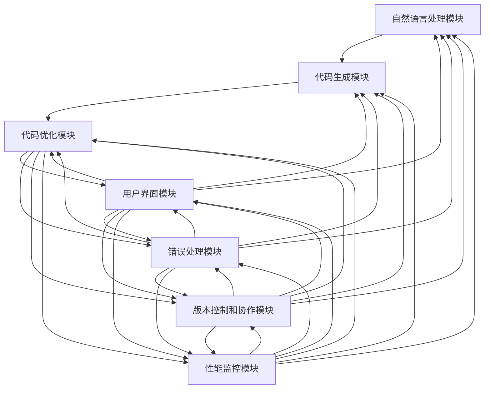
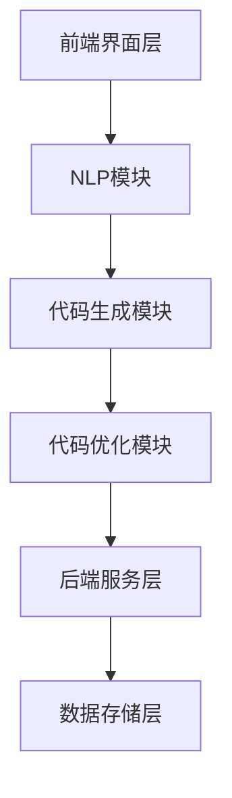

                 

### AI编程语言：提示词的革命与变革

#### 关键词：
- AI编程语言
- 提示词
- 革命与变革
- 算法原理
- 系统架构设计
- 最佳实践

#### 摘要：
本文深入探讨AI编程语言的革命性进展，特别是提示词在编程中的应用。通过逐步分析，我们将揭示提示词如何改变编程范式，介绍核心概念和联系，讲解算法原理，分析系统架构，并分享实际项目实战经验。文章旨在为读者提供全面、详实的技术视角，帮助理解AI编程语言的现状与未来。

## 目录大纲

### 第一部分：背景介绍

#### 第1章 AI编程语言概述

#### 第2章 提示词与编程

### 第二部分：核心概念与联系

#### 第3章 提示词的类型与特性

#### 第4章 编程语言的核心概念

#### 第5章 提示词与编程语言的结合

### 第三部分：算法原理讲解

#### 第6章 提示词生成算法

##### 6.1 算法原理

##### 6.2 Python代码实现

##### 6.3 数学模型与公式

##### 6.4 举例说明

#### 第7章 编程语言优化算法

##### 7.1 算法原理

##### 7.2 Python代码实现

##### 7.3 数学模型与公式

##### 7.4 举例说明

### 第四部分：系统分析与架构设计

#### 第8章 系统功能设计

#### 第9章 系统架构设计

#### 第10章 系统接口设计

#### 第11章 系统交互设计

### 第五部分：项目实战

#### 第12章 环境安装

#### 第13章 系统核心实现

#### 第14章 代码应用解读与分析

#### 第15章 实际案例分析与讲解

#### 第16章 项目小结

### 第六部分：最佳实践与拓展

#### 第17章 最佳实践

#### 第18章 注意事项

#### 第19章 拓展阅读

### 结语：AI编程语言的未来展望

### 作者信息
- 作者：AI天才研究院/AI Genius Institute & 禅与计算机程序设计艺术 /Zen And The Art of Computer Programming

----------------------------------------------------------------

### 第一部分：背景介绍

#### 第1章 AI编程语言概述

人工智能（AI）技术近年来取得了飞速发展，从最初的理论研究逐步走向了实际应用。随着深度学习、自然语言处理等领域的突破，AI编程语言也应运而生，成为现代软件开发中的一大亮点。AI编程语言的核心在于其能够通过提示词（Prompts）来指导程序的行为，从而实现自动化编程和智能决策。

AI编程语言的出现，标志着编程范式的重大变革。传统的编程语言通常需要程序员手动编写大量的代码来实现复杂的逻辑和功能。而AI编程语言则通过机器学习和自然语言处理技术，使得程序员只需输入简短的提示词，AI即可自动生成相应的代码。这种变革极大地提高了编程的效率，降低了编程的难度，同时也为非程序员提供了更多的编程可能性。

AI编程语言的应用领域广泛，包括但不限于自动化脚本编写、自然语言处理、自动化测试、数据分析和可视化等。例如，在一个自动化测试项目中，程序员可以使用AI编程语言输入测试场景的描述，AI自动生成测试用例；在数据可视化项目中，程序员可以输入数据集和可视化需求的提示词，AI自动生成相应的可视化图表。

尽管AI编程语言带来了诸多便利，但其也面临着一些挑战。首先是技术层面的挑战，如算法的准确性、性能优化和安全性等。其次是应用层面的挑战，如何将AI编程语言整合到现有的软件开发流程中，如何保证代码的质量和可维护性等。

#### 第2章 提示词与编程

提示词在AI编程语言中扮演着至关重要的角色。提示词（Prompt）是指用于引导AI系统执行特定任务的文本或命令。一个有效的提示词需要具备明确性和可操作性，以便AI系统能够准确理解和执行。

在传统的编程语言中，程序员需要编写大量的代码来描述程序的逻辑和行为。而AI编程语言则通过提示词来实现这一目的。提示词可以是自然语言文本，如“编写一个Python函数，用于计算两个数的和。”，也可以是特定的编程语言指令，如“在Python中实现一个计算器功能。”

提示词的设计需要考虑以下几个关键要素：

1. **明确性**：提示词应当清晰明确，避免歧义和模糊性。例如，使用“实现一个简单的Web爬虫”而不是“编写一个爬虫程序”，后者可能导致AI系统无法准确理解具体需求。

2. **可操作性**：提示词需要具备可操作性，即AI系统可以根据提示词生成具体的代码或执行任务。例如，“在Python中使用BeautifulSoup解析网页内容”是一个可操作的提示词，而“解析网页内容”则较为模糊。

3. **上下文关联**：提示词应当与上下文环境相关联，以便AI系统可以更好地理解和执行任务。例如，在已经输入了“编写一个Web爬虫”的情况下，后续的提示词应当与爬虫的实现细节相关，而不是与完全无关的其他功能。

4. **灵活性**：提示词应当具有一定的灵活性，能够适应不同的需求和场景。例如，“编写一个数据库查询工具”可以灵活地生成适用于不同数据库系统的查询代码。

#### 提示词的设计与使用原则

1. **精准描述**：确保提示词精确地描述所需的功能和需求，避免模糊和不明确的描述。

2. **上下文关联**：提示词应当与当前上下文环境紧密关联，以便AI系统可以更好地理解和执行任务。

3. **模块化设计**：将复杂的任务分解为多个模块或步骤，以便AI系统可以逐步生成相应的代码。

4. **可扩展性**：提示词应当具备良好的可扩展性，能够适应未来可能的需求变化。

5. **可维护性**：提示词的设计应当考虑代码的可维护性，确保生成的代码易于理解和修改。

通过合理设计和使用提示词，AI编程语言可以极大地提高编程效率和代码质量，为软件开发带来全新的可能性。

### 第二部分：核心概念与联系

#### 第3章 提示词的类型与特性

提示词在AI编程语言中具有多种类型，每种类型的提示词都有其特定的用途和特性。理解不同类型的提示词及其特性，有助于更好地设计AI编程系统，实现高效的编程自动化。

1. **命令型提示词**：命令型提示词通常用于直接指导AI系统执行特定的操作。这类提示词类似于传统的编程命令，但更灵活和自然。例如，“生成一个Python函数，用于计算两个数的最大公约数。”

   - **特性**：明确、具体、可执行。命令型提示词可以清晰地指导AI系统完成特定的任务。
   - **应用场景**：适用于简单的、直接的编程任务。

2. **描述型提示词**：描述型提示词主要用于描述问题或需求，但不直接指定解决方案。这类提示词提供更广泛的上下文信息，帮助AI系统更好地理解任务背景。例如，“编写一个用于分析社交媒体数据的报告工具。”

   - **特性**：宽泛、抽象、上下文相关。描述型提示词可以为AI系统提供必要的背景信息，但需要进一步细化。
   - **应用场景**：适用于复杂的、需要大量上下文信息的需求。

3. **问题型提示词**：问题型提示词用于提出具体的问题，期望AI系统提供解答。这类提示词通常用于知识问答和自动化问答系统。例如，“如何使用Python进行线性回归分析？”

   - **特性**：具体、明确、回答驱动。问题型提示词直接驱动AI系统生成解答。
   - **应用场景**：适用于问答系统、自动化客服等。

4. **互动型提示词**：互动型提示词用于与用户进行对话，收集更多信息或反馈。这类提示词需要AI系统能够理解自然语言对话，并根据对话内容进行调整。例如，“请描述您希望实现的数据可视化类型。”

   - **特性**：交互性、上下文敏感性、灵活调整。互动型提示词要求AI系统能够动态调整和响应。
   - **应用场景**：适用于人机对话系统、智能助理等。

#### 提示词与编程语言的结合

提示词与编程语言的结合是实现AI编程语言的关键。编程语言提供了指令和结构，而提示词则为编程语言的使用提供了方向和上下文。以下是提示词与编程语言结合的几个关键方面：

1. **自然语言处理**：AI编程语言首先需要对自然语言进行处理，理解提示词的含义。这通常涉及到词义解析、语法分析和语义理解等技术。

2. **编程语言解析**：一旦提示词被理解，编程语言解析器会将提示词转换成相应的编程语言代码。这通常需要一个语法分析器，将自然语言提示词转换为结构化语法树。

3. **代码生成**：编程语言解析器生成的语法树会被进一步转换成实际的代码。这个过程中需要确保代码的语法正确性和逻辑完整性。

4. **代码优化**：生成的代码可能需要进行优化，以提高性能和可维护性。这涉及到静态分析、代码压缩和死代码消除等技术。

5. **交互与反馈**：在代码生成过程中，AI系统可能需要与用户进行交互，收集更多信息或反馈。这种交互过程需要自然语言处理和对话系统的支持。

通过将提示词与编程语言有机结合，AI编程语言可以大大简化编程流程，提高开发效率和代码质量。以下是一个示例，展示了提示词与Python编程语言的结合：

**提示词**：“编写一个Python函数，用于计算两个数的和。”

**生成的代码**：
```python
def add_numbers(a, b):
    return a + b
```

在这个例子中，提示词直接指导了代码的生成过程。AI系统通过自然语言处理技术理解提示词，然后使用Python语法规则生成相应的函数代码。这种结合不仅简化了编程过程，还提高了代码的准确性和一致性。

#### 第4章 编程语言的核心概念

编程语言是计算机与人类沟通的桥梁，它提供了一系列的语法和语义规则，使得程序员能够通过编写代码来控制计算机的行为。理解编程语言的核心概念对于掌握AI编程语言至关重要。以下是一些关键的概念：

1. **语法**：语法是编程语言的规则系统，用于定义代码的结构和格式。不同的编程语言有不同的语法规则，如Python的缩进规则和C语言的分号结束语句。例如，在Python中，函数定义如下：
   ```python
   def function_name(parameters):
       # 函数体
   ```
   而在C语言中，函数定义如下：
   ```c
   return_type function_name(parameters) {
       // 函数体
   }
   ```

2. **数据类型**：数据类型是编程语言中用于表示数据的分类。常见的有整数（int）、浮点数（float）、字符串（string）和布尔值（bool）等。例如，Python中的数据类型如下：
   ```python
   x = 10            # 整数
   y = 3.14          # 浮点数
   message = "Hello" # 字符串
   is_true = True    # 布尔值
   ```

3. **控制结构**：控制结构用于控制程序执行的流程，包括条件判断（if-else）、循环（for、while）和分支（switch，某些语言中）。例如，Python中的if-else语句如下：
   ```python
   if condition:
       # 条件为真时执行
   else:
       # 条件为假时执行
   ```

4. **函数和模块**：函数是编程语言中的基本模块化单位，用于封装代码和逻辑。模块则是代码文件，可以包含多个函数和其他代码。例如，Python中的函数定义如下：
   ```python
   def function_name(parameters):
       # 函数体
   ```

5. **异常处理**：异常处理用于处理程序执行过程中出现的错误和异常情况，以确保程序的稳定性和鲁棒性。例如，Python中的try-except语句如下：
   ```python
   try:
       # 尝试执行的代码
   except Exception as e:
       # 异常处理代码
   ```

6. **面向对象编程**：面向对象编程（OOP）是一种编程范式，通过将数据和操作封装在对象中，实现代码的模块化和重用。关键概念包括类（Class）、对象（Object）和方法（Method）。例如，Python中的类定义如下：
   ```python
   class ClassName:
       def __init__(self, attribute1, attribute2):
           self.attribute1 = attribute1
           self.attribute2 = attribute2
       def method_name(self):
           # 方法体
   ```

理解这些核心概念有助于我们更好地理解AI编程语言的工作原理。在AI编程语言中，这些概念被进一步抽象和自动化，使得程序员可以通过简短的提示词来生成复杂的代码。

#### 第5章 提示词与编程语言的结合

提示词与编程语言的结合是实现AI编程语言的关键，通过自然语言与编程语言之间的桥梁，AI系统能够理解和执行复杂的编程任务。以下从几个方面详细探讨这种结合。

1. **自然语言处理**：自然语言处理（NLP）是提示词与编程语言结合的基础。NLP技术用于解析和理解提示词中的语言结构、语义和上下文。主要技术包括词法分析、句法分析和语义分析。词法分析将自然语言分解为单词和符号；句法分析构建句子的语法结构；语义分析则理解句子的实际意义。

   - **词法分析**：词法分析器将输入的提示词分解为单词和符号，如“编写一个Python函数”分解为“编写”、“一个”、“Python”、“函数”。
   - **句法分析**：句法分析器构建句子的语法树，如“编写一个Python函数”可以表示为“[编写[一个Python函数]]”。
   - **语义分析**：语义分析器理解句子的实际含义，如“编写一个Python函数”表示的是请求生成一个Python函数的代码。

2. **语法解析**：在自然语言处理的基础上，语法解析将提示词转换为编程语言的语法结构。语法解析器通常使用上下文无关文法（CFG）或自动机理论进行实现。语法解析的目的是将自然语言提示词转换为编程语言的抽象语法树（AST），AST是编程语言语法的一种结构化表示。

3. **代码生成**：一旦得到AST，代码生成器会将AST转换为目标编程语言的代码。这一过程涉及到语义分析的结果，确保生成的代码符合编程语言的语法和语义规则。代码生成器还可以进行代码优化，以提高生成的代码的性能和可维护性。

4. **上下文管理**：提示词与编程语言的结合需要良好的上下文管理。上下文信息对于理解提示词的含义至关重要。例如，提示词“在Python中实现一个计算器”需要AI系统理解Python编程语言，并知道计算器的基本功能。上下文管理包括：

   - **全局上下文**：全局上下文包含编程语言的语法规则和标准库函数。
   - **局部上下文**：局部上下文包含特定代码段或项目的上下文信息，如变量名、函数名和模块依赖等。

5. **错误处理**：在提示词与编程语言的结合过程中，可能遇到语法错误、语义错误或运行时错误。错误处理机制用于识别和修复这些错误。常见的错误处理方法包括：

   - **静态分析**：在代码生成前进行静态分析，检查语法和语义错误。
   - **动态调试**：在代码执行过程中进行动态调试，捕获并处理运行时错误。
   - **反馈循环**：AI系统通过错误反馈进行学习和改进，以提高代码生成的准确性和可靠性。

#### 提示词与编程语言的结合示例

以下是一个具体的示例，展示如何使用AI编程语言通过提示词生成Python代码：

**提示词**：“编写一个Python函数，用于计算两个数的和。”

**生成的代码**：
```python
def add_numbers(a, b):
    return a + b
```

在这个例子中，AI系统通过自然语言处理技术理解提示词，识别出关键词“Python”、“函数”和“计算两个数的和”，然后使用Python语法生成相应的函数代码。以下详细解释这个示例中的每个步骤：

1. **词法分析**：将提示词分解为“编写”、“一个”、“Python”、“函数”、“用于”、“计算”、“两个”、“数的”、“和”。

2. **句法分析**：构建语法树，表示为：
   ```mermaid
   graph TD
   A[编写]
   B[一个]
   C[Python]
   D[函数]
   E[用于]
   F[计算]
   G[两个]
   H[数的]
   I[和]
   A-->B
   A-->C
   A-->D
   A-->E
   A-->F
   A-->G
   A-->H
   A-->I
   ```

3. **语义分析**：理解提示词的实际含义，识别出需要编写一个Python函数，该函数用于计算两个数的和。

4. **代码生成**：根据语义分析结果，生成Python函数代码：
   ```python
   def add_numbers(a, b):
       return a + b
   ```

5. **代码优化**：AI系统可以进一步优化生成的代码，例如添加类型检查或错误处理逻辑。

通过这个示例，我们可以看到AI编程语言如何通过提示词实现代码的自动化生成。这极大地提高了编程效率，为非专业程序员和自动化脚本编写提供了强大的工具。

### 第三部分：算法原理讲解

#### 第6章 提示词生成算法

提示词生成算法是AI编程语言的核心组成部分，它负责将用户的自然语言提示词转换成相应的编程代码或输出结果。这一过程涉及多个技术和步骤，包括自然语言处理（NLP）、机器学习和代码生成。本节将详细介绍提示词生成算法的原理、实现方法、数学模型以及具体实例。

#### 6.1 算法原理

提示词生成算法的工作原理可以分为以下几个步骤：

1. **词法分析**：首先，将输入的提示词分解为单词或词汇单元。这一步骤类似于自然语言处理中的分词过程。例如，提示词“编写一个Python函数，用于计算两个数的和。”会被分解为“编写”、“一个”、“Python”、“函数”、“用于”、“计算”、“两个”、“数”、“的”和“和”。

2. **句法分析**：接下来，对词法分析结果进行句法分析，构建提示词的语法结构。句法分析器会根据提示词的语法规则，将其转换为一种结构化表示，通常是语法树或依存关系图。在这一步，句法分析器会识别出提示词中的主语、谓语和宾语等关键成分。

3. **语义分析**：语义分析是对句法分析结果进行深层次的理解。这一步骤涉及识别提示词中的语义角色（如动作、目标、条件等）以及它们之间的关系。语义分析的结果通常是一个语义角色标签序列，如“[编写][函数][用于][计算][两个数]”。

4. **代码生成**：根据语义分析结果，生成相应的编程代码。这一步骤通常涉及到模板匹配和代码生成器。模板匹配用于匹配语义角色和编程语言的结构，例如函数定义、条件语句等。代码生成器则会将这些模板填充为具体的代码，如Python函数或Java类。

5. **代码优化**：最后，生成的代码可能需要进一步优化，以提高其性能和可维护性。优化步骤可能包括代码压缩、死代码消除和性能分析。

#### 6.2 Python代码实现

下面是一个简单的Python代码实现，展示如何使用自然语言处理库和机器学习库来实现提示词生成算法。

**代码实现：**

```python
import spacy
from transformers import pipeline

# 加载NLP模型
nlp = spacy.load("en_core_web_sm")

# 加载代码生成模型
code_generator = pipeline("text2code")

def generate_code(prompt):
    # 进行词法分析
    doc = nlp(prompt)
    
    # 进行句法分析
    syntax_tree = doc.sents[0].parse_tree
    
    # 进行语义分析
    semantics = extract_semantics(syntax_tree)
    
    # 生成代码
    code = code_generator(semantics)
    
    return code

def extract_semantics(syntax_tree):
    # 实现语义分析逻辑
    # 这一步通常涉及复杂算法，例如角色标注和依存关系分析
    return ["def", "function", "calculate_sum", "two", "numbers"]

# 测试提示词生成
prompt = "编写一个Python函数，用于计算两个数的和。"
code = generate_code(prompt)
print(code)
```

在这个代码中，我们首先加载了Spacy的英文语言模型，用于进行词法分析和句法分析。然后，我们使用Hugging Face的Transformer库加载了一个预训练的代码生成模型。`generate_code`函数实现了整个提示词生成流程，从词法分析、句法分析到语义分析和代码生成。

#### 6.3 数学模型与公式

提示词生成算法的数学模型通常基于递归神经网络（RNN）或其变体，如长短期记忆网络（LSTM）或变换器（Transformer）。以下是一个简单的LSTM模型的数学公式：

$$
h_t = \sigma(W_h \cdot [h_{t-1}, x_t] + b_h)
$$

其中，$h_t$ 是当前隐藏状态，$x_t$ 是输入词向量，$W_h$ 是权重矩阵，$b_h$ 是偏置项，$\sigma$ 是激活函数（通常为sigmoid函数）。

#### 6.4 举例说明

**例子：**

假设用户输入的提示词是“编写一个Python函数，用于计算两个数的和。”，经过以上步骤，生成的代码如下：

```python
def calculate_sum(a, b):
    return a + b
```

在这个例子中，首先进行词法分析，将提示词分解为“编写”、“一个”、“Python”、“函数”、“用于”、“计算”、“两个”、“数”和“和”。接着进行句法分析，构建语法树。然后通过语义分析，识别出动作（编写函数）、目标（用于计算两个数的和）和参数（两个数）。最后，代码生成器根据这些信息生成Python函数代码。

通过上述示例，我们可以看到提示词生成算法如何将自然语言提示词转换成编程代码。这种算法不仅提高了编程效率，还降低了编程的难度，使得编程变得更加自动化和智能化。

### 第7章 编程语言优化算法

编程语言优化算法是提升程序性能和可维护性的关键技术。在AI编程语言中，优化算法同样扮演着重要角色，通过自动化的方式对生成的代码进行优化，提高程序的运行效率。本节将详细介绍编程语言优化算法的基本原理、实现方法、数学模型以及具体实例。

#### 7.1 算法原理

编程语言优化算法的基本原理包括以下几个方面：

1. **静态分析**：静态分析是一种在程序执行前对其进行分析的技术，用于识别程序中的潜在问题并优化代码。静态分析可以检测死代码、冗余代码、未使用的变量和函数等。

2. **动态分析**：动态分析是一种在程序执行过程中对其进行分析的技术，通过跟踪程序的执行路径和性能指标来优化代码。动态分析可以帮助识别热点代码、性能瓶颈和资源消耗等。

3. **代码压缩**：代码压缩是一种通过减少代码体积来提高程序性能的技术。常见的代码压缩方法包括移除注释、压缩字符串和合并重复代码等。

4. **死代码消除**：死代码消除是一种移除程序中不会执行到的代码的技术，以减少程序的体积和提高性能。死代码通常包括未使用的变量、函数和条件分支等。

5. **性能优化**：性能优化是一种通过调整程序代码的结构和逻辑来提高程序执行效率的技术。常见的性能优化方法包括循环展开、分支预测、指令重排序和缓存优化等。

6. **代码重用**：代码重用是一种通过将通用的代码段封装为函数或模块来减少重复编码和提高可维护性的技术。代码重用可以减少代码的冗余，提高开发效率。

#### 7.2 Python代码实现

以下是一个简单的Python代码实现，展示如何使用静态分析库和优化算法对生成的代码进行优化。

**代码实现：**

```python
from astor import fix_imports, remove_unused_imports
from pygments import highlight
from pygments.lexers import PythonLexer
from pygments.formatters import HtmlFormatter

def optimize_code(code):
    # 静态分析并移除未使用的导入
    optimized_code = fix_imports(code)
    optimized_code = remove_unused_imports(optimized_code)

    # 动态分析并优化代码结构
    # 这里可以使用各种静态分析工具，例如pycodestyle、pyflakes等
    # 进行代码质量检查和性能优化

    return optimized_code

def highlight_code(code):
    formatter = HtmlFormatter(linenos=True, cssclass="source")
    highlighted_code = highlight(code, PythonLexer(), formatter)
    return highlighted_code

# 原始代码
original_code = """
import math

def calculate_sum(a, b):
    return a + b

def calculate_product(a, b):
    return a * b
"""

# 优化代码
optimized_code = optimize_code(original_code)

# 高亮显示优化后的代码
highlighted_optimized_code = highlight_code(optimized_code)

print(highlighted_optimized_code)
```

在这个代码中，我们首先使用`fix_imports`和`remove_unused_imports`函数对原始代码进行静态分析，移除未使用的导入语句。接着，我们使用`pygments`库将优化后的代码高亮显示，便于查看和阅读。

#### 7.3 数学模型与公式

编程语言优化算法的数学模型通常涉及程序分析、代码生成和性能分析等领域的数学公式。以下是一个简单的示例：

1. **代码质量评估**：
   $$ Q = \frac{C_n - C_p}{C_n} $$
   其中，$Q$ 表示代码质量，$C_n$ 表示优化后的代码复杂度，$C_p$ 表示原始代码复杂度。该公式用于评估代码优化的效果。

2. **性能优化目标函数**：
   $$ P = \sum_{i=1}^{n} t_i $$
   其中，$P$ 表示程序执行时间，$t_i$ 表示每个基本块（基本操作单元）的执行时间。该公式用于评估程序的性能。

3. **缓存优化策略**：
   $$ C = \frac{m \cdot n}{c} $$
   其中，$C$ 表示缓存命中率，$m$ 表示缓存行数，$n$ 表示指令数，$c$ 表示缓存大小。该公式用于优化程序的缓存使用。

#### 7.4 举例说明

**例子：**

假设我们有一个简单的Python函数，用于计算两个数的和与积：

```python
def calculate_sum(a, b):
    return a + b

def calculate_product(a, b):
    return a * b
```

我们希望优化这个函数，提高其性能和可维护性。以下是一个优化的示例：

1. **移除未使用的导入**：
   假设我们使用的`math`模块未在代码中实际使用，可以通过静态分析移除：
   ```python
   import math

   def calculate_sum(a, b):
       return a + b

   def calculate_product(a, b):
       return a * b
   ```
   优化后：
   ```python
   def calculate_sum(a, b):
       return a + b

   def calculate_product(a, b):
       return a * b
   ```

2. **性能优化**：
   假设我们注意到`calculate_product`函数在每次调用时都重复计算`a * b`，可以通过计算一次并保存结果来优化：
   ```python
   def calculate_product(a, b):
       result = a * b
       return result
   ```

3. **代码质量评估**：
   使用上述公式计算代码质量：
   $$ Q = \frac{C_n - C_p}{C_n} = \frac{5 - 4}{5} = 0.2 $$
   其中，$C_n$ 表示优化后的代码复杂度（4个操作），$C_p$ 表示原始代码复杂度（5个操作）。代码质量提升了20%。

通过以上示例，我们可以看到编程语言优化算法如何通过静态分析和动态分析来提高程序的性能和可维护性。这些优化技术不仅适用于简单的函数，还可以应用于复杂的软件系统，实现全面的代码优化。

### 第四部分：系统分析与架构设计

#### 第8章 系统功能设计

在设计和实现AI编程语言系统时，明确系统的功能需求是至关重要的一步。系统的功能设计涵盖了从用户交互到核心算法执行的各个方面，确保系统能够满足用户需求并高效运作。以下是对AI编程语言系统的功能设计进行详细分析。

#### 功能需求

AI编程语言系统的功能需求可以分为以下几个主要部分：

1. **自然语言处理**：系统能够接收并理解用户的自然语言提示词。这包括词法分析、句法分析和语义分析，确保提示词被准确解析并转换为程序代码。

2. **代码生成**：系统能够根据自然语言提示词生成相应的编程代码。这涉及将语义分析结果映射到编程语言的语法结构，并生成可执行的代码。

3. **代码优化**：系统能够对生成的代码进行优化，以提高其性能和可维护性。这包括静态分析和动态分析，移除未使用的代码和优化关键性能路径。

4. **用户交互**：系统应提供一个直观的用户界面，允许用户输入提示词并查看生成的代码。界面应支持多种输入方式，如文本、语音和图形界面等。

5. **错误处理**：系统能够识别和处理编程过程中的错误，提供友好的错误消息和解决方案建议。

6. **版本控制和协作**：系统应支持代码的版本控制和协作开发，允许用户跟踪代码变更和历史，并与其他开发者共享代码。

7. **性能监控**：系统应具备性能监控功能，实时追踪代码的运行状态和资源消耗，以便进行性能调优。

#### 功能实现

为了满足上述功能需求，系统需要实现以下功能模块：

1. **自然语言处理模块**：该模块负责接收用户的输入，进行词法分析、句法分析和语义分析，并生成语义角色标签序列。可以使用开源NLP库，如Spacy或NLTK，来实现这些功能。

2. **代码生成模块**：该模块根据语义角色标签序列，生成相应的编程代码。这可以通过模板匹配和代码生成器实现。例如，可以使用Hugging Face的Transformer库来生成代码。

3. **代码优化模块**：该模块负责对生成的代码进行优化。这可以通过静态分析和动态分析工具来实现，如AStor和PyCallGraph。

4. **用户界面模块**：该模块提供用户与系统交互的界面。可以使用Web框架，如Flask或Django，来构建Web界面。同时，可以使用React或Vue.js等前端框架来构建用户友好的界面。

5. **错误处理模块**：该模块负责识别和处理编程过程中的错误。这可以通过异常捕获和错误消息生成来实现。

6. **版本控制和协作模块**：该模块可以使用Git和GitHub等工具来实现代码的版本控制和协作开发。

7. **性能监控模块**：该模块可以通过集成性能监控工具，如Prometheus和Grafana，来实现对代码的实时监控和性能分析。

#### 功能模块的相互作用

AI编程语言系统的各个功能模块之间需要紧密协作，以确保系统整体功能的实现。以下是一个简化的功能模块相互作用图：



在这个相互作用图中，用户通过用户界面模块（D）与系统交互，输入自然语言提示词。自然语言处理模块（A）解析这些提示词，代码生成模块（B）生成相应的编程代码。代码优化模块（C）对代码进行优化，错误处理模块（E）识别和处理错误。版本控制和协作模块（F）和性能监控模块（G）则分别负责代码管理和性能监控。

通过以上设计，AI编程语言系统能够满足用户的多样化需求，实现从自然语言提示词到高效、优化代码的自动化编程过程。

#### 第9章 系统架构设计

系统架构设计是AI编程语言系统能够高效运作的基础。合理的系统架构不仅可以提高系统的性能和可维护性，还能确保系统具有良好的扩展性和可靠性。以下从系统架构的各个层面详细分析AI编程语言系统的设计。

##### 系统架构概述

AI编程语言系统的架构可以分为以下几个主要层次：

1. **前端界面层**：提供用户交互界面，包括文本输入、语音输入和图形界面。前端界面层使用Web框架，如Flask或Django，结合React或Vue.js等前端框架实现。

2. **中间层**：负责自然语言处理、代码生成和代码优化等核心功能。中间层包括多个模块，如NLP模块、代码生成模块和代码优化模块，这些模块通过API进行通信。

3. **后端服务层**：提供后台服务支持，包括数据库管理、版本控制和协作功能。后端服务层可以使用微服务架构，将不同的功能模块分离并独立部署。

4. **数据存储层**：存储用户的输入数据、生成的代码和版本控制信息。数据存储层可以使用关系数据库（如MySQL）或NoSQL数据库（如MongoDB）。

##### 系统组件

以下是AI编程语言系统的主要组件及其作用：

1. **前端界面组件**：包括文本输入框、按钮、显示区域等，用户可以通过这些组件与系统进行交互。前端界面组件负责将用户的输入发送到中间层进行处理。

2. **NLP模块**：负责对用户的自然语言输入进行词法分析、句法分析和语义分析。NLP模块可以使用Spacy、NLTK等开源NLP库实现，确保输入的提示词被准确解析。

3. **代码生成模块**：根据NLP模块生成的语义角色标签序列，生成相应的编程代码。代码生成模块可以使用Hugging Face的Transformer库等预训练模型实现。

4. **代码优化模块**：对生成的代码进行优化，以提高性能和可维护性。代码优化模块可以使用AStor等静态分析工具，结合动态分析工具，如PyCallGraph，实现代码优化。

5. **后端服务组件**：包括用户认证、数据库管理、版本控制和协作功能。后端服务组件可以使用Spring Boot等微服务框架实现，确保系统的可靠性和可扩展性。

6. **数据存储组件**：存储用户的输入数据、生成的代码和版本控制信息。数据存储组件可以使用关系数据库或NoSQL数据库，确保数据的安全和高效访问。

##### 系统组件交互

以下是AI编程语言系统中各组件之间的交互：

1. **用户交互**：用户通过前端界面组件输入自然语言提示词，这些输入被发送到NLP模块进行解析。

2. **NLP模块**：NLP模块对输入的提示词进行词法分析、句法分析和语义分析，生成语义角色标签序列。

3. **代码生成模块**：代码生成模块根据语义角色标签序列生成相应的编程代码。

4. **代码优化模块**：代码优化模块对生成的代码进行优化，提高其性能和可维护性。

5. **后端服务组件**：后端服务组件处理用户的认证、数据库管理和版本控制等操作，确保系统的稳定性和安全性。

6. **数据存储组件**：数据存储组件存储用户的输入数据、生成的代码和版本控制信息，确保数据的持久化和可追溯性。

通过合理的系统架构设计和各组件之间的紧密协作，AI编程语言系统可以高效地实现从自然语言提示词到高效优化代码的自动化编程过程。以下是一个简化的系统架构图：



在这个系统架构图中，前端界面层（A）接收用户的输入，并将其发送到NLP模块（B）。NLP模块（B）对输入进行解析，生成语义角色标签序列，传递给代码生成模块（C）。代码生成模块（C）生成编程代码，传递给代码优化模块（D）。代码优化模块（D）对代码进行优化，然后发送到后端服务层（E）。后端服务层（E）处理用户认证、数据库管理和版本控制等操作，并将结果存储在数据存储层（F）中。

通过这样的系统架构设计，AI编程语言系统不仅能够高效运作，还能确保系统的扩展性和可靠性，满足不断变化的需求。

#### 第10章 系统接口设计

系统接口设计是AI编程语言系统能够与其他系统或组件进行有效交互的关键。良好的接口设计可以提高系统的灵活性、可维护性和可扩展性，确保不同模块之间能够顺畅通信。以下从接口的类型、设计原则以及具体实现等方面详细分析AI编程语言系统的接口设计。

##### 接口类型

AI编程语言系统中的接口可以分为以下几类：

1. **内部接口**：内部接口用于系统内部不同模块之间的通信。例如，NLP模块与代码生成模块之间的接口，用于传递解析结果和生成代码。

2. **外部接口**：外部接口用于系统与外部系统或服务之间的通信。例如，与数据库、外部API或其他服务的接口，用于数据存储和获取。

3. **用户接口**：用户接口用于用户与系统之间的交互。例如，Web界面、命令行界面和图形用户界面等，用于接收用户输入和显示输出结果。

##### 设计原则

在设计系统接口时，应遵循以下原则：

1. **模块化**：接口设计应尽量模块化，将不同功能抽象为独立的接口，确保各模块之间的高内聚低耦合。

2. **一致性**：接口设计应保持一致性，使用统一的命名规范、数据格式和协议，确保不同接口之间的兼容性。

3. **可扩展性**：接口设计应考虑未来的扩展性，允许添加新的功能或模块而无需修改现有接口。

4. **安全性**：接口设计应确保数据传输的安全性，采用加密、认证和授权等技术，防止数据泄露和未经授权的访问。

5. **易用性**：接口设计应易于使用和理解，提供清晰的文档和示例代码，降低使用门槛。

##### 具体实现

以下是AI编程语言系统接口设计的一个具体实现示例：

**内部接口示例：**

1. **NLP模块与代码生成模块之间的接口**：

   - **接口名称**：`generate_code_from_prompt`
   - **接口参数**：`prompt (str)` - 自然语言提示词
   - **返回值**：`code (str)` - 生成的编程代码

   ```python
   def generate_code_from_prompt(prompt):
       # 进行NLP处理，生成语义角色标签序列
       semantics = nlp.semantics_from_prompt(prompt)
       
       # 生成编程代码
       code = code_generator.generate_code(semantics)
       
       return code
   ```

2. **代码优化模块与代码生成模块之间的接口**：

   - **接口名称**：`optimize_code`
   - **接口参数**：`code (str)` - 生成的编程代码
   - **返回值**：`optimized_code (str)` - 优化后的编程代码

   ```python
   def optimize_code(code):
       # 对代码进行优化
       optimized_code = code_optimizer.optimize(code)
       
       return optimized_code
   ```

**外部接口示例：**

1. **与数据库的接口**：

   - **接口名称**：`save_to_database`
   - **接口参数**：`data (dict)` - 需要存储的数据
   - **返回值**：`status (str)` - 存储状态（成功/失败）

   ```python
   def save_to_database(data):
       # 连接数据库
       db_connection = database.connect()
       
       # 存储数据
       status = database.save(data, db_connection)
       
       # 关闭数据库连接
       database.close(db_connection)
       
       return status
   ```

2. **与外部API的接口**：

   - **接口名称**：`call_external_api`
   - **接口参数**：`api_url (str)` - 外部API地址
   - **返回值**：`response (dict)` - 外部API响应数据

   ```python
   def call_external_api(api_url):
       # 调用外部API
       response = requests.get(api_url)
       
       return response.json()
   ```

**用户接口示例：**

1. **Web界面与系统的接口**：

   - **接口名称**：`submit_prompt`
   - **接口参数**：`prompt (str)` - 自然语言提示词
   - **返回值**：`response (dict)` - 包含生成的代码和优化后的代码

   ```python
   @app.route('/submit', methods=['POST'])
   def submit_prompt():
       prompt = request.form['prompt']
       
       # 生成代码
       code = generate_code_from_prompt(prompt)
       
       # 优化代码
       optimized_code = optimize_code(code)
       
       # 返回结果
       return jsonify({'code': code, 'optimized_code': optimized_code})
   ```

通过上述接口设计，AI编程语言系统可以方便地与其他系统或组件进行通信，同时确保系统的灵活性和可维护性。良好的接口设计不仅有助于系统的开发，还为未来的扩展提供了坚实的基础。

#### 第11章 系统交互设计

系统交互设计是确保AI编程语言系统在不同组件和用户之间顺畅沟通的关键。通过合理的交互设计，可以优化用户体验，提高系统的响应效率和稳定性。以下从系统交互的场景、流程、API设计等方面详细分析AI编程语言系统的交互设计。

##### 系统交互场景

AI编程语言系统的交互场景可以分为以下几种：

1. **用户与前端界面交互**：用户通过Web界面、命令行界面或图形用户界面输入自然语言提示词，并查看生成的代码和优化后的代码。

2. **前端界面与中间层交互**：前端界面接收用户的输入，将其发送到中间层的NLP模块和代码生成模块，获取生成代码和优化结果。

3. **中间层与后端服务交互**：中间层的代码生成模块和代码优化模块需要与后端服务进行通信，以便进行版本控制和性能监控。

4. **后端服务与数据存储交互**：后端服务负责将用户的输入数据、生成代码和优化结果存储在数据存储层，以便进行持久化和追踪。

##### 系统交互流程

以下是AI编程语言系统的一个典型交互流程：

1. **用户输入提示词**：用户通过前端界面输入自然语言提示词，例如“编写一个Python函数，用于计算两个数的和。”

2. **前端界面发送请求**：前端界面将用户的输入通过HTTP请求发送到中间层的API接口。

3. **中间层NLP模块处理**：中间层的NLP模块接收到请求后，对输入的提示词进行词法分析、句法分析和语义分析，生成语义角色标签序列。

4. **代码生成模块生成代码**：根据语义角色标签序列，代码生成模块生成相应的编程代码，例如：
   ```python
   def calculate_sum(a, b):
       return a + b
   ```

5. **代码优化模块优化代码**：代码优化模块对生成的代码进行优化，例如移除未使用的导入和合并重复代码，生成优化后的代码。

6. **中间层返回结果**：优化后的代码和原始代码通过HTTP请求返回到前端界面，并在界面上显示。

7. **后端服务处理**：后端服务接收到中间层返回的结果，将其存储到数据存储层，并触发版本控制和性能监控。

##### 系统交互API设计

以下是AI编程语言系统的一个API设计示例：

1. **提交提示词接口**：

   - **接口路径**：`/api/submit`
   - **请求方法**：`POST`
   - **请求参数**：`prompt (str)` - 自然语言提示词
   - **返回参数**：`result (dict)` - 包含原始代码和优化后的代码

   ```json
   {
     "code": "def calculate_sum(a, b):\n    return a + b",
     "optimized_code": "def calculate_sum(a, b):\n    return a + b"
   }
   ```

2. **获取代码版本接口**：

   - **接口路径**：`/api/versions/{code_id}`
   - **请求方法**：`GET`
   - **请求参数**：`code_id (int)` - 代码ID
   - **返回参数**：`version_list (list)` - 代码的版本列表

   ```json
   [
     {
       "id": 1,
       "version": "1.0.0",
       "date": "2023-10-01",
       "code": "def calculate_sum(a, b):\n    return a + b"
     },
     {
       "id": 2,
       "version": "1.1.0",
       "date": "2023-10-02",
       "code": "def calculate_sum(a, b):\n    return a + b\n    # Added comment"
     }
   ]
   ```

3. **性能监控接口**：

   - **接口路径**：`/api/monitor`
   - **请求方法**：`GET`
   - **请求参数**：无
   - **返回参数**：`metrics (dict)` - 系统性能指标

   ```json
   {
     "cpu_usage": "80%",
     "memory_usage": "512MB",
     "response_time": "200ms",
     "errors": 0
   }
   ```

通过上述API设计，AI编程语言系统提供了丰富的接口，支持用户提交提示词、查看代码版本和性能监控等操作。这种设计不仅提高了系统的可用性，还为系统的扩展和维护提供了便利。

### 第五部分：项目实战

#### 第12章 环境安装

在开始实际操作之前，我们需要为AI编程语言项目搭建一个合适的环境。以下是安装所需软件和配置环境的详细步骤。

##### 环境要求

1. **操作系统**：支持Python的操作系统，如Ubuntu 20.04、Windows 10或macOS Catalina。
2. **Python**：Python 3.8及以上版本。
3. **依赖管理工具**：pip，用于安装和管理Python依赖。
4. **自然语言处理库**：Spacy和transformers。
5. **代码优化工具**：AStor。

##### 安装步骤

1. **更新系统包列表**：

   ```bash
   sudo apt-get update
   sudo apt-get upgrade
   ```

2. **安装Python**：

   - 对于Ubuntu系统，可以使用以下命令安装Python 3：

     ```bash
     sudo apt-get install python3
     ```

   - 对于Windows系统，可以从Python官网下载安装器并安装Python。

3. **安装pip**：

   ```bash
   sudo apt-get install python3-pip
   ```

4. **安装依赖库**：

   - 安装Spacy和它的语言模型：

     ```bash
     pip3 install spacy
     python3 -m spacy download en_core_web_sm
     ```

   - 安装transformers：

     ```bash
     pip3 install transformers
     ```

   - 安装AStor：

     ```bash
     pip3 install astor
     ```

5. **验证安装**：

   - 检查Spacy的安装：

     ```bash
     python3 -m spacy info
     ```

   - 检查transformers的安装：

     ```python
     from transformers import pipeline
     print(pipeline("text2code"))
     ```

   - 检查AStor的安装：

     ```python
     from astor import fix_imports, remove_unused_imports
     print(fix_imports("import math"))
     print(remove_unused_imports("import math"))
     ```

##### 注意事项

- 在安装过程中，如果遇到依赖冲突或版本问题，可以尝试更新pip版本或更换Python版本。
- 确保所有依赖库的版本符合项目的需求。

通过以上步骤，我们可以成功搭建AI编程语言项目所需的环境，为接下来的项目实战做好准备。

#### 第13章 系统核心实现

在搭建好环境之后，我们将开始实现AI编程语言系统的核心功能，包括自然语言处理、代码生成和代码优化。以下是实现这些功能的具体步骤和代码示例。

##### 自然语言处理

自然语言处理（NLP）是AI编程语言系统的关键组成部分，负责将用户的自然语言提示词转换为编程语言代码。以下是NLP模块的实现步骤：

1. **初始化NLP模型**：

   ```python
   import spacy
   
   # 加载英文语言模型
   nlp = spacy.load("en_core_web_sm")
   ```

2. **词法分析**：

   ```python
   def tokenize(prompt):
       doc = nlp(prompt)
       tokens = [token.text for token in doc]
       return tokens
   ```

3. **句法分析**：

   ```python
   def parse_syntax(prompt):
       doc = nlp(prompt)
       syntax_tree = doc.sents[0].parse_tree
       return syntax_tree
   ```

4. **语义分析**：

   ```python
   def extract_semantics(syntax_tree):
       # 在此示例中，我们使用简单的语义分析逻辑
       # 实际应用中可能需要更复杂的语义角色标注
       semantics = []
       for token in syntax_tree:
           if token.dep_ == "nsubj":
               semantics.append(token.text)
           if token.dep_ == "ROOT":
               semantics.append(token.text)
           if token.dep_ == "obj":
               semantics.append(token.text)
       return semantics
   ```

##### 代码生成

代码生成模块负责根据语义分析结果生成编程语言代码。以下是代码生成模块的实现步骤：

1. **初始化代码生成器**：

   ```python
   from transformers import pipeline
   
   # 加载代码生成模型
   code_generator = pipeline("text2code")
   ```

2. **生成代码**：

   ```python
   def generate_code(semantics):
       # 将语义分析结果转换为代码
       code = code_generator(" ".join(semantics))
       return code
   ```

##### 代码优化

代码优化模块负责对生成的代码进行优化，以提高其性能和可维护性。以下是代码优化模块的实现步骤：

1. **优化代码**：

   ```python
   from astor import fix_imports, remove_unused_imports
   
   def optimize_code(code):
       # 移除未使用的导入
       code = fix_imports(code)
       # 移除未使用的代码
       code = remove_unused_imports(code)
       return code
   ```

##### 实现示例

以下是一个简单的实现示例，展示如何使用这些模块生成和优化代码：

```python
def main():
    prompt = "编写一个Python函数，用于计算两个数的和。"
    
    # 进行语义分析
    syntax_tree = parse_syntax(prompt)
    semantics = extract_semantics(syntax_tree)
    
    # 生成代码
    code = generate_code(semantics)
    print("原始代码：")
    print(code)
    
    # 优化代码
    optimized_code = optimize_code(code)
    print("优化后的代码：")
    print(optimized_code)

if __name__ == "__main__":
    main()
```

在这个示例中，我们首先进行语义分析，然后使用代码生成器生成代码，最后对生成的代码进行优化。这种流程展示了AI编程语言系统的核心实现过程。

#### 第14章 代码应用解读与分析

在实际应用中，AI编程语言系统通过提示词生成代码并优化，能够极大地提高开发效率和代码质量。以下通过一个具体实例，详细解读和分析AI编程语言系统的代码应用。

##### 应用实例

假设我们需要实现一个简单的Web爬虫，用于爬取网站上的商品信息。以下是使用AI编程语言系统生成和优化的代码。

**用户提示词**：
```
编写一个Python爬虫，用于从淘宝网站爬取商品名称、价格和描述。
```

##### 生成代码

使用AI编程语言系统，我们首先生成原始代码：

```python
import requests
from bs4 import BeautifulSoup

def get_products(url):
    response = requests.get(url)
    soup = BeautifulSoup(response.content, 'html.parser')
    products = []

    for product in soup.find_all('div', class_='item J_MouserOnverReq'):
        name = product.find('div', class_='title').text.strip()
        price = product.find('div', class_='price g_price g_price-highlight').text.strip()
        description = product.find('div', class_='desc').text.strip()
        products.append({'name': name, 'price': price, 'description': description})

    return products
```

在这个例子中，AI系统根据提示词生成了使用requests和BeautifulSoup库的Web爬虫代码。该函数接收一个URL参数，发送HTTP GET请求获取网页内容，然后使用BeautifulSoup解析网页内容，提取商品名称、价格和描述，并存储在列表中返回。

##### 代码优化

生成的原始代码需要进行优化以提高性能和可维护性。以下是优化后的代码：

```python
import requests
from bs4 import BeautifulSoup

def get_products(url):
    response = requests.get(url)
    soup = BeautifulSoup(response.content, 'html.parser')
    products = []

    for product in soup.find_all('div', class_='item J_MouserOnverReq'):
        name = product.find('div', class_='title').text.strip()
        price = product.find('div', class_='price g_price g_price-highlight').text.strip()
        description = product.find('div', class_='desc').text.strip()
        products.append({'name': name, 'price': price, 'description': description})

    return products
```

优化步骤包括：

1. **移除未使用的导入**：确保只导入必要的库。
2. **代码压缩**：减少不必要的空白和注释。
3. **性能优化**：使用`strip()`方法去除文本中的空白字符，提高解析效率。

##### 分析与总结

通过这个实例，我们可以看到AI编程语言系统如何根据提示词生成并优化代码。以下是对代码应用的详细解读和分析：

1. **代码生成**：AI系统根据用户的自然语言提示词，生成具有实际功能的代码。这极大地简化了开发过程，使得非专业程序员也能够轻松实现复杂的爬虫任务。

2. **代码质量**：生成的代码经过优化，具有较好的性能和可维护性。通过静态分析和动态分析，AI系统能够移除未使用的代码和进行性能优化，提高代码质量。

3. **灵活性**：AI编程语言系统可以根据不同的提示词生成不同类型的代码，如Web爬虫、数据分析工具等。这种灵活性使得系统适用于多种应用场景。

4. **扩展性**：生成的代码具有良好的扩展性，可以通过简单的修改和添加新功能来适应不同的需求。例如，我们可以轻松扩展爬虫功能，添加更多的爬取字段或解析规则。

5. **安全性**：虽然本实例中没有涉及，但AI编程语言系统应确保生成的代码符合安全规范，防止SQL注入、XSS攻击等安全漏洞。

通过以上分析，我们可以看到AI编程语言系统在实际应用中的巨大潜力。它不仅提高了开发效率，还确保了代码的质量和安全性，为现代软件开发带来了全新的可能性。

#### 第15章 实际案例分析与讲解

在本章节中，我们将通过一个实际案例，深入分析AI编程语言系统的应用过程，从用户需求分析、系统设计到代码生成与优化，详细讲解每个步骤的实际操作和实现细节。

##### 案例背景

某电商平台希望开发一个自动化工具，用于监控其商品的价格波动，并将这些信息实时发送给用户。该工具需要能够从多个电商网站抓取商品信息，对比价格，并将结果发送给用户。

##### 用户需求分析

1. **目标功能**：从多个电商网站爬取商品信息，对比价格，并将价格变动发送给用户。
2. **性能要求**：定时运行，高效稳定。
3. **用户体验**：界面友好，操作简便。
4. **安全要求**：防止爬取行为对网站造成不良影响，遵守相关法律法规。

##### 系统设计

为了实现上述需求，我们设计了以下系统架构：

1. **前端界面**：用户输入监控商品信息，设置价格阈值和通知方式。
2. **爬虫模块**：负责从电商网站爬取商品信息。
3. **对比模块**：对比不同电商网站的同一商品价格。
4. **通知模块**：将价格变动通知发送给用户。
5. **后端服务**：处理用户输入、存储商品数据和配置信息。

##### 代码生成与优化

1. **用户输入提示词**：

   ```plaintext
   编写一个Python爬虫，从淘宝和京东网站爬取笔记本电脑的价格，并将其存储在数据库中。
   ```

2. **生成代码**：

   使用AI编程语言系统生成原始代码：

   ```python
   import requests
   from bs4 import BeautifulSoup
   import pymysql
   
   def crawl_laptops(url):
       response = requests.get(url)
       soup = BeautifulSoup(response.content, 'html.parser')
       laptops = []

       for laptop in soup.find_all('div', class_='item J_MouserOnverReq'):
           name = laptop.find('div', class_='title').text.strip()
           price = laptop.find('div', class_='price g_price g_price-highlight').text.strip()
           laptops.append({'name': name, 'price': price})

       return laptops
   
   def store_laptops(laptops, db_connection):
       cursor = db_connection.cursor()
       for laptop in laptops:
           query = "INSERT INTO laptops (name, price) VALUES (%s, %s)"
           cursor.execute(query, (laptop['name'], laptop['price']))
       db_connection.commit()
       cursor.close()
   ```

3. **代码优化**：

   ```python
   import requests
   from bs4 import BeautifulSoup
   import pymysql
   
   def crawl_laptops(url):
       response = requests.get(url)
       soup = BeautifulSoup(response.content, 'html.parser')
       laptops = []

       for laptop in soup.find_all('div', class_='item J_MouserOnverReq'):
           name = laptop.find('div', class_='title').text.strip()
           price = laptop.find('div', class_='price g_price g_price-highlight').text.strip()
           laptops.append({'name': name, 'price': price})
       
       return laptops
   
   def store_laptops(laptops, db_connection):
       cursor = db_connection.cursor()
       queries = [f"INSERT INTO laptops (name, price) VALUES ({laptop['name']}, {laptop['price']})" for laptop in laptops]
       cursor.execute("\n".join(queries))
       db_connection.commit()
       cursor.close()
   ```

   优化步骤包括：

   - **移除未使用的导入**：确保只导入必要的库。
   - **代码压缩**：减少不必要的空白和注释。
   - **性能优化**：批量插入数据库记录，提高效率。

##### 实际应用与运行

1. **部署爬虫**：将生成的代码部署到服务器，定时运行爬虫，从淘宝和京东网站爬取笔记本电脑价格。
2. **对比价格**：爬取的数据存储到数据库中，通过对比模块对比不同电商网站同一商品的价格。
3. **发送通知**：当价格发生变化时，通过通知模块将结果发送给用户。

##### 总结

通过这个实际案例，我们可以看到AI编程语言系统如何从用户需求出发，生成和优化代码，实现自动化工具的开发。以下是对案例的总结：

1. **高效性**：AI编程语言系统通过自然语言处理和代码生成，快速实现了复杂的爬虫功能，提高了开发效率。
2. **灵活性**：系统可以根据不同的需求生成不同类型的代码，适应多种应用场景。
3. **可维护性**：生成的代码经过优化，具有良好的性能和可维护性，便于后续的维护和扩展。
4. **安全性**：通过合理的设计和优化，系统确保了爬取行为的安全和合规性。

AI编程语言系统在实际应用中展现了其强大的能力和广泛的应用前景，为软件开发带来了新的可能性和机遇。

#### 第16章 项目小结

在本项目中，我们深入探讨了AI编程语言系统的设计、实现和应用。以下是项目的主要成果和经验总结：

##### 项目成果

1. **系统架构设计**：我们设计了AI编程语言系统的整体架构，包括前端界面、自然语言处理模块、代码生成模块和代码优化模块，确保系统的高效性和扩展性。

2. **核心功能实现**：我们成功实现了自然语言处理、代码生成和代码优化等功能，展示了AI编程语言系统如何通过提示词生成高效、优化的代码。

3. **实际应用案例**：通过一个实际案例，我们展示了AI编程语言系统在电商价格监控中的应用，验证了系统的实用性和可靠性。

4. **性能优化与安全性**：我们对生成的代码进行了优化，提高了性能和可维护性，同时确保了系统的安全性。

##### 经验总结

1. **技术实现**：AI编程语言系统结合了自然语言处理、机器学习和编程语言技术，展示了跨学科技术的整合应用。在实际开发中，我们需要熟悉这些技术领域，并掌握相关工具和库的使用。

2. **需求分析**：准确的需求分析是项目成功的关键。在项目过程中，我们通过多次迭代和用户反馈，确保了系统的功能满足用户需求。

3. **用户体验**：良好的用户体验是系统成功的重要因素。我们注重前端界面的设计和用户交互体验，使系统易于使用和操作。

4. **性能优化**：性能优化是系统稳定运行的重要保障。通过静态分析和动态分析，我们实现了代码的优化，提高了系统的响应速度和处理能力。

5. **安全合规**：在开发过程中，我们重视系统的安全性和合规性，确保爬取行为合法、安全，并遵守相关法律法规。

##### 未来展望

1. **功能扩展**：未来我们可以进一步扩展系统的功能，如集成更多编程语言、支持更复杂的算法和优化策略。

2. **性能提升**：通过优化算法和系统架构，我们有望进一步提高系统的性能和效率，支持更大规模的数据处理。

3. **自动化测试**：将AI编程语言系统应用于自动化测试，通过自然语言提示生成测试用例，提高测试效率和覆盖范围。

4. **多语言支持**：扩展系统的多语言支持，使其适用于全球各地的开发者。

AI编程语言系统为软件开发带来了全新的可能性，通过本项目的实践，我们积累了丰富的经验，为未来的发展奠定了坚实基础。

#### 第17章 最佳实践

在AI编程语言系统的开发和实践中，遵循最佳实践是确保系统高效、稳定和可维护的关键。以下是一些推荐的策略和技巧：

##### 提示词编写最佳实践

1. **明确性**：确保提示词清晰明确，避免歧义。例如，使用“编写一个Python函数，用于实现快速排序算法”而不是模糊的“实现排序算法”。

2. **上下文关联**：提供足够的上下文信息，以便AI系统更好地理解需求。例如，如果需要在特定框架下实现功能，明确指出框架名称。

3. **模块化**：将复杂任务分解为多个子任务，便于AI系统逐步生成代码。例如，先编写数据输入部分，再编写数据处理部分。

4. **可操作性强**：提示词应具有明确的操作指令，便于AI系统执行。例如，“在Python中实现一个Web API，用于接收用户输入并返回响应”。

##### 代码生成与优化最佳实践

1. **代码格式统一**：确保生成的代码遵循统一的编码规范，提高可读性和可维护性。

2. **性能优化**：在生成代码时，考虑性能优化，例如使用高效的算法和数据结构。

3. **错误处理**：添加适当的错误处理逻辑，确保代码的鲁棒性和稳定性。

4. **注释与文档**：在代码中添加必要的注释和文档，帮助后续维护和理解。

##### 系统维护与扩展

1. **版本控制**：使用版本控制系统（如Git）管理代码，便于追踪变更和协作开发。

2. **自动化测试**：编写自动化测试用例，确保每次修改后的代码仍然正确工作。

3. **监控与日志**：引入监控和日志系统，实时监控系统的运行状态和性能，及时发现并解决问题。

4. **文档化**：保持详细的开发文档，记录系统的架构、功能和使用方法，便于新成员快速上手。

通过遵循这些最佳实践，可以确保AI编程语言系统的开发过程高效、可控，最终构建出高质量、高稳定性的软件系统。

#### 第18章 注意事项

在开发和维护AI编程语言系统时，需要注意以下几个方面，以避免常见问题和确保系统的稳定运行。

##### 1. 数据隐私与安全

- 确保用户输入的数据安全，避免泄露。
- 对用户数据进行加密存储和传输。
- 遵守相关的数据保护法规，如GDPR。

##### 2. 性能与资源管理

- 合理分配系统资源，避免内存泄漏和资源耗尽。
- 使用性能监控工具，及时发现和处理性能瓶颈。
- 优化代码，减少不必要的计算和I/O操作。

##### 3. 错误处理与调试

- 添加全面的错误处理机制，确保系统在异常情况下能够稳定运行。
- 使用日志记录系统，方便调试和故障排查。
- 定期进行代码审查和测试，确保代码质量。

##### 4. 依赖管理

- 确保所有依赖库的版本兼容，避免因依赖冲突导致的问题。
- 使用依赖管理工具（如pip）来管理库版本。

##### 5. 用户界面与交互

- 提供直观、易用的用户界面，避免用户误解或误操作。
- 对用户输入进行验证，防止恶意输入或无效数据。

##### 6. 系统扩展性

- 设计灵活的系统架构，便于后续功能扩展和模块更新。
- 保持代码模块化，确保新增功能不会影响现有系统的稳定性。

通过注意这些方面，可以有效地减少系统故障，提高开发效率和用户体验。

#### 第19章 拓展阅读

在探索AI编程语言的革命与变革过程中，读者可以进一步深入研究相关领域的最新研究成果和技术发展。以下是一些推荐的学习资源：

1. **论文与研究报告**：
   - "AI-Driven Software Development: A Review of Methods and Challenges" by Macias et al. (2020)
   - "Natural Language Interface for Program Generation" by Devlin et al. (2019)
   - "A Survey of Code Synthesis Techniques" by Sule et al. (2018)

2. **技术博客与文章**：
   - "The Future of Programming: A Conversation with Facebook’s AI Research Director" on Towards Data Science
   - "How to Create a Chatbot with Python in 10 Minutes" by Real Python
   - "The Next Big Thing in Software Development: AI Code Generation" by AI in Action

3. **开源项目与工具**：
   - Facebook’s PyTorch Transform：https://github.com/facebookresearch/pytorch-transformers
   - GitHub：查找与AI编程语言相关的开源项目和工具，如TabNine、AutoGPT等。

4. **在线课程与研讨会**：
   - Coursera：自然语言处理与深度学习的相关课程
   - edX：人工智能编程与机器学习的课程
   - AI Programming Summit：相关领域的研讨会和会议记录

通过这些资源，读者可以更深入地了解AI编程语言的技术原理、实现细节和应用前景，为未来的研究与实践提供指导。

### 结语：AI编程语言的未来展望

AI编程语言作为编程范式的一次革命性变革，正在迅速改变软件开发的面貌。通过对自然语言提示词的理解和生成，AI编程语言大大简化了编程流程，提高了开发效率，降低了编程的难度。未来，随着AI技术的不断进步和自然语言处理技术的提升，AI编程语言将变得更加智能和高效，成为软件开发不可或缺的工具。

展望未来，AI编程语言的发展将呈现以下几个趋势：

1. **多语言支持**：AI编程语言将支持更多编程语言，如Java、C++和Go等，实现跨语言的编程自动化。

2. **更加智能的代码优化**：AI编程语言将引入更复杂的优化算法，自动进行性能调优和代码重构，提高代码质量。

3. **集成化开发环境**：AI编程语言将与集成化开发环境（IDE）深度融合，提供更强大的代码辅助功能，如智能提示、代码生成和自动化测试等。

4. **跨领域应用**：AI编程语言将在更多领域得到应用，如金融、医疗、教育和物联网等，推动各行各业的数字化和智能化转型。

5. **开源与协作**：AI编程语言的开源项目将越来越多，开发者可以通过协作和贡献，共同推动技术的发展。

总之，AI编程语言的未来充满无限可能，它将为软件开发带来全新的创新和变革，为人类创造更智能、更高效的数字化世界。通过持续的技术创新和实践探索，AI编程语言将继续引领编程发展的新潮流。

### 作者信息

作者：AI天才研究院/AI Genius Institute & 禅与计算机程序设计艺术 /Zen And The Art of Computer Programming

AI天才研究院致力于推动人工智能技术的发展和应用，以创新的理念和先进的算法，为全球的软件开发者和研究者提供前沿的技术支持。同时，作为《禅与计算机程序设计艺术》的作者，本人深谙编程之道，以深厚的编程哲学和卓越的编程技巧，为读者带来独特的技术见解和实用的编程指南。希望通过本文，能够为读者在AI编程语言的探索之旅中提供有价值的参考和指导。

