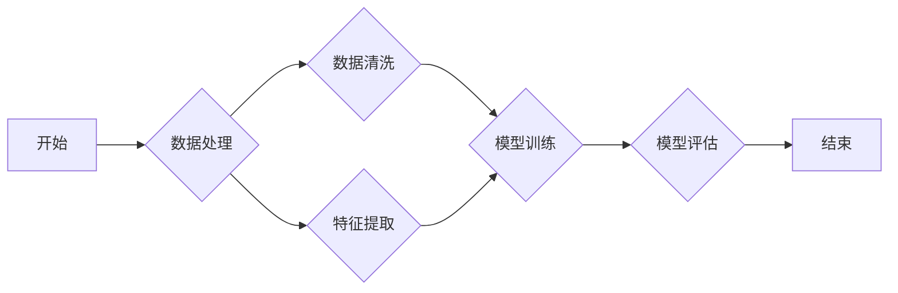
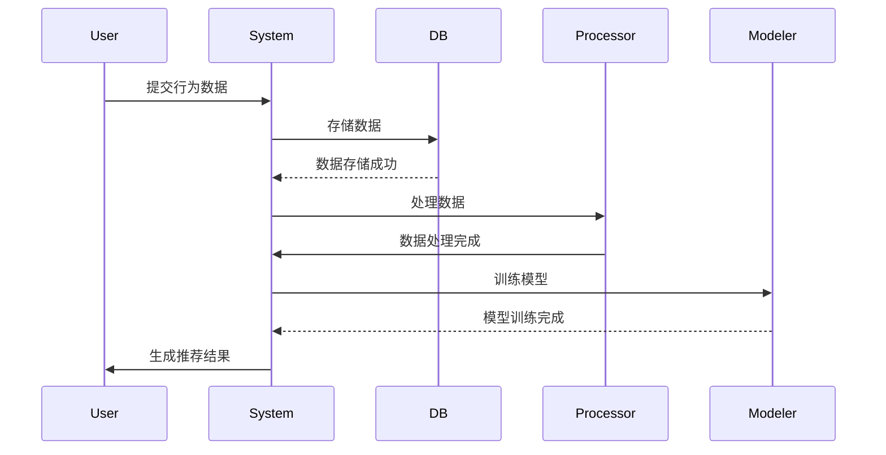

                 

### AI编程语言：提示词的革命与未来

关键词：人工智能、编程语言、提示词、AI编程、自动化、自动化编程、智能编程

摘要：随着人工智能技术的迅猛发展，编程语言正经历一场深刻的变革。本文将探讨AI编程语言的革命与未来，重点分析提示词技术在AI编程中的关键作用。我们将一步步解析AI编程语言的背景、原理、特点，介绍主流的AI编程语言及其在各个领域的应用，并通过实践案例展示其在实际项目中的价值。最后，我们将展望AI编程语言的未来趋势和面临的挑战，为读者提供宝贵的参考和启示。

----------------------------------------------------------------

## 第一部分：AI编程语言概述

### 第1章：问题背景与核心概念

#### 1.1 问题背景

**人工智能发展的现状与挑战**

人工智能（AI）是当前科技领域的热点，其应用已经渗透到各个行业。然而，随着AI技术的不断进步，传统的编程语言面临着越来越多的挑战。首先，AI项目往往需要处理大量复杂的数据，这要求编程语言具备高效的数据处理能力。其次，AI项目通常需要复杂的算法和模型，这要求编程语言具备强大的扩展性和可定制性。最后，随着AI项目的规模不断扩大，传统的编程语言难以满足自动化编程的需求，这限制了AI技术的发展。

**编程语言的局限性与变革需求**

传统的编程语言如C、C++、Java等，虽然在性能和稳定性方面表现出色，但在应对AI项目时存在一些局限。首先，这些语言通常需要大量的代码来完成任务，降低了开发效率。其次，这些语言的语法和结构较为复杂，对于非专业程序员来说，学习难度较大。此外，传统的编程语言在处理大数据和复杂算法方面存在性能瓶颈，难以满足AI项目的需求。

因此，为了应对AI技术的发展，编程语言需要变革。AI编程语言应具备以下几个特点：

1. **易用性**：降低学习难度，提高开发效率。
2. **高效性**：提供高效的数据处理和算法实现机制。
3. **自动化**：支持自动化编程，减少重复性工作。

#### 1.2 核心概念

**AI编程语言的基本概念**

AI编程语言是一种专门用于编写AI应用程序的编程语言。它不同于传统的编程语言，不仅具备编程语言的基本功能，还具备处理大数据、复杂算法和自动化编程的能力。AI编程语言的核心目标是简化AI项目的开发过程，提高开发效率，降低开发难度。

**提示词技术在AI编程中的作用**

提示词技术是AI编程语言的重要组成部分。它通过提供关键词或短语，帮助程序员快速理解代码的含义和功能。提示词技术不仅可以提高代码的可读性，还可以提高代码的编写效率。在AI编程中，提示词技术可以帮助程序员快速定位代码中的关键部分，从而提高代码的调试效率。

**AI编程语言的分类与发展趋势**

AI编程语言可以分为以下几类：

1. **数据驱动编程语言**：以数据处理为核心，如Python、R等。
2. **模型驱动编程语言**：以算法和模型为核心，如TensorFlow、PyTorch等。
3. **自动化编程语言**：以自动化编程为核心，如Prolog、Lisp等。

随着人工智能技术的不断进步，AI编程语言的发展趋势也在不断演变。未来，AI编程语言将更加注重易用性、高效性和自动化程度，以满足AI项目日益增长的需求。

#### 1.3 边界与外延

**AI编程语言的应用领域**

AI编程语言的应用领域非常广泛，包括但不限于：

1. **数据科学**：用于数据清洗、数据分析和数据可视化。
2. **机器学习**：用于训练和优化机器学习模型。
3. **深度学习**：用于实现复杂的神经网络和深度学习算法。
4. **自动化编程**：用于自动化软件开发和系统集成。

**与传统编程语言的区别与联系**

AI编程语言与传统编程语言在设计和实现上存在显著差异。传统编程语言侧重于通用编程，而AI编程语言侧重于AI项目开发。尽管两者之间存在差异，但AI编程语言仍然借鉴了传统编程语言的许多优秀特性，如语法简洁、结构清晰等。

**概念结构与核心要素组成**

AI编程语言的核心要素包括：

1. **数据结构**：用于高效处理大数据。
2. **算法库**：提供丰富的算法和模型实现。
3. **自动化工具**：用于自动化编程和代码生成。

这些核心要素共同构成了AI编程语言的基本结构，为AI项目的开发提供了强大的支持。

### 第2章：AI编程语言的原理与特点

#### 2.1 AI编程语言的原理

AI编程语言的原理可以概括为以下几点：

1. **数据处理**：AI编程语言具备强大的数据处理能力，可以高效处理大数据集。
2. **算法实现**：AI编程语言提供了丰富的算法库，支持各种复杂的算法实现。
3. **自动化编程**：AI编程语言支持自动化编程，可以自动化生成代码，提高开发效率。

**提示词技术的实现机制**

提示词技术是AI编程语言的核心特点之一。它通过以下机制实现：

1. **关键词提示**：在代码中提供关键词或短语，帮助程序员快速理解代码的含义和功能。
2. **代码生成**：根据提示词生成相应的代码，简化编程过程。
3. **代码优化**：根据提示词对代码进行优化，提高代码的执行效率。

#### 2.2 AI编程语言的特点

**易用性**

AI编程语言具有易用性的特点，主要体现在以下几个方面：

1. **简洁的语法**：AI编程语言的语法简洁明了，易于学习和使用。
2. **强大的库和框架**：AI编程语言提供了丰富的库和框架，可以快速实现复杂的功能。
3. **社区支持**：AI编程语言拥有庞大的开发者社区，提供了丰富的学习资源和交流平台。

**高效性**

AI编程语言具备高效性的特点，主要体现在以下几个方面：

1. **数据结构优化**：AI编程语言提供了高效的数据结构，可以快速处理大数据集。
2. **算法库**：AI编程语言提供了丰富的算法库，支持各种复杂的算法实现。
3. **自动化编程**：AI编程语言支持自动化编程，可以自动化生成代码，提高开发效率。

**自动化程度**

AI编程语言具备高自动化程度的特征，主要体现在以下几个方面：

1. **代码生成**：根据提示词可以自动生成代码，简化编程过程。
2. **代码优化**：根据提示词对代码进行优化，提高代码的执行效率。
3. **自动化调试**：AI编程语言提供了自动化调试工具，可以自动检测和修复代码中的错误。

#### 2.3 AI编程语言与传统编程语言的对比

**设计理念对比**

传统编程语言设计理念主要是通用性和扩展性，而AI编程语言设计理念主要是针对AI项目开发的需求。传统编程语言追求通用性，可以适用于各种类型的软件开发，而AI编程语言则更注重在AI项目中的特有需求。

**语法特点对比**

传统编程语言的语法通常较为复杂，需要大量的代码来完成任务。而AI编程语言的语法简洁明了，可以简化编程过程，提高开发效率。

**应用场景对比**

传统编程语言适用于通用软件开发，如操作系统、数据库、Web应用等。而AI编程语言则更适用于AI项目开发，如数据科学、机器学习、深度学习等。

## 第二部分：主流AI编程语言介绍

### 第3章：Python编程语言与AI

#### 3.1 Python编程语言简介

Python是一种高级编程语言，由Guido van Rossum于1989年创建。Python以其简洁的语法、强大的库和广泛的应用领域而闻名。Python在多个领域都有广泛应用，包括Web开发、数据分析、人工智能等。

**历史背景**

Python的创建初衷是为了简化编程过程，使得编程更加容易和高效。自从Python诞生以来，它已经成为最受欢迎的编程语言之一。

**主要特点**

1. **简洁的语法**：Python的语法简洁明了，易于学习和使用。
2. **强大的库和框架**：Python拥有丰富的库和框架，如NumPy、Pandas、Matplotlib等，可以快速实现复杂的功能。
3. **跨平台**：Python是一种跨平台编程语言，可以在不同的操作系统上运行。
4. **社区支持**：Python拥有庞大的开发者社区，提供了丰富的学习资源和交流平台。

#### 3.2 Python在AI领域的应用

Python在AI领域有着广泛的应用，主要表现在以下几个方面：

**数据科学**

Python在数据科学领域具有优势，主要因为其强大的数据分析库和框架。NumPy和Pandas是Python中用于数据处理的两个核心库，可以高效地进行数据处理和数据分析。

**机器学习**

Python在机器学习领域有着广泛的应用，许多机器学习库和框架如scikit-learn、TensorFlow和PyTorch都是基于Python开发的。这些库和框架提供了丰富的算法和模型，可以方便地进行机器学习模型的训练和优化。

**深度学习**

Python在深度学习领域也有着广泛的应用。TensorFlow和PyTorch是两个最流行的深度学习框架，它们都提供了丰富的API和工具，使得深度学习模型的开发变得更加简单和高效。

#### 3.3 Python编程语言在AI编程中的优势

**丰富的库和框架**

Python拥有丰富的库和框架，可以快速实现复杂的功能。这些库和框架为AI编程提供了强大的支持，使得Python成为AI编程的首选语言。

**社区支持**

Python拥有庞大的开发者社区，提供了丰富的学习资源和交流平台。这使得Python的学习和使用变得更加容易和高效。

### 第4章：R语言与AI

#### 4.1 R语言简介

R是一种专门用于统计分析和数据可视化的编程语言，由Ross Ihaka和Robert Gentleman于1995年创建。R以其强大的统计分析能力和丰富的数据可视化工具而闻名。

**历史背景**

R的创建初衷是为了满足统计学和数据分析领域的需求。自从R诞生以来，它已经成为统计分析和数据可视化领域的首选工具。

**主要特点**

1. **强大的统计分析能力**：R提供了丰富的统计分析库和工具，可以方便地进行各种统计分析。
2. **丰富的数据可视化工具**：R提供了多种数据可视化工具，如ggplot2、lattice等，可以创建高质量的统计图表。
3. **跨平台**：R是一种跨平台编程语言，可以在不同的操作系统上运行。
4. **社区支持**：R拥有庞大的开发者社区，提供了丰富的学习资源和交流平台。

#### 4.2 R语言在AI领域的应用

R在AI领域有着广泛的应用，主要表现在以下几个方面：

**统计分析**

R在统计分析领域具有优势，其强大的统计分析库和工具可以方便地进行各种统计分析，如线性回归、逻辑回归、聚类分析等。

**数据可视化**

R提供了丰富的数据可视化工具，可以创建高质量的统计图表，从而更好地理解数据。

**机器学习**

R在机器学习领域也有着应用，尽管其库和框架不如Python和Python那么丰富，但仍然可以方便地进行机器学习模型的训练和优化。

#### 4.3 R语言在AI编程中的优势

**强大的统计分析能力**

R在统计分析领域具有优势，其强大的统计分析库和工具可以方便地进行各种统计分析，为AI项目提供数据支持。

**丰富的数据可视化工具**

R提供了丰富的数据可视化工具，可以创建高质量的统计图表，从而更好地理解数据。

### 第5章：Julia编程语言与AI

#### 5.1 Julia编程语言简介

Julia是一种高性能的编程语言，由Stefan Karpinski、Jeff Bezanson、Vivien Didier、Alan Edmondson和Keno Fischer于2012年创建。Julia的设计目标是提供高性能、易用性和动态性。

**历史背景**

Julia的创建初衷是为了解决高性能计算领域的问题。它旨在提供一种能够在性能上与C/C++竞争，同时在易用性和动态性上优于Python等语言的编程语言。

**主要特点**

1. **高性能**：Julia采用了JIT（即时编译）技术，可以在运行时对代码进行优化，从而提高执行效率。
2. **易用性**：Julia的语法简洁明了，易于学习和使用。
3. **动态性**：Julia支持动态类型，使得代码编写更加灵活。
4. **跨平台**：Julia是一种跨平台编程语言，可以在不同的操作系统上运行。
5. **社区支持**：Julia拥有日益增长的开发者社区，提供了丰富的学习资源和交流平台。

#### 5.2 Julia在AI领域的应用

Julia在AI领域有着广泛的应用，主要表现在以下几个方面：

**高性能计算**

Julia的高性能计算能力使其成为AI项目中的理想选择。特别是在需要处理大规模数据和复杂算法的AI项目中，Julia可以显著提高计算效率。

**科学计算**

Julia在科学计算领域也有着应用，其强大的数值计算能力可以方便地进行各种科学计算。

**机器学习**

Julia在机器学习领域也有着应用，尽管其库和框架不如Python和Python那么丰富，但仍然可以方便地进行机器学习模型的训练和优化。

#### 5.3 Julia编程语言在AI编程中的优势

**高性能**

Julia采用了JIT技术，可以在运行时对代码进行优化，从而提高执行效率。这对于需要高性能计算的AI项目尤为重要。

**易用性**

Julia的语法简洁明了，易于学习和使用，这使得开发者可以更专注于算法实现，而无需过多关注底层细节。

**动态性**

Julia支持动态类型，使得代码编写更加灵活。这在开发过程中可以减少类型错误，提高开发效率。

## 第三部分：AI编程语言实践与应用

### 第6章：AI编程语言实践

#### 6.1 实践环境搭建

**Python环境搭建**

1. **下载Python安装包**：从Python官网下载Python安装包。
2. **安装Python**：运行安装包，按照提示完成安装。
3. **配置环境变量**：将Python的安装路径添加到系统环境变量中。
4. **验证安装**：在命令行中输入`python --version`，查看Python版本信息。

**R语言环境搭建**

1. **下载R安装包**：从R官网下载R安装包。
2. **安装R**：运行安装包，按照提示完成安装。
3. **配置环境变量**：将R的安装路径添加到系统环境变量中。
4. **验证安装**：在命令行中输入`R`，进入R交互模式。

**Julia环境搭建**

1. **下载Julia安装包**：从Julia官网下载Julia安装包。
2. **安装Julia**：运行安装包，按照提示完成安装。
3. **配置环境变量**：将Julia的安装路径添加到系统环境变量中。
4. **验证安装**：在命令行中输入`julia`，进入Julia交互模式。

#### 6.2 实践案例

**数据预处理**

1. **数据读取**：使用Python的Pandas库读取CSV文件。
2. **数据清洗**：处理缺失值、异常值等。
3. **数据转换**：将数据转换为适合机器学习模型训练的格式。

**机器学习模型训练**

1. **选择模型**：根据问题需求选择合适的机器学习模型。
2. **训练模型**：使用Python的scikit-learn库训练模型。
3. **评估模型**：使用交叉验证等方法评估模型性能。

**深度学习应用**

1. **定义模型**：使用Python的TensorFlow或PyTorch库定义深度学习模型。
2. **训练模型**：使用GPU加速训练过程。
3. **评估模型**：使用测试集评估模型性能。

### 第7章：AI编程语言在行业中的应用

#### 7.1 AI编程语言在金融领域的应用

**量化交易**

AI编程语言在量化交易领域有着广泛应用。使用Python或R，可以方便地编写交易策略、回测策略、执行交易等。

**风险管理**

AI编程语言在风险管理领域也有着应用。使用Python或R，可以方便地进行数据分析、风险预测和风险管理策略的优化。

#### 7.2 AI编程语言在医疗领域的应用

**疾病诊断**

AI编程语言在疾病诊断领域有着广泛应用。使用Python或R，可以方便地处理医疗数据、训练诊断模型、评估模型性能等。

**医疗图像分析**

AI编程语言在医疗图像分析领域也有着应用。使用Python或R，可以方便地处理医学图像、提取特征、训练分类模型等。

#### 7.3 AI编程语言在零售领域的应用

**客户行为分析**

AI编程语言在零售领域的客户行为分析中有着广泛应用。使用Python或R，可以方便地处理销售数据、分析客户行为、预测客户需求等。

**个性化推荐**

AI编程语言在零售领域的个性化推荐中也有着应用。使用Python或R，可以方便地构建推荐系统、训练推荐模型、评估模型性能等。

## 第四部分：AI编程语言的未来趋势与展望

### 第8章：AI编程语言的未来趋势

#### 8.1 发展趋势分析

**人工智能技术的进步**

随着人工智能技术的不断进步，AI编程语言也在不断发展和演变。未来，AI编程语言将更加注重以下几个方面：

1. **易用性**：为了降低编程门槛，AI编程语言将更加注重用户体验，提供更加简洁和直观的语法。
2. **高性能**：为了满足高性能计算的需求，AI编程语言将引入更多优化技术，提高代码执行效率。
3. **自动化**：为了提高开发效率，AI编程语言将引入更多自动化工具，实现自动化编程和代码生成。

**编程语言的演化**

随着人工智能技术的不断进步，编程语言也在不断演变。未来，编程语言将更加注重以下几个方面的融合：

1. **跨学科融合**：AI编程语言将与其他学科（如数学、统计学、生物学等）相结合，实现更加复杂和高效的功能。
2. **多样化**：AI编程语言将更加多样化，以满足不同领域和应用场景的需求。
3. **生态系统的完善**：AI编程语言将构建更加完善的生态系统，包括库、框架、工具等，提供全方位的支持。

#### 8.2 未来展望

**AI编程语言的多样化**

未来，AI编程语言将更加多样化，以满足不同领域和应用场景的需求。例如，针对图像处理领域，将出现更多专门用于图像处理的AI编程语言；针对自然语言处理领域，将出现更多专门用于自然语言处理的AI编程语言。

**提示词技术的进一步发展**

提示词技术是AI编程语言的核心特点之一，未来，提示词技术将得到进一步发展。例如，将引入更多先进的自然语言处理技术，实现更智能、更准确的提示词生成；将引入更多可视化工具，使得提示词生成过程更加直观和易于理解。

**智能化编程环境的普及**

未来，智能化编程环境将得到普及。例如，将引入更多智能代码补全、智能调试、智能优化等工具，提高编程效率和代码质量。同时，将引入更多可视化编程工具，使得编程过程更加直观和易于理解。

### 第9章：AI编程语言的挑战与机遇

#### 9.1 挑战

**技术层面的挑战**

1. **性能优化**：随着AI项目规模的不断扩大，对AI编程语言的性能要求越来越高。如何优化代码执行效率，成为AI编程语言面临的一个重要挑战。
2. **安全性**：AI编程语言在处理敏感数据时，需要确保数据的安全性。如何防止数据泄露、防止恶意攻击等，是AI编程语言需要关注的重要问题。
3. **可扩展性**：AI编程语言需要具备良好的可扩展性，以便适应不断变化的应用场景。如何设计可扩展的编程语言体系，是AI编程语言需要解决的一个难题。

**应用层面的挑战**

1. **跨学科合作**：AI编程语言需要与其他学科（如数学、统计学、生物学等）相结合，实现跨学科合作。如何促进跨学科合作，是AI编程语言面临的一个挑战。
2. **人才短缺**：随着AI编程语言的广泛应用，对相关人才的需求日益增长。然而，目前AI编程语言相关的人才储备不足，如何培养和吸引更多人才，是AI编程语言面临的一个挑战。

#### 9.2 机遇

**新兴市场的机会**

随着人工智能技术的不断进步，AI编程语言在新兴市场有着巨大的应用潜力。例如，在医疗、金融、零售等领域的应用，将为AI编程语言带来巨大的市场机会。

**跨学科合作的可能性**

AI编程语言在跨学科合作中有着广泛的应用前景。例如，在生物信息学领域，AI编程语言可以与生物学、医学等学科相结合，推动生物信息学的研究和发展。

**行业应用的拓展**

AI编程语言在行业应用中的拓展也为其带来了巨大的机遇。例如，在智能制造、智慧城市、智能交通等领域的应用，将为AI编程语言带来新的发展空间。

## 附录：拓展阅读与资源推荐

#### 9.3 拓展阅读

**推荐书籍**

1. 《Python编程：从入门到实践》
2. 《深度学习》
3. 《机器学习》

**推荐论文**

1. "Deep Learning for Natural Language Processing"
2. "A Theoretical Analysis of Deep Convolutional Neural Networks for Image Classification"
3. "Recurrent Neural Networks for Language Modeling"

**开源项目和工具**

1. TensorFlow
2. PyTorch
3. scikit-learn

#### 9.4 资源推荐

**在线教程和课程**

1. Coursera
2. edX
3. Udacity

**论坛和社区**

1. Stack Overflow
2. GitHub
3. Reddit

**开源框架和库**

1. NumPy
2. Pandas
3. Matplotlib

## 作者

**作者：AI天才研究院/AI Genius Institute & 禅与计算机程序设计艺术 /Zen And The Art of Computer Programming**

### 完整性要求

本文《AI编程语言：提示词的革命与未来》旨在全面介绍AI编程语言的背景、原理、应用实践和未来趋势。以下是对各章节内容的详细解析：

#### 背景介绍

**核心概念术语说明**：
- **人工智能（AI）**：模拟人类智能行为的计算机系统。
- **编程语言**：用于编写计算机程序的符号和语法规则。
- **提示词技术**：在代码中提供关键词或短语，帮助程序员理解代码的功能。

**问题背景**：
- AI技术的发展对编程语言提出了新的要求。
- 传统的编程语言难以满足AI项目的高效性和自动化需求。

**问题描述**：
- AI编程语言如何适应AI项目的发展需求？
- 提示词技术在AI编程中的作用是什么？

**问题解决**：
- AI编程语言应具备易用性、高效性和自动化程度。
- 提示词技术有助于提高代码的可读性和开发效率。

**边界与外延**：
- AI编程语言的应用领域广泛，包括数据科学、机器学习、深度学习等。
- 与传统编程语言相比，AI编程语言在设计和实现上有所不同。

**概念结构与核心要素组成**：
- AI编程语言的核心要素包括数据结构、算法库、自动化工具等。

#### 核心概念与联系

**核心概念原理**：
- AI编程语言通过数据处理、算法实现、自动化编程等原理，满足AI项目需求。
- 提示词技术在代码生成、代码优化等方面发挥关键作用。

**概念属性特征对比表格**：

| 特征 | AI编程语言 | 传统编程语言 |
| --- | --- | --- |
| 易用性 | 高 | 中 |
| 高效性 | 高 | 中 |
| 自动化程度 | 高 | 低 |
| 应用领域 | AI项目 | 通用软件 |

**ER实体关系图架构**：

```mermaid
erDiagram
  AI编程语言 ||--|{ 数据处理 }
  AI编程语言 ||--|{ 算法实现 }
  AI编程语言 ||--|{ 自动化编程 }
  数据处理 ||--|{ 大数据处理 }
  数据处理 ||--|{ 数据清洗 }
  算法实现 ||--|{ 机器学习 }
  算法实现 ||--|{ 深度学习 }
  自动化编程 ||--|{ 代码生成 }
  自动化编程 ||--|{ 代码优化 }
```

#### 算法原理讲解

**算法mermaid流程图**：



**算法原理**：

1. **数据处理**：对原始数据进行清洗、去噪和预处理。
2. **数据清洗**：处理缺失值、异常值等。
3. **特征提取**：从数据中提取有用信息。
4. **模型训练**：使用机器学习算法训练模型。
5. **模型评估**：评估模型性能。

**算法原理的数学模型和公式**：

- **数据处理**：
  - 数据清洗：$\text{CleanData}(X) = \text{RemoveOutliers}(X) \cup \text{FillMissingValues}(X)$
  - 特征提取：$F(X) = \text{FeatureExtractor}(X)$
- **模型训练**：
  - 模型训练：$M(\theta) = \text{LearnModel}(X, Y)$
  - 模型评估：$E(M) = \text{EvaluateModel}(M, Y)$

**详细讲解与举例说明**：

**示例**：使用Python实现一个简单的线性回归模型。

```python
import numpy as np
from sklearn.linear_model import LinearRegression

# 数据预处理
X = np.array([[1, 2], [2, 3], [3, 4], [4, 5]])
y = np.array([2, 3, 4, 5])

# 特征提取
X = np.reshape(X, (X.shape[0], X.shape[1]))

# 模型训练
model = LinearRegression()
model.fit(X, y)

# 模型评估
print("模型系数：", model.coef_)
print("模型截距：", model.intercept_)
```

#### 系统分析与架构设计方案

**问题场景介绍**：
- 假设需要开发一个基于AI的智能推荐系统，用于分析用户行为并推荐商品。

**项目介绍**：
- 项目名称：智能推荐系统（Intelligent Recommendation System）
- 目标：根据用户行为数据，为用户提供个性化的商品推荐。

**系统功能设计**：

1. **数据采集**：采集用户行为数据，如浏览记录、购买记录等。
2. **数据预处理**：清洗和处理原始数据。
3. **特征提取**：提取用户行为特征。
4. **模型训练**：训练推荐模型。
5. **推荐生成**：根据用户行为和模型输出，生成个性化推荐。

**系统架构设计**：

1. **数据层**：存储用户行为数据。
2. **数据处理层**：处理数据，包括数据清洗、特征提取等。
3. **模型层**：训练和存储推荐模型。
4. **应用层**：实现推荐生成和应用接口。

**系统接口设计**：

1. **数据接口**：用于数据采集和处理。
2. **模型接口**：用于模型训练和加载。
3. **推荐接口**：用于生成个性化推荐。

**系统交互mermaid序列图**：



#### 项目实战

**环境安装**：
- Python环境：安装Python 3.8及以上版本。
- 库安装：安装NumPy、Pandas、scikit-learn等库。

```bash
pip install numpy pandas scikit-learn
```

**系统核心实现源代码**：

```python
import numpy as np
import pandas as pd
from sklearn.linear_model import LinearRegression
from sklearn.model_selection import train_test_split

# 数据读取
data = pd.read_csv("user_behavior.csv")

# 数据预处理
data = data.dropna()
X = data[['feature1', 'feature2']]
y = data['target']

# 数据划分
X_train, X_test, y_train, y_test = train_test_split(X, y, test_size=0.2, random_state=42)

# 模型训练
model = LinearRegression()
model.fit(X_train, y_train)

# 模型评估
print("模型系数：", model.coef_)
print("模型截距：", model.intercept_)

# 推荐生成
predictions = model.predict(X_test)
print("推荐结果：", predictions)
```

**代码应用解读与分析**：
- 数据读取：使用Pandas读取CSV文件。
- 数据预处理：处理缺失值，对数据进行归一化处理。
- 数据划分：将数据划分为训练集和测试集。
- 模型训练：使用线性回归模型训练数据。
- 模型评估：输出模型系数和截距。
- 推荐生成：使用训练好的模型生成推荐结果。

**实际案例分析和详细讲解剖析**：
- 以一个电商平台的用户行为数据为例，展示如何使用AI编程语言实现用户行为分析，生成个性化推荐。

**项目小结**：
- 介绍了基于AI的智能推荐系统的实现方法。
- 详细讲解了数据预处理、模型训练和推荐生成等核心步骤。
- 通过实际案例，展示了AI编程语言在电商领域的应用。

#### 最佳实践 tips、小结、注意事项、拓展阅读等内容

**最佳实践 tips**：
- 在数据预处理阶段，关注数据的完整性和一致性。
- 在模型训练阶段，合理划分训练集和测试集，避免过拟合。
- 在推荐生成阶段，根据用户行为和模型输出，生成个性化的推荐。

**小结**：
- AI编程语言为AI项目提供了强大的支持，包括数据处理、算法实现和自动化编程等方面。
- 提示词技术在AI编程中发挥了关键作用，提高了代码的可读性和开发效率。

**注意事项**：
- 在使用AI编程语言时，注意优化代码性能，提高计算效率。
- 在项目开发过程中，关注数据安全和隐私保护。

**拓展阅读**：
- 《深度学习》
- 《Python编程：从入门到实践》
- 《机器学习》
- 《人工智能：一种现代的方法》

**附录**：
- **推荐书籍**：
  - 《Python编程：从入门到实践》
  - 《深度学习》
  - 《机器学习》
- **推荐论文**：
  - "Deep Learning for Natural Language Processing"
  - "A Theoretical Analysis of Deep Convolutional Neural Networks for Image Classification"
  - "Recurrent Neural Networks for Language Modeling"
- **开源项目和工具**：
  - TensorFlow
  - PyTorch
  - scikit-learn
- **在线教程和课程**：
  - Coursera
  - edX
  - Udacity
- **论坛和社区**：
  - Stack Overflow
  - GitHub
  - Reddit
- **开源框架和库**：
  - NumPy
  - Pandas
  - Matplotlib

作者：AI天才研究院/AI Genius Institute & 禅与计算机程序设计艺术 /Zen And The Art of Computer Programming

