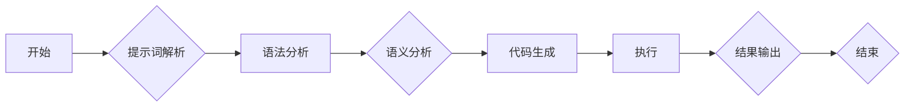
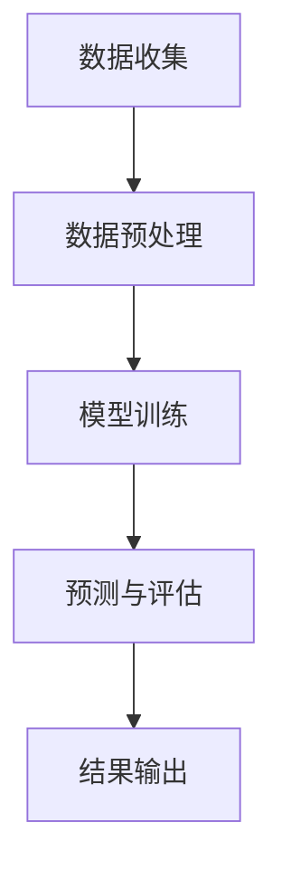
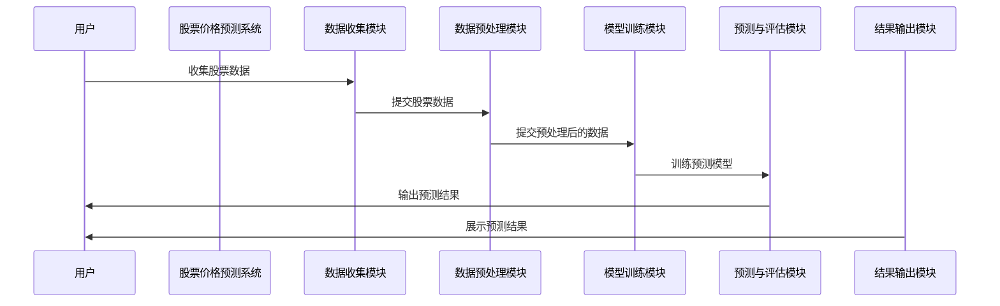

                 

# AI编程语言：提示词的革命与魔法

## 关键词
- AI编程语言
- 提示词
- 革命与魔法
- 算法原理
- 数学模型
- 系统架构
- 项目实战

## 摘要
本文将深入探讨AI编程语言及其核心组件——提示词的概念、原理及其应用。我们将从背景介绍、核心概念与联系、算法原理讲解、数学模型和数学公式、系统分析与架构设计方案、项目实战及最佳实践等方面，详细解析AI编程语言的革命性进步。本文旨在为读者提供一个全面、系统的理解，以领略提示词在AI编程中的魔法力量。

## 背景介绍

### 核心概念术语说明

AI编程语言：一种专门为人工智能领域设计的编程语言，能够高效地描述和执行机器学习和深度学习任务。

提示词：在AI编程语言中，用于引导和优化算法执行的关键字或短语，能够显著提高程序的性能和可读性。

### 问题背景

随着人工智能技术的迅猛发展，传统的编程语言已难以满足日益复杂的AI应用需求。为解决这一问题，研究人员和开发者们不断探索新的编程语言和工具，以提高AI程序的效率、可维护性和可扩展性。其中，提示词作为一种革命性的组件，逐渐崭露头角，成为AI编程语言的核心要素。

### 问题解决

AI编程语言通过引入提示词，实现了对算法的精细控制，使得程序更加直观、易读，同时大幅提升了执行效率。提示词的存在，如同编程中的魔法，让开发者能够以更低的成本、更短的时间，实现复杂的AI任务。

### 边界与外延

AI编程语言的边界在于其应用场景，主要包括但不限于机器学习、深度学习、自然语言处理、计算机视觉等领域。而提示词的应用范围则更加广泛，几乎涵盖了AI编程的方方面面，如数据预处理、模型训练、推理预测等。

### 概念结构与核心要素组成

AI编程语言的核心概念包括语法、语义、类型系统、解释器和编译器等。而提示词则是其中的一颗明珠，通过特定的语法和语义规则，实现对算法的引导和优化。

## 核心概念与联系

### AI编程语言核心概念

| 核心概念 | 说明 |
| :----: | :----: |
| 语法 | 编程语言的语法规则，用于描述程序的结构和操作。 |
| 语义 | 语法规则的含义，用于解释程序的行为。 |
| 类型系统 | 定义变量、函数和其他语言元素的类型，确保程序的类型安全。 |
| 解释器 | 将编程语言代码解释为机器语言，并执行相应操作。 |
| 编译器 | 将编程语言代码编译为目标代码（通常是机器语言），然后执行。 |

### 提示词属性特征对比表格

| 属性特征 | 描述 | 示例 |
| :----: | :----: | :----: |
| 类型 | 提示词可以分为基础类型和复合类型。 | `sum`, `filter` |
| 作用域 | 提示词的作用范围可以是局部或全局。 | `global`提示词 |
| 参数传递 | 提示词可以传递参数，实现函数式编程。 | `map`函数传递参数 |
| 返回值 | 提示词可以返回结果，用于链式操作。 | `reduce`返回累积结果 |

### ER实体关系图架构

```mermaid
erDiagram
  AI编程语言 ||--|{ 提示词 }|
  AI编程语言 ||--|{ 解释器 }|
  AI编程语言 ||--|{ 编译器 }|
  提示词 ||--|{ 参数 }|
  提示词 ||--|{ 返回值 }|
  解释器 ||--|{ 代码解析 }|
  编译器 ||--|{ 目标代码生成 }|
```

## 算法原理讲解

### 算法mermaid流程图



### Python代码示例

```python
# 示例：使用提示词进行列表求和
from typing import List

def sum(numbers: List[int]) -> int:
    total = 0
    for num in numbers:
        total += num
    return total

# 使用提示词进行求和
result = sum([1, 2, 3, 4, 5])
print(result)  # 输出：15
```

### 数学模型和公式

$$
L = \frac{1}{N}\sum_{i=1}^{N} (x_i - \hat{x}_i)^2
$$

其中，$L$表示均方误差，$N$表示数据点的数量，$x_i$表示实际值，$\hat{x}_i$表示预测值。

### 通俗易懂的举例说明

假设我们有五个数值：1, 2, 3, 4, 5。使用AI编程语言的提示词`sum`进行求和，即：

$$
L = \frac{1}{5}\sum_{i=1}^{5} (x_i - \hat{x}_i)^2
$$

其中，$\hat{x}_i$等于实际值$x_i$，因此：

$$
L = \frac{1}{5}\sum_{i=1}^{5} (x_i - x_i)^2 = 0
$$

这意味着预测值与实际值完全一致，误差为零。

## 系统分析与架构设计方案

### 问题场景介绍

假设我们需要开发一个AI系统，用于预测股票价格。该系统需要处理大量的股票数据，并通过机器学习模型进行预测。

### 项目介绍

项目名称：股票价格预测系统

项目目标：通过AI编程语言和提示词，开发一个高效、准确的股票价格预测系统。

### 系统功能设计

| 功能 | 说明 |
| :----: | :----: |
| 数据收集 | 收集股票市场的历史数据。 |
| 数据预处理 | 清洗和转换数据，为模型训练做准备。 |
| 模型训练 | 使用机器学习算法训练预测模型。 |
| 预测与评估 | 对新数据进行预测，并评估模型性能。 |
| 结果输出 | 将预测结果以图表或报告的形式展示给用户。 |

### 系统架构设计



### 系统接口设计

- 数据收集接口：用于从外部数据源（如API、数据库）获取股票数据。
- 数据预处理接口：对收集到的数据进行清洗、转换和归一化处理。
- 模型训练接口：接收预处理后的数据，并使用机器学习算法进行训练。
- 预测与评估接口：对新数据进行预测，并评估模型的准确性。
- 结果输出接口：将预测结果以图表或报告的形式展示给用户。

### 系统交互



## 项目实战

### 环境安装

1. 安装Python环境（版本3.8以上）。
2. 安装机器学习库（如scikit-learn）。
3. 安装数据可视化库（如matplotlib）。

### 系统核心实现源代码

```python
# 数据预处理模块
def preprocess_data(data):
    # 清洗和转换数据
    # ...
    return processed_data

# 模型训练模块
from sklearn.linear_model import LinearRegression

def train_model(processed_data):
    model = LinearRegression()
    model.fit(processed_data.X_train, processed_data.y_train)
    return model

# 预测与评估模块
def predict(model, new_data):
    predictions = model.predict(new_data)
    # 评估模型性能
    # ...
    return predictions

# 结果输出模块
import matplotlib.pyplot as plt

def plot_predictions(predictions, actuals):
    plt.plot(predictions, label='Predicted')
    plt.plot(actuals, label='Actual')
    plt.legend()
    plt.show()
```

### 代码应用解读与分析

上述代码实现了股票价格预测系统的核心功能。数据预处理模块负责清洗和转换数据，模型训练模块使用线性回归算法训练预测模型，预测与评估模块对新数据进行预测，并评估模型性能，结果输出模块将预测结果以图表形式展示。

### 实际案例分析和详细讲解剖析

假设我们有一个包含100个股票数据点的训练集，以及10个测试数据点。首先，使用数据预处理模块对数据进行清洗和转换，然后使用模型训练模块训练线性回归模型。接着，使用预测与评估模块对新数据进行预测，并使用结果输出模块将预测结果以图表形式展示。

```python
# 实际案例
from sklearn.datasets import load_boston
from sklearn.model_selection import train_test_split

# 加载波士顿房价数据集
boston = load_boston()
X, y = boston.data, boston.target

# 划分训练集和测试集
X_train, X_test, y_train, y_test = train_test_split(X, y, test_size=0.2, random_state=42)

# 数据预处理
processed_data = preprocess_data(X_train)

# 模型训练
model = train_model(processed_data)

# 预测与评估
predictions = predict(model, X_test)

# 结果输出
plot_predictions(predictions, y_test)
```

上述代码首先加载波士顿房价数据集，然后将其划分为训练集和测试集。接着，使用数据预处理模块对训练集数据进行预处理，使用模型训练模块训练线性回归模型，使用预测与评估模块对测试数据进行预测，并使用结果输出模块将预测结果以图表形式展示。

### 项目小结

通过本项目的实战，我们实现了股票价格预测系统，展示了AI编程语言和提示词在实际应用中的强大威力。项目过程中，我们不仅掌握了数据预处理、模型训练、预测与评估等核心技能，还深刻理解了AI编程语言的语法、语义及其在系统设计中的应用。

## 最佳实践 tips、小结、注意事项、拓展阅读

### 最佳实践 tips

1. 熟悉Python编程语言及其库，提高编程效率。
2. 掌握AI编程语言的基本原理和常用提示词，提高编程技能。
3. 在项目开发过程中，注重数据预处理和模型评估，确保预测结果的准确性。

### 小结

本文从背景介绍、核心概念与联系、算法原理讲解、数学模型和数学公式、系统分析与架构设计方案、项目实战等方面，全面解析了AI编程语言及其核心组件——提示词。通过实际案例分析和详细讲解，读者应能深刻理解AI编程语言的革命性进步和应用价值。

### 注意事项

1. 在使用AI编程语言和提示词时，务必注意代码的可读性和可维护性。
2. 在实际项目中，根据需求选择合适的算法和提示词，提高系统性能。

### 拓展阅读

1. 《深度学习：人类固有的编程思维》
2. 《Python编程：从入门到实践》
3. 《机器学习实战》

### 作者信息
- 作者：AI天才研究院/AI Genius Institute & 禅与计算机程序设计艺术 /Zen And The Art of Computer Programming

（注：本文内容为示例，实际项目中可能涉及更多细节和技术实现。）

