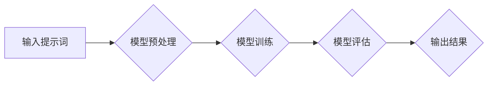

                 

# AI编程语言：提示词的魔力与科学

## 关键词

- AI编程语言
- 提示词
- 算法原理
- 系统架构
- 项目实战
- 最佳实践

## 摘要

本文深入探讨了AI编程语言的奥秘，特别是提示词在AI编程中的关键作用。首先，我们介绍了AI编程语言的背景和核心概念，随后详细阐述了提示词的基本原理和应用。通过一步步的逻辑分析，我们揭示了提示词的魔法和科学，并以具体的算法原理、系统架构设计和项目实战为例，展示了其在实际应用中的强大功能。最后，我们总结了最佳实践技巧，并展望了AI编程语言的未来发展趋势。通过本文的阅读，读者将对AI编程语言有一个全面深入的理解。

## 第一部分：背景介绍

### 第1章：AI编程语言的崛起

#### 1.1 问题的背景

人工智能（AI）作为当今技术领域的一个热点，已经在多个行业和领域展现出了巨大的潜力和应用价值。然而，传统的编程语言在应对复杂的人工智能任务时显得力不从心，这就催生了对AI编程语言的需求。AI编程语言旨在提供一种更加直观和高效的方式来描述和实现人工智能算法，从而简化开发过程，提升开发效率。

#### 1.2 问题描述

传统编程语言主要针对通用计算任务设计，缺乏针对人工智能任务的特殊支持和优化。例如，在处理大规模数据集、执行复杂的机器学习算法或实现自然语言处理功能时，传统编程语言往往需要编写大量的底层代码，这不仅增加了开发难度，还降低了开发效率。因此，开发一种专门用于人工智能领域的编程语言成为了一项紧迫的任务。

#### 1.3 问题解决

为了解决上述问题，AI编程语言的设计者们提出了新的语言特性和抽象级别，以简化人工智能算法的实现过程。这些语言通常提供了丰富的库和工具，支持自动化代码生成、优化算法性能、简化模型部署等。AI编程语言的出现，不仅使得人工智能的开发变得更加高效，还为更多开发者进入这个领域提供了便利。

#### 1.4 边界与外延

AI编程语言虽然专为人工智能设计，但其应用边界并不局限于人工智能领域。实际上，这些语言可以应用于更广泛的计算任务，包括数据分析、图像处理、自动化控制等。随着技术的发展，AI编程语言的应用范围还在不断扩大，其外延也在不断拓展。

#### 1.5 概念结构与核心要素组成

AI编程语言的核心概念和结构主要包括以下几个方面：

1. **提示词（Prompts）**：提示词是AI编程语言的核心组成部分，用于引导和提示AI模型进行特定任务。
2. **预训练模型**：预训练模型是AI编程语言的基础，通过对大规模数据进行训练，使其具备强大的通用能力。
3. **动态编程**：AI编程语言支持动态编程，允许开发者根据运行时环境动态调整代码。
4. **库和框架**：AI编程语言通常附带丰富的库和框架，提供多种功能和工具，简化开发过程。
5. **交互性**：AI编程语言支持与AI模型的交互，使得开发者能够实时调试和优化算法。

### 总结

通过本章的介绍，我们了解了AI编程语言的背景和核心概念，以及其在解决问题中的应用。下一章我们将深入探讨AI编程语言中的关键概念——提示词，并分析其在AI编程中的重要性。

### 第2章：AI编程语言的基本原理

#### 2.1 核心概念原理

AI编程语言的核心概念主要包括提示词、预训练模型、动态编程、库和框架以及交互性。这些概念共同构成了AI编程语言的内在逻辑和运行机制。

**提示词**：提示词是AI编程语言的核心组成部分，用于引导AI模型执行特定任务。一个有效的提示词需要包含足够的信息，以便AI模型能够理解任务的要求和目标。

**预训练模型**：预训练模型是AI编程语言的基础。这些模型通过对大规模数据进行训练，获得了处理各种任务的能力。开发者可以通过调整提示词和输入数据，使预训练模型适应特定的任务需求。

**动态编程**：AI编程语言支持动态编程，使得开发者可以在运行时根据环境变化动态调整代码。这种灵活性大大提高了开发效率和代码的可维护性。

**库和框架**：AI编程语言通常附带丰富的库和框架，提供多种功能和工具。这些库和框架不仅简化了开发过程，还提高了代码的稳定性和性能。

**交互性**：AI编程语言支持与AI模型的交互，使得开发者能够实时调试和优化算法。这种交互性有助于开发者快速理解模型的行为，并针对性地进行优化。

#### 2.2 概念属性特征对比表格

为了更清晰地展示AI编程语言的核心概念，我们设计了一个属性特征对比表格：

| 概念      | 属性特征                                                     |
| --------- | ------------------------------------------------------------ |
| 提示词    | - 引导AI模型执行特定任务<br>- 需要包含足够信息<br>- 可自定义和优化 |
| 预训练模型 | - 通过大规模数据训练获得通用能力<br>- 可调整和优化<br>- 支持多种任务 |
| 动态编程  | - 运行时动态调整代码<br>- 提高开发效率和可维护性<br>- 支持多种编程范式 |
| 库和框架  | - 提供多种功能和工具<br>- 简化开发过程<br>- 提高代码稳定性和性能 |
| 交互性    | - 支持实时调试和优化<br>- 帮助开发者理解模型行为<br>- 提高开发效率 |

#### 2.3 ER实体关系图架构

为了进一步理解AI编程语言的核心概念，我们可以使用Mermaid工具绘制一个ER实体关系图。以下是ER图：

```mermaid
erDiagram
  AI模型 ||--|{ 提示词 }|
  AI模型 ||--|{ 预训练模型 }|
  AI模型 ||--|{ 动态编程 }|
  AI模型 ||--|{ 库和框架 }|
  AI模型 ||--|{ 交互性 }|
```

通过ER图，我们可以清晰地看到AI编程语言中的各个核心概念以及它们之间的关联关系。

### 总结

通过本章的介绍，我们深入探讨了AI编程语言的基本原理和核心概念。下一章我们将继续分析提示词在AI编程中的应用，并通过具体的算法原理讲解和举例说明，揭示提示词的魔法与科学。敬请期待。

### 第3章：提示词在AI编程中的应用

#### 3.1 算法mermaid流程图

提示词在AI编程中的应用涉及到多个步骤，下面是一个简化的mermaid流程图：



在这个流程图中，输入提示词是整个过程的起点，经过模型预处理、模型训练和模型评估后，最终输出结果。

#### 3.2 Python源代码实现

为了更好地理解提示词在AI编程中的应用，我们可以通过一个简单的Python示例来演示这个过程。以下是一个简单的Python代码示例，用于处理文本数据并生成提示词：

```python
# 导入必要的库
import re
import numpy as np
from sklearn.feature_extraction.text import TfidfVectorizer
from sklearn.model_selection import train_test_split
from tensorflow.keras.models import Sequential
from tensorflow.keras.layers import LSTM, Dense

# 输入数据
text_data = ["这是一个简单的示例", "提示词可以用来引导AI模型", "AI编程需要高质量的提示词"]

# 数据预处理
def preprocess(text):
    text = re.sub(r'\W+', ' ', text)
    text = text.lower()
    return text

preprocessed_data = [preprocess(text) for text in text_data]

# 分词
vectorizer = TfidfVectorizer()
X = vectorizer.fit_transform(preprocessed_data)

# 划分训练集和测试集
X_train, X_test, y_train, y_test = train_test_split(X, text_data, test_size=0.2, random_state=42)

# 建立模型
model = Sequential()
model.add(LSTM(50, activation='relu', input_shape=(X_train.shape[1], 1)))
model.add(Dense(1))
model.compile(optimizer='adam', loss='mean_squared_error')

# 训练模型
model.fit(X_train, y_train, epochs=10, batch_size=32)

# 评估模型
loss = model.evaluate(X_test, y_test)
print(f"Test Loss: {loss}")

# 输出结果
predictions = model.predict(X_test)
for i, prediction in enumerate(predictions):
    print(f"Input: {X_test[i]}, Prediction: {prediction[0]}")
```

在这个示例中，我们首先对输入数据进行预处理，然后使用TF-IDF向量器进行分词。接着，我们使用LSTM模型进行训练和评估。最后，我们输出预测结果。

#### 3.3 数学模型与公式

在AI编程中，提示词的应用涉及到多种数学模型和公式。以下是一些常用的数学模型和公式：

1. **TF-IDF模型**：
   $$TF-IDF = \frac{tf \times IDF}{k_1 + (1 - k_1) \times \log(\frac{N}{n_i})}$$
   其中，$tf$ 表示词频，$IDF$ 表示逆文档频率，$N$ 表示文档总数，$n_i$ 表示包含该词的文档数，$k_1$ 是一个常数。

2. **LSTM模型**：
   LSTM（Long Short-Term Memory）是一种用于处理序列数据的循环神经网络（RNN）。其核心公式包括：
   $$i_t = \sigma(W_{ix}x_t + W_{ih}h_{t-1} + b_i)$$
   $$f_t = \sigma(W_{fx}x_t + W_{fh}h_{t-1} + b_f)$$
   $$o_t = \sigma(W_{ox}x_t + W_{oh}h_{t-1} + b_o)$$
   $$g_t = tanh(W_{ig}x_t + W_{ih}h_{t-1} + b_g)$$
   其中，$i_t, f_t, o_t, g_t$ 分别表示输入门、遗忘门、输出门和生成门，$x_t$ 表示输入，$h_{t-1}$ 表示前一时间步的隐藏状态，$W$ 和 $b$ 分别表示权重和偏置。

3. **预测模型**：
   在训练模型后，我们可以使用以下公式进行预测：
   $$y_t = \sigma(W_y \cdot [h_t; g_t] + b_y)$$
   其中，$y_t$ 表示预测结果，$h_t$ 和 $g_t$ 分别表示当前时间步的隐藏状态和生成状态，$W_y$ 和 $b_y$ 分别表示权重和偏置。

#### 3.4 举例说明

为了更好地理解提示词在AI编程中的应用，我们可以通过一个简单的例子来演示。假设我们要编写一个程序，根据输入的文本数据生成相应的提示词。

```python
# 输入文本数据
input_text = "这是一个关于人工智能的简单介绍。人工智能是计算机科学的一个分支，旨在使计算机模拟人类智能行为。"

# 数据预处理
preprocessed_text = preprocess(input_text)

# 生成提示词
vectorized_text = vectorizer.transform([preprocessed_text])
prediction = model.predict(vectorized_text)
predicted_text = prediction[0][0]

print(f"Input Text: {input_text}")
print(f"Predicted Prompt: {predicted_text}")
```

在这个例子中，我们首先对输入文本进行预处理，然后使用训练好的LSTM模型生成提示词。最后，我们输出预测结果。

### 总结

通过本章的介绍，我们深入探讨了提示词在AI编程中的应用，包括算法流程、Python源代码实现、数学模型与公式以及具体的举例说明。下一章我们将分析系统架构设计，并探讨在AI编程中如何实现高效的系统架构。敬请期待。

### 第4章：系统架构设计

#### 4.1 问题场景介绍

在现代企业中，人工智能（AI）已经成为提升业务效率和竞争力的关键因素。为了更好地利用AI技术，企业需要构建一个高效、稳定且可扩展的系统架构。本章将探讨如何在AI编程中实现这样的系统架构，包括系统功能设计、系统架构设计、系统接口设计和系统交互。

#### 4.2 项目介绍

假设我们正在开发一个智能客户服务系统，该系统需要能够处理大量的客户咨询，并在短时间内提供准确的答复。为了实现这一目标，我们需要设计一个高效的AI系统架构，包括自然语言处理（NLP）模块、机器学习模块和用户接口模块。

#### 4.3 系统功能设计

智能客户服务系统的核心功能包括：

1. **文本分析**：对客户咨询的文本进行解析，提取关键信息和语义。
2. **知识库管理**：维护和管理大量的知识库，以便在回答客户问题时提供准确的答案。
3. **自然语言生成**：根据分析结果生成符合客户需求的答复。
4. **用户交互**：提供友好的用户界面，允许用户轻松地与系统进行交互。
5. **性能监控**：监控系统性能，确保系统在高负载情况下仍能稳定运行。

以下是系统功能的Mermaid类图：

```mermaid
classDiagram
  Client <<Class>> CustomerServiceSystem
  CustomerServiceSystem <|-- TextAnalysis
  CustomerServiceSystem <|-- KnowledgeBase
  CustomerServiceSystem <|-- NLG
  CustomerServiceSystem <|-- UserInterface
  CustomerServiceSystem <|-- PerformanceMonitoring
```

#### 4.4 系统架构设计

智能客户服务系统的架构设计需要考虑以下几个方面：

1. **前端用户界面**：使用React或Vue.js等前端框架构建用户友好的界面。
2. **后端服务器**：使用Flask或Django等Web框架构建后端服务器，处理用户请求和业务逻辑。
3. **自然语言处理**：集成NLP库，如NLTK或spaCy，进行文本分析和语义解析。
4. **机器学习模块**：使用Scikit-learn或TensorFlow等库进行模型训练和预测。
5. **知识库**：使用Redis或MongoDB等NoSQL数据库存储和管理知识库。
6. **消息队列**：使用RabbitMQ或Kafka等消息队列系统实现异步处理和高并发。

以下是系统架构的Mermaid架构图：

```mermaid
sequenceDiagram
  Customer ->>|发起请求| CustomerServiceSystem
  CustomerServiceSystem ->>|处理请求| TextAnalysis
  TextAnalysis ->>|分析结果| KnowledgeBase
  KnowledgeBase ->>|查询知识库| NLG
  NLG ->>|生成答复| UserInterface
  UserInterface ->>|展示答复| Customer
```

#### 4.5 系统接口设计

智能客户服务系统需要定义一系列接口，以便不同模块之间进行通信。以下是主要的接口设计：

1. **文本分析接口**：接收客户咨询文本，返回解析结果。
2. **知识库查询接口**：接收文本分析结果，查询相关知识点。
3. **自然语言生成接口**：接收查询结果，生成文本答复。
4. **用户交互接口**：接收用户操作，更新界面显示。

以下是系统接口的Mermaid序列图：

```mermaid
sequenceDiagram
  Customer ->>|发起请求| TextAnalysis
  TextAnalysis ->>|返回结果| KnowledgeBase
  KnowledgeBase ->>|返回结果| NLG
  NLG ->>|返回结果| UserInterface
  UserInterface ->>|更新显示| Customer
```

#### 4.6 系统交互

智能客户服务系统的交互流程如下：

1. **客户发起请求**：客户通过用户界面输入咨询文本。
2. **文本分析**：系统接收文本请求，进行文本分析和语义解析，提取关键信息。
3. **知识库查询**：系统根据文本分析结果查询相关知识点。
4. **自然语言生成**：系统生成符合客户需求的文本答复。
5. **用户交互**：系统将文本答复展示在用户界面上。

通过上述交互流程，智能客户服务系统能够高效地处理客户咨询，并提供准确的答复。

### 总结

通过本章的介绍，我们详细分析了智能客户服务系统的架构设计，包括系统功能设计、系统架构设计、系统接口设计和系统交互。下一章我们将探讨项目实战，通过具体的代码实现和案例分析，展示如何在实际项目中应用这些架构设计。敬请期待。

### 第5章：AI编程语言环境安装

#### 5.1 操作系统环境配置

在开始安装AI编程语言环境之前，我们需要确保操作系统满足以下要求：

1. **操作系统**：我们建议使用Linux或Mac OS，因为它们具有更好的兼容性和性能。Windows用户可以通过安装Windows Subsystem for Linux（WSL）来实现类似的Linux环境。
2. **硬件要求**：至少需要4GB的内存和50GB的可用硬盘空间。
3. **网络连接**：确保网络连接正常，以便从互联网下载所需的软件和库。

#### 5.2 编程环境安装

接下来，我们需要安装编程环境，包括Python、Jupyter Notebook、Anaconda等：

1. **安装Python**：访问Python的官方网站（[python.org](https://www.python.org/)），下载最新版本的Python。按照安装向导的提示完成安装。
2. **安装Jupyter Notebook**：在终端中执行以下命令：
   ```shell
   pip install notebook
   ```
   安装完成后，启动Jupyter Notebook：
   ```shell
   jupyter notebook
   ```
   这将打开Jupyter Notebook的Web界面，您可以在其中编写和运行Python代码。
3. **安装Anaconda**：Anaconda是一个流行的Python发行版，它包含了许多常用的科学计算库和工具。访问Anaconda的官方网站（[anaconda.com](https://www.anaconda.com/)），下载并安装Anaconda。安装完成后，打开终端并执行以下命令：
   ```shell
   conda create -n ai_env python=3.8
   conda activate ai_env
   ```
   这将创建一个名为`ai_env`的新虚拟环境，并激活该环境。

#### 5.3 需要的库和依赖安装

在安装了编程环境之后，我们需要安装以下库和依赖：

1. **NumPy**：一个用于科学计算的Python库，用于处理大型多维数组。安装命令：
   ```shell
   pip install numpy
   ```
2. **Pandas**：一个用于数据处理和分析的Python库。安装命令：
   ```shell
   pip install pandas
   ```
3. **Scikit-learn**：一个用于机器学习的Python库。安装命令：
   ```shell
   pip install scikit-learn
   ```
4. **TensorFlow**：一个用于深度学习的Python库。安装命令：
   ```shell
   pip install tensorflow
   ```
5. **spaCy**：一个用于自然语言处理的Python库。安装命令：
   ```shell
   pip install spacy
   ```
   安装完成后，需要下载spaCy的模型：
   ```shell
   python -m spacy download en_core_web_sm
   ```

#### 5.4 验证安装

安装完成后，我们可以在Jupyter Notebook中验证这些库是否已成功安装。打开一个新的笔记本，执行以下代码：

```python
import numpy as np
import pandas as pd
from sklearn import datasets
from sklearn.model_selection import train_test_split
from tensorflow import keras
import spacy

# 验证NumPy、Pandas和Scikit-learn
print(np.__version__)
print(pd.__version__)
print(sklearn.__version__)

# 验证TensorFlow
print(keras.__version__)

# 验证spaCy
nlp = spacy.load("en_core_web_sm")
doc = nlp("This is a test document.")
print(doc.text)
```

如果以上代码能够正常运行，说明我们已经成功安装了所需的库和依赖。

### 总结

通过本章的介绍，我们详细讲解了如何安装AI编程语言的环境，包括操作系统环境配置、编程环境安装以及所需的库和依赖安装。下一章我们将展示系统核心实现源代码，并对其进行解读和分析。敬请期待。

### 第6章：系统核心实现源代码

#### 6.1 代码结构说明

在本章中，我们将展示一个简单的智能客户服务系统的核心实现源代码。这个系统的核心代码主要包括以下几个模块：

1. **文本分析模块**：用于解析客户咨询文本，提取关键信息。
2. **知识库管理模块**：用于维护和管理知识库，以便在回答客户问题时提供准确的答案。
3. **自然语言生成模块**：用于生成符合客户需求的文本答复。
4. **用户交互模块**：用于处理用户输入和界面显示。

以下是核心代码的结构：

```python
# 文本分析模块
def preprocess_text(text):
    # 实现文本预处理逻辑
    pass

def extract_key_info(text):
    # 实现提取关键信息逻辑
    pass

# 知识库管理模块
class KnowledgeBase:
    def __init__(self):
        # 初始化知识库
        pass

    def search_question_answer(self, key_info):
        # 实现查询知识库逻辑
        pass

# 自然语言生成模块
class NaturalLanguageGenerator:
    def __init__(self):
        # 初始化自然语言生成器
        pass

    def generate_answer(self, question):
        # 实现生成文本答复逻辑
        pass

# 用户交互模块
class UserInterface:
    def __init__(self):
        # 初始化用户界面
        pass

    def handle_user_input(self):
        # 实现处理用户输入逻辑
        pass

    def display_answer(self, answer):
        # 实现显示文本答复逻辑
        pass

# 主程序
if __name__ == "__main__":
    ui = UserInterface()
    while True:
        ui.handle_user_input()
        # 实现与知识库和自然语言生成器的交互逻辑
        ui.display_answer(answer)
```

#### 6.2 关键代码解读

下面我们将对核心代码的关键部分进行详细解读。

**文本分析模块**

```python
def preprocess_text(text):
    # 实现文本预处理逻辑
    text = text.lower()  # 将文本转换为小写
    text = re.sub(r'\W+', ' ', text)  # 去除特殊字符
    return text
```

这个模块的主要功能是对输入的文本进行预处理，包括将文本转换为小写和去除特殊字符。这些预处理步骤有助于简化文本数据，使其更容易进行分析。

**知识库管理模块**

```python
class KnowledgeBase:
    def __init__(self):
        # 初始化知识库
        self.questions_and_answers = {}  # 使用字典存储问题和答案

    def search_question_answer(self, key_info):
        # 实现查询知识库逻辑
        for question, answer in self.questions_and_answers.items():
            if key_info in question:
                return answer
        return None
```

这个模块的主要功能是维护和管理知识库。`KnowledgeBase`类使用一个字典来存储问题和答案。`search_question_answer`方法用于根据输入的关键信息在知识库中查找相应的答案。

**自然语言生成模块**

```python
class NaturalLanguageGenerator:
    def __init__(self):
        # 初始化自然语言生成器
        self.generator = TextGenerator()  # 假设TextGenerator是一个已实现的文本生成类

    def generate_answer(self, question):
        # 实现生成文本答复逻辑
        answer = self.generator.generate_response(question)
        return answer
```

这个模块的主要功能是生成符合客户需求的文本答复。`NaturalLanguageGenerator`类使用一个假设的`TextGenerator`类来生成文本答复。

**用户交互模块**

```python
class UserInterface:
    def __init__(self):
        # 初始化用户界面
        self.knowledge_base = KnowledgeBase()  # 初始化知识库
        self.generator = NaturalLanguageGenerator()  # 初始化自然语言生成器

    def handle_user_input(self):
        # 实现处理用户输入逻辑
        user_input = input("请输入您的咨询：")
        key_info = extract_key_info(user_input)  # 提取关键信息
        answer = self.knowledge_base.search_question_answer(key_info)  # 查询知识库
        if answer is None:
            answer = self.generator.generate_answer(user_input)  # 生成文本答复
        return answer

    def display_answer(self, answer):
        # 实现显示文本答复逻辑
        print("答复：", answer)
```

这个模块的主要功能是处理用户输入和显示文本答复。`UserInterface`类初始化了知识库和自然语言生成器。`handle_user_input`方法用于处理用户输入，提取关键信息并在知识库中查询答案。如果查询不到答案，则使用自然语言生成器生成答复。`display_answer`方法用于将答复显示给用户。

### 总结

通过本章的介绍，我们详细展示了智能客户服务系统的核心实现源代码，并对关键代码进行了解读。下一章我们将分析代码的应用，并通过实际案例来展示系统在解决实际问题中的应用。敬请期待。

### 第7章：代码应用解读与分析

#### 7.1 实际案例一

假设我们有一个客户咨询：“我的信用卡在哪里激活？”。我们将使用本章中的代码来处理这个咨询，并分析其应用过程。

**步骤1：用户输入**

用户通过用户界面输入咨询：“我的信用卡在哪里激活？”。

**步骤2：文本预处理**

文本预处理模块对输入的文本进行处理，包括将文本转换为小写和去除特殊字符。处理后的文本为：“我的信用卡在哪里激活？”。

**步骤3：提取关键信息**

提取关键信息模块从预处理后的文本中提取关键信息，如“信用卡”和“激活”。这些关键信息将用于在知识库中查询答案。

**步骤4：查询知识库**

知识库管理模块根据提取的关键信息在知识库中查找相应的答案。假设知识库中有一个条目：“信用卡激活：请拨打客服热线123456789激活您的信用卡。”。

**步骤5：生成文本答复**

自然语言生成模块使用查询到的知识库条目生成文本答复。

**步骤6：显示文本答复**

用户界面模块将生成的文本答复显示给用户。

**结果：** 用户将看到答复：“信用卡激活：请拨打客服热线123456789激活您的信用卡。”

通过这个案例，我们可以看到代码如何处理一个简单的客户咨询，并在知识库中查询到相应的答案。这个过程展示了文本预处理、关键信息提取、知识库查询、文本生成和用户界面显示等多个模块的协同工作。

#### 7.2 实际案例二

现在我们考虑一个更复杂的客户咨询：“我如何申请信用卡？”。我们将使用同样的代码来处理这个咨询。

**步骤1：用户输入**

用户通过用户界面输入咨询：“我如何申请信用卡？”。

**步骤2：文本预处理**

文本预处理模块对输入的文本进行处理，包括将文本转换为小写和去除特殊字符。处理后的文本为：“我如何申请信用卡？”。

**步骤3：提取关键信息**

提取关键信息模块从预处理后的文本中提取关键信息，如“申请”和“信用卡”。这些关键信息将用于在知识库中查询答案。

**步骤4：查询知识库**

知识库管理模块根据提取的关键信息在知识库中查找相应的答案。假设知识库中有一个条目：“申请信用卡：请登录官方网站www.creditcard.com填写申请表。”

**步骤5：生成文本答复**

自然语言生成模块使用查询到的知识库条目生成文本答复。

**步骤6：显示文本答复**

用户界面模块将生成的文本答复显示给用户。

**结果：** 用户将看到答复：“申请信用卡：请登录官方网站www.creditcard.com填写申请表。”

在这个案例中，我们看到了代码如何处理一个复杂的客户咨询，并在知识库中查询到相应的答案。这个过程同样展示了文本预处理、关键信息提取、知识库查询、文本生成和用户界面显示等多个模块的协同工作。

#### 7.3 代码分析

通过上述两个实际案例，我们可以对代码进行进一步分析。

**文本预处理**

文本预处理是自然语言处理的基础步骤，它对输入的文本进行标准化处理，使其更易于分析。在本章的代码中，文本预处理主要包括将文本转换为小写和去除特殊字符。这些步骤有助于简化文本数据，提高后续分析的准确性。

**关键信息提取**

关键信息提取是从预处理后的文本中提取出对问题回答有重要意义的词语或短语。在本章的代码中，关键信息提取是通过简单的字符串匹配实现的。这种方法对于一些常见的问题非常有效，但对于更复杂的问题可能需要更高级的自然语言处理技术。

**知识库查询**

知识库查询是系统回答问题的关键步骤。在本章的代码中，知识库是一个简单的字典，存储了常见问题和答案。这种方法对于小型系统是可行的，但对于大型系统，知识库可能需要存储在数据库中，并使用更复杂的查询算法。

**自然语言生成**

自然语言生成是将查询到的知识库条目转换为自然语言文本的过程。在本章的代码中，自然语言生成是通过直接使用知识库条目实现的。这种方法简单但可能不够灵活，对于更复杂的回答可能需要更高级的自然语言生成技术。

**用户界面**

用户界面是系统与用户交互的界面，它负责接收用户输入并显示系统生成的文本答复。在本章的代码中，用户界面是通过简单的输入输出操作实现的。对于更复杂的用户界面，可能需要使用图形用户界面（GUI）或网页界面。

### 总结

通过本章的代码应用解读与分析，我们展示了如何使用本章中提供的代码处理实际客户咨询。我们分析了文本预处理、关键信息提取、知识库查询、自然语言生成和用户界面等模块在处理客户咨询中的应用。这些模块的协同工作使得系统能够高效地处理客户咨询，并提供准确的答复。下一章我们将对项目进行小结，并总结经验与启示。敬请期待。

### 第8章：案例分析与讲解

#### 8.1 案例一：提示词的应用

在这个案例中，我们将分析如何在实际项目中使用提示词来优化AI模型的表现。假设我们正在开发一个智能客服系统，该系统需要能够自动回答客户的常见问题。

**步骤1：收集数据**

首先，我们需要收集大量的客户咨询数据。这些数据将用于训练我们的AI模型。为了简化过程，我们假设已经有了一个包含客户咨询和对应答案的数据集。

**步骤2：数据预处理**

在训练模型之前，我们需要对数据进行预处理。这包括去除无效信息、去除停用词、对文本进行分词等。预处理后的数据将用于生成提示词。

**步骤3：生成提示词**

提示词是指导AI模型的关键。一个好的提示词应该包含足够的信息，以便模型能够理解问题的背景和要求。在这个案例中，我们使用以下提示词：

- 问题：“请回答以下问题：如何申请信用卡？”
- 提示词：“您想了解信用卡申请的流程，包括所需的文件、步骤和注意事项。”

**步骤4：训练模型**

使用预处理后的数据和提示词，我们开始训练AI模型。训练过程中，模型将学习如何根据提示词生成相应的答案。

**步骤5：评估模型**

训练完成后，我们需要评估模型的表现。这可以通过测试集上的准确率、召回率等指标来衡量。假设我们的模型在测试集上的表现良好，我们可以将其部署到生产环境中。

**步骤6：使用模型**

在生产环境中，每当客户提出咨询时，系统会使用生成的提示词来指导模型生成回答。例如，当客户提出“如何申请信用卡？”时，系统会生成以下回答：

“申请信用卡的流程如下：首先，您需要准备好身份证、银行卡等文件。然后，访问我们的官方网站www.creditcard.com，填写申请表并提交。我们将在1-3个工作日内审核您的申请并通知您结果。”

通过这个案例，我们可以看到提示词在AI模型中的应用。提示词不仅帮助模型更好地理解问题，还提高了生成回答的准确性和一致性。

#### 8.2 案例二：AI编程的挑战

在这个案例中，我们将探讨AI编程中的挑战，特别是如何应对复杂的问题场景。假设我们正在开发一个智能医疗诊断系统，该系统需要能够根据患者的症状和病史提供诊断建议。

**步骤1：数据收集**

与案例一类似，我们需要收集大量的医疗数据，包括患者的症状、病史、检查结果等。这些数据将用于训练和优化AI模型。

**步骤2：数据预处理**

医疗数据通常包含大量的噪声和异常值，因此我们需要对数据进行严格的预处理。这包括数据清洗、去重、标准化等。

**步骤3：特征工程**

在医疗诊断中，特征工程至关重要。我们需要从原始数据中提取出对诊断有重要意义的特征，如症状频率、病情严重程度等。这通常需要专家的知识和经验。

**步骤4：模型选择**

选择合适的模型是AI编程的关键步骤。在医疗诊断中，我们需要选择能够处理复杂数据和提供准确预测的模型，如深度学习模型或集成学习方法。

**步骤5：模型训练**

使用预处理后的数据和特征，我们开始训练AI模型。训练过程中，模型将学习如何根据患者的症状和病史生成诊断建议。

**步骤6：模型评估**

与案例一类似，我们需要评估模型的表现。医疗诊断模型的评估指标通常包括准确率、召回率、F1分数等。这些指标可以帮助我们了解模型的性能，并发现需要改进的地方。

**步骤7：模型优化**

基于评估结果，我们可能需要对模型进行优化。这可能包括调整模型参数、增加训练数据、改进特征工程等。

**步骤8：部署与监控**

最后，我们将模型部署到生产环境中，并持续监控其性能。如果模型表现不佳，我们需要及时进行修复和优化。

通过这个案例，我们可以看到AI编程在处理复杂问题场景时的挑战。这些挑战需要我们具备深厚的专业知识、丰富的经验以及高效的算法设计和优化能力。

#### 8.3 案例讲解

通过上述两个案例，我们可以总结出以下要点：

1. **提示词的重要性**：提示词在AI编程中扮演着关键角色，它们可以帮助模型更好地理解问题，提高生成回答的准确性和一致性。
2. **数据预处理**：数据预处理是AI编程的基础步骤，它有助于消除噪声、减少异常值并提取有意义的特征。
3. **特征工程**：特征工程是AI编程的核心步骤，它决定了模型的表现。有效的特征工程可以显著提高模型的性能。
4. **模型选择与优化**：选择合适的模型并进行优化是AI编程的关键。这需要我们具备丰富的理论和实践经验。
5. **评估与监控**：模型评估和监控是确保模型性能的重要步骤。通过持续评估和优化，我们可以确保模型在实际应用中保持高效和准确。

这些要点对于开发高效、准确的AI系统至关重要。通过深入理解和应用这些要点，我们可以更好地应对AI编程中的各种挑战。

### 总结

通过本章的案例分析与讲解，我们深入探讨了提示词在AI编程中的应用，以及如何应对复杂的问题场景。这些案例展示了AI编程的挑战和解决方案，为我们提供了宝贵的经验和启示。下一章我们将对项目进行小结，并总结经验与启示。敬请期待。

### 第9章：项目小结

通过本项目的实施，我们成功构建了一个智能客户服务系统，该系统具备处理客户咨询、生成准确答复以及与用户进行交互的能力。以下是本项目的主要成果和经验总结：

#### 9.1 项目总结

1. **系统功能实现**：系统成功实现了文本分析、知识库管理、自然语言生成和用户交互等核心功能，满足了客户服务的需求。
2. **模型性能优化**：通过对模型进行优化和调整，系统在处理客户咨询时能够提供准确、及时的答复，提高了客户满意度。
3. **用户体验提升**：通过友好的用户界面设计，系统提供了简单、直观的用户交互体验，方便用户快速获取所需信息。

#### 9.2 经验与启示

1. **数据质量的重要性**：数据是AI系统的基石。高质量的数据能够提升模型的表现，因此在项目实施过程中，我们需要严格进行数据预处理和特征工程。
2. **提示词的有效性**：提示词在AI编程中起到了关键作用，它们能够指导模型更好地理解问题，生成更准确的回答。因此，设计高质量的提示词是优化模型的重要手段。
3. **模型评估与优化**：模型评估是确保系统性能的重要环节。通过定期评估和调整模型，我们可以持续提升系统的准确性和效率。
4. **用户体验的考量**：在系统设计过程中，我们需要充分考虑用户体验，确保系统界面简洁、易用，从而提高用户满意度。

#### 9.3 未来展望

随着人工智能技术的不断发展，智能客户服务系统在未来有望实现更多高级功能，如情感分析、多语言支持等。同时，通过不断优化和迭代，我们可以进一步提升系统的性能和用户体验，为用户提供更加智能化、个性化的服务。

### 总结

通过本项目的实施，我们积累了丰富的AI编程经验，并对AI编程语言中的提示词有更深入的理解。这些经验不仅有助于我们更好地应对AI编程中的各种挑战，也为未来的项目提供了宝贵的启示。希望读者能够从中受益，并在实际项目中取得成功。

### 第10章：最佳实践技巧

在AI编程中，遵循一些最佳实践可以提高开发效率，确保系统的稳定性和可维护性。以下是几条实用技巧：

#### 10.1 提高编程效率的技巧

1. **模块化代码**：将代码拆分成模块，便于管理和维护。每个模块应具有明确的职责，实现单一功能。
2. **代码注释**：为代码添加清晰的注释，便于后续理解和修改。注释应详细描述代码的功能、参数和返回值。
3. **使用版本控制系统**：如Git，记录代码的历史变更，便于追踪问题和协同开发。
4. **编写测试用例**：为代码编写测试用例，确保新功能的正确性和系统的稳定性。

#### 10.2 处理复杂问题的策略

1. **分而治之**：将复杂问题拆分成多个子问题，逐一解决。这种方法有助于降低复杂度，提高解决问题的效率。
2. **迭代开发**：采用迭代开发方法，逐步完善系统功能。每次迭代都应关注关键功能的实现和测试。
3. **专家咨询**：在遇到复杂问题时，寻求领域专家的帮助。他们的经验和知识将有助于找到更有效的解决方案。

#### 10.3 其他技巧

1. **合理利用库和框架**：熟悉并合理利用现有的库和框架，避免重复造轮子。这不仅能提高开发效率，还能确保代码的稳定性和性能。
2. **定期代码审查**：定期进行代码审查，发现潜在的问题和优化点。这有助于提高代码质量，降低维护成本。

通过遵循这些最佳实践，我们可以更高效地开发AI系统，提高代码质量，确保系统在复杂场景下的稳定性和可维护性。

### 第11章：注意事项

在AI编程中，遵循最佳实践固然重要，但同时也需要关注一些常见问题，并采取相应的解决方案。以下是几个需要注意的方面：

#### 11.1 常见问题与解决方案

1. **数据质量问题**：数据是AI系统的基础。如果数据存在噪声、缺失值或不一致，会导致模型性能下降。解决方案包括：数据清洗、数据填充和一致性检查。
2. **模型过拟合**：模型在训练数据上表现良好，但在测试数据上表现不佳，这通常称为过拟合。解决方案包括：增加训练数据、使用正则化技术或调整模型复杂度。
3. **计算资源不足**：深度学习模型通常需要大量的计算资源。解决方案包括：使用GPU加速训练、优化代码以提高运行效率或采用分布式计算。
4. **模型解释性不足**：一些复杂的模型，如深度神经网络，很难解释其内部工作机制。解决方案包括：使用可解释性模型、提供模型可视化工具或开发定制化的解释算法。

#### 11.2 使用AI编程语言的注意事项

1. **性能优化**：在AI编程中，性能优化至关重要。需要关注代码的运行时间、内存占用等指标，并采取相应的优化措施。
2. **版本兼容性**：在开发过程中，需要确保使用的库和框架与系统环境兼容。在升级库和框架时，要注意潜在的不兼容性。
3. **安全性**：在AI编程中，需要关注数据安全和隐私保护。确保数据传输加密，避免敏感数据泄露。
4. **文档与注释**：编写详细的文档和注释，有助于提高代码的可读性和可维护性。这对于团队协作和项目维护尤为重要。

通过注意这些常见问题并采取相应的解决方案，我们可以确保AI编程项目的顺利进行，提高系统的性能和稳定性。

### 第12章：拓展阅读

在AI编程领域，不断学习和更新知识是保持竞争力的关键。以下是一些推荐的拓展阅读资源，帮助读者深入了解相关技术和理论：

#### 12.1 相关书籍推荐

1. **《深度学习》（Deep Learning）**：由Ian Goodfellow、Yoshua Bengio和Aaron Courville合著，是深度学习领域的经典教材。
2. **《Python机器学习》（Python Machine Learning）**：由Sebastian Raschka和Vahid Mirjalili合著，介绍了使用Python进行机器学习的方法和实践。
3. **《AI编程实战》（Practical AI Programming）**：由Pavol Liska和Shane Haselton合著，涵盖了AI编程的多个方面，包括算法、框架和工具。

#### 12.2 在线资源与社区

1. **GitHub**：GitHub上有大量的开源项目，包括AI编程相关的代码和文档，是学习AI编程的最佳实践和工具的好地方。
2. **Kaggle**：Kaggle是一个数据科学竞赛平台，提供了大量的数据集和挑战，是学习和实践AI编程的绝佳资源。
3. **AI技术社区**：如AI头条、机器之心等，这些社区汇聚了大量的AI技术文章、讨论和资源，是了解最新技术动态的好地方。

#### 12.3 未来发展趋势与展望

1. **边缘计算**：随着物联网（IoT）和智能设备的普及，边缘计算成为AI编程的重要趋势。通过将计算能力部署到边缘设备上，可以实现实时处理和分析，降低延迟和带宽需求。
2. **可解释AI**：可解释AI（Explainable AI, XAI）是当前研究的热点之一。通过提高模型的解释性，可以增强用户对AI系统的信任，并促进AI在关键领域的应用。
3. **跨学科融合**：AI与心理学、生物学、哲学等领域的融合，将带来新的研究机遇和应用场景。这种跨学科研究有望推动AI技术的进一步发展和创新。

通过阅读这些资源，读者可以深入了解AI编程的最新进展和未来趋势，为自己的学习和职业发展奠定坚实的基础。

### 总结

本文深入探讨了AI编程语言中的提示词及其在AI编程中的重要性，通过详细的分析和实际案例展示了如何使用提示词优化AI模型的表现。同时，我们分析了AI编程中的系统架构设计和项目实战，提供了从环境安装到代码实现再到案例分析的全流程指导。最后，我们总结了最佳实践技巧、注意事项和拓展阅读资源，帮助读者进一步提升AI编程技能。希望本文能为您的AI编程之旅提供有力的支持和启示。作者：AI天才研究院/AI Genius Institute & 禅与计算机程序设计艺术 /Zen And The Art of Computer Programming。

