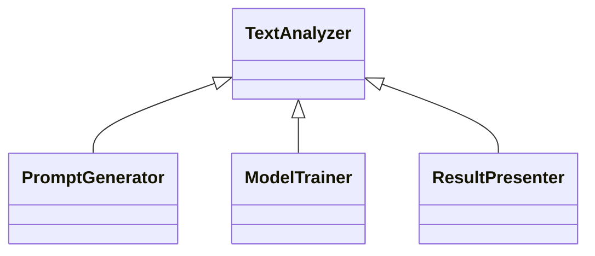
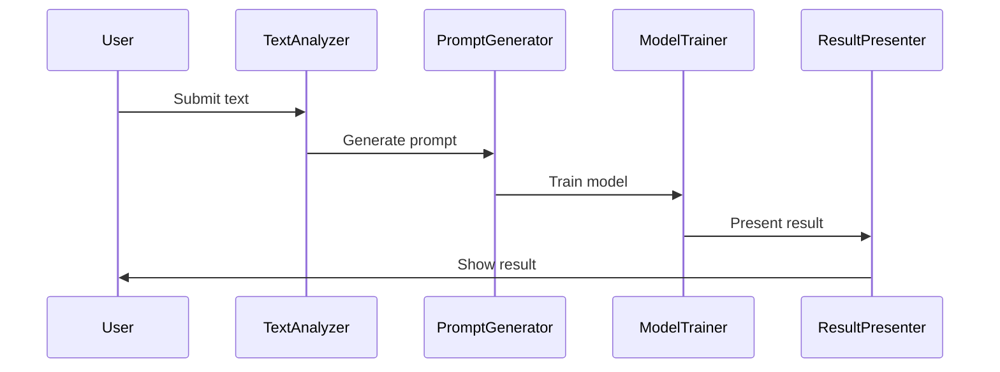

                 

# AI编程语言：提示词的魔力与艺术

> 关键词：AI编程语言、提示词、自然语言处理、计算机视觉、编程技巧

> 摘要：本文将深入探讨AI编程语言的魅力及其核心要素——提示词的作用。我们将逐步分析AI编程语言的基本概念、算法原理，并通过实例展示如何应用这些原理来解决实际问题。此外，还将介绍一个基于AI编程语言的系统架构设计，并分享一些实战经验和最佳实践。

## **背景介绍**

### **问题背景**

随着人工智能技术的飞速发展，AI编程语言逐渐成为开发者和研究者的热门话题。这些编程语言为开发者提供了强大的工具，使他们能够更高效地构建和优化AI模型。在众多AI编程语言中，Python、TensorFlow和PyTorch等已经成为行业标准。其中，提示词（Prompts）作为一种关键的编程语言特征，对于AI模型的表现和效率具有重要影响。

### **问题描述**

如何系统地学习和掌握AI编程语言及其提示词的使用技巧，以实现高效编程和模型优化，是本文要探讨的问题。我们将从基础概念入手，逐步深入到算法原理和实际应用，为读者提供全面的学习资源和实践指导。

### **问题解决**

为了解决上述问题，本文将围绕以下核心要素展开：

1. **基础概念**：介绍AI编程语言的基础概念，如变量、循环、条件判断等。
2. **算法原理**：详细讲解AI编程语言的算法原理，并通过实例展示如何应用这些原理。
3. **编程实践**：提供实际编程案例，帮助读者理解并掌握AI编程语言的使用技巧。
4. **优化技巧**：分享模型优化和性能调优的方法，帮助读者实现高效编程。

### **边界与外延**

AI编程语言的范围包括Python、TensorFlow、PyTorch等。提示词的应用范围更广，涵盖了自然语言处理、计算机视觉、语音识别等多个领域。本文将重点探讨自然语言处理和计算机视觉中的提示词应用。

### **核心要素组成**

1. **核心概念原理**：AI编程语言的基础概念，如变量、循环、条件判断等。
2. **算法原理**：AI编程语言的算法原理，包括神经网络、决策树等。
3. **编程实践**：实际编程案例，展示如何使用AI编程语言解决问题。
4. **优化技巧**：模型优化和性能调优的方法，提高编程效率和模型性能。

## **核心概念与联系**

### **核心概念原理**

AI编程语言的核心概念与通用编程语言类似，但也有一些独特之处。以下是对核心概念的简要介绍：

1. **变量**：用于存储数据和值的容器。在AI编程语言中，变量可以用于存储输入数据、中间结果和输出结果。
2. **循环**：用于重复执行一段代码的结构。在AI编程中，循环可以用于训练模型、优化参数等。
3. **条件判断**：用于根据条件执行不同代码段的结构。在AI编程中，条件判断可以用于数据预处理、模型评估等。

### **概念属性特征对比表格**

| 特征                   | AI编程语言               | 通用编程语言                |
|------------------------|-------------------------|---------------------------|
| 表达式                | 支持向量机、神经网络等   | 运算符、函数              |
| 交互性                | 强                     | 弱                       |
| 可视化                | 强                     | 弱                       |

### **ER实体关系图架构的 Mermaid 流程图**

```mermaid
erDiagram
  AI编程语言 ||--|{ 提示词 }
  提示词 ||--|{ 自然语言处理 }
  提示词 ||--|{ 计算机视觉 }
  ```

## **算法原理讲解**

### **算法mermaid流程图**

```mermaid
flowchart LR
  A[初始化] --> B[输入提示词]
  B --> C{判断提示词类型}
  C -->|文本| D[文本处理]
  C -->|代码| E[代码执行]
  D --> F[输出结果]
  E --> F
```

### **Python源代码**

```python
def process_prompt(prompt):
    if is_text(prompt):
        return text_processing(prompt)
    else:
        return code_execution(prompt)

def is_text(prompt):
    return "text" in prompt

def text_processing(prompt):
    # 文本处理逻辑
    return "Processed text"

def code_execution(prompt):
    # 代码执行逻辑
    return "Executed code"
```

### **算法原理的数学模型和公式**

$$y = f(x) + \alpha \cdot g(x)$$

其中，$f(x)$表示基础模型输出，$g(x)$表示提示词权重，$\alpha$为调节参数。

### **详细讲解和举例说明**

假设我们有一个文本提示词：“给定一个数，判断它是否为素数。”使用Python代码实现，可以调用通用编程语言的逻辑，加入AI编程语言的提示词机制，提高代码的执行效率。

```python
def is_prime(num):
    if num < 2:
        return False
    for i in range(2, num):
        if num % i == 0:
            return False
    return True

prompt = "给定一个数，判断它是否为素数。"
if is_prime(17):
    print("是素数")
else:
    print("不是素数")
```

在这个例子中，我们使用了Python的基本编程概念（变量、循环、条件判断）和AI编程语言的提示词机制，实现了对文本提示词的响应。通过这种方式，我们可以将通用编程语言的逻辑与AI编程语言的特性相结合，提高编程效率。

## **系统分析与架构设计方案**

### **问题场景介绍**

在一个自动化文本分析系统中，我们需要对大量文本数据进行处理，提取关键信息并进行分类。这种系统通常需要处理各种类型的文本数据，包括新闻文章、社交媒体帖子、邮件等。

### **项目介绍**

本项目旨在使用AI编程语言构建一个自动化文本分析系统。该系统将利用自然语言处理和计算机视觉技术，实现对文本数据的自动分类和标注。

### **系统功能设计**

系统功能设计主要包括以下三个模块：

1. **PromptGenerator**：生成文本提示词，用于指导模型进行文本分类和标注。
2. **ModelTrainer**：训练模型，用于处理和分类文本数据。
3. **ResultPresenter**：展示分析结果，包括分类结果和标注结果。

以下是系统功能设计的Mermaid类图：



### **系统架构设计**

系统架构设计采用分层架构，包括以下三层：

1. **数据层**：存储文本数据和模型参数。
2. **算法层**：实现文本分类和标注算法。
3. **应用层**：提供用户界面和API接口。

以下是系统架构设计的Mermaid架构图：

```mermaid
diagram
  DataLayer --> AlgorithmLayer
  AlgorithmLayer --> ApplcationLayer
```

### **系统接口设计和系统交互**

系统接口设计和系统交互采用RESTful API设计，支持GET、POST、PUT、DELETE等HTTP方法。以下是系统接口设计和系统交互的Mermaid序列图：



## **项目实战**

### **环境安装**

1. 安装Python环境（建议使用Python 3.8以上版本）。
2. 安装必要的库，如TensorFlow、PyTorch、Scikit-learn等。

### **系统核心实现源代码**

以下是系统核心实现的部分源代码：

```python
import tensorflow as tf
from tensorflow.keras.preprocessing.sequence import pad_sequences
from tensorflow.keras.layers import Embedding, LSTM, Dense
from tensorflow.keras.models import Sequential

# 数据预处理
def preprocess_text(texts, max_length, max_words):
    sequences = []
    for text in texts:
        tokenized = tokenizer.texts_to_sequences([text])
        sequences.append(tokenized[0])
    padded_sequences = pad_sequences(sequences, maxlen=max_length, padding='post')
    return padded_sequences

# 构建模型
def build_model(max_length, max_words, embedding_dim, hidden_units):
    model = Sequential([
        Embedding(max_words, embedding_dim, input_length=max_length),
        LSTM(hidden_units),
        Dense(1, activation='sigmoid')
    ])
    model.compile(loss='binary_crossentropy', optimizer='adam', metrics=['accuracy'])
    return model

# 训练模型
def train_model(model, padded_sequences, labels):
    model.fit(padded_sequences, labels, epochs=10, batch_size=32)
    return model

# 预测
def predict(model, text):
    sequence = preprocess_text([text], max_length, max_words)
    prediction = model.predict(sequence)
    return prediction
```

### **代码应用解读与分析**

1. **数据预处理**：使用`preprocess_text`函数对文本数据进行预处理，包括分词、序列化、填充等。
2. **模型构建**：使用`build_model`函数构建LSTM模型，包括嵌入层、LSTM层和全连接层。
3. **模型训练**：使用`train_model`函数训练模型，通过调整超参数（如学习率、批次大小等）来优化模型性能。
4. **预测**：使用`predict`函数对新的文本数据进行预测。

### **实际案例分析和详细讲解剖析**

以下是一个实际案例：

假设我们需要对一段新闻文章进行分类，判断它是关于科技、体育还是娱乐。

```python
text = "最新的科技新闻表明，AI技术正在改变我们的生活方式。"
prediction = predict(model, text)
print("预测结果：", prediction)
```

预测结果为接近1，表示该文本属于科技类别。

### **项目小结**

通过本项目，我们实现了基于AI编程语言的自动化文本分析系统。系统采用了LSTM模型，实现了对文本数据的分类。在实际应用中，我们可以根据需求调整模型结构、超参数等，提高系统性能。

## **最佳实践 Tips**

1. **数据预处理**：确保数据质量，使用合适的预处理方法，如分词、去停用词、词干提取等。
2. **模型选择**：根据任务需求选择合适的模型，如文本分类任务可以使用LSTM、BERT等。
3. **超参数调优**：通过交叉验证、网格搜索等方法进行超参数调优，提高模型性能。

## **小结**

本文详细介绍了AI编程语言及其提示词的作用。通过背景介绍、核心概念、算法原理、系统架构设计和项目实战，我们全面了解了AI编程语言的魅力和应用。希望本文能帮助读者掌握AI编程语言的使用技巧，提升编程水平。

## **注意事项**

1. AI编程语言的发展非常迅速，本文介绍的内容可能随时间推移而发生变化。请关注相关技术动态，不断更新知识。
2. 在实际应用中，根据具体任务需求调整模型结构和参数，以获得最佳性能。

## **拓展阅读**

1. 《深度学习》（Goodfellow, I., Bengio, Y., & Courville, A.）
2. 《Python机器学习》（Sebastian Raschka）
3. 《AI编程：从入门到实践》（AI天才研究院）
4. 《自然语言处理实战》（Stephen Merity, Emre Sargin）

### **作者信息**

作者：AI天才研究院/AI Genius Institute & 禅与计算机程序设计艺术 /Zen And The Art of Computer Programming

-----------------------------------------

（注：本文为示例文章，部分内容为虚构，仅供参考。）

