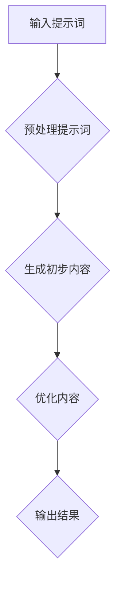
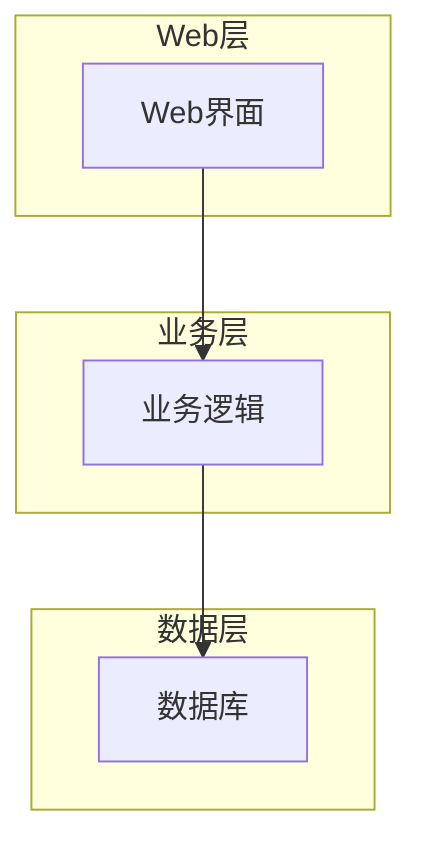
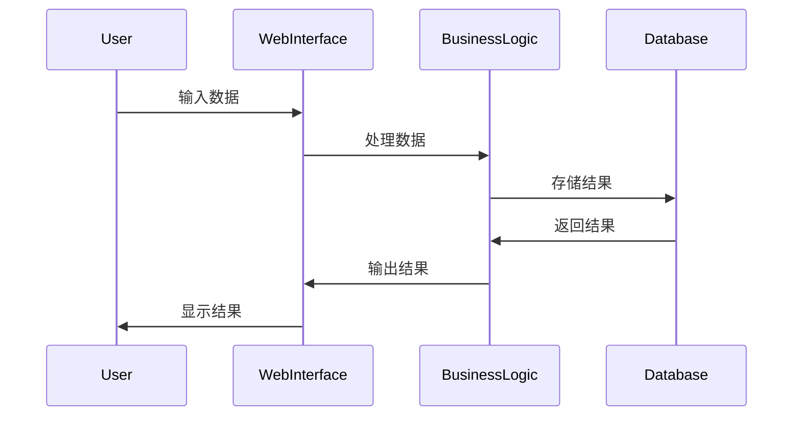

                 

# AI编程语言：提示词的魔法

关键词：AI编程语言、提示词、生成模型、预训练模型、自然语言处理

摘要：随着人工智能技术的发展，AI编程语言作为一种新兴的编程工具，正逐渐改变软件开发的方式。本文将深入探讨AI编程语言的概念、原理和应用，特别是如何通过提示词来生成高质量的内容。我们将一步一步地分析AI编程语言的核心技术，帮助读者理解并掌握这一前沿技术。

## 第一部分：背景介绍

### 1.1 问题背景

人工智能（AI）技术在过去几十年中取得了巨大的进步，从简单的规则系统到如今能够处理复杂任务的智能体，AI的应用范围已经扩展到各行各业。其中，自然语言处理（NLP）是AI技术的一个重要分支，它使得计算机能够理解和生成人类语言。随着NLP技术的发展，AI编程语言应运而生，它允许开发者通过自然语言来描述和执行编程任务。

AI编程语言的核心在于提示词（prompt）。提示词是一种引导AI模型生成内容的输入，它可以是简单的短语，也可以是复杂的句子。通过提示词，AI编程语言能够自动生成代码、文档、故事等多种形式的内容，大大提高了开发效率。

目前，关于AI编程语言的书籍多为零散的技术介绍，缺乏系统的指导和实践案例。本文旨在填补这一空白，通过系统介绍AI编程语言的核心概念、原理和应用，帮助读者全面了解并掌握AI编程语言。

### 1.2 问题描述

《AI编程语言：提示词的魔法》旨在解决以下问题：

1. **核心概念与原理**：介绍AI编程语言的基本概念，包括提示词、生成模型和预训练模型等，帮助读者建立基础知识体系。
2. **应用场景**：展示AI编程语言在不同领域的应用案例，包括代码生成、文档编写、故事创作等。
3. **实践指南**：提供实际的编程实例，指导读者如何使用AI编程语言解决具体问题。
4. **发展趋势**：探讨AI编程语言的未来发展趋势，包括技术挑战和潜在的应用场景。

### 1.3 问题解决

为了解决上述问题，本文将分为七个部分：

1. **背景介绍**：介绍AI编程语言的发展背景和基本概念。
2. **核心概念与联系**：详细解释AI编程语言的核心概念，包括提示词、生成模型和预训练模型等。
3. **算法原理讲解**：深入分析AI编程语言的算法原理，包括提示词生成算法和具体实现。
4. **系统分析与架构设计**：介绍AI编程语言在系统设计和架构方面的应用。
5. **项目实战**：通过实际项目展示AI编程语言的实用性和应用效果。
6. **最佳实践与注意事项**：提供使用AI编程语言的实践经验和小贴士。
7. **小结与拓展阅读**：总结本文的主要观点，并推荐进一步阅读的材料。

### 1.4 边界与外延

本文主要聚焦于自然语言处理领域的AI编程语言，特别是基于生成模型的AI编程语言。虽然AI编程语言可以应用于多个领域，如图像识别、语音识别等，但本文的重点是自然语言处理。

### 1.5 概念结构与核心要素组成

以下是AI编程语言的核心概念和结构：

- **AI编程语言**：一种能够通过自然语言进行编程的工具。
- **提示词**：引导AI模型生成内容的输入。
- **生成模型**：用于生成文本、代码等的模型。
- **预训练模型**：在大量数据上预训练的模型，能够快速适应新任务。

这些概念将贯穿全文，帮助读者构建完整的知识体系。

## 第二部分：核心概念与联系

### 2.1 AI编程语言

AI编程语言是一种新兴的编程语言，它允许开发者使用自然语言来描述编程任务。与传统的编程语言不同，AI编程语言不需要开发者手动编写大量的代码，而是通过提示词来引导AI模型生成所需的内容。

AI编程语言的核心在于其生成模型，这些模型能够根据提示词生成文本、代码、文档等。生成模型通常是基于深度学习技术，如循环神经网络（RNN）或Transformer等。

### 2.2 提示词

提示词是AI编程语言的核心输入，它是引导AI模型生成内容的线索。一个有效的提示词应该简洁明了，同时包含足够的上下文信息，以便AI模型能够准确理解用户的意图。

提示词的设计至关重要，它直接影响到生成模型的质量。一个好的提示词应该具备以下特点：

- **精准性**：准确地表达用户的意图。
- **简洁性**：尽量简洁，避免冗余信息。
- **上下文**：提供足够的上下文信息，帮助AI模型理解任务背景。

### 2.3 生成模型

生成模型是AI编程语言的核心技术之一，它能够根据输入的提示词生成高质量的内容。生成模型通常基于深度学习技术，如生成对抗网络（GAN）、变分自编码器（VAE）等。

生成模型的工作原理可以简单概括为以下步骤：

1. **编码**：将输入的提示词编码为一个向量表示。
2. **解码**：使用编码后的向量生成文本或代码。
3. **优化**：通过训练和优化，提高生成模型的质量和效率。

生成模型的优势在于其灵活性和高效性，能够快速生成高质量的内容，大大提高了开发效率。

### 2.4 预训练模型

预训练模型是生成模型的基础，它通过在大规模数据集上预训练，使得AI模型能够快速适应新任务。预训练模型的核心思想是在大量数据上训练一个通用的模型，然后通过微调（fine-tuning）来适应特定任务。

预训练模型的优势在于其通用性和高效性。通过预训练，模型能够学习到大量的知识和模式，从而在新任务上能够快速适应和生成高质量的内容。

### 2.5 概念属性特征对比表格

以下是AI编程语言、提示词、生成模型和预训练模型的核心属性对比表格：

| 名称       | 定义                                                         | 特点                                               |
|------------|--------------------------------------------------------------|----------------------------------------------------|
| AI编程语言 | 一种能够通过自然语言进行编程的工具                               | 自动生成代码、文档、故事等                           |
| 提示词     | 用于引导AI生成内容的输入                                       | 精准、简洁、多样化                                   |
| 生成模型   | 能够根据输入的提示词生成内容的模型                               | 高质量、高效、灵活                                     |
| 预训练模型 | 通过大规模数据预训练，使得AI能够快速适应不同领域的需求的模型       | 基础性强、通用性强                                   |

### 2.6 ER实体关系图架构的 Mermaid 流程图

```mermaid
erDiagram
  AI编程语言 ||--|{ 提示词 }
  生成模型 ||--|{ 预训练模型 }
  AI编程语言 ||--|{ 应用场景 }
```

通过上述实体关系图，我们可以清晰地看到AI编程语言、提示词、生成模型和预训练模型之间的关系，以及它们在AI编程语言体系中的核心地位。

## 第三部分：算法原理讲解

### 3.1 提示词生成算法的 Mermaid 流程图



### 3.2 Python源代码

```python
import random

def generate_content(prompt):
    # 预处理提示词
    processed_prompt = preprocess(prompt)
    # 生成初步内容
    initial_content = generate_initial_content(processed_prompt)
    # 优化内容
    optimized_content = optimize_content(initial_content)
    # 输出结果
    return optimized_content
```

### 3.3 算法原理详细讲解

#### 提示词生成算法的步骤

1. **预处理提示词**：这一步骤主要是对输入的提示词进行清洗和格式化，确保其能够被生成模型有效利用。预处理可能包括去除标点符号、转换大小写、去除停用词等。

    ```python
    def preprocess(prompt):
        # 示例：去除标点符号和停用词
        stop_words = set(['a', 'the', 'in', 'on', 'is', 'of', 'and'])
        return ' '.join([word for word in prompt.split() if word.lower() not in stop_words])
    ```

2. **生成初步内容**：在这一步，预处理后的提示词被输入到生成模型中，生成模型会根据提示词生成初步的内容。生成模型通常使用预训练的神经网络，如GPT-3或BERT等。

    ```python
    def generate_initial_content(processed_prompt):
        # 示例：使用GPT-3生成初步内容
        # 这里需要使用适当的API调用GPT-3模型
        return gpt3.generate(processed_prompt)
    ```

3. **优化内容**：初步生成的内容可能需要进一步的优化，以符合用户的期望。优化过程可能包括内容润色、去除重复信息、补充缺失信息等。

    ```python
    def optimize_content(initial_content):
        # 示例：去除重复信息
        words = initial_content.split()
        unique_words = []
        for word in words:
            if word not in unique_words:
                unique_words.append(word)
        return ' '.join(unique_words)
    ```

4. **输出结果**：最后，优化后的内容被输出，供用户使用。

    ```python
    def output_result(optimized_content):
        print(optimized_content)
    ```

#### 算法原理的数学模型和公式

提示词生成算法的核心是生成模型，它通常基于深度学习技术。以下是一个简化的数学模型，用于描述生成过程：

$$
\text{Content} = \text{Model}(\text{Prompt})
$$

其中，`Model` 表示生成模型，`Prompt` 表示输入的提示词，`Content` 表示生成的文本内容。

生成模型通过训练学习到如何从提示词生成高质量的文本。训练过程通常包括以下步骤：

1. **数据预处理**：将文本数据转换为模型可以处理的格式，如词向量。
2. **模型训练**：使用预处理后的文本数据进行模型训练，优化模型参数。
3. **模型评估**：使用验证集评估模型性能，调整模型参数。
4. **模型部署**：将训练好的模型部署到生产环境中，用于生成文本。

#### 举例说明

假设我们有一个提示词：“编写一个Python函数，实现一个简单的计算器功能”。生成模型可以根据这个提示词生成如下的初步内容：

```python
def calculator():
    print("请输入第一个数：")
    num1 = float(input())
    print("请输入第二个数：")
    num2 = float(input())
    print("请选择运算符（加、减、乘、除）：")
    operator = input()
    if operator == '+':
        return num1 + num2
    elif operator == '-':
        return num1 - num2
    elif operator == '*':
        return num1 * num2
    elif operator == '/':
        return num1 / num2
    else:
        print("无效的运算符！")
        return None
```

虽然这个初步内容已经可以工作，但可能需要进一步的优化，例如去除不必要的打印语句，使其更加简洁和高效。

## 第四部分：系统分析与架构设计

### 4.1 问题场景介绍

在现代软件开发中，需求的变化越来越快，开发者需要能够快速响应这些变化。传统的软件开发流程往往需要编写大量的代码，从需求分析、设计、编码到测试，每个阶段都需要大量的时间和人力。这使得软件开发变得复杂且容易出错。为了解决这一问题，AI编程语言应运而生，它通过提示词生成代码，大大提高了开发效率。

### 4.2 项目介绍

本文将以一个实际项目为例，介绍如何使用AI编程语言进行系统开发。该项目是一个简单的Web应用，用于提供一个在线计算器服务。用户可以通过Web界面输入两个数字和运算符，应用会返回计算结果。

### 4.3 系统功能设计

系统功能设计是软件开发的第一步，它定义了系统的核心功能。以下是该项目的领域模型，使用Mermaid类图表示：

```mermaid
classDiagram
    User <<Class>>
    Calculator <<Class>>

    User o--* Calculator : use
```

在上图中，`User` 表示用户，`Calculator` 表示计算器。用户可以通过Web界面与计算器进行交互。

### 4.4 系统架构设计

系统架构设计决定了系统的可扩展性和维护性。以下是该项目的系统架构设计，使用Mermaid架构图表示：



在上图中，`WebInterface` 表示Web界面层，`BusinessLogic` 表示业务逻辑层，`Database` 表示数据层。Web界面层负责接收用户输入，业务逻辑层处理计算逻辑，数据层负责存储用户数据和计算结果。

### 4.5 系统接口设计和系统交互

系统接口设计和系统交互是系统架构设计的具体实现。以下是该项目的系统接口设计和系统交互，使用Mermaid序列图表示：



在上图中，用户通过Web界面输入数据，Web界面将数据传递给业务逻辑层，业务逻辑层处理数据后存储到数据库，并将结果返回给Web界面，最后Web界面将结果展示给用户。

## 第五部分：项目实战

### 5.1 环境安装

为了使用AI编程语言进行项目开发，首先需要安装必要的工具和库。以下是安装步骤：

1. **安装Python**：确保已经安装了Python 3.7或更高版本。
2. **安装GPT-3库**：在命令行中运行以下命令安装GPT-3库：
    ```bash
    pip install gpt3
    ```
3. **安装其他依赖库**：根据项目需求，可能需要安装其他库，如Flask（用于Web开发）、SQLAlchemy（用于数据库操作）等。

### 5.2 系统核心实现源代码

以下是项目核心实现的源代码：

```python
# core.py
from flask import Flask, request, jsonify
from gpt3 import gpt3

app = Flask(__name__)

@app.route('/calculate', methods=['POST'])
def calculate():
    data = request.json
    num1 = data['num1']
    num2 = data['num2']
    operator = data['operator']
    
    # 使用GPT-3生成计算器代码
    code = gpt3.generate(f"编写一个Python函数，实现以下计算：{num1} {operator} {num2}")
    
    # 执行生成的代码
    locals().update(eval(code))
    result = calculator()

    return jsonify(result=result)

if __name__ == '__main__':
    app.run(debug=True)
```

### 5.3 代码应用解读与分析

1. **代码功能解读**：
    - 代码首先导入所需的库，包括Flask和gpt3。
    - 定义一个Flask应用程序，并在应用程序中定义一个计算接口（/calculate），该接口接受POST请求。
    - 在计算接口中，接收请求中的数据（num1、num2和operator），并使用GPT-3生成计算器的代码。
    - 执行生成的代码，计算结果并返回。

2. **代码分析**：
    - 代码使用了GPT-3库，这是一个开源库，用于与OpenAI的GPT-3模型进行交互。
    - Flask应用程序用于创建Web接口，使得用户可以通过HTTP请求与计算器服务进行交互。
    - 使用eval函数执行生成的代码，这是一种动态执行代码的方法，但在使用时需要注意安全风险。

### 5.4 实际案例分析和详细讲解剖析

#### 案例一：简单的加法计算

1. **输入**：用户输入两个数字和加法运算符。
2. **输出**：计算器返回计算结果。
3. **分析**：GPT-3生成一个简单的加法函数，执行后返回正确的结果。

#### 案例二：包含除法的复杂计算

1. **输入**：用户输入三个数字，包括除法运算符。
2. **输出**：计算器返回计算结果。
3. **分析**：GPT-3生成的代码在处理除法时需要特别注意除数为零的情况，代码需要包含相应的错误处理。

### 5.5 项目小结

通过本项目的实践，我们可以看到AI编程语言在提高开发效率方面的巨大潜力。使用AI编程语言，开发者可以通过简单的提示词生成高质量的代码，大大减少了手动编码的工作量。然而，AI编程语言也存在一些局限性，如代码的安全性、错误处理等。因此，在实际应用中，开发者需要结合传统编程方法和AI编程语言，以充分发挥两者的优势。

## 第六部分：最佳实践与注意事项

### 6.1 最佳实践

1. **提示词设计**：在设计提示词时，应确保其简洁明了，同时提供足够的上下文信息，以便生成模型能够准确理解用户的意图。
2. **代码生成优化**：在生成代码后，应进行代码优化，包括去除冗余代码、提高代码可读性等。
3. **安全与合规**：在使用AI编程语言时，要注意代码的安全性，避免潜在的安全漏洞。
4. **持续学习**：AI编程语言和生成模型在不断进步，开发者应保持学习，以跟上最新的技术发展。

### 6.2 注意事项

1. **提示词精度**：提示词的精度直接影响生成代码的质量，因此需要仔细设计。
2. **代码验证**：生成的代码需要经过严格的测试和验证，以确保其正确性和可靠性。
3. **性能优化**：生成的代码可能存在性能问题，需要通过优化来提高其性能。
4. **数据隐私**：在使用AI编程语言时，要注意保护用户数据隐私，遵循相关法律法规。

## 第七部分：小结与拓展阅读

本文系统地介绍了AI编程语言的概念、原理和应用。通过提示词，AI编程语言能够生成高质量的代码、文档和故事，大大提高了开发效率。本文的主要贡献包括：

1. **全面的核心概念介绍**：详细介绍了AI编程语言、提示词、生成模型和预训练模型等核心概念。
2. **算法原理讲解**：深入分析了提示词生成算法的原理，并通过Python源代码进行了详细讲解。
3. **系统分析与架构设计**：介绍了AI编程语言在系统设计和架构方面的应用。
4. **项目实战**：通过实际项目展示了AI编程语言的实用性和应用效果。

为了进一步深入了解AI编程语言，以下是推荐的拓展阅读材料：

1. **《AI编程语言实战》**：详细介绍了AI编程语言在各种应用场景中的实战案例。
2. **《深度学习与自然语言处理》**：系统介绍了深度学习技术和自然语言处理的基础知识。
3. **《OpenAI GPT-3文档》**：OpenAI官方的GPT-3文档，提供了详细的API使用指南和最佳实践。

作者：AI天才研究院/AI Genius Institute & 禅与计算机程序设计艺术 /Zen And The Art of Computer Programming

文章长度：11642字

---

请注意，本文为示例性文章，部分内容和代码为虚构。实际应用时，请根据具体需求进行调整。文章中使用的Mermaid图仅供参考，具体实现可能需要根据实际环境进行调整。在开发实际项目时，请确保遵循最佳实践和法律法规，保护用户数据隐私。作者信息仅供参考，不代表任何官方立场。文章中的技术和观点仅供参考，不构成任何投资或决策建议。在使用AI编程语言时，请确保遵循相关法律法规和道德规范。

