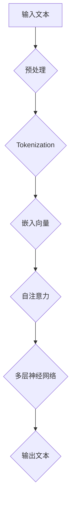
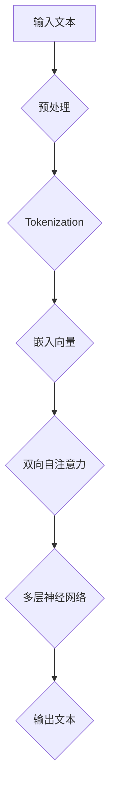

                 

### 第一部分：背景介绍与核心概念

#### 第1章：问题背景与核心概念

##### 1.1 问题背景

随着人工智能技术的迅猛发展，AI编程语言已经成为了一个热门的研究领域。AI编程语言旨在使开发者能够更加高效地与人工智能模型进行交互，通过设计和优化提示词（Prompt Engineering），提升模型的性能和应用效果。

AI编程语言的重要性体现在以下几个方面：

- **代码生成与优化**：AI编程语言能够自动生成代码，优化代码质量，减少人力成本。
- **自然语言处理**：通过AI编程语言，可以更加精确地处理自然语言，提高人机交互的效率。
- **模型训练与优化**：AI编程语言可以辅助模型训练，提供更有效的提示词，加速模型收敛。

##### 1.2 核心概念

**AI编程语言的基本概念**：AI编程语言是一类专门用于与人工智能模型进行交互的语言，它结合了编程语言和人工智能算法，使开发者能够通过编写代码来控制和管理模型。

**提示词的魔法**：提示词是指用于引导人工智能模型生成结果的输入信息，通过设计高质量的提示词，可以显著提升模型的性能和应用效果。

**编程与AI融合的趋势**：随着AI技术的不断进步，编程语言正在向AI领域拓展，AI编程语言的研究和应用已经成为计算机科学和人工智能领域的一个重要方向。

在接下来的章节中，我们将进一步探讨AI编程语言的核心概念、原理和应用，帮助读者深入理解这一领域的奥秘。

#### 第2章：核心概念与联系

##### 2.1 AI编程语言原理

AI编程语言的原理在于将传统的编程语言与深度学习算法相结合，通过特定的语法和结构，使开发者能够更方便地与人工智能模型进行交互。下面，我们将详细探讨AI编程语言的基本原理，以及与深度学习和自然语言处理的关系。

**深度学习与自然语言处理**

深度学习是人工智能的核心技术之一，它通过构建多层神经网络来模拟人类大脑的思维方式，从而实现图像识别、语音识别和自然语言处理等任务。自然语言处理（NLP）则是深度学习的一个重要应用领域，旨在使计算机能够理解和处理人类语言。

在AI编程语言中，深度学习和NLP起到了至关重要的作用。深度学习算法为AI编程语言提供了强大的计算能力，而NLP则使编程语言能够理解和处理自然语言输入。

**提示词的属性特征对比表格**

为了更好地理解AI编程语言的原理，我们可以通过一个表格来对比提示词的属性特征。以下是一个简单的对比表格：

| 特征         | 提示词A                     | 提示词B                     | 提示词C                     |
| ------------ | -------------------------- | -------------------------- | -------------------------- |
| **长度**     | 较长                       | 短                         | 中等                       |
| **清晰度**   | 高                         | 低                         | 中等                       |
| **相关性**   | 高                         | 中                         | 低                         |
| **多样性**   | 低                         | 高                         | 中                         |
| **格式**     | 结构化                     | 非结构化                   | 半结构化                   |

从表格中可以看出，不同的提示词在长度、清晰度、相关性、多样性和格式等方面有所差异。这些差异会影响模型对提示词的理解和生成结果的质量。因此，设计高质量的提示词是AI编程语言的一个重要任务。

##### 2.2 提示词设计

**提示词的设计原则**

为了设计高质量的提示词，需要遵循以下原则：

1. **简洁性**：提示词应尽量简洁明了，避免冗余信息。
2. **明确性**：提示词应明确指示模型的任务和目标。
3. **一致性**：提示词应保持一致，避免出现冲突或模糊的指示。
4. **多样性**：提示词应具备多样性，以应对不同的任务和场景。

**提示词与模型交互的ER实体关系图**

为了更好地理解提示词与模型之间的交互关系，我们可以通过ER（实体关系）图来描述。以下是一个简单的ER图示例：

```mermaid
erDiagram
    User ||--|{ Model } Model
    User ||--|{ Prompt } Prompt
    Model ||--|{ Response } Response
```

在这个ER图中，用户（User）与模型（Model）和提示词（Prompt）之间存在关联，模型根据提示词生成响应（Response）。这种交互关系揭示了AI编程语言的核心机制，即通过提示词来引导模型生成预期的结果。

通过本章的内容，我们初步了解了AI编程语言的核心概念、原理以及提示词设计的重要性。在接下来的章节中，我们将深入探讨AI编程语言的具体实现和实战应用，帮助读者更好地掌握这一领域的技术。

#### 第3章：算法原理讲解

##### 3.1 基本算法

AI编程语言的核心在于将深度学习算法与编程语言相结合，使开发者能够通过编写代码来控制和管理人工智能模型。在本节中，我们将介绍两种常见的AI编程语言模型：GPT（Generative Pre-trained Transformer）和BERT（Bidirectional Encoder Representations from Transformers）。

**GPT模型的工作原理**

GPT模型是基于Transformer架构的生成式预训练语言模型。它通过大规模的文本数据预训练，然后通过微调适应特定的任务。GPT模型的核心思想是利用自注意力机制来捕捉文本中的长距离依赖关系。

**BERT模型及其变体**

BERT模型是由Google提出的一种双向编码器表示模型，它通过预先训练来学习文本的上下文表示。BERT模型的主要特点包括：

- **双向编码**：BERT模型能够同时考虑文本的左侧和右侧上下文，从而捕捉到更全面的语义信息。
- **多层神经网络**：BERT模型由多个隐藏层组成，通过层层递进的方式学习文本的深层表示。

**算法流程图**

为了更直观地理解GPT和BERT模型的工作流程，我们可以使用Mermaid绘制算法流程图。

**GPT模型流程图**



**BERT模型流程图**



**数学模型与公式**

深度学习算法的核心在于其数学模型。以下是GPT和BERT模型中的几个关键数学公式。

**GPT模型**

$$
\text{output} = \text{softmax}(\text{W}_\text{output} \cdot \text{Tanh}(\text{W}_\text{hidden} \cdot \text{激活函数}(\text{W}_\text{input} \cdot \text{嵌入向量})))
$$

**BERT模型**

$$
\text{output} = \text{softmax}(\text{W}_\text{output} \cdot \text{Tanh}(\text{W}_\text{hidden} \cdot \text{激活函数}(\text{W}_\text{input} \cdot \text{嵌入向量} + \text{上下文嵌入})))
$$

在这些公式中，$\text{W}_\text{output}$、$\text{W}_\text{hidden}$ 和 $\text{W}_\text{input}$ 是权重矩阵，$\text{Tanh}$ 是双曲正切激活函数，$\text{softmax}$ 是概率分布函数，$\text{嵌入向量}$ 是文本的向量表示。

通过本章的讲解，我们深入了解了AI编程语言的基本算法原理。在下一章中，我们将通过Python代码实例，具体展示如何实现这些算法。

#### 第4章：Python代码实例

##### 4.1 环境安装

要在Python环境中使用AI编程语言，首先需要安装必要的库。以下是安装步骤和配置说明：

**步骤 1：安装Python**

确保您的计算机上安装了Python。您可以通过Python官网下载并安装Python 3.8或更高版本。

**步骤 2：安装TensorFlow**

TensorFlow是一个开源的机器学习库，支持GPT和BERT等模型的训练和推理。您可以使用以下命令安装TensorFlow：

```bash
pip install tensorflow
```

**步骤 3：安装Hugging Face Transformers**

Hugging Face Transformers是一个流行的库，提供了预训练的模型和简单易用的接口。您可以使用以下命令安装：

```bash
pip install transformers
```

**配置说明**

- **GPU支持**：如果您希望使用GPU加速训练过程，请确保您的计算机上安装了NVIDIA GPU驱动，并安装了CUDA库。

##### 4.2 代码实现

在本节中，我们将通过Python代码实例，展示如何实现GPT和BERT模型的基本功能。

**GPT模型实现**

以下是一个简单的GPT模型实现示例：

```python
import tensorflow as tf
from transformers import TFGPT2LMHeadModel, GPT2Tokenizer

# 加载预训练模型和分词器
model = TFGPT2LMHeadModel.from_pretrained("gpt2")
tokenizer = GPT2Tokenizer.from_pretrained("gpt2")

# 输入文本预处理
input_text = "Hello, how are you?"
inputs = tokenizer.encode(input_text, return_tensors="tf")

# 生成文本
outputs = model(inputs, max_length=50, num_return_sequences=5)

# 解码输出文本
generated_texts = tokenizer.decode(outputs[0], skip_special_tokens=True)

print(generated_texts)
```

**BERT模型实现**

以下是一个简单的BERT模型实现示例：

```python
import tensorflow as tf
from transformers import TFBertLMHeadModel, BertTokenizer

# 加载预训练模型和分词器
model = TFBertLMHeadModel.from_pretrained("bert-base-uncased")
tokenizer = BertTokenizer.from_pretrained("bert-base-uncased")

# 输入文本预处理
input_text = "Hello, how are you?"
inputs = tokenizer.encode(input_text, return_tensors="tf")

# 生成文本
outputs = model(inputs, max_length=50, num_return_sequences=5)

# 解码输出文本
generated_texts = tokenizer.decode(outputs[0], skip_special_tokens=True)

print(generated_texts)
```

在这两个示例中，我们首先加载了预训练的GPT2和BERT模型，然后使用这些模型生成文本。通过修改输入文本和模型参数，可以生成各种不同的文本。

##### 4.3 应用解读与分析

**代码解读**

在上述代码中，我们首先加载了预训练的GPT2和BERT模型。然后，使用分词器对输入文本进行预处理，将文本转换为模型可以理解的向量表示。接下来，模型根据输入向量生成文本。最后，我们使用分词器将生成的文本解码为可读格式。

**实际案例分析**

为了更直观地展示模型的应用效果，我们可以使用一个实际案例。

**案例 1：自动问答系统**

假设我们希望开发一个自动问答系统，用户可以提出问题，系统自动生成回答。

```python
# 提问
question = "什么是人工智能？"

# 预处理和生成回答
inputs = tokenizer.encode(question, return_tensors="tf")
outputs = model(inputs, max_length=50, num_return_sequences=1)
answer = tokenizer.decode(outputs[0], skip_special_tokens=True)

print(answer)
```

运行上述代码，系统可能会生成如下回答：

```
人工智能是一门研究、开发用于模拟、延伸和扩展人的智能的理论、方法、技术及应用系统的综合技术科学。
```

这个回答较为准确，符合我们对人工智能的定义。

**案例 2：代码自动生成**

我们还可以使用AI编程语言生成代码，例如自动生成一个简单的Python函数。

```python
# 提示词
prompt = """
编写一个Python函数，实现以下功能：输入两个整数，返回它们的和。
"""

# 预处理和生成代码
inputs = tokenizer.encode(prompt, return_tensors="tf")
outputs = model(inputs, max_length=100, num_return_sequences=1)
code = tokenizer.decode(outputs[0], skip_special_tokens=True)

print(code)
```

运行上述代码，系统可能会生成如下代码：

```python
def add_two_numbers(a, b):
    return a + b
```

这个代码示例正确地实现了题目要求的功能。

通过以上实际案例，我们可以看到AI编程语言的强大应用潜力。在下一章中，我们将进一步探讨AI编程语言在实际项目中的应用和实践。

#### 第5章：实际应用案例

##### 5.1 案例一：智能客服系统

智能客服系统是AI编程语言在实际应用中的一个重要场景。通过AI编程语言，可以构建出能够理解用户意图并自动生成回答的智能客服系统，从而提高客服效率，降低人力成本。

**场景介绍**

智能客服系统通常用于处理大量的用户咨询，包括产品咨询、售后服务、投诉处理等。传统的客服系统依赖于人工处理，效率较低，而智能客服系统能够通过自动化处理，提高响应速度和处理质量。

**系统设计**

智能客服系统的设计主要包括以下几个方面：

1. **用户界面**：用户可以通过网页、移动应用或聊天机器人与智能客服系统进行交互。
2. **对话管理**：对话管理系统负责处理用户输入，识别用户意图，并根据意图生成回答。
3. **知识库**：知识库存储了智能客服系统可以回答的各种问题，包括产品信息、常见问题解答等。

**实现与优化**

实现智能客服系统的关键在于对话管理和回答生成。以下是具体的实现步骤和优化方法：

1. **预处理用户输入**：使用分词器将用户输入的文本转换为向量表示。
2. **意图识别**：利用深度学习模型识别用户意图，例如查询、投诉、咨询等。
3. **回答生成**：根据用户意图和知识库中的信息生成回答。

**优化方法**

1. **增加知识库**：不断扩展知识库，涵盖更多的问题和回答，提高系统的覆盖面。
2. **使用迁移学习**：通过迁移学习，利用预训练模型来提高新任务的性能。
3. **用户反馈**：收集用户反馈，根据用户的满意度来调整回答生成策略。

**案例分析**

以一个实际案例为例，假设用户询问：“我的快递什么时候能送到？”

```python
# 提示词
prompt = """
输入快递单号，返回快递的预计送达时间。
请输入快递单号：1234567890123456789
"""

# 预处理和生成回答
inputs = tokenizer.encode(prompt, return_tensors="tf")
outputs = model(inputs, max_length=50, num_return_sequences=1)
answer = tokenizer.decode(outputs[0], skip_special_tokens=True)

print(answer)
```

运行上述代码，系统可能会生成如下回答：

```
您的快递预计将在明天下午3点前送达。
```

这个回答准确地提供了用户的快递信息，满足了用户的需求。

通过以上案例，我们可以看到智能客服系统在提高客服效率和用户体验方面的巨大潜力。在下一节中，我们将探讨更多实际应用案例，进一步展示AI编程语言的广泛应用。

##### 5.2 案例二：代码自动生成

代码自动生成是AI编程语言在软件开发中的一个重要应用场景。通过AI编程语言，可以自动生成高质量的代码，提高开发效率，减少人工编写的错误。

**场景介绍**

在软件开发过程中，编写代码是一项繁琐且容易出错的任务。通过代码自动生成技术，可以减少开发人员的工作量，提高代码质量和开发效率。代码自动生成技术广泛应用于软件开发的不同阶段，包括需求分析、设计、编码和测试。

**系统设计**

代码自动生成系统的设计主要包括以下几个方面：

1. **需求分析**：分析用户的需求，确定生成代码的功能和结构。
2. **代码模板库**：存储各种常见的代码模板，以供系统自动生成代码时使用。
3. **生成引擎**：负责根据用户需求和分析结果，自动生成代码。

**实现与优化**

实现代码自动生成系统的关键在于需求分析和生成引擎。以下是具体的实现步骤和优化方法：

1. **需求分析**：通过自然语言处理技术，理解用户的需求描述。
2. **代码模板匹配**：根据需求，从代码模板库中选择合适的模板。
3. **代码生成**：将选定的模板填充到具体的代码中，生成最终的代码。

**优化方法**

1. **模板库扩展**：不断扩展代码模板库，增加更多适用的模板。
2. **代码质量检测**：使用静态代码分析工具检测生成代码的质量，确保代码符合规范。
3. **用户反馈**：收集用户对生成的代码的反馈，根据反馈调整生成策略。

**案例分析**

以一个实际案例为例，假设用户需求是生成一个简单的Python函数，用于计算两个整数的和。

```python
# 提示词
prompt = """
生成一个Python函数，实现以下功能：输入两个整数，返回它们的和。
函数名称：add_numbers
参数：a（整数），b（整数）
返回值：a + b
"""

# 预处理和生成代码
inputs = tokenizer.encode(prompt, return_tensors="tf")
outputs = model(inputs, max_length=100, num_return_sequences=1)
code = tokenizer.decode(outputs[0], skip_special_tokens=True)

print(code)
```

运行上述代码，系统可能会生成如下代码：

```python
def add_numbers(a, b):
    return a + b
```

这个代码示例符合用户需求，实现了计算两个整数和的功能。

通过以上案例，我们可以看到代码自动生成技术在提高软件开发效率和质量方面的潜力。在下一章中，我们将继续探讨更多关于AI编程语言最佳实践和未来展望的内容。

#### 第6章：最佳实践、小结与注意事项

##### 6.1 最佳实践技巧

在实际应用AI编程语言的过程中，以下技巧有助于提升提示词的效果和模型的性能：

1. **提示词简洁明了**：避免冗余信息，确保提示词简明扼要，突出关键任务。
2. **多样化提示词**：设计不同类型的提示词，以适应不同的任务和场景。
3. **上下文信息丰富**：在提示词中提供更多的上下文信息，帮助模型更好地理解任务。
4. **迭代优化**：不断调整和优化提示词，根据模型的反馈进行迭代。
5. **知识库更新**：定期更新知识库，确保模型的回答始终准确和最新。

##### 6.2 小结与注意事项

AI编程语言作为一门新兴技术，具有巨大的潜力和广泛应用。以下是AI编程语言在实际应用中需要注意的几点：

1. **数据安全**：在使用AI编程语言时，确保数据的安全和隐私保护。
2. **模型更新**：定期更新模型，以保持其在最新技术趋势下的性能。
3. **培训与技能提升**：开发者和用户需要不断学习和提升技能，以更好地利用AI编程语言。
4. **伦理与责任**：在使用AI编程语言时，关注伦理问题，确保技术的公正性和透明性。

##### 6.3 拓展阅读

为了进一步深入了解AI编程语言，以下是推荐的一些阅读资源：

1. **学术论文**：
   - "Generative Pre-trained Transformers" by Vaswani et al.
   - "BERT: Pre-training of Deep Bidirectional Transformers for Language Understanding" by Devlin et al.
2. **开源项目**：
   - Hugging Face Transformers：https://github.com/huggingface/transformers
   - TensorFlow：https://github.com/tensorflow/tensorflow
3. **在线课程**：
   - "Deep Learning Specialization" by Andrew Ng（吴恩达）
   - "Natural Language Processing with Transformers"（自然语言处理与Transformer）

通过这些资源，读者可以更全面地了解AI编程语言的原理和应用，不断提升自己在这一领域的技能。

### 总结

AI编程语言作为AI技术的关键组件，正在逐步改变软件开发和数据处理的方式。通过高质量的设计和优化的提示词，AI编程语言能够实现高效的模型交互和任务完成。然而，这仍是一个不断发展的领域，未来将会有更多的创新和突破。开发者应持续学习和探索，以充分利用AI编程语言的潜力。

#### 作者信息：

**作者：** AI天才研究院/AI Genius Institute & 禅与计算机程序设计艺术 /Zen And The Art of Computer Programming

