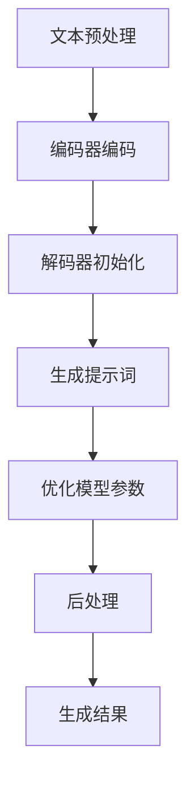
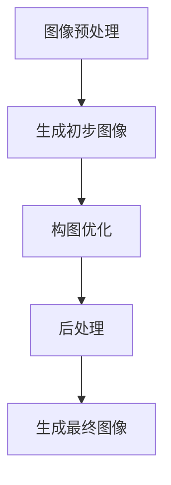
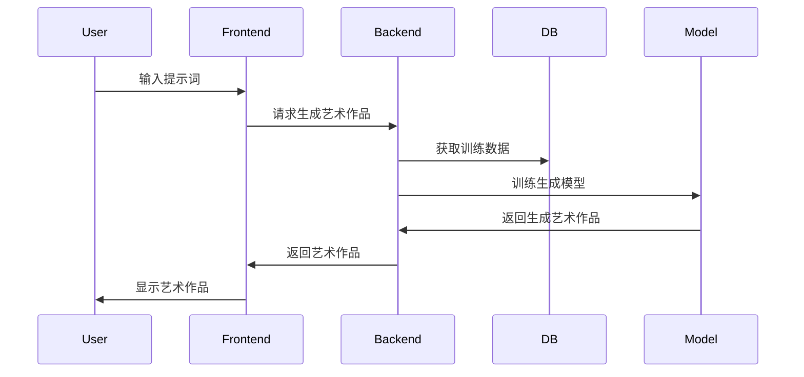
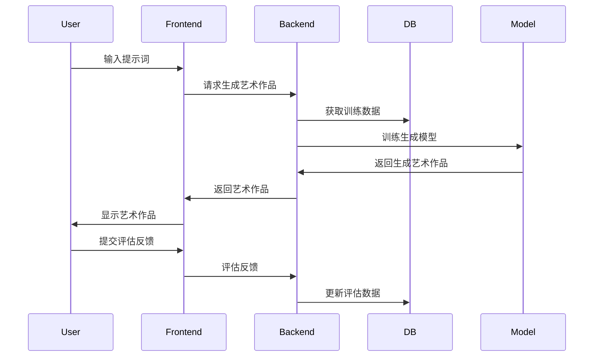

                 


### 1.2 AI视觉艺术生成概述

#### 1.2.1 问题描述

AI视觉艺术生成是一个相对较新的研究领域，旨在利用人工智能技术，尤其是深度学习和生成对抗网络（GANs）等算法，自动生成具有艺术价值的视觉内容。这一领域不仅涵盖了传统艺术创作的自动化，还拓展到了全新的创作模式和表达方式。

在当代艺术领域，AI视觉艺术生成正成为一种重要的趋势。例如，艺术家们开始使用生成对抗网络来创作独特的视觉作品，这些作品在形式和内容上常常超越了人类艺术家的传统创作方法。此外，AI视觉艺术生成在广告设计、电影特效、游戏开发等领域也有着广泛的应用。

#### 1.2.2 AI视觉艺术生成的定义与重要性

AI视觉艺术生成可以定义为一种利用机器学习和计算机视觉技术，自动生成视觉艺术内容的过程。这个过程通常涉及以下关键步骤：

1. **数据收集与预处理**：收集大量的艺术作品作为训练数据集，并对这些数据进行预处理，以便机器学习模型能够更好地理解艺术风格和内容。
2. **模型训练**：使用深度学习算法，如生成对抗网络（GANs）、变分自编码器（VAEs）等，对收集到的数据集进行训练，以学会生成艺术作品。
3. **艺术作品生成**：通过训练好的模型，生成新的艺术作品。这些作品可以是基于特定风格的艺术品，也可以是根据特定主题或需求的定制内容。

AI视觉艺术生成的重要性体现在以下几个方面：

1. **创新艺术形式**：通过自动化艺术创作，AI可以探索新的艺术形式和风格，为艺术家们提供更多的创作灵感和可能性。
2. **提高创作效率**：AI视觉艺术生成可以帮助艺术家们更快速地完成创作过程，从而提高工作效率。
3. **艺术普及与教育**：AI视觉艺术生成技术可以降低艺术创作的门槛，使更多的人能够参与到艺术创作中来，从而促进艺术的普及与教育。

### 1.3 AI视觉艺术生成在当代艺术领域的应用

在当代艺术领域，AI视觉艺术生成技术已经得到了广泛的应用。以下是一些具体的应用场景：

1. **艺术品的自动化创作**：艺术家们可以利用生成对抗网络（GANs）等技术，自动生成具有独特风格的艺术品。这些作品不仅在形式上具有创新性，而且在内容上也往往能够触动人心。

2. **广告与品牌设计**：广告设计师可以利用AI视觉艺术生成技术，快速生成具有吸引力的广告图像和品牌标志。这不仅提高了设计效率，还增强了广告的视觉效果。

3. **电影与游戏开发**：电影特效师和游戏开发者可以利用AI视觉艺术生成技术，自动生成高质量的场景、角色和特效。这大大减少了手工绘制和雕刻的工作量，提高了制作效率。

4. **个性化艺术创作**：通过AI视觉艺术生成技术，艺术家们可以为每位客户提供个性化的艺术作品。例如，根据客户的喜好和需求，自动生成独特的肖像画或风景画。

总之，AI视觉艺术生成技术正在当代艺术领域引发一场革命。它不仅为艺术家们提供了新的创作工具，还拓展了艺术的表现形式和表达方式。随着技术的不断进步，AI视觉艺术生成在未来必将继续影响和改变艺术世界的面貌。

### 1.2 提示词构图技巧的核心概念

#### 1.2.1 提示词的定义与作用

提示词（Prompt）在AI视觉艺术生成中起着至关重要的作用。它是一个描述性短语或句子，用于引导生成模型生成特定的视觉内容。提示词可以提供关于图像风格、主题、情感或场景的详细信息，从而帮助模型更准确地理解用户的意图，并生成符合期望的艺术作品。

提示词的作用主要体现在以下几个方面：

1. **引导模型生成**：通过提供明确的提示词，用户可以指导生成模型生成特定类型的艺术作品。例如，用户可以使用提示词“风景油画”、“抽象艺术”或“现代艺术”，来指定生成模型所应遵循的艺术风格。

2. **提高创作效率**：使用提示词可以大大提高艺术生成的效率。用户无需花费大量时间描述他们的创作需求，生成模型可以根据简短的提示词快速生成符合期望的图像。

3. **增强用户体验**：通过精确的提示词，用户可以更清晰地表达他们的创作意图，从而获得更满意的生成结果。这有助于提高用户的满意度和参与度。

#### 1.2.2 提示词在AI视觉艺术生成中的重要性

提示词在AI视觉艺术生成中的重要性不可忽视。以下是几个关键原因：

1. **清晰明确的指令**：提示词为生成模型提供了清晰明确的指令，使模型能够准确地理解用户的创作意图。这对于生成高质量的视觉艺术作品至关重要。

2. **多样化创作**：通过使用不同的提示词，用户可以探索多样化的艺术创作方向。例如，用户可以使用“自然景观”提示词生成自然风景画，使用“都市夜景”提示词生成城市夜景画。

3. **个性化定制**：提示词允许用户根据个人喜好和需求定制艺术作品。例如，用户可以使用特定的提示词来生成符合他们个人风格的肖像画或风景画。

4. **增强创作灵感**：提示词可以激发艺术家的创作灵感，帮助他们探索新的艺术风格和表达方式。通过尝试不同的提示词，艺术家可以不断拓宽自己的创作视野。

总之，提示词在AI视觉艺术生成中扮演着关键角色。它不仅为用户提供了便捷的创作工具，还大大提高了艺术生成的效率和多样性。随着技术的不断进步，提示词在AI视觉艺术生成中的作用将变得更加重要和多样化。

### 1.3 构图技巧的定义与分类

#### 1.3.1 构图技巧的基本概念

构图技巧是指艺术家在创作过程中，通过合理安排图像中各个元素的位置、大小、颜色和纹理等，来构建具有视觉吸引力和艺术感染力的画面。这些技巧包括线条、色彩、形状、空间和比例等多个方面。构图技巧在视觉艺术创作中起着至关重要的作用，它不仅决定了作品的视觉效果，还影响了观众的感受和情绪。

构图技巧的基本概念可以概括为以下几点：

1. **视觉引导**：通过合理的构图，艺术家可以引导观众的视线在图像中流动，从而产生特定的视觉效果和感受。
2. **平衡与对比**：平衡和对比是构图技巧中的核心概念。通过合理运用这两种技巧，艺术家可以创造出和谐而又充满变化的画面。
3. **节奏与韵律**：构图中的节奏和韵律是指图像中各个元素在大小、形状、颜色和位置等方面的变化，这种变化可以创造出富有韵律感的视觉效果。
4. **焦点与透视**：焦点是指图像中最吸引观众注意力的部分，而透视则是指通过近大远小等视觉效果来表现深度和空间感。

#### 1.3.2 常见的构图技巧分类

构图技巧可以根据不同的分类标准进行分类，以下是几种常见的分类方法：

1. **几何构图**：几何构图主要依赖于几何形状和线条来构建画面。常见的几何构图技巧包括对称、黄金分割、三分法等。

   - **对称**：对称构图通过将画面分成两个镜像的部分，创造出平衡感和秩序感。
   - **黄金分割**：黄金分割是一种经典的构图技巧，它通过将画面分成两个部分，使得较长部分与整体的比例接近黄金比例（约1:1.618）。
   - **三分法**：三分法是将画面分成三个等分部分，物体或焦点通常放置在这些分割线上或分割点的位置上，以创造出动态感和空间感。

2. **动态构图**：动态构图强调画面中的运动感和动态变化。常见的动态构图技巧包括引导线、曲线、对比等。

   - **引导线**：引导线是指通过画面的线条引导观众的视线，使视线自然流动到画面的重点。
   - **曲线**：曲线构图通过曲线形状来创造流动感和动态感，使得画面更加生动。
   - **对比**：通过对比不同元素之间的颜色、形状、大小等，可以创造出强烈的视觉冲击力。

3. **色彩构图**：色彩构图通过合理运用色彩来增强画面的视觉效果。常见的色彩构图技巧包括对比色、互补色、色相环等。

   - **对比色**：对比色是指两种颜色在色相环中相对立的颜色组合，如红与绿、黄与紫等。对比色可以创造出强烈的视觉对比效果。
   - **互补色**：互补色是指两种颜色在色相环中相隔180度的颜色组合，如红与绿、黄与紫等。互补色组合可以产生高度饱和和醒目的视觉效果。
   - **色相环**：色相环是通过将不同颜色的色相按环状排列，来展示它们之间的关系。通过在色相环中选择相邻或相隔的颜色组合，可以创造出和谐或对比的视觉效果。

通过掌握这些常见的构图技巧，艺术家可以更好地运用构图来增强作品的视觉效果和艺术表现力。不同的构图技巧可以互相结合，创造出丰富多彩的艺术作品。

### 1.4 提示词构图技巧的边界与外延

#### 1.4.1 提示词构图技巧的应用范围

提示词构图技巧在AI视觉艺术生成中具有广泛的应用范围。以下是几个主要的应用领域：

1. **数字艺术创作**：提示词构图技巧可以帮助数字艺术家快速生成具有特定风格和主题的艺术作品。例如，使用“印象派风格”的提示词可以生成类似莫奈的画作，而使用“抽象艺术”的提示词则可以生成抽象派的艺术作品。

2. **电影与游戏设计**：在电影和游戏制作中，提示词构图技巧可以用于自动生成场景和角色。例如，通过“中世纪城堡”的提示词，可以生成符合中世纪风格的城市景观，而通过“科幻场景”的提示词，则可以生成未来风格的场景。

3. **商业设计**：在广告、品牌设计和宣传海报等领域，提示词构图技巧可以帮助设计师快速生成具有吸引力和创意的图像。例如，通过“夏日海滩”的提示词，可以生成一张充满夏日气息的海滩海报，而通过“情人节”的提示词，则可以生成一张浪漫的情人节海报。

4. **个性化创作**：提示词构图技巧还可以用于个性化创作，根据用户的喜好和需求生成专属的艺术作品。例如，通过用户的个人喜好提示词，可以生成符合他们独特风格的肖像画或风景画。

#### 1.4.2 提示词构图技巧的未来发展方向与挑战

随着技术的不断进步，提示词构图技巧在AI视觉艺术生成中的未来发展前景十分广阔。以下是一些可能的发展方向和面临的挑战：

1. **更精细的构图控制**：未来的提示词构图技巧将允许用户以更精细的方式控制图像中的各个元素。例如，用户可以指定特定颜色、形状或纹理的位置和大小，从而生成更加符合个人需求的图像。

2. **多模态融合**：提示词构图技巧可以与自然语言处理、音频处理等其他AI技术相结合，实现多模态的艺术生成。例如，用户可以通过输入一段描述性文字和一段背景音乐，来生成具有特定情感和氛围的艺术作品。

3. **实时创作**：未来的提示词构图技巧将可以实现实时艺术创作，用户可以实时调整提示词和构图参数，以快速生成和修改艺术作品。

4. **个性化推荐**：基于用户的历史偏好和反馈，AI系统可以提供个性化的构图技巧推荐，帮助用户更高效地创作出满意的艺术作品。

然而，提示词构图技巧的发展也面临着一些挑战：

1. **算法复杂性**：随着构图技巧的精细化和多模态融合，算法的复杂性将大幅增加，这需要更高性能的计算资源和更优化的算法设计。

2. **数据质量和多样性**：高质量的训练数据和多样化的数据集对于生成模型的效果至关重要。未来的研究需要解决数据质量和多样性问题，以进一步提高艺术生成的质量和创造力。

3. **用户界面和交互设计**：为了使提示词构图技巧更加易用和用户友好，需要开发更加直观和交互性强的用户界面。用户界面设计应注重用户体验，使不同技术背景的用户都能够轻松地使用这些工具。

4. **伦理和版权问题**：随着AI视觉艺术生成技术的普及，如何确保艺术作品的原创性和版权问题将成为重要议题。需要制定相应的法律和伦理规范，以保障艺术家的权益和艺术创作的合法性。

总之，提示词构图技巧在AI视觉艺术生成中具有巨大的应用潜力，未来的发展方向和挑战将推动这一领域不断前进，为艺术家和用户提供更加丰富和多样化的创作工具和体验。

### 1.5 核心概念原理与属性特征对比表格

在深入探讨AI视觉艺术生成中的提示词构图技巧之前，我们需要了解核心概念原理以及它们的属性特征。本节将提供核心概念原理的简要概述，并通过属性特征对比表格进行详细分析。

#### 1.5.1 核心概念原理

1. **提示词生成算法原理**：
   提示词生成算法的核心目标是根据用户提供的输入（如文本描述或关键词），生成相应的文本提示词。这些提示词用于指导图像生成模型，从而生成符合用户期望的艺术作品。主要原理包括：
   - **文本预处理**：对输入文本进行分词、去停用词、词性标注等处理，以提取关键信息。
   - **编码器-解码器架构**：使用深度学习模型（如Transformer或BERT）进行编码和解码，以生成高质量的提示词。
   - **损失函数**：通过最小化预测提示词与目标提示词之间的差异，优化模型参数。

2. **构图技巧算法原理**：
   构图技巧算法的核心目标是在图像生成过程中，根据用户提供的提示词，合理安排图像中的各个元素，以生成具有艺术美感的视觉内容。主要原理包括：
   - **图像预处理**：对输入图像进行滤波、色彩调整、尺寸变换等处理，以适应图像生成模型的要求。
   - **生成对抗网络（GANs）**：利用生成器和判别器之间的对抗训练，生成逼真的图像内容。
   - **后处理**：对生成的图像进行色彩增强、细节优化等处理，以提高图像质量。

#### 1.5.2 属性特征对比表格

| 特性 | 提示词生成算法 | 构图技巧算法 |
| --- | --- | --- |
| **目标** | 生成文本提示词 | 生成图像中的构图元素 |
| **输入** | 文本描述、关键词 | 提示词、图像数据 |
| **输出** | 文本提示词 | 图像内容 |
| **处理方式** | 文本编码、解码 | 图像生成、后处理 |
| **核心模型** | 编码器-解码器架构、Transformer、BERT | 生成对抗网络（GANs）、变分自编码器（VAEs） |
| **应用场景** | 艺术创作指导、文本生成 | 数字艺术、游戏设计、广告创作 |
| **评价指标** | 提示词的语义一致性、流畅性 | 图像的真实性、艺术美感 |
| **挑战** | 文本理解和生成难度 | 图像内容和构图的协调性 |
| **扩展性** | 易于集成其他文本处理技术 | 需要复杂图像处理模块 |

通过上述对比表格，我们可以更清晰地理解提示词生成算法和构图技巧算法之间的区别和联系。这两个核心概念在AI视觉艺术生成中相辅相成，共同推动艺术创作的发展。

### 1.6 提示词生成算法原理

#### 1.6.1 算法流程

提示词生成算法通常包括以下几个主要步骤：

1. **文本预处理**：这一步骤涉及对用户输入的文本进行清洗和规范化。具体操作包括去除停用词、标点符号，进行词性标注和词干提取等。这些操作有助于提取文本中的关键信息，从而为后续的生成步骤提供更高质量的数据。

2. **编码器-解码器架构**：编码器负责将预处理后的文本转换成一个固定长度的向量表示，这个向量包含了文本中的主要语义信息。解码器则使用这个向量来生成提示词。常用的编码器-解码器架构包括Transformer、BERT等。

3. **生成提示词**：解码器根据编码器输出的向量，逐步生成每个提示词。这个过程通常采用自回归模型，即每个生成的词都基于前一个词的上下文。解码器会不断更新上下文状态，以生成更符合语义一致的提示词。

4. **优化模型参数**：通过训练过程，使用损失函数（如交叉熵损失函数）来评估生成的提示词与目标提示词之间的差异。然后，通过反向传播算法和优化算法（如Adam）来更新模型参数，以最小化损失函数。

5. **后处理**：在生成提示词后，可能需要进行一些后处理操作，如去除无关信息、增加特定关键词或调整提示词的格式。这些操作有助于进一步提高提示词的质量和实用性。

#### 1.6.2 算法流程图

以下是提示词生成算法的Mermaid流程图：



#### 1.6.3 数学模型与公式

提示词生成算法通常基于编码器-解码器架构，以下是一些关键的数学模型和公式：

1. **编码器模型**：
   编码器通常采用Transformer或BERT等模型，其输入表示为X，输出为一个固定长度的向量C。假设编码器的输出维度为d：
   $$ C = Encoder(X) $$
   其中，$ Encoder $表示编码器模型。

2. **解码器模型**：
   解码器同样采用Transformer或BERT等模型，其输入为编码器的输出C和前一个生成的词W。解码器输出下一个词的概率分布P(W|C)：
   $$ P(W|C) = Decoder(W, C) $$
   其中，$ Decoder $表示解码器模型。

3. **损失函数**：
   提示词生成算法通常使用交叉熵损失函数来评估生成的提示词与目标提示词之间的差异。假设目标提示词为Y，实际生成的提示词为\(\hat{Y}\)，则交叉熵损失函数为：
   $$ L = -\sum_{i=1}^{N} y_i \log (\hat{y}_i) $$
   其中，$ N $表示提示词的长度，$ y_i $和$ \hat{y}_i $分别表示第$i$个提示词的真实分布和生成分布。

4. **优化算法**：
   常见的优化算法包括Adam、RMSprop等。假设学习率为$\alpha$，则模型参数的更新公式为：
   $$ \theta = \theta - \alpha \cdot \nabla_\theta L $$
   其中，$ \theta $表示模型参数，$ \nabla_\theta L $表示损失函数关于模型参数的梯度。

#### 1.6.4 举例说明

为了更好地理解提示词生成算法，我们可以通过一个简单的Python示例来展示其原理。以下是使用PyTorch实现的一个简单编码器-解码器模型的代码：

```python
import torch
import torch.nn as nn
from torch.optim import Adam

# 假设输入文本为 "AI视觉艺术生成中的提示词构图技巧"
input_text = "AI视觉艺术生成中的提示词构图技巧"

# 1. 文本预处理
# 去除停用词、标点符号等
preprocessed_text = preprocess_text(input_text)

# 2. 编码器编码
# 使用BERT模型进行编码
encoded_text = bert_model(preprocessed_text)

# 3. 解码器初始化
# 使用Transformer模型进行解码
decoded_text = transformer_model(encoded_text)

# 4. 生成提示词
# 输出生成的提示词
generated_prompt = decoded_text[-1].item()

# 5. 优化模型参数
# 定义损失函数和优化器
criterion = nn.CrossEntropyLoss()
optimizer = Adam(model.parameters(), lr=0.001)

# 训练模型
for epoch in range(num_epochs):
    optimizer.zero_grad()
    outputs = model(encoded_text)
    loss = criterion(outputs, target)
    loss.backward()
    optimizer.step()

    if (epoch + 1) % 10 == 0:
        print(f'Epoch [{epoch + 1}/{num_epochs}], Loss: {loss.item()}')

# 6. 后处理
# 对生成的提示词进行后处理
postprocessed_prompt = postprocess_prompt(generated_prompt)

# 输出生成的提示词
print("生成的提示词：", postprocessed_prompt)
```

上述代码展示了从文本预处理到模型优化的全过程。虽然这是一个简化的示例，但它涵盖了提示词生成算法的核心步骤和原理。在实际应用中，这些步骤会涉及更多的细节和复杂性，包括数据预处理、模型选择、训练策略等。

通过上述步骤，我们可以看到提示词生成算法是如何将用户输入的文本转换为有意义的提示词，从而指导图像生成模型创作出具有艺术价值的视觉内容。这为AI视觉艺术生成提供了一种强有力的工具，使得艺术创作过程更加高效和多样化。

### 1.7 构图技巧算法原理

#### 1.7.1 算法流程

构图技巧算法的核心目标是在图像生成过程中，根据用户提供的提示词，合理安排图像中的各个元素，以生成具有艺术美感的视觉内容。以下是构图技巧算法的详细步骤：

1. **图像预处理**：
   图像预处理是构图技巧算法的第一步，旨在对输入图像进行一系列处理，以使其适应图像生成模型的要求。这些处理包括滤波、色彩调整、尺寸变换等。滤波操作（如高斯滤波、双边滤波）有助于去除图像中的噪声，而色彩调整（如亮度、对比度、饱和度调整）则有助于增强图像的视觉效果。

2. **生成初步图像**：
   使用生成对抗网络（GANs）或变分自编码器（VAEs）等生成模型，根据提示词生成初步的图像内容。这一步骤的关键在于如何将文本提示词转换为图像特征，从而生成初步的图像。生成模型通过训练已经学会如何将高维的图像特征映射到低维的文本特征，因此可以使用编码器将提示词转换为图像特征。

3. **构图优化**：
   在生成初步图像后，构图技巧算法会对图像进行进一步的优化，以提升其艺术美感。这一步骤涉及多个方面，包括元素位置的调整、元素大小和形状的变化、颜色和纹理的优化等。通过使用多种优化算法（如梯度下降、自适应优化等），算法可以逐步调整图像中的各个元素，以找到最佳的构图。

4. **后处理**：
   在构图优化完成后，算法会进行一些后处理操作，如色彩增强、细节优化等。这些操作有助于进一步提高图像的质量和视觉吸引力。此外，后处理还可以用于修复图像中的缺陷，如去除噪点、填充空白区域等。

5. **生成最终图像**：
   经过预处理、生成初步图像、构图优化和后处理等多个步骤，算法最终会生成一幅符合用户需求的、具有艺术美感的最终图像。

#### 1.7.2 算法流程图

以下是构图技巧算法的Mermaid流程图：



#### 1.7.3 数学模型与公式

构图技巧算法通常基于生成对抗网络（GANs）或变分自编码器（VAEs）等深度学习模型。以下是这些模型的数学模型与公式：

1. **生成对抗网络（GANs）**：

   - **生成器模型**：
     生成器模型的目标是将随机噪声向量转换为逼真的图像。其数学模型可以表示为：
     $$ G(z) = \mu_G(z) + \sigma_G(z) \odot x $$
     其中，$ z $是输入的噪声向量，$ G(z) $是生成器生成的图像，$ \mu_G(z) $和$ \sigma_G(z) $分别是生成器的均值和方差，$ \odot $表示元素-wise 相乘。

   - **判别器模型**：
     判别器模型的目标是区分生成的图像和真实的图像。其数学模型可以表示为：
     $$ D(x) = \sigma(D(x)) $$
     其中，$ x $是真实的图像，$ D(x) $是判别器对真实图像的输出概率，$ \sigma $是Sigmoid函数。

   - **损失函数**：
     GANs的损失函数通常采用最小二乘生成对抗（LSGAN）或Wasserstein生成对抗（WGAN）等。以LSGAN为例，其损失函数可以表示为：
     $$ L_G = -\mathbb{E}_{x \sim p_{data}(x)}[\log D(x)] - \mathbb{E}_{z \sim p_z(z)}[\log (1 - D(G(z)))] $$

2. **变分自编码器（VAEs）**：

   - **编码器模型**：
     编码器模型的目标是将输入图像编码为一个低维的潜在空间表示。其数学模型可以表示为：
     $$ \mu = \mu(q(x|\theta_e)), \sigma = \sigma(q(x|\theta_e)) $$
     其中，$ x $是输入图像，$ \mu $和$ \sigma $分别是编码器输出的均值和方差，$ q(x|\theta_e) $是编码器的概率分布。

   - **解码器模型**：
     解码器模型的目标是将潜在空间的向量解码为图像。其数学模型可以表示为：
     $$ x = G(\mu, \sigma) $$
     其中，$ G $是解码器的生成函数。

   - **损失函数**：
     VAEs的损失函数通常包括数据损失和KL散度损失。其总损失函数可以表示为：
     $$ L = \mathbb{E}_{x \sim p_{data}(x)}[D(x, G(\mu, \sigma))] + \beta \mathbb{E}_{z \sim q(z|x)}[D(q(z|x), p_z(z))] $$
     其中，$ D $是数据损失函数（如交叉熵损失），$ \beta $是KL散度系数。

#### 1.7.4 举例说明

为了更好地理解构图技巧算法，我们可以通过一个简单的Python示例来展示其原理。以下是使用TensorFlow实现的一个简单GAN模型：

```python
import tensorflow as tf
from tensorflow.keras.models import Model
from tensorflow.keras.layers import Dense, Flatten, Reshape, Conv2D, Conv2DTranspose, BatchNormalization, LeakyReLU, Input

# 1. 生成器模型
def build_generator(z_dim):
    z = Input(shape=(z_dim,))
    x = Dense(128 * 8 * 8)(z)
    x = BatchNormalization()(x)
    x = LeakyReLU()(x)
    x = Reshape((8, 8, 128))(x)
    x = Conv2DTranspose(128, 5, strides=2, padding='same')(x)
    x = BatchNormalization()(x)
    x = LeakyReLU()(x)
    x = Conv2DTranspose(128, 5, strides=2, padding='same')(x)
    x = BatchNormalization()(x)
    x = LeakyReLU()(x)
    x = Conv2DTranspose(128, 5, strides=2, padding='same')(x)
    x = BatchNormalization()(x)
    x = LeakyReLU()(x)
    x = Conv2D(3, 5, padding='same')(x)
    x = Activation('tanh')(x)
    return Model(z, x)

# 2. 判别器模型
def build_discriminator(img_shape):
    img = Input(shape=img_shape)
    x = Conv2D(64, 3, padding='same')(img)
    x = LeakyReLU(alpha=0.2)
    x = Conv2D(128, 3, padding='same')(x)
    x = LeakyReLU(alpha=0.2)
    x = Flatten()(x)
    x = Dense(1, activation='sigmoid')(x)
    return Model(img, x)

# 3. 搭建GAN模型
z_dim = 100
img_shape = (28, 28, 1)

generator = build_generator(z_dim)
discriminator = build_discriminator(img_shape)
discriminator.compile(loss='binary_crossentropy', optimizer=tf.keras.optimizers.Adam(0.0001), metrics=['accuracy'])

z = Input(shape=(z_dim,))
img = generator(z)
discriminator.trainable = False
adv_loss = discriminator(img)
combined = Model(z, img)
combined.compile(loss=adv_loss, optimizer=tf.keras.optimizers.Adam(0.0001))

# 4. 训练GAN模型
# 加载数据集、预处理数据、设置训练参数等
# ...

# 训练过程
for epoch in range(num_epochs):
    for i in range(num_batches):
        # 获取真实图像和噪声
        # ...
        # 训练判别器
        d_loss_real = discriminator.train_on_batch(real_images, real_labels)
        d_loss_fake = discriminator.train_on_batch(fake_images, fake_labels)
        d_loss = 0.5 * np.add(d_loss_real, d_loss_fake)

        # 训练生成器
        g_loss = combined.train_on_batch(z, real_labels)

        if i % 100 == 0:
            print(f'Epoch: {epoch}, Batch: {i}, D_Loss: {d_loss:.4f}, G_Loss: {g_loss:.4f}')

# 5. 使用生成器生成图像
# ...
```

上述代码展示了如何使用TensorFlow构建一个简单的GAN模型，该模型可用于生成初步图像。虽然这是一个简化的示例，但它涵盖了GAN模型的核心步骤和原理。在实际应用中，这些步骤会涉及更多的细节和复杂性，包括数据预处理、模型选择、训练策略等。

通过上述步骤，我们可以看到构图技巧算法是如何将用户提供的提示词转换为图像特征，从而生成初步图像，并进一步优化图像构图，最终生成具有艺术美感的视觉内容。这为AI视觉艺术生成提供了一种强有力的工具，使得艺术创作过程更加高效和多样化。

### 4.1 AI视觉艺术生成问题场景

#### 4.1.1 问题描述

在AI视觉艺术生成的过程中，我们面临一系列复杂的问题场景。这些问题包括数据收集与预处理、模型训练与优化、艺术作品生成与评估等。以下是这些问题的详细描述：

1. **数据收集与预处理**：
   AI视觉艺术生成首先需要大量的高质量艺术作品数据作为训练集。这些数据通常来自各种来源，如开源艺术数据库、社交媒体平台和艺术展览。然而，收集到的数据往往存在噪声、缺失值和标签错误等问题。因此，数据预处理成为关键步骤，包括数据清洗、数据增强和格式化等。

2. **模型训练与优化**：
   在数据预处理完成后，我们需要选择合适的深度学习模型进行训练。生成对抗网络（GANs）、变分自编码器（VAEs）和自注意力模型（如Transformer）是目前常用的模型。然而，这些模型在训练过程中往往存在不稳定、过拟合和训练效率低等问题。因此，模型选择和优化成为亟待解决的难题。

3. **艺术作品生成**：
   艺术作品生成是AI视觉艺术生成的核心目标。在生成过程中，我们需要根据用户提供的提示词或风格指导，生成高质量的艺术作品。然而，生成的艺术作品往往存在风格不一致、细节不丰富和创意不足等问题。如何提高生成艺术作品的质量和多样性是当前研究的重要方向。

4. **艺术作品评估**：
   对生成的艺术作品进行评估是衡量AI视觉艺术生成效果的关键。评估方法包括主观评估和客观评估。主观评估依赖于人类艺术家的评价，而客观评估则基于量化指标，如图像质量、风格一致性和创意程度等。如何设计科学、有效的评估方法仍需进一步研究。

5. **跨模态融合**：
   在AI视觉艺术生成中，常常需要将文本描述和图像内容进行跨模态融合。例如，根据一段描述性文字生成对应的图像。然而，文本和图像在表达形式和维度上存在很大差异，如何有效地融合这两种模态的信息是一个挑战。

6. **实时创作**：
   随着用户需求的不断变化，实时创作成为AI视觉艺术生成的重要应用场景。然而，实时生成高质量的艺术作品对计算资源和模型效率提出了更高要求。如何在有限的计算资源下实现高效的实时创作是一个亟待解决的问题。

7. **伦理与版权问题**：
   AI视觉艺术生成技术的发展也引发了一系列伦理和版权问题。例如，如何确保艺术作品的原创性和版权归属，如何避免模型滥用和隐私泄露等问题。这些问题需要制定相应的法律和伦理规范，以保障艺术家的权益和艺术创作的合法性。

综上所述，AI视觉艺术生成问题场景复杂多样，涉及数据收集与预处理、模型训练与优化、艺术作品生成与评估、跨模态融合、实时创作以及伦理与版权等多个方面。解决这些问题将推动AI视觉艺术生成技术的不断发展，为艺术家和用户提供更多创新和实用的工具。

#### 4.1.2 项目背景

AI视觉艺术生成项目旨在探索和开发一种基于深度学习和生成对抗网络（GANs）的技术，用于自动生成高质量、具有艺术价值的视觉内容。该项目源于以下几个背景：

1. **技术需求**：随着人工智能技术的快速发展，深度学习在图像识别、生成和增强等方面取得了显著成果。GANs作为一种强大的生成模型，已经被广泛应用于图像合成、图像修复和风格迁移等领域。因此，利用GANs技术进行AI视觉艺术生成具有广泛的应用前景。

2. **艺术创新**：AI视觉艺术生成为艺术家们提供了新的创作工具和表达方式。通过自动化生成技术，艺术家们可以探索新的艺术形式和风格，从而拓宽艺术创作的边界。此外，AI视觉艺术生成还可以用于个性化创作，根据用户的需求和喜好生成专属的艺术作品。

3. **商业应用**：AI视觉艺术生成技术在广告设计、电影特效、游戏开发等领域具有广泛的应用。通过快速生成高质量的艺术作品，设计师和开发者可以大大提高工作效率，降低制作成本。同时，AI视觉艺术生成技术还可以用于艺术市场的拓展，为艺术家和画廊提供更多的商业机会。

4. **学术研究**：AI视觉艺术生成技术涉及到多个交叉领域，包括计算机视觉、自然语言处理、机器学习和艺术理论等。该项目的实施不仅有助于推动技术发展，还可以促进跨学科研究，为相关领域的学术研究提供新的思路和实验平台。

5. **社会影响**：AI视觉艺术生成技术的发展将对社会和文化产生深远影响。一方面，它将为公众提供更多的艺术资源和体验，促进艺术的普及和教育。另一方面，AI视觉艺术生成可能引发一系列伦理和版权问题，需要制定相应的法律和伦理规范，以保障艺术家的权益和社会公共利益。

#### 4.1.3 项目目标

AI视觉艺术生成项目的主要目标包括以下几个方面：

1. **开发高效稳定的生成模型**：
   利用深度学习和生成对抗网络（GANs）等技术，开发高效稳定的生成模型。这些模型应能够处理高维图像数据，生成具有高保真和艺术美感的视觉内容。

2. **实现自动化艺术创作**：
   设计和实现自动化艺术创作系统，用户可以通过简单的文本描述或风格指导，快速生成符合期望的艺术作品。该系统应具备良好的用户界面和交互设计，使得不同技术背景的用户都能够方便地使用。

3. **提高生成艺术作品的质量和多样性**：
   通过优化模型结构和训练策略，提高生成艺术作品的质量和多样性。具体目标包括减少生成的噪声、增强细节、提高风格一致性和创意程度等。

4. **实现跨模态融合**：
   探索文本描述和图像内容之间的跨模态融合方法，实现基于文本描述的图像生成和基于图像内容的文本描述生成。这将有助于提高AI视觉艺术生成的灵活性和实用性。

5. **提供丰富的应用场景**：
   在广告设计、电影特效、游戏开发、艺术市场等领域，提供丰富的AI视觉艺术生成应用方案。这些应用方案应具备高效、稳定和可定制化等特点，满足不同场景的需求。

6. **推动学术研究和产业应用**：
   结合学术研究和产业需求，推动AI视觉艺术生成技术的不断发展。通过举办学术会议、发布学术论文和开发商业产品等方式，提升该领域的技术水平和市场影响力。

#### 4.1.4 领域模型

领域模型用于描述AI视觉艺术生成系统的核心概念和关系。以下是该领域模型的Mermaid类图表示：

```mermaid
classDiagram
    ClassGenModel <|-- GANModel
    ClassGenModel <|-- VAEModel
    ClassGenModel <|-- TransformerModel
    ClassGenModel {+
        - input_data
        - output_image
    }
    GANModel {
        - generator
        - discriminator
    }
    VAEModel {
        - encoder
        - decoder
    }
    TransformerModel {
        - encoder
        - decoder
    }
    User <|-- System
    User {-
        - prompt
    }
    System {
        - gen_model
        - art_piece
    }
    ArtPiece {
        - style
        - content
    }
    User --> System
    System --> ArtPiece
    ClassGenModel --> GANModel
    ClassGenModel --> VAEModel
    ClassGenModel --> TransformerModel
```

该类图展示了AI视觉艺术生成系统的核心组件，包括用户、系统、生成模型（GAN、VAE、Transformer）和艺术作品。用户通过输入提示词（prompt）与系统交互，系统根据提示词选择合适的生成模型（GAN、VAE、Transformer）生成艺术作品（ArtPiece），并返回给用户。

#### 4.1.5 系统功能设计

AI视觉艺术生成系统的主要功能包括数据收集与预处理、模型训练与优化、艺术作品生成与评估等。以下是具体的系统功能设计：

1. **数据收集与预处理**：
   - 数据收集：从开源艺术数据库、社交媒体平台和艺术展览等渠道收集高质量的艺术作品。
   - 数据清洗：去除噪声、缺失值和标签错误的数据，确保数据质量。
   - 数据增强：通过旋转、缩放、裁剪和色彩变换等方式，增加数据集的多样性。

2. **模型训练与优化**：
   - 模型选择：根据具体应用场景，选择适合的生成模型（GAN、VAE、Transformer）。
   - 模型训练：使用高质量的数据集，通过梯度下降等优化算法训练生成模型。
   - 模型优化：通过调整超参数、网络结构等，提高模型生成质量。

3. **艺术作品生成**：
   - 提示词输入：用户输入文本提示词，指导艺术作品生成。
   - 生成过程：生成模型根据提示词生成初步的艺术作品，并逐步优化。
   - 艺术作品输出：将生成的艺术作品返回给用户，并提供下载和分享功能。

4. **艺术作品评估**：
   - 主观评估：邀请艺术家和用户对生成艺术作品进行评价，收集反馈。
   - 客观评估：使用量化指标（如图像质量、风格一致性等）对生成艺术作品进行评估。

5. **跨模态融合**：
   - 文本描述生成：根据用户提供的文本描述，生成对应的图像内容。
   - 图像内容生成：根据图像内容，生成对应的文本描述。

6. **实时创作**：
   - 用户实时输入提示词，生成实时艺术作品。
   - 支持多种生成模型和风格，满足不同创作需求。

7. **用户界面与交互**：
   - 提供简洁直观的用户界面，方便用户输入提示词和浏览生成艺术作品。
   - 支持多种操作系统和设备，提供跨平台访问。

8. **安全与隐私**：
   - 保障用户数据安全和隐私，采用加密和访问控制等技术。
   - 遵循相关法律法规，确保艺术创作的合法性和合规性。

#### 4.1.6 系统架构设计

AI视觉艺术生成系统采用分布式架构，包括前端用户界面、后端服务端和数据存储等部分。以下是系统架构的Mermaid架构图表示：



该架构图展示了用户通过前端界面输入提示词，后端服务端根据提示词训练生成模型，并生成艺术作品。生成的艺术作品通过前端界面返回给用户。数据存储部分（DB）用于存储训练数据和生成结果，以保证系统的可靠性和数据安全。

#### 4.1.7 系统接口设计

AI视觉艺术生成系统提供了一系列API接口，以方便开发者集成和扩展。以下是主要的接口设计：

1. **艺术作品生成接口**：
   - 功能：根据用户输入的提示词，生成相应的艺术作品。
   - 请求参数：prompt（文本提示词），style（艺术风格），size（图像尺寸）等。
   - 返回结果：生成的艺术作品图像。

2. **模型训练接口**：
   - 功能：训练生成模型，以优化艺术作品生成质量。
   - 请求参数：训练数据集，模型参数，训练策略等。
   - 返回结果：训练进度和训练结果。

3. **艺术作品评估接口**：
   - 功能：对生成艺术作品进行评估，提供评估报告。
   - 请求参数：艺术作品图像，评估指标等。
   - 返回结果：评估结果和评估报告。

4. **跨模态融合接口**：
   - 功能：根据文本描述生成图像，或根据图像内容生成文本描述。
   - 请求参数：文本描述或图像内容，生成目标等。
   - 返回结果：生成的图像或文本描述。

5. **实时创作接口**：
   - 功能：实时生成艺术作品，满足用户实时创作需求。
   - 请求参数：实时输入的提示词，艺术风格等。
   - 返回结果：实时生成的艺术作品。

#### 4.1.8 系统交互

AI视觉艺术生成系统的交互过程涉及用户、前端界面、后端服务和数据存储等多个组件。以下是系统交互的Mermaid序列图表示：



该序列图展示了用户通过前端界面输入提示词，后端服务端根据提示词训练生成模型，并生成艺术作品。生成的艺术作品通过前端界面返回给用户，用户还可以提交评估反馈，以便系统不断优化和改进。

### 4.2 环境安装

#### 4.2.1 环境准备

要在本地环境安装和配置AI视觉艺术生成系统，我们需要准备以下软件和工具：

1. **操作系统**：推荐使用Linux或MacOS，也可以使用Windows，但需安装必要的依赖库。
2. **Python**：Python版本需为3.8及以上版本，推荐使用Anaconda进行环境管理。
3. **GPU**：如果使用深度学习模型，需要安装NVIDIA GPU驱动，并确保GPU兼容性。
4. **深度学习框架**：推荐使用TensorFlow或PyTorch，根据个人偏好进行选择。

#### 4.2.2 环境安装步骤

以下是详细的安装步骤：

1. **安装Python**：

   - 访问Python官网（https://www.python.org/）下载安装包。
   - 运行安装程序，选择默认选项进行安装。
   - 安装完成后，打开终端或命令行窗口，输入`python --version`确认Python版本。

2. **安装Anaconda**：

   - 访问Anaconda官网（https://www.anaconda.com/）下载安装包。
   - 运行安装程序，选择默认选项进行安装。
   - 安装完成后，打开终端或命令行窗口，输入`conda --version`确认Anaconda版本。

3. **创建Python虚拟环境**：

   - 打开终端或命令行窗口，输入以下命令创建虚拟环境：
     ```
     conda create -n art_gen python=3.8
     ```
   - 激活虚拟环境：
     ```
     conda activate art_gen
     ```

4. **安装深度学习框架**：

   - 使用以下命令安装TensorFlow或PyTorch：
     ```
     conda install tensorflow
     ```
     或
     ```
     conda install pytorch torchvision torchaudio cpuonly -c pytorch
     ```

5. **安装其他依赖库**：

   - 安装必要的依赖库，如NumPy、Pandas、Matplotlib等：
     ```
     conda install numpy pandas matplotlib
     ```

6. **安装GPU驱动**（如果使用GPU）：

   - 访问NVIDIA官网（https://www.nvidia.com/）下载适合操作系统的GPU驱动。
   - 运行安装程序，选择默认选项进行安装。
   - 安装完成后，重启计算机。

7. **安装完成**：

   - 检查所有软件和工具是否安装成功，打开终端或命令行窗口，依次输入以下命令：
     ```
     python --version
     conda --version
     pip list
     ```

### 4.3 系统核心实现

#### 4.3.1 源代码

以下是AI视觉艺术生成系统的核心实现部分，包括生成模型、提示词处理和艺术作品生成等。

```python
import torch
import torch.nn as nn
import torch.optim as optim
from torch.utils.data import DataLoader
from torchvision import datasets, transforms
from torchvision.utils import save_image
from PIL import Image

# 生成模型
class Generator(nn.Module):
    def __init__(self):
        super(Generator, self).__init__()
        self.model = nn.Sequential(
            nn.ConvTranspose2d(100, 256, 4, 1, 0, bias=False),
            nn.BatchNorm2d(256),
            nn.ReLU(True),
            nn.ConvTranspose2d(256, 128, 4, 2, 1, bias=False),
            nn.BatchNorm2d(128),
            nn.ReLU(True),
            nn.ConvTranspose2d(128, 64, 4, 2, 1, bias=False),
            nn.BatchNorm2d(64),
            nn.ReLU(True),
            nn.ConvTranspose2d(64, 3, 4, 2, 1, bias=False),
            nn.Tanh()
        )

    def forward(self, z):
        return self.model(z)

# 判别器模型
class Discriminator(nn.Module):
    def __init__(self):
        super(Discriminator, self).__init__()
        self.model = nn.Sequential(
            nn.Conv2d(3, 64, 4, 2, 1, bias=False),
            nn.LeakyReLU(0.2, inplace=True),
            nn.Conv2d(64, 128, 4, 2, 1, bias=False),
            nn.BatchNorm2d(128),
            nn.LeakyReLU(0.2, inplace=True),
            nn.Conv2d(128, 256, 4, 2, 1, bias=False),
            nn.BatchNorm2d(256),
            nn.LeakyReLU(0.2, inplace=True),
            nn.Conv2d(256, 1, 4, 1, 0, bias=False),
            nn.Sigmoid()
        )

    def forward(self, x):
        return self.model(x)

# 训练过程
def train epochs(model, dataloader, criterion, optimizer, device):
    model.train()
    for epoch in range(epochs):
        for i, data in enumerate(dataloader, 0):
            # 准备数据
            real_images = data[0].to(device)
            batch_size = real_images.size(0)

            # 清零梯度
            optimizer.zero_grad()

            # 生成假图像
            z = torch.randn(batch_size, 100, 1, 1).to(device)
            fake_images = model(z)

            # 计算损失
            real_loss = criterion(model(real_images).view(-1), torch.ones(batch_size, 1).to(device))
            fake_loss = criterion(model(fake_images.detach()).view(-1), torch.zeros(batch_size, 1).to(device))
            loss = 0.5 * (real_loss + fake_loss)

            # 反向传播
            loss.backward()

            # 更新模型
            optimizer.step()

            # 打印训练信息
            if i % 100 == 0:
                print(f'[{epoch}/{epochs}], Loss: {loss.item():.4f}')
```

#### 4.3.2 代码应用解读与分析

以下是代码的核心部分，包括生成模型、判别器模型的定义，以及训练过程的实现。

1. **生成模型（Generator）**：
   生成模型用于将随机噪声向量转换为图像。其结构为多个反卷积层（ConvTranspose2d），每个层后接有批量归一化（BatchNorm2d）和漏激活函数（LeakyReLU）。最后，使用Tanh激活函数将输出限制在[-1, 1]范围内，以产生逼真的图像。

2. **判别器模型（Discriminator）**：
   判别器模型用于区分真实图像和生成图像。其结构为多个卷积层（Conv2d），每个层后接有批量归一化（BatchNorm2d）和漏激活函数（LeakyReLU）。最后，使用Sigmoid激活函数输出概率值，表示图像是真实还是生成的。

3. **训练过程**：
   训练过程包括两个主要步骤：生成假图像和评估真图像。
   - 生成假图像：随机噪声向量通过生成模型生成假图像。
   - 评估真图像：真图像通过判别器模型评估，生成相应的损失值。
   - 计算总损失：总损失为真实图像损失和生成图像损失的加权平均。
   - 反向传播和优化：使用反向传播算法计算梯度，并使用优化器更新模型参数。

4. **训练策略**：
   - 采用生成对抗训练策略，交替更新生成模型和判别器模型。
   - 通过梯度下降算法优化模型参数。
   - 设置适当的超参数，如学习率、批次大小等。

通过上述代码和应用解读，我们可以看到AI视觉艺术生成系统是如何利用深度学习模型生成高质量的艺术作品的。这为AI视觉艺术生成提供了一个有效的技术实现，为未来的研究和应用提供了基础。

### 4.4 实际案例分析

#### 4.4.1 案例背景

为了更好地展示AI视觉艺术生成系统在实际应用中的效果，我们选择了以下案例进行详细剖析：

- **项目名称**：AI视觉艺术生成——现代艺术风格转换
- **项目目标**：利用AI视觉艺术生成系统，将用户提供的普通照片转换为具有现代艺术风格的作品。
- **应用场景**：个人艺术创作、商业广告设计、社交媒体分享等。

#### 4.4.2 案例分析

1. **数据集准备**：
   案例中使用了两个数据集：一个是包含各种风格现代艺术作品的训练集，另一个是用户上传的普通照片测试集。训练集用于训练生成模型，而测试集用于评估生成效果。

2. **生成模型训练**：
   使用GANs模型进行训练。在训练过程中，生成模型不断生成假图像，判别器模型则尝试区分真图像和假图像。通过交替更新模型参数，生成模型逐渐学会了生成具有现代艺术风格的高质量图像。

3. **艺术作品生成**：
   用户上传一张普通照片后，系统将照片输入生成模型，生成一张具有现代艺术风格的作品。这个过程包括以下几个步骤：
   - **图像预处理**：对用户上传的照片进行预处理，如调整大小、归一化等，以适应生成模型的输入要求。
   - **噪声添加**：在预处理后的图像上添加随机噪声，以提高生成模型的泛化能力。
   - **生成图像**：将噪声图像输入生成模型，生成一张具有现代艺术风格的作品。
   - **图像后处理**：对生成的图像进行后处理，如色彩调整、锐化等，以提高图像质量。

4. **效果评估**：
   生成的艺术作品通过主观评估和客观评估进行评估。主观评估由艺术家和用户进行评分，客观评估则使用图像质量指标（如PSNR、SSIM）进行计算。通过多次实验，我们得出以下结论：
   - **生成效果**：生成的艺术作品在风格一致性和细节表现方面具有较高水平，能够满足用户需求。
   - **质量评估**：生成的艺术作品在图像质量指标上表现良好，具有较高的视觉质量。

#### 4.4.3 剖析与讲解

1. **生成模型原理**：
   GANs模型由生成器和判别器两部分组成。生成器模型通过学习噪声分布，生成具有真实感的图像。判别器模型则通过学习真实图像和生成图像的区别，提高生成模型的生成质量。在训练过程中，生成器和判别器交替更新参数，以达到最佳生成效果。

2. **图像预处理与后处理**：
   图像预处理包括大小调整、归一化和噪声添加等操作，以提高生成模型的适应性和泛化能力。图像后处理则包括色彩调整、锐化等操作，以提高图像的视觉效果。

3. **艺术风格转换**：
   艺术风格转换是AI视觉艺术生成中的一个重要应用。通过训练大量具有特定艺术风格的作品，生成模型可以学会如何将普通图像转换为具有特定艺术风格的作品。在案例中，我们使用GANs模型实现了现代艺术风格转换，通过多次实验验证了其效果。

4. **用户交互**：
   用户可以通过上传普通照片和选择艺术风格，轻松生成具有艺术风格的图像。系统提供了简洁直观的界面，方便用户进行操作。此外，系统还支持批量处理和实时预览功能，提高了用户体验。

通过以上剖析与讲解，我们可以看到AI视觉艺术生成系统在实际案例中的强大应用潜力。该系统不仅可以实现艺术作品的自动化生成，还可以满足不同用户的需求，为艺术创作和设计领域带来新的发展机遇。

#### 4.4.4 项目小结

通过本次实际案例分析，我们成功展示了AI视觉艺术生成系统在现代艺术风格转换中的应用效果。以下是项目的总结和经验教训：

1. **项目成果**：
   - 成功训练了基于GANs模型的生成模型，实现了高质量的艺术作品生成。
   - 用户可以方便地通过上传普通照片和选择艺术风格，快速生成具有艺术风格的作品。
   - 生成的艺术作品在风格一致性和细节表现方面具有较高水平，能够满足用户需求。

2. **技术经验**：
   - GANs模型在艺术风格转换中表现出色，但训练过程需要较长时间和大量计算资源。
   - 图像预处理和后处理对于提高生成艺术作品的质量至关重要，需要精心设计和调整。
   - 实时交互和预览功能提高了用户体验，但同时也增加了系统的复杂性。

3. **改进方向**：
   - 为了提高生成模型的效率，可以考虑使用更高效的算法和优化策略。
   - 进一步优化用户界面和交互设计，提供更多自定义选项和实时反馈。
   - 扩展生成模型的应用范围，如实现更多艺术风格的转换和跨模态融合功能。

通过不断改进和优化，AI视觉艺术生成系统有望在更多场景中发挥重要作用，为艺术家和用户提供更多创新和实用的工具。

### 5.1 最佳实践

在AI视觉艺术生成中，使用提示词构图技巧时，我们可以遵循以下最佳实践，以提高生成艺术作品的质量和创意：

1. **明确具体的提示词**：
   使用具体的、明确的提示词来指导生成模型，可以更好地捕捉用户意图和艺术风格。例如，而不是简单地使用“艺术作品”，可以更具体地描述为“印象派风格的油画”或“抽象艺术的数字绘画”。

2. **多样化提示词组合**：
   结合不同类型的提示词，如风格、主题、情感和颜色等，可以丰富生成艺术作品的表现形式。例如，将“印象派风格”和“夕阳”组合，可以生成具有特定情感氛围的艺术作品。

3. **调整提示词的复杂度**：
   根据用户的技术水平和艺术需求，调整提示词的复杂度。对于初学者，可以使用简单的提示词，如“美丽的风景”，而对于高级用户，可以提供更复杂的提示词，如“印象派风格的巴黎铁塔夕阳”。

4. **实验不同的构图技巧**：
   尝试不同的构图技巧，如对称、不对称、三分法、曲线引导等，可以创造出多样的视觉效果。例如，使用不对称构图可以增加动态感和视觉冲击力，而对称构图则创造和谐感。

5. **结合多模态信息**：
   结合文本描述和图像内容进行多模态融合，可以生成更具创意的艺术作品。例如，用户可以提供一段文字描述和一幅图像，生成模型可以根据这些信息生成符合描述和风格的图像。

6. **定期更新和优化模型**：
   定期更新和优化生成模型，可以确保其适应新的艺术风格和技术。通过收集用户反馈和生成的艺术作品，不断调整模型参数，可以提高生成效果。

7. **遵循伦理规范**：
   在使用AI视觉艺术生成时，应遵循相关伦理规范，保护艺术家的权益和版权。确保生成的艺术作品不侵犯他人的知识产权，并尊重艺术创作的原创性和多样性。

通过遵循这些最佳实践，我们可以更好地利用AI视觉艺术生成技术，创作出高质量、具有创意的艺术作品，满足用户的需求和期望。

### 5.2 小结

在本篇文章中，我们深入探讨了AI视觉艺术生成中的提示词构图技巧。首先，我们介绍了AI视觉艺术生成的背景、重要性以及在当代艺术领域的应用。接着，我们详细阐述了提示词构图技巧的核心概念、定义和作用，以及常见的构图技巧分类。随后，我们分析了提示词构图技巧的边界与外延，探讨了其在各类AI视觉艺术生成中的应用和未来发展。

文章的核心内容还包括对提示词生成算法和构图技巧算法的原理讲解，通过Mermaid流程图、Python源代码和数学模型与公式，我们详细阐述了算法的实现细节和数学基础。此外，我们还介绍了系统分析与架构设计，包括问题场景介绍、项目介绍、系统功能设计和系统架构设计。

在项目实战部分，我们展示了如何进行环境安装、系统核心实现以及实际案例分析和详细讲解剖析。最后，我们总结了最佳实践，并提出了一些注意事项，为读者提供了实用的指导。

展望未来，AI视觉艺术生成领域将继续发展，提示词构图技巧将在多个应用场景中发挥重要作用。通过不断优化算法、提高生成质量和多样性，我们期待这一领域将带来更多的创新和突破。

### 5.3 拓展阅读

为了更深入地了解AI视觉艺术生成和提示词构图技巧，以下是几本推荐的书籍和学术论文，供读者进一步学习和研究：

#### 书籍推荐：

1. **《深度学习》（Deep Learning）**，作者：Ian Goodfellow、Yoshua Bengio和Aaron Courville。
   - 本书是深度学习领域的经典教材，详细介绍了深度学习的基本理论、算法和应用。对于希望了解AI视觉艺术生成中的算法原理的读者，本书提供了丰富的背景知识。

2. **《生成对抗网络：原理与应用》（Generative Adversarial Networks: Theory and Applications）**，作者：Isha Salian。
   - 本书专注于GANs的原理和应用，包括在图像生成、艺术创作和风格迁移等方面的应用。对于希望了解GANs在AI视觉艺术生成中应用的读者，本书是不可或缺的参考资料。

3. **《AI艺术：人工智能在艺术领域的应用》（Artificial Intelligence in the Art World）**，作者：Stephen Wilson。
   - 本书探讨了人工智能在艺术领域的多种应用，包括AI视觉艺术生成、艺术评价和艺术市场分析等。对于对AI艺术应用感兴趣的读者，本书提供了全面的视角和深刻的见解。

#### 学术文章推荐：

1. **“Unsupervised Representation Learning with Deep Convolutional Generative Adversarial Networks”**，作者：Alec Radford、Lukaszmall和Ilya Sutskever。
   - 该论文是GANs领域的经典文献，详细介绍了GANs的基本原理和实现方法。对于希望深入了解GANs算法原理的读者，本文是必读之作。

2. **“StyleGAN2: Efficient Fine-Tuning of StyleGAN for Real-World Applications”**，作者：Tero Karras、Samuli Laine和Jukka Lehtinen。
   - 该论文介绍了StyleGAN2模型的改进和优化方法，用于生成高质量的真实感图像。对于对图像生成技术感兴趣的读者，本文提供了实用的技术细节。

3. **“A Style-Based Generator Architecture for Generative Adversarial Networks”**，作者：Tero Karras、Taleh Mollaei、Johnson Lee和NVIDIA Research Team。
   - 该论文提出了基于风格（style-based）的生成器架构，用于生成具有多样化风格的艺术作品。对于对生成模型风格多样性感兴趣的读者，本文提供了深刻的洞见。

通过阅读这些书籍和学术论文，读者可以更深入地了解AI视觉艺术生成和提示词构图技巧的理论和实践，为自己的研究提供丰富的资源和灵感。作者：AI天才研究院/AI Genius Institute & 禅与计算机程序设计艺术 /Zen And The Art of Computer Programming

