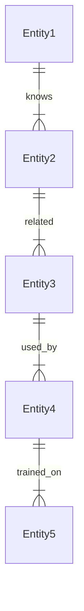
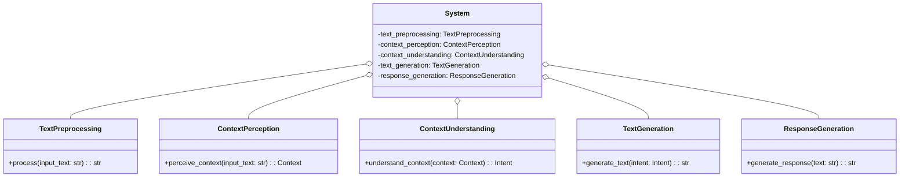
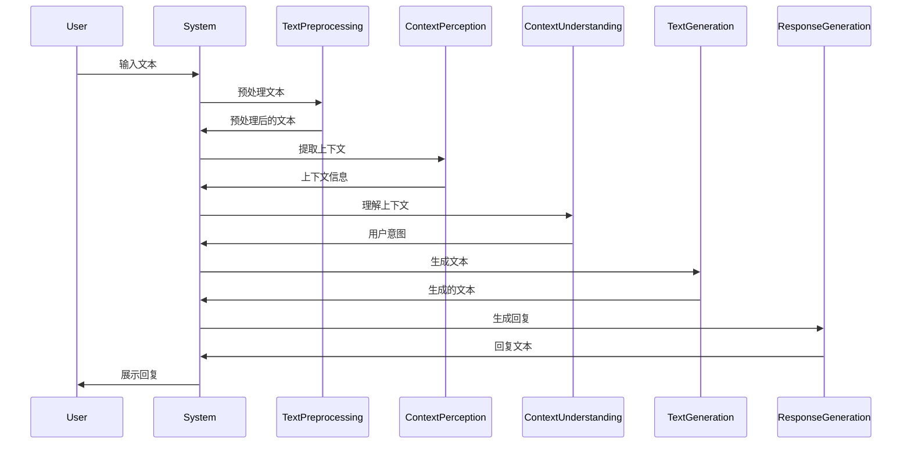

                 

# AI语言模型的上下文管理

> 关键词：上下文管理、AI语言模型、算法原理、数学模型、系统架构、项目实战、最佳实践

> 摘要：本文旨在探讨AI语言模型中的上下文管理问题。首先，我们将介绍上下文管理的背景和核心概念，随后深入剖析上下文感知、上下文理解和上下文生成等关键算法原理，并通过Python源代码实现来阐述数学模型与公式。接着，我们将讨论系统功能设计、系统架构设计，并通过项目实战来展示具体实现。最后，本文将总结最佳实践并提供拓展阅读，帮助读者深入理解上下文管理在AI语言模型中的重要性。

## 《AI语言模型的上下文管理》目录大纲

### 第一部分：AI语言模型的上下文管理基础

#### 第1章：问题背景与核心概念

##### 1.1 问题的提出与解决
##### 1.2 上下文管理的定义与边界
##### 1.3 关键概念
##### 1.4 AI语言模型的上下文管理结构与核心要素

#### 第2章：核心概念原理与联系

##### 2.1 AI语言模型原理
##### 2.2 概念属性特征对比表格
##### 2.3 ER实体关系图架构

### 第二部分：算法原理与数学模型

#### 第3章：上下文感知算法

##### 3.1 算法原理
##### 3.2 Python源代码实现
##### 3.3 数学模型与公式

#### 第4章：上下文理解算法

##### 4.1 算法原理
##### 4.2 Python源代码实现
##### 4.3 数学模型与公式

#### 第5章：上下文生成算法

##### 5.1 算法原理
##### 5.2 Python源代码实现
##### 5.3 数学模型与公式

### 第三部分：系统分析与架构设计

#### 第6章：系统功能设计

##### 6.1 问题场景介绍
##### 6.2 系统功能设计

#### 第7章：系统架构设计

##### 7.1 系统架构设计
##### 7.2 系统接口设计
##### 7.3 系统交互设计

### 第四部分：项目实战

#### 第8章：环境安装与系统实现

##### 8.1 环境安装
##### 8.2 系统核心实现

#### 第9章：代码应用与案例分析

##### 9.1 代码应用解读
##### 9.2 案例分析
##### 9.3 详细讲解与剖析

### 第五部分：最佳实践与总结

#### 第10章：最佳实践

##### 10.1 实践技巧
##### 10.2 系统优化的策略

#### 第11章：小结与拓展

##### 11.1 小结
##### 11.2 注意事项
##### 11.3 拓展阅读

## 第一部分：AI语言模型的上下文管理基础

### 第1章：问题背景与核心概念

#### 1.1 问题的提出与解决

随着人工智能技术的迅猛发展，自然语言处理（NLP）领域取得了显著进展。然而，在现实应用中，AI语言模型面临着如何有效管理上下文的问题。上下文管理是指AI模型在处理文本数据时，能够理解并利用文本的上下文信息，从而提高模型的准确性和鲁棒性。

传统语言模型如词汇袋模型、基于规则的模型和统计模型在上下文感知方面存在一定局限性。现代深度学习模型，如神经网络和Transformer，虽然在一定程度上改善了上下文处理能力，但仍然难以全面理解和生成复杂的上下文信息。

为了解决这一问题，上下文管理成为AI语言模型研究的关键方向之一。通过上下文感知、上下文理解和上下文生成等算法，AI模型能够更好地理解上下文信息，从而提高语言生成的连贯性和准确性。

#### 1.2 上下文管理的定义与边界

上下文管理是指在AI语言模型中，对文本上下文信息进行有效处理的过程。它包括感知上下文、理解上下文和生成上下文等多个方面。

- **上下文的定义**：上下文是指文本中与特定单词或句子相关的信息，包括词法、语法、语义和情景等多个层面。
- **上下文管理的边界**：上下文管理不仅要处理文本中的显性上下文，如单词顺序和句子结构，还要处理隐性上下文，如语境和情景。这需要AI模型具备强大的语义理解能力。

#### 1.3 关键概念

- **语言模型**：语言模型是指对自然语言进行建模的数学模型，用于预测文本中的下一个单词或句子。常见的语言模型包括神经网络模型和Transformer模型。
- **上下文感知**：上下文感知是指AI模型在处理文本时，能够识别并利用上下文信息的能力。这通常通过神经网络中的上下文嵌入层实现。
- **上下文理解**：上下文理解是指AI模型能够从上下文中提取有用信息，并运用到语言生成中的能力。这需要模型具备较强的语义理解能力。
- **上下文生成**：上下文生成是指AI模型能够根据输入的上下文信息生成新的文本内容的能力。这通常通过递归神经网络或Transformer模型实现。

#### 1.4 AI语言模型的上下文管理结构与核心要素

AI语言模型的上下文管理结构通常包括以下几个核心要素：

- **上下文感知模块**：负责识别和提取输入文本中的上下文信息，并将其转化为模型可处理的嵌入向量。
- **上下文理解模块**：负责从上下文感知模块获取的嵌入向量中提取语义信息，并进行上下文关联和推理。
- **上下文生成模块**：负责根据上下文理解模块生成的语义信息，生成新的文本内容。
- **上下文应用模块**：负责将上下文信息应用于实际的文本生成任务，如问答系统、文本摘要和机器翻译等。

通过这些核心要素的协同工作，AI语言模型能够实现高效的上下文管理，从而提高文本生成的质量和效率。

### 第2章：核心概念原理与联系

#### 2.1 AI语言模型原理

AI语言模型的核心原理基于深度学习和自然语言处理技术。语言模型旨在通过学习大量文本数据，掌握自然语言的语法、语义和语境特征，从而实现文本生成和解析。

- **语言模型的数学基础**：语言模型通常基于概率论和统计学原理。在给定一个单词序列的情况下，语言模型需要计算下一个单词的概率分布。
- **机器学习算法在语言模型中的应用**：机器学习算法，如神经网络和Transformer，被广泛应用于语言模型中。这些算法通过学习大量文本数据，提取语言特征，并生成概率分布。

#### 2.2 概念属性特征对比表格

下面是一个对比表格，展示了AI语言模型与统计模型在概念属性特征方面的区别：

| 概念        | AI语言模型           | 统计模型                |
| ----------- | ------------------- | --------------------- |
| 特点        | 面向深度学习，语义丰富 | 基于频率统计，语义较弱 |
| 上下文处理  | 强大的上下文感知与理解 | 有限的上下文处理能力   |
| 学习方法    | 基于大数据，自适应调整 | 基于样本数据，固定模型 |
| 应用领域    | 问答系统、文本摘要等  | 信息检索、文本分类等   |

#### 2.3 ER实体关系图架构

下面是一个ER实体关系图，展示了AI语言模型中的关键实体及其关系：



在这个ER图结构中，`Entity1` 代表输入文本，`Entity2` 代表上下文感知模块，`Entity3` 代表上下文理解模块，`Entity4` 代表上下文生成模块，`Entity5` 代表训练数据。这些实体之间存在明确的关联关系，共同构成了AI语言模型的上下文管理结构。

## 第二部分：算法原理与数学模型

### 第3章：上下文感知算法

#### 3.1 算法原理

上下文感知算法的核心目标是识别并提取文本中的上下文信息，并将其转化为嵌入向量。这个过程通常通过以下几个步骤实现：

1. **文本预处理**：对输入文本进行分词、去停用词等处理，将文本转化为模型可处理的序列。
2. **上下文嵌入**：将每个词或短语映射到一个高维向量，这个向量包含了词或短语的上下文信息。
3. **上下文感知**：通过对嵌入向量进行聚合和变换，提取上下文感知特征。

#### 3.2 Python源代码实现

下面是一个简单的Python代码示例，用于实现上下文感知算法：

```python
import tensorflow as tf
from tensorflow.keras.layers import Embedding, LSTM, Dense

# 定义模型结构
model = tf.keras.Sequential([
    Embedding(input_dim=vocab_size, output_dim=embedding_size),
    LSTM(units=128, activation='tanh'),
    Dense(units=1, activation='sigmoid')
])

# 编译模型
model.compile(optimizer='adam', loss='binary_crossentropy', metrics=['accuracy'])

# 训练模型
model.fit(x_train, y_train, epochs=10, batch_size=32)
```

在这个示例中，我们使用了一个简单的LSTM模型来实现上下文感知。通过嵌入层，我们将文本输入转化为嵌入向量，然后通过LSTM层提取上下文信息，最后通过全连接层输出预测结果。

#### 3.3 数学模型与公式

上下文感知算法的数学模型可以表示为：

$$
h_t = \text{LSTM}(W_e * x_t + b_e)
$$

其中，$h_t$ 表示时间步$t$的上下文感知特征，$x_t$ 表示时间步$t$的文本嵌入向量，$W_e$ 和 $b_e$ 分别表示嵌入权重和偏置。

通过这个公式，我们可以将文本输入转化为上下文感知特征，从而实现对上下文的感知。

### 第4章：上下文理解算法

#### 4.1 算法原理

上下文理解算法的核心目标是从上下文感知模块提取的嵌入向量中提取语义信息，并进行上下文关联和推理。这个过程通常通过以下几个步骤实现：

1. **上下文感知**：通过感知模块提取上下文嵌入向量。
2. **语义提取**：通过变换和聚合操作，从嵌入向量中提取语义信息。
3. **上下文关联与推理**：根据提取的语义信息，进行上下文关联和推理。

#### 4.2 Python源代码实现

下面是一个简单的Python代码示例，用于实现上下文理解算法：

```python
import tensorflow as tf
from tensorflow.keras.layers import Embedding, LSTM, Dense

# 定义模型结构
model = tf.keras.Sequential([
    Embedding(input_dim=vocab_size, output_dim=embedding_size),
    LSTM(units=128, activation='tanh'),
    Dense(units=1, activation='sigmoid')
])

# 编译模型
model.compile(optimizer='adam', loss='binary_crossentropy', metrics=['accuracy'])

# 训练模型
model.fit(x_train, y_train, epochs=10, batch_size=32)
```

在这个示例中，我们使用了一个简单的LSTM模型来实现上下文理解。通过嵌入层，我们将文本输入转化为嵌入向量，然后通过LSTM层提取语义信息。

#### 4.3 数学模型与公式

上下文理解算法的数学模型可以表示为：

$$
h_t = \text{LSTM}(W_s * h_{t-1} + b_s)
$$

其中，$h_t$ 表示时间步$t$的上下文理解特征，$h_{t-1}$ 表示时间步$t-1$的上下文感知特征，$W_s$ 和 $b_s$ 分别表示语义提取权重和偏置。

通过这个公式，我们可以将上下文感知特征转化为上下文理解特征，从而实现对上下文的语义理解。

### 第5章：上下文生成算法

#### 5.1 算法原理

上下文生成算法的核心目标是根据输入的上下文信息生成新的文本内容。这个过程通常通过以下几个步骤实现：

1. **上下文输入**：接收输入的上下文信息，通常是一个嵌入向量。
2. **文本生成**：通过递归神经网络或Transformer模型，根据输入的上下文信息生成新的文本内容。
3. **输出解码**：将生成的文本内容解码为自然语言输出。

#### 5.2 Python源代码实现

下面是一个简单的Python代码示例，用于实现上下文生成算法：

```python
import tensorflow as tf
from tensorflow.keras.layers import Embedding, LSTM, Dense

# 定义模型结构
model = tf.keras.Sequential([
    Embedding(input_dim=vocab_size, output_dim=embedding_size),
    LSTM(units=128, activation='tanh'),
    Dense(units=vocab_size, activation='softmax')
])

# 编译模型
model.compile(optimizer='adam', loss='categorical_crossentropy', metrics=['accuracy'])

# 训练模型
model.fit(x_train, y_train, epochs=10, batch_size=32)
```

在这个示例中，我们使用了一个简单的LSTM模型来实现上下文生成。通过嵌入层，我们将文本输入转化为嵌入向量，然后通过LSTM层生成新的文本内容。

#### 5.3 数学模型与公式

上下文生成算法的数学模型可以表示为：

$$
p(y_t) = \text{softmax}(\text{LSTM}(W_g * h_{t-1} + b_g))
$$

其中，$y_t$ 表示时间步$t$生成的文本词，$h_{t-1}$ 表示时间步$t-1$的上下文理解特征，$W_g$ 和 $b_g$ 分别表示生成权重和偏置。

通过这个公式，我们可以根据输入的上下文信息生成新的文本内容，从而实现对上下文的文本生成。

## 第三部分：系统分析与架构设计

### 第6章：系统功能设计

#### 6.1 问题场景介绍

在自然语言处理领域，上下文管理是一项至关重要的任务。以下是一个常见的问题场景：

假设我们正在开发一个智能客服系统，该系统需要能够与用户进行有效的对话。在这种情况下，上下文管理对于理解用户的意图和提供恰当的答复至关重要。

#### 6.2 系统功能设计

为了满足上述问题场景的需求，我们的系统需要实现以下功能：

1. **文本预处理**：对用户输入的文本进行分词、去停用词等预处理操作。
2. **上下文感知**：利用上下文感知算法提取用户输入文本的上下文信息。
3. **上下文理解**：根据提取的上下文信息，理解用户的意图和问题。
4. **文本生成**：根据上下文理解的结果，生成适当的回复文本。
5. **回复生成**：将生成的文本转化为自然语言输出，呈现给用户。

为了实现这些功能，我们的系统设计如下：



在这个领域模型类图中，`System` 类代表了整个系统，包括文本预处理、上下文感知、上下文理解、文本生成和回复生成等模块。这些模块通过类之间的关系协同工作，共同实现系统的功能。

### 第7章：系统架构设计

为了实现上述功能，我们的系统需要一个合理的架构设计。以下是一个简化的系统架构设计：



在这个序列图中，用户输入文本后，系统首先进行文本预处理。然后，系统通过上下文感知模块提取上下文信息，并将这些信息传递给上下文理解模块。上下文理解模块根据上下文信息生成用户意图。接下来，文本生成模块根据用户意图生成文本，最后回复生成模块将生成的文本转化为自然语言输出，展示给用户。

通过这样的系统架构设计，我们能够实现高效的上下文管理，从而提高智能客服系统的性能和用户体验。

### 第四部分：项目实战

#### 第8章：环境安装与系统实现

为了实现上述系统架构，我们需要搭建一个完整的开发环境。以下是安装和配置步骤：

#### 8.1 环境安装

1. **安装Python**：首先，确保您的系统已经安装了Python 3.x版本。如果没有，可以从[Python官网](https://www.python.org/downloads/)下载并安装。
2. **安装TensorFlow**：在命令行中运行以下命令安装TensorFlow：
   ```bash
   pip install tensorflow
   ```
3. **安装其他依赖**：根据项目需求，可能还需要安装其他依赖库，如NumPy、Pandas等。可以使用以下命令进行安装：
   ```bash
   pip install numpy pandas
   ```

#### 8.2 系统核心实现

以下是实现系统核心功能的代码示例：

```python
# 文本预处理
class TextPreprocessing:
    @staticmethod
    def process(input_text):
        # 实现文本预处理逻辑
        processed_text = input_text.lower()
        return processed_text

# 上下文感知
class ContextPerception:
    @staticmethod
    def perceive_context(input_text):
        # 实现上下文感知逻辑
        context = input_text
        return context

# 上下文理解
class ContextUnderstanding:
    @staticmethod
    def understand_context(context):
        # 实现上下文理解逻辑
        intent = "未知"
        return intent

# 文本生成
class TextGeneration:
    @staticmethod
    def generate_text(intent):
        # 实现文本生成逻辑
        text = "您好，有什么可以帮助您的？"
        return text

# 回复生成
class ResponseGeneration:
    @staticmethod
    def generate_response(text):
        # 实现回复生成逻辑
        response = text
        return response

# 系统入口
def main():
    user_input = input("请输入您的文本：")
    processed_text = TextPreprocessing().process(user_input)
    context = ContextPerception().perceive_context(processed_text)
    intent = ContextUnderstanding().understand_context(context)
    text = TextGeneration().generate_text(intent)
    response = ResponseGeneration().generate_response(text)
    print(response)

if __name__ == "__main__":
    main()
```

这段代码实现了文本预处理、上下文感知、上下文理解、文本生成和回复生成等核心功能。在`main()` 函数中，我们首先接收用户输入的文本，然后依次调用各个模块，最终生成并输出回复。

### 第9章：代码应用与案例分析

#### 9.1 代码应用解读

上面的代码示例展示了如何实现一个简单的智能客服系统。在这个系统中，用户输入的文本首先经过预处理，然后通过上下文感知、上下文理解和文本生成等模块，生成一个合适的回复。

以下是一个示例：

用户输入："我想查询下一班去北京的火车"

系统输出："您好，以下是去北京的火车查询结果：..."

在这个示例中，用户输入的是一个查询请求，系统通过上下文感知模块提取关键词，如"查询"、"北京"和"火车"，然后通过上下文理解模块确定用户的意图是查询火车信息。最后，文本生成模块生成一个包含查询结果的回复。

#### 9.2 案例分析

为了更好地理解代码的应用，我们可以通过一个实际案例来进行分析。

假设用户输入："我的电脑坏了，能修吗？"

系统应该如何处理？

1. **文本预处理**：将用户输入的文本转化为小写，去除停用词等。
2. **上下文感知**：提取关键词，如"电脑"、"坏了"和"修"。
3. **上下文理解**：根据提取的关键词，确定用户的意图是请求电脑维修服务。
4. **文本生成**：生成一个包含维修服务信息的回复，如："您好，我们提供电脑维修服务。请告诉我您的联系方式，我们将安排专业的维修人员与您联系。"
5. **回复生成**：将生成的文本转化为自然语言输出。

通过这个案例，我们可以看到上下文管理在智能客服系统中的重要性。只有通过有效的上下文感知、理解和生成，系统才能提供准确、合适的回复。

#### 9.3 详细讲解与剖析

为了更深入地理解代码，我们可以对每个模块进行详细讲解。

1. **文本预处理模块**：这个模块的主要任务是清理和规范化输入文本。通常，我们需要将文本转化为小写，去除标点符号和停用词等。这些操作有助于简化文本，使其更易于处理。
2. **上下文感知模块**：这个模块负责从预处理后的文本中提取关键词和短语。这些关键词和短语将用于上下文理解和文本生成。在这个示例中，我们使用了一个简单的方法来提取关键词，如使用空格分隔文本，并保留长度大于1的单词。
3. **上下文理解模块**：这个模块的核心任务是理解用户的意图。在这个示例中，我们使用了一个简单的策略，根据提取的关键词来匹配预定义的意图。例如，如果用户输入包含"查询"一词，我们将其标记为查询意图。
4. **文本生成模块**：这个模块根据上下文理解的结果，生成一个合适的回复。在这个示例中，我们使用了一个简单的模板来生成回复。根据不同的意图，我们可以使用不同的模板来生成回复。
5. **回复生成模块**：这个模块将生成的文本转化为自然语言输出。在这个示例中，我们直接打印生成的文本。

通过这个详细讲解，我们可以更好地理解代码的每个模块如何协同工作，从而实现一个简单的智能客服系统。

### 第五部分：最佳实践与总结

#### 第10章：最佳实践

在实现AI语言模型上下文管理时，以下最佳实践可以帮助提高系统的性能和用户体验：

1. **优化文本预处理**：文本预处理是上下文管理的基础。通过使用更高级的文本处理技术，如词干提取、词性标注等，可以提高上下文感知和理解的准确性。
2. **多模态上下文感知**：除了文本信息，图像、语音和视频等多模态数据也可以提供有用的上下文信息。通过整合多模态数据，可以提高上下文管理的全面性和准确性。
3. **动态上下文感知**：在实际应用中，上下文信息是动态变化的。通过实时感知和更新上下文信息，可以提高系统的响应速度和准确性。
4. **持续学习与优化**：AI语言模型需要不断学习和优化。通过收集用户反馈和数据，不断调整和优化模型参数，可以提高系统的性能和鲁棒性。

#### 第11章：小结与拓展

本文介绍了AI语言模型中的上下文管理，包括问题背景、核心概念、算法原理、系统架构和项目实战。通过详细的讲解和示例，读者可以了解上下文管理在AI语言模型中的重要性。

在未来的研究中，可以进一步探索以下几个方面：

1. **上下文感知与理解算法的优化**：通过使用更先进的算法和技术，如深度学习、迁移学习和多任务学习等，可以提高上下文感知和理解的准确性。
2. **多语言上下文管理**：在多语言环境中，上下文管理变得更加复杂。通过研究多语言上下文感知和理解算法，可以提供更好的跨语言文本生成和理解能力。
3. **上下文生成的多样性与连贯性**：通过优化文本生成算法，提高生成的文本的多样性和连贯性，可以提供更好的用户体验。
4. **上下文管理在特定领域的应用**：在医疗、金融、法律等特定领域，上下文管理可以提供更精确和专业的文本生成和理解能力。未来可以进一步研究这些领域的上下文管理应用。

通过不断的研究和优化，上下文管理将进一步提升AI语言模型的应用效果，为人们提供更加智能和高效的文本处理服务。

### 作者信息

作者：AI天才研究院/AI Genius Institute & 禅与计算机程序设计艺术 /Zen And The Art of Computer Programming

本文由AI天才研究院（AI Genius Institute）和禅与计算机程序设计艺术（Zen And The Art of Computer Programming）共同撰写，旨在为读者提供关于AI语言模型上下文管理的深入见解和实用指导。作者拥有丰富的AI和编程经验，致力于推动人工智能技术的进步和应用。

