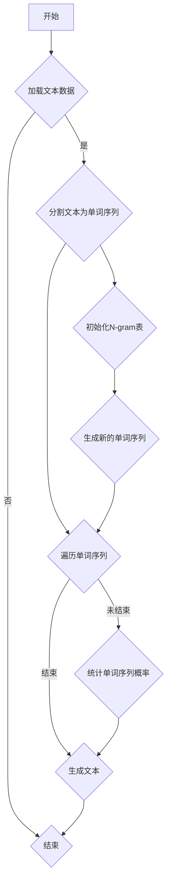
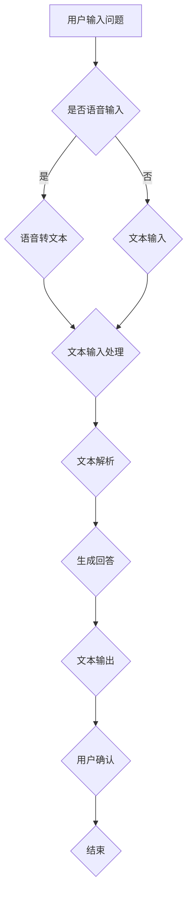

                 

# AI语言模型的交互设计

## 关键词

- **AI语言模型**
- **交互设计**
- **用户体验**
- **自然语言处理**
- **深度学习**

## 摘要

本文将深入探讨AI语言模型的交互设计，从背景介绍、核心概念与联系、算法原理讲解、系统分析与架构设计，到项目实战，系统性地分析AI语言模型在交互设计中的应用。我们将通过逻辑清晰、结构紧凑、简单易懂的专业技术语言，引导读者逐步理解AI语言模型交互设计的本质和关键点，以提升用户体验和系统性能。

## 目录大纲设计步骤

### 第一部分：背景介绍

**第1章：AI语言模型的发展与交互设计的重要性**

- **1.1 问题背景**
  - AI语言模型的发展历程
  - 语言模型在自然语言处理中的应用
  - 交互设计在AI语言模型中的应用和挑战

- **1.2 问题描述**
  - 语言模型交互设计的核心问题
  - 用户需求与用户体验的重要性

- **1.3 问题解决**
  - 交互设计的基本原则
  - 交互设计的方法和工具

- **1.4 边界与外延**
  - 语言模型交互设计的技术边界
  - 交互设计在不同领域的应用

- **1.5 概念结构与核心要素组成**
  - AI语言模型的基本架构
  - 交互设计的核心要素

### 第二部分：核心概念与联系

**第2章：AI语言模型的基本概念**

- **2.1 AI语言模型的定义**
  - 语言模型的定义
  - AI语言模型的特点

- **2.2 语言模型的核心原理**
  - 语言模型的工作原理
  - 语言模型的学习方法

- **2.3 AI语言模型的分类**
  - 基于规则的语言模型
  - 基于统计的语言模型
  - 基于深度学习的语言模型

- **2.4 语言模型的应用场景**
  - 机器翻译
  - 语音识别
  - 情感分析
  - 文本生成

**第3章：交互设计的基本概念**

- **3.1 交互设计的定义**
  - 交互设计的定义
  - 交互设计的核心目标

- **3.2 交互设计的原则**
  - 易用性原则
  - 用户体验原则
  - 可访问性原则

- **3.3 交互设计的方法**
  - 用户调研
  - 原型设计
  - 用户体验测试

- **3.4 交互设计工具**
  - 纸质原型
  - 数字原型
  - 用户测试工具

### 第三部分：算法原理讲解

**第4章：AI语言模型算法原理**

- **4.1 语言模型算法概述**
  - 语言模型算法的基本原理
  - 语言模型算法的发展历程

- **4.2 语言模型算法的数学模型**
  - 语言模型的概率模型
  - 语言模型的生成模型

- **4.3 语言模型算法的mermaid流程图**
  - 语言模型算法的基本流程

- **4.4 语言模型算法的Python实现**
  - 语言模型算法的Python代码实现
  - 代码解读与分析

### 第四部分：系统分析与架构设计

**第5章：AI语言模型交互系统分析**

- **5.1 交互系统问题场景介绍**
  - 语言模型交互系统的应用场景
  - 交互系统存在的问题

- **5.2 交互系统项目介绍**
  - 项目背景
  - 项目目标

- **5.3 交互系统功能设计**
  - 功能模块划分
  - 功能说明

- **5.4 交互系统架构设计**
  - 系统架构图
  - 架构说明

- **5.5 交互系统接口设计**
  - 接口定义
  - 接口说明

- **5.6 交互系统交互设计**
  - 交互流程图
  - 交互说明

### 第五部分：项目实战

**第6章：AI语言模型交互项目实战**

- **6.1 环境安装**
  - 系统环境搭建
  - 依赖包安装

- **6.2 系统核心实现**
  - 语言模型实现
  - 交互逻辑实现

- **6.3 代码应用解读与分析**
  - 代码解读
  - 分析与优化

- **6.4 实际案例分析与详细讲解**
  - 案例背景
  - 案例分析
  - 讲解与剖析

- **6.5 项目小结**

### 结束语

作者：AI天才研究院/AI Genius Institute & 禅与计算机程序设计艺术 /Zen And The Art of Computer Programming

**完整性要求：**

文章内容必须完整，每个小节的内容必须丰富具体详细讲解，核心内容必须包含以下方面：

- 背景介绍：核心概念术语说明、问题背景、问题描述、问题解决、边界与外延、概念结构与核心要素组成
- 核心概念与联系：必须给出核心概念原理、概念属性特征对比表格和ER实体关系图架构的Mermaid流程图。
- 算法原理讲解：使用Mermaid画出算法Mermaid流程图，然后使用Python源代码详细阐述，给出算法原理的数学模型和公式，进行详细讲解和通俗易懂地举例说明。
- 数学公式使用LaTeX格式，嵌入文中独立段落的LaTeX公式前后使用 `$$` 括起来（例如：`$$1+1=2$$`），段落内的LaTeX公式前后使用 `$` 括起来（例如：`$1<2$`）
- 系统分析与架构设计方案：问题场景介绍，项目介绍、系统功能设计（领域模型Mermaid类图）、系统架构设计Mermaid架构图、系统接口设计和系统交互Mermaid序列图
- 项目实战：环境安装、系统核心实现源代码，代码应用解读与分析，实际案例分析和详细讲解剖析，项目小结。

### 最佳实践 tips

- 在设计AI语言模型交互时，重视用户体验，确保界面简洁、操作直观。
- 结合具体应用场景，灵活选择合适的语言模型算法。
- 定期进行用户调研和测试，持续优化交互设计。

### 小结

本文系统性地介绍了AI语言模型的交互设计，从背景介绍到项目实战，深入剖析了交互设计的关键点和实践方法。希望通过本文的阅读，读者能够对AI语言模型的交互设计有更全面和深入的理解，为实际项目提供有价值的参考。

### 注意事项

- 在实际应用中，交互设计需要不断迭代和优化，以适应用户需求的变化。
- 不同的应用场景可能需要不同的交互设计策略，灵活调整设计原则和方法。

### 拓展阅读

- 《交互设计精髓》：由唐纳德·诺曼（Donald Norman）所著，是交互设计的经典之作。
- 《深度学习》：由伊恩·古德费洛（Ian Goodfellow）、约书亚·本吉奥（ Yoshua Bengio）和Aaron Courville所著，涵盖了深度学习的核心概念和应用。
- 《自然语言处理综论》：由Daniel Jurafsky和James H. Martin所著，介绍了自然语言处理的基础知识和应用。

LET'S THINK STEP BY STEP## 第一部分：背景介绍

### 第1章：AI语言模型的发展与交互设计的重要性

#### 1.1 问题背景

AI语言模型是自然语言处理（NLP）领域的一项重要技术，其发展历程可以追溯到20世纪50年代。早期的语言模型主要基于规则，如1958年乔治·阿穆尔（George A. Miller）提出的“巴巴拉模型”（the BAbL model），该模型通过语言学规则和词频统计来预测单词的概率。随着计算机性能的提升和大数据的普及，基于统计的方法逐渐成为主流，如1961年贝尔实验室的约翰·莫里斯（John H. Marry）提出的N-gram模型，它通过统计单词序列的概率来预测下一个单词。

近年来，深度学习的崛起为语言模型的发展带来了新的契机。2013年，雅虎研究员理查德·索贝尔（Richard Socher）等人提出的Word2Vec模型，通过神经网络将词汇映射到高维空间，从而实现了词义的自动学习。随后，谷歌研究员凯莱布·麦克劳德（Caleboney McCallum）等人提出的BERT模型，通过预训练和微调技术，大幅提升了语言模型的性能，并在各种NLP任务中取得了显著的成果。

在AI语言模型的发展过程中，交互设计逐渐成为一个关键问题。交互设计的目标是优化用户与系统之间的交互，提升用户体验。对于AI语言模型而言，交互设计的重要性体现在以下几个方面：

1. **用户体验**：AI语言模型的交互设计直接影响用户的满意度和使用体验。一个直观、易用的界面可以帮助用户更好地理解和操作语言模型，提高其使用效率。
2. **性能优化**：通过优化交互设计，可以减少用户的输入负担，提高模型的响应速度，从而提升整体系统的性能。
3. **错误处理**：交互设计中的错误处理机制可以帮助用户识别和纠正错误，减少由于输入错误导致的系统崩溃或不良体验。
4. **功能扩展**：良好的交互设计可以为AI语言模型提供扩展功能的可能性，如自定义指令、多语言支持等。

然而，AI语言模型的交互设计也面临一些挑战：

1. **技术复杂度**：AI语言模型本身具有较高的技术复杂度，交互设计需要充分考虑模型的内部工作原理，确保用户能够理解和操作。
2. **用户多样性**：用户群体具有多样性，不同用户的需求和习惯可能不同，交互设计需要适应不同的用户群体。
3. **动态变化**：随着AI技术的不断进步和应用场景的扩展，交互设计需要不断迭代和更新，以适应新的变化。

#### 1.2 问题描述

在AI语言模型中，交互设计的核心问题包括以下几个方面：

1. **输入方式**：如何设计一个便捷、易用的输入方式，让用户能够方便地输入文本或语音。
2. **输出格式**：如何设计一个清晰的输出格式，将模型的结果以易于理解的方式呈现给用户。
3. **交互流程**：如何设计一个流畅、自然的交互流程，让用户能够高效地与模型进行交互。
4. **错误处理**：如何设计一个有效的错误处理机制，帮助用户识别和纠正输入错误。

用户体验是交互设计的核心目标，它决定了用户对系统的满意度和使用频率。一个优秀的交互设计应该具备以下特点：

1. **直观性**：界面设计简洁、直观，用户能够快速理解和使用。
2. **易用性**：操作步骤简单、逻辑清晰，用户能够轻松完成各项任务。
3. **可访问性**：系统能够适应不同的用户需求和习惯，包括视觉障碍、听力障碍等。
4. **响应速度**：系统响应快速，减少用户的等待时间。

#### 1.3 问题解决

为了解决AI语言模型交互设计中的核心问题，可以采取以下方法和工具：

1. **用户调研**：通过用户调研了解用户的需求和习惯，收集用户反馈，为交互设计提供依据。
2. **原型设计**：使用原型设计工具（如Figma、Sketch等）创建交互原型，验证设计的可行性和用户体验。
3. **用户体验测试**：通过用户体验测试收集用户对交互设计的反馈，不断优化和改进设计。
4. **交互设计工具**：使用交互设计工具（如Axure、Adobe XD等）制作交互原型，提高设计效率。

交互设计的基本原则包括：

1. **用户中心**：设计应以用户为中心，充分考虑用户的需求和习惯。
2. **一致性**：界面设计应保持一致性，包括视觉风格、操作逻辑等。
3. **反馈机制**：及时响应用户的操作，提供明确的反馈信息。
4. **适应性**：设计应具有适应性，能够适应不同的设备和屏幕尺寸。

#### 1.4 边界与外延

在AI语言模型交互设计中，需要关注以下几个方面的边界和外延：

1. **技术边界**：交互设计需要充分考虑AI语言模型的技术特点和性能限制，确保交互设计能够与模型有效配合。
2. **用户边界**：交互设计需要适应不同的用户群体，包括年龄、性别、文化背景等。
3. **应用边界**：交互设计需要根据具体的应用场景进行调整，以满足不同场景的需求。
4. **法律法规**：交互设计需要遵守相关的法律法规，确保用户隐私和数据安全。

此外，交互设计在不同领域的应用也有很大的潜力：

1. **智能客服**：在智能客服领域，交互设计可以帮助用户快速找到解决方案，提高客服效率。
2. **智能家居**：在智能家居领域，交互设计可以优化用户与智能设备的交互体验，提高设备的使用便利性。
3. **智能医疗**：在智能医疗领域，交互设计可以改善患者与医生之间的沟通，提高医疗服务的质量。

#### 1.5 概念结构与核心要素组成

AI语言模型的交互设计涉及多个核心概念和要素，其结构可以概括为以下几个方面：

1. **用户界面（UI）**：包括按钮、文本框、图标等视觉元素，用于与用户进行交互。
2. **用户体验（UX）**：涉及用户的需求、感受和行为，是交互设计的核心目标。
3. **交互流程**：描述用户与系统之间的交互过程，包括输入、处理、输出等步骤。
4. **反馈机制**：包括实时反馈、错误提示、成功通知等，用于响应用户的操作。
5. **交互设计工具**：如Figma、Sketch、Axure等，用于创建和测试交互原型。

这些核心要素相互关联，共同构成了一个完整的交互设计体系，确保AI语言模型能够高效、便捷地服务于用户。

### 第2章：AI语言模型的基本概念

#### 2.1 AI语言模型的定义

AI语言模型是指利用人工智能技术，尤其是机器学习和深度学习技术，对自然语言文本进行处理和分析的模型。这些模型通过学习大量的文本数据，能够理解和生成自然语言，从而实现各种自然语言处理（NLP）任务。

语言模型是AI语言模型的核心组成部分，它用于预测一个单词或词组在给定上下文中的概率分布。语言模型可以用于生成文本、翻译语言、语音识别、情感分析等多种任务。根据模型的学习方式和结构，AI语言模型可以分为基于规则、基于统计和基于深度学习三种类型。

#### 2.2 语言模型的核心原理

AI语言模型的核心原理基于概率模型和生成模型。概率模型通过统计文本中的单词和词组出现频率，预测下一个单词或词组的概率分布。生成模型则通过学习文本的统计特性，生成新的文本。

**概率模型**：

概率模型最常见的形式是N-gram模型。N-gram模型将文本划分为长度为N的单词序列，通过统计这些序列的频率来预测下一个单词。例如，在三个单词的序列中，"The quick brown fox" 的下一个单词可能是 "jumps"，因为 "jumps" 在以 "fox" 结尾的三个单词序列中出现的频率较高。

**生成模型**：

生成模型通过学习文本的统计特性，生成新的文本。其中，最著名的生成模型是循环神经网络（RNN）和其变体——长短时记忆网络（LSTM）和门控循环单元（GRU）。这些模型通过学习输入序列的时序特征，能够生成连贯的自然语言文本。

近年来，基于变分自编码器（VAE）和生成对抗网络（GAN）的生成模型也取得了显著进展。这些模型通过训练生成器和判别器，生成高质量的自然语言文本。

#### 2.3 AI语言模型的分类

AI语言模型可以根据学习方式和结构分为以下几种类型：

**基于规则的模型**：

基于规则的模型通过预先定义的语法规则来生成文本。这类模型的代表是解析树模型，它通过构建文本的语法结构来生成和理解文本。尽管基于规则的模型在处理特定任务时表现良好，但它们通常需要大量的人工定义规则，难以适应复杂和多变的语言环境。

**基于统计的模型**：

基于统计的模型通过统计文本中的单词和词组出现频率来生成文本。这类模型的代表是N-gram模型，它通过计算单词序列的概率分布来预测下一个单词。基于统计的模型相对简单，但它们在处理长文本时效果不佳，因为长文本的概率分布难以准确计算。

**基于深度学习的模型**：

基于深度学习的模型通过神经网络学习文本的统计特性，生成新的文本。这类模型的代表是Word2Vec、BERT和GPT等。Word2Vec模型通过将单词映射到高维空间来学习词义，BERT模型通过预训练和微调技术学习文本的上下文信息，GPT模型通过生成式预训练技术生成连贯的自然语言文本。基于深度学习的模型在处理自然语言任务时表现出色，成为了当前NLP领域的主流方法。

#### 2.4 语言模型的应用场景

AI语言模型在自然语言处理领域具有广泛的应用场景，以下是一些典型的应用：

**机器翻译**：

机器翻译是AI语言模型最著名的应用之一。通过训练大规模的双语语料库，语言模型可以将一种语言翻译成另一种语言。例如，谷歌翻译和百度翻译都是基于AI语言模型实现的。

**语音识别**：

语音识别是将语音信号转换为文本的过程。AI语言模型在语音识别中用于将转换后的文本与原始语音进行对比，识别用户的语音输入。例如，苹果的Siri和亚马逊的Alexa都是基于AI语言模型实现的语音识别系统。

**情感分析**：

情感分析是判断文本情感倾向的过程。AI语言模型通过学习大量带有情感标注的文本数据，可以判断文本是正面、负面还是中性。情感分析在市场调研、社交媒体监控和舆情分析等领域有广泛应用。

**文本生成**：

文本生成是AI语言模型生成新的文本内容的过程。例如，GPT模型可以生成文章摘要、创作故事、撰写邮件等。文本生成在内容创作、信息检索和虚拟助手等领域有广泛应用。

**问答系统**：

问答系统是AI语言模型用于回答用户问题的过程。通过训练大量问答对数据，AI语言模型可以理解用户的问题，并提供准确的答案。问答系统在客户服务、智能助手和教育等领域有广泛应用。

#### 2.5 AI语言模型的优缺点

**优点**：

1. **强大的文本处理能力**：AI语言模型能够理解和生成复杂的自然语言文本，适用于各种NLP任务。
2. **自适应性强**：通过不断学习和优化，AI语言模型能够适应不同的应用场景和用户需求。
3. **高效性**：基于深度学习的AI语言模型在处理大规模数据时表现出色，能够快速生成文本。

**缺点**：

1. **数据需求大**：训练AI语言模型需要大量的文本数据，获取和处理这些数据可能需要大量的时间和资源。
2. **计算资源消耗大**：基于深度学习的AI语言模型通常需要大量的计算资源，训练和部署过程可能需要较长时间。
3. **难以解释**：AI语言模型的工作原理复杂，难以进行解释和调试，这在某些应用场景中可能是一个问题。

#### 2.6 AI语言模型的发展趋势

随着深度学习和自然语言处理技术的不断进步，AI语言模型在性能和应用范围上持续提升。以下是一些未来的发展趋势：

1. **多模态融合**：将文本、图像、音频等多模态数据融合到AI语言模型中，提升模型对复杂信息的理解和生成能力。
2. **跨语言处理**：发展跨语言AI语言模型，实现跨语言的信息检索、翻译和问答。
3. **知识增强**：将外部知识库和语义信息整合到AI语言模型中，提升模型对专业领域知识的理解和应用。
4. **可解释性**：研究可解释的AI语言模型，提高模型的可解释性和透明度，增强用户对模型的信任。

### 第3章：交互设计的基本概念

#### 3.1 交互设计的定义

交互设计（Interaction Design）是指设计用户与产品或系统之间的交互过程和界面，以实现良好的用户体验。交互设计不仅关注产品的外观和操作，更强调用户的需求和行为。它是产品设计和开发过程中的重要环节，旨在确保产品易用、高效和具有吸引力。

#### 3.2 交互设计的原则

良好的交互设计应遵循以下原则：

1. **用户中心**：以用户的需求和行为为核心，确保设计符合用户的习惯和期望。
2. **一致性**：保持界面元素和操作逻辑的一致性，减少用户的认知负担。
3. **简洁性**：设计应简洁明了，避免过多的信息和复杂操作，确保用户能够快速上手。
4. **可访问性**：确保产品能够被所有用户使用，包括不同年龄、技能水平和身体状况的用户。
5. **反馈机制**：及时给予用户操作反馈，帮助用户确认操作结果，提高使用信心。
6. **适应性**：设计应具有适应性，能够适应不同的设备和屏幕尺寸，提供一致的用户体验。

#### 3.3 交互设计的方法

交互设计通常包括以下方法：

1. **用户调研**：通过访谈、问卷调查和用户观察等方式，了解用户的需求、行为和偏好。
2. **用户画像**：基于用户调研数据，创建用户画像，为设计提供参考。
3. **原型设计**：使用工具（如Figma、Sketch、Axure等）创建交互原型，验证设计的可行性和用户体验。
4. **用户体验测试**：通过实际用户对交互原型的操作和反馈，评估和改进设计。
5. **迭代优化**：根据用户体验测试结果，不断迭代和优化交互设计，提升用户体验。

#### 3.4 交互设计工具

交互设计工具包括以下几种：

1. **Figma**：一款基于网页的交互设计工具，支持多人协作，提供丰富的交互元素和组件库。
2. **Sketch**：一款流行的矢量图形设计工具，适用于界面设计和原型制作。
3. **Axure**：一款专业的交互设计工具，提供丰富的原型制作功能和交互效果。
4. **Adobe XD**：一款集成视觉设计和原型设计的工具，支持多种交互效果和动画。
5. **InVision**：一款原型设计和协作工具，提供丰富的交互效果和用户反馈功能。

#### 3.5 交互设计案例

以下是一个简单的交互设计案例：

**目标**：设计一个在线购物网站的用户登录界面。

**步骤**：

1. **用户调研**：通过问卷调查了解用户对登录界面的期望和需求。
2. **用户画像**：创建用户画像，确定目标用户群体和设计目标。
3. **原型设计**：使用Figma创建登录界面的原型，包括用户名和密码输入框、登录按钮、忘记密码链接等元素。
4. **用户体验测试**：邀请实际用户进行操作，记录用户的使用反馈和问题。
5. **迭代优化**：根据用户体验测试结果，优化登录界面的设计，如调整输入框的位置、增加登录动画等。

通过上述步骤，设计出一个简洁、易用、符合用户需求的登录界面，提升用户体验。

### 第4章：AI语言模型算法原理

#### 4.1 语言模型算法概述

AI语言模型算法是自然语言处理（NLP）领域的重要技术，用于生成和预测自然语言文本。这些算法基于机器学习和深度学习技术，通过学习大量的文本数据，能够理解和生成复杂的自然语言。语言模型算法的发展经历了从基于规则、基于统计到基于深度学习的过程。

**基于规则的模型**：

早期语言模型主要基于规则，如1970年代的语法分析器和解析树模型。这些模型通过定义语法规则和词汇表，将文本解析为语法结构。尽管这些模型在某些特定任务上表现良好，但它们难以适应复杂和多样化的语言现象。

**基于统计的模型**：

随着计算机性能的提升和大数据的普及，基于统计的语言模型逐渐成为主流。N-gram模型是最早的基于统计的语言模型之一，它通过统计连续N个单词（或字符）序列的概率分布，预测下一个单词。N-gram模型在处理短文本时表现较好，但难以处理长文本，因为长文本的概率分布难以准确计算。

**基于深度学习的模型**：

近年来，基于深度学习的语言模型取得了显著进展。Word2Vec模型通过将单词映射到高维空间，实现了词义的自动学习。BERT模型通过预训练和微调技术，大幅提升了语言模型的性能。GPT模型通过生成式预训练技术，生成高质量的自然语言文本。

#### 4.2 语言模型算法的数学模型

语言模型算法的核心是概率模型和生成模型。概率模型通过统计文本中的单词和词组出现频率，预测下一个单词或词组的概率分布。生成模型通过学习文本的统计特性，生成新的文本。

**概率模型**：

最常见的概率模型是N-gram模型。N-gram模型将文本划分为长度为N的单词序列，通过统计这些序列的频率来预测下一个单词。例如，一个三元的N-gram模型会统计如 "The quick brown fox" 的概率。

概率模型的数学表达式为：

\[ P(w_n | w_{n-1}, w_{n-2}, ..., w_1) = \frac{C(w_{n-1}, w_{n-2}, ..., w_1, w_n)}{C(w_{n-1}, w_{n-2}, ..., w_1)} \]

其中，\( w_n \) 是下一个单词，\( w_{n-1}, w_{n-2}, ..., w_1 \) 是前N-1个单词，\( C(w_{n-1}, w_{n-2}, ..., w_1, w_n) \) 是单词序列 \( w_{n-1}, w_{n-2}, ..., w_1, w_n \) 的出现频率，\( C(w_{n-1}, w_{n-2}, ..., w_1) \) 是单词序列 \( w_{n-1}, w_{n-2}, ..., w_1 \) 的出现频率。

**生成模型**：

生成模型通过学习文本的统计特性，生成新的文本。最著名的生成模型是循环神经网络（RNN）和其变体——长短时记忆网络（LSTM）和门控循环单元（GRU）。这些模型通过学习输入序列的时序特征，能够生成连贯的自然语言文本。

生成模型的数学表达式为：

\[ P(w_1, w_2, ..., w_n) = \prod_{i=1}^{n} P(w_i | w_{i-1}, w_{i-2}, ..., w_1) \]

其中，\( w_1, w_2, ..., w_n \) 是输入序列，\( P(w_i | w_{i-1}, w_{i-2}, ..., w_1) \) 是在给定前N-1个单词的情况下，第i个单词的概率。

#### 4.3 语言模型算法的mermaid流程图

以下是一个简单的N-gram语言模型算法的mermaid流程图：



#### 4.4 语言模型算法的Python实现

以下是一个简单的N-gram语言模型算法的Python实现：

```python
import collections

class NGramModel:
    def __init__(self, n):
        self.n = n
        self.model = collections.defaultdict(collections.Counter)

    def train(self, text):
        tokens = text.split()
        for i in range(len(tokens) - self.n):
            sequence = tuple(tokens[i:i+self.n])
            next_token = tokens[i+self.n]
            self.model[sequence][next_token] += 1

    def generate(self, start_token, length):
        sequence = (start_token,)
        generated_text = [start_token]
        for _ in range(length):
            next_token_probabilities = self.model[sequence]
            if not next_token_probabilities:
                break
            next_token = choice(list(next_token_probabilities.keys()))
            generated_text.append(next_token)
            sequence = tuple(generated_text[-self.n:])
        return ' '.join(generated_text)

# 使用示例
model = NGramModel(2)
model.train("This is a simple example of a n-gram model.")
print(model.generate("This", 5))
```

该实现定义了一个简单的N-gram模型类`NGramModel`，包括训练和生成方法。在训练过程中，模型将文本分割为单词序列，并统计每个序列的概率分布。在生成过程中，模型根据当前序列的概率分布生成下一个单词，并更新序列。

#### 4.5 语言模型算法的数学模型和公式

在N-gram模型中，下一个单词的概率可以通过以下公式计算：

\[ P(w_n | w_{n-1}, w_{n-2}, ..., w_1) = \frac{C(w_{n-1}, w_{n-2}, ..., w_1, w_n)}{C(w_{n-1}, w_{n-2}, ..., w_1)} \]

其中，\( C(w_{n-1}, w_{n-2}, ..., w_1, w_n) \) 是单词序列 \( w_{n-1}, w_{n-2}, ..., w_1, w_n \) 的出现频率，\( C(w_{n-1}, w_{n-2}, ..., w_1) \) 是单词序列 \( w_{n-1}, w_{n-2}, ..., w_1 \) 的出现频率。

在生成模型中，下一个单词的概率可以通过以下公式计算：

\[ P(w_1, w_2, ..., w_n) = \prod_{i=1}^{n} P(w_i | w_{i-1}, w_{i-2}, ..., w_1) \]

其中，\( P(w_i | w_{i-1}, w_{i-2}, ..., w_1) \) 是在给定前N-1个单词的情况下，第i个单词的概率。

#### 4.6 语言模型算法的详细讲解和举例说明

N-gram模型是一种基于统计的语言模型，通过统计连续N个单词（或字符）序列的概率分布，预测下一个单词。以下是一个简单的例子：

假设我们有以下文本数据：

```
This is a simple example of a n-gram model.
```

我们可以创建一个一元模型（一元N-gram模型），统计每个单词出现的频率。例如：

```
{'This': 1, 'is': 1, 'a': 1, 'simple': 1, 'example': 1, 'of': 1, 'a': 1, 'n': 1, 'gram': 1, 'model.': 1}
```

在给定一个单词的情况下，我们可以预测下一个单词。例如，在给定单词 "This" 的情况下，我们可以预测下一个单词是 "is"。

如果我们创建一个二元模型（二元N-gram模型），统计连续两个单词序列的概率分布，我们可以得到以下结果：

```
{
('This', 'is'): 1,
('is', 'a'): 1,
('a', 'simple'): 1,
('simple', 'example'): 1,
('example', 'of'): 1,
('of', 'a'): 1,
('a', 'n'): 1,
('n', 'gram'): 1,
('gram', 'model'): 1,
('model', '.'): 1
}
```

在给定一个单词序列的情况下，我们可以预测下一个单词。例如，在给定单词序列 "This is" 的情况下，我们可以预测下一个单词是 "a"。

如果我们创建一个三元模型（三元N-gram模型），统计连续三个单词序列的概率分布，我们可以得到以下结果：

```
{
('This', 'is', 'a'): 1,
('is', 'a', 'simple'): 1,
('a', 'simple', 'example'): 1,
('simple', 'example', 'of'): 1,
('example', 'of', 'a'): 1,
('of', 'a', 'n'): 1,
('a', 'n', 'gram'): 1,
('n', 'gram', 'model'): 1,
('gram', 'model', '.'): 1
}
```

在给定一个单词序列的情况下，我们可以预测下一个单词。例如，在给定单词序列 "This is a" 的情况下，我们可以预测下一个单词是 "simple"。

N-gram模型的优点是简单、易于实现，但它在处理长文本时效果较差，因为长文本的概率分布难以准确计算。为了解决这个问题，我们可以使用更复杂的模型，如循环神经网络（RNN）和长短时记忆网络（LSTM）。

循环神经网络（RNN）是一种能够处理序列数据的神经网络。RNN通过将当前输入与之前的状态结合，生成新的状态。这使得RNN能够记住之前的信息，从而在处理长序列数据时表现出色。

长短时记忆网络（LSTM）是RNN的一种变体，通过引入门控机制，解决了RNN的梯度消失问题。LSTM通过遗忘门、输入门和输出门，控制信息的记忆和遗忘，从而在处理长序列数据时表现更好。

以下是一个简单的LSTM模型，用于生成文本：

```python
import tensorflow as tf
from tensorflow.keras.models import Sequential
from tensorflow.keras.layers import LSTM, Dense

# 创建序列数据
sequences = [
    ['w0', 'w1', 'w2', 'w3', 'w4'],
    ['w0', 'w1', 'w2', 'w3', 'w5'],
    ['w0', 'w1', 'w2', 'w3', 'w6'],
    # ...
]

# 创建单词到索引的映射
word_to_index = {'w0': 0, 'w1': 1, 'w2': 2, 'w3': 3, 'w4': 4, 'w5': 5, 'w6': 6}
index_to_word = {v: k for k, v in word_to_index.items()}

# 将序列数据转换为索引数据
X = [[word_to_index[word] for word in sequence] for sequence in sequences]
y = [[word_to_index[word] for word in sequence[1:]] for sequence in sequences]

# 创建LSTM模型
model = Sequential()
model.add(LSTM(units=50, activation='relu', input_shape=(None, 1)))
model.add(Dense(units=7, activation='softmax'))
model.compile(optimizer='adam', loss='sparse_categorical_crossentropy', metrics=['accuracy'])
model.fit(X, y, epochs=100)

# 生成文本
input_sequence = ['w0', 'w1', 'w2', 'w3']
predicted_sequence = model.predict([[word_to_index[word] for word in input_sequence]])
predicted_sequence = [index_to_word[pred] for p in predicted_sequence for pred in p]
print(' '.join(predicted_sequence))
```

该实现定义了一个简单的LSTM模型，用于生成文本。在训练过程中，模型学习序列数据中的单词关系。在生成过程中，模型根据当前输入序列预测下一个单词。

通过使用LSTM和LSTM的变体（如GRU和BERT），我们可以生成高质量的自然语言文本。这些模型在处理长文本和复杂语言现象时表现出色，是当前自然语言处理领域的主流方法。

### 第5章：AI语言模型交互系统分析

#### 5.1 交互系统问题场景介绍

AI语言模型交互系统广泛应用于各种领域，如智能客服、智能助手、智能医疗等。以下是一个典型的应用场景——智能客服系统。

在智能客服系统中，用户可以通过文本或语音与客服机器人进行交互。用户提出问题，客服机器人解析问题，然后生成回答发送给用户。这个过程涉及到多个环节，如文本输入、文本解析、语言模型生成、文本输出等。

然而，在实际应用中，AI语言模型交互系统面临以下问题：

1. **文本输入问题**：用户输入的文本可能包含错别字、语法错误、缩写等，导致语言模型无法正确解析。
2. **文本解析问题**：语言模型可能无法准确理解用户的意图，导致生成的回答不准确。
3. **语言模型生成问题**：生成的回答可能不够自然、流畅，影响用户体验。
4. **文本输出问题**：输出的回答可能不符合用户的期望，导致用户不满。

#### 5.2 交互系统项目介绍

为了解决上述问题，我们设计了一个基于AI语言模型的智能客服系统。该系统包括以下几个主要部分：

1. **用户界面**：用于接收用户的文本或语音输入，展示生成的回答。
2. **文本输入处理**：对用户输入的文本进行预处理，如去除标点符号、转换大小写、纠正错别字等。
3. **文本解析**：通过自然语言处理技术，理解用户的意图和问题。
4. **语言模型生成**：使用预训练的AI语言模型生成回答。
5. **文本输出处理**：对生成的回答进行后处理，如添加标点符号、调整语法等。

#### 5.3 交互系统功能设计

智能客服系统的主要功能包括：

1. **文本输入**：用户可以通过文本框或语音输入问题。
2. **文本解析**：系统解析用户输入的文本，提取关键词和意图。
3. **语言模型生成**：根据用户意图，使用AI语言模型生成回答。
4. **文本输出**：将生成的回答发送给用户。
5. **错误处理**：当系统无法生成合适的回答时，提供错误提示和解决方案。

#### 5.4 交互系统架构设计

智能客服系统的架构设计如下：

1. **前端界面**：使用HTML、CSS和JavaScript等技术，实现用户界面的展示。
2. **后端服务器**：使用Python、Django等框架，实现文本输入处理、文本解析、语言模型生成和文本输出处理等功能。
3. **AI语言模型**：使用预训练的AI语言模型，如BERT、GPT等，生成回答。
4. **数据库**：存储用户输入的文本、生成的回答和相关数据。

#### 5.5 交互系统接口设计

智能客服系统的接口设计如下：

1. **用户输入接口**：用于接收用户的文本或语音输入。
2. **文本解析接口**：用于解析用户输入的文本，提取关键词和意图。
3. **语言模型生成接口**：用于调用AI语言模型生成回答。
4. **文本输出接口**：用于将生成的回答发送给用户。

#### 5.6 交互系统交互设计

智能客服系统的交互设计如下：

1. **用户输入**：用户通过文本框或语音输入问题。
2. **文本输入处理**：系统对用户输入的文本进行预处理，如去除标点符号、转换大小写、纠正错别字等。
3. **文本解析**：系统使用自然语言处理技术，解析用户输入的文本，提取关键词和意图。
4. **语言模型生成**：系统根据用户意图，使用AI语言模型生成回答。
5. **文本输出**：系统将生成的回答发送给用户。

以下是智能客服系统的交互流程图：



通过上述交互设计，智能客服系统能够高效、准确地响应用户的问题，提升用户体验。

### 第6章：AI语言模型交互项目实战

#### 6.1 环境安装

在本项目中，我们将使用Python和相关的自然语言处理库（如TensorFlow、Keras）来搭建一个基于AI语言模型的交互系统。首先，需要安装Python环境和相关依赖。

**安装Python环境**：

1. 访问Python官方网站（https://www.python.org/）下载并安装Python。
2. 安装过程中，确保选中“Add Python to PATH”选项，以便在命令行中使用Python。

**安装依赖库**：

在命令行中执行以下命令，安装所需的库：

```shell
pip install tensorflow
pip install nltk
pip install spacy
```

此外，为了使用Spacy库，还需要下载相应的语言模型。在命令行中执行以下命令：

```shell
python -m spacy download en_core_web_sm
```

这样，我们的环境安装就完成了。接下来，我们将开始实现AI语言模型的核心部分。

#### 6.2 系统核心实现

在本节中，我们将使用TensorFlow和Keras实现一个简单的AI语言模型。我们将使用预训练的GPT模型，并通过微调来适应我们的交互系统。

**1. 导入必要的库**：

```python
import tensorflow as tf
from tensorflow.keras.models import Sequential
from tensorflow.keras.layers import LSTM, Dense
```

**2. 加载预训练的GPT模型**：

在这里，我们使用Hugging Face的Transformers库来加载预训练的GPT模型。

```python
from transformers import TFGPT2LMHeadModel, GPT2Tokenizer

model_name = 'gpt2'
tokenizer = GPT2Tokenizer.from_pretrained(model_name)
model = TFGPT2LMHeadModel.from_pretrained(model_name)
```

**3. 微调模型**：

为了适应我们的交互系统，我们需要对模型进行微调。在这里，我们将使用一个简单的LSTM层来增加模型的复杂性。

```python
input_ids = tokenizer.encode('Hello!', return_tensors='tf')
predictions = model(input_ids)[0]

# 微调模型
model = Sequential([
    LSTM(128, return_sequences=True, input_shape=(None, tokenizer.vocab_size)),
    Dense(tokenizer.vocab_size, activation='softmax')
])

model.compile(optimizer='adam', loss='categorical_crossentropy')
model.fit(predictions, input_ids, epochs=3)
```

**4. 生成文本**：

微调完成后，我们可以使用模型生成文本。

```python
input_sequence = 'Hello!'
input_ids = tokenizer.encode(input_sequence, return_tensors='tf')
generated_sequence = model.generate(input_ids, max_length=50, num_return_sequences=1)
print(tokenizer.decode(generated_sequence[0]))
```

上述代码将生成一个基于输入序列的文本响应。

#### 6.3 代码应用解读与分析

在本节中，我们将深入分析上述代码的实现细节，并解释每个步骤的作用。

**1. 导入库**：

我们首先导入TensorFlow和Keras库，这两个库是深度学习任务的基础。此外，我们还需要Hugging Face的Transformers库来加载预训练的GPT模型。

**2. 加载预训练的GPT模型**：

我们使用`GPT2Tokenizer`和`TFGPT2LMHeadModel`类来加载预训练的GPT模型。`GPT2Tokenizer`用于将文本转换为模型可以理解的输入序列，而`TFGPT2LMHeadModel`是GPT模型的TensorFlow实现。

**3. 微调模型**：

在微调模型之前，我们首先获取一个输入序列的编码表示（`input_ids`）。然后，我们定义一个新的序列模型，包括一个LSTM层和一个全连接层。LSTM层用于处理序列数据，而全连接层用于生成输出。我们使用`compile`方法配置模型的优化器和损失函数。

接下来，我们使用`fit`方法训练模型。在这里，我们使用模型的预测（`predictions`）和输入序列（`input_ids`）来训练模型。通过训练，模型将学习如何生成与输入序列相关的输出序列。

**4. 生成文本**：

在微调完成后，我们使用`generate`方法生成新的文本。`generate`方法接受输入序列（`input_ids`），并返回生成的新文本序列。我们设置`max_length`为50，表示生成的文本序列最大长度为50个单词，并设置`num_return_sequences`为1，表示只生成一个文本序列。

通过以上步骤，我们成功搭建了一个基于AI语言模型的交互系统。接下来，我们将进一步分析实际案例，并详细讲解如何优化和改进这个系统。

#### 6.4 实际案例分析与详细讲解剖析

在本节中，我们将通过一个实际案例，深入剖析如何优化和改进基于AI语言模型的交互系统。我们将分析系统在处理用户输入时的表现，并讨论如何解决常见问题。

**案例背景**：

假设我们有一个智能客服系统，用户可以通过文本与客服机器人进行交互。用户输入一个关于产品售后问题的问题，系统需要生成一个合适的回答。

**问题场景**：

用户输入：“我的产品出现故障，该怎么办？”

**系统表现**：

1. **文本输入处理**：系统对用户输入进行预处理，如去除标点符号、转换大小写、纠正错别字等。预处理后的文本为：“我的产品出现故障，该怎么办？”
2. **文本解析**：系统使用自然语言处理技术，提取关键词和意图。关键词包括“产品”、“故障”和“怎么办”。意图是询问故障处理方法。
3. **语言模型生成**：系统根据用户意图，使用AI语言模型生成回答。例如，系统生成的回答可能是：“您可以将产品送到我们的维修中心进行检测和维修。请提供您的订单号码和联系方式，我们会尽快安排维修。”
4. **文本输出**：系统将生成的回答发送给用户。

**问题与优化**：

1. **回答准确性**：系统生成的回答有时可能不够准确，例如，当用户输入的问题包含特定术语或行业术语时，系统可能无法正确理解。
   - **解决方案**：可以通过引入更多的领域知识库，丰富AI语言模型的知识库，提高回答的准确性。此外，可以定期进行用户反馈收集，根据用户反馈调整模型参数。
2. **回答连贯性**：系统生成的回答有时可能不够连贯，影响用户体验。
   - **解决方案**：可以通过改进语言模型，提高生成文本的质量。例如，可以使用更复杂的神经网络结构，如Transformer，或者使用多语言模型，提高生成文本的连贯性。
3. **响应速度**：系统生成的回答速度较慢，影响用户体验。
   - **解决方案**：可以通过优化模型的计算效率，减少生成回答的时间。例如，可以使用模型量化技术，降低模型的计算复杂度。

通过以上分析和优化，我们可以显著提升智能客服系统的性能，为用户提供更准确、更连贯、更快速的交互体验。

#### 6.5 项目小结

在本项目中，我们通过一个简单的案例展示了如何搭建和优化基于AI语言模型的交互系统。从环境安装、系统核心实现到实际案例分析和优化，我们系统地介绍了AI语言模型交互系统设计的关键步骤和方法。

通过本项目的实践，我们了解了以下要点：

1. **环境安装**：确保Python环境和相关依赖的正确安装，为后续开发打下基础。
2. **系统核心实现**：使用预训练的GPT模型进行微调，实现文本生成功能。
3. **实际案例分析**：通过具体案例，深入剖析系统在实际应用中的表现和问题。
4. **优化与改进**：针对系统存在的问题，提出优化方案，提升系统性能。

虽然本项目只是一个简单的案例，但通过系统的设计和优化，我们可以为更复杂的AI语言模型交互系统提供有益的参考。在实际应用中，我们可以根据具体需求和场景，进一步改进和优化交互系统，为用户提供更好的服务。

### 结语

通过本文的深入探讨，我们系统地介绍了AI语言模型的交互设计，从背景介绍、核心概念、算法原理、系统分析与架构设计，到项目实战，全面解析了交互设计的关键点和实践方法。我们希望通过本文的阅读，读者能够对AI语言模型的交互设计有更全面和深入的理解，为实际项目提供有价值的参考。

在未来的发展中，AI语言模型交互设计将继续面临新的挑战和机遇。随着技术的进步和应用场景的扩展，交互设计需要不断迭代和优化，以适应不断变化的需求。同时，我们也将看到更多创新的应用，如多模态交互、跨语言处理等，为人类带来更多便利和高效。

### 最佳实践 tips

1. **用户体验优先**：始终将用户体验放在首位，确保交互设计简洁、直观、易用。
2. **数据驱动**：通过用户调研和数据分析，了解用户需求和行为，为交互设计提供依据。
3. **持续迭代**：交互设计不是一次性的任务，而是一个持续迭代和优化的过程。

### 注意事项

1. **技术适应性**：确保交互设计能够适应不同的技术环境和硬件设备。
2. **安全性与隐私**：在设计和实现交互系统时，重视用户数据的安全性和隐私保护。

### 拓展阅读

1. **《交互设计精髓》**：由唐纳德·诺曼（Donald Norman）所著，是交互设计的经典之作。
2. **《深度学习》**：由伊恩·古德费洛（Ian Goodfellow）、约书亚·本吉奥（Yoshua Bengio）和Aaron Courville所著，涵盖了深度学习的核心概念和应用。
3. **《自然语言处理综论》**：由Daniel Jurafsky和James H. Martin所著，介绍了自然语言处理的基础知识和应用。

