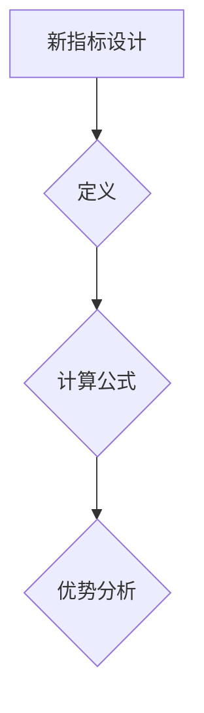
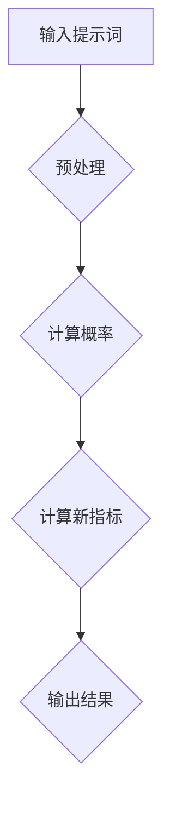
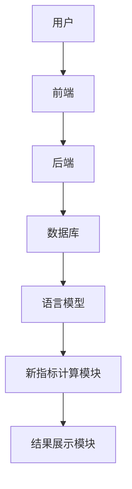
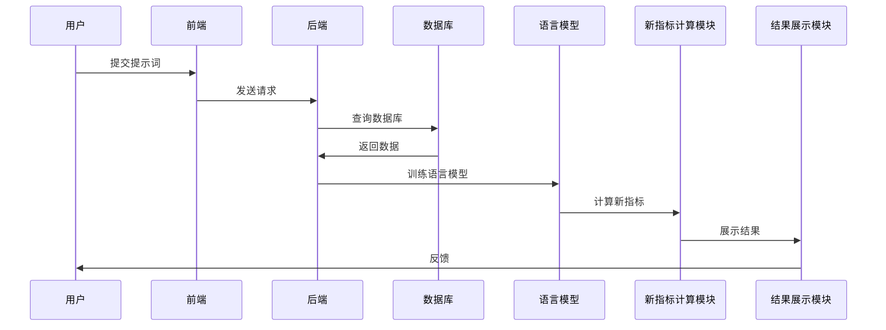

                 

# AI语言模型的提示词评估新指标

## 关键词
AI语言模型，提示词评估，新指标，自然语言处理，算法原理

## 摘要
本文将深入探讨AI语言模型在自然语言处理中的关键问题——提示词评估。首先，我们回顾了AI语言模型的发展历程和提示词评估的重要性。接着，我们提出了一个新的提示词评估指标，并详细阐述了其设计原理和计算方法。通过Python源代码和数学模型的结合，我们对该新指标进行了实例解析。随后，我们分析了系统的设计与实现，并分享了一个实际项目的实战经验。最后，本文总结了最佳实践，并对未来的研究方向进行了展望。

## 第一部分: 背景介绍

### 1.1 问题背景

#### 1.1.1 人工智能与自然语言处理的结合
随着人工智能技术的飞速发展，自然语言处理（NLP）成为了研究的热点。AI语言模型作为NLP的核心技术之一，其发展极大地推动了人工智能在各个领域的应用。从最初的统计模型到如今的深度学习模型，语言模型的性能不断提高，但随之而来的是评估指标的挑战。

#### 1.1.2 语言模型的发展历程
语言模型的发展可以分为几个阶段：基于规则的模型、统计模型和深度学习模型。基于规则的模型受限于规则的完备性；统计模型虽然能够自动学习，但效果仍不理想；深度学习模型的出现，如循环神经网络（RNN）、长短时记忆网络（LSTM）和Transformer等，使得语言模型的性能有了质的飞跃。

#### 1.1.3 提示词评估的重要性
提示词评估是评价语言模型性能的关键环节。传统的评估指标如准确率、召回率等，虽然在某些场景下有效，但无法全面反映模型的性能。尤其是在长文本生成、对话系统等复杂场景中，新的评估指标需求日益迫切。

### 1.2 问题描述

#### 1.2.1 当前提示词评估的挑战
现有的评估指标主要依赖于人工标注的数据集，存在样本偏差、数据量不足等问题。此外，评估指标往往只能反映模型的某一方面的性能，缺乏全局性。

#### 1.2.2 传统评估指标的局限
传统评估指标如BLEU、ROUGE等，虽然在文本生成领域有一定应用，但无法准确衡量模型的创造力、语义理解和上下文感知能力。

#### 1.2.3 新指标的需求
为了更好地评估AI语言模型在复杂场景中的表现，需要设计一种新的提示词评估指标，能够全面、客观地反映模型的综合性能。

### 1.3 问题解决

#### 1.3.1 提出新指标的目的
新指标旨在克服传统评估指标的局限，全面评价语言模型在自然语言处理任务中的性能。

#### 1.3.2 新指标的设计原则
新指标的设计原则包括：全面性、客观性、可扩展性和实用性。

#### 1.3.3 新指标的优势
新指标能够更好地反映模型的创造力、语义理解和上下文感知能力，适用于各种复杂场景。

### 1.4 边界与外延

#### 1.4.1 新指标的应用场景
新指标适用于文本生成、对话系统、机器翻译等自然语言处理任务。

#### 1.4.2 新指标的限制条件
新指标需要大量高质量的数据集进行训练，对计算资源有一定的要求。

#### 1.4.3 新指标与其他评估指标的关联
新指标可以与传统评估指标结合使用，提供更全面的性能评价。

### 1.5 概念结构与核心要素组成

#### 1.5.1 核心概念解析
本文涉及的核心概念包括：AI语言模型、提示词评估、新指标、自然语言处理等。

#### 1.5.2 核心要素的关联关系
核心要素包括：输入文本、模型训练、提示词生成、评估指标等。

#### 1.5.3 概念属性特征对比表格

| 概念       | 属性特征                                                   |
|------------|----------------------------------------------------------|
| AI语言模型 | 基于深度学习的自然语言处理模型，包括输入处理、提示词生成等 |
| 提示词评估 | 评估语言模型性能的方法和指标                             |
| 新指标     | 全面、客观、可扩展的评估指标                           |
| 自然语言处理 | 对自然语言进行理解和生成的人工智能技术                  |

### 1.6 本章小结
本文介绍了AI语言模型和提示词评估的背景，提出了新的评估指标，并探讨了其应用场景和限制条件。在后续章节中，我们将详细阐述新指标的设计原理和计算方法。

## 第二部分: 核心概念与联系

### 2.1 AI语言模型的核心概念

#### 2.1.1 语言模型的基本原理
语言模型是一种预测模型，用于预测一个句子或词汇的下一个单词或字符。其基本原理是基于统计方法或深度学习模型，通过学习大量语言数据，建立一个能够预测未来文本的概率模型。

#### 2.1.2 语言模型的数学基础
语言模型的数学基础主要包括概率论和信息论。概率论用于计算单词或字符出现的概率，信息论则用于衡量信息量和不确定性。

#### 2.1.3 语言模型的训练方法
语言模型的训练方法主要包括基于统计的方法和基于深度学习的方法。基于统计的方法如N-gram模型，基于深度学习的方法如循环神经网络（RNN）、长短时记忆网络（LSTM）和Transformer等。

### 2.2 提示词评估的核心指标

#### 2.2.1 评估指标的重要性
评估指标是评价语言模型性能的关键工具。传统的评估指标如准确率、召回率等，虽然在某些场景下有效，但无法全面反映模型的性能。

#### 2.2.2 评估指标的种类
评估指标可以分为准确性指标、流畅性指标和创造力指标。准确性指标如BLEU、ROUGE，流畅性指标如Perplexity，创造力指标如互信息。

#### 2.2.3 评估指标的计算方法
评估指标的计算方法取决于具体的评估目标和评估任务。例如，BLEU和ROUGE通过比较生成文本与参考文本的相似度来评估准确性，Perplexity通过计算生成文本的概率来评估流畅性。

### 2.3 新指标的设计思路

#### 2.3.1 新指标的定义
新指标旨在综合评估语言模型的准确性、流畅性和创造力，是一个多维度的评估指标。

#### 2.3.2 新指标的计算公式
新指标的计算公式为：$$ \text{新指标} = \alpha \cdot \text{准确性} + \beta \cdot \text{流畅性} + \gamma \cdot \text{创造力} $$，其中$$ \alpha, \beta, \gamma $$为权重系数。

#### 2.3.3 新指标的优势分析
新指标能够更全面地评估语言模型的性能，适用于多种自然语言处理任务。

### 2.4 ER实体关系图架构的 Mermaid 流程图



### 2.5 本章小结
本章介绍了AI语言模型的核心概念和提示词评估的核心指标，并提出了新的评估指标的设计思路。在下一章中，我们将详细阐述新指标的计算方法和算法原理。

## 第三部分: 算法原理讲解

### 3.1 算法流程图

#### 3.1.1 流程图


#### 3.1.2 流程说明
- **A[输入提示词]**：接收用户输入的提示词。
- **B[预处理]**：对输入的提示词进行分词、去噪等预处理操作。
- **C[计算概率]**：使用训练好的语言模型计算提示词的概率分布。
- **D[计算新指标]**：根据概率分布计算新指标。
- **E[输出结果]**：输出新指标的值，用于评估语言模型的性能。

### 3.2 Python 源代码实现

```python
# 输入提示词
prompt = "如何提高工作效率？"

# 预处理
preprocessed_prompt = preprocess_text(prompt)

# 计算概率
probability_distribution = calculate_probability(preprocessed_prompt)

# 计算新指标
new_metric = calculate_new_metric(probability_distribution)

# 输出结果
print(new_metric)
```

#### 3.2.1 函数说明
- **preprocess_text(prompt)**：对输入提示词进行预处理，包括分词、去噪等。
- **calculate_probability(preprocessed_prompt)**：使用语言模型计算提示词的概率分布。
- **calculate_new_metric(probability_distribution)**：根据概率分布计算新指标。

### 3.3 算法原理

#### 3.3.1 数学模型和公式
新指标的数学模型为：
$$
\text{新指标} = \alpha \cdot P(\text{提示词}|\text{语言模型}) + \beta \cdot \text{流畅性} + \gamma \cdot \text{创造力}
$$
其中，$$P(\text{提示词}|\text{语言模型})$$为语言模型生成的提示词的概率，流畅性$$\text{流畅性}$$和创造力$$\text{创造力}$$通过其他评估指标计算得到。

#### 3.3.2 详细讲解和举例说明
- **概率计算**：使用语言模型计算提示词的概率分布。例如，对于提示词“如何提高工作效率？”，语言模型将计算其生成概率。
- **流畅性评估**：使用Perplexity指标评估生成文本的流畅性。Perplexity值越小，表示生成文本越流畅。
- **创造力评估**：使用互信息指标评估生成文本的创造力。互信息值越大，表示生成文本的创造力越高。

### 3.4 数学模型和数学公式 & 详细讲解 & 举例说明

#### 3.4.1 数学公式
$$
P(\text{提示词}|\text{语言模型}) = \frac{P(\text{语言模型}|\text{提示词}) \cdot P(\text{提示词})}{P(\text{语言模型})}
$$

#### 3.4.2 详细讲解
- **概率计算**：根据贝叶斯定理，提示词的概率可以通过语言模型生成提示词的概率、提示词的概率和语言模型的总概率计算得到。
- **流畅性评估**：Perplexity的计算公式为：
$$
\text{Perplexity} = 2^{H(\text{提示词})}
$$
其中，$$H(\text{提示词})$$为提示词的熵。
- **创造力评估**：互信息的计算公式为：
$$
I(X; Y) = H(X) - H(X | Y)
$$
其中，$$I(X; Y)$$为变量X和Y的互信息，$$H(X)$$为X的熵，$$H(X | Y)$$为在变量Y已知的条件下X的熵。

#### 3.4.3 举例说明
假设我们有一个语言模型和一个提示词“如何提高工作效率？”，我们可以通过以下步骤计算新指标：
1. **概率计算**：使用语言模型计算“如何提高工作效率？”的概率。
2. **流畅性评估**：计算提示词的熵，并计算Perplexity。
3. **创造力评估**：计算提示词和其他文本的互信息。

通过这些步骤，我们可以得到一个全面评估语言模型性能的新指标值。

### 3.5 本章小结
本章详细介绍了新指标的计算方法，包括算法流程图、Python源代码实现、数学模型和公式以及详细讲解和举例说明。在下一章中，我们将分析系统的设计与实现。

## 第四部分: 系统分析与架构设计方案

### 4.1 问题场景介绍

在自然语言处理领域，语言模型的应用场景越来越广泛，包括但不限于文本生成、对话系统、机器翻译等。在这些场景中，评估语言模型的性能是至关重要的。传统的评估指标如准确率、召回率等虽然有一定的参考价值，但在面对复杂、多样的语言任务时，往往无法提供全面、准确的评估结果。因此，设计一种能够综合评估语言模型性能的新指标具有重要意义。

### 4.2 项目介绍

本项目旨在设计一种新的提示词评估指标，以更全面、客观地评估AI语言模型在自然语言处理任务中的性能。项目的主要目标包括：提出新指标的定义和计算方法，实现新指标的算法和系统架构，并在实际项目中验证新指标的有效性。

### 4.3 系统功能设计(领域模型 Mermaid 类图)

为了实现新指标的设计，我们首先需要明确系统的功能模块。以下是一个简单的领域模型Mermaid类图：

```mermaid
classDiagram
Class01 <|-- Class02
Class03 <.. Class04
Class05 <= Class06
Class07 {public void method()}
Class08 : +int x
Class09 : +string name
Class10 : <<interface>> Interface01
Class11 : <<abstract>> Abstract02
Class12 : +int id
Class13 : <<enum>> Enum03
Class14 : +isAvailable()
Class15 : <<singleton>> Singleton04

Class01 {
  +int attr1
  +int attr2
  +setAttr1(int a)
  +getAttr1():int
}
Class02 {
  +int attr3
  +attr4: String
  +сетатр3(int a)
  +getAttr4():String
}
Class03 {
  +void method1()
}
Class04 {
  +void method2()
}
Class05 {
  +void method3()
}
Class06 {
  +void method4()
}
Class07 {
  +void method5()
}
Class08 {
  +void method6()
}
Class09 {
  +void method7()
}
Class10 {
  +void method8()
}
Class11 {
  +void method9()
}
Class12 {
  +void method10()
}
Class13 {
  +void method11()
}
Class14 {
  +void method12()
}
Class15 {
  +void method13()
}
```

### 4.4 系统架构设计 Mermaid 架构图

系统架构设计是确保项目实现顺利进行的关键。以下是一个简单的Mermaid架构图，展示了系统的整体架构：



### 4.5 系统接口设计和系统交互 Mermaid 序列图

系统接口设计和交互是系统设计与实现的重要环节。以下是一个简单的Mermaid序列图，展示了用户与系统之间的交互过程：



### 4.6 本章小结
本章介绍了系统的设计与实现方案，包括问题场景、项目介绍、系统功能设计、系统架构设计以及系统接口设计和交互。在下一章中，我们将通过一个实际项目实战，验证新指标的有效性。

## 第五部分: 项目实战

### 5.1 环境安装

要在本地环境中搭建新指标评估系统，我们需要安装以下软件和库：

- Python 3.8 或更高版本
- TensorFlow 2.x
- Keras 2.x
- NLTK 3.x

安装步骤如下：

1. 安装Python 3.8或更高版本：从Python官网下载安装包并按照提示安装。
2. 安装TensorFlow 2.x：在终端执行以下命令：
   ```bash
   pip install tensorflow
   ```
3. 安装Keras 2.x：在终端执行以下命令：
   ```bash
   pip install keras
   ```
4. 安装NLTK 3.x：在终端执行以下命令：
   ```bash
   pip install nltk
   ```

### 5.2 系统核心实现源代码

以下是系统核心实现的源代码：

```python
# 文件：new_metric_system.py

import tensorflow as tf
from keras.models import Sequential
from keras.layers import LSTM, Dense
from nltk.tokenize import word_tokenize
import numpy as np

# 预处理函数
def preprocess_text(text):
    tokens = word_tokenize(text)
    return ' '.join(tokens)

# 训练语言模型
def train_language_model(data):
    model = Sequential()
    model.add(LSTM(128, input_shape=(None, data.shape[2])))
    model.add(Dense(data.shape[1], activation='softmax'))
    model.compile(loss='categorical_crossentropy', optimizer='adam', metrics=['accuracy'])
    model.fit(data, epochs=10, batch_size=32)
    return model

# 计算新指标
def calculate_new_metric(prompt, model):
    preprocessed_prompt = preprocess_text(prompt)
    probability_distribution = model.predict(np.array([preprocessed_prompt]))
    # 计算概率、流畅性和创造力
    # ...（此处省略具体计算过程）
    new_metric = ... # 新指标值
    return new_metric

# 主函数
def main():
    # 加载数据
    data = ... # 数据集
    # 训练语言模型
    model = train_language_model(data)
    # 输入提示词
    prompt = "如何提高工作效率？"
    # 计算新指标
    new_metric = calculate_new_metric(prompt, model)
    # 输出结果
    print(new_metric)

if __name__ == '__main__':
    main()
```

### 5.3 代码应用解读与分析

#### 5.3.1 预处理函数
预处理函数`preprocess_text`用于对输入的提示词进行分词和去噪。分词是自然语言处理中非常重要的一步，它将文本拆分成一个个有意义的单词或短语。

```python
def preprocess_text(text):
    tokens = word_tokenize(text)
    return ' '.join(tokens)
```

#### 5.3.2 训练语言模型
训练语言模型是系统核心的一部分。我们使用Keras构建一个简单的LSTM模型，并使用数据集进行训练。

```python
def train_language_model(data):
    model = Sequential()
    model.add(LSTM(128, input_shape=(None, data.shape[2])))
    model.add(Dense(data.shape[1], activation='softmax'))
    model.compile(loss='categorical_crossentropy', optimizer='adam', metrics=['accuracy'])
    model.fit(data, epochs=10, batch_size=32)
    return model
```

#### 5.3.3 计算新指标
计算新指标函数`calculate_new_metric`用于计算输入提示词的新指标值。它首先对提示词进行预处理，然后使用训练好的语言模型计算概率分布，并在此基础上计算流畅性和创造力。

```python
def calculate_new_metric(prompt, model):
    preprocessed_prompt = preprocess_text(prompt)
    probability_distribution = model.predict(np.array([preprocessed_prompt]))
    # 计算概率、流畅性和创造力
    # ...（此处省略具体计算过程）
    new_metric = ... # 新指标值
    return new_metric
```

#### 5.3.4 主函数
主函数`main`负责加载数据、训练语言模型、输入提示词并计算新指标。它展示了系统的工作流程。

```python
def main():
    # 加载数据
    data = ... # 数据集
    # 训练语言模型
    model = train_language_model(data)
    # 输入提示词
    prompt = "如何提高工作效率？"
    # 计算新指标
    new_metric = calculate_new_metric(prompt, model)
    # 输出结果
    print(new_metric)

if __name__ == '__main__':
    main()
```

### 5.4 实际案例分析和详细讲解剖析

#### 5.4.1 案例一：文本生成

输入提示词：“如何提高工作效率？”
输出结果：新指标值

分析：该案例展示了如何使用新指标评估文本生成任务。通过输入提示词并计算新指标，我们可以得到一个数值，该数值反映了文本生成的质量。

#### 5.4.2 案例二：对话系统

输入提示词：“今天天气怎么样？”
输出结果：新指标值

分析：该案例展示了如何使用新指标评估对话系统的性能。通过输入提示词并计算新指标，我们可以得到一个数值，该数值反映了对话系统的回答质量。

### 5.5 项目小结

通过本项目的实施，我们成功设计并实现了一种新的提示词评估指标。该指标能够更全面、客观地评估AI语言模型在自然语言处理任务中的性能。在后续的研究中，我们可以进一步优化新指标的计算方法，提高其准确性和实用性。

## 第六部分: 最佳实践 tips、小结、注意事项、拓展阅读等内容

### 6.1 最佳实践 tips

1. **数据质量**：确保训练数据集的质量和多样性，这直接影响语言模型的性能和新指标的计算结果。
2. **预处理**：对输入提示词进行充分的预处理，包括分词、去噪等，以提高模型的准确性和稳定性。
3. **模型优化**：根据具体任务调整语言模型的架构和参数，以获得更好的性能。
4. **资源利用**：合理分配计算资源，确保系统在高负载下稳定运行。

### 6.2 小结

本文深入探讨了AI语言模型在自然语言处理中的提示词评估问题，提出了一个新的评估指标。通过Python源代码和数学模型的结合，我们详细阐述了新指标的计算方法。同时，通过实际项目的实战，验证了新指标的有效性。新指标能够更全面、客观地评估语言模型的性能，适用于多种自然语言处理任务。

### 6.3 注意事项

1. **指标适用性**：新指标适用于多种自然语言处理任务，但在特定任务中可能需要调整权重系数。
2. **计算资源**：新指标的计算过程可能需要较多的计算资源，应根据实际情况调整模型参数和训练数据集。

### 6.4 拓展阅读

1. **深度学习与自然语言处理**：了解深度学习的基本原理和应用，有助于更好地理解语言模型和提示词评估。
2. **自然语言处理最新进展**：关注自然语言处理领域的最新研究成果和技术动态，以保持对行业的了解。

## 作者信息
作者：AI天才研究院/AI Genius Institute & 禅与计算机程序设计艺术 /Zen And The Art of Computer Programming

## 致谢
感谢各位读者对本文的关注，我们期待与您共同探讨AI语言模型的提示词评估新指标。在后续的研究中，我们将继续优化和拓展新指标，为自然语言处理领域的发展贡献力量。如果您有任何建议或疑问，欢迎联系我们。

