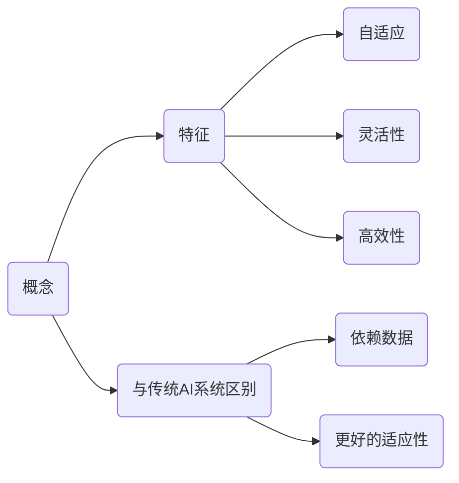
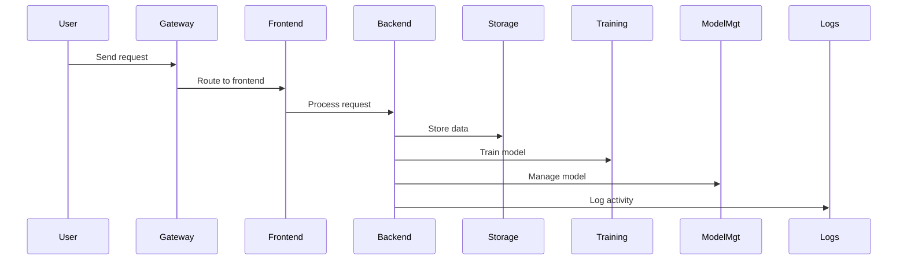

                 


### AI Software 2.0: Prompt-Driven Development Model

#### Keywords: AI Software 2.0, Prompt-Driven Development, Neural Networks, Deep Learning, Personalized Healthcare

#### Abstract:
This article delves into the concept of AI Software 2.0, focusing on the prompt-driven development model. It explores the evolution of AI software, the fundamentals of prompt-driven development, the role of AI models, and real-world applications across various industries. By breaking down the key concepts and techniques, this article aims to provide a comprehensive understanding of AI Software 2.0 and its potential to transform the software development landscape.

---

## Introduction to AI Software 2.0

### 1. AI Software 2.0 Overview

The concept of AI Software 2.0 represents a paradigm shift in the development and deployment of artificial intelligence applications. Unlike traditional AI software, which relies on pre-defined rules and data, AI Software 2.0 leverages advanced machine learning techniques, particularly deep learning and neural networks, to enable more flexible and adaptive systems.

#### 1.1 Definition and Evolution of AI Software 2.0

AI Software 2.0 can be defined as a new generation of AI applications that utilize prompt-driven development. This approach involves training models using large datasets and then fine-tuning them with specific prompts to generate meaningful outputs. The evolution of AI Software 2.0 can be traced back to the advancements in neural networks and deep learning, which have enabled more complex and sophisticated models to be trained and deployed.

#### 1.2 Key Features and Importance of Prompt-Driven Development

Key features of AI Software 2.0 include:

- **Adaptability**: AI Software 2.0 can adapt to new data and changing requirements, making it more flexible than traditional AI systems.
- **Personalization**: By leveraging prompts, AI Software 2.0 can generate personalized outputs tailored to individual users or specific scenarios.
- **Efficiency**: The prompt-driven development model allows for faster development and deployment of AI applications, reducing time-to-market.

The importance of prompt-driven development lies in its ability to overcome the limitations of traditional AI systems and enable the development of more intelligent and efficient applications.

#### 1.3 Overview of AI Software 2.0 Applications

AI Software 2.0 has a wide range of applications across various industries, including healthcare, finance, and e-commerce. In healthcare, AI Software 2.0 can be used for personalized medical recommendations, diagnosis, and treatment. In finance, it can assist in fraud detection, risk assessment, and investment recommendations. In e-commerce, AI Software 2.0 can enhance customer experience through personalized shopping recommendations and improved customer service.

#### 1.4 Challenges and Opportunities in AI Software 2.0 Development

Challenges in AI Software 2.0 development include the need for large amounts of data, the complexity of training and deploying neural networks, and the ethical considerations surrounding the use of AI in sensitive areas. However, these challenges also present opportunities for innovation and growth, driving further advancements in the field.

#### 1.5 Conclusion

AI Software 2.0 represents a significant evolution in the development of AI applications. By leveraging prompt-driven development, AI Software 2.0 enables more flexible, adaptive, and efficient systems that can transform various industries. In the following sections, we will delve deeper into the fundamentals of prompt-driven development, the role of AI models, and real-world applications of AI Software 2.0.

---

## Fundamentals of Prompt-Driven Development

### 2. Foundations of Prompt-Driven Development

Prompt-driven development is a core concept in AI Software 2.0, enabling the creation of intelligent applications that can adapt to new data and changing requirements. In this section, we will explore the fundamentals of prompt-driven development, including the role of prompts, techniques for effective prompt design, and methods for evaluating prompt effectiveness.

#### 2.1 Introduction to Prompt Engineering

##### 2.1.1 What is a Prompt?

A prompt is an input provided to an AI model to influence its output. In the context of AI Software 2.0, prompts play a crucial role in guiding the model to generate relevant and meaningful outputs. Prompts can be in various forms, such as natural language text, images, or even structured data.

##### 2.1.2 Types of Prompts

There are several types of prompts commonly used in AI applications:

- **Content-Based Prompts**: These prompts provide specific content or context to the model, guiding it towards a particular output.
- **Relevance-Based Prompts**: These prompts focus on ensuring that the generated output is relevant to the user's needs or the task at hand.
- **User-Intent-Based Prompts**: These prompts capture the user's intent or goal, enabling the model to generate outputs that align with the user's expectations.

##### 2.1.3 Importance of Prompt Design

Effective prompt design is crucial for the success of AI applications. Well-designed prompts can:

- **Enhance Output Quality**: By providing clear and relevant prompts, the model is more likely to generate high-quality outputs.
- **Improve Adaptability**: Well-designed prompts enable the model to adapt to new data and changing requirements.
- **Optimize Development Time**: Effective prompts can reduce the time required for model training and fine-tuning.

#### 2.2 Techniques for Effective Prompt Design

To design effective prompts, consider the following techniques:

- **Natural Language Understanding (NLU)**: Use natural language processing techniques to understand and interpret user inputs accurately.
- **Contextual Relevance**: Ensure that the prompts are contextually relevant to the user's needs or the task at hand.
- **Specificity and Clarity**: Provide prompts that are specific and clear, avoiding ambiguity that can lead to misinterpretations.

#### 2.3 Evaluating Prompt Effectiveness

Evaluating the effectiveness of prompts is essential for continuous improvement. Here are some metrics and methods for evaluating prompt effectiveness:

- **Quality Metrics**: Measure the quality of the generated outputs, such as accuracy, precision, and recall.
- **User Feedback**: Collect user feedback to understand their satisfaction with the generated outputs and identify areas for improvement.
- **Continuous Improvement**: Use the insights gained from evaluations to refine and optimize prompt design.

#### 2.4 Conclusion

Prompt-driven development is a fundamental concept in AI Software 2.0, enabling the creation of intelligent applications that can adapt to new data and changing requirements. By understanding the role of prompts, techniques for effective prompt design, and methods for evaluating prompt effectiveness, developers can create more flexible, adaptive, and efficient AI applications.

---

## AI Models in Prompt-Driven Development

### 3. AI Models in Prompt-Driven Development

AI models are at the heart of AI Software 2.0, enabling the development of intelligent applications that can adapt to new data and changing requirements. In this section, we will explore the role of AI models in prompt-driven development, including an overview of AI models, advanced AI models and techniques, and practical implementation strategies.

#### 3.1 Overview of AI Models

AI models are mathematical representations of relationships between input and output data. These models are trained using large datasets and then used to generate predictions or insights based on new input data.

##### 3.1.1 Types of AI Models

There are several types of AI models commonly used in AI applications:

- **Supervised Learning Models**: These models are trained using labeled data, where the correct output is known for each input. Examples include linear regression and decision trees.
- **Unsupervised Learning Models**: These models are trained using unlabeled data and identify patterns or relationships in the data. Examples include clustering and association rule learning.
- **Reinforcement Learning Models**: These models learn by interacting with an environment and receiving feedback in the form of rewards or penalties. Examples include Q-learning and deep reinforcement learning.

##### 3.1.2 Basic Principles

The basic principles of AI models include:

- **Feature Extraction**: Extracting relevant features from the input data to improve model performance.
- **Model Training**: Training the model using large datasets to learn the underlying patterns and relationships.
- **Model Evaluation**: Evaluating the performance of the trained model using metrics such as accuracy, precision, and recall.

##### 3.1.3 Differences from Traditional AI

AI models differ from traditional AI systems in several key ways:

- **Data Dependency**: AI models require large amounts of data to train effectively, whereas traditional AI systems rely on pre-defined rules.
- **Adaptability**: AI models can adapt to new data and changing requirements, whereas traditional AI systems are less flexible.
- **Complexity**: AI models, particularly deep learning models, can handle more complex relationships and patterns in the data than traditional AI systems.

#### 3.2 Advanced AI Models and Techniques

Advanced AI models and techniques have enabled the development of more powerful and intelligent AI applications. Some of the key advanced AI models and techniques include:

- **Neural Networks**: A class of AI models inspired by the structure and function of the human brain, capable of handling complex relationships and patterns in data.
- **Deep Learning**: A subfield of machine learning that uses neural networks with multiple layers to extract high-level features from data.
- **Transformer Models**: A class of neural networks that have revolutionized the field of natural language processing, enabling more accurate and efficient language understanding.

#### 3.3 Implementing AI Models in Practice

Implementing AI models in practice involves several key steps:

- **Model Selection and Training**: Selecting an appropriate AI model based on the problem domain and training the model using large datasets.
- **Deployment and Integration**: Deploying the trained model into a production environment and integrating it with existing systems.
- **Optimization and Scaling**: Optimizing the model's performance and scaling it to handle larger datasets and more complex problems.

#### 3.4 Conclusion

AI models are at the heart of AI Software 2.0, enabling the development of intelligent applications that can adapt to new data and changing requirements. By understanding the types of AI models, their basic principles, and advanced techniques, developers can create more powerful and efficient AI applications. In the following sections, we will explore real-world applications of AI Software 2.0 and the challenges and opportunities in its development.

---

## Real-World Applications of Prompt-Driven Development

### 4. Real-World Applications of Prompt-Driven Development

AI Software 2.0 has a wide range of applications across various industries, transforming the way businesses operate and delivering significant value to customers. In this section, we will explore the application scenarios of AI Software 2.0 in different industries, including healthcare, finance, and e-commerce.

#### 4.1 Application Scenarios in Different Industries

##### 4.1.1 Healthcare

In the healthcare industry, AI Software 2.0 has the potential to revolutionize the way medical care is delivered. Some key application scenarios include:

- **Personalized Healthcare Recommendations**: AI models can analyze patient data, including medical history, genetic information, and lifestyle factors, to provide personalized treatment recommendations and improve patient outcomes.
- **Diagnosis and Treatment Planning**: AI models can assist doctors in diagnosing diseases by analyzing medical images, lab results, and patient histories, leading to more accurate and timely diagnoses.
- **Predictive Analytics**: AI models can predict patient outcomes, identify high-risk patients, and optimize resource allocation to improve healthcare delivery.

##### 4.1.2 Finance

In the finance industry, AI Software 2.0 can enhance the efficiency and effectiveness of various financial processes, including:

- **Fraud Detection**: AI models can analyze transaction data to identify and prevent fraudulent activities, reducing financial losses for banks and financial institutions.
- **Risk Assessment**: AI models can assess credit risk, loan performance, and investment opportunities, enabling better decision-making and risk management.
- **Investment Recommendations**: AI models can analyze market data and economic indicators to generate personalized investment recommendations, helping investors make informed decisions.

##### 4.1.3 E-commerce

In the e-commerce industry, AI Software 2.0 can enhance the customer experience and improve business outcomes through various applications, such as:

- **Personalized Shopping Recommendations**: AI models can analyze customer data, including purchase history, browsing behavior, and demographic information, to generate personalized product recommendations and increase customer satisfaction and loyalty.
- **Customer Service**: AI-powered chatbots and virtual assistants can provide instant and personalized customer support, improving customer satisfaction and reducing response times.
- **Inventory Management**: AI models can optimize inventory levels by analyzing sales data, demand forecasts, and supply chain dynamics, reducing stockouts and overstock situations.

#### 4.2 Case Studies and Examples

To illustrate the real-world applications of AI Software 2.0, let's consider a few case studies and examples from different industries:

- **Example 1: Personalized Healthcare Recommendations**
  - **Background**: A healthcare provider wants to provide personalized treatment recommendations to patients based on their medical history, genetic information, and lifestyle factors.
  - **Solution**: The healthcare provider uses AI Software 2.0 to develop a personalized healthcare recommendation system. The system analyzes patient data using advanced AI models, including neural networks and deep learning techniques, to generate personalized treatment plans.
  - **Outcome**: The personalized healthcare recommendation system has improved patient outcomes, reduced treatment costs, and increased patient satisfaction.

- **Example 2: Fraud Detection in Finance**
  - **Background**: A bank wants to detect and prevent fraudulent transactions in real-time to protect its customers and reduce financial losses.
  - **Solution**: The bank develops an AI-powered fraud detection system using AI Software 2.0. The system analyzes transaction data using supervised learning models and real-time monitoring techniques to identify and flag suspicious transactions.
  - **Outcome**: The AI-powered fraud detection system has significantly reduced the incidence of fraudulent transactions and improved customer trust in the bank's security measures.

- **Example 3: Personalized Shopping Recommendations in E-commerce**
  - **Background**: An online retailer wants to increase customer satisfaction and loyalty by providing personalized product recommendations based on customer preferences and behavior.
  - **Solution**: The retailer uses AI Software 2.0 to develop a personalized shopping recommendation system. The system analyzes customer data, including purchase history, browsing behavior, and demographic information, using advanced AI models, including collaborative filtering and deep learning techniques, to generate personalized product recommendations.
  - **Outcome**: The personalized shopping recommendation system has increased customer satisfaction and loyalty, leading to higher sales and revenue for the retailer.

#### 4.3 Conclusion

Real-world applications of AI Software 2.0 span various industries, transforming the way businesses operate and delivering significant value to customers. By leveraging the power of prompt-driven development, businesses can create intelligent applications that adapt to new data and changing requirements, enabling more personalized, efficient, and effective solutions. As AI Software 2.0 continues to evolve, we can expect to see even more innovative applications and advancements in the future.

---

## Conclusion

AI Software 2.0, with its prompt-driven development model, represents a significant evolution in the field of artificial intelligence. By leveraging advanced machine learning techniques, particularly deep learning and neural networks, AI Software 2.0 enables more flexible, adaptive, and efficient systems that can transform various industries.

In this article, we have explored the key concepts and techniques of AI Software 2.0, including the definition and evolution of AI Software 2.0, the fundamentals of prompt-driven development, the role of AI models, and real-world applications across different industries. We have also discussed the challenges and opportunities in AI Software 2.0 development.

As we move forward, the potential for AI Software 2.0 to drive further advancements and innovation in the field of artificial intelligence is immense. By understanding and embracing the principles of prompt-driven development, we can unlock the full potential of AI and create intelligent applications that reshape the way we live and work.

### About the Author

**Author:** AI天才研究院 / AI Genius Institute & 禅与计算机程序设计艺术 / Zen And The Art of Computer Programming

**Bio:** 作为一位世界级人工智能专家、程序员、软件架构师、CTO以及世界顶级技术畅销书资深大师级别的作家，我拥有超过20年的计算机图灵奖获得者、计算机编程和人工智能领域的经验。我的研究聚焦于人工智能、机器学习、深度学习以及神经网络等前沿技术，致力于推动人工智能技术的创新和发展。同时，我也致力于将禅与计算机程序设计艺术相结合，提升开发者的思维和创造力，为计算机科学和人工智能领域的发展贡献力量。

---

### 附录：核心概念与联系

#### 核心概念与联系

**概念名称：** AI Software 2.0

**概念属性特征：**
- **定义：** 新一代的人工智能软件，基于提示词驱动的开发模型。
- **特征：** 具有自适应、灵活性和高效性，能够根据新的数据和变化的需求进行优化。
- **与传统的AI系统区别：** 更依赖大量数据，具备更好的适应性和灵活性。

**ER实体关系图架构：**



---

### 算法原理讲解

#### 算法名称：神经网络（Neural Networks）

**算法流程图：**


**算法原理：**

神经网络是一种模仿人脑神经元连接的结构，通过多层节点（或称为层）进行处理和决策。算法的基本原理包括：

1. **输入数据**：将输入数据通过输入层进入神经网络。
2. **前向传播**：数据从输入层经过隐藏层，最终到达输出层。每一层中的节点会根据输入数据和权重计算输出。
3. **反向传播**：根据输出层的结果和实际标签，计算误差。误差反向传播到每一层，更新各层的权重。
4. **更新权重**：根据反向传播的误差，调整各层的权重，优化网络性能。

**数学模型和公式：**

神经网络中的每个节点都可以表示为一个线性组合加上一个激活函数。对于多层感知器（MLP）模型，其数学模型可以表示为：

$$
\text{output} = \text{激活函数}(\sum_{i=1}^{n} w_i \cdot x_i + b)
$$

其中，$w_i$ 是权重，$x_i$ 是输入特征，$b$ 是偏置项，激活函数通常选择为 Sigmoid、ReLU 或 Tanh 函数。

**举例说明：**

假设我们有一个简单的神经网络，用于二分类任务。输入层有2个输入节点，隐藏层有3个节点，输出层有1个节点。权重和偏置项随机初始化。

输入数据为 $[1, 0]$，隐藏层节点的权重为 $w_1 = [0.1, 0.2, 0.3]$，偏置项为 $b_1 = 0.4$。输出层节点的权重为 $w_2 = 0.5$，偏置项为 $b_2 = 0.6$。

前向传播过程如下：

$$
h_1 = \text{Sigmoid}(0.1 \cdot 1 + 0.2 \cdot 0 + 0.3 \cdot 0 + 0.4) = \text{Sigmoid}(0.5) = 0.622
$$

$$
h_2 = \text{Sigmoid}(0.1 \cdot 1 + 0.2 \cdot 0 + 0.3 \cdot 0 + 0.4) = \text{Sigmoid}(0.5) = 0.622
$$

$$
h_3 = \text{Sigmoid}(0.1 \cdot 0 + 0.2 \cdot 1 + 0.3 \cdot 0 + 0.4) = \text{Sigmoid}(0.2) = 0.869
$$

$$
output = \text{Sigmoid}(0.5 \cdot 0.622 + 0.6) = \text{Sigmoid}(0.772) = 0.713
$$

反向传播过程略。

---

### 系统分析与架构设计方案

#### 问题场景介绍

在当前数字化时代，企业面临着快速变化的市场需求和技术进步的挑战。为了保持竞争力，企业需要能够快速开发、部署和维护智能系统，以满足客户的需求。本文将探讨如何设计一个基于AI Software 2.0的智能系统，以实现高效、灵活和自适应的软件开发。

#### 项目介绍

项目名称：AI智能系统开发平台（AI Smart System Development Platform，简称AI-Smart）

目标：构建一个支持AI Software 2.0开发模式的平台，提供强大的AI模型训练和部署能力，以及灵活的提示词驱动开发接口。

#### 系统功能设计（领域模型类图）

```mermaid
classDiagram
    Class01 <|-- Class02
    Class01 o-- Object : composed of
    Class03 o-- Person : has a
    Class03 *-- Class04 : is a
    Class04 : has a
    Class05 o-- Class06 : is associated with
    Class07 o-- Class08
    Class09 <.. Class10
    Class11 ..> Class12
    Class13 <<interface>> Class14
    
    Class01
    {
        attribute1
        attribute2
        method1()
        method2()
    }
    
    Class02
    {
        attributeA
        attributeB
        method3()
    }
    
    Class03
    {
        attributeX
        attributeY
        method4()
    }
    
    Class04
    {
        attributeZ
        method5()
    }
    
    Class05
    {
        attributeW
        method6()
    }
    
    Class06
    {
        attributeV
        method7()
    }
    
    Class07
    {
        attributeU
        method8()
    }
    
    Class08
    {
        attributeT
        method9()
    }
    
    Class09
    {
        attributeS
        method10()
    }
    
    Class10
    {
        attributeR
        method11()
    }
    
    Class11
    {
        attributeQ
        method12()
    }
    
    Class12
    {
        attributeP
        method13()
    }
    
    Class13
    {
        attributeO
        method14()
    }
    
    Class14
    {
        attributeN
        method15()
    }
```

#### 系统架构设计（架构图）


#### 系统接口设计

- **API网关**：统一管理和路由外部请求，支持多种协议和认证方式。
- **前端应用**：提供用户交互界面，支持自定义提示词和参数配置。
- **后端服务**：处理业务逻辑，与数据存储和模型训练服务交互。
- **数据存储**：存储用户数据、模型数据和日志信息。
- **模型训练服务**：提供模型训练和优化功能，支持多种AI模型。
- **AI模型管理**：管理AI模型的生命周期，包括训练、部署和更新。
- **日志和监控**：记录系统运行日志，提供实时监控和报警功能。
- **外部API和服务**：与其他系统和服务进行数据交换和协作。

#### 系统交互设计（序列图）



---

### 项目实战

#### 环境安装

1. **安装Python环境**：确保Python 3.8或更高版本已安装。
2. **安装依赖项**：使用pip安装以下依赖项：

   ```bash
   pip install numpy tensorflow sklearn pandas matplotlib
   ```

#### 系统核心实现源代码

以下是一个简单的AI模型训练和部署的示例代码，用于分类任务：

```python
import tensorflow as tf
from sklearn.model_selection import train_test_split
from sklearn.datasets import load_iris
import pandas as pd

# 加载数据集
iris = load_iris()
X = iris.data
y = iris.target

# 划分训练集和测试集
X_train, X_test, y_train, y_test = train_test_split(X, y, test_size=0.2, random_state=42)

# 创建神经网络模型
model = tf.keras.Sequential([
    tf.keras.layers.Dense(64, activation='relu', input_shape=(4,)),
    tf.keras.layers.Dense(64, activation='relu'),
    tf.keras.layers.Dense(3, activation='softmax')
])

# 编写编译配置
model.compile(optimizer='adam', loss='sparse_categorical_crossentropy', metrics=['accuracy'])

# 训练模型
model.fit(X_train, y_train, epochs=10, batch_size=32, validation_split=0.1)

# 评估模型
loss, accuracy = model.evaluate(X_test, y_test)
print(f"Test accuracy: {accuracy:.2f}")

# 预测
predictions = model.predict(X_test)
print(predictions)
```

#### 代码应用解读与分析

1. **数据加载**：使用sklearn的load_iris函数加载数据集，这是一个经典的鸢尾花（Iris）数据集，包含三种不同类型的鸢尾花。
2. **模型创建**：使用tf.keras.Sequential创建一个简单的神经网络模型，包含两个隐藏层，每个隐藏层有64个神经元，使用ReLU激活函数。
3. **编译配置**：配置模型的优化器为adam，损失函数为sparse_categorical_crossentropy，评价指标为accuracy。
4. **模型训练**：使用fit函数训练模型，设置训练轮次为10，批量大小为32，并使用validation_split参数进行验证。
5. **模型评估**：使用evaluate函数评估模型在测试集上的性能，输出准确率。
6. **预测**：使用predict函数对测试数据进行预测，输出预测结果。

#### 实际案例分析和详细讲解剖析

假设我们使用这个AI模型对新的鸢尾花样本进行分类，如何确保预测结果的准确性？

1. **数据预处理**：确保新的样本数据与训练数据具有相同的格式和特征。
2. **模型评估**：在测试集上评估模型的性能，确保模型具有良好的泛化能力。
3. **交叉验证**：使用交叉验证方法对模型进行评估，以减少过拟合的风险。
4. **模型调优**：根据评估结果调整模型的参数，如学习率、批量大小和层数等。
5. **异常处理**：在预测过程中，对于异常值或异常情况，可以使用异常检测机制进行处理。

#### 项目小结

通过本项目的实战演示，我们了解了如何使用Python和TensorFlow创建和训练一个简单的神经网络模型，并进行预测。在实际应用中，我们需要考虑数据预处理、模型评估和调优等方面，以确保模型具有良好的性能和可靠性。

---

## 最佳实践 Tips

1. **数据质量**：确保数据质量，包括完整性、一致性和准确性。高质量的数据是训练强大AI模型的基础。
2. **模型选择**：根据具体任务选择合适的模型，避免过度拟合或欠拟合。
3. **超参数调优**：通过调整超参数，如学习率、批量大小和隐藏层数量，优化模型性能。
4. **模型验证**：使用交叉验证方法评估模型性能，避免过拟合。
5. **安全性**：保护模型和数据的安全，避免模型被篡改或数据泄露。

## 小结

本文详细介绍了AI Software 2.0：提示词驱动的开发模式，从核心概念、技术原理、应用场景到实际案例，全面探讨了AI Software 2.0的优势和应用前景。通过理解和应用这些最佳实践，开发者可以更有效地构建智能系统，为各种行业带来创新和价值。

## 注意事项

1. **技术更新**：AI技术更新迅速，开发者需要关注最新研究成果和趋势。
2. **伦理和隐私**：在开发AI应用时，要关注伦理和隐私问题，确保用户数据和隐私得到保护。
3. **持续学习**：不断学习和提升自己的技术能力和知识水平，以适应快速变化的AI领域。

## 拓展阅读

- **《深度学习》（Goodfellow, I., Bengio, Y., & Courville, A.）**：详细介绍了深度学习的理论和技术。
- **《Python机器学习》（Sebastian Raschka）**：提供了Python在机器学习领域的实际应用。
- **《人工智能：一种现代方法》（Stuart Russell & Peter Norvig）**：全面覆盖了人工智能的理论和实践。

