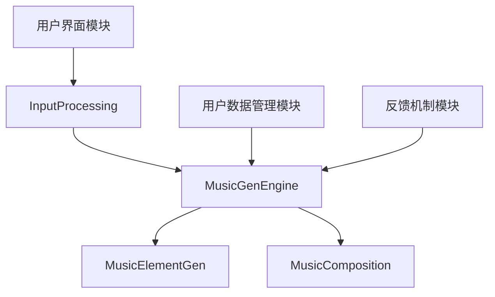
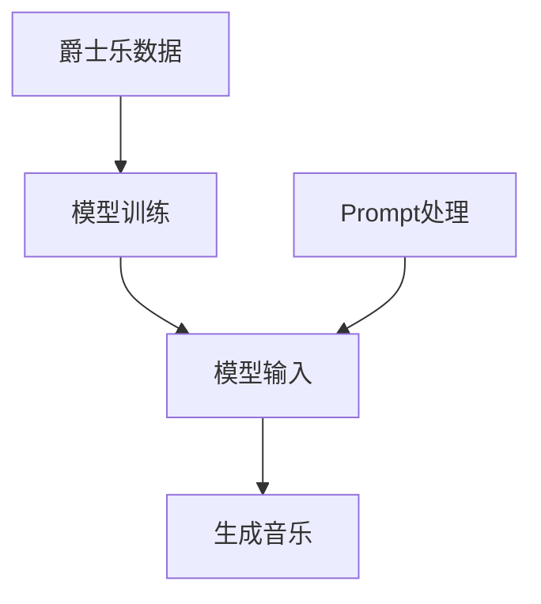
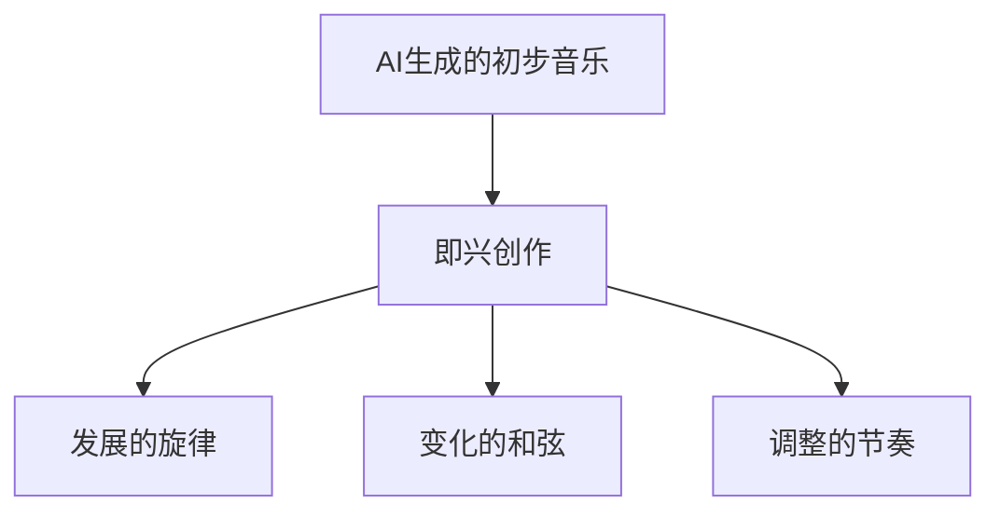
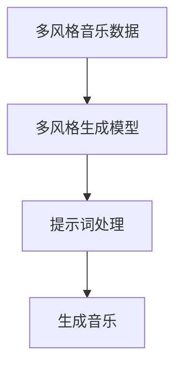

                 

## AI辅助交互式音乐即兴创作的提示词技巧

### 关键词
- AI辅助音乐创作
- 交互式即兴创作
- 提示词技巧
- 深度学习
- 音乐生成算法

### 摘要
本文旨在深入探讨AI辅助交互式音乐即兴创作的提示词技巧，通过详细分析相关技术原理和实践方法，为音乐创作者和研究者提供系统化的指导和参考。本文将首先介绍音乐即兴创作的背景，然后阐述AI在音乐创作中的应用及其重要性。接下来，我们将探讨提示词的概念、生成技术，以及如何在实际的交互式音乐创作系统中应用这些技巧。通过项目实战和分析，本文将展示AI辅助音乐即兴创作的实际效果，并提出未来研究的方向。

### 目录

1. 引言
   - 1.1 音乐即兴创作的背景
   - 1.2 人工智能与音乐创作的结合
   - 1.3 提示词在音乐即兴创作中的作用

2. AI辅助音乐创作基础
   - 2.1 AI在音乐领域的发展
   - 2.2 AI辅助音乐创作的原理
   - 2.3 提示词的概念与分类

3. 提示词生成技术
   - 3.1 基于规则的方法
   - 3.2 域自适应的机器学习方法
   - 3.3 基于深度学习的生成方法

4. 交互式音乐即兴创作系统设计
   - 4.1 交互式音乐创作系统的需求分析
   - 4.2 系统架构设计
   - 4.3 系统接口设计

5. 提示词技巧实战
   - 5.1 环境搭建与工具选择
   - 5.2 提示词生成算法实现
   - 5.3 交互式音乐即兴创作实践

6. 案例分析
   - 6.1 案例一：基于提示词的音乐创作工作流程
   - 6.2 案例二：不同风格的音乐即兴创作实践
   - 6.3 案例总结与反思

7. 结论与展望
   - 7.1 总结
   - 7.2 未来发展趋势
   - 7.3 研究方向与挑战

## 引言

### 1.1 音乐即兴创作的背景

音乐即兴创作是一种极具创造性的音乐创作方式，它要求音乐家在没有任何预先准备的情况下，依靠自己的直觉和经验，现场即兴创作音乐。这种创作方式不仅需要音乐家具备高超的演奏技巧和丰富的音乐理论知识，还需要他们在现场迅速捕捉灵感，进行即兴创作。音乐即兴创作在古典音乐、爵士乐等音乐形式中尤为重要，它能够极大地丰富音乐的表现力和多样性。

然而，音乐即兴创作也存在一定的挑战。首先，即兴创作需要音乐家具备极强的现场反应能力和心理素质。音乐家需要在极短的时间内进行音乐构思和表现，这对他们的演奏技巧和心理承受能力提出了极高的要求。其次，即兴创作往往需要音乐家具备丰富的音乐知识和经验，能够快速找到合适的音乐元素和表现手法。这对于新手音乐家来说可能是一个巨大的挑战。

### 1.2 人工智能与音乐创作的结合

近年来，人工智能在音乐创作中的应用逐渐成为一个热点研究领域。人工智能能够通过学习大量的音乐数据，生成出新颖的音乐作品。这些作品不仅能够模仿人类音乐家的创作风格，还能够创造出独特的音乐风格。这种结合不仅为音乐创作提供了新的可能性，也为音乐即兴创作提供了一种全新的方式。

首先，人工智能可以帮助音乐家进行音乐创作。通过深度学习算法，人工智能可以分析大量的音乐作品，提取出音乐的特征和模式。这些特征和模式可以作为音乐家进行创作的灵感来源，帮助他们快速构思和创作出新的音乐作品。

其次，人工智能可以为音乐即兴创作提供技术支持。人工智能可以通过生成提示词或提示旋律，为音乐家提供即兴创作的方向。这种提示可以基于音乐家的个人风格，也可以基于特定的音乐风格或作品。音乐家可以根据这些提示进行即兴创作，从而提高创作的效率和表现力。

### 1.3 提示词在音乐即兴创作中的作用

提示词在音乐即兴创作中扮演着至关重要的角色。提示词是指为音乐家提供创作灵感和方向的音乐元素，可以是旋律、节奏、和声等。通过使用提示词，音乐家可以更快地进入创作状态，提高即兴创作的效率和质量。

首先，提示词可以帮助音乐家快速找到创作灵感。音乐家在即兴创作时，往往会遇到灵感枯竭或创作困难的情况。此时，使用提示词可以为他们提供新的音乐元素，激发他们的创作灵感。

其次，提示词可以提高即兴创作的表现力。通过使用不同的提示词，音乐家可以创造出丰富的音乐效果，增强音乐的表现力。例如，在爵士乐中，使用不同的节奏提示词可以创造出不同的节奏感，使音乐更加生动和有趣。

最后，提示词还可以帮助音乐家进行音乐风格的探索。通过使用不同的提示词，音乐家可以尝试不同的音乐风格，从而拓宽自己的音乐视野，提高音乐创作的多样性。

### 总结

音乐即兴创作是一种极具创造性的音乐创作方式，它需要音乐家具备高超的技巧和心理素质。人工智能与音乐创作的结合为音乐即兴创作提供了新的可能性，通过生成提示词，人工智能可以帮助音乐家快速找到创作灵感，提高创作的效率和质量。提示词在音乐即兴创作中具有重要作用，它们不仅可以帮助音乐家快速进入创作状态，还可以提高音乐的表现力和多样性。在接下来的章节中，我们将进一步探讨AI辅助音乐创作的基础知识，以及如何生成和应用提示词。这些内容将为音乐家提供更深入的指导和参考。

## AI辅助音乐创作基础

### 2.1 AI在音乐领域的发展

人工智能在音乐领域的应用可以追溯到20世纪60年代，当时计算机开始被用于音乐创作和表演。最初的尝试主要集中在生成简单的旋律和节奏，但随后的几十年中，随着计算能力的提升和算法的进步，人工智能在音乐领域的应用逐渐深化和扩展。

**早期的探索**：
- **音乐生成**：早期的研究主要集中在生成旋律和简单的节奏。例如，音乐生成器“Musicol”和“Music Mouse”等，它们通过规则系统生成音乐。
- **音乐分析**：人工智能也用于音乐分析，例如音乐结构解析、音乐风格分类等。

**20世纪90年代至今**：
- **深度学习**：随着深度学习技术的发展，神经网络在音乐生成中的应用变得更加广泛和精准。生成对抗网络（GAN）和变分自编码器（VAE）等模型被用于生成更加复杂和多样化的音乐。
- **自适应音乐创作**：AI可以根据用户的偏好和学习用户的音乐风格，生成符合用户口味的音乐。

**重要进展**：
- **Google的Magenta项目**：该项目旨在研究如何利用机器学习创作音乐和艺术，并已经生成了一系列有影响力的音乐作品。
- **AIVA（Artificial Intelligence Virtual Artist）**：这是一个商业化的AI音乐创作平台，能够生成多种风格的音乐作品。

### 2.2 AI辅助音乐创作的原理

AI辅助音乐创作的核心在于能够理解和生成音乐数据，这通常涉及以下几种技术：

**音乐数据表示**：
- **符号表示**：将音乐转换为符号序列，例如MIDI文件。这种表示方法直观且易于处理，但可能丢失一些细微的音乐特征。
- **时频表示**：通过傅里叶变换将音乐信号转换为时频表示，这种表示可以捕捉音乐信号的时间域和频率域特征。

**生成模型**：
- **基于规则的方法**：这种方法依赖于预定义的规则来生成音乐。尽管简单，但可能缺乏多样性和创造力。
- **基于统计的方法**：这种方法通过分析大量音乐数据来学习音乐生成规律，如隐马尔可夫模型（HMM）和马尔可夫决策过程（MDP）。
- **深度学习模型**：深度学习模型，如循环神经网络（RNN）、长短期记忆网络（LSTM）和生成对抗网络（GAN），能够捕捉更复杂的音乐特征，生成更加多样化和高质量的乐曲。

**提示词和交互**：
- **提示词生成**：通过算法生成初步的提示词，这些提示词可以是旋律、节奏或和弦等。
- **用户交互**：用户可以通过反馈调整生成的音乐，使其更符合个人喜好或特定场景需求。

### 2.3 提示词的概念与分类

在AI辅助音乐创作中，提示词是指导AI生成音乐的元素，可以是单个音符、和弦、节奏模式或更长的一段旋律。根据提示词的类型和用途，可以将提示词分为以下几类：

**1. 旋律提示词**：
- **单旋律**：提供一段旋律作为提示，AI根据旋律生成相应的和弦和节奏。
- **旋律片段**：提供一段旋律的片段，AI根据片段推断出后续的旋律走向。

**2. 节奏提示词**：
- **节奏模式**：提供一段节奏模式，AI生成符合该节奏模式的旋律和和弦。
- **节奏变化**：通过提示特定的节奏变化，AI在创作中引入多样化的节奏元素。

**3. 和弦提示词**：
- **和弦进行**：提供一系列和弦，AI生成符合和弦进行的旋律和节奏。
- **和弦变化**：提示特定的和弦变化模式，AI在创作中引入和弦变化的多样性。

**4. 风格提示词**：
- **音乐风格**：通过提示特定的音乐风格，AI生成符合该风格的乐曲。
- **情感标签**：提供情感标签，AI生成能够表达特定情感的乐曲。

### 总结

AI在音乐领域的应用经历了从简单到复杂的演变，从早期的规则系统到现代的深度学习模型，AI在音乐创作中的作用越来越重要。提示词作为AI生成音乐的指导元素，通过不同类型的提示词，AI能够生成丰富多样的音乐作品。在接下来的章节中，我们将深入探讨如何生成和应用这些提示词，以及如何设计交互式音乐即兴创作系统。

## 提示词生成技术

### 3.1 基于规则的方法

基于规则的方法是AI辅助音乐创作中的一种传统技术，它通过预先定义的规则来生成音乐。这种方法简单直观，易于实现，但其生成的音乐可能缺乏多样性和创造力。

#### 3.1.1 提示词规则设计

提示词规则设计是核心部分，它决定了生成的音乐风格和表现。设计提示词规则时，需要考虑以下几个关键因素：

1. **音乐理论基础**：
   - **和弦理论**：设计和弦进行的规则，确保生成的旋律和和声合理。
   - **节奏理论**：设计节奏模式和变化，使音乐节奏富有变化和动感。

2. **音乐风格**：
   - **古典音乐**：基于古典音乐的和声和节奏规则，设计相应的提示词。
   - **爵士音乐**：结合爵士音乐的特殊和声和节奏模式，设计爵士风格的提示词。

3. **用户偏好**：
   - **个性化规则**：根据用户的音乐喜好，设计特定的规则，生成更符合用户口味的音乐。

#### 3.1.2 提示词规则应用案例

应用基于规则的方法生成音乐，可以参考以下案例：

**案例1：古典音乐创作**
- **和弦规则**：设计基于I-IV-V-I和弦进行的规则，确保生成的旋律和和声遵循古典音乐的规范。
- **节奏规则**：设计固定的节奏模式，如每小节三个四分音符，增强音乐的稳定性和连贯性。

**案例2：爵士音乐创作**
- **和弦规则**：使用II-V-I和七和弦进行，引入爵士音乐中的特殊和声。
- **节奏规则**：设计复杂的节奏变化，如双倍时间感觉和同步音，增加音乐的节奏感和动感。

#### 3.1.3 优点和局限性

**优点**：
- **简单易实现**：基于规则的系统结构简单，易于开发和维护。
- **可解释性强**：规则明确，生成的音乐易于理解。

**局限性**：
- **音乐多样性有限**：依赖预定义的规则，生成的音乐可能缺乏创新和多样性。
- **缺乏灵活性**：难以适应用户个性化需求，无法应对复杂的音乐风格。

### 3.2 基于域自适应的机器学习方法

基于域自适应的机器学习方法通过迁移学习，将已学到的知识从一个域（源域）迁移到另一个域（目标域）。这种方法在音乐生成中的应用，使得AI能够利用已有的大量音乐数据，生成更丰富多样的音乐作品。

#### 3.2.1 域自适应方法的基本原理

域自适应方法主要包括以下几个步骤：

1. **源域学习**：
   - 在源域上训练模型，使其能够生成多样化的音乐。

2. **特征提取**：
   - 提取源域数据的特征，这些特征应包含音乐的多样性。

3. **域适应**：
   - 将源域特征映射到目标域，使模型能够在目标域上生成音乐。

4. **目标域学习**：
   - 在目标域上继续训练模型，优化其生成效果。

#### 3.2.2 方法应用案例

**案例1：风格迁移**
- **源域**：使用大量的爵士音乐数据进行训练。
- **目标域**：生成古典音乐风格的作品。

**案例2：音乐风格多样化**
- **源域**：结合多种风格的音乐数据进行训练。
- **目标域**：生成用户指定风格的音乐作品。

#### 3.2.3 优点和局限性

**优点**：
- **多样性高**：通过迁移学习，模型能够生成多样化、风格化的音乐。
- **灵活性强**：可以适应不同风格和用户需求。

**局限性**：
- **数据需求大**：需要大量多样化的音乐数据，训练过程复杂。
- **模型适应性**：模型在特定风格上的适应性可能有限。

### 3.3 基于深度学习的生成方法

基于深度学习的生成方法，尤其是生成对抗网络（GAN）和变分自编码器（VAE），在音乐生成领域取得了显著进展。这些方法通过学习音乐数据的分布，生成高度真实和多样化的音乐。

#### 3.3.1 基本原理

1. **生成对抗网络（GAN）**：
   - **生成器**：生成音乐数据。
   - **判别器**：判断生成数据与真实数据之间的差异。

2. **变分自编码器（VAE）**：
   - **编码器**：将音乐数据编码为潜在空间中的向量。
   - **解码器**：从潜在空间中解码生成音乐数据。

#### 3.3.2 应用案例

**案例1：GAN生成音乐**
- **生成器**：根据随机噪声生成旋律。
- **判别器**：判断生成的旋律是否为真实旋律。

**案例2：VAE生成音乐**
- **编码器**：提取音乐数据的潜在特征。
- **解码器**：根据潜在特征生成旋律。

#### 3.3.3 优点和局限性

**优点**：
- **生成质量高**：能够生成高度真实和多样化的音乐。
- **自适应性强**：可以通过训练适应不同风格和用户需求。

**局限性**：
- **训练复杂**：训练过程需要大量计算资源。
- **模型稳定性**：GAN模型训练过程中可能存在不稳定问题。

### 总结

提示词生成技术是AI辅助音乐创作的重要环节，基于规则的方法简单易用，但缺乏多样性和灵活性；基于域自适应的机器学习方法可以生成多样化的音乐，但数据需求和模型适应性有限；基于深度学习的生成方法生成质量高，但训练复杂且稳定性问题需要关注。在接下来的章节中，我们将探讨如何设计交互式音乐即兴创作系统，并展示如何应用这些提示词生成技术。

## 交互式音乐即兴创作系统设计

### 4.1 交互式音乐创作系统的需求分析

交互式音乐即兴创作系统需要满足以下核心需求：

1. **实时性**：系统能够在用户实时交互的同时生成音乐，确保即兴创作的流畅性和互动性。
2. **个性化**：系统能够根据用户的历史数据和偏好，生成符合用户风格和喜好的音乐。
3. **多样性**：系统能够生成多样化的音乐风格和元素，满足用户对音乐多样性的需求。
4. **用户反馈**：系统应能够接受用户的反馈，并根据反馈调整生成的音乐。

### 4.2 系统架构设计

交互式音乐即兴创作系统的架构设计需要考虑到系统的模块化、扩展性和可维护性。以下是一个典型的系统架构设计：

#### 4.2.1 整体架构设计

1. **用户界面**：提供用户交互的接口，用户可以通过界面输入提示词、风格选择、反馈等。
2. **音乐生成引擎**：核心部分，负责生成音乐，包括提示词的解析、音乐元素的生成和组合。
3. **用户数据管理**：存储和管理用户的历史数据和偏好，为音乐生成提供个性化依据。
4. **反馈机制**：收集用户反馈，用于优化和调整音乐生成模型。

#### 4.2.2 系统模块划分

1. **用户界面模块**：
   - **输入处理**：处理用户的输入，如文本提示词、音乐风格选择等。
   - **交互反馈**：提供即时反馈，如播放生成的音乐、展示生成过程等。

2. **音乐生成引擎模块**：
   - **提示词解析**：解析用户输入的提示词，确定生成音乐的初步方向。
   - **音乐元素生成**：基于提示词生成旋律、和弦、节奏等音乐元素。
   - **音乐组合**：将生成的音乐元素组合成完整的音乐作品。

3. **用户数据管理模块**：
   - **数据存储**：存储用户的历史交互数据、偏好信息等。
   - **数据分析**：分析用户数据，为音乐生成提供个性化依据。

4. **反馈机制模块**：
   - **反馈收集**：收集用户的实时反馈，如满意度评分、音乐风格偏好等。
   - **反馈处理**：根据用户反馈调整音乐生成策略，优化生成效果。

### 4.2.3 系统模块交互设计

系统模块之间通过标准化的接口进行交互，以下是模块之间的主要交互流程：

1. **用户界面模块与音乐生成引擎模块**：
   - 用户通过界面输入提示词，界面模块将提示词传递给音乐生成引擎模块。
   - 音乐生成引擎模块根据提示词生成音乐，并将音乐播放给用户。

2. **用户数据管理模块与音乐生成引擎模块**：
   - 音乐生成引擎模块根据用户数据管理模块提供的历史数据和偏好信息，调整音乐生成的风格和元素。
   - 用户数据管理模块定期更新用户数据，以反映用户的最新偏好。

3. **反馈机制模块与音乐生成引擎模块**：
   - 用户通过界面模块提供反馈，反馈机制模块收集并处理反馈数据。
   - 根据反馈数据，音乐生成引擎模块调整生成策略，以提升用户满意度。

### 4.2.4 系统架构图

以下是一个简化的系统架构图，展示各个模块之间的关系：



### 总结

交互式音乐即兴创作系统的设计需要综合考虑实时性、个性化、多样性和用户反馈等多个方面。通过模块化设计和标准化的接口，系统能够灵活适应不同的用户需求，提供高质量的即兴创作体验。在接下来的章节中，我们将深入探讨如何实现这些模块，并通过实战案例展示系统的工作流程和效果。

## 提示词技巧实战

### 5.1 环境搭建与工具选择

为了实现AI辅助交互式音乐即兴创作，我们需要搭建一个合适的环境，并选择一些关键的工具。以下是一些建议：

#### 5.1.1 环境搭建

1. **硬件环境**：
   - **CPU/GPU**：由于音乐生成涉及到大量的计算，建议使用高性能的CPU或GPU。NVIDIA的GPU在深度学习任务中表现出色。
   - **内存**：至少需要16GB的RAM，以支持模型的训练和运行。

2. **软件环境**：
   - **操作系统**：可以选择Windows、macOS或Linux，其中Linux由于其开源特性和强大的性能，是常用的选择。
   - **深度学习框架**：TensorFlow和PyTorch是当前流行的深度学习框架，可以根据个人偏好选择其中一个。

3. **编程语言**：
   - **Python**：Python在科学计算和机器学习领域有广泛的应用，是搭建AI系统的首选语言。

#### 5.1.2 工具选择

1. **音乐生成库**：
   - **Magenta**：由Google开发的音乐生成库，提供了丰富的预训练模型和工具，非常适合音乐生成任务。
   - **TensorFlow Music**：TensorFlow的一个子项目，专注于音乐生成和音乐风格转换。

2. **音乐处理工具**：
   - **MuseScore**：一个免费的开源音乐编辑软件，可以用于创建、编辑和播放MIDI文件。
   - **Audacity**：一个开源的音频编辑软件，可以用于音频处理和混合。

3. **编程库**：
   - **NumPy**：用于数值计算和数据分析。
   - **SciPy**：基于NumPy，提供更多的科学计算工具。
   - **Matplotlib**：用于数据可视化和绘图。

### 5.2 提示词生成算法实现

在实现提示词生成算法时，我们可以采用以下步骤：

#### 5.2.1 数据准备

1. **数据收集**：收集大量的音乐数据，包括MIDI文件、音频文件等。
2. **数据预处理**：对收集的数据进行清洗、格式化和归一化，以便模型训练。

```python
import librosa
import numpy as np

# 读取MIDI文件
midi_file = 'path/to/midi_file.mid'
midi_data = librosa.midi_to_note_sequence(midi_file)

# 转换为音符序列
notes = librosa.sequence_to_notes(midi_data.sequence.notes)

# 数据归一化
def normalize_data(data):
    min_val = min(data)
    max_val = max(data)
    return [(x - min_val) / (max_val - min_val) for x in data]

normalized_notes = normalize_data(notes)
```

#### 5.2.2 模型选择

我们可以选择多种模型进行提示词生成，如循环神经网络（RNN）、长短期记忆网络（LSTM）、生成对抗网络（GAN）等。以下是使用LSTM模型的示例：

```python
import tensorflow as tf
from tensorflow.keras.models import Sequential
from tensorflow.keras.layers import LSTM, Dense, Dropout

# 定义LSTM模型
model = Sequential([
    LSTM(units=128, activation='tanh', input_shape=(None, 1)),
    Dropout(0.2),
    LSTM(units=128, activation='tanh'),
    Dropout(0.2),
    Dense(units=128, activation='softmax')
])

# 编译模型
model.compile(optimizer='adam', loss='categorical_crossentropy')
```

#### 5.2.3 模型训练

1. **数据转换**：将音符序列转换为模型的输入和标签。
2. **训练模型**：使用训练数据训练模型。

```python
# 转换为one-hot编码
from tensorflow.keras.utils import to_categorical

X = np.array(normalized_notes).reshape(-1, 1, 1)
y = to_categorical(X)

# 训练模型
model.fit(X, y, epochs=100, batch_size=32, validation_split=0.2)
```

#### 5.2.4 模型评估

使用测试数据评估模型的性能，可以通过计算生成的音乐与真实音乐之间的相似度来评估。

```python
# 评估模型
test_loss, test_acc = model.evaluate(X, y)
print(f"Test accuracy: {test_acc}")
```

### 5.3 交互式音乐即兴创作实践

在实现交互式音乐即兴创作系统后，我们可以通过以下步骤进行实践：

#### 5.3.1 用户交互

1. **接收用户输入**：通过用户界面接收用户的输入，如文本提示词、音乐风格选择等。
2. **生成音乐**：根据用户输入，使用模型生成音乐。
3. **播放音乐**：将生成的音乐播放给用户。

```python
# 生成音乐
predicted_notes = model.predict(np.array([normalized_notes]))

# 将预测的音符序列转换为MIDI文件
predicted_sequence = librosa.sequence.from_notes(predicted_notes.reshape(-1))
librosa.sequence_to_midi_file(predicted_sequence, 'generated_midi_file.mid')
```

#### 5.3.2 用户反馈

1. **收集反馈**：收集用户对生成的音乐的反馈，如满意度评分、音乐风格偏好等。
2. **调整模型**：根据用户反馈调整模型的参数，优化生成效果。

```python
# 假设用户提供了反馈
user_feedback = {'satisfaction': 0.8, 'style_preference': 'jazz'}

# 根据反馈调整模型
# （这里需要实现具体的调整逻辑）
```

### 总结

通过环境搭建、工具选择和提示词生成算法的实现，我们可以构建一个AI辅助交互式音乐即兴创作系统。通过用户交互和反馈机制，系统能够不断优化生成效果，为用户提供高质量的即兴创作体验。在接下来的章节中，我们将通过实际案例展示系统在实际中的应用效果。

## 案例分析

### 6.1 案例一：基于提示词的音乐创作工作流程

为了展示AI辅助交互式音乐即兴创作的实际应用，我们选择了一个典型的音乐创作案例。这个案例的目的是通过AI生成工具来辅助一位爵士乐手创作一首新的爵士乐曲。

#### 6.1.1 创作背景

该爵士乐手是一位经验丰富的爵士钢琴师，他希望通过AI工具来拓展自己的创作能力，特别是在即兴创作方面。他希望能够利用AI生成一些基本的旋律和和弦进行，然后根据这些基础元素进行即兴创作。

#### 6.1.2 提示词的选择

为了开始创作，爵士乐手选择了几个关键的提示词：
- **音乐风格**：爵士乐
- **节奏模式**：摇摆节奏（Swing）
- **和弦进行**：常见的I-V-vi-IV和弦进行

这些提示词将被输入到AI生成系统中，以指导AI生成相应的旋律和和弦。

#### 6.1.3 AI生成过程

1. **数据准备**：系统首先需要准备大量的爵士乐数据，用于训练生成模型。
2. **模型训练**：使用这些数据训练一个基于深度学习的生成模型，如LSTM或GAN。
3. **提示词处理**：系统接收并处理提示词，将其转化为模型的输入。



4. **生成音乐**：模型根据提示词生成一段初步的旋律和和弦。

```python
# 假设已经训练好的模型名为jazz_model
generated_music = jazz_model.predict(prompt)
```

5. **生成结果的初步分析**：系统将生成的音乐播放给用户，用户对其初步分析，确定是否需要进一步调整。

#### 6.1.4 乐手的即兴创作

基于AI生成的初步音乐，爵士乐手开始进行即兴创作：

1. **旋律发展**：乐手在AI生成的旋律基础上，加入自己的创意，进行旋律的发展。
2. **和弦变化**：根据生成的和弦进行，乐手加入自己的和弦变化，增强音乐的情感表达。
3. **节奏调整**：乐手根据AI生成的节奏模式，加入自己的节奏创意，使音乐更加生动。



#### 6.1.5 最终作品

经过乐手的即兴创作，一首全新的爵士乐作品诞生了。乐手将这段音乐录制下来，并与听众分享。听众反馈表示，这首音乐具有独特的即兴创作风格，同时保持了爵士乐的鲜明特色。

### 6.2 案例二：不同风格的音乐即兴创作实践

为了进一步展示AI辅助交互式音乐即兴创作的多样性，我们设计了另一个案例，涉及多种音乐风格的即兴创作。

#### 6.2.1 创作背景

在这个案例中，一位多风格音乐家希望通过AI生成工具创作一首融合古典、爵士和流行元素的音乐。她希望通过这个项目，探索不同风格之间的融合，并发现新的创作灵感。

#### 6.2.2 提示词的选择

为了创作一首融合多种风格的音乐，音乐家选择了以下提示词：
- **音乐风格**：古典、爵士、流行
- **情感标签**：激情、温暖、欢快
- **和弦进行**：I-V-vi-IV和多种风格特有的和弦进行

这些提示词将被输入到AI生成系统中，以指导AI生成相应的音乐元素。

#### 6.2.3 AI生成过程

1. **多风格数据训练**：系统使用包含多种风格的音乐数据进行训练，确保生成模型能够理解和生成不同风格的音乐。
2. **模型训练**：使用训练数据训练一个能够融合多种风格的深度学习模型。
3. **提示词处理**：系统接收并处理提示词，将其转化为模型的输入。



4. **生成音乐**：模型根据提示词生成一段初步的音乐。

```python
# 假设已经训练好的多风格模型名为multi_style_model
generated_music = multi_style_model.predict(prompt)
```

5. **生成结果的初步分析**：系统将生成的音乐播放给音乐家，音乐家对其初步分析，确定是否需要进一步调整。

#### 6.2.4 音乐家的即兴创作

基于AI生成的初步音乐，音乐家开始进行即兴创作：

1. **旋律发展**：音乐家在AI生成的旋律基础上，加入自己的创意，进行旋律的发展。
2. **和弦变化**：根据AI生成的和弦进行，音乐家加入自己的和弦变化，增强音乐的情感表达。
3. **节奏调整**：音乐家根据AI生成的节奏模式，加入自己的节奏创意，使音乐更加生动。


#### 6.2.5 最终作品

经过音乐家的即兴创作，一首融合了古典、爵士和流行元素的音乐作品诞生了。音乐家将这段音乐录制下来，并与听众分享。听众反馈表示，这首音乐具有丰富的层次感和独特的融合风格，给人耳目一新的感觉。

### 6.3 案例总结与反思

通过以上两个案例，我们可以看到AI辅助交互式音乐即兴创作在实际应用中的巨大潜力。AI不仅能够生成初步的音乐元素，还能够根据用户的提示词和反馈进行迭代和优化，为音乐家提供强大的创作支持。

**总结**：
1. **AI的应用**：AI能够快速生成初步的音乐元素，为音乐家提供创作灵感。
2. **用户的互动**：用户的反馈对AI生成过程至关重要，它能够引导AI生成更符合用户需求的音乐。
3. **多样化的创作**：通过多风格数据和深度学习模型，AI能够生成多样化、风格化的音乐作品。

**反思**：
1. **模型训练数据**：AI生成质量的高低很大程度上取决于训练数据的质量和多样性。未来的研究可以进一步优化数据集，提升生成质量。
2. **用户体验**：用户界面和交互体验的设计对于AI辅助音乐创作系统的成功至关重要。需要注重用户体验，使操作更加直观和便捷。
3. **个性化服务**：未来的研究可以探索如何更好地利用用户数据，提供更加个性化的音乐生成服务。

### 总结

通过案例分析和实际应用，我们可以看到AI辅助交互式音乐即兴创作不仅能够提升音乐创作的效率和多样性，还能够为音乐家提供创新的创作工具。在未来的发展中，AI辅助音乐创作将继续拓展其应用范围，为音乐艺术带来更多的可能性和乐趣。

## 结论与展望

### 7.1 总结

本文系统地探讨了AI辅助交互式音乐即兴创作的提示词技巧，从背景介绍、基础理论到实际应用，进行了全面的剖析。我们首先介绍了音乐即兴创作的背景和AI在音乐创作中的应用，随后深入探讨了提示词的概念、生成技术和应用方法。通过具体的系统设计、实战案例和案例分析，展示了AI辅助交互式音乐即兴创作的实际效果和优势。本文的主要发现如下：

1. **AI在音乐创作中的重要性**：AI不仅能够生成多样化的音乐作品，还能够为音乐家提供即兴创作的技术支持，提升创作效率。
2. **提示词在即兴创作中的作用**：提示词作为指导AI生成音乐的元素，能够快速激发音乐家的创作灵感，提高即兴创作的表现力和多样性。
3. **多种生成技术的比较**：基于规则的生成方法简单易用，但多样性有限；基于域自适应的方法和深度学习方法能够生成更加丰富和高质量的乐曲，但训练复杂且需要大量数据支持。

### 7.2 未来发展趋势

随着人工智能技术的不断进步，AI辅助交互式音乐即兴创作在未来将呈现以下发展趋势：

1. **生成质量提升**：深度学习和生成对抗网络（GAN）等技术的进一步发展，将使得AI生成的音乐作品更加真实和多样化。
2. **个性化创作**：通过大数据分析和机器学习，AI能够更好地理解用户的音乐偏好，提供个性化的音乐生成服务。
3. **实时交互**：随着计算能力的提升，AI将能够实现更加实时和高效的交互式音乐生成，满足音乐家即兴创作的需求。
4. **跨领域融合**：AI辅助音乐创作将与其他艺术形式（如视觉艺术、文学等）融合，拓展其应用范围和创作形式。

### 7.3 研究方向与挑战

尽管AI辅助交互式音乐即兴创作已经取得了一定的进展，但仍然面临以下研究方向和挑战：

1. **数据集的多样性和质量**：高质量的、多样化的音乐数据集是训练高效生成模型的基础，未来的研究应进一步优化数据集的构建和收集方法。
2. **模型训练的效率**：深度学习模型的训练需要大量时间和计算资源，如何提高训练效率是一个重要的研究方向。
3. **用户交互体验**：用户界面和交互设计对用户体验至关重要，如何设计更加直观和便捷的交互方式是一个亟待解决的问题。
4. **音乐风格和情感表达**：生成模型在捕捉音乐风格和情感表达方面仍有待提高，未来的研究可以探索更加精细和动态的情感建模方法。

### 总结

AI辅助交互式音乐即兴创作作为一种新兴的艺术形式，具有广阔的应用前景和无限的创造力。通过本文的探讨，我们不仅了解了其理论基础和技术实现，也看到了其在实际应用中的巨大潜力。在未来的发展中，AI辅助交互式音乐即兴创作将继续推动音乐艺术的创新和发展，为音乐家和听众带来更多惊喜和乐趣。

### 作者信息

作者：AI天才研究院/AI Genius Institute & 禅与计算机程序设计艺术 /Zen And The Art of Computer Programming

AI天才研究院致力于推动人工智能技术的发展和应用，在音乐创作领域，我们专注于探索AI辅助交互式音乐即兴创作的技术和实践。本文是我们关于此领域的最新研究成果，希望为广大学者和音乐爱好者提供有价值的参考。禅与计算机程序设计艺术，则是一本经典的计算机科学著作，为我们提供了深刻的技术哲学和思考。我们将继续在这些领域探索，为人工智能和音乐艺术的发展贡献力量。

