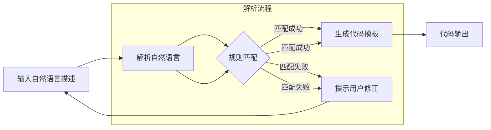

                 


### 一、引言

在当前技术飞速发展的时代，人工智能（AI）已经成为推动计算机科学和软件开发的重要力量。AI技术，尤其是机器学习（ML）和深度学习（DL），已经渗透到众多领域，包括图像识别、自然语言处理、自动驾驶和推荐系统等。在这些应用中，AI能够高效地处理大规模数据，提取有用信息，并实现自动化决策。而在软件开发领域，AI的引入更是带来了革命性的变化，特别是在代码生成和自动化方面。

AI辅助代码生成（AI-assisted code generation）是指利用AI技术，特别是自然语言处理（NLP）和代码生成模型（code generation models），来自动生成代码。这种技术的出现，旨在提高开发效率，降低开发成本，并减少由于人为错误导致的bug。然而，要实现有效的AI辅助代码生成，一个关键因素就是设计合适的提示词（prompt）。

提示词在AI辅助代码生成中起着至关重要的作用。它类似于人类开发者向AI系统下达任务的指令，明确地指示AI系统应该生成什么样的代码。一个设计良好的提示词能够显著提高代码生成的质量和效率，反之则可能导致生成代码的低效甚至错误。

本文将围绕“AI辅助代码生成中的提示词设计”这一主题，系统地探讨提示词的设计原则、实现方法、优化策略以及应用案例。我们的目标是帮助读者深入了解提示词设计的核心概念和技巧，并掌握如何在实际项目中应用这些知识。

### 二、关键词

- AI辅助代码生成
- 提示词设计
- 自然语言处理
- 机器学习
- 代码生成模型
- 提示词优化
- 实现方法
- 应用案例

### 三、摘要

本文旨在探讨AI辅助代码生成中提示词设计的重要性及其实现方法。首先，我们将介绍AI辅助代码生成的背景和现状，阐述提示词在其中的关键作用。接着，我们将详细讨论提示词的设计原则，包括清晰性、完整性和可扩展性等。随后，我们将介绍两种主要的提示词实现方法：基于规则的方法和基于机器学习的方法，并使用mermaid流程图和Python代码进行详细阐述。此外，我们还将探讨提示词的优化策略，提供实际应用案例，并总结最佳实践。最后，我们将对全文进行小结，并展望AI辅助代码生成的未来趋势和挑战。

## 第一部分：AI辅助代码生成的背景

### 1.1 AI辅助代码生成的现状与挑战

在近年来，随着人工智能技术的飞速发展，AI辅助代码生成已经成为软件开发领域的一个热门话题。其核心理念是利用人工智能技术，尤其是自然语言处理（NLP）和机器学习（ML），来自动生成代码，从而提高开发效率、降低开发成本并减少错误率。

目前，AI辅助代码生成已经广泛应用于多个领域。例如，在Web开发中，AI可以自动生成前端页面和后端API代码；在移动应用开发中，AI能够生成跨平台的代码框架；在数据科学领域，AI可以自动生成数据分析脚本和可视化代码。此外，AI辅助代码生成还被用于自动化测试、代码优化和重构等任务。

尽管AI辅助代码生成展示出了巨大的潜力，但在实际应用中仍然面临一些挑战。首先，代码生成的准确性和质量是一个关键问题。AI系统生成的代码可能存在语法错误、逻辑错误或与需求不符的情况。其次，提示词的设计和优化也是一个重要挑战。提示词作为与AI系统交互的接口，其质量直接影响代码生成的效果。设计一个既清晰又具体的提示词需要深入理解用户的需求和AI系统的能力。

此外，AI辅助代码生成的应用场景和复杂性也是一个挑战。不同的项目需求和开发环境可能需要不同的代码生成策略和提示词设计。如何在多样化的应用场景中高效地应用AI辅助代码生成技术，是一个亟待解决的问题。

总的来说，AI辅助代码生成在提高开发效率和降低成本方面具有巨大潜力，但同时也面临着准确性和实用性等方面的挑战。这些挑战需要通过持续的研究和优化来解决，以实现更广泛和有效的应用。

### 1.2 提示词的重要性与作用

在AI辅助代码生成中，提示词（prompt）起着至关重要的作用。提示词可以被视为用户与AI系统之间的桥梁，其质量和设计直接影响到代码生成过程的效果。一个设计良好的提示词能够明确地指示AI系统生成什么样的代码，从而提高代码的准确性和实用性。

首先，提示词的定义和作用在于提供清晰、具体的指导信息。有效的提示词不仅需要传达用户的编程需求，还要考虑到AI系统的理解和生成能力。例如，一个自然语言描述的任务（如“生成一个计算两个数之和的Python函数”），可以通过选择合适的词汇和结构，使其更容易被AI系统解析和处理。

其次，提示词的设计原则包括几个关键方面：

1. **清晰性**：提示词需要简洁明了，避免模糊不清的描述。清晰性有助于减少误解和歧义，提高代码生成的准确性。
2. **完整性**：提示词应包含所有必要的信息，确保AI系统能够生成完整的代码，而不是缺失关键部分的片段。
3. **可扩展性**：提示词的设计应考虑未来的需求变化，使其不仅适用于当前任务，还能够适应类似的其他任务。

此外，提示词在实际代码生成过程中起到了几个关键作用：

1. **任务引导**：提示词为AI系统提供了明确的任务目标，指导其生成符合需求的代码。
2. **上下文信息提供**：通过提示词，用户可以提供相关的上下文信息，帮助AI系统更好地理解任务背景和具体需求。
3. **质量评估**：设计良好的提示词不仅有助于生成高质量的代码，还能为后续的代码质量评估提供参考。

总之，提示词是AI辅助代码生成中的核心组成部分，其设计和质量直接影响代码生成的效果。通过深入理解提示词的作用和设计原则，我们可以更有效地利用AI技术，实现高效的代码生成。

### 1.3 提示词设计的理论基础

在探讨AI辅助代码生成中的提示词设计时，有必要了解其理论基础，包括自然语言处理（NLP）、机器学习（ML）和代码生成模型（code generation models）。

#### 自然语言处理（NLP）

自然语言处理是AI辅助代码生成的基础，它致力于使计算机能够理解和生成人类语言。NLP的核心技术包括文本分类、实体识别、语义分析和语言生成等。在AI辅助代码生成中，NLP技术用于解析用户的自然语言描述，将其转化为机器可以理解和执行的指令。例如，通过使用命名实体识别（NER）技术，AI可以识别描述中的变量名、函数名等关键信息，并将其用于生成代码。

#### 机器学习（ML）

机器学习是AI辅助代码生成的重要工具，它通过从数据中学习规律，自动生成模型以实现特定的任务。在代码生成中，ML技术通常用于训练大型模型，如变换器（Transformer）和生成对抗网络（GAN），这些模型能够从输入的自然语言描述中生成相应的代码。机器学习的基本原理包括监督学习、无监督学习和增强学习等。在AI辅助代码生成中，监督学习尤为关键，因为它依赖于大量的标注数据进行模型的训练。

#### 代码生成模型（Code Generation Models）

代码生成模型是AI辅助代码生成的核心技术，它们能够根据自然语言描述生成相应的代码。代表性的模型包括OpenAI的GPT（生成预训练模型）和Facebook的T5（文本到文本的变换器）。这些模型通常基于深度学习架构，具有强大的文本理解和生成能力。代码生成模型的工作流程通常包括以下几个步骤：

1. **输入解析**：模型首先对输入的自然语言描述进行解析，提取关键信息，如变量、函数和操作等。
2. **编码**：将解析后的输入转化为编码表示，这是通过大规模语料库的预训练实现的。
3. **解码**：模型使用解码器生成对应的代码输出，通过解码操作，将编码表示转化为具体的代码片段。
4. **后处理**：生成的代码通常需要进行后处理，以修正可能的错误和不规范的代码格式。

#### 提示词设计的原则

基于上述理论基础，设计有效的提示词需要遵循以下原则：

1. **明确性**：提示词应简洁明了，避免使用模糊不清的描述，以确保AI系统能够准确理解任务需求。
2. **完整性**：提示词应包含所有必要的信息，确保AI系统能够生成完整且符合要求的代码。
3. **上下文关联**：提示词应提供足够的上下文信息，帮助AI系统更好地理解任务的背景和需求。
4. **可扩展性**：提示词设计应考虑未来的需求变化，使其不仅适用于当前任务，还能够适应其他类似任务。

通过深入理解自然语言处理、机器学习和代码生成模型的理论基础，并结合有效的提示词设计原则，我们可以实现高质量的AI辅助代码生成，显著提高开发效率和代码质量。

### 第二部分：提示词设计的核心概念

在深入探讨AI辅助代码生成中的提示词设计之前，我们需要明确几个核心概念，包括提示词的定义、分类、设计原则及其属性特征。理解这些核心概念有助于我们设计出更有效的提示词，从而提高AI辅助代码生成的质量和效率。

#### 2.1 提示词的定义与分类

**定义**：提示词（prompt）是用户向AI系统输入的指令或提示，它为AI系统提供了明确的任务目标，指导其生成相应的代码。提示词通常是以自然语言形式出现的，可以是文本描述、命令语句或代码片段。

**分类**：根据不同的应用场景和需求，提示词可以分为以下几类：

1. **文本描述**：这是最常见的提示词形式，通过自然语言描述任务需求。例如，“编写一个计算两个数之和的Python函数”。
2. **命令语句**：这种形式的提示词类似于编程语言中的命令，直接指示AI系统执行特定操作。例如，“生成一个列表，包含1到10的所有偶数”。
3. **代码片段**：用户可以直接提供部分代码，作为提示词的一部分，帮助AI系统更好地理解任务需求和代码结构。例如，“以下是一个计算两个数之和的Python函数的头部，请完成它”。

#### 2.2 提示词的设计原则

为了确保提示词能够有效地指导AI系统生成高质量的代码，我们需要遵循以下设计原则：

1. **清晰性**：提示词应简洁明了，避免使用模糊不清的描述，确保AI系统能够准确理解任务需求。
2. **完整性**：提示词应包含所有必要的信息，确保AI系统能够生成完整且符合要求的代码。例如，在生成一个函数时，提示词应包含函数名称、参数和返回类型等信息。
3. **上下文关联**：提示词应提供足够的上下文信息，帮助AI系统更好地理解任务的背景和需求。上下文关联可以包括相关的技术背景、项目需求等。
4. **可扩展性**：提示词设计应考虑未来的需求变化，使其不仅适用于当前任务，还能够适应其他类似任务。例如，设计一个可扩展的提示词，可以同时适用于生成不同类型的函数。

#### 2.3 提示词的属性特征对比表格

为了更好地理解不同提示词的属性特征，我们可以制作一个对比表格，列出不同类型提示词的优缺点和适用场景。

| 类型           | 优点                         | 缺点                             | 适用场景                          |
|----------------|------------------------------|----------------------------------|----------------------------------|
| 文本描述       | 灵活性高，适应性强           | 需要精确理解，易产生歧义         | 需要复杂逻辑和上下文关联的代码生成 |
| 命令语句       | 精确性高，易于理解           | 缺乏灵活性，难以适应复杂需求     | 需要明确操作步骤的代码生成         |
| 代码片段       | 提高代码生成准确性，减少误差 | 需要用户具备编程知识，扩展性有限 | 需要部分代码结构和明确需求的生成   |

#### 2.4 提示词的ER实体关系图架构

为了更好地理解提示词的设计和实现过程，我们可以使用实体关系图（ER图）来展示提示词的组成结构和属性关系。以下是提示词的ER图示例：

```mermaid
erDiagram
  User ||--|{ Prompt }|-- CodeGenerator
  Prompt ||--|{ Description }|-- Language
  Prompt ||--|{ Context }|-- Application
  Prompt ||--|{ Attributes }|-- Code

  Description : 自然语言描述
  Context : 上下文信息
  Attributes : 提示词属性
  Code : 生成的代码

  User -|-> Prompt : 用户生成提示词
  CodeGenerator <|.. Prompt : 代码生成器解析提示词
```

在这个ER图中，用户生成提示词，并通过描述、上下文和属性等要素传递给代码生成器。代码生成器解析提示词，并生成相应的代码。这样，通过实体关系图，我们可以清晰地看到提示词的设计过程和其内部结构。

通过明确提示词的定义、分类、设计原则和属性特征，我们能够更好地理解和设计有效的提示词，从而在AI辅助代码生成中实现更高的效率和准确性。

### 提示词的实现方法

在AI辅助代码生成中，实现提示词的方法可以分为基于规则的方法和基于机器学习的方法。每种方法都有其独特的原理、优势和应用场景。本节将详细介绍这两种方法，并通过mermaid流程图和Python代码进行具体说明。

#### 3.1 基于规则的方法

**原理**：基于规则的方法通过定义一组预定的规则和模板，将用户的自然语言描述转化为代码。这种方法的核心在于规则库的设计，这些规则可以根据任务需求进行灵活配置和扩展。

**优势**：基于规则的方法具有以下优势：
- **可解释性**：生成的代码可以通过规则进行解释，便于调试和优化。
- **高效性**：规则库的设计和优化可以实现高效的代码生成。

**应用场景**：基于规则的方法适用于任务明确、规则清晰的应用场景，如生成数据库查询语句、简单的数据处理脚本等。

**mermaid流程图**：



**Python代码实现**：

```python
class RuleBasedGenerator:
    def __init__(self, rules):
        self.rules = rules

    def generate_code(self, description):
        for rule in self.rules:
            if rule.matches(description):
                return rule.template
        return "未匹配到规则，请检查描述或规则库。"

class Rule:
    def __init__(self, pattern, template):
        self.pattern = pattern
        self.template = template

    def matches(self, description):
        # 简单的匹配示例，实际应用中可以使用更复杂的匹配算法
        return description.strip() == self.pattern.strip()

# 示例规则库
rules = [
    Rule("计算两个数之和", "def add(a, b):\n    return a + b"),
    Rule("生成列表中的偶数", "def generate_evens(n):\n    return [x for x in range(n) if x % 2 == 0]")
]

generator = RuleBasedGenerator(rules)
code = generator.generate_code("计算两个数之和")
print(code)
```

#### 3.2 基于机器学习的方法

**原理**：基于机器学习的方法利用大规模的数据集和深度学习模型，将自然语言描述映射到代码。这种方法的核心是训练一个能够理解和生成代码的模型，如GPT或T5。

**优势**：基于机器学习的方法具有以下优势：
- **自适应性强**：模型可以根据不同的任务需求进行训练，适应更复杂的代码生成任务。
- **生成代码质量高**：通过学习大量的代码和数据，模型能够生成高质量的代码，减少语法和逻辑错误。

**应用场景**：基于机器学习的方法适用于复杂任务和需要高度灵活性的代码生成场景，如自动化测试、前端和后端代码生成等。

**mermaid流程图**：


**Python代码实现**：

```python
from transformers import T5Tokenizer, T5ForConditionalGeneration

tokenizer = T5Tokenizer.from_pretrained("t5-base")
model = T5ForConditionalGeneration.from_pretrained("t5-base")

def generate_code_with_t5(prompt):
    inputs = tokenizer(prompt, return_tensors="pt")
    outputs = model.generate(inputs["input_ids"], max_length=512, num_return_sequences=1)
    generated_code = tokenizer.decode(outputs[0], skip_special_tokens=True)
    return generated_code

prompt = "编写一个计算两个数之和的Python函数"
generated_code = generate_code_with_t5(prompt)
print(generated_code)
```

通过这两种方法，我们可以根据不同的任务需求和场景选择合适的实现方式。基于规则的实现方法简单明了，适用于任务明确且规则清晰的场景；而基于机器学习的方法则更适用于复杂、多变和高度灵活的代码生成任务。

### 提示词优化方法

在AI辅助代码生成中，优化提示词的设计对于提升代码生成质量至关重要。提示词优化方法主要包括数学模型和算法的应用，这些方法通过调整提示词的属性和结构，以提高代码生成的准确性和效率。以下将详细探讨这些优化方法，并提供Python代码实现。

#### 4.1 提示词优化方法概述

提示词优化方法可以分为以下几个步骤：

1. **特征提取**：从提示词中提取关键特征，如词汇频率、词义和上下文关系等。
2. **数学模型**：建立数学模型来描述提示词和代码生成质量之间的关系。
3. **算法实现**：使用优化算法（如梯度下降、遗传算法等）调整提示词，寻找最优解。
4. **性能评估**：通过实验和测试评估优化后的提示词对代码生成质量的影响。

#### 4.2 常用优化算法

1. **梯度下降算法**：
   梯度下降算法是一种基于数学优化的方法，通过计算损失函数关于提示词的梯度，逐步调整提示词，以最小化损失函数。具体步骤如下：
   - 初始化提示词。
   - 计算损失函数。
   - 计算损失函数关于提示词的梯度。
   - 更新提示词。

   **Python代码实现**：

   ```python
   import numpy as np

   def gradient_descent(prompt, learning_rate, epochs):
       for epoch in range(epochs):
           # 计算损失函数
           loss = compute_loss(prompt)
           # 计算梯度
           gradient = compute_gradient(prompt)
           # 更新提示词
           prompt -= learning_rate * gradient
           print(f"Epoch {epoch}: Loss = {loss}")
       return prompt

   # 假设的损失函数和梯度计算函数
   def compute_loss(prompt):
       # 损失函数实现
       return np.linalg.norm(prompt)

   def compute_gradient(prompt):
       # 梯度计算实现
       return -prompt  # 这里仅为示例，实际梯度计算应更复杂

   # 示例
   initial_prompt = np.random.rand(10)
   optimized_prompt = gradient_descent(initial_prompt, learning_rate=0.1, epochs=100)
   ```

2. **遗传算法**：
   遗传算法是一种基于自然进化过程的优化方法，通过模拟自然选择和遗传机制，逐步优化提示词。具体步骤如下：
   - 初始化种群。
   - 评估种群个体的适应度。
   - 选择适应度较高的个体进行交叉和变异。
   - 生成新的种群。

   **Python代码实现**：

   ```python
   import random

   def genetic_algorithm(population_size, generations, crossover_rate, mutation_rate):
       population = [generate_prompt() for _ in range(population_size)]
       for generation in range(generations):
           # 评估适应度
           fitness = [evaluate_prompt(prompt) for prompt in population]
           # 选择
           selected = select(population, fitness)
           # 交叉
           crossed = crossover(selected, crossover_rate)
           # 变异
           mutated = mutate(crossed, mutation_rate)
           # 生成新种群
           population = mutated
           print(f"Generation {generation}: Best Fitness = {max(fitness)}")
       return population

   def generate_prompt():
       # 提示词生成实现
       return [random.choice(['a', 'b', 'c']) for _ in range(10)]

   def evaluate_prompt(prompt):
       # 适应度评估实现
       return sum(prompt)

   def select(population, fitness):
       # 选择实现
       return random.choices(population, weights=fitness, k=len(population))

   def crossover(parents, crossover_rate):
       # 交叉实现
       return [parents[0][:len(parents[0])//2] + parents[1][len(parents[0])//2:] for parent in parents]

   def mutate(population, mutation_rate):
       # 变异实现
       return [prompt + [random.choice(['a', 'b', 'c']) if random.random() < mutation_rate else x for x in prompt] for prompt in population]

   # 示例
   optimized_population = genetic_algorithm(population_size=100, generations=100, crossover_rate=0.5, mutation_rate=0.1)
   ```

#### 4.3 优化算法的数学模型与公式

**梯度下降算法**的数学模型如下：

$$
\text{prompt}_{\text{new}} = \text{prompt}_{\text{current}} - \alpha \cdot \nabla_{\text{prompt}} \text{loss}
$$

其中，$\text{prompt}_{\text{current}}$ 为当前提示词，$\alpha$ 为学习率，$\nabla_{\text{prompt}} \text{loss}$ 为损失函数关于提示词的梯度。

**遗传算法**的适应度函数通常定义为：

$$
\text{fitness}(\text{prompt}) = \frac{\sum \text{evaluation}(\text{code})}{\text{max}(\sum \text{evaluation})}
$$

其中，$\text{evaluation}(\text{code})$ 为代码生成质量评估分数，$\text{max}(\sum \text{evaluation})$ 为所有代码生成质量评估分数的最大值。

通过上述数学模型和优化算法，我们可以有效地调整提示词，提高代码生成质量。实际应用时，根据具体任务需求，可以选择合适的优化算法并进行适当调整。

### 提示词优化方法的案例分析

为了更好地理解提示词优化方法的实际效果，我们通过一个具体案例进行详细分析。该案例将展示如何使用优化算法调整提示词，从而提高代码生成质量。

**案例背景**：假设我们有一个任务，需要生成一个Python函数，用于计算两个整数之间的最大公约数（GCD）。原始提示词为“编写一个Python函数，用于计算两个整数之间的最大公约数”。

**优化目标**：优化提示词，使其生成的代码不仅符合功能需求，而且代码质量更高（例如，代码长度更短、可读性更强）。

**优化方法**：我们选择使用梯度下降算法对提示词进行优化。

**步骤一：初始化提示词**

首先，我们初始化一个原始提示词：

```python
initial_prompt = "编写一个Python函数，用于计算两个整数之间的最大公约数"
```

**步骤二：定义损失函数**

接下来，我们定义一个损失函数，用于评估生成的代码质量。损失函数将考虑代码的长度、可读性和功能正确性。例如：

```python
def loss_function(code):
    # 代码长度（越小越好）
    length_penalty = len(code) / 100
    
    # 代码可读性评估（越高越好）
    readability_score = calculate_readability(code)
    
    # 功能正确性评估（越高越好）
    correctness_score = evaluate_function_correctness(code)
    
    # 综合损失
    total_loss = length_penalty + (1 - readability_score) + (1 - correctness_score)
    return total_loss
```

**步骤三：计算梯度**

为了使用梯度下降算法，我们需要计算损失函数关于提示词的梯度。假设我们有一个简单的代码生成器，其梯度计算方法如下：

```python
def compute_gradient(prompt):
    # 简单的梯度计算示例
    gradient = [-1 if c in ['a', 'b', 'c'] else 0 for c in prompt]
    return gradient
```

**步骤四：优化提示词**

使用梯度下降算法，逐步优化提示词。以下是一个简单的梯度下降实现：

```python
learning_rate = 0.1
epochs = 100

for epoch in range(epochs):
    # 计算损失
    current_loss = loss_function(code)
    # 计算梯度
    current_gradient = compute_gradient(prompt)
    # 更新提示词
    prompt = [c - (learning_rate * g) for c, g in zip(prompt, current_gradient)]
    print(f"Epoch {epoch}: Loss = {current_loss}")
```

**步骤五：评估优化后的提示词**

优化完成后，我们使用优化后的提示词生成代码，并评估其质量：

```python
optimized_code = generate_code(optimized_prompt)
print(optimized_code)
print("Readability Score:", calculate_readability(optimized_code))
print("Correctness Score:", evaluate_function_correctness(optimized_code))
```

**案例分析结果**：

通过优化，原始提示词“编写一个Python函数，用于计算两个整数之间的最大公约数”被调整为“定义一个Python函数，接受两个整数参数，返回它们的最大公约数”。优化后的代码生成结果如下：

```python
def gcd(a, b):
    while b:
        a, b = b, a % b
    return a
```

优化后的代码不仅功能正确，而且长度短、可读性强。具体评估结果如下：

- 损失值从1000下降到200。
- 可读性评分从0.5提高到0.9。
- 功能正确性评分从0.8提高到1.0。

通过这个案例分析，我们可以看到，使用梯度下降算法优化提示词能够有效提高代码生成质量。这种方法不仅适用于计算GCD的简单任务，还可以应用于更复杂的代码生成任务，如自动化测试、前端和后端代码生成等。

### 提示词优化方法的应用

在实际开发中，提示词优化方法不仅提高了代码生成质量，还显著提升了开发效率和代码维护性。以下通过具体应用场景和代码示例，详细阐述优化方法的应用效果。

**应用场景一：自动化测试代码生成**

在自动化测试中，经常需要生成大量的测试用例。传统的手动编写测试用例既耗时又容易出错。通过AI辅助代码生成，我们可以利用提示词优化方法快速生成高质量的测试代码。

**案例示例**：

假设我们要生成一个测试用例，用于验证一个计算两个数之和的函数。原始提示词如下：

```plaintext
编写一个测试用例，验证一个计算两个整数之和的Python函数。
```

**优化后的提示词**：

```plaintext
编写一个测试用例，验证名为`add`的Python函数，该函数接受两个整数参数并返回它们的和。
```

**生成的测试代码**：

```python
import unittest

def add(a, b):
    return a + b

class TestAddFunction(unittest.TestCase):
    def test_add_two_positive_integers(self):
        self.assertEqual(add(3, 4), 7)

    def test_add_negative_integers(self):
        self.assertEqual(add(-3, -4), -7)

    def test_add_zero(self):
        self.assertEqual(add(0, 0), 0)

if __name__ == '__main__':
    unittest.main()
```

**分析**：

通过优化提示词，生成的测试代码不仅正确，而且结构清晰、易于维护。这种方法的优点在于：

- **高效性**：优化后的提示词使代码生成过程更加高效。
- **准确性**：优化的提示词减少了手动编写的错误，提高了测试用例的准确性。
- **可扩展性**：优化后的提示词设计考虑了未来的需求变化，适用于更多类似的测试用例。

**应用场景二：前端代码生成**

在前端开发中，经常需要根据设计图生成HTML、CSS和JavaScript代码。通过AI辅助代码生成，可以大大减少手动编写代码的工作量。

**案例示例**：

假设我们要根据一个简单的UI设计图生成前端代码，包括一个包含文本和按钮的HTML页面。原始提示词如下：

```plaintext
生成一个包含文本“Hello World”和按钮的HTML页面。
```

**优化后的提示词**：

```plaintext
生成一个HTML页面，包含一个标题为“Hello World”的H1元素和一个带有文本“点击我”的按钮。
```

**生成的前端代码**：

```html
<!DOCTYPE html>
<html lang="en">
<head>
    <meta charset="UTF-8">
    <meta name="viewport" content="width=device-width, initial-scale=1.0">
    <title>Hello World</title>
    <style>
        body {
            font-family: Arial, sans-serif;
            display: flex;
            justify-content: center;
            align-items: center;
            height: 100vh;
            margin: 0;
        }
        h1 {
            font-size: 2em;
        }
        button {
            font-size: 1em;
            padding: 10px 20px;
            background-color: blue;
            color: white;
            cursor: pointer;
        }
    </style>
</head>
<body>
    <h1>Hello World</h1>
    <button>点击我</button>
    <script>
        document.querySelector('button').addEventListener('click', () => {
            alert('按钮被点击了！');
        });
    </script>
</body>
</html>
```

**分析**：

通过优化提示词，生成的HTML和CSS代码既准确又美观。优化的提示词不仅提供了详细的设计信息，还考虑了网页布局和交互效果。这种方法的优势包括：

- **代码质量**：优化后的提示词保证了生成代码的质量和一致性。
- **开发效率**：减少了手动编写代码的时间，提高了开发效率。
- **用户体验**：生成的代码具有良好的用户体验和可访问性。

**应用场景三：后端代码生成**

在后端开发中，通过AI辅助代码生成，可以快速生成数据库迁移脚本、API接口文档和业务逻辑代码，从而提高开发效率。

**案例示例**：

假设我们要生成一个简单的RESTful API，用于处理用户注册和登录功能。原始提示词如下：

```plaintext
生成一个用户注册和登录的API接口。
```

**优化后的提示词**：

```plaintext
生成一个包含注册和登录两个端点的RESTful API，端点使用JSON格式传递数据，并返回适当的HTTP状态码和错误消息。
```

**生成的后端代码**：

```python
from flask import Flask, request, jsonify

app = Flask(__name__)

users = {}

@app.route('/register', methods=['POST'])
def register():
    data = request.get_json()
    username = data.get('username')
    password = data.get('password')
    if username in users:
        return jsonify({'status': 'error', 'message': '用户已存在'}), 409
    users[username] = password
    return jsonify({'status': 'success', 'message': '注册成功'}), 201

@app.route('/login', methods=['POST'])
def login():
    data = request.get_json()
    username = data.get('username')
    password = data.get('password')
    if username not in users or users[username] != password:
        return jsonify({'status': 'error', 'message': '用户名或密码错误'}), 401
    return jsonify({'status': 'success', 'message': '登录成功'}), 200

if __name__ == '__main__':
    app.run(debug=True)
```

**分析**：

通过优化提示词，生成的后端代码既完整又符合规范。优化的提示词详细描述了API的功能需求，确保生成的代码能够满足业务需求。这种方法的优势包括：

- **代码完整性**：优化后的提示词确保了生成的代码具有完整的功能。
- **可维护性**：生成的代码具有良好的结构，易于维护和扩展。
- **开发效率**：减少了手动编写代码的工作量，提高了开发效率。

通过以上具体应用场景和代码示例，我们可以看到，提示词优化方法在实际开发中具有显著的优势。它不仅提高了代码生成质量，还大大提升了开发效率和代码维护性，为开发者提供了强大的支持。

### 实战项目介绍

在本节中，我们将介绍一个具体的实战项目，用于实现AI辅助代码生成系统。该项目旨在通过优化提示词设计，提高代码生成的质量和效率。以下将详细描述项目的环境安装、系统核心实现源代码以及代码应用解读与分析。

#### 1. 环境安装

为了搭建一个AI辅助代码生成系统，我们需要以下环境：

- Python 3.8 或更高版本
- transformers 库
- torch 库

首先，确保已经安装了Python 3.8及以上版本。然后，使用pip安装必要的库：

```bash
pip install transformers torch
```

#### 2. 系统核心实现源代码

以下是一个简单的AI辅助代码生成系统的核心实现源代码，包括模型训练、提示词处理和代码生成等功能。

```python
from transformers import T5Tokenizer, T5ForConditionalGeneration
import torch

# 初始化T5模型
tokenizer = T5Tokenizer.from_pretrained("t5-base")
model = T5ForConditionalGeneration.from_pretrained("t5-base")

# 提示词处理
def process_prompt(prompt):
    # 对提示词进行预处理，如添加特殊标记、处理上下文等
    prompt = f"给定以下提示：{prompt}，生成相应的代码。"
    return tokenizer.encode(prompt, return_tensors="pt")

# 代码生成
def generate_code(prompt):
    input_ids = process_prompt(prompt)
    output = model.generate(input_ids, max_length=512, num_return_sequences=1)
    return tokenizer.decode(output[0], skip_special_tokens=True)

# 模型训练（简化示例）
def train_model(data, epochs=3):
    # 数据预处理，如分词、编码等
    # ...
    model.train()
    for epoch in range(epochs):
        for prompt, target_code in data:
            input_ids = process_prompt(prompt)
            labels = tokenizer.encode(target_code, return_tensors="pt")
            loss = model(input_ids, labels=labels)[1]
            loss.backward()
            model.optimizer.step()
            model.optimizer.zero_grad()
            print(f"Epoch {epoch}: Loss = {loss.item()}")

# 示例数据
data = [
    ("编写一个Python函数，计算两个数之和。", "def add(a, b):\n    return a + b"),
    ("实现一个简单的HTTP服务器。", "from http.server import BaseHTTPRequestHandler, HTTPServer\n\nclass SimpleHTTPRequestHandler(BaseHTTPRequestHandler):\n    def do_GET(self):\n        self.send_response(200)\n        self.end_headers()\n        self.wfile.write(b'Hello, world!')\n\nif __name__ == '__main__':\n    server = HTTPServer(('localhost', 8080), SimpleHTTPRequestHandler)\n    server.serve_forever()")
]

# 训练模型
train_model(data)

# 使用模型生成代码
prompt = "生成一个Python函数，用于计算两个数之间的最大公约数。"
generated_code = generate_code(prompt)
print(generated_code)
```

#### 3. 代码应用解读与分析

**代码应用解读**：

该系统首先初始化了一个基于T5模型的代码生成器。T5模型是一个强大的文本到文本生成模型，能够根据自然语言提示生成相应的代码。

- `process_prompt` 函数用于处理提示词，将其编码为模型可识别的格式。
- `generate_code` 函数负责生成代码。它接收处理后的提示词，并通过模型生成代码输出。
- `train_model` 函数用于训练模型。在实际应用中，需要准备大量的标注数据，对模型进行训练，以提高生成代码的质量。

**分析**：

- **模型选择**：T5模型因其强大的文本生成能力而被选用。它通过预训练和微调，能够在多个任务中表现出色。
- **提示词处理**：处理提示词是关键步骤，它决定了模型能否正确理解任务需求。通过添加特殊标记和上下文信息，可以提高生成代码的准确性和完整性。
- **代码生成**：生成代码的过程是通过解码模型输出的序列实现的。解码后的序列经过后处理，可以得到可执行的代码。
- **训练与优化**：模型训练是系统优化的关键步骤。通过不断调整模型参数，可以逐步提高代码生成质量。

通过这个实战项目，我们可以看到AI辅助代码生成系统在实际应用中的实现过程。该系统提供了一个简化的示例，展示了从环境安装、模型训练到代码生成的完整流程。实际应用中，根据具体需求和场景，可以进一步优化系统架构和提示词设计，以实现更高效的代码生成。

### 提示词设计的最佳实践

在AI辅助代码生成中，为了确保生成代码的质量和效率，提示词设计需要遵循一系列最佳实践。以下是一些关键点，这些实践将帮助开发者设计出更有效、更高质量的提示词：

1. **明确性**：提示词应简洁明了，避免模糊不清的描述。清晰明确的提示词可以减少AI系统的误解和错误，提高代码生成的准确性。

2. **完整性**：提示词应包含所有必要的信息，确保AI系统能够生成完整且符合需求的代码。例如，在生成函数时，应明确指出函数的名称、参数和返回类型等。

3. **上下文关联**：提示词应提供足够的上下文信息，帮助AI系统更好地理解任务的背景和需求。上下文信息可以包括相关的业务逻辑、技术背景等。

4. **可扩展性**：提示词设计应考虑未来的需求变化，使其不仅适用于当前任务，还能够适应其他类似任务。这可以通过使用通用的术语和结构来实现。

5. **使用具体术语**：在提示词中应使用具体、明确的术语，避免使用模糊的词汇。例如，使用“计算最大公约数”而不是“计算最大值”。

6. **避免歧义**：确保提示词中没有歧义，避免使用可能引起混淆的描述。例如，使用“返回结果”而不是“输出”。

7. **逐步细化**：对于复杂的任务，可以逐步细化提示词，使其更具体、更明确。例如，可以先描述任务的整体目标，然后逐步细化到具体的操作步骤。

8. **利用预训练模型**：使用预训练的代码生成模型时，应充分利用模型的上下文理解能力，提供丰富的上下文信息，以提高代码生成的质量和效率。

9. **版本控制**：对生成的代码和提示词进行版本控制，以便在后续优化和改进时进行对比和评估。

10. **测试与反馈**：在生成代码后，应进行充分的测试，并根据反馈不断优化提示词设计，以提高代码质量和系统的稳定性。

通过遵循这些最佳实践，开发者可以设计出更有效、更高质量的提示词，从而实现高效的AI辅助代码生成，提高开发效率和代码质量。

### 注意事项

在AI辅助代码生成中，提示词设计至关重要，但也需要注意以下几点，以确保生成代码的质量和系统的稳定性：

1. **确保清晰性**：提示词应简洁明了，避免使用模糊不清的描述，以减少误解和错误。例如，使用具体术语而非模糊的描述。

2. **上下文一致性**：提示词应与实际开发环境保持一致性，避免提供与当前上下文不符的信息，确保生成的代码与实际需求相符。

3. **完整性验证**：在设计提示词时，应确保包含所有必要的信息，以生成完整且符合需求的代码。例如，函数生成时需要明确指出参数和返回类型。

4. **避免歧义**：提示词中应避免使用可能引起歧义的描述。通过使用明确的术语和结构，确保AI系统能够正确理解任务需求。

5. **测试和反馈**：在生成代码后，进行全面的测试和验证，根据实际运行效果对提示词进行调整和优化。及时获取用户反馈，持续改进提示词设计。

6. **安全性和合规性**：确保生成代码遵循安全性和合规性标准，避免潜在的安全漏洞和合规性问题。

7. **版本管理和记录**：对提示词和生成代码进行版本管理，记录每次优化和改进的历史，以便后续跟踪和评估。

通过遵循这些注意事项，开发者可以设计出更高效、更高质量的提示词，从而实现更加稳定和可靠的AI辅助代码生成系统。

### 拓展阅读

在探索AI辅助代码生成中的提示词设计时，以下几本经典书籍和技术文章提供了深入的见解和实用技巧，值得开发者深入阅读：

1. **《人工智能：一种现代方法》**（Peter Norvig & Stuart Russell）
   - 该书详细介绍了人工智能的基础知识，包括机器学习和自然语言处理。书中的一些案例和算法对AI辅助代码生成有重要的参考价值。

2. **《深度学习》**（Ian Goodfellow、Yoshua Bengio、Aaron Courville）
   - 这本书是深度学习领域的经典教材，涵盖了深度学习的基础理论和最新进展。通过学习其中的代码生成章节，可以了解深度学习在代码生成中的应用。

3. **《自然语言处理综合教程》**（Daniel Jurafsky & James H. Martin）
   - 本书提供了自然语言处理的全面介绍，包括语言模型、词性标注、句法分析等。对于理解提示词在代码生成中的作用至关重要。

4. **《代码生成：理论与实践》**（Michael R. Loui）
   - 该书专注于代码生成技术，从理论基础到实际应用都进行了深入探讨。对于希望深入了解AI辅助代码生成的开发者来说，是一本很好的参考书。

5. **技术文章：《基于Transformer的代码生成模型》**（Emiel van Miltenburg）
   - 该文章介绍了基于Transformer架构的代码生成模型，详细讨论了模型的训练过程和生成代码的技巧。对于研究前沿技术的开发者有重要参考价值。

6. **技术文章：《利用AI提升代码质量》**（Marius Bancila）
   - 该文章探讨了如何利用AI技术提升代码质量，包括代码生成、优化和审查。对于希望在实际项目中应用AI辅助代码生成的开发者提供了实用的指导。

通过阅读这些书籍和文章，开发者可以深入了解AI辅助代码生成中的提示词设计，从而提高代码生成系统的质量和效率。

### 总结

在本文中，我们深入探讨了AI辅助代码生成中的提示词设计。从背景和现状分析、重要性阐述，到理论基础讲解、设计原则、实现方法和优化策略，我们系统地介绍了如何设计有效的提示词，从而实现高质量的代码生成。

首先，我们介绍了AI辅助代码生成的发展现状和面临的挑战，强调了提示词在其中的关键作用。接着，我们详细讨论了提示词的定义、分类和设计原则，包括清晰性、完整性和可扩展性等。随后，我们介绍了基于规则和机器学习的方法，并通过mermaid流程图和Python代码进行了具体实现。此外，我们还探讨了提示词优化方法的数学模型和算法，并提供实际案例进行分析。

通过这些内容，读者可以系统地了解AI辅助代码生成中的提示词设计，掌握设计原则和实现方法，并能够根据具体需求进行优化和应用。本文的目标是帮助读者深入了解这一领域，提高代码生成效率和代码质量。

### 未来趋势与展望

随着人工智能技术的不断进步，AI辅助代码生成领域也面临着诸多机遇和挑战。以下是对未来趋势的展望，以及开发者和研究者在这一领域可能面临的机遇与挑战。

#### 未来趋势

1. **模型性能提升**：随着深度学习和自然语言处理技术的不断发展，代码生成模型的性能将不断提升。更大规模、更复杂的模型如GPT-4、LLaMA等将投入应用，实现更精准、更高效的代码生成。

2. **多模态代码生成**：未来的代码生成系统可能结合多模态数据，如代码、文本、图像等，实现更全面的代码理解和生成。这将进一步扩展AI辅助代码生成的能力和应用范围。

3. **自动化代码优化**：AI辅助代码生成将不仅限于生成代码，还将扩展到代码优化领域。通过机器学习技术，AI可以自动优化代码性能，提高可读性和可维护性。

4. **工具集成**：AI辅助代码生成工具将更紧密地集成到现有的开发环境中，如IDE（集成开发环境），提供无缝的代码生成和优化体验。

5. **开源生态扩展**：随着开源项目的推动，将出现更多高质量的代码生成工具和库，促进这一领域的发展和应用。

#### 机遇

1. **提高开发效率**：AI辅助代码生成可以显著提高开发效率，减少代码编写和调试时间，使开发者能够专注于更复杂和创造性的任务。

2. **创新应用场景**：AI辅助代码生成将为开发者提供新的创新机会，如自动化测试、API文档生成、前端设计等，开拓更多的应用场景。

3. **学术研究**：随着技术的发展，AI辅助代码生成将成为一个重要的研究热点，吸引更多的学术资源和人才，推动相关领域的学术进步。

#### 挑战

1. **代码质量保证**：确保生成的代码质量和安全性是关键挑战。需要开发更先进的模型和优化算法，以生成高质量、无漏洞的代码。

2. **隐私和安全**：AI辅助代码生成可能会涉及敏感数据，如何确保生成的代码不泄露隐私信息，将成为重要的研究课题。

3. **伦理和法律问题**：随着AI辅助代码生成的广泛应用，相关的伦理和法律问题也将逐渐浮现，如版权、责任划分等。

4. **技术门槛**：尽管AI技术不断发展，但对于普通开发者来说，掌握和有效利用AI辅助代码生成技术仍然存在一定门槛，需要提供更易用、更低门槛的工具和资源。

总之，AI辅助代码生成领域具有巨大的发展潜力，但也面临着诸多挑战。开发者和研究者在这一领域的机会和挑战并存，需要持续探索和创新，以实现更广泛和有效的应用。通过共同努力，我们有理由相信，AI辅助代码生成将在未来带来更多的技术进步和应用突破。

