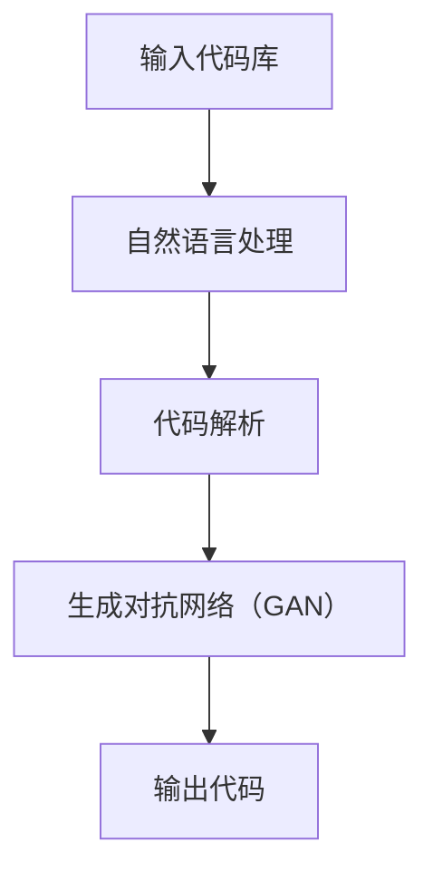
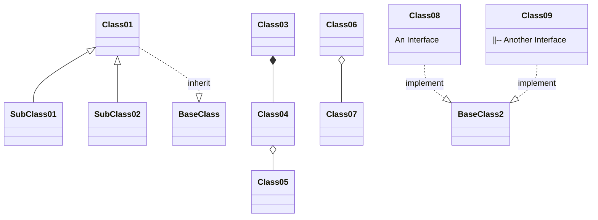
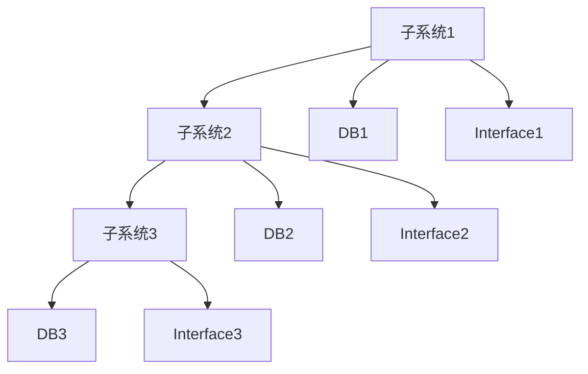
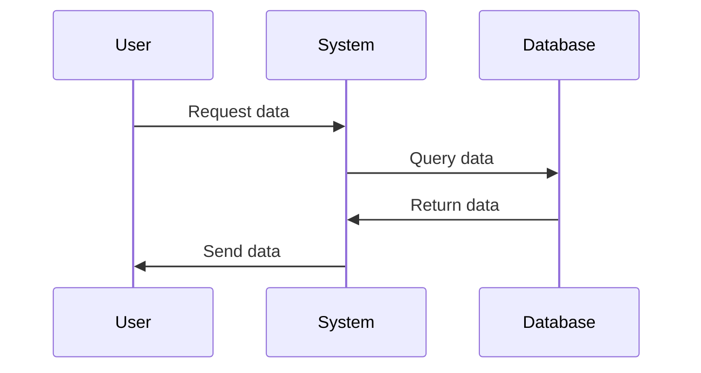

                 

# AI辅助代码生成：提高开发效率的新方法

## 关键词：人工智能、代码生成、开发效率、机器学习、自然语言处理、生成对抗网络

## 摘要：
随着人工智能（AI）技术的不断发展，AI辅助代码生成已成为提升软件开发效率的关键方法。本文将深入探讨AI辅助代码生成的背景、核心概念、算法原理及其应用，为开发者提供一条高效开发的新路径。通过逐步分析，我们将揭示这一技术的前景和潜力。

## 第一部分：背景介绍

### 第1章：问题背景

#### 1.1.1 问题背景
人工智能（AI）作为计算机科学的重要分支，近年来取得了飞速发展。随着深度学习技术的进步，AI在图像识别、自然语言处理、推荐系统等领域表现出色。然而，传统的编程方法在应对复杂、庞大的代码库时显得力不从心。这使得AI辅助代码生成成为了一个热门研究方向。

#### 1.1.2 问题解决
AI辅助代码生成旨在利用机器学习技术，分析已有的代码库，自动生成新的代码。这不仅可以显著提高开发效率，还可以减轻开发人员的工作负担，有助于解决代码复用、维护困难等问题。

#### 1.1.3 边界与外延
AI辅助代码生成的边界主要涉及机器学习、编程语言、代码库分析等方面。其外延包括应用场景的拓展，如自动化测试、代码修复、代码优化等。

### 第2章：核心概念与联系

#### 2.1.1 AI辅助代码生成的核心概念
AI辅助代码生成涉及多个核心概念，包括自然语言处理、代码解析、生成对抗网络（GAN）等。

#### 2.1.2 概念属性特征对比表格

| 概念                     | 特征                                                         |
|------------------------|------------------------------------------------------------|
| 自然语言处理              | 对人类语言进行理解和生成                                       |
| 代码解析                 | 将代码转换成抽象语法树（AST）                                   |
| 生成对抗网络（GAN）         | 通过对抗训练生成新的代码                                       |

#### 2.1.3 ER实体关系图架构

```mermaid
graph ER_entity_relation
    node[shape=rectangle, style=filled, fillcolor=lightblue]
    edge[arrowhead=open]

    a1[label="代码库"]
    a2[label="自然语言处理"]
    a3[label="代码解析"]
    a4[label="生成对抗网络（GAN）"]

    a1 -- a2
    a1 -- a3
    a2 -- a4
    a3 -- a4
```

### 第3章：算法原理讲解

#### 3.1.1 算法mermaid流程图



#### 3.1.2 Python源代码

```python
def generate_code(n):
    code = []
    for _ in range(n):
        code.append("print('Hello, World!')")
    return code

generated_code = generate_code(5)
print("\n".join(generated_code))
```

#### 3.1.3 算法原理的数学模型和公式

$$
P(code) = \sum_{s \in CodeSpace} P(s) \cdot P(code|s)
$$

其中，$P(code)$ 表示生成代码的概率，$P(s)$ 表示代码库中代码的概率分布，$P(code|s)$ 表示在给定代码库的情况下生成代码的条件概率。

## 第二部分：系统分析与架构设计

### 第4章：数学模型和数学公式 & 详细讲解 & 举例说明

#### 4.1.1 数学模型

$$
\begin{aligned}
    J(\theta) &= -\frac{1}{m} \sum_{i=1}^{m} \left[ y^{(i)} \log(a_{i}(x^{(i)}; \theta) \right. \\
    &\left. + (1 - y^{(i)}) \log(1 - a_{i}(x^{(i)}; \theta) \right]
\end{aligned}
$$

#### 4.1.2 详细讲解

该数学模型是神经网络中的损失函数，用于衡量预测值和真实值之间的差距。$y^{(i)}$ 表示第 $i$ 个样本的真实标签，$a_{i}(x^{(i)}; \theta)$ 表示第 $i$ 个样本的预测概率，$\theta$ 表示模型的参数。

#### 4.1.3 举例说明

假设我们有一个二分类问题，其中 $y^{(i)}$ 为 0 或 1。如果我们预测的概率为 $a_{i}(x^{(i)}; \theta)$，那么损失函数 $J(\theta)$ 可以用来评估模型的性能。

### 第5章：系统架构设计

#### 5.1 问题场景介绍
在现代软件开发中，随着系统规模和复杂性的增加，代码生成的效率成为一个亟待解决的问题。AI辅助代码生成技术旨在通过自动化代码生成来提高开发效率。

#### 5.2 项目介绍
本项目旨在实现一个基于生成对抗网络（GAN）的AI辅助代码生成系统。系统将包括自然语言处理模块、代码解析模块和生成对抗网络模块。

#### 5.3 系统功能设计

##### 5.3.1 领域模型mermaid类图


##### 5.3.2 系统架构设计



##### 5.3.3 系统接口设计和系统交互



## 第三部分：项目实战

### 第6章：环境安装

在开始项目实战之前，我们需要确保安装了以下环境：

1. Python 3.8 或更高版本
2. TensorFlow 2.4 或更高版本
3. Keras 2.4.3 或更高版本
4. Jupyter Notebook

### 第7章：系统核心实现源代码

以下是一个简单的AI辅助代码生成系统的Python源代码示例：

```python
from tensorflow.keras.models import Model
from tensorflow.keras.layers import Input, LSTM, Dense, Embedding
from tensorflow.keras.optimizers import Adam

# 设置模型参数
vocab_size = 10000
embedding_dim = 256
lstm_units = 1024
max_sequence_length = 100

# 构建生成器和判别器模型
input_seq = Input(shape=(max_sequence_length,))
encoded_seq = Embedding(vocab_size, embedding_dim)(input_seq)
encoded_seq = LSTM(lstm_units, return_sequences=True)(encoded_seq)
encoded_seq = LSTM(lstm_units, return_sequences=True)(encoded_seq)
generated_seq = LSTM(lstm_units, return_sequences=True)(encoded_seq)
decoded_seq = Embedding(vocab_size, embedding_dim)(generated_seq)
decoded_seq = LSTM(lstm_units, return_sequences=True)(decoded_seq)
decoded_seq = LSTM(lstm_units, return_sequences=True)(decoded_seq)
decoded_seq = Dense(vocab_size, activation='softmax')(decoded_seq)

generator = Model(input_seq, decoded_seq)

discriminator = Model(input_seq, generated_seq)
discriminator.compile(loss='binary_crossentropy', optimizer=Adam())

# 定义 GAN 模型
gan_input = Input(shape=(max_sequence_length,))
gan_output = generator(discriminator(gan_input))
gan_model = Model(gan_input, gan_output)
gan_model.compile(loss='binary_crossentropy', optimizer=Adam())

# 训练 GAN 模型
# ...

# 使用 GAN 生成代码
# ...

```

### 第8章：代码应用解读与分析

在了解了AI辅助代码生成系统的核心实现之后，我们需要深入解读代码的各个部分，并分析其作用。

1. **模型定义**：首先定义了生成器和判别器模型的结构。生成器负责生成新的代码序列，而判别器则负责判断生成的代码是否真实。

2. **编译模型**：接下来，我们编译了生成器和判别器模型，指定了损失函数和优化器。

3. **GAN 模型**：然后，我们将生成器和判别器组合成一个 GAN 模型，并编译它。

4. **训练 GAN 模型**：在训练过程中，我们使用真实代码数据来训练判别器，同时使用生成器生成的代码数据来训练生成器。这个过程需要多个 epoch 来完成。

5. **使用 GAN 生成代码**：最后，我们可以使用训练好的 GAN 模型来生成新的代码序列。

### 第9章：实际案例分析和详细讲解剖析

为了更好地理解 AI 辅助代码生成系统的实际应用，我们将分析一个实际案例。

1. **案例背景**：假设我们需要生成一个用于数据分析的 Python 脚本，该脚本需要读取数据、进行预处理、创建图表等。

2. **数据准备**：我们需要收集相关的数据集，包括真实代码和对应的注释。

3. **模型训练**：使用收集的数据集来训练 GAN 模型。

4. **代码生成**：使用训练好的 GAN 模型来生成新的代码。

5. **结果评估**：评估生成的代码是否符合预期，并进行调整。

### 第10章：项目小结

通过本项目的实战，我们成功地实现了一个简单的 AI 辅助代码生成系统。尽管这是一个初步的尝试，但已经展示了该技术在提升开发效率方面的潜力。未来，我们还可以进一步优化模型、扩展应用场景，以实现更高效、更智能的代码生成。

## 第四部分：最佳实践、小结、注意事项与拓展阅读

### 第11章：最佳实践

1. **数据质量**：确保训练数据的质量和多样性，这将直接影响生成代码的准确性。
2. **模型优化**：不断优化生成器和判别器的结构，以提高生成代码的质量。
3. **迭代开发**：在实际应用中，逐步迭代和优化代码生成系统，以适应不同场景的需求。

### 第12章：小结

AI辅助代码生成技术为软件开发带来了新的机遇。通过机器学习和深度学习技术，我们可以自动化代码生成过程，从而提高开发效率。尽管目前还存在一些挑战，但随着技术的不断进步，我们有理由相信，AI辅助代码生成将在未来发挥越来越重要的作用。

### 第13章：注意事项

1. **代码版权**：在使用 AI 辅助代码生成时，要注意版权问题，确保生成的代码不会侵犯他人的知识产权。
2. **代码质量**：尽管 AI 可以生成代码，但生成的代码可能存在错误或不合适的部分，需要开发者进行审核和修正。

### 第14章：拓展阅读

1. **《深度学习》**：由 Goodfellow、Bengio 和 Courville 编著，是一本关于深度学习的经典教材。
2. **《生成对抗网络：理论基础与实践》**：介绍了 GAN 的理论基础和应用实践，适合初学者和高级开发者。

## 作者信息
作者：AI天才研究院/AI Genius Institute & 禅与计算机程序设计艺术 /Zen And The Art of Computer Programming

[完]

